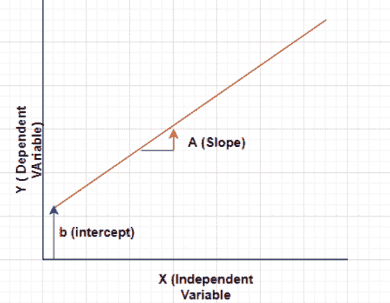
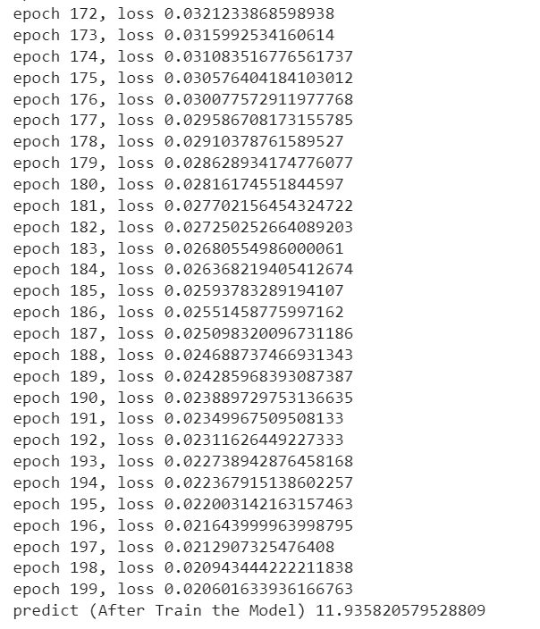
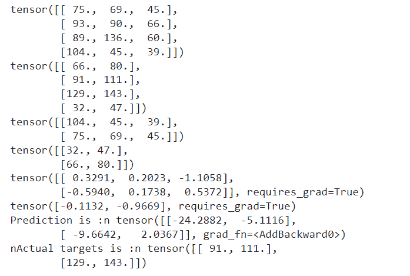
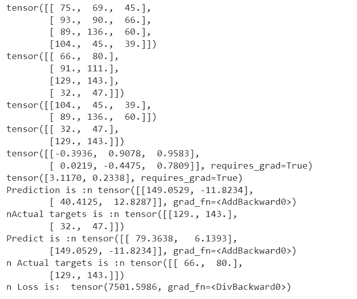
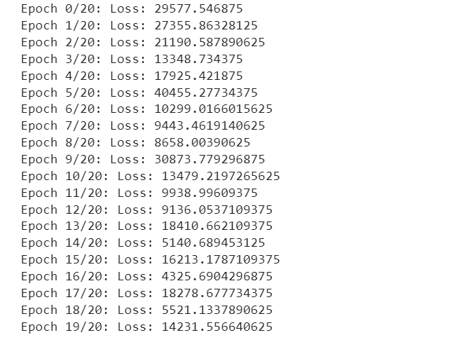
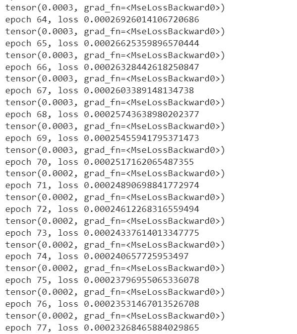
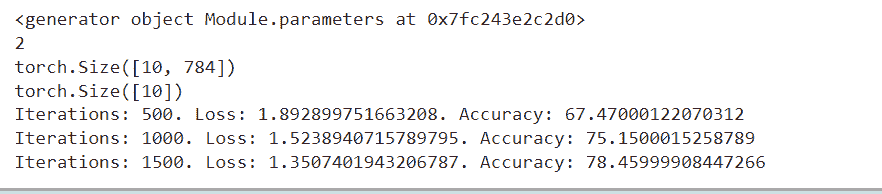

# PyTorch 线性回归[有 7 个有用的例子]

> 原文：<https://pythonguides.com/pytorch-linear-regression/>

[](https://sharepointsky.teachable.com/p/python-and-machine-learning-training-course)

在本 [Python 教程](https://pythonguides.com/learn-python/)中，我们将学习 ***PyTorch 线性回归*** 。 **PyTorch 线性回归**是一个通过减小距离来寻找因变量和自变量之间的线性关系的过程。此外，我们还将介绍与 ***PyTorch 线性回归*** 相关的不同示例。也涵盖了这些主题。

*   PyTorch 线性回归
*   PyTorch 线性回归从零开始
*   PyTorch 线性回归数据加载器
*   PyTorch 线性回归损失
*   PyTorch 线性回归梯度下降
*   正则化 PyTorch 线性回归
*   PyTorch 线性回归精度

目录

[](#)

*   [PyTorch 线性回归](#PyTorch_linear_regression "PyTorch linear regression")
*   [PyTorch 线性回归从零开始](#PyTorch_linear_regression_from_scratch "PyTorch linear regression from scratch")
*   [PyTorch 线性回归数据加载器](#PyTorch_linear_regression_dataloaders "PyTorch linear regression dataloaders")
*   [PyTorch 线性回归损失](#PyTorch_linear_regression_loss "PyTorch linear regression loss")
*   [PyTorch 线性回归梯度下降](#PyTorch_linear_regression_gradient_descent "PyTorch linear regression gradient descent")
*   [PyTorch 正则化线性回归](#PyTorch_linear_regression_with_regularization "PyTorch linear regression with regularization")
*   [PyTorch 线性回归精度](#PyTorch_linear_regression_accuracy "PyTorch linear regression accuracy")

## PyTorch 线性回归

在本节中，我们将学习 python 中的 **[、PyTorch](https://pythonguides.com/what-is-pytorch/) 线性回归**。

线性回归是一种受监督的机器学习方法，它在因变量和自变量之间找到最佳拟合的线性线。它还发现了因变量和自变量之间的线性关系。

线性回归方程:

`Y = Ax+b`



PyTorch linear regression

这里 `Y` 是因变量， `x` 是自变量， `b` 是 Y 截距， `A` 是斜率的系数。

这样，我们理解了 PyTorch 线性回归。

阅读:[交叉熵损失 PyTorch](https://pythonguides.com/cross-entropy-loss-pytorch/)

## PyTorch 线性回归从零开始

在本节中，我们将从头学习 python 中的 **PyTorch 线性回归**。

线性回归在因变量和自变量之间建立了线性关系。

在线性回归中，我们建立模型并预测因变量和自变量之间的关系。

**代码:**

在下面的代码中，我们首先从 torch.autograd 导入所有必需的库，比如导入 torch 和导入变量。

*   **Xdt =可变(火炬。张量([[2.0]，[4.0]，[6.0]]):**这里我们定义的是变量 Xdt (Xdata)。这里 Xdt 是独立变量。
*   **Ydt =可变(火炬。张量([[4.0]，[8.0]，[12.0]]):**这里我们定义的是变量 Ydt (Ydata)。这里 Ydt 是因变量，这将是我们现在的数据集。
*   **类 Linearregressionmodel(torch.nn.Module):**模型是 torch . nn . module 的子类。
*   **self . linear = torch.nn.Linear(1，1):** 这里我们有一个 one input，on output 是 torch . nn . linear()函数的自变量。
*   `Model = Linearregressionmodel()`用于为线性回归模型创建一个对象。
*   **criterion = torch . nn . ms loss(size _ average = False):**这里我们将使用均方误差作为我们的损失函数。
*   **optimizer = torch . optim . SGD(model . parameters()，lr = 0.01):** 这里我们使用随机梯度下降作为我们的优化器，并且我们任意地将学习率固定为 0.01。
*   **对于范围(200)中的历元:**这里我们出现在我们的训练步骤，在训练期间我们执行以下任务 200 次，并通过传递我们的数据来执行向前传递。
*   **newvariable =变量(火炬。张量([[6.0]])**用于测试我们是否使用我们定义的模型得到正确的结果。测试未知值为 6.0。
*   **print("predict(训练完模型后)")，Model(newvariable)。【T1 项()】用于打印预测值。**

```py
# Importing Libraries
import torch 
from torch.autograd import Variable 

# Describing the variable
Xdt = Variable(torch.Tensor([[2.0], [4.0], [6.0]])) 
Ydt = Variable(torch.Tensor([[4.0], [8.0], [12.0]])) 

# Initializing the model and declaring the forward pass
class Linearregressionmodel(torch.nn.Module):
    def __init__(self): 
        super(Linearregressionmodel, self).__init__()
        # One input and one output 
        self.linear = torch.nn.Linear(1, 1)    

    def forward(self, y): 
        Ypred = self.linear(y) 
        return Ypred 

# Creating an object for linear regression model
Model = Linearregressionmodel() 

# Select optimizerand loss criteria
criterion = torch.nn.MSELoss(size_average = False) 
optimizer = torch.optim.SGD(Model.parameters(), lr = 0.01) 

# Training the model
for epoch in range(200): 
    # Forward pass: Compute predicted y by passing x to the model 
    predy = Model(Xdt) 
    # Compute and print loss 
    loss = criterion(predy, Ydt) 
    # Zero gradients, perform a backward pass, And update the weights. 
    optimizer.zero_grad() 
    loss.backward() 
    optimizer.step() 
    print('epoch {}, loss {}'.format(epoch, loss.item())) 

# Test if getting the correct result using the model
newvariable = Variable(torch.Tensor([[6.0]])) 
predy = Model(newvariable) 
print("predict (After Train the Model)", Model(newvariable).item()) 
```

**输出:**

运行上面的代码后，我们得到了下面的输出，其中我们可以看到，我们的模型固有地学习输入数据和输出数据之间的关系，而无需显式编程。



PyTorch linear regression from scratch

因此，我们从头开始理解 PyTorch 线性回归。

阅读: [PyTorch 提前停止](https://pythonguides.com/pytorch-early-stopping/)

## PyTorch 线性回归数据加载器

在本节中，我们将学习 python 中的 **PyTorch 线性回归数据加载器**。

在线性回归中，输出标注表示为使用权重和偏差的输入要素的线性函数，这些权重和偏差是模型参数。

**代码:**

在下面的代码中，首先我们将导入所有必要的库，如 import torch，并将 numpy 作为 np 导入。

*   **inputvar = np.array([[75，69，45]，[93，90，66]，[89，136，60]，[104，45，39]]，dtype = ' float 32 '):**我们在这里加载数据。
*   `input var = torch . from _ numpy(input var)`用于将 numpy 数组转换为 torch 张量。
*   `print(inputvar)` 用于打印输入值。
*   **dataset = TensorDataset(input var，targetvar)** 用于创建张量数据集。
*   **weight = torch.randn(2，3，requires_grad=True)** 用于使用 torch.randn()函数定义权重变量。
*   **bias = torch.randn(2，requires_grad=True)** 用于通过使用 torch.randn()函数来定义偏差变量。
*   **打印(重量)**用于打印重量。
*   **打印(偏差)**用于打印偏差。
*   `preds = model(a)` 用于打印模型输出。

```py
# Importing libraries
import torch
import numpy as np

# Loading the data
inputvar = np.array([[75, 69, 45], 
                   [93, 90, 66], 
                   [89, 136, 60], 
                   [104, 45, 39]],
                  dtype='float32')
targetvar = np.array([[66, 80], 
                    [91, 111], 
                    [129, 143], 
                    [32, 47]],  
                   dtype='float32')
# Convert to the torch tensor
inputvar = torch.from_numpy(inputvar)
targetvar = torch.from_numpy(targetvar)
# Print the inputs and outputs
print(inputvar)
print(targetvar)

# Create a tensordataset
from torch.utils.data import TensorDataset
dataset = TensorDataset(inputvar, targetvar)
dataset[:2]

# Using Dataloaders class
from torch.utils.data import DataLoader

batchsiz = 2
trainingloader = DataLoader(dataset, batch_size=batchsiz, shuffle=True)
# Acess the data from the dataloaders
 a Batch Sample
for input,tar in trainingloader:
    print(input)
    print(tar)
    break

# Define a set of weights and bias
weight = torch.randn(2, 3, requires_grad=True)
bias = torch.randn(2, requires_grad=True)
print(weight)
print(bias)

# Equation of linear regression
def model(y):
    return y @ weight.t() + bias

# Predict the model output
for a,b in trainingloader:
    preds = model(a)
    print("Prediction is :n",preds)
    print("nActual targets is :n",b)
    break
```

**输出:**

在下面的输出中，您可以看到 PyTorch 线性回归数据加载器计算预测和实际目标，预测和实际目标的值打印在屏幕上。



PyTorch linear regression dataloaders

这就是我们如何使用 Pytorch 线性回归数据加载器来计算预测和实际目标。

阅读:[py torch ms loss](https://pythonguides.com/pytorch-mseloss/)

## PyTorch 线性回归损失

在本节中，我们将了解 python 中的 **PyTorch 线性回归损失**。

在线性回归中，损失函数用于计算模型的性能以及我们的模型的性能。损失函数也用于改进超参数，使得损失的结果值将更小。

**代码:**

在下面的代码中，首先我们将导入所有必要的库，如 import torch，import numpy as np。

*   **def ms loss(predict，targ):** 用于定义损失函数。
*   **difference = predict–targ:**这里的均方误差定义了实际值和预测值之差的平方平均值。
*   **print("n Loss is:"，ms Loss(preds，b))** 用于打印损失。

```py
# Importing libraries
import torch
import numpy as np

# Loading the data
inputvar = np.array([[75, 69, 45], 
                   [93, 90, 66], 
                   [89, 136, 60], 
                   [104, 45, 39]],
                  dtype='float32')
targetvar = np.array([[66, 80], 
                    [91, 111], 
                    [129, 143], 
                    [32, 47]],  
                   dtype='float32')
# Convert to the torch tensor
inputvar = torch.from_numpy(inputvar)
targetvar = torch.from_numpy(targetvar)
# Print the inputs and outputs
print(inputvar)
print(targetvar)

# Create a tensordataset
from torch.utils.data import TensorDataset
dataset = TensorDataset(inputvar, targetvar)
dataset[:2]

# Using Dataloaders class
from torch.utils.data import DataLoader

batchsiz = 2
trainingloader = DataLoader(dataset, batch_size=batchsiz, shuffle=True)
# Acess the data from the dataloaders
# A Batch Sample
for input,tar in trainingloader:
    print(input)
    print(tar)
    break

# Define a set of weights and bias
weight = torch.randn(2, 3, requires_grad=True)
bias = torch.randn(2, requires_grad=True)
print(weight)
print(bias)

# Equation of linear regression
def model(y):
    return y @ weight.t() + bias

# Predict the model output
for a,b in trainingloader:
    preds = model(a)
    print("Prediction is :n",preds)
    print("nActual targets is :n",b)
    break
# Defining the loss function
def MSEloss(predict, targ):
    difference = predict - targ
    return torch.sum(difference * difference)/ difference.numel()

# Calculate the loss
for a,b in trainingloader:
    preds = model(a)
    print("Predict is :n",preds)
    print("n Actual targets is :n",b)
    print("n Loss is: ",MSEloss(preds, b))
    break 
```

**输出:**

运行上面的代码后，我们得到下面的输出，其中我们可以看到 PyTorch 线性回归损失值打印在屏幕上。



Pytorch linear regression loss

这样，我们了解了 PyTorch 线性回归损失函数。

阅读:[Keras Vs py torch–主要区别](https://pythonguides.com/keras-vs-pytorch/)

## PyTorch 线性回归梯度下降

在本节中，我们将学习 python 中的 **PyTorch 线性回归梯度下降**。

在线性回归中，梯度下降被定义为寻找可微函数的局部最小值的优化算法。

这是一种优化算法，它计算损失函数的梯度，以更新权重和减少损失，并找到损失函数的最小值。

**代码:**

在下面的代码中，首先我们将导入所有必要的库，如 import torch，import numpy as np。

*   **loss = ms loss(preds，b)** 用于计算损失函数。
*   `loss.backward()` 用于求损失相对于自变量的梯度。
*   `weight -= weight.grad *1e-6` 用于更新权重。
*   `bias -= bias.grad * 1e-6` 用于更新偏差。

```py
# Importing libraries
import torch
import numpy as np

# Loading the data
inputvar = np.array([[75, 69, 45], 
                   [93, 90, 66], 
                   [89, 136, 60], 
                   [104, 45, 39]],
                  dtype='float32')
targetvar = np.array([[66, 80], 
                    [91, 111], 
                    [129, 143], 
                    [32, 47]],  
                   dtype='float32')
# Convert to the torch tensor
inputvar = torch.from_numpy(inputvar)
targetvar = torch.from_numpy(targetvar)
# Print the inputs and outputs
print(inputvar)
print(targetvar)

# Create a tensordataset
from torch.utils.data import TensorDataset
dataset = TensorDataset(inputvar, targetvar)
dataset[:2]

# Using Dataloaders class
from torch.utils.data import DataLoader

batchsiz = 2
trainingloader = DataLoader(dataset, batch_size=batchsiz, shuffle=True)
# Acess the data from the dataloaders
# A Batch Sample
for input,tar in trainingloader:
    print(input)
    print(tar)
    break

# Define a set of weights and bias
weight = torch.randn(2, 3, requires_grad=True)
bias = torch.randn(2, requires_grad=True)
print(weight)
print(bias)

# Equation of linear regression
def model(y):
    return y @ weight.t() + bias

# Predict the model output
for a,b in trainingloader:
    preds = model(a)
    print("Prediction is :n",preds)
    print("nActual targets is :n",b)
    break
# Defining the loss function
def MSEloss(predict, targ):
    difference = predict - targ
    return torch.sum(difference * difference)/ difference.numel()

# Calculate the loss
for a,b in trainingloader:
    preds = model(a)
    print("Predict is :n",preds)
    print("n Actual targets is :n",b)
    print("n Loss is: ",MSEloss(preds, b))
    break
# Implementing gradient descent for 20 epochs
epochs = 20
for x in range(epochs):
    # Iterate through training dataloader
    for a,b in trainingloader:
        # Generate Prediction
        preds = model(a)
        # Get the loss and perform backpropagation
        loss = MSEloss(preds, b)
        loss.backward()
        # Let's update the weights
        with torch.no_grad():
            weight -= weight.grad *1e-6
            bias -= bias.grad * 1e-6
            # Set the gradients to zero
            weight.grad.zero_()
            bias.grad.zero_()
    print(f"Epoch {x}/{epochs}: Loss: {loss}")
```

**输出:**

在下面的输出中，您可以看到 PyTorch 线性回归梯度下降值打印在屏幕上。



PyTorch linear regression gradient descent

这就是我们如何使用 Pytorch 线性回归梯度下降来计算损失梯度，以更新权重和偏差。

阅读: [PyTorch 负载模型+示例](https://pythonguides.com/pytorch-load-model/)

## PyTorch 正则化线性回归

在本节中，我们将学习 python 中的 **PyTorch 线性回归和正则化**。

在初始化优化器期间， `weight_decay` 参数应用了**正则化**，并将正则化添加到损失中。

**代码:**

在下面的代码中，我们将导入所有必要的库，如 import torch、import variable from torch . autograded 和 import numpy as num。

*   **xval = [i for i in range(11)]** 用于创建用于训练的虚拟数据。
*   **类 Linearregressionmodel(torch.nn.Module):**模型是 torch . nn . module 的子类。
*   **model = linear regression(input dim，outputdim)** 用于初始化线性回归模型。
*   `criterion = torch . nn . ms loss()`用于计算损失。
*   **optimizer = torch . optim . SGD(model . parameters()、lr=lR)** 用于初始化优化器。
*   **输入=变量(torch.from_numpy(Xtrain))。**(cuda())用于将输入转换为变量。
*   `optimizer.zero_grad()` 用于清除梯度缓冲区，因为我们不希望任何来自前一个时期的梯度结转，也不希望累积梯度。
*   `output = model(input)` 用于从模型中获取输出。
*   **loss = criterion(output，lbl)** 用于获得预测输出的损失。
*   `optimizer.step()` 用于更新参数。
*   **打印(' epoch {}，loss {} '。format(epoch，loss . item())**用于打印历元和损失值。

```py
# Importing libraries
import torch
from torch.autograd import Variable
import numpy as num

# create dummy data for training
xval = [i for i in range(11)]
Xtrain = num.array(xval, dtype=np.float32)
Xtrain = Xtrain.reshape(-1, 1)

yval = [2*i + 1 for i in xval]
Ytrain = num.array(yval, dtype=np.float32)
Ytrain = Ytrain.reshape(-1, 1)

# Create a model class
class linearRegression(torch.nn.Module):
    def __init__(self, inputSize, outputSize):
        super(linearRegression, self).__init__()
        self.linear = torch.nn.Linear(inputSize, outputSize)

    def forward(self, y):
        out = self.linear(y)
        return out
# Instantiate the model 
# takes variable 'x' 
inputdim = 1        
# takes variable 'y'
outputdim = 1       
lR = 0.01 
epochs = 80

# Initialize the model
model = linearRegression(inputdim, outputdim)
# For GPU 
if torch.cuda.is_available():
    model.cuda()
# Define the loss function
criterion = torch.nn.MSELoss()
# Initialize the optimizer
optimizer = torch.optim.SGD(model.parameters(), lr=lR)
# Train our model
for epoch in range(epochs):
    # Converting input and label to Variable
    if torch.cuda.is_available():
        input = Variable(torch.from_numpy(Xtrain).cuda())
        label = Variable(torch.from_numpy(Ytrain).cuda())
    else:
        input = Variable(torch.from_numpy(Xtrain))
        lbl = Variable(torch.from_numpy(Ytrain))

    # Clear gradient buffers because we don't want any gradient from previous epoch to carry forward, dont want to cummulate gradients
    optimizer.zero_grad()

    # get output from the model, given the inputs
    output = model(input)

    # get loss for the predicted output
    loss = criterion(output, lbl)
    print(loss)
    # get gradients w.r.t to parameters
    loss.backward()

    # update parameters
    optimizer.step()

    print('epoch {}, loss {}'.format(epoch, loss.item()))
```

**输出:**

在下面的输出中，您可以看到屏幕上打印了带有正则化值的 PyTorch 线性回归。



PyTorch linear regression with regularization

至此，我们了解了 PyTorch 正则化线性回归。

阅读:[亚当优化器 PyTorch](https://pythonguides.com/adam-optimizer-pytorch/)

## PyTorch 线性回归精度

在本节中，我们将学习 python 中的 **PyTorch 线性回归精度**。

线性回归在因变量和自变量之间建立了线性关系。

准确性被定义为评估模型的过程。准确性是模型预测正确的比例。

**代码:**

在下面的代码中，首先我们将导入所有必要的库，如 import torch，import torch.nn as nn，import torch vision . transforms as transforms，import torch vision . datasets as dtset。

*   trainds = dtset。MNIST(root= '。/data '，train=True，transform=transforms。ToTensor()，download=True) 用于加载数据集。
*   `len(trainds)` 用于找出训练数据集的长度。
*   `numepoch = int(numepoch)` 用于获取 numepoch 整数值。
*   **类 Linearregressionmodel(torch.nn.Module):**模型是 torch . nn . module 的子类。
*   **models = Linearregressionmodel(InP dim，outdim)** 用于初始化模型类。
*   **判据= nn。CrossEntropyLoss()** 用于计算输入和目标变量之间的交叉熵损失。
*   **optimizer = torch . optim . SGD(models . parameters()、lr=l_r)** 用于初始化优化器。
*   `print(len(list(models . parameters()))`用于打印参数的长度。
*   `optimizer . zero _ grad()`用于清除渐变。
*   **loss = crimes(outps，lbls)** 用于计算损失。
*   `totals += lbls.size(0)` 用于计算标签总数。
*   **校正+=(预测= = lbls)。sum()** 用作正确预测的总数。
*   **打印('迭代次数:{}。损失:{}。准确性:{} '。format(iters，losses.item()，accuracy))** 用于在屏幕上打印迭代。

```py
# Importing libraries
import torch
import torch.nn as nn
import torchvision.transforms as transforms
import torchvision.datasets as dtset

# Loading dataset
trainds = dtset.MNIST(root='./data', 
                            train=True, 
                            transform=transforms.ToTensor(),
                            download=True)
len(trainds)
testds = dtset.MNIST(root='./data', 
                           train=False, 
                           transform=transforms.ToTensor())
len(testds)
# Instantiate the model class
batchsiz = 100
niter = 2000
numepoch = niter / (len(trainds) / batchsiz)
numepoch = int(numepoch)
numepoch

# Dataloaders
trainloadr = torch.utils.data.DataLoader(dataset=trainds, 
                                           batch_size=batchsiz, 
                                           shuffle=True)

testloadr = torch.utils.data.DataLoader(dataset=testds, 
                                          batch_size=batchsiz, 
                                          shuffle=False)

# Create the model class
class Linearregressionmodel(torch.nn.Module):
    def __init__(self,inpdim,outdim): 
        super(Linearregressionmodel, self).__init__()
        # One input and one output 
        self.linear = torch.nn.Linear(inpdim,outdim)    

    def forward(self, y): 
        Ypred = self.linear(y) 
        return Ypred 
inpdim = 28*28
outdim = 10

# Initializing the model
models = Linearregressionmodel(inpdim, outdim)
# Define the loss
criterions = nn.CrossEntropyLoss()  
l_r = 0.001

# Initialize the optimizer
optimizers = torch.optim.SGD(models.parameters(), lr=l_r)  

print(models.parameters())
print(len(list(models.parameters())))

print(list(models.parameters())[0].size())

print(list(models.parameters())[1].size())
# Train the model
iters = 0
for epoch in range(numepoch):
    for x, (imgs, lbls) in enumerate(trainloadr):

        imgs = imgs.view(-1, 28*28).requires_grad_()
        label = lbls

        optimizers.zero_grad()

        # Forward pass to get output/logits
        outps = models(imgs)

        losses = criterions(outps, lbls)

        losses.backward()

        optimizers.step()

        iters += 1

        if iters % 500 == 0:

            corrects = 0
            totals = 0

            for imgs, lbls in testloadr:

                imgs = imgs.view(-1, 28*28).requires_grad_()

                outps = models(imgs)

                _, predict = torch.max(outps.data, 1)

                totals += lbls.size(0)

                corrects += (predict == lbls).sum()

            accuracy = 100 * corrects / totals

            print('Iterations: {}. Loss: {}. Accuracy: {}'.format(iters, losses.item(), accuracy))
```

**输出:**

运行上面的代码后，我们得到下面的输出，其中我们可以看到 PyTorch 线性回归精度值打印在屏幕上。



PyTorch linear regression accuracy

这就是我们如何计算 PyTorch 线性回归精度。

另外，看看更多的 Python PyTorch 教程。

*   【numpy 指针为张量
*   [PyTorch 激活功能](https://pythonguides.com/pytorch-activation-function/)
*   [PyTorch MNIST 教程](https://pythonguides.com/pytorch-mnist/)
*   [PyTorch 车型总结](https://pythonguides.com/pytorch-model-summary/)
*   [Jax Vs PyTorch【主要区别】](https://pythonguides.com/jax-vs-pytorch/)

因此，在本教程中，我们讨论了 **Pytorch 线性回归**,我们还涵盖了与其实现相关的不同示例。这是我们已经讨论过的例子列表。

*   PyTorch 线性回归
*   PyTorch 线性回归从零开始
*   PyTorch 线性回归数据加载器
*   PyTorch 线性回归损失
*   PyTorch 线性回归梯度下降
*   正则化 PyTorch 线性回归
*   PyTorch 线性回归精度

[Bijay Kumar](https://pythonguides.com/author/fewlines4biju/)

Python 是美国最流行的语言之一。我从事 Python 工作已经有很长时间了，我在与 Tkinter、Pandas、NumPy、Turtle、Django、Matplotlib、Tensorflow、Scipy、Scikit-Learn 等各种库合作方面拥有专业知识。我有与美国、加拿大、英国、澳大利亚、新西兰等国家的各种客户合作的经验。查看我的个人资料。

[enjoysharepoint.com/](https://enjoysharepoint.com/)[](https://www.facebook.com/fewlines4biju "Facebook")[](https://www.linkedin.com/in/fewlines4biju/ "Linkedin")[](https://twitter.com/fewlines4biju "Twitter")