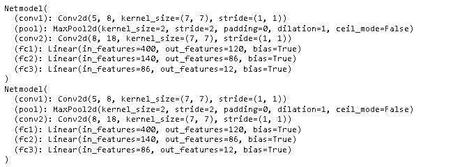
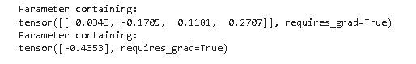

# PyTorch 负载模型+示例

> 原文：<https://pythonguides.com/pytorch-load-model/>

[](https://sharepointsky.teachable.com/p/python-and-machine-learning-training-course)

在这个 [Python 教程](https://pythonguides.com/learn-python/)中，我们将学习 **PyTorch 负载模型**，我们还将涵盖与 PyTorch 负载模型相关的不同示例。我们将讨论这些话题。

*   PyTorch 负荷模型
*   PyTorch 负载模型示例
*   PyTorch 加载模型检查点
*   PyTorch 将模型加载到 GPU
*   用于推理的 PyTorch 负载模型
*   PyTorch 负载模型继续培训
*   PyTorch 将模型加载到设备
*   PyTorch 从 bin 文件加载模型
*   来自 pth 路径的 PyTorch 负载模型
*   没有类的 PyTorch 负载模型

目录

[](#)

*   [PyTorch 负荷模型](#PyTorch_load_model "PyTorch load model")
*   [PyTorch 负载模型示例](#PyTorch_load_model_example "PyTorch load model example")
*   [PyTorch 加载模型检查点](#PyTorch_load_model_checkpoint "PyTorch load model checkpoint")
*   [PyTorch 加载模型到 GPU](#PyTorch_load_model_to_GPU "PyTorch load model to GPU")
*   [PyTorch 用于推理的负荷模型](#PyTorch_load_model_for_inference "PyTorch load model for inference")
*   [PyTorch 负载模型继续训练](#PyTorch_load_model_continue_training "PyTorch load model continue training")
*   [PyTorch 向设备加载模型](#PyTorch_load_model_to_the_device "PyTorch load model to the device")
*   [PyTorch 从 bin 文件加载模型](#PyTorch_load_model_from_bin_file "PyTorch load model from bin file")
*   [来自 pth 路径的 PyTorch 负载模型](#PyTorch_load_model_from_pth_path "PyTorch load model from pth path")
*   [PyTorch 无类负载模型](#PyTorch_load_model_without_class "PyTorch load model without class")

## PyTorch 负荷模型

在本节中，我们将了解如何用 python 加载 PyTorch 模型。

*   [PyTorch](https://pythonguides.com/what-is-pytorch/) 加载模型定义为保存数据后加载模型的过程。
*   函数 `torch.load()` 用于加载数据，它是一个解包工具，但处理张量下划线的存储。

**语法:**

在这种语法中，我们将加载模型的数据。

```py
torch.load(f,map_location=None,pickle_module,pickle_load_args)
```

**参数:**

*   `f` 是一个类似文件的对象，有实现 read()、tell()等或字符串。在类路径对象中保存一个文件名。
*   `map_location` 是标识如何编辑存储位置的函数或字符串。
*   `pickle_module` 用于解包元数据。
*   `pickle_load_args` 被用作可选的关键字参数，该参数传递给 pickle_module.load()。

阅读: [PyTorch 批量标准化](https://pythonguides.com/pytorch-batch-normalization/)

## PyTorch 负载模型示例

在这一节中，我们将了解如何借助 python 中的示例来**加载 PyTorch 模型**。

`Torch.load()` 函数用于加载模型，它是一个非拾取工具，但它处理强调张量的存储。

**代码:**

在下面的代码中，我们导入了一些库，从中我们可以加载我们的模型。

*   **nn。MaxPool2d(2，2)** 用于应用于从多个输入平面采集的输入信号。
*   **nn。线性()**用于制作前馈网络。
*   优化者= optim。SGD(models.parameters()，lr=0.001，momentum=0.9) 用于初始化模型。
*   **print(param_tensor，" \t "，models . state _ dict()[param _ tensor]。**(size())用于打印模型。
*   `torch.save()` 用于保存模型。
*   `models.load_state_dict()` 用于加载模型。

```py
import torch
from torch import nn
import torch.optim as optim
import torch.nn.functional as f
**# Define model**
class TheModelClass(nn.Module):
    def __init__(self):
        super(TheModelClass, self).__init__()
        self.conv1 = nn.Conv2d(5, 8, 7)
        self.pool = nn.MaxPool2d(2, 2)
        self.conv2 = nn.Conv2d(8, 18, 7)
        self.fc1 = nn.Linear(18 * 7 * 7, 140)
        self.fc2 = nn.Linear(140, 86)
        self.fc3 = nn.Linear(86, 12)

    def forward(self, X):
        X = self.pool(F.relu(self.conv1(X)))
        X = self.pool(F.relu(self.conv2(X)))
        X = x.view(-1, 16 * 5 * 5)
        X = f.relu(self.fc1(X))
        X = f.relu(self.fc2(X))
        X = self.fc3(X)
        return X

models = TheModelClass()

 **# Initialize optimizer**
optimizers = optim.SGD(models.parameters(), lr=0.001, momentum=0.9)

print("Models state_dict:")
for param_tensor in models.state_dict():
    print(param_tensor, "\t", models.state_dict()[param_tensor].size())

print("Optimizers state_dict:")
for var_name in optimizers.state_dict():
    print(var_name, "\t", optimizers.state_dict()[var_name])
torch.save(models.state_dict(), 'model_weights.pth')
models.load_state_dict(torch.load('model_weights.pth'))
models.eval()
```

**输出:**

运行上述代码后，我们得到以下输出，从中我们可以看到装载模型数据被打印在屏幕上。


PyTorch load model example

阅读: [PyTorch 保存模型–完整指南](https://pythonguides.com/pytorch-save-model/)

## PyTorch 加载模型检查点

在本节中，我们将学习 Python 中的 **PyTorch 加载模型检查点**。

PyTorch 加载模型检查点用于加载模型。为了加载模型，我们可以首先初始化模型，然后加载优化器。

**代码:**

在下面的代码中，我们将导入一些库，从中可以加载检查点。

*   **优化器=优化器。SGD(net.parameters()，lr=0.001，momentum=0.9)** 用于初始化优化器。
*   `torch.save()` 用于保存模型。
*   `checkpoint = torch.load()` 用于加载模型。

```py
import torch
import torch.nn as nn
import torch.optim as optim
class net(nn.Module):
    def __init__(self):
        super(net, self).__init__()
        self.conv1 = nn.Conv2d(5, 8, 7)
        self.pool = nn.MaxPool2d(2, 2)
        self.conv2 = nn.Conv2d(8, 18, 7)
        self.fc1 = nn.Linear(18 * 5 * 5, 140)
        self.fc2 = nn.Linear(140, 86)
        self.fc3 = nn.Linear(86, 12)

    def forward(self, X):
        X = self.pool(f.relu(self.conv1(X)))
        X = self.pool(f.relu(self.conv2(X)))
        X = X.view(-1, 16 * 5 * 5)
        X = f.relu(self.fc1(X))
        X = f.relu(self.fc2(X))
        X = self.fc3(X)
        return X

netout = net()
print(netout)
optimizers = optim.SGD(netout.parameters(), lr=0.001, momentum=0.9)
**# Additional information**
epoch = 7
path = "model.pt"
loss = 0.6

torch.save({
            'epoch': epoch,
            'model_state_dict': netout.state_dict(),
            'optimizer_state_dict': optimizers.state_dict(),
            'loss': loss,
            }, path)
models = net()
optimizers = optim.SGD(netout.parameters(), lr=0.001, momentum=0.9)

CheckPoint = torch.load(path)
models.load_state_dict(CheckPoint['model_state_dict'])
optimizers.load_state_dict(CheckPoint['optimizer_state_dict'])
Epoch = CheckPoint['epoch']
Loss = CheckPoint['loss']

models.eval()
```

**输出:**

运行上面的代码后，我们得到了下面的输出，其中我们可以看到屏幕上加载了模型检查点。


Pytorch load model checkpoint

阅读:[Python 中的 Scikit 学的是什么](https://pythonguides.com/what-is-scikit-learn-in-python/)

## PyTorch 加载模型到 GPU

在本节中，我们将学习如何用 Python 将模型加载到 GPU 中。

PyTorch load model to GPU 用于将模型加载到 GPU。首先，我们将初始化数据，初始化后保存数据，然后，我们将加载模型到 GPU。

**代码:**

在下面的代码中，我们将导入一些库来将我们的模型加载到 GPU。

*   `Path = "model.pt"` 用于给出我们的模型保存的路径，或者保存后我们可以加载一个模型到这个路径。
*   **torch.save(net.state_dict()，Path)** 用于保存模型。
*   `torch.device("cuda")` 用于设置和运行 cuda 操作。
*   `model . load _ state _ dict(torch . load(Path))`用于加载模型。

```py
import torch
from torch import nn
from torch import optim
import torch.nn.functional as f
class model(nn.Module):
    def __init__(self):
        super(model, self).__init__()
        self.conv1 = nn.Conv2d(5, 8, 7)
        self.pool = nn.MaxPool2d(2, 2)
        self.conv2 = nn.Conv2d(8, 18, 7)
        self.fc1 = nn.Linear(16 * 5 * 5, 120)
        self.fc2 = nn.Linear(140, 86)
        self.fc3 = nn.Linear(86, 12)

    def forward(self, X):
        X = self.pool(f.relu(self.conv1(X)))
        X = self.pool(f.relu(self.conv2(X)))
        X = x.view(-1, 16 * 5 * 5)
        X = f.relu(self.fc1(X))
        X = f.relu(self.fc2(X))
        X = self.fc3(X)
        return X

netout = model()
print(netout)
Path = "model.pt"
**# save**
torch.save(netout.state_dict(), Path)

**# load**
device = torch.device("cuda")
model = model()
model.load_state_dict(torch.load(Path))
model.to(device)
```

**输出:**

在下面的代码中，我们在初始化后初始化模型保存我们的模型保存模型后，我们可以再次加载模型，并将模型加载到 GPUdata 显示在屏幕上。


Pytorch load model to gpu

阅读:[Python 中的 tensor flow](https://pythonguides.com/tensorflow/)

## PyTorch 用于推理的负荷模型

在本节中，我们将学习 Python 中用于推理的 **PyTorch 加载模型。**

PyTorch 推理负荷模型被定义为得出结论的证据和推理。

**代码:**

在下面的代码中，我们将导入一些库，从中可以加载我们的模型。

*   **优化器=优化器。SGD(net.parameters()，lr=0.001，momentum=0.9)** 用于初始化优化器。
*   `Path = " state _ dict _ model . pt "`用于给出模型的路径。
*   **torch.save(net.state_dict()，Path)** 用于保存模型。
*   `model . load _ state _ dict(torch . load(Path))`用于加载模型。

```py
import torch
from torch import nn
import torch.optim as optimizer
import torch.nn.functional as f
class net(nn.Module):
    def __init__(self):
        super(net, self).__init__()
        self.conv1 = nn.Conv2d(5, 8, 7)
        self.pool = nn.MaxPool2d(2, 2)
        self.conv2 = nn.Conv2d(8, 18, 7)
        self.fc1 = nn.Linear(16 * 5 * 5, 120)
        self.fc2 = nn.Linear(140, 86)
        self.fc3 = nn.Linear(86, 12)

    def forward(self, X):
        X = self.pool(f.relu(self.conv1(x)))
        X = self.pool(f.relu(self.conv2(x)))
        X = x.view(-1, 16 * 5 * 5)
        X = f.relu(self.fc1(X))
        X = f.relu(self.fc2(X))
        X = self.fc3(X)
        return X_test

netoutput = net()
print(netoutput)
optimizer = optimizer.SGD(netoutput.parameters(), lr=0.001, momentum=0.9)

Path = "state_dict_model.pt"

torch.save(netoutput.state_dict(), Path)

model = net()
model.load_state_dict(torch.load(Path))
model.eval() 
```

**输出:**

运行上面的代码后，我们得到下面的输出，其中我们可以看到 PyTorch 负载模型推断数据被打印在屏幕上。


Pytorch load model inference

阅读:[张量流得到形状](https://pythonguides.com/tensorflow-get-shape/)

## PyTorch 负载模型继续训练

在本节中，我们将学习 python 中的 **PyTorch 负载模型继续培训**。

py torch load model continues training 定义为一个持续训练模型并借助 `torch.load()` 函数加载模型的过程。

**代码:**

在下面的代码中，我们将导入一些库，我们可以从这些库中加载持续培训模型。

*   **优化器= optim。SGD(net.parameters()，lr=0.001，momentum=0.9)** 用于初始化优化器。
*   `torch.save()` 用于保存模型。
*   `optimizer . load _ state _ dict()`用于加载继续训练模型。
*   `model.eval()` 用于评估模型。

```py
import torch
import torch.nn as nn
import torch.optim as optim
class train_model(nn.Module):
    def __init__(self):
        super(train_model, self).__init__()
        self.conv1 = nn.Conv2d(5, 8, 7)
        self.pool = nn.MaxPool2d(2, 2)
        self.conv2 = nn.Conv2d(8, 18, 7)
        self.fc1 = nn.Linear(16 * 5 * 5, 120)
        self.fc2 = nn.Linear(140, 86)
        self.fc3 = nn.Linear(86, 12)

    def forward(self, X):
        X = self.pool(F.relu(self.conv1(X)))
        X = self.pool(F.relu(self.conv2(X)))
        X = X.view(-1, 16 * 5 * 5)
        X = F.relu(self.fc1(X))
        X = F.relu(self.fc2(X))
        x = self.fc3(X)
        return X
netoutput = train_model()
#print(netoutput)
optimizers = optim.SGD(netoutput.parameters(), lr=0.001, momentum=0.9)
epoch = 7
path = "model.pt"
loss = 0.6
torch.save({
            'epoch': epoch,
            'model_state_dict': netoutput.state_dict(),
            'optimizers_state_dict': optimizers.state_dict(),
            'loss': loss,
            }, path)

models = train_model()
optimizers = optim.SGD(models.parameters(), lr=0.001, momentum=0.9)

CheckPoint = torch.load(path)
models.load_state_dict(CheckPoint['model_state_dict'])
optimizers.load_state_dict(CheckPoint['optimizers_state_dict'])
Epoch = CheckPoint['epoch']
Loss = CheckPoint['loss']

models.eval()

models.train()
```

**输出:**

运行上面的代码后，我们得到下面的输出，其中我们可以看到屏幕上加载了继续训练模型。


PyTorch load model continue training

阅读: [PyTorch 张量到 Numpy](https://pythonguides.com/pytorch-tensor-to-numpy/)

## PyTorch 向设备加载模型

在本节中，我们将学习如何用 python 将 PyTorch 模型加载到设备中。

PyTorch load model to the device 用于借助 `torch.load()` 函数将多个组件加载到设备中。

**代码:**

在下面的代码中，我们将导入一些库，从这些库中我们可以将模型加载到设备中。

*   **优化器=优化器。SGD(netoutput.parameters()，lr=0.001，momentum=0.9)** 用于初始化优化器。
*   `Path = " state _ dict _ model . pt "`用于指定路径。
*   **torch . save(net output . state _ dict()，Path)** 用于将模型保存到 cpu。
*   `models . load _ state _ dict(torch . load(Path))`用于加载模型。
*   `models.to(device)` 用于将模型加载到设备中。

```py
 import torch
from torch import nn
import torch.optim as optimizer
import torch.nn.functional as f
class Netmodel(nn.Module):
    def __init__(self):
        super(Netmodel, self).__init__()
        self.conv1 = nn.Conv2d(5, 8, 7)
        self.pool = nn.MaxPool2d(2, 2)
        self.conv2 = nn.Conv2d(8, 18, 7)
        self.fc1 = nn.Linear(16 * 5 * 5, 120)
        self.fc2 = nn.Linear(140, 86)
        self.fc3 = nn.Linear(86, 12)

    def forward(self, X):
        X = self.pool(f.relu(self.conv1(x)))
        X = self.pool(f.relu(self.conv2(x)))
        X = x.view(-1, 16 * 5 * 5)
        X = f.relu(self.fc1(X))
        X = f.relu(self.fc2(X))
        X = self.fc3(X)
        return X_test

netoutput = Netmodel()
print(netoutput)
optimizer = optimizer.SGD(netoutput.parameters(), lr=0.001, momentum=0.9)

Path = "state_dict_model.pt"

torch.save(netoutput.state_dict(), Path)

device = torch.device("cuda")
models = Netmodel()
models.load_state_dict(torch.load(Path))
models.to(device)
```

**输出:**

在下面的输出中，我们可以看到，在训练模型保存模型之后，首先打印训练模型数据，然后加载模型，加载到设备的数据打印在屏幕上。


PyTorch load model to the device

读取 [PyTorch 双星交叉熵](https://pythonguides.com/pytorch-binary-cross-entropy/)

## PyTorch 从 bin 文件加载模型

在本节中，我们将学习如何从 python 中的 bin 文件加载 PyTorch 模型。

*   在继续之前，我们应该对 bin 文件有所了解。Bin 文件是二进制文件的压缩形式。
*   二进制文件被定义为一个文件，写在文件中的内容只能由程序员和硬件来解释。
*   PyTorch 从 bin 文件加载模型定义为**借助 `torch.load()` 函数从** bin 加载模型。

**代码:**

在下面的代码中，我们将导入一些库，从中我们可以从 bin 文件中加载模型。

*   **nn。**(linear())用于制作前馈网络。
*   `File = "model.pth"` 用于给出路径。
*   **torch.save(model.state_dict()，File)** 用于保存模型。
*   `load model . load _ state _ dict()`用于加载模型。

```py
import torch
import torch.nn as nn

class Model(nn.Module):
    def __init__(self, ninput_features):
        super(Model, self).__init__()
        self.linear = nn.Linear(ninput_features, 1)

    def forward(self, X):
        ypred = torch.sigmoid(self.linear(X))
        return ypred

model = Model(ninput_features=8)

for param in model.parameters():
    print(param)

File = "model.pth"
torch.save(model.state_dict(), File)

print(model.state_dict())
loadmodel = Model(ninput_features=8)
loadmodel.load_state_dict(torch.load(File)) # it takes the loaded dictionary, not the path file itself
loadmodel.eval()

print(loadmodel.state_dict())
```

**输出:**

在下面的输出中，我们可以看到 PyTorch 模型数据从 bin 中加载并打印在屏幕上。


PyTorch load model from the bin file

阅读 [PyTorch 逻辑回归](https://pythonguides.com/pytorch-logistic-regression/)

## 来自 pth 路径的 PyTorch 负载模型

在这一节中，我们将学习如何从 python 中的路径加载**py torch 模型。**

*   PyTorch 从 pth 路径加载模型被定义为一个过程，我们可以借助于一个 `torch.load()` 函数从该过程加载我们的模型。
*   PyTorch 常规约定用于使用**保存模型。pth** 文件扩展名。

**代码:**

在下面的代码中，我们将导入一些库，从中我们可以从 pth 路径加载模型。

*   `model = ModelClass()` 用于初始化模型。
*   优化者=优化者。SGD(model.parameters()，lr=0.001，momentum=0.9) 用于初始化优化器。
*   **print(param_tensor，" \t "，model . state _ dict()[param _ tensor]。**(size())用于打印模型 state_dict。
*   **torch.save(model.state_dict()，' model_weights.pth')** 用于保存模型。
*   **model . load _ state _ dict(torch . load(' model _ weights . PTH ')**用于加载模型。
*   `model.eval()` 用于评估模型。

```py
import torch
from torch import nn
import torch.optim as optimizer
import torch.nn.functional as f
**# Define model**
class ModelClass(nn.Module):
    def __init__(self):
        super(ModelClass, self).__init__()
        self.conv1 = nn.Conv2d(5, 8, 7)
        self.pool = nn.MaxPool2d(2, 2)
        self.conv2 = nn.Conv2d(8, 18, 7)
        self.fc1 = nn.Linear(18 * 7 * 7, 140)
        self.fc2 = nn.Linear(140, 86)
        self.fc3 = nn.Linear(86, 12)

    def forward(self, X):
        X = self.pool(f.relu(self.conv1(X)))
        X = self.pool(f.relu(self.conv2(X)))
        X = x.view(-1, 16 * 5 * 5)
        X = f.relu(self.fc1(X))
        X = f.relu(self.fc2(X))
        X = self.fc3(X)
        return X

model = ModelClass()

optimizers = optimizer.SGD(model.parameters(), lr=0.001, momentum=0.9)

print("Model state_dict:")
for param_tensor in model.state_dict():
    print(param_tensor, "\t", model.state_dict()[param_tensor].size())

torch.save(model.state_dict(), 'model_weights.pth')
model.load_state_dict(torch.load('model_weights.pth'))
model.eval()
```

**输出:**

运行上面的代码后，我们得到下面的输出，其中我们可以看到模型是从 pth 路径加载到屏幕上的。



Pytorch load model to the device

## PyTorch 无类负载模型

在本节中，我们将学习 python 中没有类的 **PyTorch 加载模型。**

*   正如我们所知，我们可以在函数 `torch.load()` 的帮助下加载我们的 PyTorch 加载模型，而无需类。
*   保存模型后，我们可以加载模型，加载模型是拆包设施和处理存储。

**代码:**

在下面的代码中，我们将导入 torch 模块，我们可以从该模块加载模型，而无需类。

*   `model = train model(input features = 4)`用于初始化模型。
*   `File = "model.pth"` 用于给出文件的路径。
*   **torch.save(模型，文件)**用于保存模型。
*   `load _ model = torch . load(File)`用于加载模型，不使用类。
*   `load_model.eval()` 用于评估加载的模型。
*   `print(param)` 用于打印加载模型的参数。

```py
import torch
import torch.nn as nn
class trainmodel(nn.Module):
    def __init__(self, inputfeatures):
        super(trainmodel, self).__init__()
        self.linear = nn.Linear(inputfeatures, 1)

    def forward(self, X):
        y_pred = torch.sigmoid(self.linear(X))
        return y_pred

model = trainmodel(inputfeatures=4)
File = "model.pth"
torch.save(model, File)

load_model = torch.load(File)
load_model.eval()

for param in load_model.parameters():
    print(param)
```

**输出:**

运行上面的代码后，我们得到下面的输出，其中我们可以看到没有类数据的 PyTorch 加载模型被打印在屏幕上。



PyTorch load model without class

因此，在本教程中，我们讨论了 **PyTorch 负载模型**,我们还讨论了与其实现相关的不同示例。这是我们已经讨论过的例子列表。

*   PyTorch 负荷模型
*   PyTorch 负载模型示例
*   PyTorch 加载模型检查点
*   PyTorch 将模型加载到 GPU
*   用于推理的 PyTorch 负载模型
*   PyTorch 负载模型继续培训
*   PyTorch 将模型加载到设备
*   PyTorch 从 bin 文件加载模型
*   来自 pth 路径的 PyTorch 负载模型
*   没有类的 PyTorch 负载模型

[Bijay Kumar](https://pythonguides.com/author/fewlines4biju/)

Python 是美国最流行的语言之一。我从事 Python 工作已经有很长时间了，我在与 Tkinter、Pandas、NumPy、Turtle、Django、Matplotlib、Tensorflow、Scipy、Scikit-Learn 等各种库合作方面拥有专业知识。我有与美国、加拿大、英国、澳大利亚、新西兰等国家的各种客户合作的经验。查看我的个人资料。

[enjoysharepoint.com/](https://enjoysharepoint.com/)[](https://www.facebook.com/fewlines4biju "Facebook")[](https://www.linkedin.com/in/fewlines4biju/ "Linkedin")[](https://twitter.com/fewlines4biju "Twitter")