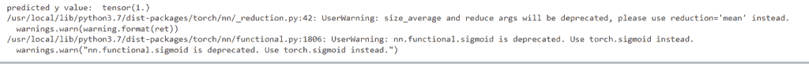
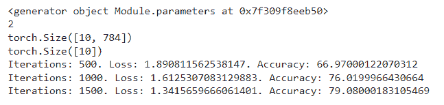
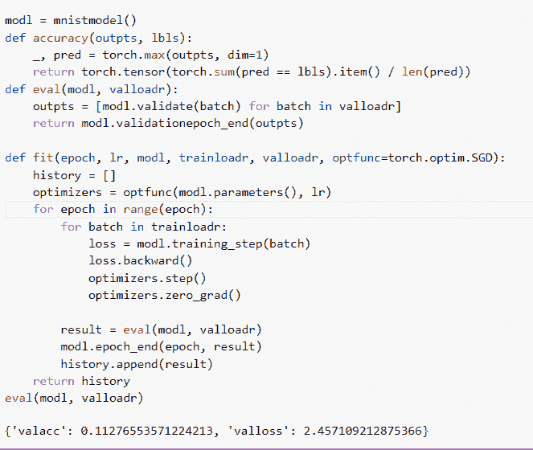
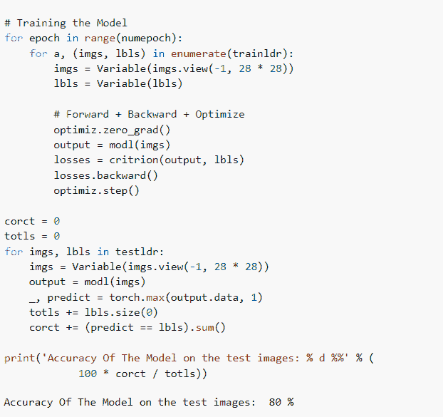
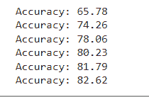
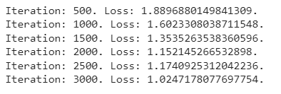
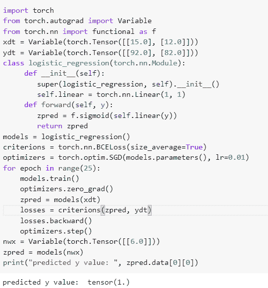

# PyTorch 逻辑回归

> 原文：<https://pythonguides.com/pytorch-logistic-regression/>

[](https://sharepointsky.teachable.com/p/python-and-machine-learning-training-course)

在本 [Python 教程](https://pythonguides.com/learn-python/)中，我们将学习 Python 中的 **PyTorch 逻辑回归**，我们还将涵盖与 PyTorch 逻辑回归相关的不同示例。我们将讨论这些话题。

*   PyTorch 逻辑回归
*   PyTorch 逻辑回归 l2
*   PyTorch 逻辑回归模型
*   PyTorch 逻辑回归准确度
*   PyTorch 逻辑回归特征重要性
*   PyTorch 逻辑回归损失函数
*   PyTorch 逻辑回归分类器

目录

[](#)

*   [PyTorch 逻辑回归](#PyTorch_logistic_regression "PyTorch logistic regression")
*   [PyTorch 逻辑回归 l2](#PyTorch_logistic_regression_l2 "PyTorch logistic regression l2")
*   [PyTorch 逻辑回归模型](#PyTorch_logistic_regression_mnist "PyTorch logistic regression mnist")
*   [PyTorch 逻辑回归准确度](#PyTorch_logistic_regression_accuracy "PyTorch logistic regression accuracy")
*   [PyTorch 逻辑回归特征重要性](#PyTorch_logistic_regression_feature_importance "PyTorch logistic regression feature importance")
*   [PyTorch 逻辑回归损失函数](#PyTorch_logistic_regression_loss_function "PyTorch logistic regression loss function")
*   [PyTorch 逻辑回归分类器](#PyTorch_logistic_regression_classifier "PyTorch logistic regression classifier")

## PyTorch 逻辑回归

在本节中，我们将学习 python 中的 **PyTorch 逻辑回归**。

**逻辑回归**定义为表达数据，解释一个因变量二元变量之间关系的过程。

**代码:**

在下面的代码中，我们将导入 torch 模块，从中我们可以进行逻辑回归。

*   `models = logistic _ regression()`用于定义模型。
*   `criteria = torch . nn . BCE loss(size _ average = True)`用于计算判据。
*   **optimizer = torch . optim . SGD(models . parameters()、lr=0.01)** 用于初始化优化器。
*   `optimizer . zero _ grad()`用于优化零梯度。
*   `ypred = models(xdata)` 用于预测模型。
*   **losses = criteria(ypred，ydata)** 用于计算损失。
*   `losses.backward()` 用于计算向后损失。
*   **print("预测 y 值: "，ypred.data[0][0])** 用于打印预测 y 值。

```py
import torch
from torch.autograd import Variable
from torch.nn import functional as f
xdata = Variable(torch.Tensor([[12.0], [11.0], [5.0], [4.0]]))
ydata = Variable(torch.Tensor([[92.0], [82.0], [52.0], [32.0]]))
class logistic_regression(torch.nn.Module):
     def __init__(self):
        super(logistic_regression, self).__init__()
        self.linear = torch.nn.Linear(1, 1)
     def forward(self, y):
        ypred = f.sigmoid(self.linear(y))
        return ypred
models = logistic_regression()
criterions = torch.nn.BCELoss(size_average=True)
optimizers = torch.optim.SGD(models.parameters(), lr=0.01)
for epoch in range(20):
    models.train()
    optimizers.zero_grad()
    **# Forward pass**
    ypred = models(xdata)
    **# Compute Loss**
    losses = criterions(ypred, ydata)
    **# Backward pass**
    losses.backward()
    optimizers.step()
x = Variable(torch.Tensor([[6.0]]))
ypred = models(x)
print("predicted y value: ", ypred.data[0][0])
```

**输出:**

运行上面的代码后，我们得到了下面的输出，其中我们可以看到预测的 y 值被打印在屏幕上。



PyTorch logistic regression

阅读:[py torch ms loss–详细指南](https://pythonguides.com/pytorch-mseloss/)

## PyTorch 逻辑回归 l2

在本节中，我们将学习 python 中的 **PyTorch 逻辑回归 l2** 。

在初始化优化器期间， `weight_decay` 参数应用了 **l2 正则化**，并将正则化添加到损失中。

**代码:**

在下面的代码中，我们将导入 torch 模块，从中我们可以找到逻辑回归。

*   trainds = dtset。MNIST(root= '。/data '，train=True，transform=transforms。ToTensor()，download=True) 作为训练数据集。
*   `len(trainds)` 用于查找训练数据集的长度。
*   `numepoch = int(numepoch)` 用于获取 numepoch 整数值。
*   **test loadr = torch . utils . data . data loader(dataset = testds，batch_size=batchsiz，shuffle=False)** 用于加载测试数据集。
*   **判据= nn。CrossEntropyLoss()** 用于计算输入和目标变量之间的交叉熵损失。
*   **optimizer = torch . optim . SGD(models . parameters()，lr=l_r** )用于初始化优化器。
*   `print(len(list(models . parameters()))`用于打印参数的长度。
*   **imgs = imgs.view(-1，28*28)。requires_grad_()** 用于加载图片作为参数。
*   `optimizer . zero _ grad()`用于清除渐变。
*   **loss = crimes(outps，lbls)** 用于计算损失。
*   `totals += lbls.size(0)` 用于计算标签总数。
*   **corrects += (predict == lbls)。sum()** 被用作正确预测的总数。
*   **打印('迭代次数:{}。损失:{}。准确性:{} '。format(iters，losses.item()，accuracy))** 用于在屏幕上打印迭代。

```py
import torch
import torch.nn as nn
import torchvision.transforms as transforms
import torchvision.datasets as dtset
trainds = dtset.MNIST(root='./data', 
                            train=True, 
                            transform=transforms.ToTensor(),
                            download=True)
len(trainds)
testds = dtset.MNIST(root='./data', 
                           train=False, 
                           transform=transforms.ToTensor())
len(testds)
batchsiz = 100
niter = 2000
numepoch = niter / (len(trainds) / batchsiz)
numepoch = int(numepoch)
numepoch
trainloadr = torch.utils.data.DataLoader(dataset=trainds, 
                                           batch_size=batchsiz, 
                                           shuffle=True)

testloadr = torch.utils.data.DataLoader(dataset=testds, 
                                          batch_size=batchsiz, 
                                          shuffle=False)

class logistic_regression(nn.Module):
    def __init__(self, inpdim, outpdim):
        super(logistic_regression, self).__init__()
        self.linear = nn.Linear(inpdim, outdim)

    def forward(self, y):
        outp = self.linear(y)
        return outp
inpdim = 28*28
outdim = 10

models = logistic_regression(inpdim, outdim)
criterions = nn.CrossEntropyLoss()  
l_r = 0.001

optimizers = torch.optim.SGD(models.parameters(), lr=l_r)  

print(models.parameters())
print(len(list(models.parameters())))

print(list(models.parameters())[0].size())

print(list(models.parameters())[1].size())
iters = 0
for epoch in range(numepoch):
    for x, (imgs, lbls) in enumerate(trainloadr):

        imgs = imgs.view(-1, 28*28).requires_grad_()
        label = lbls

        optimizers.zero_grad()

        **# Forward pass to get output/logits**
        outps = models(imgs)

        losses = criterions(outps, lbls)

        losses.backward()

        optimizers.step()

        iters += 1

        if iters % 500 == 0:

            corrects = 0
            totals = 0

            for imgs, lbls in testloadr:

                imgs = imgs.view(-1, 28*28).requires_grad_()

                outps = models(imgs)

                _, predict = torch.max(outps.data, 1)

                totals += lbls.size(0)

                corrects += (predict == lbls).sum()

            accuracy = 100 * corrects / totals

            print('Iterations: {}. Loss: {}. Accuracy: {}'.format(iters, losses.item(), accuracy))
```

**输出:**

运行上面的代码后，我们得到下面的输出，可以看到屏幕上显示了损耗和精度。



PyTorch logistic regression l2

阅读:[Keras Vs py torch–主要区别](https://pythonguides.com/keras-vs-pytorch/)

## PyTorch 逻辑回归模型

在本节中，我们将学习 python 中使用 mnist 数据的 PyTorch 逻辑回归。

逻辑回归用于表达数据，也用于阐明一个因变量之间的关系。在这里，我们可以使用 mnist 数据集来计算回归。

**代码:**

在下面的代码中，我们将导入 torch 模块，从中我们可以进行逻辑回归。

*   **datasets = fashion mnist(root = ' D:\ py torch \ data '，train=True，transform=transforms。ToTensor()，download=True)** 作为数据集使用。
*   **traindatas，valdatas = random_split(datasets，[50000，10000])** 用于训练和验证数据。
*   **test datas = fashion mnist(root = ' D:\ py torch \ data '，train=False，transform=transforms。**【ToTensor()】用于测试数据。
*   **train loadr = data loader(train datas，batchsiz，shuffle=True)** 用于加载列车数据。
*   **valloadr = data loader(valdatas，batchsiz*2)** 用于验证数据。
*   `outp = self(imgs)` 用于生成预测。
*   **losses = fun . cross _ entropy(outp，lbls)** 用于计算损失。
*   **accur = accuracy(outp，lbls)** 用于计算精度。
*   **epochloss = torch . stack(batchlosses)。平均值()**用于组合损失。
*   **epochaccu = torch . stack(batchaccus)。mean()** 用于组合精度。
*   **eval(modl，valloadr)** 用于评估模型。

```py
 import torch
import torchvision
import torch.nn as nn
import matplotlib.pyplot as plot
import torch.nn.functional as fun
import torchvision.transforms as transforms
from torchvision.datasets import FashionMNIST
from torch.utils.data import random_split
from torch.utils.data import DataLoader
import numpy as num

batchsiz = 124
lr = 0.001

inputsiz = 28*28
numclass = 12
datasets = FashionMNIST(root='D:\PyTorch\data', train=True, transform=transforms.ToTensor(), download=True)

traindatas, valdatas = random_split(datasets, [50000, 10000])
testdatas = FashionMNIST(root='D:\PyTorch\data', train=False, transform=transforms.ToTensor())
**# Dataloaders**
trainloadr = DataLoader(traindatas, batchsiz, shuffle=True)
valloadr = DataLoader(valdatas, batchsiz*2)
testloadr = DataLoader(testdatas, batchsiz*2)
class mnistmodel(nn.Module):
    def __init__(self):
        super().__init__()
        self.linear = nn.Linear(inputsiz, numclass)

    def forward(self, ya):
        ya = ya.reshape(-1, 784)
        outp = self.linear(ya)
        return outp

    def train(self, batches):
        imgs, lbls = batches
        outp = self(imgs)                 
        losses = fun.cross_entropy(outp, lbls) 
        return losses

    def validate(self, batches):
        imgs, lbls = batches 
        outp = self(imgs)                   
        losses = fun.cross_entropy(outp, lbls)   
        accur = accuracy(outp, lbls)           
        return {'valloss': losses.detach(), 'valacc': accur.detach()}

    def validationepoch_end(self, outpts):
        batchlosses = [y['valloss'] for y in outpts]
        epochloss = torch.stack(batchlosses).mean()   
        batchaccus = [y['valacc'] for y in outpts]
        epochaccu = torch.stack(batchaccus).mean()     
        return {'valloss': epochloss.item(), 'valacc': epochaccu.item()}

    def epochend(self, epoch, result):
        print("Epoch [{}], valloss: {:.4f}, valacc: {:.4f}".format(epoch, result['valloss'], result['valacc']))

modl = mnistmodel()
def accuracy(outpts, lbls):
    _, pred = torch.max(outpts, dim=1)
    return torch.tensor(torch.sum(pred == lbls).item() / len(pred))
def eval(modl, valloadr):
    outpts = [modl.validate(batch) for batch in valloadr]
    return modl.validationepoch_end(outpts)

def fit(epoch, lr, modl, trainloadr, valloadr, optfunc=torch.optim.SGD):
    history = []
    optimizers = optfunc(modl.parameters(), lr)
    for epoch in range(epoch):
        **# Training Phase** 
        for batch in trainloadr:
            loss = modl.training_step(batch)
            loss.backward()
            optimizers.step()
            optimizers.zero_grad()
       ** # Validation phase**
        result = eval(modl, valloadr)
        modl.epoch_end(epoch, result)
        history.append(result)
    return history
eval(modl, valloadr)
```

**输出:**

在下面的输出中，我们可以看到在评估模型之后，经验证的准确性分数被打印在屏幕上。



PyTorch logistic regression mnist

阅读: [PyTorch 张量到 Numpy](https://pythonguides.com/pytorch-tensor-to-numpy/)

## PyTorch 逻辑回归准确度

在本节中，我们将学习如何在 python 中计算逻辑回归的精确度。

逻辑回归是一种用于预测二元类和计算事件发生概率的静态方法。

准确度被定义为正确预测占总预测的比例，这里我们可以计算逻辑回归的准确度。

**代码:**

在下面的代码中，我们将导入 `torch` 模块，从中我们可以计算模型的精度。

*   **traindatast = dsets。MNIST(root = '。/data '，train = True，transform = transforms。ToTensor()，download = True)** 作为训练数据集。
*   **train ldr = torch . utils . data . data loader(dataset = train datast，batch_size = batchsiz，shuffle = True)** 用作数据集加载器。
*   **modl = logistic_reg(inputsiz，numclss)**用于定义为 logistic 回归模型。
*   **optimiz = torch . optim . SGD(modl . parameters()、lr = l_r)** 用于初始化优化器。
*   **print('测试图像上模型的精度:% d %%' % (100 * corct / totls))** 用于打印模型的精度。

```py
import torch
import torch.nn as nn
import torchvision.datasets as dsets
import torchvision.transforms as transforms
from torch.autograd import Variable

**# Hyper Parameters**
inputsiz = 784
numclsses = 10
numepoch = 3
batchsiz = 98
l_r = 0.001
traindatast = dsets.MNIST(root ='./data',
                            train = True,
                            transform = transforms.ToTensor(),
                            download = True)

testdatast = dsets.MNIST(root ='./data',
                           train = False,
                           transform = transforms.ToTensor())

trainldr = torch.utils.data.DataLoader(dataset = traindatast,
                                           batch_size = batchsiz,
                                           shuffle = True)

testldr = torch.utils.data.DataLoader(dataset = testdatast,
                                          batch_size = batchsiz,
                                          shuffle = False)

class logistic_reg(nn.Module):
    def __init__(self, inputsiz, numclsses):
        super(logistic_reg, self).__init__()
        self.linear = nn.Linear(inputsiz, numclsses)

    def forward(self, y):
        outp = self.linear(y)
        return outp

modl = logistic_reg(inputsiz, numclsses)

critrion = nn.CrossEntropyLoss()
optimiz = torch.optim.SGD(modl.parameters(), lr = l_r)

**# Training the Model**
for epoch in range(numepoch):
    for a, (imgs, lbls) in enumerate(trainldr):
        imgs = Variable(imgs.view(-1, 28 * 28))
        lbls = Variable(lbls)

        optimiz.zero_grad()
        output = modl(imgs)
        losses = critrion(output, lbls)
        losses.backward()
        optimiz.step()
 **# Test the Model**
corct = 0
totls = 0
for imgs, lbls in testldr:
    imgs = Variable(imgs.view(-1, 28 * 28))
    output = modl(imgs)
    _, predict = torch.max(output.data, 1)
    totls += lbls.size(0)
    corct += (predict == lbls).sum()

print('Accuracy Of The Model on the test images: % d %%' % (
            100 * corct / totls))
```

**输出:**

运行上面的代码后，我们得到了下面的输出，其中我们可以看到模型的准确性被打印在屏幕上。



PyTorch logistic regression accuracy

阅读: [PyTorch 批量标准化](https://pythonguides.com/pytorch-batch-normalization/)

## PyTorch 逻辑回归特征重要性

在本节中，我们将了解 PyTorch 逻辑回归特性的重要性。

逻辑回归中的特征重要性是建立模型和描述现有模型的常用方法。

**代码:**

在下面的代码中，我们将导入一些模块，从中我们可以描述现有的模型。

*   **modl = logistic_regr(indim，outdim)** 用于实例化模型类。
*   **optim = torch . optim . SGD(modl . parameters()、lr=l_r)** 用于实例化优化器。
*   **critr = nn。CrossEntropyLoss()** 用于实例化损失类。
*   **imags = imags.view(-1，28*28)。requires_grad_()** 用于加载图像作为变量。
*   **_，predicted = torch.max(outs.data，1)** 用于从最大值得到预测值。
*   `ttl += labls.size(0)` 用于计算变量总数。
*   **crct +=(预测== labls)。sum()** 用于计算正确预测的总数。

```py
import torch
import torch.nn as nn
import torchvision.transforms as transforms
import torchvision.datasets as dtsets

traindt = dtsets.MNIST(root='./data', 
                            train=True, 
                            transform=transforms.ToTensor(),
                            download=True)

testdt = dtsets.MNIST(root='./data', 
                           train=False, 
                           transform=transforms.ToTensor())

bsize = 100
niterations = 3000
epoch = niterations / (len(traindt) / bsize)
epoch = int(epoch)

trainlr = torch.utils.data.DataLoader(dataset=traindt, 
                                           batch_size=bsize, 
                                           shuffle=True)

testlr = torch.utils.data.DataLoader(dataset=testdt, 
                                          batch_size=bsize, 
                                          shuffle=False)

class logistic_regr(nn.Module):
    def __init__(self, insize, numclass):
        super(logistic_regr, self).__init__()
        self.linear = nn.Linear(indim, outdim)

    def forward(self, y):
        outs = self.linear(y)
        return outs

indim = 28*28
outdim = 10

modl = logistic_regr(indim, outdim)

critr = nn.CrossEntropyLoss()

l_r = 0.001

optim = torch.optim.SGD(modl.parameters(), lr=l_r)

iterations = 0
for epoch in range(epoch):
    for a, (imags, labls) in enumerate(trainlr):

        imags = imags.view(-1, 28*28).requires_grad_()
        labls = labls

        optim.zero_grad()

        outs = modl(imags)

        loss = critr(outs, labls)

        loss.backward()

        optim.step()

        iterations += 1

        if iterations % 500 == 0:

            crct = 0
            ttl = 0

            for imags, labls in testlr:
                imags = imags.view(-1, 28*28).requires_grad_()
                outs = modl(imags)
                _, predicted = torch.max(outs.data, 1)
                ttl += labls.size(0)
                crct += (predicted == labls).sum()

            accur = 100 * crct.item() / ttl
            print(' Accuracy: {}'.format( accur))
```

**输出:**

运行上面的代码后，我们得到下面的输出，从中我们可以看到我们可以建立一个模型，并获得模型的准确性。



PyTorch logistic regression feature importance

阅读: [PyTorch 负载模型+示例](https://pythonguides.com/pytorch-load-model/)

## PyTorch 逻辑回归损失函数

在本节中，我们将学习 python 中的 PyTorch 逻辑回归损失函数。

逻辑回归的损失函数是对数损失。从目标和预测中依次计算损失函数，以更新最佳模型选择的权重。

**代码:**

在下面的代码中，我们将导入一些 torch 模块，从中我们可以计算损失函数。

*   traindst = dsets。MNIST(root= '。/data '，train=True，transform=transforms。ToTensor()，download=True) 用作训练数据集。
*   **train ldr = torch . utils . data . data loader(dataset = train dst，batch_size=batchsiz，shuffle=True)** 用于加载列车数据。
*   **models = logistic _ regression(input dims，outputdims)** 用于创建 logistic 回归模型。
*   `criteria = torch . nn . crossentropyloss()`用于计算损失。
*   **optimizer = torch . optim . SGD(models . parameters()、lr=l_r)** 用于初始化优化器。
*   `optimizer . zero _ grad()`用于优化零梯度。
*   **精度= 100 *总数/总数**用于计算精度。
*   **打印("迭代:{}。损失:{}。"。**(ITER，losses.item())【格式】用于打印损失。

```py
import torch
from torch.autograd import Variable
import torchvision.transforms as transforms
import torchvision.datasets as dsets
batchsiz = 100
niter = 3000
inputdims = 784
outputdims = 10
l_r = 0.001
traindst = dsets.MNIST(root='./data', train=True, transform=transforms.ToTensor(), download=True)
testdst = dsets.MNIST(root='./data', train=False, transform=transforms.ToTensor())
trainldr = torch.utils.data.DataLoader(dataset=traindst, batch_size=batchsiz, shuffle=True)
testldr = torch.utils.data.DataLoader(dataset=testdst, batch_size=batchsiz, shuffle=False)
epoch = niter / (len(traindst) / batchsiz)
class logistic_regression(torch.nn.Module):
    def __init__(self, inputdims, outputdims):
        super(logistic_regression, self).__init__()
        self.linear = torch.nn.Linear(inputdims, outputdims)

    def forward(self, y):
        out = self.linear(y)
        return out
models = logistic_regression(inputdims, outputdims)
criterions = torch.nn.CrossEntropyLoss() 
optimizers = torch.optim.SGD(models.parameters(), lr=l_r)
iter = 0
for epoch in range(int(epoch)):
    for x, (imgs, lbls) in enumerate(trainldr):
        imgs = Variable(imgs.view(-1, 28 * 28))
        lbls = Variable(lbls)

        optimizers.zero_grad()
        out = models(imgs)
        losses = criterions(out, lbls)
        losses.backward()
        optimizers.step()

        iter+=1
        if iter%500==0:

            crrects = 0
            totals = 0
            for imgs, lbls in testldr:
                imgs = Variable(imgs.view(-1, 28*28))
                out = models(imgs)
                _, predicted = torch.max(out.data, 1)
                totals+= lbls.size(0)

                crrects+= (predicted == lbls).sum()
            accuracy = 100 * crrects/totals
            print("Iteration: {}. Loss: {}.".format(iter, losses.item()))
```

**输出:**

运行上面的代码后，我们得到下面的输出，其中我们可以看到屏幕上显示了损失值。



PyTorch logistic regression loss function

阅读: [Adam optimizer PyTorch 示例](https://pythonguides.com/adam-optimizer-pytorch/)

## PyTorch 逻辑回归分类器

在本节中，我们将学习 python 中的 PyTorch 逻辑回归分类器。

逻辑回归分类器用于解释数据和定义独立二元变量之间的关系。

**代码:**

在下面的代码中，我们将导入一些模块，从中我们可以计算逻辑回归分类器。

*   `models = logistic _ regression()`用于创建模型。
*   `criteria = torch . nn . BCE loss(size _ average = True)`用于计算判据。
*   **optimizer = torch . optim . SGD(models . parameters()、lr=0.01)** 用于初始化优化器。
*   `optimizer . zero _ grad()`用于优化零梯度。
*   `zpred = models(xdt)` 用于预测模型。
*   **nwx =可变(火炬。张量([[6.0]])**用于创建新变量。
*   `zpred = models(nwx)` 用于预测新模型。
*   **print("预测 y 值: "，zpred.data[0][0])** 用于预测 y 值。

```py
import torch
from torch.autograd import Variable
from torch.nn import functional as f
xdt = Variable(torch.Tensor([[15.0], [12.0]]))
ydt = Variable(torch.Tensor([[92.0], [82.0]]))
class logistic_regression(torch.nn.Module):
     def __init__(self):
        super(logistic_regression, self).__init__()
        self.linear = torch.nn.Linear(1, 1)
     def forward(self, y):
        zpred = f.sigmoid(self.linear(y))
        return zpred
models = logistic_regression()
criterions = torch.nn.BCELoss(size_average=True)
optimizers = torch.optim.SGD(models.parameters(), lr=0.01)
for epoch in range(25):
    models.train()
    optimizers.zero_grad()
    zpred = models(xdt)
    losses = criterions(zpred, ydt)
    losses.backward()
    optimizers.step()
nwx = Variable(torch.Tensor([[6.0]]))
zpred = models(nwx)
print("predicted y value: ", zpred.data[0][0])
```

**输出:**

在下面的输出中，我们可以看到计算了逻辑回归分类器，并在屏幕上打印了 y 的预测值。



PyTorch logistic regression classifier

你可能也喜欢阅读下面的 PyTorch 教程。

*   [交叉熵损失 PyTorch](https://pythonguides.com/cross-entropy-loss-pytorch/)
*   [pytorch league relu](https://pythonguides.com/pytorch-leaky-relu/)
*   [PyTorch 整形张量](https://pythonguides.com/pytorch-reshape-tensor/)
*   [PyTorch nn 线性+示例](https://pythonguides.com/pytorch-nn-linear/)
*   [PyTorch 车型总结](https://pythonguides.com/pytorch-model-summary/)
*   【numpy 指针为张量
*   [PyTorch 保存模型–完整指南](https://pythonguides.com/pytorch-save-model/)

因此，在本教程中，我们讨论了 **PyTorch 逻辑回归**,我们还涵盖了与其实现相关的不同示例。这是我们已经讨论过的例子列表。

*   PyTorch 逻辑回归
*   PyTorch 逻辑回归 l2
*   PyTorch 逻辑回归模型
*   PyTorch 逻辑回归准确度
*   PyTorch 逻辑回归特征重要性
*   PyTorch 逻辑回归损失函数
*   PyTorch 逻辑回归分类器

[Bijay Kumar](https://pythonguides.com/author/fewlines4biju/)

Python 是美国最流行的语言之一。我从事 Python 工作已经有很长时间了，我在与 Tkinter、Pandas、NumPy、Turtle、Django、Matplotlib、Tensorflow、Scipy、Scikit-Learn 等各种库合作方面拥有专业知识。我有与美国、加拿大、英国、澳大利亚、新西兰等国家的各种客户合作的经验。查看我的个人资料。

[enjoysharepoint.com/](https://enjoysharepoint.com/)[](https://www.facebook.com/fewlines4biju "Facebook")[](https://www.linkedin.com/in/fewlines4biju/ "Linkedin")[](https://twitter.com/fewlines4biju "Twitter")