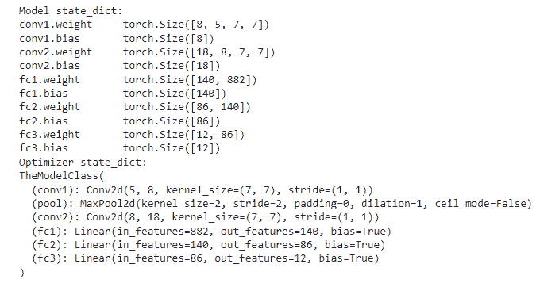
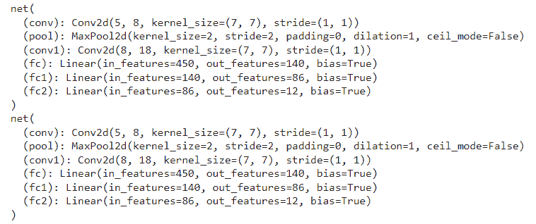
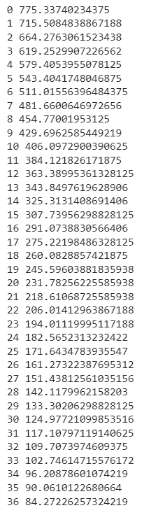
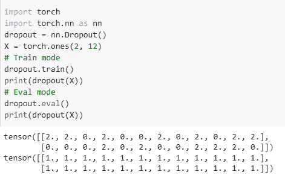
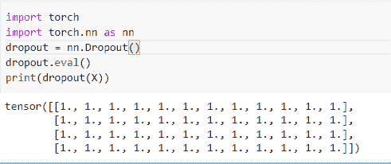
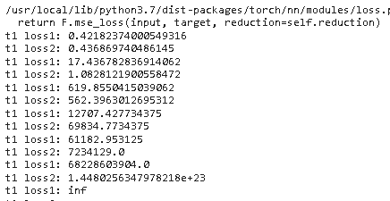
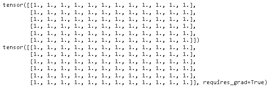

# PyTorch 模型评估+示例

> 原文：<https://pythonguides.com/pytorch-model-eval/>

[](https://sharepointsky.teachable.com/p/python-and-machine-learning-training-course)

在本 [Python 教程](https://pythonguides.com/learn-python/)中，我们将学习 Python 中的 **PyTorch 模型评估**，我们还将涵盖与评估模型相关的不同示例。此外，我们将涵盖这些主题。

*   PyTorch 模型评估
*   PyTorch 模型评估训练
*   PyTorch 模型评估
*   PyTorch 模型评估与培训
*   PyTorch 模型评估 vs no_grad
*   PyTorch 模型评估退出
*   pyker 模型. eval 蝙蝠数
*   PyTorch 模型评估要求 _grad

目录

[](#)

*   [PyTorch 模型评估](#PyTorch_Model_Eval "PyTorch Model Eval")
*   [PyTorch 模型评估列车](#PyTorch_Model_Eval_Train "PyTorch Model Eval Train")
*   [PyTorch 模型评估](#PyTorch_Model_Evaluation "PyTorch Model Evaluation")
*   [PyTorch 模型评估与培训](#PyTorch_model_eval_vs_train "PyTorch model eval vs train")
*   [PyTorch 模型评估 vs no_grad](#PyTorch_model_eval_vs_no_grad "PyTorch model eval vs no_grad")
*   [PyTorch 模型评估退出](#PyTorch_model_eval_dropout "PyTorch model eval dropout")
*   [py torch model . eval batch norm](#PyTorch_modeleval_batchnorm "PyTorch model.eval batchnorm")
*   [PyTorch 模型评估要求 _grad](#PyTorch_model_eval_required_grad "PyTorch model eval required_grad")

## PyTorch 模型评估

在本节中，我们将了解**如何在 python 中评估 [PyTorch](https://pythonguides.com/what-is-pytorch/) 模型**。

*   `eval()` 是一种用于模型特定部分的开关，在训练和评估期间表现不同。
*   它将模型设置为评估模式，规范化层使用运行统计数据。

**代码:**

在下面的代码中，我们将导入一些库，从中我们可以评估模型。

*   **nn。Conv2d()** 用于创建卷积核。
*   **nn。MaxPool2d()** 用于应用于由几个输入平面组成的输入信号。
*   **nn。线性()**用于创建前馈网络。
*   `model = TheModelClass()` 用于初始化模型。
*   优化者=优化。SGD(model.parameters()，lr=0.001，momentum=0.8) 用于初始化优化器。
*   **print("模型状态 _ 字典:")**用于打印模型状态 _ 字典。
*   **print(" Optimizer state_dict:")**用于打印优化器 state _ dict。
*   **torch.save(model.state_dict()，' model_weights.pth')** 用于保存模型。
*   **model . load _ state _ dict(torch . load(' model _ weights . PTH ')**用于加载模型。
*   `model.eval()` 用于评估模型。

```py
import torch
from torch import nn
import torch.optim as optimize
import torch.nn.functional as f
**# Define model**
class TheModelClass(nn.Module):
    def __init__(self):
        super(TheModelClass, self).__init__()
        self.conv1 = nn.Conv2d(5, 8, 7)
        self.pool = nn.MaxPool2d(2, 2)
        self.conv2 = nn.Conv2d(8, 18, 7)
        self.fc1 = nn.Linear(18 * 7 * 7, 140)
        self.fc2 = nn.Linear(140, 86)
        self.fc3 = nn.Linear(86, 12)

    def forward(self, X):
        X = self.pool(f.relu(self.conv1(X)))
        X = self.pool(f.relu(self.conv2(X)))
        X = x.view(-1, 16 * 5 * 5)
        X = f.relu(self.fc1(X))
        X = f.relu(self.fc2(X))
        X = self.fc3(X)
        return X

model = TheModelClass()

optimizers = optimize.SGD(model.parameters(), lr=0.001, momentum=0.8)

print("Model state_dict:")
for param_tensor in model.state_dict():
    print(param_tensor, "\t", model.state_dict()[param_tensor].size())

print("Optimizer state_dict:")

torch.save(model.state_dict(), 'model_weights.pth')
model.load_state_dict(torch.load('model_weights.pth'))
model.eval()
```

**输出:**

运行上面的代码后，我们得到下面的输出，其中我们可以看到模型数据在评估后打印在屏幕上。



PyTorch model eval

阅读: [PyTorch 保存模型](https://pythonguides.com/pytorch-save-model/)

## PyTorch 模型评估列车

在本节中，我们将学习 python 中的 **PyTorch 模型评估训练**。

*   PyTorch 模型评估训练被定义为评估训练数据的过程。eval()函数用于评估训练模型。
*   `eval()` 是一种用于模型特定部分的开关，在训练和评估期间表现不同。

**代码:**

在下面的代码中，我们将导入一些模块，从这些模块中我们可以评估训练好的模型。

*   `netout = model()` 用于初始化模型。
*   `print(netout)` 用于打印模型。
*   优化器=优化。SGD(netout.parameters()，lr=0.001，momentum=0.9) 用于初始化优化器。
*   `torch.save()` 用于保存模型。
*   **model . load _ state _ dict(check point[' model _ state _ dict '])**用于加载模型。
*   **optimizer.load_state_dict(检查点['optimizer_state_dict'])** 用于加载优化器。
*   `model.eval()` 用于评估模型。

```py
import torch
import torch.nn as nn
import torch.optim as optim
import torch.nn.functional as fun
class net(nn.Module):
    def __init__(self):
        super(net, self).__init__()
        self.conv = nn.Conv2d(5, 8, 7)
        self.pool = nn.MaxPool2d(2, 2)
        self.conv1 = nn.Conv2d(8, 18, 7)
        self.fc = nn.Linear(18 * 5 * 5, 140)
        self.fc1 = nn.Linear(140, 86)
        self.fc2 = nn.Linear(86, 12)

    def forward(self, y):
        y = self.pool(fun.relu(self.conv1(Y)))
        y = self.pool(fun.relu(self.conv2(y)))
        y = y.view(-1, 16 * 5 * 5)
        y = fun.relu(self.fc1(y))
        y = fun.relu(self.fc2(y))
        y = self.fc3(y)
        return y

netout = net()
print(netout)
optimizers = optim.SGD(netout.parameters(), lr=0.001, momentum=0.9)
# Additional information
epoch = 7
path = "model.pt"
loss = 0.6

torch.save({
            'epoch': epoch,
            'model_state_dict': netout.state_dict(),
            'optimizer_state_dict': optimizers.state_dict(),
            'loss': loss,
            }, path)
models = net()
optimizers = optim.SGD(netout.parameters(), lr=0.001, momentum=0.9)

CheckPoint = torch.load(path)
models.load_state_dict(CheckPoint['model_state_dict'])
optimizers.load_state_dict(CheckPoint['optimizer_state_dict'])
Epoch = CheckPoint['epoch']
Loss = CheckPoint['loss']

models.eval()
models.train()
```

**输出:**

在下面的输出中，我们可以看到屏幕上对训练好的模型进行了评估。



PyTorch model eval train

阅读:[交叉熵损失 PyTorch](https://pythonguides.com/cross-entropy-loss-pytorch/)

## PyTorch 模型评估

在本节中，我们将了解 python 中 PyTorch 模型的**评估。**

模型评估被定义为可以使用不同的评估矩阵来理解模型的过程。

**代码:**

在下面的代码中，我们将导入 torch 模块，从中我们可以评估模型。

*   `torch.nn.Linear()` 用于创建前馈网络。
*   **X = torch.randn(N，D_in)** 用于创建一个随机张量来保存输入和输出。
*   **loss _ func = torch . nn . ms loss(reduction = ' sum ')**用于构造损失函数。
*   **optimizer = torch . optim . SGD(model . parameters()、lr=1e-4)** 用于初始化优化器。
*   **loss = loss_func(Ypred，Y)** 用于打印损失。
*   `optimizer.zero_grad()` 用于优化零梯度。

```py
 import torch

class Net(torch.nn.Module):
  def __init__(self, Dinp, hidd, Doutp):

    super(Net, self).__init__()
    self.linear1 = torch.nn.Linear(Dinp, hidd)
    self.linear2 = torch.nn.Linear(hidd, Doutp)

  def forward(self, X):

    h_relu = self.linear1(X).clamp(min=0)
    ypred = self.linear2(h_relu)
    return ypred

bsize, Dinp, hidd, Doutp = 66, 1001, 101, 11

X = torch.randn(bsize, Dinp)
Y = torch.randn(bsize, Doutp)

modl = Net(Dinp, hidd, Doutp)

loss_func = torch.nn.MSELoss(reduction='sum')
opt = torch.optim.SGD(modl.parameters(), lr=1e-4)
for t in range(500):
  Ypred = modl(X)

  losses = loss_func(Ypred, Y)
  print(t, losses.item())

  opt.zero_grad()
  losses.backward()
  opt.step()
  modl.eval()
```

**输出:**

运行上面的代码后，我们得到下面的输出，从中我们可以看到模型评估已经完成。



PyTorch model evaluation

阅读: [Adam optimizer PyTorch 示例](https://pythonguides.com/adam-optimizer-pytorch/)

## PyTorch 模型评估与培训

在本节中，我们将学习 python 中的 **PyTorch eval vs train 模型**。

*   `train()` 集合告诉我们的模型，它当前处于训练阶段，它们保留了一些层，如 dropout 和 batch normalization，它们的行为不同，但取决于当前状态。
*   调用 eval()时， `eval()` 集合的行为与 train 集合完全不同，然后我们的模型停用所有层。

**代码:**

在下面的代码中，我们将导入一些库，从中我们可以看到 eval 和 train 集之间的区别。

*   **辍学= nn。Dropout()** 用于去除神经网络中的单元。
*   **X = torch.ones(2，12)** 用于初始化张量。
*   `dropout.train()` 用作训练模式。
*   `dropout.eval()` 用作评估模式。

```py
import torch
import torch.nn as nn
dropout = nn.Dropout()
X = torch.ones(2, 12)
**# Train mode** 
dropout.train()
print(dropout(X))
**# Eval mode**
dropout.eval()
print(dropout(X))
```

**输出:**

运行上面的代码后，我们得到下面的输出，其中我们可以看到训练值和 eval 值打印在屏幕上。



PyTorch model eval vs train

阅读: [PyTorch nn 线性+例题](https://pythonguides.com/pytorch-nn-linear/)

## PyTorch 模型评估 vs no_grad

在本节中，我们将学习 python 中的 **PyTorch 模型 eval vs no_grad** 。

`eval()` 集合告诉所有层您处于 eval 模式。dropout 和 batch norm 图层在 eval 模式下工作，而不是在 train 模式下。

**语法:**

以下是 eval 的语法:

```py
model.eval()
```

`no_grad()` 会影响自动签名的引擎并将其停用，还会减少内存并加快计算速度。

**语法:**

语法是 no_grad:

```py
torch.no_grad()
```

另外，请阅读: [PyTorch 负载模型+示例](https://pythonguides.com/pytorch-load-model/)

## PyTorch 模型评估退出

在这一节中，我们将学习 python 中的 PyTorch 模型 eval dropout 如何工作。

`eval dropout` 被定义为一个过程，在该过程中，dropout 被去激活并且刚刚通过其输入。

**代码:**

在下面的代码中，我们将导入 torch 模块，并从中实现 eval dropout 模型。

*   **nn。Dropout()** 用于定义神经元被去激活的概率。
*   `dropout.eval()` 用于评估模型。
*   `print(dropout(X))` 用于在屏幕上打印数值。

```py
import torch
import torch.nn as nn
dropout = nn.Dropout()
dropout.eval()
print(dropout(X))
```

**输出:**

在下面的输出中，我们可以看到 PyTorch 模型 eval dropout 值打印在屏幕上。



PyTorch model eval dropout

阅读: [PyTorch 批量标准化](https://pythonguides.com/pytorch-batch-normalization/)

## py torch model . eval batch norm

在本节中，我们将学习 python 中的`py torch model . eval batch norm`。

在继续之前，我们应该了解一些关于 batchnorm 的知识。

批处理被定义为用于训练深度神经网络的过程，该深度神经网络对所有小批量的层的输入进行标准化。

**代码:**

在下面的代码中，我们将导入一些库，从中我们可以评估 batchnorm。

*   `wid = 64` 用作宽度。
*   `heig = 64` 用作高度。
*   **batch_one = torch.ones([4，1，64，64]，dtype=torch.float，device = torch . device(" cuda "))**用于计算批次。
*   **output_one = torch.tensor([.5，. 5])。to(torch.device("cuda"))** 用于获取批量的输出。
*   优化者= optim。SGD(nets.parameters()，0.0001) 用于初始化优化器。
*   `optimizer . zero _ grad()`用于将参数梯度归零。
*   **loss = criteria(netout，outp)** 用于计算损失。
*   **print("t1 loss1:"，train_model(networks，batch_one，output_one))** 用于打印列车模型。
*   **print("v1 loss1:"，batch_evaluate(networks，batch_one，output_one，True))** 用于打印评估批次。

```py
 import torch
import torch.nn as nn
import torch.optim as optim        

class net(nn.Module):
    def __init__(self, image_size_total):
        super(net, self).__init__()

        self.conv = nn.Conv2d(1, 64, 3, padding=1)
        self.relu = nn.ReLU(inplace=True)
        self.bn = nn.BatchNorm2d(64)
        self.max_pool = nn.MaxPool2d(2)

        self.fc = nn.Linear((image_size_total//4) * 64, 2)

    def forward(self, X):
        X = self.conv(X)
        X = self.relu(X)
        X = self.bn(X)
        X = self.max_pool(X)

        X = X.view(-1, self.numfeatures(X))
        X = self.fc(X)
        return X

    def numfeatures(self, X):
        Size = X.size()[1:] # all dimensions except the batch dimension
        numfeatures = 1
        for i in Size:
            numfeatures *= i
        return numfeatures
wid = 64
heig = 64
networks = net(wid* heig)

batch_one = torch.ones([4, 1, 64, 64], dtype=torch.float, device=torch.device("cuda"))
output_one = torch.tensor([.5, .5]).to(torch.device("cuda"))
batch_two = torch.randn([4, 1, 64, 64], dtype=torch.float, device=torch.device("cuda"))
output_two = torch.tensor([.01, 1.0]).to(torch.device("cuda"))

def train_model(nets, batch, outp):
        nets.train()

        optimizers = optim.SGD(nets.parameters(), 0.0001)
        criterions = nn.MSELoss()

        optimizers.zero_grad()

        netout = nets(batch)
        loss = criterions(netout, outp)
        loss.backward()
        optimizers.step()
        return float(loss)

def batch_evaluate(nets, batch, outp, should_eval):
        if should_eval:
            nets.eval()
        else:
            nets.train()

        criterion = nn.MSELoss()

        netout = nets(batch)
        loss = criterion(netout, outp)
        return float(loss)

networks.to(torch.device("cuda"))

for i in range(60):
    print("t1 loss1:", train_model(networks, batch_one, output_one))
    print("t1 loss2:", train_model(networks, batch_two, output_one))

print("v1 loss1:", batch_evaluate(networks, batch_one, output_one, True))
print("v1 loss2:", batch_evaluate(networks, batch_two, output_one, True))
print("train v1 loss1:", batch_evaluate(networks, batch_one, output_one, False))
print("train v2 loss2:", batch_evaluate(networks, batch_two, output_one, False))
```

> **注:** 运行代码前在 Google colab 中更改运行时间 **None 到 GPU** 。更改后，我们的代码运行完美。

**输出:**

运行上面的代码后，我们得到下面的输出，其中我们可以看到 `model.eval()` 使用 batchnorm 给出了不正确的损失。



PyTorch model.eval batchnorm

阅读: [PyTorch 数据加载器+示例](https://pythonguides.com/pytorch-dataloader/)

## PyTorch 模型评估要求 _grad

在本节中，我们将学习 python 中的 **PyTorch 模型 eval required_grad** 。

在 PyTorch 中， `requires_grad` 被定义为一个参数。如果**的值 requires_grad** 为 `true` ，则需要计算梯度。如果为假，就不需要计算梯度。

**代码:**

在下面的代码中，我们将导入 torch 模块，如果 requires_grad 为真，我们就可以从中计算梯度。

*   **辍学= nn。Dropout()** 用于定义神经元被去激活的概率。
*   **X = torch.ones(6，12，requires_grad = False)** 用于给 X 变量赋值。
*   `dropout.eval()` 用作评估模式。
*   `print(dropout(X))` 用于打印数值。

```py
import torch
import torch.nn as nn
dropout = nn.Dropout()
X = torch.ones(6, 12, requires_grad = False)
y =torch.ones(6, 12,requires_grad = True)

dropout.eval()
print(dropout(X))
print(dropout(y))
```

**输出:**

在下面的输出中，我们可以看到 PyTorch 模型 eval requires_grad 值被打印在屏幕上。



PyTorch model eval requires_grad

你可能也喜欢阅读下面的 PyTorch 教程。

*   [PyTorch MNIST 教程](https://pythonguides.com/pytorch-mnist/)
*   [PyTorch 线性回归](https://pythonguides.com/pytorch-linear-regression/)
*   [PyTorch 超参数调谐](https://pythonguides.com/pytorch-hyperparameter-tuning/)

因此，在本教程中，我们讨论了 **PyTorch 评估模型**,我们还涵盖了与其实现相关的不同示例。这是我们已经讨论过的例子列表。

*   PyTorch 模型评估
*   PyTorch 模型评估训练
*   PyTorch 模型评估
*   PyTorch 模型评估与培训
*   PyTorch 模型评估 vs no_grad
*   PyTorch 模型评估退出
*   pyker 模型. eval 蝙蝠数
*   PyTorch 模型评估要求 _grad

[Bijay Kumar](https://pythonguides.com/author/fewlines4biju/)

Python 是美国最流行的语言之一。我从事 Python 工作已经有很长时间了，我在与 Tkinter、Pandas、NumPy、Turtle、Django、Matplotlib、Tensorflow、Scipy、Scikit-Learn 等各种库合作方面拥有专业知识。我有与美国、加拿大、英国、澳大利亚、新西兰等国家的各种客户合作的经验。查看我的个人资料。

[enjoysharepoint.com/](https://enjoysharepoint.com/)[](https://www.facebook.com/fewlines4biju "Facebook")[](https://www.linkedin.com/in/fewlines4biju/ "Linkedin")[](https://twitter.com/fewlines4biju "Twitter")