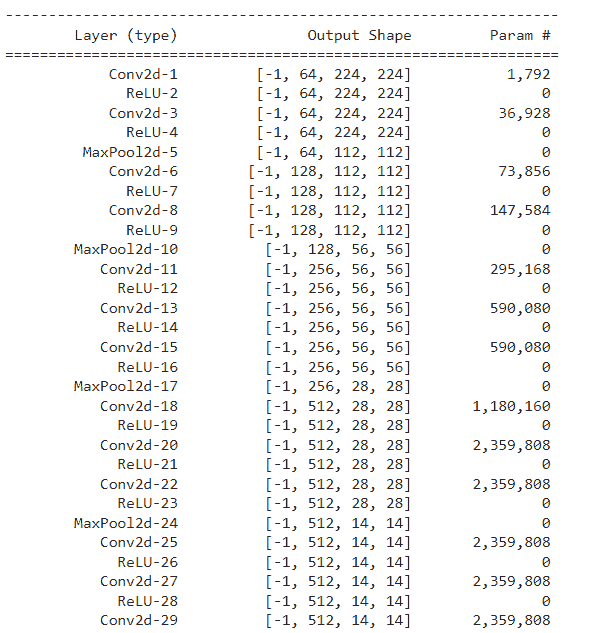
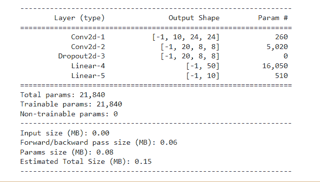
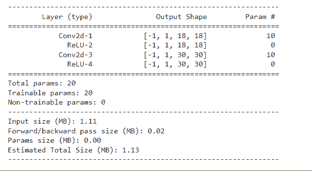
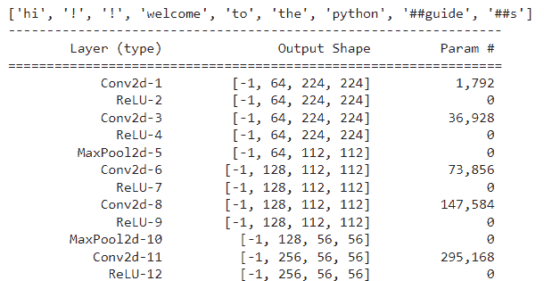
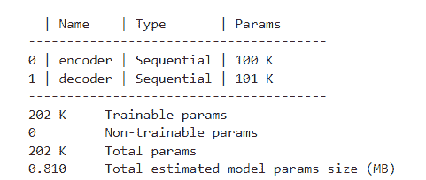
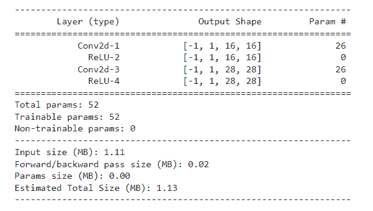

# PyTorch 模型总结-详细教程

> 原文：<https://pythonguides.com/pytorch-model-summary/>

[](https://sharepointsky.teachable.com/p/python-and-machine-learning-training-course)

在这个 [Python 教程](https://pythonguides.com/learn-python/)中，我们将学习如何用 Python 创建一个 **PyTorch 模型摘要**，我们还将介绍与 PyTorch 模型摘要相关的不同示例。此外，我们将涵盖这些主题。

*   PyTorch 模型摘要
*   PyTorch 模型摘要示例
*   PyTorch 模型摘要 lstm
*   PyTorch 模型摘要多输入
*   PyTorch bert 模型摘要
*   PyTorch lightning 模型摘要
*   PyTorch model summary Keras

目录

[](#)

*   [PyTorch 车型总结](#PyTorch_model_summary "PyTorch model summary")
*   [PyTorch 模型总结示例](#PyTorch_model_summary_example "PyTorch model summary example")
*   [PyTorch 模型摘要 lstm](#PyTorch_model_summary_lstm "PyTorch model summary lstm")
*   [PyTorch 模型汇总多个输入](#PyTorch_model_summary_multiple_inputs "PyTorch model summary multiple inputs")
*   [PyTorch bert 模型总结](#PyTorch_bert_model_summary "PyTorch bert model summary")
*   [PyTorch lightning 模型摘要](#PyTorch_lightning_model_summary "PyTorch lightning model summary ")
*   [PyTorch model summary Keras](#PyTorch_model_summary_Keras "PyTorch model summary Keras")

## PyTorch 车型总结

在本节中，我们将学习如何用 python 创建 PyTorch 模型摘要。

模型摘要为我们提供了模型的精细可视化，其目的是提供打印语句无法提供的完整信息。

**语法:**

```py
summary(model,input_size,batch_size=-1,show_input=False, show_hierarchical=False, max_depth=1,print_summary=False,show_parent_layers=False)
```

**参数:**

*   **模型**我们想要使用并获取摘要的模型。
*   `input_size` 需要通过网络进行前向传递。
*   `batch_size` 被证明并打印在汇总表中。
*   `show_input` 显示每层的输入输出形状。
*   `show_hierarchical` ，添加一个汇总表返回分层视图。
*   max_depth 定义了它可以在用户定义的层中显示它们的次数。
*   `print_summary` ，为真时不需要汇总方法之外的打印功能。
*   show_parennt_layers 它添加一列来显示父层路径，直到到达当前层。

阅读: [PyTorch 模型评估+示例](https://pythonguides.com/pytorch-model-eval/)

## PyTorch 模型总结示例

在本节中，我们将借助一个例子来了解**如何实现 PyTorch 模型摘要**。

一个模型的概要，它给出了一个很好的可视化，并且模型概要提供了完整的信息。

**代码:**

在下面的代码中，我们将导入 torch 模块，从中我们可以获得模型的摘要。

*   `pretrained model _ vgg = models . vgg 16()`用作模型。
*   **summary(pretrainedmodel_vgg，(3，224，224))** 给出模型的精细可视化和完整信息。

```py
import torch
from torchvision import models
from torchsummary import summary

pretrainedmodel_vgg = models.vgg16()
summary(pretrainedmodel_vgg, (3, 224, 224))
```

**输出:**

在运行上面的代码之后，我们得到了下面的输出，其中我们可以看到模型的摘要被打印在屏幕上。



PyTorch model summary example

阅读: [PyTorch 预训练模型](https://pythonguides.com/pytorch-pretrained-model/)

## PyTorch 模型摘要 lstm

在本节中，我们将学习 python 中的 **PyTorch 模型摘要 lstm** 。

在继续之前，我们应该对 lstm 有一些了解。LSTM 代表长短期记忆，非常适合基于时间序列数据进行预测。

**代码:**

在下面的代码中，我们将导入 torch 模块，从中我们可以总结模型摘要。

*   **班级模型 _ 总结(nn。模块):**用于定义一个类。
*   **nn。Conv2d(1，10，kernel_size=5)** 用于实现 CNN 的 2d 卷积层。
*   **nn。Linear()** 用于创建具有输入和输出的单层前馈网络。
*   `device _ name = torch . device(" cuda " if torch . cuda . is _ available()else " CPU ")`作为 cuda 设备使用。
*   **summary(modl，(1，28，28))** 用于打印模型摘要。

```py
import torch
import torch.nn as nn
import torch.nn.functional as fun
from torchsummary import summary
class model_summary(nn.Module):
    def __init__(self):
        super(model_summary, self).__init__()
        self.conv = nn.Conv2d(1, 10, kernel_size=5)
        self.conv1 = nn.Conv2d(10, 20, kernel_size=5)
        self.conv1_drop = nn.Dropout2d()
        self.fc = nn.Linear(320, 50)
        self.fc1 = nn.Linear(50, 10)
    def forward(self, z):
        z = fun.relu(fun.max_pool2d(self.conv(z), 2))
        z = fun.relu(fun.max_pool2d(self.conv1_drop(self.conv1(z)), 2))
        z = z.view(-1, 320)
        z = fun.relu(self.fc(z))
        z = fun.dropout(z, training=self.training)
        z = self.fc1(z)
        return fun.log_softmax(z, dim=1)
device_name = torch.device("cuda" if torch.cuda.is_available() else "cpu") 
modl = model_summary().to(device_name)
summary(modl, (1, 28, 28))
```

**输出:**

在下面的输出中，我们可以看到 PyTorch 模型 lstm 的摘要显示在屏幕上。



PyTorch model summary lstm

阅读: [PyTorch 提前停止+示例](https://pythonguides.com/pytorch-early-stopping/)

## PyTorch 模型汇总多个输入

在本节中，我们将学习 python 中的 **PyTorch 模型摘要多输入**。

模型摘要提供了精细的可视化，还提供了打印功能所不能提供的信息。这里我们给出多个输入。

**代码:**

在下面的代码中，我们将导入 torch 模块，从中我们可以获得模型的摘要。

*   `multi _ input device = torch . device(" cuda " if torch . cuda . is _ available()else " CPU ")`作为可用设备。
*   **模型=多输入()。以(multi_inputdevice)** 为模型。
*   **summary(model，[(1，18，18)，(1，30，30)]**用于描述一个模型的概要，我们在参数中给出多个输入。

```py
import torch
import torch.nn as nn
from torchsummary import summary

class Multi_input(nn.Module):
    def __init__(self):
        super(Multi_input, self).__init__()
        self.features = nn.Sequential(
            nn.Conv2d(1, 1, kernel_size=3, stride=1, padding=1),
            nn.ReLU(),
        )

    def forward(self, y, z):
        a1 = self.features(y)
        a2 = self.features(z)
        return a1, a2

multi_inputdevice = torch.device("cuda" if torch.cuda.is_available() else "cpu")
model = Multi_input().to(multi_inputdevice)

summary(model, [(1, 18, 18), (1, 30, 30)])
```

**输出:**

运行上面的代码后，我们得到下面的输出，其中我们可以看到屏幕上显示了具有多个输入的模型的摘要。



PyTorch model summary multiple inputs

阅读:[py torch ms loss–详细指南](https://pythonguides.com/pytorch-mseloss/)

## PyTorch bert 模型总结

在本节中，我们将学习 python 中的 **PyTorch bert 模型摘要**。

Bert 模型被定义为双向编码器表示，该模型是为预训练模型而设计的。

伯特模型可以用一个额外的层来改变，以获得最佳模型。

**代码:**

在下面的代码中，我们将导入 torch 模块，从中我们可以获得 bert 模型摘要。

*   `torch.manual_seed(dt)` 用于生成随机数。
*   **BT = bertokenizer . from _ pre trained(' bert-base-un cased ')**用作 Bert 记号化器。
*   `pretrained model _ vgg = models . vgg 16()`用作预训练模型。
*   **打印(bertresult)** 用于打印 bert 结果。
*   **summary(pretrainedmodel_vgg，(3，224，224))** 用于获取 bert 摘要。

```py
import torch
from torchvision import models
from torchsummary import summary
dt = 2020
torch.manual_seed(dt)
torch.backends.cudnn.deterministic = True
from transformers import BertTokenizer
pretrainedmodel_vgg = models.vgg16()
BT = BertTokenizer.from_pretrained('bert-base-uncased')
len(BT)
bertresult = BT.tokenize('Hi!! Welcome To The PythonGuides')
print(bertresult)
summary(pretrainedmodel_vgg, (3, 224, 224))
```

**输出:**

在下面的输出中，我们可以看到 PyTorch bert 模型摘要打印在屏幕上。



PyTorch bert model summary

阅读: [PyTorch 批量标准化](https://pythonguides.com/pytorch-batch-normalization/)

## PyTorch lightning 模型摘要

在本节中，我们将学习 python 中的 PyTorch lightning 模型概要。

PyTorch lightning 是一个轻量级的开源模型。它是机器学习研究人员的 python 封面。

**代码:**

在下面的代码中，我们将导入 torch 模块，从中我们可以获得 lightning 模型的摘要。

*   **nn。线性()**用于得到带有输入和输出的前馈网络。
*   `embding = self.encoder(m)` 用于定义预测或推理动作。
*   **def training_step(self，btch，btch_indx)** 用于定义独立于 forward 的训练循环。
*   **optim = torch . optim . Adam(self . parameters()、lr=1e-3)** 用于优化优化器。
*   **dt = MNIST(os.getcwd()，download=True，transform=transforms。**【ToTensor()】用于定义数据集。
*   **trainee . fit(自动编码器，数据加载器(已训练)，数据加载器(有效))**用于 fir 训练器。

```py
import os
import torch
from torch import nn
import torch.nn.functional as func
from torchvision.datasets import MNIST
from torch.utils.data import DataLoader, random_split
from torchvision import transforms
import pytorch_lightning as pylig
class litauto_encoder(pylig.LightningModule):
    def __init__(self):
        super().__init__()
        self.encoder = nn.Sequential(nn.Linear(28 * 28, 128), nn.ReLU(), nn.Linear(128, 3))
        self.decoder = nn.Sequential(nn.Linear(3, 128), nn.ReLU(), nn.Linear(128, 28 * 28))

    def forward(self, m):
        embding = self.encoder(m)
        return embding

    def training_step(self, btch, btch_indx):
        m, n = btch
        m = m.view(m.size(0), -1)
        o = self.encoder(m)
        m_hat = self.decoder(o)
        losses = func.mse_loss(m_hat, m)
        self.log("train_loss", losses)
        return losses

    def configure_optimizers(self):
        optim = torch.optim.Adam(self.parameters(), lr=1e-3)
        return optim
dt = MNIST(os.getcwd(), download=True, transform=transforms.ToTensor())
trained, valid = random_split(dt, [55000, 5000])

autoencoder = litauto_encoder()
traine = pylig.Trainer()
traine.fit(autoencoder, DataLoader(trained), DataLoader(valid))
summary(litauto_encoder,(1,28,28))
```

**输出:**

运行上面的代码后，我们得到下面的输出，其中我们可以看到 PyTorch lightning 模型摘要显示在屏幕上。



PyTorch lightning model summary

阅读: [PyTorch 负载模型+示例](https://pythonguides.com/pytorch-load-model/)

## PyTorch model summary Keras

在本节中，我们将学习 python 中的 PyTorch 模型概要 Kera。

Keras 有一个有序的 API 来查看模型的可视化，这在调试网络时非常有用。

**代码:**

在下面的代码中，我们将导入 torch 模块，从中我们可以获得模型摘要。

*   **nn。Sequential()** 当我们希望某些层按顺序排列时使用。
*   **nn。Conv2d()** 用于改变二维数据结构的卷积。
*   `devce = torch . device(" cuda " if torch . cuda . is _ available()else " CPU ")`作为设备使用。
*   **modl = smplcon()。to(devce)** 用作模型。
*   **summary(modl，[(1，18，18)，(1，30，30)]**用于解释模型摘要。

```py
import torch
import torch.nn as nn
from torchsummary import summary

class smplcon(nn.Module):
    def __init__(self):
        super(smplcon, self).__init__()
        self.features = nn.Sequential(
            nn.Conv2d(1, 1, kernel_size=5, stride=1, padding=1),
            nn.ReLU(),
        )

    def forward(self, a, b):
        a1 = self.features(a)
        a2 = self.features(b)
        return a1, a2

devce = torch.device("cuda" if torch.cuda.is_available() else "cpu")
modl = smplcon().to(devce)

summary(modl, [(1, 18, 18), (1, 30, 30)])
```

**输出:**

运行上面的代码后，我们得到下面的输出，其中我们可以看到 PyTorch 模型摘要 Keras 被打印在屏幕上。



PyTorch model summary Keras

另外，再看看一些 PyTorch 教程。

*   [交叉熵损失 PyTorch](https://pythonguides.com/cross-entropy-loss-pytorch/)
*   [PyTorch Conv3d](https://pythonguides.com/pytorch-conv3d/)
*   [Jax Vs PyTorch【主要区别】](https://pythonguides.com/jax-vs-pytorch/)
*   [PyTorch MNIST 教程](https://pythonguides.com/pytorch-mnist/)
*   [PyTorch 全连接层](https://pythonguides.com/pytorch-fully-connected-layer/)
*   [py torch RNN–详细指南](https://pythonguides.com/pytorch-rnn/)
*   [Adam 优化器 PyTorch 及示例](https://pythonguides.com/adam-optimizer-pytorch/)
*   [数据加载器指针+示例](https://pythonguides.com/pytorch-dataloader/)

因此，在本教程中，我们讨论了 **PyTorch 模型摘要**，并且我们还涵盖了与其实现相关的不同示例。这是我们已经讨论过的例子列表。

*   PyTorch 模型摘要
*   PyTorch 模型摘要示例
*   PyTorch 模型摘要 lstm
*   PyTorch 模型摘要多输入
*   PyTorch bert 模型摘要
*   PyTorch lightning 模型摘要
*   PyTorch model summary Keras

[Bijay Kumar](https://pythonguides.com/author/fewlines4biju/)

Python 是美国最流行的语言之一。我从事 Python 工作已经有很长时间了，我在与 Tkinter、Pandas、NumPy、Turtle、Django、Matplotlib、Tensorflow、Scipy、Scikit-Learn 等各种库合作方面拥有专业知识。我有与美国、加拿大、英国、澳大利亚、新西兰等国家的各种客户合作的经验。查看我的个人资料。

[enjoysharepoint.com/](https://enjoysharepoint.com/)[](https://www.facebook.com/fewlines4biju "Facebook")[](https://www.linkedin.com/in/fewlines4biju/ "Linkedin")[](https://twitter.com/fewlines4biju "Twitter")