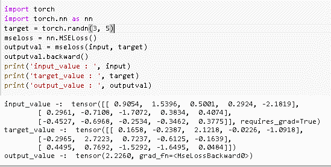

# py torch ms loss–详细指南

> 原文：<https://pythonguides.com/pytorch-mseloss/>

[](https://sharepointsky.teachable.com/p/python-and-machine-learning-training-course)

在这个 [Python 教程](https://pythonguides.com/learn-python/)中，我们将学习 Python 中的`py torch ms loss`，我们还将涵盖与之相关的不同例子。我们将讨论这些话题。

*   PyTorch MSELoss
*   PyTorch MSELoss 代码
*   PyTorch MSELoss 实现
*   PyTorch MSELoss 加权
*   PyTorch MSELoss nan
*   PyTorch MSELoss 批量大小
*   正则化 PyTorch MSELoss

目录

[](#)

*   [py torch ms loss](#PyTorch_MSELoss "PyTorch MSELoss")
*   [py torch ms loss 代码](#PyTorch_MSELoss_code "PyTorch MSELoss code")
*   [py torch ms loss 实现](#PyTorch_MSELoss_implementation "PyTorch MSELoss implementation")
*   [PyTorch MSELoss Weighted](#PyTorch_MSELoss_Weighted "PyTorch MSELoss Weighted")
*   [py torch ms loss 忽略指数](#PyTorch_MSELoss_ignore_index "PyTorch MSELoss ignore index")
*   [py torch ms loss 批量](#PyTorch_MSELoss_batch_size "PyTorch MSELoss batch size")
*   [py torch ms loss 正则化](#PyTorch_MSELoss_with_regularization "PyTorch MSELoss with regularization")

## py torch ms loss

在本节中，我们将了解 python 中的**py torch ms loss 如何工作**。

在继续之前，我们应该对 MSELoss 有所了解。

*   Mse 代表均方误差，这是最常用的回归损失函数。
*   损失是真实值和预测值之间的平均监督数据平方差。
*   PyTorch MSELoss 是一个测量实际值和预测值之间的平均方差的过程。

**代码:**

在下面的代码中，我们将导入 torch 库，我们可以测量每个元素之间的均方差。

*   **nn。ms loss()**用于测量均方差。
*   **torch.randn(5，7，requires_grad=True)** 用于生成随机数。
*   **损失(输入，目标)**用于计算损失。
*   **print(输出)**用于在屏幕上打印输出。

```py
import torch
from torch import nn
loss = nn.MSELoss()
inputs = torch.randn(5, 7, requires_grad=True)
targets = torch.randn(5, 7)
output = loss(inputs, targets)
output.backward()
print(output)
```

**输出:**

运行上面的代码后，我们得到下面的输出，可以看到屏幕上显示了均方误差损失。


PyTorch MSELoss

阅读:[py torch 是什么以及如何使用它](https://pythonguides.com/what-is-pytorch/)

## py torch ms loss 代码

在本节中，我们将学习 python 中的**py torch ms loss 代码**。

PyTorch MSELoss code 定义为测量实际值和预测值之间的平均方差的过程。

**代码:**

在下面的代码中，我们将导入一个 torch 模块，从中我们可以计算 MSELoss。

*   **torch.randn(2，4，requires_grad=True)** 用于生成随机数。
*   **nn。ms loss()**用于计算均方误差。
*   **ms loss(输入，目标)**用于获得输出值。
*   **print('input:'，inputs)** 用于打印输入值。
*   **print('target:'，targets)** 用于打印目标值。
*   **print('output:'，outputs)** 用于打印输出值。

```py
import torch.nn as nn

inputs = torch.randn(2, 4, requires_grad=True)
targets = torch.randn(2, 4)
mseloss = nn.MSELoss()
outputs = mseloss(inputs, targets)
outputs.backward()

print('input: ', inputs)
print('target: ', targets)
print('output: ', outputs)
```

**输出:**

在下面的输出中，我们可以看到均方误差损失值被打印在屏幕上。


PyTorch MSELoss code

阅读: [PyTorch 保存模型–完整指南](https://pythonguides.com/pytorch-save-model/)

## py torch ms loss 实现

在这一节中，我们将学习**如何在 python 中实现 MSELoss** 。

PyTorch MSELoss 实现的目的是计算实际值和预测值之间的平均方差。

**代码:**

在下面的代码中，我们将导入 torch 模块，并从中实现 MSELoss。

*   **target = torch.randn(3，5)** 用于生成目标变量的随机数。
*   **nn。ms loss()**用于计算均方损失误差。
*   **ms loss(输入，目标)**用于计算输出值。
*   **print('input_value:'，input)** 用于打印输入变量。
*   **print('target_value:'，target)** 用于打印目标变量。
*   **打印(' output_value:'，outputval)** 用于打印输出值。

```py
import torch 
import torch.nn as nn
target = torch.randn(3, 5)
mseloss = nn.MSELoss()
outputval = mseloss(input, target)
outputval.backward()
print('input_value : ', input)
print('target_value : ', target)
print('output_value : ', outputval)
```

**输出:**

运行上面的代码后，我们得到了下面的输出，其中我们得到了输入值之间的平均平方差。目标值打印在屏幕上。



PyTorch MSELoss implementation

阅读:[交叉熵损失 PyTorch](https://pythonguides.com/cross-entropy-loss-pytorch/)

## PyTorch MSELoss Weighted

在本节中，我们将学习 Python 中的 `Pytorch MSELoss weighted` 。

*   PyTorch MSELoss weighted 定义为计算输入变量和目标变量之间的均方差的过程。
*   MSELoss 最常用于回归，在线性回归中，每个目标变量都被评估为输入变量的加权和。

**代码:**

在下面的代码中，我们将导入一些库，从中我们可以计算输入变量和目标变量之间的平方差的平均值。

*   `torch . from _ numpy(input _ vals)`用作输入变量。
*   `torch . from _ numpy(target _ vals)`用作目标变量。
*   `print(input_vals)` 用于打印输入的变量。
*   `print(target_vals)` 用于打印目标变量。
*   **weights = torch.randn(4，5，requires_grad=True)** 用于生成随机权重。
*   **bias = torch . randn(4，requires_grad=True)** 用于生成随机偏差。
*   **预测=模型(input_vals)** 用于进行预测。

```py
import torch
import numpy as num
input_vals = num.array([[75, 69, 45], 
                   [93, 90, 61], 
                   [89, 136, 70], 
                   [104, 45, 39], 
                   [72, 98, 81]], dtype='float32')

target_vals = num.array([[64, 73], 
                    [93, 104], 
                    [111, 125], 
                    [36, 45], 
                    [110, 113]], dtype='float32')
input_vals = torch.from_numpy(input_vals)
target_vals = torch.from_numpy(target_vals)
print(input_vals)
print(target_vals)
**# Weights and biases**
weights = torch.randn(4, 5, requires_grad=True)
biases = torch.randn(4, requires_grad=True)
print(w)
print(b)
def model(x):
    return x @ w.t() + b
**# Generate predictions**
predictions = model(input_vals)
print(predictions)

print(target_vals)
**# MSEloss**
def mse(t1, t2):
    diff = t1 - t2
    return torch.sum(diff * diff) / diff.numel()

loss = mse(predictions, target_vals)
print(loss)
```

**输出:**

运行上面的代码后，我们得到下面的输出，其中我们可以看到 PyTorch MSELoss weighted 被打印在屏幕上。


PyTorch MSELoss weighted

阅读:[Keras Vs py torch–主要区别](https://pythonguides.com/keras-vs-pytorch/)

## py torch ms loss 忽略指数

在这一节中，我们将学习 python 中的 **PyTorch MSELoss 忽略索引**。

在继续之前，我们应该了解一些关于忽略索引的知识。Ignore index 是一个参数，它指定一个被忽略的目标变量，该变量不会对输入渐变产生影响。

**语法:**

```py
torch.nn.MSELoss(size_average=None,reduce=None,ignore_index=None,reduce=None,reduction='mean')
```

**参数:**

*   `size_average` 是该批中每个损失元素的平均值。
*   **减少**是损失的平均值，根据 size_average 对每个小批量的观察值求和。
*   `ignore_index` 是一个参数，它指定一个被忽略的目标变量，并且不贡献给输入梯度。
*   **减少量**是指定减少量被应用到输出。

另外，检查: [PyTorch 预训练模型](https://pythonguides.com/pytorch-pretrained-model/)

## py torch ms loss 批量

在这一节中，我们将学习**如何在 python 中实现 PyTorch MSELoss 批处理大小**。

PyTorch MSELoss 批量大小定义为在一次迭代中使用大量训练样本的过程。

**代码:**

在下面的代码中，我们将导入一些库，从中我们可以维护批处理大小。

*   `torch . from _ numpy(input _ var)`用作输入变量。
*   `torch . from _ numpy(target _ var)`用作目标变量。
*   **train _ dataset = TensorDataset(input _ var，target_var)** 用于训练数据集。
*   batchsize = 3 用于定义批量大小。
*   **train _ dl = data loader(train _ dataset，batchsize，shuffle=True)** 用于加载数据。
*   **nn。【T1(3，2)】用于创建前馈网络。**
*   `print(model.weight)` 用于打印模型重量。
*   **预测=模型(input_var)** 用于生成预测。

```py
import torch
import torch.nn as nn
import numpy as num

input_var = num.array([[75, 69, 45], [93, 90, 66], [89, 136, 60], 
                   [104, 45, 39], [71, 98, 72], [75, 69, 45], 
                   [93, 90, 66], [89, 136, 60], [104, 45, 39], 
                   [71, 98, 72], [75, 69, 45], [93, 90, 66], 
                   [89, 136, 60], [104, 45, 39], [71, 98, 72]], 
                  dtype='float32')

target_var = num.array([[58, 72], [83, 103], [121, 135], 
                    [24, 39], [105, 121], [58, 72], 
                    [83, 103], [121, 135], [24, 39], 
                    [105, 121], [58, 72], [83, 103], 
                    [121, 135], [24, 39], [105, 121]], 
                   dtype='float32')

input_var = torch.from_numpy(input_var)
target_var = torch.from_numpy(target_var)
input_var
from torch.utils.data import TensorDataset

**# Define dataset**
train_dataset = TensorDataset(input_var, target_var)
train_dataset[0:3]
from torch.utils.data import DataLoader

**# Define data loader**
batchsize = 3
train_dl = DataLoader(train_dataset, batchsize, shuffle=True)
for x_b, y_b in train_dl:
    print(x_b)
    print(y_b)
**# Define model**
model = nn.Linear(3, 2)
print(model.weight)
print(model.bias)
**# Parameters**
list(model.parameters())
**# Generate predictions**
predictions = model(input_var)
predictions
import torch.nn.functional as f
**# Define loss function**
loss_func = f.mse_loss
loss = loss_func(model(input_var), target_var)
print(loss)
```

**输出:**

在下面的输出中，我们将大型数据集分成批量大小为 3 的较小数据集，PyTorch mse bach 大小值打印在屏幕上。


PyTorch MSELoss batch size

读取 [PyTorch 模型评估](https://pythonguides.com/pytorch-model-eval/)

## py torch ms loss 正则化

在这一节中，我们将学习 python 中带有正则化的 PyTorch MSELoss。

使用正则化的 PyTorch MSELoss 是将所有权重的绝对值之和放入模型中的过程。

**代码:**

在下面的代码中，我们将导入 torch 库，从中我们可以通过正则化计算 PyTorch MSELoss。

*   **nn。ms loss()**用于计算均方误差损失。
*   **input_var = torch.randn(10，12，requires_grad=True)** 用于生成随机输入变量。
*   target_var = torch.randn(10，12)用于生成随机目标变量。
*   **MSE_loss(input_var，target_var)** 用于将权重的绝对值相加。
*   **print("Output:"，output_var)** 用于打印输出变量。

```py
import torch
import torch.nn as nn
MSE_loss = nn.MSELoss()
input_var = torch.randn(10, 12, requires_grad=True)
target_var = torch.randn(10, 12)
output_var = MSE_loss(input_var, target_var)
output_var.backward()
print("Output: ", output_var)
```

**输出:**

运行上面的代码后，我们得到下面的输出，我们可以看到 PyTorch MSELoss 正则化变量被打印在屏幕上。


PyTorch MSELoss with regularization

您可能会喜欢以下 PyTorch 教程:

*   [PyTorch 提前停止](https://pythonguides.com/pytorch-early-stopping/)
*   [pytorch league relu](https://pythonguides.com/pytorch-leaky-relu/)
*   [PyTorch 全连接层](https://pythonguides.com/pytorch-fully-connected-layer/)

因此，在本教程中，我们讨论了`py torch ms loss`，并且我们还讨论了与其实现相关的不同示例。这是我们已经讨论过的例子列表。

*   PyTorch MSELoss
*   PyTorch MSELoss 代码
*   PyTorch MSELoss 实现
*   PyTorch MSELoss 加权
*   PyTorch MSELoss nan
*   PyTorch MSELoss 批量大小
*   正则化 PyTorch MSELoss

[Bijay Kumar](https://pythonguides.com/author/fewlines4biju/)

Python 是美国最流行的语言之一。我从事 Python 工作已经有很长时间了，我在与 Tkinter、Pandas、NumPy、Turtle、Django、Matplotlib、Tensorflow、Scipy、Scikit-Learn 等各种库合作方面拥有专业知识。我有与美国、加拿大、英国、澳大利亚、新西兰等国家的各种客户合作的经验。查看我的个人资料。

[enjoysharepoint.com/](https://enjoysharepoint.com/)[](https://www.facebook.com/fewlines4biju "Facebook")[](https://www.linkedin.com/in/fewlines4biju/ "Linkedin")[](https://twitter.com/fewlines4biju "Twitter")