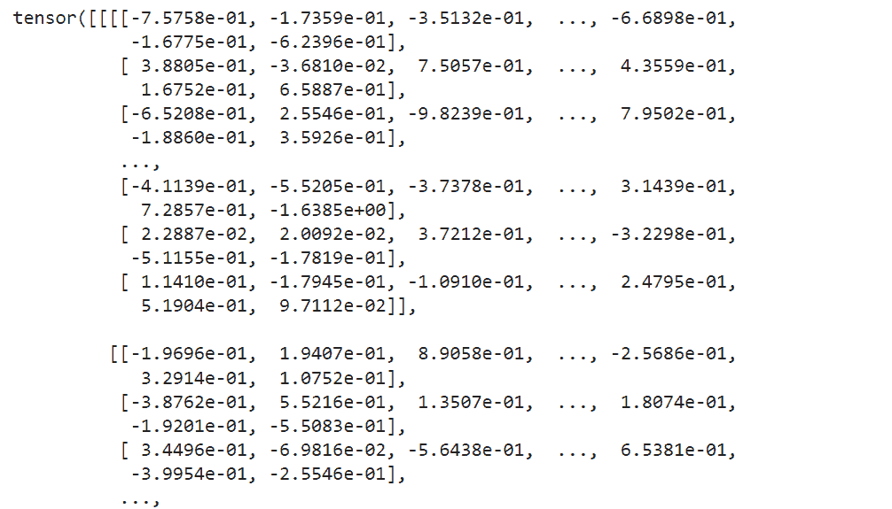
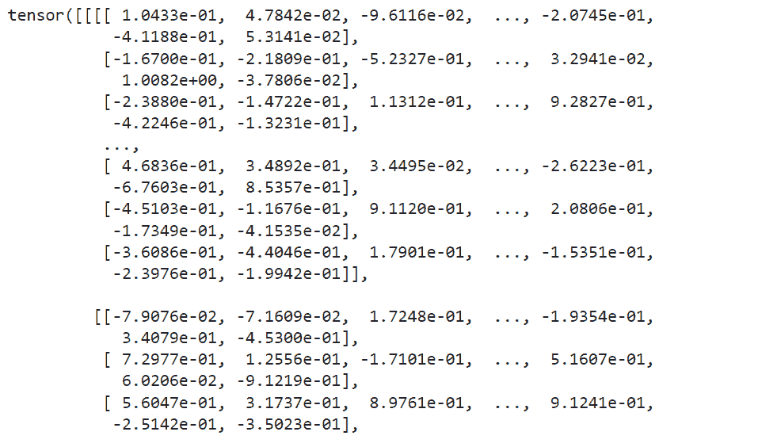
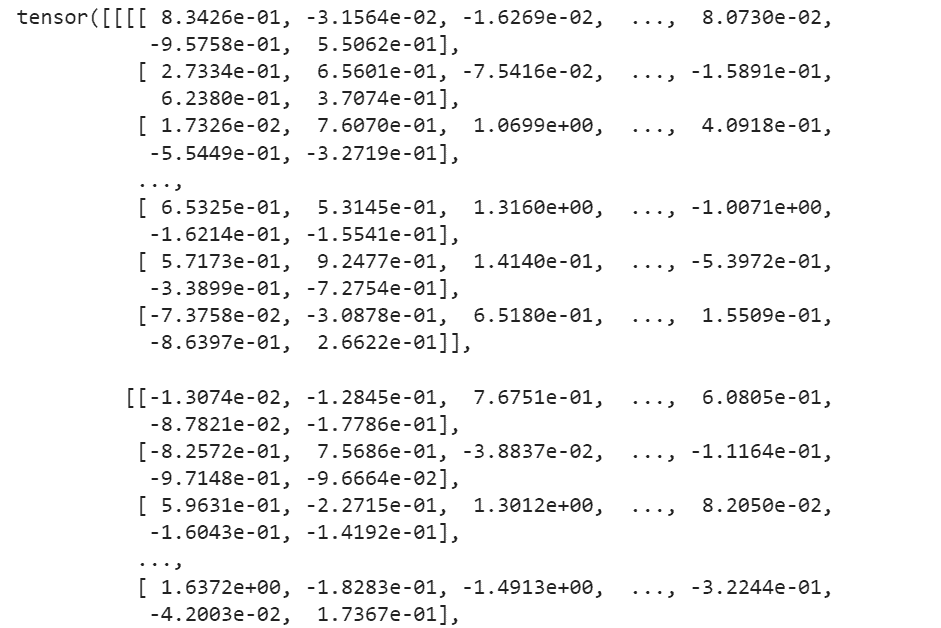
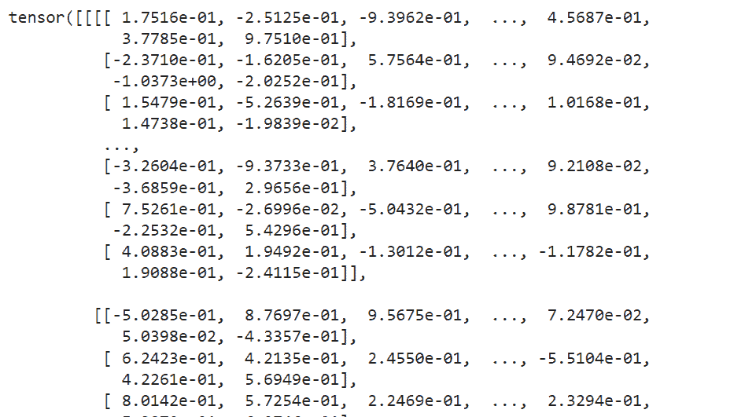
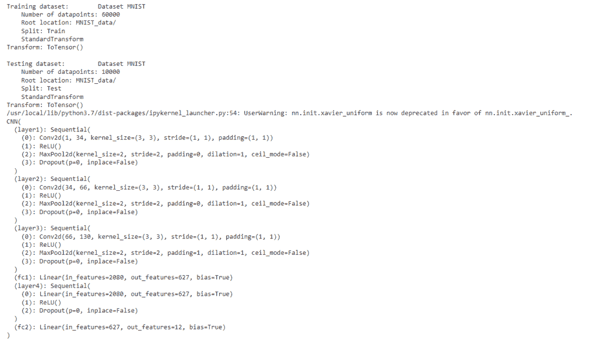
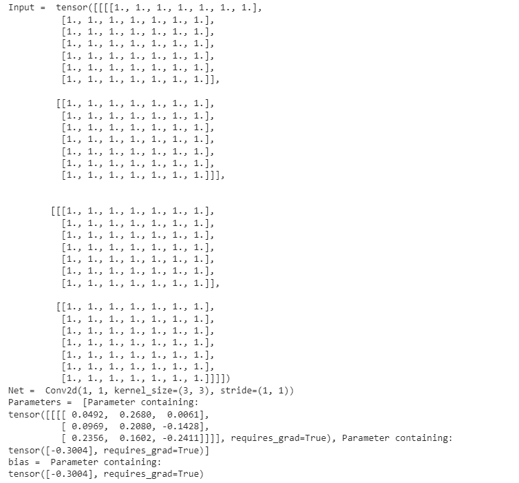
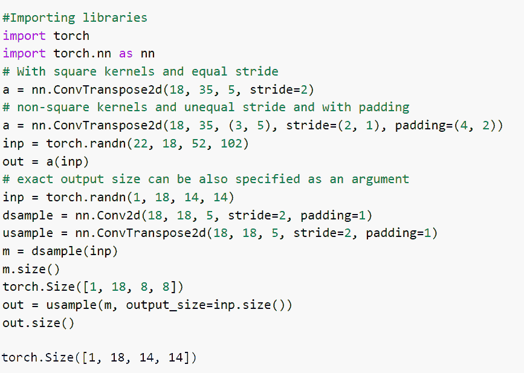
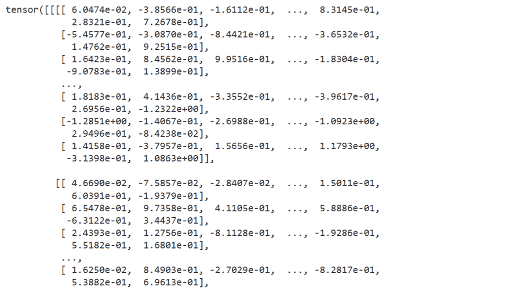
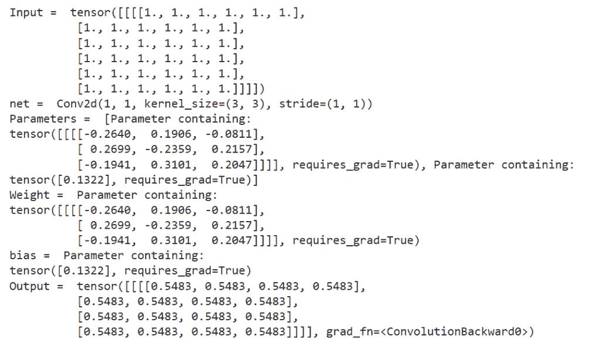
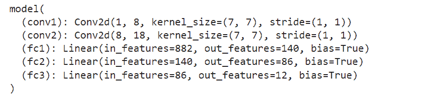

# py torch nn conv 2d[附 12 例]

> 原文：<https://pythonguides.com/pytorch-nn-conv2d/>

[](https://sharepointsky.teachable.com/p/python-and-machine-learning-training-course)

在本 [Python 教程](https://pythonguides.com/learn-python/)中，我们将学习 Python 中的 `PyTorch nn Conv2d` 。conv2d 定义为对系统提供的 2d 矩阵执行的卷积运算。

此外，我们还将介绍与 `PyTorch nn Conv2d` 相关的不同示例。我们将讨论这些话题。

*   PyTorch nn conv2d
*   PyTorch nn conv2d 示例
*   PyTorch nn 泛函 conv2d
*   PyTorch nn conv2d 填充相同
*   PyTorch nn conv2d 组
*   PyTorch nn conv2d 扩展
*   CNN 中的 PyTorch nn conv2d
*   PyTorch nn conv2d 偏置
*   PyTorch nn conv2d 换位器
*   Pytorch nn conv2d 参数
*   PyTorch nn conv2d 权值
*   PyTorch nn conv2d 输入通道和输出通道

目录

[](#)

*   [PyTorch nn conv2d](#PyTorch_nn_conv2d "PyTorch nn conv2d")
*   [PyTorch nn conv2d 示例](#PyTorch_nn_conv2d_example "PyTorch nn conv2d example")
*   [PyTorch nn 泛函 conv2d](#PyTorch_nn_functional_conv2d "PyTorch nn functional conv2d ")
*   [PyTorch nn conv2d 填充相同](#PyTorch_nn_conv2d_padding_same "PyTorch nn conv2d padding same")
*   [PyTorch nn conv2d 组](#PyTorch_nn_conv2d_group "PyTorch nn conv2d group")
*   [PyTorch nn conv2d 稀释](#PyTorch_nn_conv2d_dilation "PyTorch nn conv2d dilation")
*   [PyTorch nn conv2d in CNN](#PyTorch_nn_conv2d_in_CNN "PyTorch nn conv2d in CNN")
*   [PyTorch nn conv2d 偏置](#PyTorch_nn_conv2d_bias "PyTorch nn conv2d bias")
*   [PyTorch nn conv2d 应答](#PyTorch_nn_conv2d_transpose "PyTorch nn conv2d transpose")
*   [Pytorch nn conv2d 参数](#Pytorch_nn_conv2d_parameters "Pytorch nn conv2d parameters")
*   [PyTorch nn conv2d weight](#PyTorch_nn_conv2d_weight "PyTorch nn conv2d weight")
*   [PyTorch nn conv2d 输入通道和输出通道](#PyTorch_nn_conv2d_input_channels_and_output_channels "PyTorch nn conv2d input channels and output channels")

## PyTorch nn conv2d

在本节中，我们将学习 python 中的 `PyTorch nn conv2d` 。

PyTorch nn conv2d 定义为应用于用户指定输入的二维卷积，输入的特定形状以通道、长度和宽度的形式给出，输出以卷积方式给出。

**语法:**

PyTorch nn conv2d 的语法是:

```py
torch.nn.Conv2d(in_channels, out_channels, kernel_size, stride=1, padding=0, dilation=1, groups=1, bias=True, padding_mode='zeros', device=None, dtype=None)
```

**参数:**

以下是 PyTorch nn conv2d 的参数:

*   `in_channels` 用作输入图像中的几个通道。
*   out_channels 用作卷积产生的通道数。
*   kernel_size 用于定义卷积核的大小。
*   跨距用于控制互相关、单个数字或元组的跨距。跨距的默认值为 1。
*   填充用于控制应用于输入的填充量。它可以是字符串，也可以是给定隐式填充量的元组。填充的默认值为 0。
*   **膨胀**用于控制内核元素之间的间距，膨胀的默认值为 1。
*   **组**用于控制输入和输出之间的连接。组的默认值为 1。
*   **偏差:**偏差的默认值为真。如果这是真的，它会给输出增加一个可学习的偏差。如果为假，则不会给输出增加任何可学习的偏差。

所以。由此我们了解了 PyTorch nn conv2d。

阅读: [PyTorch 超参数调谐](https://pythonguides.com/pytorch-hyperparameter-tuning/)

## PyTorch nn conv2d 示例

在本节中，我们将借助 python 中的一个示例来学习如何实现 `PyTorch nn conv2d` 。

PyTorch nn conv2d 对由多个输入平面组成的输入信号应用 2d 卷积。

这是一个简单的算术运算，我们在二维数据上滑动一个权重矩阵或核心，并执行数据的元素乘法。

**代码:**

在下面的代码中，我们将导入所有必要的库，如 import torch，import torch.nn as nn。

*   **n = nn。Conv2d(18，35，5，stride=2)** 用于平方核和等跨距。
*   **input = torch.randn(22，18，52，102)** 用于通过使用 torch.random()函数来描述变量。
*   `output = n(input)` 用于声明输出变量。
*   `print(output)` 用于通过 `print()` 功能打印输出。

```py
# Importing Libraries
import torch
import torch. nn as nn

# With square kernels and equal stride
n = nn.Conv2d(18, 35, 5, stride=2)

# Describe the variable
input = torch.randn(22, 18, 52, 102)

# Declare the output variable
output = n(input)
# Print output
print(output)
```

**输出:**

运行上面的代码后，我们得到下面的输出，其中我们可以看到屏幕上打印了具有方形内核和方形步幅值的 PyTorch nn conv2d。



PyTorch nn conv2d example

PyTorch nn conv2d 就是这样实现的。

读:[pytorch Leakey relu](https://pythonguides.com/pytorch-leaky-relu/)

## PyTorch nn 泛函 conv2d

在本节中，我们将学习 python 中的 **PyTorch nn 函数 conv2d** 。

PyTorch nn 泛函 conv2d 对从多个输入平面收集的输入图像应用 2d 卷积。

**语法:**

PyTorch nn 泛函 conv2d 的语法:

```py
torch.nn.functional.conv2d(input, weight, bias=None, stride=1, padding=0, dilation=1, groups=1)
```

**参数:**

以下是函数 conv2d 的参数

*   **输入:**输入定义为形状的输入张量(minibatch，in_channels)。
*   **权重:**权重被定义为形状的过滤器(out_channels)
*   **偏差:**偏差定义为形状的可选偏差张量(out_channels)。偏差的默认值是无。
*   **步距:**卷积核的步距。stride 的默认值为 1。
*   **填充:**用于控制应用于输入的填充量。它可以是字符串，也可以是给定隐式填充量的元组。填充的默认值为 0。
*   **膨胀:**用于控制内核元素之间的间距，膨胀的默认值为 1。
*   **组**用于控制输入和输出之间的连接。组的默认值为 1。

至此，我们理解了 PyTorch nn 泛函 conv2d。

阅读: [PyTorch 激活功能](https://pythonguides.com/pytorch-activation-function/)

## PyTorch nn conv2d 填充相同

在本节中，我们将学习 python 中填充相同的的 **PyTorch nn conv2d。**

PyTorch nn conv2d padding same 定义为一个参数，用于控制应用于输入的填充量。

它可以是给定数量的隐式填充的字符串或元组，填充的默认值为 0。

**代码:**

在下面的代码中，我们将导入所有必要的库，如 import torch，import torch.nn as nn。

*   **a = nn。Conv2d(20，37，7，stride=2)** 用于平方核和等跨距。
*   **a = nn。Conv2d(20，37，(7，9)，stride=(2，1)，padding=(4，2))** 与非方核和不等步幅以及与 padding 一起使用。
*   **input = torch.randn(24，20，54，104):** 这里我们用 torch.randn()函数来描述输入变量。
*   **打印(输出)**用于使用 print()函数打印输出。

```py
# Importing Libraries
import torch
import torch. nn as nn

# Declaring a variable by using square kernels and equal stride
a = nn.Conv2d(20, 37, 7, stride=2)

# Declaring a variable by using Non-square kernels and unequal stride and padding
a = nn.Conv2d(20, 37, (7, 9), stride=(2, 1), padding=(4, 2))

# Describe the variable
input = torch.randn(24, 20 , 54, 104)
output = a(input)

# Print output
print(output)
```

**输出:**

运行上面的代码后，我们得到下面的输出，其中我们可以看到 PyTorch nn conv2d 填充值打印在屏幕上。



PyTorch nn conv2d padding same

这样，我们理解了 python 中 PyTorch conv2d 填充的相同之处。

阅读: [PyTorch 全连接层](https://pythonguides.com/pytorch-fully-connected-layer/)

## PyTorch nn conv2d 组

在本节中，我们将了解 python 的 PyTorch nn conv2d 组。

PyTorch nn conv2d 组被定义为用于控制输入和输出之间连接的参数，该组的默认值为 1。

**代码:**

在下面的代码中，首先我们将导入所有必要的库，如 import torch 和 import torch.nn as nn。

*   **n = nn。Conv2d(22，37，7，stride=2)** 用于平方核和等跨距。
*   **input = torch.randn(26，22，48，48)** 用于通过使用 torch.random()函数来描述变量。
*   `output = n(input)` 用于声明输出变量。
*   `print(output)` 用于通过 `print()` 功能打印输出。

```py
# Importing libraries
import torch
import torch. nn as nn

# With square kernels and equal stride
n = nn.Conv2d(22, 37, 7, stride=2)

# Describe the input variable
input = torch.randn(26, 22, 48, 48)
output = n(input)

# Print the output
print(output)
```

**输出:**

在下面的输出中，您可以看到 PyTorch nn conv2d 组值打印在屏幕上。



PyTorch nn conv2d group

阅读: [PyTorch 双星交叉熵](https://pythonguides.com/pytorch-binary-cross-entropy/)

## PyTorch nn conv2d 稀释

在本节中，我们将了解 python 的 **PyTorch nn conv2d 膨胀**。

PyTorch nn conv2d 膨胀被定义为用于控制内核元素之间的间距的参数，并且膨胀的默认值是 1。

**代码:**

在下面的代码中，我们会导入一些必要的库比如 import torch，import torch.nn as nn。

*   **n = nn。Conv2d(19，36，6，stride=2)** 用于平方核和等跨距。
*   **m = nn。Conv2d(19，36，(6，8)，stride=(2，1)，padding=(7，5))** 用作非方核和不等步距和带 padding。
*   **m = nn。Conv2d(19，36，(6，8)，stride=(2，1)，padding=(7，5)，exploation =(6，4))** 用作非方核和不等步幅并带有 padding 和 exploation。
*   **input = torch.randn(23，19，53，103):** 这里使用 torch.randn()方法声明输入变量。
*   **打印(输出)**用于使用 output()函数打印输出。

```py
# Importing Libraries
import torch
import torch.nn as nn

# Declaring a variable by using square kernels and equal stride
n = nn.Conv2d(19, 36, 6, stride=2)

# Declaring a variable by using non-square kernels and unequal stride and padding
m = nn.Conv2d(19, 36, (6, 8), stride=(2, 1), padding=(7, 5))

# Declaring a variable by using non-square kernels, unequal stride, padding and dilation
m = nn.Conv2d(19, 36, (6, 8), stride=(2, 1), padding=(7, 5), dilation=(6, 4))

# Declaring the variable
input = torch.randn(23, 19, 53, 103)
output = m(input)

# Print the output
print(output)
```

**输出:**

运行上面的代码后，我们得到下面的输出，其中我们可以看到屏幕上打印了 **PyTorch nn conv2d 膨胀值**。



PyTorch nn conv2d dilation

这样，我们理解了 PyTorch nn con2d 膨胀。

阅读: [PyTorch 数据加载器+示例](https://pythonguides.com/pytorch-dataloader/)

## PyTorch nn conv2d in CNN

在本节中，我们将学习 python 中的 `PyTorch nn conv2d CNN` 。

在继续之前，我们应该有一些关于卷积神经网络(CNN)的知识。

卷积神经网络是一种用于图像识别的人工神经网络。

这里我们使用 conv2d 来处理一个卷积神经网络。这是一种简单的数学运算，其中我们在 2d 数据上滑动权重矩阵或核心，并与数据执行逐元素乘法。

**代码:**

在下面的代码中，我们将导入一些库，如导入 torch，从 torch . autograded 导入变量，导入 torchvision.datasets，导入 torch.nn.init。

*   `batch_size = 34` 用作超参数。
*   **traindata = dtsets。MNIST(root='MNIST 数据/'，train =真，transform =变换。ToTensor()，download=True)** 作为训练 mnist 数据集。
*   **data loader = torch . utils . data . data loader(dataset = train data，batch_size=batch_size，shuffle=True)** 用作数据集加载器。
*   **类 CNN(torch.nn.Module):** 这里我们借助 init()和 forward()方法创建一个模型类。
*   `CNNmodel = CNN()` 用于创建模型的实例。

```py
import torch
from torch.autograd import Variable
import torchvision.datasets as dtsets
import torchvision.transforms as transforms
import torch.nn.init

# hyperparameters
batch_size = 34
keepprobab = 1

# MNIST dataset
traindata = dtsets.MNIST(root='MNIST_data/',
                          train=True,
                          transform=transforms.ToTensor(),
                          download=True)

testdata = dtsets.MNIST(root='MNIST_data/',
                         train=False,
                         transform=transforms.ToTensor(),
                         download=True)

# dataset loader
dataloader = torch.utils.data.DataLoader(dataset=traindata,
                                          batch_size=batch_size,
                                          shuffle=True)

# Display informations about the dataset
print('Train dataset:\t',traindata)
print('\nTest dataset:\t',testdata)

# Implementation of CNN/Convnet Model
class CNN(torch.nn.Module):

    def __init__(self):
        super(CNN, self).__init__()
        self.layer1 = torch.nn.Sequential(
            torch.nn.Conv2d(1, 34, kernel_size=3, stride=1, padding=1),
            torch.nn.ReLU(),
            torch.nn.MaxPool2d(kernel_size=2, stride=2),
            torch.nn.Dropout(p=1 - keepprobab))
        self.layer2 = torch.nn.Sequential(
            torch.nn.Conv2d(34, 66, kernel_size=3, stride=1, padding=1),
            torch.nn.ReLU(),
            torch.nn.MaxPool2d(kernel_size=2, stride=2),
            torch.nn.Dropout(p=1 - keepprobab))
        self.layer3 = torch.nn.Sequential(
            torch.nn.Conv2d(66, 130, kernel_size=3, stride=1, padding=1),
            torch.nn.ReLU(),
            torch.nn.MaxPool2d(kernel_size=2, stride=2, padding=1),
            torch.nn.Dropout(p=1 - keepprobab))

        # L4 FC 4x4x130 inputs -> 627 outputs
        self.fc1 = torch.nn.Linear(4 * 4 * 130, 627, bias=True)
        torch.nn.init.xavier_uniform(self.fc1.weight)
        self.layer4 = torch.nn.Sequential(
            self.fc1,
            torch.nn.ReLU(),
            torch.nn.Dropout(p=1 - keepprobab))
        # L5 Final FC 627 inputs -> 12 outputs
        self.fc2 = torch.nn.Linear(627, 12, bias=True)
        torch.nn.init.xavier_uniform_(self.fc2.weight) # initialize parameters

    def forward(self, y):
        output = self.layer1(y)
        output = self.layer2(output)
        output = self.layer3(output)
        output = output.view(output.size(0), -1)   # Flatten them for FC
        output = self.fc1(output)
        output = self.fc2(output)
        return output

#instantiate CNN model
CNNmodel = CNN()
CNNmodel
```

**输出:**

运行上面的代码后，我们得到下面的输出，其中我们可以看到 CNN 值中的 PyTorch nn conv2d 被打印在屏幕上。



PyTorch nn conv2d in CNN

这就是我们如何在 CNN 中使用 PyTorch nn conv2d。

阅读: [PyTorch 预训练模型](https://pythonguides.com/pytorch-pretrained-model/)

## PyTorch nn conv2d 偏置

在本节中，我们将了解 python 的 PyTorch nn conv2d bias。

PyTorch nn conv2d 偏差定义为形状的可选偏差张量(out_channels)。偏差的默认值是无。

**代码:**

在下面的代码中，首先我们将导入库，如 import torch。

*   **input = torch.ones(2，2，7，7):** 这里我们用 torch.ones()函数来描述输入变量。
*   **print("Input = "，input)** 用于通过 print()函数打印输入的内容。
*   **m = torch . nn . Conv2d(in _ channels = 1，out_channels = 1，kernel_size = 3):** 这里我们使用的是 conv 2d 模块。
*   **print("Parameters = "，list(m.parameters()))** 用于打印参数列表。
*   **print("bias = "，m.bias)** 用于打印偏差。

```py
# Import library
import torch

# Describe the input variable
input = torch.ones(2,2,7,7)

print("Input = ",input)

# Using conv2d module
m = torch.nn.Conv2d(in_channels = 1, out_channels = 1, kernel_size = 3)

# Print the list of the parametrs
print("Net = ",m)
print("Parameters = ",list(m.parameters()))

# Print the bias
print("bias = ",m.bias)
```

**输出:**

运行上述代码后，我们得到以下输出，其中我们可以看到 PyTorch nn conv2d 偏置值打印在屏幕上。



PyTorch nn conv2d bias

至此，我们了解了 PyTorch n n conv2d 偏置。

阅读:[Keras Vs py torch–主要区别](https://pythonguides.com/keras-vs-pytorch/)

## PyTorch nn conv2d 应答

在本节中，我们将学习 python 中的 **PyTorch nn conv2d 转置**。

PyTorch convtranspose2d 对从一些输入平面收集的输入图像应用 2d 转置卷积运算符。

**语法:**

PyTorch nn conv2d 转置的语法

```py
torch.nn.ConvTranspose2d(in_channels, out_channels, kernel_size, stride=1, padding=0, output_padding=0, groups=1, bias=True, dilation=1, padding_mode='zeros', device=None, dtype=None)
```

**参数:**

以下是参数

*   `in_channels` 用作输入图像中的几个通道。
*   out_channels 用作卷积产生的几个通道。
*   `kernel_size` 用作卷积核的大小。
*   **步距**用于控制来自互相关的步距。
*   **填充**:控制隐式补零的数量。
*   **output_padding:** 控制添加到输出形状一侧的附加尺寸。
*   **膨胀**:控制内核点之间的间距。
*   **组:**控制输入和输出之间的连接。

**举例:**

在下面的代码中，首先我们将导入所有必要的库，如 import torch，import torch.nn as nn。

*   **a = nn。ConvTranspose2d(18，35，5，stride=2)** 作为平方核，等步距。
*   **a = nn。ConvTranspose2d(18，35，(3，5)，stride=(2，1)，padding=(4，2))** 用作非方核和带 padding 的不等步幅。
*   **inp = torch.randn(1，18，14，14)** 用作精确的输出大小，也可以指定为参数。
*   **火炬。尺寸([1，18，8，8])** 用于在屏幕上打印尺寸。

```py
#Importing libraries
import torch 
import torch.nn as nn
# With square kernels and equal stride
a = nn.ConvTranspose2d(18, 35, 5, stride=2)
# non-square kernels and unequal stride and with padding
a = nn.ConvTranspose2d(18, 35, (3, 5), stride=(2, 1), padding=(4, 2))
inp = torch.randn(22, 18, 52, 102)
out = a(inp)
# exact output size can be also specified as an argument
inp = torch.randn(1, 18, 14, 14)
dsample = nn.Conv2d(18, 18, 5, stride=2, padding=1)
usample = nn.ConvTranspose2d(18, 18, 5, stride=2, padding=1)
m = dsample(inp)
m.size()
torch.Size([1, 18, 8, 8])
out = usample(m, output_size=inp.size())
out.size()
```

**输出:**

在下面的输出中，您可以看到 PyTorch nn conv2d 转置大小打印在屏幕上。



PyTorch nn conv2d transpose

至此，我们了解了 PyTorch nn conv2d 转座。

阅读: [PyTorch 批量标准化](https://pythonguides.com/pytorch-batch-normalization/)

## Pytorch nn conv2d 参数

在本节中，我们将学习 python 中的 **PyTorch nn conv2d 参数**。

在继续之前，我们应该了解一些关于参数的知识。参数是作为描述系统或设定其操作条件的集合之一而建立的可测量因素。

**代码:**

在下面的代码中，我们将导入所有必要的库，如 import torch，import torch.nn as nn。

*   **p = nn。Conv2d(22，39，5，stride=2)** 与平方核和等跨距一起使用，平方核和等跨距是 nn.conv2d()方法中使用的参数。
*   **inp = torch.randn(26，22，56，106)** 通过使用 torch.random()函数来描述变量。
*   `out = p(inp)` 用于声明输出变量。
*   `print(out)` 用于使用 `print()` 功能打印输出。

```py
# Importing Libraries
import torch
import torch. nn as nn

# With square kernels and equal stride
p = nn.Conv2d(22, 39, 5, stride=2)

# Describe the variable
inp = torch.randn(26, 22, 56, 106)

# Declare the output variable
out = p(inp)
# Print output
print(out)
```

**输出:**

运行上述代码后，我们得到以下输出，其中我们可以看到 PyTorch nn conv2d 参数值打印在屏幕上。



PyTorch nn conv2d parameters

至此，我们了解了 PyTorch nn conv2d 参数。

阅读: [PyTorch 负载模型+示例](https://pythonguides.com/pytorch-load-model/)

## PyTorch nn conv2d weight

在本节中，我们将学习 python 中的 `Pytorch nn conv2d weight` 。

PyTorch nn conv2d 权重用于对 2d 数据执行卷积，以及一些附加选项，如填充等。

**代码:**

在下面的代码中，我们将导入库，如 import torch。

*   **inp = torch.ones(1，1，6，6)** 用于通过使用 torch.ones()函数来描述输入变量。
*   **print("Input = "，inp)** 用于打印输入值。
*   **print("Parameters = "，list(m.parameters()))** 用于打印参数列表。
*   **print("Weight = "，m.weight)** 用于打印重量。
*   **print("bias = "，m.bias)** 用于打印偏差。

```py
# Import library
import torch

# Describe the input variable
inp = torch.ones(1,1,6,6)

# Print input
print("Input = ",inp)

m = torch.nn.Conv2d(in_channels = 1, out_channels = 1, kernel_size = 3)

# Print the parameter list
print("net = ",m)
print("Parameters = ",list(m.parameters()))
# Print the weight
print("Weight = ",m.weight)
# Print the bias
print("bias = ",m.bias)

out = m(inp)

print("Output = ",out)
```

输出:

运行上述代码后，我们得到以下输出，其中我们可以看到 PyTorch nn conv2d 重量打印在屏幕上。



PyTorch nn conv2d weigh

至此，我们了解了 PyTorch nn conv2d 的重量。

阅读:[交叉熵损失 PyTorch](https://pythonguides.com/cross-entropy-loss-pytorch/)

## PyTorch nn conv2d 输入通道和输出通道

在本节中，我们将学习 python 中的 **PyTorch nn conv2d 输入通道和输出通道**。

PyTorch nn conv2d 输入通道用作输入图像中的几个通道。

PyTorch conv2d 输出通道用作卷积产生的通道数。

**代码:**

在下面的输出中，我们将导入所有必要的库，如 import torch、import Variable from torch . autograted、import torch.nn as nn 和 import torch.nn.functional。

*   **班级模型(nn。Module):** 这里我们借助 init()和 forward()函数创建一个模型类。
*   model = model()用于创建模型的实例。
*   print(model)用于借助 `print()` 功能打印模型。

```py
# Importing Libraries
import torch
from torch.autograd import Variable
import torch.nn as nn
import torch.nn.functional as fun

# Create model class
class model(nn.Module):

    def __init__(self):
        super(model, self).__init__()
        # 1 input image channel, 8 output channels, 7x7 square convolution
        self.conv1 = nn.Conv2d(1, 8, 7)
        self.conv2 = nn.Conv2d(8, 18, 7)
        # an affine operation: y = Wx + b
        self.fc1 = nn.Linear(18 * 7 * 7, 140)
        self.fc2 = nn.Linear(140, 86)
        self.fc3 = nn.Linear(86, 12)

    def forward(self, y):
        # Max pooling over a (2, 2) window
        y = fun.max_pool2d(fun.relu(self.conv1(y)), (2, 2))
        # If the size is a square you can only specify a single number
        y = fun.max_pool2d(fun.relu(self.conv2(y)), 2)
        y = y.view(-1, self.numflat_featurs(y))
        y = fun.relu(self.fc1(y))
        y = fun.relu(self.fc2(y))
        y = self.fc3(y)
        return y

    def numflat_featurs(self, y):
      # all dimensions except the batch dimension
        size = y.size()[1:]  
        numfeaturs = 1
        for i in size:
            numfeaturs *= i
        return numfeaturs

# Instantiate the model
model = model()
# Print the model
print(model)
```

**输出:**

运行上述代码后，我们得到以下输出，其中我们可以看到 PyTorch nn conv2d 输入通道和输出通道打印在屏幕上。



PyTorch nn conv2d input channels and output channels

至此，我们了解了 PyTorch nn conv2d 的输入通道和输出通道。

另外，再看看一些 PyTorch 教程。

*   [指针保存模型](https://pythonguides.com/pytorch-save-model/)
*   [PyTorch 展平](https://pythonguides.com/pytorch-flatten/)
*   [PyTorch Full()函数](https://pythonguides.com/pytorch-full-function/)
*   [PyTorch 整形张量](https://pythonguides.com/pytorch-reshape-tensor/)

因此，在本教程中，我们讨论了 `Pytorch nn conv2d` ，并且我们还介绍了与其实现相关的不同示例。这是我们介绍过的型号列表。

*   PyTorch nn conv2d
*   PyTorch nn conv2d 示例
*   PyTorch nn 泛函 conv2d
*   PyTorch nn conv2d 填充相同
*   PyTorch nn conv2d 组
*   PyTorch nn conv2d 扩展
*   CNN 中的 PyTorch nn conv2d
*   PyTorch nn conv2d 偏置
*   PyTorch nn conv2d 换位器
*   Pytorch nn conv2d 参数
*   PyTorch nn conv2d 权重
*   PyTorch nn conv2d 输入通道和输出通道

[Bijay Kumar](https://pythonguides.com/author/fewlines4biju/)

Python 是美国最流行的语言之一。我从事 Python 工作已经有很长时间了，我在与 Tkinter、Pandas、NumPy、Turtle、Django、Matplotlib、Tensorflow、Scipy、Scikit-Learn 等各种库合作方面拥有专业知识。我有与美国、加拿大、英国、澳大利亚、新西兰等国家的各种客户合作的经验。查看我的个人资料。

[enjoysharepoint.com/](https://enjoysharepoint.com/)[](https://www.facebook.com/fewlines4biju "Facebook")[](https://www.linkedin.com/in/fewlines4biju/ "Linkedin")[](https://twitter.com/fewlines4biju "Twitter")