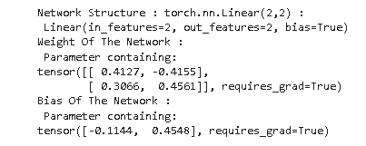

# PyTorch nn 线性+示例

> 原文：<https://pythonguides.com/pytorch-nn-linear/>

[](https://sharepointsky.teachable.com/p/python-and-machine-learning-training-course)

在本 [Python 教程](https://pythonguides.com/learn-python/)中，我们将学习 `Python` 中的 `PyTorch nn linear` ，我们还将涵盖与 `PyTorch nn linear` 相关的不同示例。我们将讨论这些话题。

*   PyTorch 神经网络线性
*   PyTorch 神经网络线性初始化
*   PyTorch nn 线性示例
*   PyTorch 神经网络线性激活
*   PyTorch nn .线性源代码
*   PyTorch 神经线性乙状结肠
*   PyTorch 神经网络线性批处理
*   PyTorch 神经网络线性输入特征
*   PyTorch nn .线性模块列表
*   PyTorch nn .线性 nan 到 num

目录

[](#)

*   [PyTorch nn 线性](#PyTorch_nn_linear "PyTorch nn linear")
*   [PyTorch nn 线性初始化](#PyTorch_nn_linear_initialization "PyTorch nn linear initialization")
*   [PyTorch nn 线性示例](#PyTorch_nn_linear_example "PyTorch nn linear example")
*   [PyTorch 神经线性激活](#PyTorch_nnlinear_activation "PyTorch nn.linear activation")
*   [PyTorch nn.linear 源代码](#PyTorch_nnlinear_source_code "PyTorch nn.linear source code")
*   [PyTorch 神经线性乙状结肠](#PyTorch_nnlinear_sigmoid "PyTorch nn.linear sigmoid")
*   [PyTorch nn.linear 批处理](#PyTorch_nnlinear_batch "PyTorch nn.linear batch")
*   [PyTorch nn . linear in _ features](#PyTorch_nnlinear_in_features "PyTorch nn.linear in_features")
*   [PyTorch nn.linear 模块列表](#PyTorch_nnlinear_module_list "PyTorch nn.linear module list")
*   [PyTorch nn.linear nan to num](#PyTorch_nnlinear_nan_to_num "PyTorch nn.linear nan to num")

## PyTorch nn 线性

在本节中，我们将了解 PyTorch nn linear 如何在 Python 中工作。

*   在继续之前，我们应该有一个关于线性方程的知识。
*   线性方程的形式为 Ax=B，其中我们可以将 x 定义为输入，B 定义为输出，A 定义为权重。
*   [PyTorch](https://pythonguides.com/what-is-pytorch/) nn linear 是一个用于创建具有 n 个输入和 m 个输出的单层前馈网络的模块。

**代码:**

在下面的代码中，我们将导入 torch 模块，从中我们可以创建一个具有 n 个输入和 m 个输出的单层前馈网络。

*   **netof model = torch . nn . linear(2，1)；**用于创建具有 2 个输入和 1 个输出的单层。
*   **print(' Network Structure:torch . nn . linear(2，1) :\n '，netofmodel)** 用于在屏幕上打印网络结构。
*   **print('网络权重:\n '，netofmodel.weight)** 用于在屏幕上打印网络的权重。
*   **print('Bias Of Network :\n '，netofmodel.bias)** 用于在屏幕上打印网络的基础。

```py
import torch
netofmodel = torch.nn.Linear(2,1);

print('Network Structure : torch.nn.Linear(2,1) :\n',netofmodel)

print('Weight Of Network :\n',netofmodel.weight)

print('Bias Of Network :\n',netofmodel.bias)
```

在下面的输出中，我们可以看到网络结构、网络的权重以及网络的基础都打印在屏幕上。


PyTorch nn linear with 2 input with 1 output

在下面的代码中，我们将在 2 个输入和 2 个输出的帮助下创建单层。

*   **print(' Network Structure:torch . nn . linear(2，2) :\n '，netofmodel)** 用于在屏幕上打印网络结构。
*   **print('网络的权重:\n '，netofmodel.weight)** 用于在屏幕上打印网络的权重。
*   **print('网络的偏差:\n '，netofmodel.bias)** 用于在屏幕上打印网络的基础。

```py
import torch
netofmodel = torch.nn.Linear(2,2);
print('Network Structure : torch.nn.Linear(2,2) :\n',netofmodel)

print('Weight Of The Network :\n',netofmodel.weight)

print('Bias Of The Network :\n',netofmodel.bias)
```

在下面的输出中，我们可以看到网络结构、网络的权重、2 输入 2 输出的网络的偏差都打印在屏幕上。



PyTorch nn linear 2 input with 2 output

在下面的代码中，我们将在 2 个输入和 3 个输出的帮助下创建一个单层。

*   **print(' Network Structure:torch . nn . linear(2，3) :\n '，netofmodel)** 用于在屏幕上打印网络结构。
*   **print('网络的权重:\n '，netofmodel.weight)** 用于在屏幕上打印网络的权重。
*   **print('网络的偏差:\n '，netofmodel.bias)** 用于在屏幕上打印网络的基础。

```py
import torch
netofmodel = torch.nn.Linear(2,3);

print('Network Structure : torch.nn.Linear(2,3) :\n',netofmodel)

print('Weight Of The Network :\n',netofmodel.weight)

print('Bias Of The Network :\n',netofmodel.bias)
```

运行上面的代码后，我们得到了下面的输出，其中我们可以看到网络结构，网络的权重，具有 2 个输入和 3 个输出的网络的偏差被打印在屏幕上。


PyTorch nn linear 2 input with 3 output

在下面的代码中，我们将在 3 个输入和 2 个输出的帮助下创建一个单层。

*   **print(' Network Structure:torch . nn . linear(3，2) :\n '，netofmodel)** 用于在屏幕上打印网络结构。
*   **print('网络的权重:\n '，netofmodel.weight)** 用于在屏幕上打印网络的权重。
*   **print('网络的偏差:\n '，netofmodel.bias)** 用于在屏幕上打印网络的偏差。

```py
import torch
netofmodel = torch.nn.Linear(3,2);
print('Network Structure : torch.nn.Linear(3,2) :\n',netofmodel)

print('Weight Of The Network :\n',netofmodel.weight)

print('Bias Of The Network :\n',netofmodel.bias)
```

运行上面的代码后，我们得到下面的输出，其中我们可以看到网络结构，网络的权重，以及网络的偏差在 3 个输入和 2 个输出的帮助下打印在屏幕上。


PyTorch nn linear 3 input with 2 output

阅读:[蟒蛇皮里的熊猫](https://pythonguides.com/pandas-in-python/)

## PyTorch nn 线性初始化

在本节中，我们将了解 PyTorch nn 线性初始化是如何在 python 中完成的。

*   众所周知，线性神经网络是一个模块，用于在 n 个输入和 m 个输出的帮助下创建一个单层前馈网络。
*   Pytorch nn 线性初始化，其中我们还可以借助输入和输出创建前馈网络。

**代码:**

在下面的代码中，我们将导入 torch 库，从中我们可以创建一个前馈网络。

*   **self.linear = nn。Linear(weights.shape[1]，weights.shape[0])** 用于将形状赋予权重。
*   `X = self.linear(X)` 用于定义线性回归的类别。
*   **weight = torch.randn(12，12)** 用于生成随机权重。
*   **outs = model(torch.randn(1，12))** 用于返回变量 argument 定义的张量。
*   **outs.mean()。**()【向后】用于计算平均值。
*   **print(name，param.grad)** 用于打印梯度名称和参数。

```py
import torch
import torch.nn as nn
class MyModule(nn.Module):
    def __init__(self, weights):
        super(MyModule, self).__init__()

        self.linear = nn.Linear(weights.shape[1], weights.shape[0])
        with torch.no_grad():
            self.linear.weight.copy_(weights)

    def forward(self, X):
        X = self.linear(X)
        return X

weight = torch.randn(12, 12)
model = MyModule(weight)
optimizer = torch.optim.SGD(model.parameters(), lr=1e-3)

outs = model(torch.randn(1, 12))
outs.mean().backward()

for name, param in model.named_parameters():
    print(name, param.grad)

w0 = model.linear.weight.clone()
optimizer.step()
```

**输出:**

运行上面的代码后，我们得到下面的输出，其中我们可以看到前馈网络被打印在屏幕上。


Pytorch nn linear initialization

阅读:[Python 中的 NumPy 是什么](https://pythonguides.com/numpy/)

## PyTorch nn 线性示例

在本节中，我们将学习**如何用 python 实现 PyTorch nn 线性示例**。

*   神经网络线性模块用于计算线性方程。线性方程的形式为 Ax = B，其中 x 为输入，B 为输出，A 为权重。
*   神经网络线性模块也被定义为用于创建单层前馈网络。

**代码:**

在下面的代码中，我们将导入一些库，从中我们可以创建一个前馈网络。

*   **self.conv1 = nn。Conv2d(3，8，7)** 用于创建一个具有 3 个输入和 8 个输出的网络。
*   **self.fc1 = nn。**(18 * 7 * 7，140)用于计算线性方程。
*   **X = f . max _ pool 2d(f . relu(self . con v1(X))，(4，4))** 用于创建一个窗口上的 maxpooling。
*   **size = x.size()[3:]** 用于除批量维度以外的所有维度。
*   `print(len(params))` 用于打印参数。

```py
import torch
from torch.autograd import Variable
import torch.nn as nn
import torch.nn.functional as f

class Net(nn.Module):

    def __init__(self):
        super(Net, self).__init__()

        self.conv1 = nn.Conv2d(3, 8, 7)
        self.conv2 = nn.Conv2d(3, 18, 7)

        **# an affine operation: y = Wx + b**
        self.fc1 = nn.Linear(18 * 7 * 7, 140)
        self.fc2 = nn.Linear(140, 86)
        self.fc3 = nn.Linear(86, 12)

    def forward(self, X):
        X = f.max_pool2d(f.relu(self.conv1(X)), (4, 4))

        X = f.max_pool2d(F.relu(self.conv2(X)), 4)

        X = x.view(-3, self.num_flat_features(X))
        X = f.relu(self.fc1(X))
        X = f.relu(self.fc2(X))
        X = self.fc3(X)

        return X

    def num_flat_features(self, x):
        size = x.size()[3:]  
        num_features = 3
        for s in size:       
            num_features *= s
        return num_features

net = Net()
print(net)
params = list(net.parameters())
print(len(params))       

print(params[0].size()) 
```

**输出:**

在下面的输出中，我们可以看到前馈网络是在 `nn.linear` 模块的帮助下创建的。


PyTorch nn linear example

阅读: [PyTorch 张量到 Numpy](https://pythonguides.com/pytorch-tensor-to-numpy/)

## PyTorch 神经线性激活

在本节中，我们将了解 python 中 PyTorch nn.linear 激活的工作方式。

*   Pytorch nn .线性激活函数被定义为获取输入和输出属性并准备矩阵的过程。
*   nn。ReLU 用作创建网络的激活函数，也适合复杂数据。

**代码:**

在下面的代码中，我们将导入一些 torch 库，从中我们可以创建一个网络。

*   `torch.relu(X)` 用作创建网络的激活函数。
*   `f.leaky_relu(X)` 用于当单元不活动时允许小的正梯度。
*   **nn。Linear(input_size，hidden_size)** 模块，获取输入和输出属性并准备矩阵。
*   `nn.relu` 用作创建网络的激活函数。

```py
import torch
import torch.nn as nn
import torch.nn.functional as f

X = torch.tensor([-2.0, 2.0, 3.0, 4.0])

**# sofmax**
output = torch.softmax(X, dim=0)
print(output)
softmax = nn.Softmax(dim=0)
output = softmax(X)
print(output)

**# sigmoid** 
output = torch.sigmoid(X)
print(output)
sig = nn.Sigmoid()
output = sig(X)
print(output)

**#tanh**
output = torch.tanh(X)
print(output)
t = nn.Tanh()
output = t(X)
print(output)

**# relu**
output = torch.relu(X)
print(output)
relu = nn.ReLU()
output = relu(X)
print(output)

output = f.leaky_relu(X)
print(output)
lrelu = nn.LeakyReLU()
output = lrelu(X)
print(output)

class NeuralNet(nn.Module):
    def __init__(self, input_size, hidden_size):
        super(NeuralNet, self).__init__()
        self.linear1 = nn.Linear(input_size, hidden_size)
        self.relu = nn.ReLU()
        self.linear2 = nn.Linear(hidden_size, 2)
        self.sigmoid = nn.Sigmoid()

    def forward(self, X):
        outs = self.linear1(X)
        outs = self.relu(outs)
        outs = self.linear2(outs)
        outs = self.sigmoid(outs)
        return outs

**#use activation functions directly in forward pass**
class NeuralNet(nn.Module):
    def __init__(self, input_size, hidden_size):
        super(NeuralNet, self).__init__()
        self.linear1 = nn.Linear(input_size, hidden_size)
        self.linear2 = nn.Linear(hidden_size, 2)

    def forward(self, X):
        outs = torch.relu(self.linear1(X))
        outs = torch.sigmoid(self.linear2(outs))
        return outs
```

**输出:**

在下面的输出中，我们可以看到 PyTorch nn.linear 激活值打印在屏幕上。


Pytorch nn.linear activation

阅读: [PyTorch 负载模型](https://pythonguides.com/pytorch-load-model/)

## PyTorch nn.linear 源代码

在本节中，我们将了解**如何用 python 实现 PyTorch nn.linear 源代码**。

*   PyTorch nn.linear 源代码定义为计算一个线性方程 Ax=B 的过程。
*   nn.linear 模块也用于在输入和输出的帮助下创建前馈网络。

**代码:**

在下面的代码中，我们将导入一些库，从中我们可以创建一个具有输入和输出的网络。

*   **torch.nn.Linear(1，1)** 用于借助 1 个输入 1 个输出创建网络。
*   `torch . nn . ms loss(size _ average = False)`用作多重标准损失函数。
*   **torch . optim . SGD(model . parameters()，lr = 0.01)** 用于优化参数。
*   `pred_y = model(X_data)` 用于计算预测的 y 数据。
*   `optimizer . zero _ grad()`zero grad 用于执行反向传递和更新权重。
*   **打印(' epoch {}，loss {} '。**(epoch，loss.item())【格式】用于打印数据。

```py
 import torch
from torch.autograd import Variable

X_data = Variable(torch.Tensor([[2.0], [3.0], [4.0]]))
y_data = Variable(torch.Tensor([[3.0], [5.0], [7.0]]))

class LinearRegressionModel(torch.nn.Module):

    def __init__(self):
        super(LinearRegressionModel, self).__init__()
        self.linear = torch.nn.Linear(1, 1) 

    def forward(self, X):
        y_pred = self.linear(X)
        return y_pred

model = LinearRegressionModel()

criterion = torch.nn.MSELoss(size_average = False)
optimizer = torch.optim.SGD(model.parameters(), lr = 0.01)

for epoch in range(400):

    pred_y = model(X_data)

    **# Compute and print loss**
    loss = criterion(pred_y, y_data)

    optimizer.zero_grad()
    loss.backward()
    optimizer.step()
    print('epoch {}, loss {}'.format(epoch, loss.item()))

var = Variable(torch.Tensor([[5.0]]))
pred_y = model(var)
print("predict (After training)", 5, model(var).item())
```

**输出:**

当我们运行上面的代码时，我们得到下面的输出，我们可以看到 epoch 和 loss 值打印在屏幕上。


PyTorch nn.linear source code

阅读:[Keras Vs py torch–主要区别](https://pythonguides.com/keras-vs-pytorch/)

## PyTorch 神经线性乙状结肠

在本节中，我们将了解**如何用 python 实现 PyTorch nn.linear sigmoid** 。

Pytorch nn.linear sigmoid 是一个非线性函数，神经元的激活函数是 sigmoid 函数，它总是给出 0 到 1 之间的单元输出。

**代码:**

在下面的代码中，我们将导入一些库，从中我们可以创建一个前馈网络。

*   **X = torch.randn((4，4，4))** 用于生成随机数。
*   `Y = torch.sigmoid(x)` 用于始终在 0 和 1 之间给出单元的输出。
*   **Y.min()，Y.max()** 用于打印最小值和最大值。
*   **self . linear = torch . nn . linear(input _ dim，1)** 用于创建前馈网络。
*   `torch.manual_seed(1)` 用于设置生成随机数的种子。

```py
import torch

torch.manual_seed(1)

X = torch.randn((4, 4, 4))
Y = torch.sigmoid(x)

Y.min(), Y.max()
)
class MyModel(torch.nn.Module):
    def __init__(self, input_dim):
        super().__init__()
        self.linear = torch.nn.Linear(input_dim, 1)
        self.activation = torch.nn.Sigmoid()

    def forward(self, X):
        x = self.linear(X)
        return self.activation(X)

torch.manual_seed(1)

model = MyModel(5)
X = torch.randn((11, 5))
Y = model(X)

Y.min(), Y.max()
```

**输出:**

运行上面的代码后，我们得到下面的输出，其中我们可以看到屏幕上打印了 `Pytorch nn.linear sigmoid` 值。


Pytorch nn.linear sigmoid

阅读:[py torch ms loss–详细指南](https://pythonguides.com/pytorch-mseloss/)

## PyTorch nn.linear 批处理

在这一节中，我们将学习 python 中 Pytorch nn.linear batch 如何工作。

`PyTorch nn.linear batch` 模块定义为创建全连接权重矩阵的过程，其中每个输入用于创建输出值。

**代码:**

在下面的代码中，我们将导入一些库，从中我们可以创建 nn.linear 批处理。

*   **nn。Sequential()** 用于按顺序运行某一层。
*   `torch.manual_seed(43)` 用于设置固定随机数种子。
*   `mlp = mlp()` 用于初始化 MLP。
*   **对于范围(0，6)内的历元:**用于运行训练循环。
*   **print(f ' starting epoch { epoch+1 } ')**用于打印 epoch。
*   `current_loss = 0.0` 用于设置当前损耗值。
*   **输入，target = data** 用于获取输入。
*   `output = mlp(input)` 用于执行正向传递。

```py
import os
import torch
from torch import nn
from torchvision.datasets import CIFAR10
from torch.utils.data import DataLoader
from torchvision import transforms

class MultilayerPerceptron(nn.Module):

  def __init__(self):
    super().__init__()
    self.layers = nn.Sequential(
      nn.Flatten(),
      nn.Linear(34 * 34 * 4, 65),
      nn.BatchNorm1d(65),
      nn.ReLU(),
      nn.Linear(65, 33),
      nn.BatchNorm1d(33),
      nn.ReLU(),
      nn.Linear(33, 11)
    )

  def forward(self, X):
    '''Forward pass'''
    return self.layers(X)

if __name__ == '__main__':

  torch.manual_seed(43)

  **# Prepare CIFAR-10 dataset**
  dataset = CIFAR10(os.getcwd(), download=True, transform=transforms.ToTensor())
  trainloader = torch.utils.data.DataLoader(dataset, batch_size=10, shuffle=True, num_workers=1)

  mlp = MLP()

  **# Define the loss function and optimizer
**  loss_function = nn.CrossEntropyLoss()
  optimizer = torch.optim.Adam(mlp.parameters(), lr=1e-4)

  for epoch in range(0, 6): 

    print(f'Starting epoch {epoch+1}')

    current_loss = 0.0

    **# Iterate over the DataLoader for training data**
    for i, data in enumerate(trainloader, 0):

      input, target = data

      **# Zero the gradients**
      optimizer.zero_grad()

      output = mlp(input)

     ** # Compute loss**
      loss = loss_function(output, target)

     ** # Perform backward pass**
      loss.backward()

      **# Perform optimization**
      optimizer.step()

     ** # Print statistics**
      current_loss += loss.item()
      if i % 500 == 499:
          print('Loss after mini-batch %5d: %.3f' %
                (i + 1, current_loss / 500))
          current_loss = 0.0
  print('Training process has been finished.')
```

**输出:**

当我们运行上面的代码时，我们将得到下面的输出，其中我们可以看到在屏幕上创建了批处理。


PyTorch nn.linear batch

阅读 [PyTorch 逻辑回归](https://pythonguides.com/pytorch-logistic-regression/)

## PyTorch nn . linear in _ features

在本节中，我们将了解 PyTorch nn.linear in_features 如何在 python 中工作。

*   `py torch nn . linear in _ features`定义为对输入数据应用线性变化的过程。
*   `in_feature` 是用作每个输入样本的大小的参数。

**代码:**

在下面的代码中，我们将导入一些库，从中我们可以对传入的数据应用一些更改。

*   `torch.tensor()` 用作保存单一数据类型元素的多维矩阵。
*   **in_features = X.shape[1]** 用于对传入数据进行一些更改。
*   **nn。【线性(in_features，out_features)】用于创建网络。**

```py
import torch
import torch.nn as nn

X = torch.tensor([[2.0, -2.0],
                  [0.0,  2.0],
                  [0.0,  0.0]])

in_features = X.shape[1]  
out_features = 3

n = nn.Linear(in_features, out_features) 
n.weight
```

**输出:**

运行上述代码后，我们得到以下输出，其中我们可以看到 PyTorch nn.linear in_feature 数据打印在屏幕上。


PyTorch nn.linear in_feature

读取 [PyTorch 双星交叉熵](https://pythonguides.com/pytorch-binary-cross-entropy/)

## PyTorch nn.linear 模块列表

在本节中，我们将学习**如何在 python 中创建 PyTorch nn.linear 模块列表**。

`PyTorch nn.linear` 模块列表被定义为一个可以像系统 Python 列表一样被索引的列表，列表中包含的模块被正确注册，并且对所有模块方法可见。

**代码**

在下面的代码中，我们将导入一些库，从中我们可以创建 PyTorch nn.linear 模块列表。

*   **m1 = nn。线性(ninputs，nhidden_unit)** 用于创建具有 n 个输入和 m 个输出的前馈网络。
*   **nn。【Sigmoid()被定义为神经元的激活函数，它给出的单位输出总是在 0 和 1 之间。**
*   **nn。Softmax(dim=1)** 用于通过特定 dim 应用于所有切片的输入。
*   **nn。ModuleList(m)** 像一个系统化的 Python 列表一样被索引，列表中包含的模块被正确注册。
*   **model = neural network(ninputs = 12，nhidden_unit=32，noutput=4)** 用于创建模型。

```py
import torch
from torch import nn
import torch.nn.functional as f
class neuralnetwork(nn.Module):
    def __init__(self, ninputs, nhidden_unit, noutput):
        super().__init__()
        m1 = nn.Linear(ninputs, nhidden_unit)
        n1 = nn.Sigmoid()
        m2 = nn.Linear(nhidden_unit, noutput)
        s = nn.Softmax(dim=1)

        m = [m1, n1, m2, s]
        self.module_list = nn.ModuleList(m)

    def forward(self, X):
        for f in self.module_list:
            X = f(X)
        return X
model = neuralnetwork(ninputs=12, nhidden_unit=32, noutput=4)
model
```

**输出:**

运行上面的代码后，我们得到下面的输出，其中我们可以看到屏幕上创建了一个神经网络模块列表。


PyTorch nn.linear module list

## PyTorch nn.linear nan to num

在本节中，我们将了解 PyTorch nn.linear nan 如何在 python 中工作。

*   在我们继续之前，我们应该有一些关于南的知识。众所周知，Nan 不是一个数字。
*   Nan 是表示数据中缺失值的方式，也是一个浮点值。这里我们把 NAN 转换成 Num。

**语法:**

```py
torch.nan_to_num(input,nan=0.0,posinf=None,neginf=None,out=None)
```

**语法中使用的参数:**

*   **输入:**输入作为输入张量。
*   `nan` 用来表示数据中缺失的值。nan 的默认值为 0。
*   如果给定了一个数，那么这个数的值将被一个正的无穷大值所代替。如果给定了 None，则正的无穷大值将被由输入 dtypes 值表示的最大有限值替换。
*   **nehinf:** 如果给定一个数的值被一个负的无穷大的值代替。如果给定了 None，则负值由输入 dtypes 值表示的最小有限值表示。
*   **out:** out 作为输出张量。

**举例:**

在这个例子中，我们**导入 torch** 库，从中我们可以将 nan 值转换为 num。

*   **X = torch.tensor([float('nan ')，-float('inf ')，float('inf ')，3.16])** 用于给出 X 值。
*   `torch.nan_to_num(X)` 用于将 nan 转换为 num。

```py
import torch
X = torch.tensor([float('nan'), -float('inf'), float('inf'), 3.16])
torch.nan_to_num(X)
```

**输出:**

运行上面的代码后，我们得到下面的输出，其中我们可以看到 nan 到 num 的值被打印在屏幕上。


PyTorch nn.linear nan to num

因此，在本教程中，我们讨论了 `PyTorchh nn linear` ，并且我们还涵盖了与其实现相关的不同示例。这是我们已经讨论过的例子列表。

*   PyTorch 神经网络线性
*   PyTorch 神经网络线性初始化
*   PyTorch nn 线性示例
*   PyTorch 神经网络线性激活
*   PyTorch nn .线性源代码
*   PyTorch 神经线性乙状结肠
*   PyTorch 神经网络线性批处理
*   PyTorch 神经网络线性输入特征
*   PyTorch nn .线性模块列表
*   PyTorch nn .线性 nan 到 num

[Bijay Kumar](https://pythonguides.com/author/fewlines4biju/)

Python 是美国最流行的语言之一。我从事 Python 工作已经有很长时间了，我在与 Tkinter、Pandas、NumPy、Turtle、Django、Matplotlib、Tensorflow、Scipy、Scikit-Learn 等各种库合作方面拥有专业知识。我有与美国、加拿大、英国、澳大利亚、新西兰等国家的各种客户合作的经验。查看我的个人资料。

[enjoysharepoint.com/](https://enjoysharepoint.com/)[](https://www.facebook.com/fewlines4biju "Facebook")[](https://www.linkedin.com/in/fewlines4biju/ "Linkedin")[](https://twitter.com/fewlines4biju "Twitter")