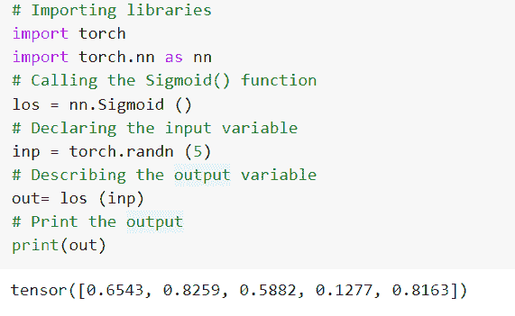

# PyTorch nn Sigmoid 教程，带示例

> 原文：<https://pythonguides.com/pytorch-nn-sigmoid/>

[](https://sharepointsky.teachable.com/p/python-and-machine-learning-training-course)

`PyTorch nn sigmoid` 被定义为 S 形曲线，它不穿过原点，产生一个介于 0 和 1 之间的输出。详细来说，我们将在 python 中使用 [PyTorch 讨论 nn Sigmoid。](https://pythonguides.com/what-is-pytorch/)

此外，我们将涵盖与 PyTorch nn sigmoid 相关的不同示例。我们将讨论这些话题。

*   什么是 PyTorch nn sigmoid
*   PyTorch nn sigmoid 示例
*   如何使用 PyTorch nn 泛函 sigmoid
*   什么是 PyTorch nn log sigmoid
*   PyTorch 神经网络 sigmoid 激活函数
*   PyTorch 神经网络 sigmoid 交叉熵
*   什么是 PyTorch 物流乙状结肠

目录

[](#)

*   [什么是 PyTorch nn sigmoid](#What_is_PyTorch_nn_sigmoid "What is PyTorch nn sigmoid")
*   [py torch nn s 形例子](#PyTorch_nn_sigmoid_example "PyTorch nn sigmoid example")
*   [如何使用 PyTorch nn 泛函 sigmoid](#How_to_use_PyTorch_nn_functional_sigmoid "How to use PyTorch nn functional sigmoid ")
*   [什么是 PyTorch nn log sigmoid](#What_is_PyTorch_nn_log_sigmoid "What is PyTorch nn log sigmoid")
*   [py torch nn s 形激活函数](#PyTorch_nn_sigmoid_activation_function "PyTorch nn sigmoid activation function")
*   [PyTorch nn sigmoid 交叉熵](#PyTorch_nn_sigmoid_cross_entropy "PyTorch nn sigmoid cross entropy")
*   [什么是 py torch logistics sigmoid](#What_is_PyTorch_logistic_sigmoid "What is PyTorch logistic sigmoid")

## 什么是 PyTorch nn sigmoid

在本节中，我们将学习 python 中的**什么是 PyTorch nn sigmod** 。

PyTorch nn sigmoid 被定义为 S 形曲线，它不穿过原点，并产生介于 0 和 1 之间的输出。sigmoid 应用 elementwise 函数。

**语法:**

PyTorch nn sigmoid 的语法:

```py
torch.nn.Sigmoid()
```

在 sigmoid()函数中，我们可以输入任意数量的维度。

sigmoid 以输入的形式返回一个具有相同维度和形状的张量，其值在[0，1]范围内。

这样，我们借助 torch.nn.Sigmoid()函数理解了 PyTorch nn sigmoid。

读取[py torch ms loss](https://pythonguides.com/pytorch-mseloss/)

## py torch nn s 形例子

在这一节中，我们将借助 python 中的一个例子来了解**如何实现 PyTorch nn sigmoid** 。

在 PyTorch sigmoid 中，值在 0 和 1 之间减小，图形缩小为 S 形。如果 S 值变为正值，则输出值预测为 1，如果 S 值变为负值，则输出值预测为 0。

**代码:**

在下面的代码中，首先我们将导入 torch 库，比如 import torch 和 import torch.nn 作为 nn。

*   s = nn。Sigmoid(): 这里我们调用的是 Sigmoid()函数。
*   `input = torch.randn(4)` 用于通过使用 torch.randn()函数来声明输入变量。
*   **output = s(input):** 这里我们声明输出变量。
*   `print(output)` 用于借助 `print()` 功能打印输出。

```py
# Import library
import torch 
import torch.nn as nn
# Calling the sigmoid function
s = nn.Sigmoid()
# Declaring the input variable 
input = torch.randn(4)
# Decribing the output variable
output = s(input)
# Print the output
print(output)
```

**输出:**

运行上面的代码后，我们得到下面的输出，其中我们可以看到 PyTorch nn sigmoid 值打印在屏幕上。


PyTorch nn sigmoid

这是我们借助一个例子来理解 `PyTorch nn sigmoid` 的方法。

阅读:[如何在 PyTorch 中挤压一个张量](https://pythonguides.com/squeeze-a-tensor-in-pytorch/)

## 如何使用 PyTorch nn 泛函 sigmoid

在本节中，我们将学习如何在 python 中使用 PyTorch nn 函数 sigmoid 。

PyTorch nn 泛函 sigmoid 被定义为基于元素的函数，其中实数减少到 0 和 1 之间的值。

**语法:**

PyTorch nn 泛函 sigmoid 的语法。

```py
torch.nn.functional.sigmoid(input)
```

**参数:**

以下是 PyTorch nn 泛函 sigmoid 的参数:

*   输入:输入参数被定义为输入张量。

这就是我们使用 torch.nn.functional.sigmoid()来理解 PyTorch 泛函 sigmoid 的方法。

阅读 [PyTorch 预训练模型](https://pythonguides.com/pytorch-pretrained-model/)

## 什么是 PyTorch nn log sigmoid

在本节中，我们将学习 python 中的**什么是 PyTorch nn log sigmoid** 。

PyTorch nn log sigmoid 被定义为值在 0 和 1 之间减小，并且图形被减小到 S 的形状，并且它应用元素式函数。

**代码:**

在下面的代码中，我们将导入所有必要的库，如 import torch 和 import torch.nn as nn。

*   **ls = nn。LogSigmoid():** 这里我们调用的是 LogSigmoid()函数。
*   `input = torch.randn(4)` 用于通过使用 torch.randn()函数来描述输入变量。
*   **output = ls(input):** 这里我们声明输出变量。
*   **打印(输出)**用于使用 print()函数打印输出。

```py
# Import library
import torch
import torch.nn as nn
# Calling the LogSigmoid() function
ls = nn.LogSigmoid()
# Describing the input variable
input = torch.randn(4)
# Declaring the output variable
output = ls(input)
# Print the output
print(output)
```

**输出:**

运行上述代码后，我们得到以下输出，可以看到 PyTorch nn log sigmoid 值打印在屏幕上。


PyTorch nn log sigmoid

所以，有了这个，我们通过使用 nn 理解了 PyTorch nn log sigmoid。LogSigmoid()函数。

读取 [PyTorch 提前停止](https://pythonguides.com/pytorch-early-stopping/)

## py torch nn s 形激活函数

在本节中，我们将学习 python 中的 **PyTorch nn sigmoid 激活函数**。

在继续之前，我们应该有一个关于激活函数的知识。

激活函数是执行计算以给出输出的函数，该输出充当下一个神经元的输入。

**代码:**

在下面的代码中，我们将首先导入所有必要的库，如 import torch 和 import torch.nn as nn。

*   **输入=火炬。张量([4，-5，6，-8])** 用于创建张量。
*   **sigmoid_fun = nn。Sigmoid():** 这里我们调用的是 Sigmoid 函数。
*   `output = sigmoid _ fun(input)`用于将 sigmoid 应用于张量。
*   **打印(输出)**用于使用 print()函数打印输出。

```py
# Importing Libraries
import torch
import torch.nn as nn

# Create a tensor
input = torch.Tensor([4,-5,6,-8])

# Calling the sigmoid function
sigmoid_fun = nn.Sigmoid()

# Applying sigmoid to the tensor
output = sigmoid_fun(input)

# Print the output
print(output)
```

**输出:**

运行上面的代码后，我们得到下面的输出，其中我们可以看到 PyTorch nn sigmoid 激活函数值被打印在屏幕上。


PyTorch nn sigmoid activation function

因此，有了这个，我们理解了 PyTorch nn sigmoid 激活函数。

读取 [PyTorch 模型评估](https://pythonguides.com/pytorch-model-eval/)

## PyTorch nn sigmoid 交叉熵

在本节中，我们将学习 python 中的 **PyTorch nn sigmoid 交叉熵**。

在继续之前，我们应该了解一些关于交叉熵的知识。

交叉熵创建了一个计算目标概率和输入概率之间的交叉熵的标准。

**代码:**

在下面的代码中，我们将导入所有必要的库，如 import torch 和 import torch.nn as nn。

*   **sce = nn。Sigmoid():** 这里我们调用的是 Sigmoid 函数。
*   **损失= nn。BCELoss():** 这里我们调用的是 BCELoss()函数。
*   **input = torch.randn(5，requires_grad=True)** 用于通过使用 torch.randn()函数来描述输入变量。
*   **target = torch.empty(5)。random_(4)** 用于通过 torch.empty()函数描述目标变量。

**打印(输出)**用于使用 print()函数打印输出。

```py
# Import library
import torch
import torch.nn as nn
# Calling the Sigmoid function
sce = nn.Sigmoid()
# Calling the BCELoss() function
loss = nn.BCELoss()
# Describing the input variable
input = torch.randn(5, requires_grad=True)
# Declaring the target variable
target = torch.empty(5).random_(4)
output = loss(sce(input), target)
# Print output
print(output)
```

**输出:**

在下面的输出中，我们可以看到 Pytorch nn sigmoid 交叉熵值打印在屏幕上。


PyTorch nn sigmoid cross entropy

这就是我们借助 nn.sigmoid()函数理解 Pytorch nn sigmoid 交叉熵的方法。

读取[数据加载器指针](https://pythonguides.com/pytorch-dataloader/)

## 什么是 py torch logistics sigmoid

在本节中，我们将学习 python 中的**什么是 PyTorch 逻辑 sigmoid** 。

PyTorch 逻辑 sigmoid 被定义为不通过原点的非线性函数，因为它是 S 形曲线，并且产生位于 0 和 1 之间的输出。它也被称为逻辑 sigmoid 函数。

**代码:**

在下面的代码中，我们将导入 torch 库，如 import torch，import torch.nn as nn。

*   **los = nn。Sigmoid ():** 这里我们调用的是 Sigmoid()函数。
*   `inp = torch.randn (5)` 用于通过使用 torch.randn()函数来声明输入变量。
*   **out= los (inp):** 这里我们声明输入变量。
*   `print(out)` 用于使用 print()函数打印输出。

```py
# Importing libraries
import torch
import torch.nn as nn
# Calling the Sigmoid() function
los = nn.Sigmoid ()
# Declaring the input variable
inp = torch.randn (5)
# Describing the output variable
out= los (inp)
# Print the output
print(out)
```

**输出:**

运行上面的代码后，我们得到下面的输出，其中我们可以看到 PyTorch 逻辑 sigmoid 值打印在屏幕上。



Pytorch logistic sigmoid

因此，我们用神经网络理解了 PyTorch 逻辑 sigmoid。西格蒙德()函数。

因此，在本教程中，我们讨论了 `PyTorch nn Sigmoid` ,我们还讨论了与其实现相关的不同示例。这是我们已经讨论过的例子列表。

*   什么是 PyTorch nn sigmoid
*   PyTorch nn sigmoid 示例
*   如何使用 PyTorch nn 泛函 sigmoid
*   什么是 PyTorch nn log sigmoid
*   PyTorch 神经网络 sigmoid 激活函数
*   PyTorch 神经网络 sigmoid 交叉熵
*   什么是 PyTorch 物流乙状结肠

您可能会喜欢以下 PyTorch 教程:

*   [PyTorch 逻辑回归](https://pythonguides.com/pytorch-logistic-regression/)
*   [PyTorch 二元交叉熵](https://pythonguides.com/pytorch-binary-cross-entropy/)
*   [PyTorch 车型总结](https://pythonguides.com/pytorch-model-summary/)
*   [PyTorch MNIST 教程](https://pythonguides.com/pytorch-mnist/)
*   [PyTorch 全连接层](https://pythonguides.com/pytorch-fully-connected-layer/)

[Bijay Kumar](https://pythonguides.com/author/fewlines4biju/)

Python 是美国最流行的语言之一。我从事 Python 工作已经有很长时间了，我在与 Tkinter、Pandas、NumPy、Turtle、Django、Matplotlib、Tensorflow、Scipy、Scikit-Learn 等各种库合作方面拥有专业知识。我有与美国、加拿大、英国、澳大利亚、新西兰等国家的各种客户合作的经验。查看我的个人资料。

[enjoysharepoint.com/](https://enjoysharepoint.com/)[](https://www.facebook.com/fewlines4biju "Facebook")[](https://www.linkedin.com/in/fewlines4biju/ "Linkedin")[](https://twitter.com/fewlines4biju "Twitter")