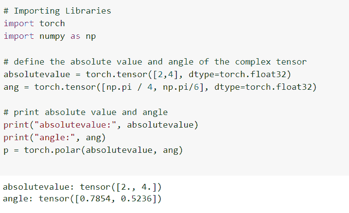

# 如何使用 PyTorch Polar

> 原文：<https://pythonguides.com/pytorch-polar/>

[](https://sharepointsky.teachable.com/p/python-and-machine-learning-training-course)

`torch.polar()` 函数用于利用绝对值和角度构造一个复数。详细来说，我们将在 Python 中使用 [PyTorch 来讨论极坐标函数。](https://pythonguides.com/what-is-pytorch/)

此外，我们将讨论与 PyTorch 极坐标函数相关的不同示例。我们将讨论这些话题。

*   什么是 PyTorch polar
*   PyTorch polar()示例
*   PyTorch polar 用浮点类型创建角度，用数据类型构造复张量
*   如何使用 PyTorch 极坐标
*   PyTorch 极坐标用 double 类型创建角度，用 data 类型构造复张量
*   PyTorch 极坐标用 double 型创建角度，用 float 型构造复张量
*   Pytorch polar 构造了一个 dtype 为 torch.complex64 的复张量，具有张量的绝对长度和角度
*   Pytorch polar 构造了一个 dtype 为 torch.complex128 的复张量，具有张量的绝对长度和角度

目录

[](#)

*   [py torch polar 是什么？](#What_is_PyTorch_polar "What is PyTorch polar? ")
*   [PyTorch polar()示例](#PyTorch_polar_example "PyTorch polar() example")
*   [PyTorch polar 用浮点类型创建角度，用数据类型构造复张量](#PyTorch_polar_create_angles_with_float_type_and_constructs_complex_tensor_with_data_type "PyTorch polar create angles with float type and constructs complex tensor with data type")
*   [如何使用 PyTorch 极坐标](#How_to_use_PyTorch_Polar_Coordinates "How to use PyTorch Polar Coordinates")
*   [PyTorch polar 用 double 类型创建角度，用 data 类型构造复张量](#PyTorch_polar_create_angles_with_double_type_and_construct_complex_tensor_with_data_type "PyTorch polar create angles with double type and construct complex tensor with data type")
*   [PyTorch polar 用 double 类型创建角度，用 float 类型构造复张量](#PyTorch_polar_create_angles_with_double_type_and_construct_complex_tensor_with_float_type "PyTorch polar create angles with double type and construct complex tensor with float type")
*   [Pytorch polar 构造了一个 dtype 的复张量为 torch.complex64，具有张量的绝对长度和角度](#Pytorch_polar_constructed_a_complex_tensor_of_dtype_is_torchcomplex64_with_absolute_length_and_angle_of_tensor "Pytorch polar constructed a complex tensor of dtype is torch.complex64 with absolute length and angle of tensor")
*   [Pytorch polar 构造了一个 dtype 的复张量为 torch.complex128，具有张量的绝对长度和角度](#Pytorch_polar_constructed_a_complex_tensor_of_dtype_is_torchcomplex128_with_absolute_length_and_angle_of_tensor "Pytorch polar constructed a complex tensor of dtype is torch.complex128 with absolute length and angle of tensor")

## py torch polar 是什么？

在这一节中，我们将学习 python 中的 `PyTorch polar` 。

极坐标是用于构造复数的函数，该复数的元素是笛卡尔坐标的，并且与具有绝对值和角度的极坐标相关。

**语法:**

```py
torch.polar(abs, angle, out=None)
```

**参数:**

*   **ABS:**ABS 是复张量的绝对值。
*   **角度:**角度是一个参数，是复张量的角度。
*   **out = None:**out 是 polar()函数的输出张量。

这样，我们借助 torch.polar()函数理解了 Pytorch polar。

阅读: [PyTorch 栈教程+示例](https://pythonguides.com/pytorch-stack/)

## PyTorch polar()示例

在这一节中，我们将借助 python 中的一个例子来学习**如何实现极坐标函数**。

这里我们调用的是 polar()函数，我们可以用绝对值和角度构造一个复数。绝对值和角度必须是浮点数和双精度数。

**代码:**

在下面的代码中，我们将导入所需的库，如 import torch，并将 numpy 作为 np 导入。

*   **absolute value = torch.tensor([3，4]，dtype=torch.float64)** 用于通过使用 torch . tensor()函数来描述变量。
*   **p = torch.polar(absolutevalue，and):** 这里我们调用的是 torch.polar()函数。
*   `print(p)` 用于通过 print()函数打印输出。

```py
# Import Library
import torch
import numpy as np
# Describing the variables
absolutevalue = torch.tensor([3, 4], dtype=torch.float64)
ang = torch.tensor([np.pi / 2, 7 * np.pi / 6], dtype=torch.float64)
# Calling the Polar() function
p = torch.polar(absolutevalue, ang)
# Print the output
print(p)
```

**输出:**

运行上面的代码后，我们得到下面的输出，我们可以看到 PyTorch 极坐标值打印在屏幕上。


PyTorch polar example

这样，我们借助一个例子理解了 PyTorch 极。

阅读:[如何使用 PyTorch Full()函数](https://pythonguides.com/pytorch-full-function/)

## PyTorch polar 用浮点类型创建角度，用数据类型构造复张量

在本节中，我们将学习 PyTorch 极坐标创建浮点型角度，并使用 python 中的数据类型构造复张量。

这里我们使用 torch.polar()函数，从这个函数中我们构造了浮点类型的完美长度和角度，还构造了复张量和数据类型。

**代码:**

在下面的代码中，我们将导入所有必要的库，如 import torch 和 import numpy。

*   **absolute value = torch . tensor([25，47，69，56，34]，dtype=torch.float32)** 用于创建浮点类型的绝对长度。
*   **ang = torch . tensor([numpy . pi/4，numpy.pi / 6，numpy.pi /5，numpy.pi / 7，0]，dtype=torch.float32):** 这里我们用 float 类型创建角度。
*   **print(torch . polar(absolute value，and))** 用于构造复张量。
*   **print(torch . polar(absolute value，ang)。dtype):** 我们在这里构造复张量并显示数据类型。

```py
# Importing libraries
import torch
import numpy

# Creating the absolute lengths with float type
absolutevalue = torch.tensor([25, 47, 69, 56, 34], dtype=torch.float32)

# Creating the angles with float type
ang = torch.tensor([numpy.pi / 4, numpy.pi / 6, numpy.pi /
                      5, numpy.pi / 7, 0], dtype=torch.float32)

# Construct the complex tensor
print(torch.polar(absolutevalue, ang))

# Construct the complex tensor and display the datatype
print(torch.polar(absolutevalue, ang).dtype)
```

**输出:**

运行上面的代码后，我们得到下面的输出，其中我们可以看到 PyTorch polar 创建了一个浮点类型的角度，并构造了一个数据类型为的复张量，值打印在屏幕上。


PyTorch polar create angles with float type and constructs complex tensor with data type

这就是我们如何理解 PyTorch polar 用 float 类型创建角度，用 data 类型构造复杂张量。

阅读:[py torch Lenet 简介](https://pythonguides.com/pytorch-lenet/)

## 如何使用 PyTorch 极坐标

在本节中，我们将学习 python 中的 PyTorch 极坐标。

在前进之前，我们应该有一个关于坐标的知识。

坐标是将一个复合活动的不同要素纳入一个系统关系的坐标。

**代码:**

在下面的代码中，我们将导入所有必要的库，如 import torch 和 import numpy as np。

*   **absolute value = torch . tensor([2，4]，dtype=torch.float32):** 这里我们定义复张量的绝对值。
*   **ang = torch.tensor([np.pi / 4，np.pi/6]，dtype=torch.float32):** 这里我们定义的是复张量的角度。
*   **print("absolutevalue:"，absolutevalue)** 用于打印绝对值。
*   **print("angle:"，ang)** 用于通过 print()函数打印角度。
*   **p = torch.polar(absolutevalue，ang):** 这里我们调用的是 torch.polar()函数。

```py
# Importing Libraries
import torch
import numpy as np

# define the absolute value and angle of the complex tensor
absolutevalue = torch.tensor([2,4], dtype=torch.float32)
ang = torch.tensor([np.pi / 4, np.pi/6], dtype=torch.float32)

# print absolute value and angle
print("absolutevalue:", absolutevalue)
print("angle:", ang)
p = torch.polar(absolutevalue, ang) 
```

**输出:**

运行上面的代码后，我们得到下面的输出，其中我们可以看到 PyTorch 极坐标值被打印在屏幕上。



PyTorch polar coordinates

这就是我们在 python 中理解 PyTorch 极坐标的方法。

阅读: [PyTorch 整形张量](https://pythonguides.com/pytorch-reshape-tensor/)

## PyTorch polar 用 double 类型创建角度，用 data 类型构造复张量

在本节中，我们将了解 PyTorch 极坐标使用 double 类型创建角度，并使用 python 中的数据类型构造复张量。

在这里，我们使用 torch.polar()函数来构造数据类型的复张量，并创建双精度类型的角度。

**代码:**

在下面的代码中，我们将导入所有必要的库，如 import torch 和 import numpy。

*   **absolute value = torch . tensor([25，47，69，54，36]，dtype=torch.double):** 这里我们用 double 类型创建绝对长度。
*   **ang = torch . tensor([numpy . pi/4，numpy.pi / 6，numpy.pi / 5，numpy.pi / 7，0]，dtype=torch.double):** 这里我们用 float 类型创建角度。
*   **print(torch . polar(absolute value，ang))** 用于构造复张量。
*   **print(torch . polar(absolute value，ang)。dtype)** 用于通过 print()函数打印绝对值和角度。

```py
# Importing libraries
import torch
import numpy

# Creating the absolute lengths with double type
absolutevalue = torch.tensor([25, 47, 69, 54, 36], dtype=torch.double)

# Creating the angles with float type
ang = torch.tensor([numpy.pi / 4, numpy.pi / 6, numpy.pi /
                      5, numpy.pi / 7, 0], dtype=torch.double)

# Construct the complex tensor
print(torch.polar(absolutevalue, ang))

# Construct the complex tensor and display the datatype
print(torch.polar(absolutevalue, ang).dtype)
```

**输出:**

运行上述代码后，我们得到以下输出，其中我们可以看到 py torch polar create with double type 和 constructed complex tensor with data type values 打印在屏幕上。


PyTorch polar create angles with double type and construct complex tensor with data type

这就是我们对 PyTorch 极坐标的理解，用 double 类型创建角度，用 data 类型构造复杂张量。

阅读: [Jax Vs PyTorch](https://pythonguides.com/jax-vs-pytorch/)

## PyTorch polar 用 double 类型创建角度，用 float 类型构造复张量

在这一节中，我们将学习双精度类型的 Pytorch 极角，并在 python 中构造浮点类型的复杂张量。

在这里，我们使用 torch.polar()函数来构造数据类型的复张量，并创建浮点类型的角度。

**代码:**

在下面的代码中，我们将导入 torch 库，如 import torch。

*   **absolute value = torch . tensor([5，4]，dtype=torch.float64):** 这里我们用 float 类型创建角度的绝对长度。
*   **print(torch . polar(absolute value，angle))** 用于构造复张量。

```py
# Importing libraries
import torch
import numpy

# Creating the absolute lengths of angle with float type
absolutevalue = torch.tensor([5, 4], dtype=torch.float64)

# Creating the angles with float type
angle = torch.tensor([numpy.pi / 4, numpy.pi / 6], 
                     dtype=torch.double)

# Construct the complex tensor
print(torch.polar(absolutevalue, angle))

# Construct the complex tensor and display the datatype
print(torch.polar(absolutevalue, angle).dtype)
```

**输出:**

在下面的输出中，我们可以看到 Pytorch 极坐标使用 double 类型创建角度，并使用打印在屏幕上的 float 类型值构造复杂张量。


PyTorch polar create angles with double type and construct complex tensor with float type

这样，我们就理解了 PyTorch 极坐标用 double 型生成角，用 float 型构造复张量。

阅读: [PyTorch Numpy to Tensor](https://pythonguides.com/pytorch-numpy-to-tensor/)

## Pytorch polar 构造了一个 dtype 的复张量为 torch.complex64，具有张量的绝对长度和角度

在这一节中，我们将学习 PyTorch 极坐标构造的一个复张量，dtype 是 torch.complex64，具有张量的绝对长度和角度。

这里我们使用 torch.polar()函数，从该函数中我们构造了 id torch.complex64 数据类型的复张量，具有张量的绝对长度和角度。

**代码:**

在下面的代码中，我们将导入所有必要的库，如 import torch 和 import numpy。

*   **absolute value = torch . tensor([4，6]，dtype=torch.float32)** 用于定义复张量的绝对值。
*   **print("绝对值:"，absolutevalue)** 用于打印绝对值。
*   **polar = torch . polar(absolute value，ang):** 这里我们调用的是 polar()函数。
*   **print("复数的 dtype:\ n "，polar.dtype)** 用于打印复数的类型。

```py
# Import library
import torch
import numpy as np

# Define the absolute value of the complex tensor
absolutevalue = torch.tensor([4,6], dtype=torch.float32)
# Define the angle of the complex tensor
ang = torch.tensor([np.pi / 4, np.pi / 6], dtype=torch.float32)

# Print the absolute value and angle
print("absolute value:", absolutevalue)
print("ang:", ang)
polar = torch.polar(absolutevalue, ang)
print("Complex number:\n",polar)
print("dtype of complex number:\n", polar.dtype)
```

**输出:**

运行上面的代码后，我们得到下面的输出，其中我们可以看到 PyTorch polar 构造了一个 dtype 为 torch.complex64 的复张量。


PyTorch polar constructed a complex tensor of dtype is torch complex64 with absolute length and angle of tensor

这样，我们就可以理解 PyTorch 极构作了一个 dtype 的复张量是 torch complex64，具有张量的绝对长度和角度。

阅读: [PyTorch 全连接层](https://pythonguides.com/pytorch-fully-connected-layer/)

## Pytorch polar 构造了一个 dtype 的复张量为 torch.complex128，具有张量的绝对长度和角度

在这一节中，我们将了解 PyTorch 极坐标构造的一个复张量 dtype 是 torch.complex128，具有张量的绝对长度和角度。

在这里，我们使用 torch.polar()函数，从该函数中，我们用张量的绝对长度和角度来构造数据类型 id torch.complex128 的复张量。

**代码:**

在下面的代码中，我们将导入所需的库，如 import torch 和 import numpy。

*   **ang = torch.tensor([np.pi / 4，5 * np.pi / 6]，dtype=torch.float64)** 用于定义复张量的角度。
*   **plr = torch.polar(absolute value，ang):** 这里我们调用的是 torch . polar()函数。
*   **print(" dtype of complex number:\ n "，plr.dtype)** 用于打印复杂数据类型的类型。

```py
# Import library
import torch
import numpy as np
# Define the absolute value of the complex tensor
absolutevalue = torch.tensor([3, 5], dtype=torch.float64)
# Define the angle of the complex tensor
ang = torch.tensor([np.pi / 4, 5 * np.pi / 6], dtype=torch.float64)
# Calling the torch.polar() function
plr = torch.polar(absolutevalue, ang)
print("Complex number: \n",plr)
print("dtype of complex number:\n", plr.dtype)
```

**输出:**

运行上述代码后，我们得到以下输出，其中我们可以看到 PyTorcvh 极坐标构造 dtype 的复张量是 torch.complex128 值打印在屏幕上。


Pytorch polar constructed a complex tensor of dtype is torch.complex128 with absolute length and angle of tensor

这就是我们对 Pytorch 极的理解，它构造了一个 dtype 的复张量，它是 torch.complex128，具有张量的绝对长度和角度。

另外，看看更多 Python 中的 PyTorch 教程。

*   [PyTorch 逻辑回归](https://pythonguides.com/pytorch-logistic-regression/)
*   [数据加载器指针+示例](https://pythonguides.com/pytorch-dataloader/)
*   [PyTorch 预训练模型](https://pythonguides.com/pytorch-pretrained-model/)
*   [指针为 Numpy](https://pythonguides.com/pytorch-tensor-to-numpy/)

因此，在本教程中，我们讨论了 `PyTorch Polar` ,我们还涵盖了与其实现相关的不同示例。这是我们已经讨论过的例子列表。

*   什么是 PyTorch polar
*   PyTorch polar()示例
*   PyTorch polar 用浮点类型创建角度，用数据类型构造复张量
*   如何使用 PyTorch 极坐标
*   PyTorch 极坐标用 double 类型创建角度，用 data 类型构造复张量
*   PyTorch 极坐标用 double 型创建角度，用 float 型构造复张量
*   Pytorch polar 构造了一个 dtype 为 torch.complex64 的复张量，具有张量的绝对长度和角度
*   Pytorch polar 构造了一个 dtype 为 torch.complex128 的复张量，具有张量的绝对长度和角度

[Bijay Kumar](https://pythonguides.com/author/fewlines4biju/)

Python 是美国最流行的语言之一。我从事 Python 工作已经有很长时间了，我在与 Tkinter、Pandas、NumPy、Turtle、Django、Matplotlib、Tensorflow、Scipy、Scikit-Learn 等各种库合作方面拥有专业知识。我有与美国、加拿大、英国、澳大利亚、新西兰等国家的各种客户合作的经验。查看我的个人资料。

[enjoysharepoint.com/](https://enjoysharepoint.com/)[](https://www.facebook.com/fewlines4biju "Facebook")[](https://www.linkedin.com/in/fewlines4biju/ "Linkedin")[](https://twitter.com/fewlines4biju "Twitter")