# PyTorch 预训练模型

> 原文：<https://pythonguides.com/pytorch-pretrained-model/>

[](https://sharepointsky.teachable.com/p/python-and-machine-learning-training-course)

在这个 [Python 教程](https://pythonguides.com/learn-python/)中，我们将了解 **PyTorch 预训练模型**，我们还将涵盖与 **PyTorch 预训练模型**相关的不同示例。我们将讨论这些话题。

*   PyTorch 预训练模型
*   PyTorch 预训练模型示例
*   PyTorch 预训练模型特征提取
*   PyTorch 预训练模型 cifar 10
*   PyTorch 预训练模型负载
*   PyTorch 预训练模型移除最后一层
*   PyTorch 预训练模型归一化
*   PyTorch 预处理修改最后一层
*   PyTorch 预训练模型更改输入大小
*   PyTorch 预训练模型添加层
*   PyTorch 预训练模型微调
*   PyTorch 预训练模型图像分类
*   PyTorch 预训练模型推理

目录

[](#)

*   [PyTorch 预训练模型](#PyTorch_pretrained_model "PyTorch pretrained model")
*   [PyTorch 预训练模型示例](#PyTorch_pretrained_model_example "PyTorch pretrained model example")
*   [PyTorch 预训练模型特征提取](#PyTorch_pretrained_model_feature_extraction "PyTorch pretrained model feature extraction")
*   [PyTorch 预训练模型 cifar 10](#PyTorch_pretrained_model_cifar_10 "PyTorch pretrained model cifar 10")
*   [PyTorch 预训练模型负载](#PyTorch_pretrained_model_load "PyTorch pretrained model load")
*   [PyTorch 预处理模型移除最后一层](#PyTorch_pretrained_model_remove_last_layer "PyTorch pretrained model remove last layer")
*   [PyTorch 预训练模型归一化](#PyTorch_pretrained_model_normalization "PyTorch pretrained model normalization")
*   [PyTorch 预处理修改最后一层](#PyTorch_pretrained_modify_the_last_layer "PyTorch pretrained modify the last layer")
*   [PyTorch 预训练模型改变输入尺寸](#PyTorch_pretrained_model_change_input_size "PyTorch pretrained model change input size")
*   [PyTorch 预训练模型添加图层](#PyTorch_pretrained_model_add_layer " PyTorch pretrained model add layer")
*   [PyTorch 预训练模型微调](#PyTorch_pretrained_model_fine-tune " PyTorch pretrained model fine-tune")
*   [PyTorch 预处理模型图像分类](#PyTorch_pretrained_model_image_classification "PyTorch pretrained model image classification")
*   [PyTorch 预训练模型推理](#PyTorch_pretrained_model_inference "PyTorch pretrained model inference")

## PyTorch 预训练模型

在这一节中，我们将学习 python 中的 **[PyTorch](https://pythonguides.com/what-is-pytorch/) 预训练模型**。

*   在继续之前，我们应该有一个关于预训练模型的知识。
*   预训练模型被定义为在标准数据集(如 ImageNet)上训练的神经网络模型。

**代码:**

在下面的代码中，我们将**导入 pretrainedmodels** 模块，从中我们可以在标准数据集上训练模型。

*   `print(pretrained models . model _ names)`用于打印预训练的模型数据。
*   **模型=预训练模型。_ _ dict _ _[model name](num _ classes = 1000，pretrained='imagenet')** 用于加载预训练的模型。
*   `models.eval()` 用于评估模型。

```py
import pretrainedmodels
print(pretrainedmodels.model_names)
print(pretrainedmodels.pretrained_settings['nasnetalarge'])
modelname = 'nasnetalarge' 
models = pretrainedmodels.__dict__[modelname](num_classes=1000, pretrained='imagenet')
models.eval()
```

**输出:**

运行上面的代码后，我们得到下面的输出，我们可以看到预训练的模型数据被打印在屏幕上。

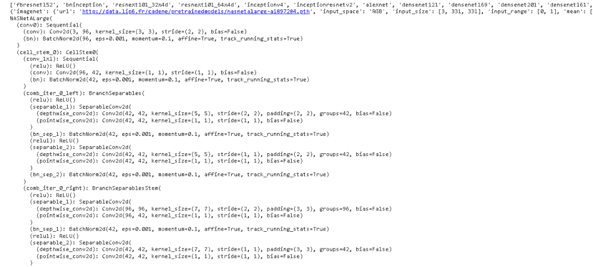

PyTorch pretrained model

另外，检查: [PyTorch 保存模型](https://pythonguides.com/pytorch-save-model/)

## PyTorch 预训练模型示例

在本节中，我们将通过 python 中的示例了解 **PyTorch 预训练模型。**

*   预训练模型是指已经在一些数据集上训练过的深度学习架构。
*   预训练模型是在 alexnet、ImageNet 等标准数据集上训练的神经网络模型。

**代码:**

在下面的代码中，我们将导入一些库，通过示例的帮助，我们可以在标准数据集上训练模型。

*   `dir(model)` 用于在屏幕上显示不同的模型和架构。
*   `Alex net = model . Alex net(pre trained = True)`用作预训练模型。
*   `print(alexnet)` 用于打印预训练模型的数据。

```py
from torchvision import models as model
import torch
dir(model)
alexnet = model.alexnet(pretrained=True)
print(alexnet)
```

**输出:**

运行上面的代码后，我们得到下面的输出，我们可以看到预训练模型的数据被打印在屏幕上。

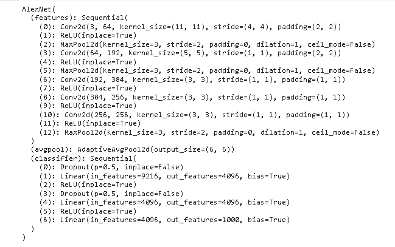

PyTorch pretrained model example

阅读:[交叉熵损失 PyTorch](https://pythonguides.com/cross-entropy-loss-pytorch/)

## PyTorch 预训练模型特征提取

在本节中，我们将了解如何在 python 中的预训练模型中完成特征提取。

特征提取被定义为降维的过程，通过该过程，原始数据的初始集合被减少到更可实现的组以便处理。

**代码:**

在下面的代码中，我们将导入一些库，从中我们可以从预训练的模型中提取特征。

*   `rn18 = model . resnet 18(pre trained = True)`用作预训练模型。
*   **print("Children Counter:"，Children_Counter，" Layer Name:"，I，)**用于打印子计数器和层名称。
*   **rn18。_modules** 用于在屏幕上显示模块。

```py
import torch
import torch.nn as nn
from torchvision import models as model
rn18 = model.resnet18(pretrained=True)
Children_Counter = 0
for i,j in rn18.named_children():
    print("Children Counter: ",Children_Counter," Layer Name: ",i,)
    Children_Counter+=1
rn18._modules
```

**输出:**

在下面的输出中，我们可以看到该特征可以由预训练的模型提取并打印在屏幕上。

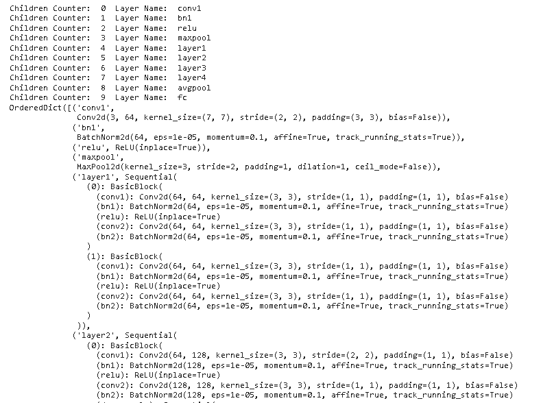

PyTorch pretrained model feature extraction

阅读: [Adam optimizer PyTorch 示例](https://pythonguides.com/adam-optimizer-pytorch/)

## PyTorch 预训练模型 cifar 10

在本节中，我们将学习 python 中的 PyTorch 预训练模型 cifar 10 。

*   CiFAR-10 是一个数据集，它是一个数据集合，通常用于训练机器学习，也用于计算机版本算法。
*   在这里，我们可以使用在 cifar 10 等标准数据集上训练的预训练模型，cifar 代表加拿大高级研究所。

**代码:**

在下面的代码中，我们将把 torch 库导入到 cifar-10 等标准的预训练模型中。

*   **从 pprint 导入 pprint as print** 用于以 python 数据结构的形式美化打印，该数据结构可用作解释器的输入。
*   **print(torch . hub . list(" chenyaofo/py torch-cifar-models "，force_reload=True))** 用于打印并重新加载屏幕数据。

```py
import torch
from pprint import pprint as print
print(torch.hub.list("chenyaofo/pytorch-cifar-models", force_reload=True))
```

**输出:**

运行上面的代码后，我们得到下面的输出，其中我们可以看到 cifar 模型数据被打印在屏幕上。

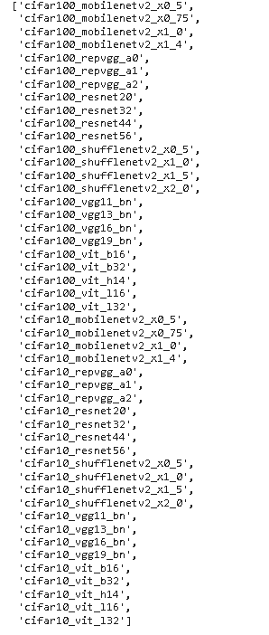

PyTorch pretraied cifar10

读取 [PyTorch 模型评估](https://pythonguides.com/pytorch-model-eval/)

## PyTorch 预训练模型负载

在这一节中，我们将学习**如何在 python 中加载预训练模型**。

*   预训练模型定义为在合适的数据集(如 AlexNet、ImageNet 等)上训练的神经网络模型。
*   研究人员可以使用这些预训练的模型，而不是从头再来。
*   在这里，我们可以使用预训练模型并加载预训练模型的数据。

**代码:**

在下面的代码中，我们将导入在合适的数据集上训练的预训练模型，并加载数据。

*   `print(pretrained models . model _ names)`用于打印预训练的模型名称。
*   **模型=预训练模型。_ _ dict _ _[model name](num _ classes = 1000，pretrained='imagenet')** 用于加载模型。
*   `models.eval()` 用于评估模型。

```py
 import pretrainedmodels 
 print(pretrainedmodels.model_names)
 print(pretrainedmodels.pretrained_settings['vgg11'])
 modelname = 'vgg11' 
models = pretrainedmodels.__dict__[modelname](num_classes=1000, pretrained='imagenet')
models.eval()
```

**输出:**

运行上面的代码后，我们得到下面的输出，其中我们可以看到 PyTorch 预训练的模型数据被加载到屏幕上。

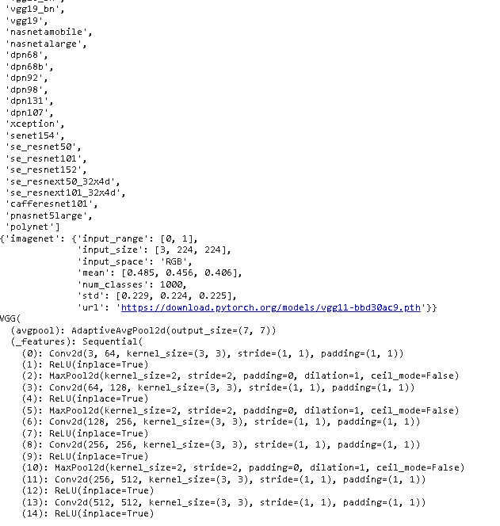

PyTorch pretrained model load

读取 [PyTorch 提前停止](https://pythonguides.com/pytorch-early-stopping/)

## PyTorch 预处理模型移除最后一层

在第节中，我们将了解到 **PyTorch 预训练模型移除了 python 中的最后一层**。

*   预训练模型在合适的数据集上训练，这里我们要删除训练模型的最后一层。
*   从预训练模型中移除最后一层后，屏幕上会生成新数据。

**代码:**

在下面的代码中，我们将导入一些库，从中我们可以删除预训练模型的最后一层。

*   `models . resnet 152(pre trained = True)`用作预训练模型。
*   **打印(重塑)**用于打印模型。
*   `list(premodel.modules())` 用于检查模型的模块。
*   **nn。sequential(* list(pre model . modules())[:-1])**用于接受任何输入，快速实现顺序模块。
*   **mymodel = nn。sequential(* list(pre model . modules())[:-1])**用于删除最后一层。
*   **打印(mymodel)** 用于打印模型。

```py
from torchvision import datasets, transforms, models
premodel = models.resnet152(pretrained=True)
print(premodel)
list(premodel.modules()) 
mymodel = nn.Sequential(*list(premodel.modules())[:-1])
premodel = models.resnet152(pretrained=True)
list(premodel.modules())
mymodel = nn.Sequential(*list(premodel.modules())[:-1]) 
print(mymodel)
```

**输出:**

运行上述代码后，我们得到以下输出，其中我们可以看到最后一层从预训练模型中移除，修改后的预训练模型打印在屏幕上。

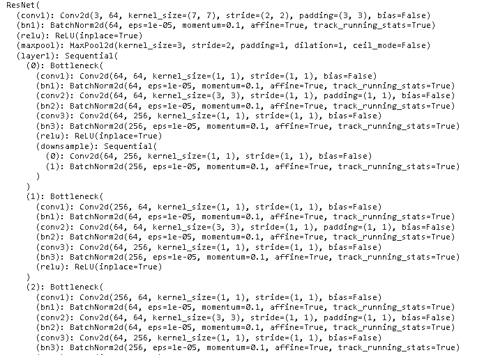

PyTorch pretrained model remove the last layer

## PyTorch 预训练模型归一化

在本节中，我们将学习 python 中的 **PyTorch 预训练模型规范化**。

PyTorch 中的规范化是使用`torch vision . transform . normalization()`完成的。这用于使用平均值和标准偏差对数据进行标准化。

**代码:**

在下面的代码中，我们将导入一些库，从中我们可以规范化我们的预训练模型。

*   **数据集=数据集。MNIST(“数据”，下载=真，训练=真，变换=变换。**【ToTensor()】用于转换数据集。
*   正常化=转换。Normalize(mean=[0.495，0.467，0.418]，std=[0.239，0.324，0.235]) 用于对数据进行归一化处理。
*   `mean = torch.zeros(1)` 用于计算平均值。
*   `std = torch.zeros(1)` 用于计算标准差。
*   **打印('计算平均值和标准差')**用于打印计算平均值和标准差。

```py
import os
import torch
from torchvision import datasets, transforms
from torch.utils.data.dataset import Dataset
from tqdm.notebook import tqdm
from time import time

nchanels = 1

ds = datasets.MNIST("data", download=True,
                 train=True, transform=transforms.ToTensor())
normalize = transforms.Normalize(mean=[0.495, 0.467, 0.418],
                                  std=[0.239, 0.324, 0.235])
fulldr = torch.utils.data.DataLoader(ds, shuffle=False, num_workers=os.cpu_count())

mean_val = torch.zeros(1)
std_val = torch.zeros(1)
print('Calculating mean_val and std_val')
for input, lbls in tqdm(fulldr):
    for x in range(nchanels):
        mean_val[x] += input[:,x,:,:].mean()
        std_val[x] += input[:,x,:,:].std()
mean_val.div_(len(ds))
std_val.div_(len(ds))
print(mean_val, std_val)
```

**输出:**

在下面的输出中，我们可以看到平均值和标准偏差打印在屏幕上，对 PyTorch 预训练模型进行标准化。

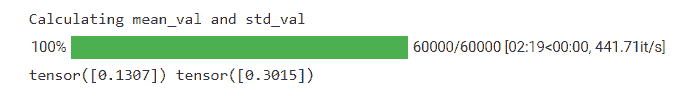

PyTorch pretrained model normalization

## PyTorch 预处理修改最后一层

在这一节中，我们将学习如何用 python 修改 PyTorch 预训练模型的最后一层。

*   预训练模型是在合适的数据集(如 ImageNet、Alexnet 等)上训练的神经网络模型。
*   在这里，我们可以修改预训练模型的最后一层，我们可以用新层替换最后一层。

**代码:**

在下面的代码中，我们将导入一些库，从中我们可以修改最后一层。

*   `vgg 16 = model . vgg 16(pre trained = True)`用作预训练模型。
*   **打印(vgg16。_modules.keys())** 用于打印模型。
*   **打印(vgg16。_modules['classifier'])** 用于打印分类器。
*   `outfeatures = 100` 与 100 个其他类别一起用于此型号。
*   **打印(vgg16。_modules['classifier'])** 用于打印新的最后一层分类器。

```py
import torch
import torch.nn as nn
import torchvision.models as model

vgg16 = model.vgg16(pretrained=True)
print(vgg16._modules.keys())
print(vgg16._modules['classifier'])
infeatures = vgg16._modules['classifier'][-1].in_features
outfeatures = 100
vgg16._modules['classifier'][-1] = nn.Linear(infeatures, outfeatures, bias=True)
print(vgg16._modules['classifier'])
```

**输出:**

运行上述代码后，我们得到以下输出，其中我们可以看到 PyTorch 预训练模型修改了屏幕上打印的最后一层。

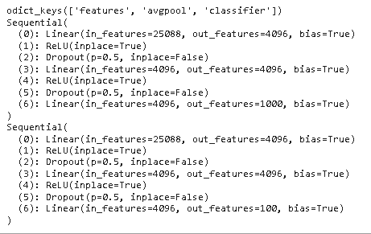

PyTorch pretrained model modify the last layer

## PyTorch 预训练模型改变输入尺寸

在这一节中，我们将学习**如何在 python 中改变 PyTorch 预训练模型**的输入大小。

预训练模型被定义为在合适的数据集上训练的神经网络模型，并且我们也可以改变模型输入大小。

**代码:**

在下面的代码中，我们将导入一些模块，从中我们可以更改预训练模型的输入大小。

*   **X = torch.randn(1，1，224，224)** 用于生成随机数。
*   **model = model . vgg 16(pre trained = False):**pre trained = False 只是出于调试原因而使用。
*   firstconvlayer = [nn。Conv2d(1，3，kernel_size=3，stride=1，padding=1，dilation=1，groups=1，bias=True)] 用于制作第一个卷积层。
*   `firstconvlayer . extend(list(model . features))`用于扩展图层。
*   **nn。Sequential(*firstconvlayer )** 用于实现顺序模块。
*   **print(输出)**用于在屏幕上打印输出。

```py
import pretrainedmodels
import torchvision.models as model
import torch
import torch.nn as nn
X = torch.randn(1, 1, 224, 224)
model = model.vgg16(pretrained=False) 
firstconvlayer = [nn.Conv2d(1, 3, kernel_size=3, stride=1, padding=1, dilation=1, groups=1, bias=True)]
firstconvlayer.extend(list(model.features))  
model.features= nn.Sequential(*firstconvlayer )  
output = model(X)
print(output)
```

**输出:**

运行上面的代码后，我们得到下面的输出，我们可以看到预训练模型的输入大小的变化被打印在屏幕上。

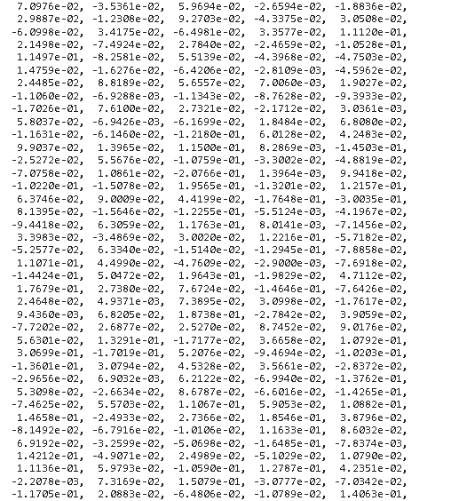

PyTorch pretrained model change input size

##  PyTorch 预训练模型添加图层

在本节中，我们将了解**如何在 PyTorch 预训练模型**中添加层。

PyTorch 预训练模型是经过 Imagenet 等大型数据集训练的神经网络模型。

在这里，我们可以在预训练的模型中添加一个新层来制作一个新模型。

**代码:**

在下面的代码中，我们将导入一些模块，从中我们可以在预训练模型中添加一个层。

*   **nn。顺序(nn。线性(1000，100)，nn。ReLU()，nn。**(100，4))用于实现顺序模块。
*   `X = self . pre trained _ model(X)`用于对模型进行预训练。
*   `X = self.new_layers(X)` 用于添加新层。
*   `extended _ model = Alex net(pre trained _ model = pre trained _ model)`用于扩展模型。

```py
import torchvision
import pretrainedmodels
from torchvision import models 
pretrained_model = torchvision.models.alexnet(pretrained=True)
class AlexNet(nn.Module):
    def __init__(self, pretrained_model):
        super(AlexNet, self).__init__()
        self.pretrained = pretrained_model
        self.new_layers = nn.Sequential(nn.Linear(1000, 100),
                                           nn.ReLU(),
                                           nn.Linear(100, 4))

    def forward(self, X):
        X = self.pretrained_model(X)
        X = self.new_layers(X)
        return X

extended_model = AlexNet(pretrained_model=pretrained_model)
extended_model
```

**输出:**

在下面的输出中，我们可以看到新层被添加到预训练模型中，并且新层的数据被打印在屏幕上。

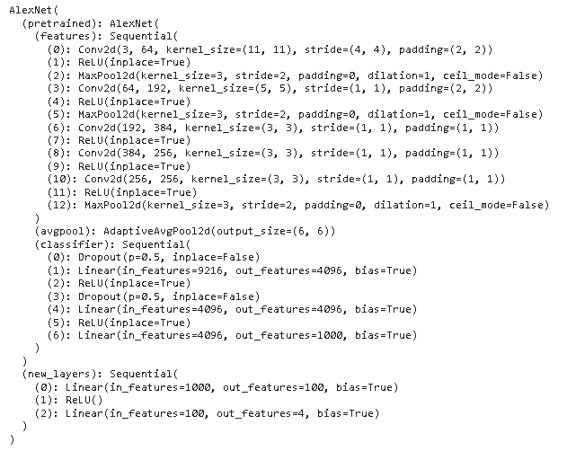

PyTorch pretrained model add layer

##  PyTorch 预训练模型微调

在本节中，我们将学习 python 中的 **PyTorch 预训练模型微调**。

在前进之前，我们应该有一个关于微调的知识。微调被定义为达到最佳或期望性能的过程。

在这里，我们希望获得预训练模型 PyTorch 的最佳性能。

**代码:**

在下面的代码中，我们将导入一些模块，从中我们可以获得模型的最佳性能。

*   **打印(" PyTorch 版本: "，Torch。__version__)** 用于打印火炬的版本，在其上我们得到了模型的最佳性能。
*   **print("Torchvision 版本: "，Torchvision。__version__)** 用于在屏幕上打印火炬视觉版本。

```py
from __future__ import print_function
from __future__ import division
import torch
import torch.nn as nn
import torch.optim as optimize
import numpy as num
import torchvision
from torchvision import datasets, models, transforms
import matplotlib.pyplot as plot
import time
import os
import copy
print("PyTorch version: ",torch.__version__)
print("Torchvision version: ",torchvision.__version__)
```

**输出:**

运行上面的代码后，我们得到下面的输出，其中我们可以看到 PyTorch 和 torchvision 的版本打印在屏幕上，我们可以在它上面获得模型的最佳性能。

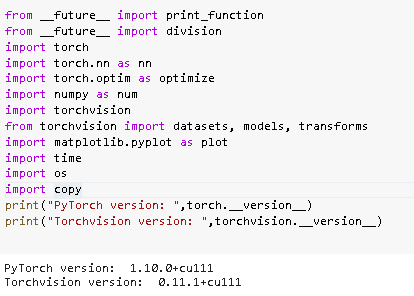

PyTorch pretrained model fine-tune

阅读: [PyTorch 超参数调谐](https://pythonguides.com/pytorch-hyperparameter-tuning/)

## PyTorch 预处理模型图像分类

在本节中，我们将学习 python 中的 **PyTorch 预训练模型图像分类**。

*   预训练模型是在大型数据集上训练的神经网络，如 ImageNet、AlexNet 等。
*   预训练模型是计算机视觉研究快速发展的重要因素。

**代码:**

在下面的代码中，我们将导入一些库，从中我们可以进行预训练的模型图像分类。

*   `Alex net = model . Alex net(pre trained = True)`作为预训练模型。
*   **打印(alexnet)** 用于打印 alexnet。
*   `image = image . open(" dog . jfif ")`用于打开图片。
*   `plt.imshow(image)` 用于在屏幕上绘制图像。
*   `image_t = transform(image)` 用作变换图像。

```py
from torchvision import models as model
import torch
import matplotlib.pyplot as plt
dir(model)
alexnet = model.alexnet(pretrained=True)
print(alexnet)
from torchvision import transforms
transform = transforms.Compose([           
transforms.Resize(258),                   
transforms.CenterCrop(226),                
transforms.ToTensor(),                     
transforms.Normalize(                      
mean=[0.487, 0.458, 0.408],                
std=[0.232, 0.226, 0.227]                  
)])

from PIL import Image
image = Image.open("dog.jfif")
plt.imshow(image)
image_t = transform(image)
batch_t = torch.unsqueeze(image_t, 0)
```

**输出:**

在下面的输出中，我们可以看到预训练的模型训练数据和预训练的模型图像分类都是在屏幕上完成的。

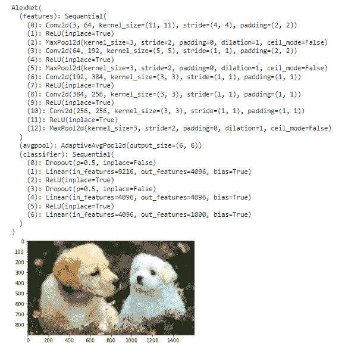

PyTorch pretrained model image classification

## PyTorch 预训练模型推理

在本节中，我们将学习 python 中的 **PyTorch 预训练模型推理**。

推理被定义为关注如何使用预训练模型来预测输入类别的过程。

**代码:**

在下面的代码中，我们将导入一些库，从中我们可以预训练模型推理。

*   `dir(model)` 用于返回属性列表。
*   `Alex net = model . Alex net(pre trained = True)`使用的是预训练模型。
*   `alexnet.eval()` 用于评估预训练模型。
*   `print(output.shape)` 用于在屏幕上打印输出。

```py
from torchvision import models as model
import torch
dir(model)
alexnet = model.alexnet(pretrained=True)
alexnet.eval()
output = alexnet(batch_t)
print(output.shape)
```

**输出:**

运行上面的代码后，我们得到下面的输出，其中我们可以看到 PyTorch 预训练的模型推理被打印在屏幕上。

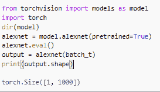

PyTorch pretrained model inference

因此，在本教程中，我们讨论了 `Py` 到 **rch 预训练模型**，我们还涵盖了与其实现相关的不同示例。这是我们已经讨论过的例子列表。

*   PyTorch 预训练模型
*   PyTorch 预训练模型示例
*   PyTorch 预训练模型特征提取
*   PyTorch 预训练模型 cifar 10
*   PyTorch 预训练模型负载
*   PyTorch 预训练模型移除最后一层
*   PyTorch 预训练模型归一化
*   PyTorch 预处理修改最后一层
*   PyTorch 预训练模型更改输入大小
*   PyTorch 预训练模型添加层
*   PyTorch 预训练模型微调
*   PyTorch 预训练模型图像分类
*   PyTorch 预训练模型推理

[Bijay Kumar](https://pythonguides.com/author/fewlines4biju/)

Python 是美国最流行的语言之一。我从事 Python 工作已经有很长时间了，我在与 Tkinter、Pandas、NumPy、Turtle、Django、Matplotlib、Tensorflow、Scipy、Scikit-Learn 等各种库合作方面拥有专业知识。我有与美国、加拿大、英国、澳大利亚、新西兰等国家的各种客户合作的经验。查看我的个人资料。

[enjoysharepoint.com/](https://enjoysharepoint.com/)[](https://www.facebook.com/fewlines4biju "Facebook")[](https://www.linkedin.com/in/fewlines4biju/ "Linkedin")[](https://twitter.com/fewlines4biju "Twitter")