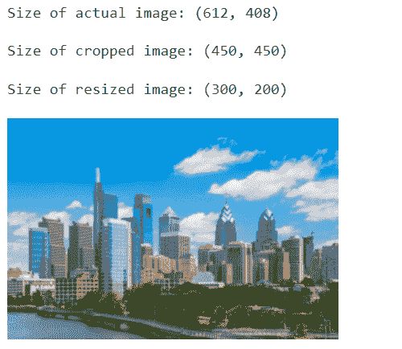

# PyTorch 调整图像大小

> 原文：<https://pythonguides.com/pytorch-resize-images/>

[](https://sharepointsky.teachable.com/p/python-and-machine-learning-training-course)

在 PyTorch 中，Resize()函数用于将输入图像调整到指定的大小。torchvision.transforms 模块提供各种图像变换。具体来说，我们将讨论在 Python 中使用 PyTorch 调整图像大小的**。**

此外，我们还将介绍与 `PyTorch resize images` 相关的不同示例。我们将讨论这些话题。

*   PyTorch resize image
*   PyTorch 调整图像大小示例
*   PyTorch 如何调整图像张量的大小
*   PyTorch 如何调整图像变换的大小
*   PyTorch resize 3d image
*   PyTorch 如何在 GPU 上调整图像大小
*   PyTorch resize image batch
*   PyTorch 如何调整输入图像的大小

目录

[](#)

*   [PyTorch 调整图像大小](#PyTorch_resize_image "PyTorch resize image")
*   [PyTorch 调整图像大小示例](#PyTorch_resize_image_example "PyTorch resize image example")
*   【PyTorch 如何调整图像张量的大小
*   【PyTorch 如何调整图像大小变换
*   [PyTorch 调整 3d 图像大小](#PyTorch_resize_3d_image "PyTorch resize 3d image")
*   【PyTorch 如何在 GPU 上调整图像大小
*   [PyTorch 调整图像大小批次](#PyTorch_resize_image_batch "PyTorch resize image batch")
*   【PyTorch 如何调整输入图像的大小

## PyTorch 调整图像大小

在这一节中，我们将学习如何使用 python 中的 resize()函数来调整图片的大小。

Resize()函数用于将输入图像的大小调整到指定的大小。此转换通过 torchvision.transforms 模块提供各种转换。

**语法:**

PyTorch 调整图像大小的语法:

```py
torchvision.transforms.Resize(size)
```

**参数:**

以下是 PyTorch 调整图像大小的参数:

**Size:** Size 是输入图像要调整大小的参数。size 是一个类似(h，w)的序列，其中 h 是批中输出图像的高度，w 是其重量。如果图像的大小是 int 格式，那么调整大小后图像的大小将是一个正方形图像。

至此，我们了解了 PyTorch 使用 resize()函数调整图像大小。

阅读[如何使用 PyTorch Polar](https://pythonguides.com/pytorch-polar/)

## PyTorch 调整图像大小示例

在本节中，我们将学习如何借助 python 中的一个示例来实现 `PyTorch resiz` e 图像。

torchvision.transforms 模块提供各种图像变换。有一个 Resize()函数用于将输入图像调整到指定的大小。Resize()函数接受 PIL 和张量图像。

**代码:**

在下面的代码中，我们将导入所有必要的库，如 import torch，import torch vision . transforms as T，import Image from PIL，import matplotlib.pyplot as plot。

*   **imge = image . open(' butterfly . png '):**这里我们正在读取输入的图像。
*   `size = imge.size` 用于计算图像的大小。
*   **transforms = T . Resize(size =(200，400))** 用于定义给定大小的图像的变换或调整大小。
*   `imge = transforms(imge)` 用于对输入图像应用变换。
*   **print(" resize 后的尺寸:"，imge.size)** 用于通过 print()函数打印 resize 后的尺寸。

```py
# Importing Libraries
import torch
import torchvision.transforms as T
from PIL import Image
import matplotlib.pyplot as plot

# Read the input image
imge = Image.open('NewYork.png')

# Compute the size(width, height) of image
size = imge.size
print("The size of the original image:", size)

# Define transform or resize the image with given size
transforms = T.Resize(size = (200,400))

# Apply the transformation on the input image
imge = transforms(imge)
print("The size after resize:", imge.size)
plot.imshow(imge)
plot.show()
```

**输出:**

运行上面的代码后，我们得到下面的输出，其中我们可以看到调整大小后的图像的大小被打印在屏幕上。


这就是我们如何借助一个例子来理解 resize image 的实现。

阅读[如何使用 PyTorch Cat 功能](https://pythonguides.com/pytorch-cat-function/)

## 【PyTorch 如何调整图像张量的大小

在这一节中，我们将学习 python 中的 `PyTorch resize image tensor` 。

图像张量被定义为具有形状(C，H，W)的 torch 张量。这里 C 代表通道的数量，H 代表图像高度，W 代表图像宽度。

Resize()函数用于将输入图像张量调整到指定的大小。

**代码:**

在下面的代码中，我们将导入所有必要的库，如 import torch，import torch vision . transforms as T，import Image from PIL，import matplotlib.pyplot as plot。

*   **image = image . open(' flower . jpg ')**这里我们读取 PIL 的图像。
*   `size = image.size` 用于计算图像的大小。
*   **print("原始图像的尺寸:"，size)** 用于打印原始图像的尺寸。
*   **变换=转换。Resize(size = (300，500))** 用于定义变换或调整图像张量的大小。
*   `image = transforms(image)` 用于对输入图像应用变换。
*   **print(" resize 后的尺寸:"，image.size)** 用于打印 resize 后的尺寸。

```py
# import the required libraries
import torch
import torchvision.transforms as trans
from PIL import Image
import matplotlib.pyplot as plot

# Read the input image
image = Image.open('Chicago.jpg')

# compute the size of the image
size = image.size
print("The size of the original image:", size)

# Define transform or resize the image tensor
transforms = trans.Resize(size = (300,500))

# Apply the transformation on the input image
image = transforms(image)
print("The size after resize:", image.size)
plot.imshow(image)
plot.show()
```

**输出:**

运行上面的代码后，我们得到下面的输出，其中我们可以看到张量图像的大小被调整并打印在屏幕上。


PyTorch resize image tensor

这样，我们理解了 PyTorch 调整图像张量的大小。

阅读 [PyTorch 堆栈教程](https://pythonguides.com/pytorch-stack/)

## 【PyTorch 如何调整图像大小变换

在这一节中，我们将学习 python 中的 `PyTorch resize image` 变换。

PyTorch 调整图像大小转换用于将输入图像调整到给定的大小。如果图像是 torch 张量，那么它具有 H，W 形状。

**语法:**

PyTorch 调整图像大小转换的语法:

```py
torchvision.transforms.Resize(size, interpollation=InterpolationMode.BILINEAR, max_size=None, antialias=None)
```

**参数:**

*   **尺寸:**尺寸定义为所需的输出尺寸。大小是一个类似(h，w)的序列，其中 h 是批中输出图像的高度，w 是其重量。如果图像的大小是 int 格式，那么调整大小后图像的大小将是一个正方形图像。
*   插值:所需的插值被定义为由 torch vision . transforms . interploationmode 定义的枚举。支持最近的。
*   **max_size:** 被调整大小的图像的较大边缘所允许的最大尺寸。如果根据大小调整大小后，图像的较大边缘大于 max_size。
*   抗锯齿:如果图像是 PIL 图像，标志被忽略，抗锯齿总是被使用。如果图像是张量，默认情况下，该标志为假，并且可以为插值模式.双线性设置为真

这样，我们通过使用 torch vision . transform . shape()理解了 PyTorch resize 图像转换。

阅读[创建 PyTorch 空张量](https://pythonguides.com/pytorch-empty-tensor/)

## PyTorch 调整 3d 图像大小

在这一节中，我们将学习 python 中的 `PyTorch resize 3d image` 。

PyTorch resize 3d image 用于将 3d 图像调整到给定的大小。Resize()函数接受 PIL 和张量图像。

**代码:**

在下面的代码中，我们将导入所有必要的库，如导入 torch，导入 matplotlib.pyplot 作为 plot，导入 numpy 作为 np，从 torchvision 导入 transforms，从 PIL 导入 Image。

*   **image = image . open(' teddy . jpg ')**用于读取 PIL 图像。
*   `size = image.size` 用于计算图像的大小。
*   **变换=转换。Resize(size = (350，550))** 用于定义 3D 图像的变换或调整大小。
*   `image = transforms(image)` 用于对输入图像进行变换。

```py
# Importing Libraries
import torch  
import matplotlib.pyplot as plt  
import numpy as np  
from torchvision import transforms  
from PIL import Image 

# Read a PIL Image
image = Image.open('Houston.jpg')
image
# Compute the size(width, height) of image
size = image.size
print(size)

# Define transform or resize the 3D image 
transforms = transforms.Resize(size = (350,550))

# Use of the transformation on the input image
image = transforms(image)
print("The size after resize:", image.size)
plot.imshow(image)
plot.show()
```

**输出:**

运行上面的代码后，我们得到下面的输出，其中我们可以看到 PyTorch 3D 图像的 resize 值被打印在屏幕上。


PyTorch resize 3d image

这就是我们如何理解 PyTorch 在 python 中调整 3D 图像的大小。

阅读[如何使用 PyTorch Full()函数](https://pythonguides.com/pytorch-full-function/)

## 【PyTorch 如何在 GPU 上调整图像大小

在这一节中，我们将学习 python 中的 **PyTorch 在 GPU** 上调整图像大小。

在继续之前，我们应该了解一些关于 GPU 的知识。

GPU 代表图形处理单元，是一种经过训练的电子电路，旨在处理和改变内存，以增加图像的设计。

**代码:**

在下面的代码中，我们将导入所有必要的库，如导入 torch，导入 matplotlib.pyplot 作为 plot，导入 numpy 作为 np，从 torchvision 导入 transforms，从 PIL 导入 Image。

*   **Image = Image . open(' rose . jpg ')**用于读取 PIL 图像。
*   `device = torch . device(" cuda " if torch . cuda . is _ available()else " CPU ")`用于定义路径和设置 GPU。
*   `size = image.size` 用于计算图像的大小。
*   **变换=转换。Resize(size = (450，650))** 用于定义在 GPU 上变换或调整一个图像的大小。
*   `image = transforms(image)` 是对输入图像的变换。
*   **print(" resize 后的尺寸:"，image.size)** 用于打印 resize 后的尺寸。

```py
# Importing Libraries
import torch  
import matplotlib.pyplot as plot  
import numpy as np  
from torchvision import transforms  
from PIL import Image 

# Read a PIL Image
image = Image.open('San Diego.jpg')
image

# Define path and set GPU
device = torch.device("cuda" if torch.cuda.is_available() else "cpu")

# Compute the size(width, height) of image
size = image.size
print(size)

# Define transform or resize the an image on GPU
transforms = transforms.Resize(size = (450,650))

# Use of the transformation on the input image
image = transforms(image)
print("The size after resize:", image.size)
plot.imshow(image)
plot.show()
```

**输出:**

在下面的输出中，您可以看到 PyTorch 在屏幕上打印的 GPU 上调整图像的大小。


PyTorch resize image on GPU

至此，我们了解了借助 resize()函数在 GPU 上调整 PyTorch 图像大小的方法。

## PyTorch 调整图像大小批次

在这一节中，我们将学习 python 中的 `PyTorch resize image batch` 。

在继续之前，我们应该有一个关于批处理的知识。

批处理被定义为将事物安排在集合或组中的过程。这里我们使用 resize()函数批量调整图像的大小。

**代码:**

在下面的代码中，首先我们将导入所有必要的库，如 import torch，Import torch vision . transforms . functional，import Import from PIL。

*   **image = image . open(" Philadelphia . jpg "):**我们在这里读取图像。
*   **print("实际图像大小:"，image.size，" \n")** 用于借助 print()函数打印原始图像的大小。
*   **crop image = fn.center_crop(image，output_size=[450])** 用于通过使用 fn . center _ crop()来裁剪图像。
*   **resizeimage = fn.resize(image，size=[200])** 用于调整图像大小。
*   **print("调整后图像的尺寸:"，resizeimage.size，" \n")** 用于打印调整后图像的尺寸。

```py
# Import Library
import torch
import torchvision.transforms.functional as fn
from PIL import Image

# Read the image
image = Image.open("Philadelphia.jpg")
print("Size of actual image:",image.size, "\n")
image

# Crop the image
cropimage = fn.center_crop(image, output_size=[450])
print("Size of cropped image:",cropimage.size,"\n")
cropimage

# Resize the image
resizeimage = fn.resize(image, size=[200])
print("Size of resized image:",resizeimage.size,"\n")
resizeimage 
```

**输出:**

运行上面的代码后，我们得到了下面的输出，其中我们可以看到实际图像的大小、裁剪后的图像和调整后的图像被打印在屏幕上。



PyTorch resize image batch

这就是我们如何理解 PyTorch 通过使用 Resize()函数以批处理的形式调整图像的大小。

阅读 [PyTorch 展平](https://pythonguides.com/pytorch-flatten/)

## 【PyTorch 如何调整输入图像的大小

在这一节中，我们将学习 python 中的 **PyTorch resize 输入图像**。

PyTorch 中有一个 Resize()函数，用于将输入图像的大小调整到指定的大小。此转换通过 torchvision.transforms 模块提供各种转换。

**代码:**

在下面的代码中，我们将导入所有必要的库，如 import torch，import requests，import torchvision.transforms，import Image from PIL。

*   `image = image . open(" Philadelphia . jpg ")`用于加载图片。
*   **print("实际图像尺寸:"，image.size，" \n")** 用于打印实际图像的尺寸。
*   **预处理= T.Compose([ T.Resize(246)，T.CenterCrop(234) ])** 用作调整图像的大小。
*   **print("调整后图像的尺寸"，y.size，" \n")** 用于通过 print()函数打印调整后图像的尺寸。

```py
# Importing Libraries
import torch
import requests
import torchvision.transforms as T
from PIL import Image

# Read the image
image = Image.open("Philadelphia.jpg")
print("Size of actual image:",image.size, "\n")
image

# Resize the image
preprocess = T.Compose([
   T.Resize(246),
   T.CenterCrop(234)
])

y = preprocess(image)
print("Size of resized image" ,y.size,"\n")
y 
```

**输出:**

运行上面的代码后，我们得到下面的输出，其中我们可以看到 PyTorch resize 输入图像打印在屏幕上。


PyTorch resize input image

至此，我们了解了如何借助 Pytorch 中的 resize()函数来调整输入图像的大小。

因此，在本教程中，我们讨论了 `PyTorch resize image` ，并且我们还涵盖了与其实现相关的不同示例。这是我们已经讨论过的例子列表。

*   PyTorch resize image
*   PyTorch 调整图像大小示例
*   如何 PyTorch 调整图像张量
*   PyTorch 如何调整图像变换的大小
*   PyTorch resize 3d image
*   PyTorch 如何在 GPU 上调整图像大小
*   PyTorch resize image batch
*   PyTorch 如何调整输入图像的大小

您可能会喜欢以下 PyTorch 教程:

*   [PyTorch Conv3d](https://pythonguides.com/pytorch-conv3d/)
*   [软最大指针](https://pythonguides.com/pytorch-softmax/)
*   [PyTorch 查看教程](https://pythonguides.com/pytorch-view/)
*   [py torch Lenet 简介](https://pythonguides.com/pytorch-lenet/)
*   [PyTorch Conv1d](https://pythonguides.com/pytorch-conv1d/)
*   [PyTorch 添加尺寸](https://pythonguides.com/pytorch-add-dimension/)

[Vaishali ganotra](https://pythonguides.com/author/vaishali/)

我是一名机器学习工程师，目前作为一名 Python 开发人员在 Tsinfo Technologies 工作。我有使用各种 Python 库的经验，比如 Scikit learn、Turtle、PyTorch 等。