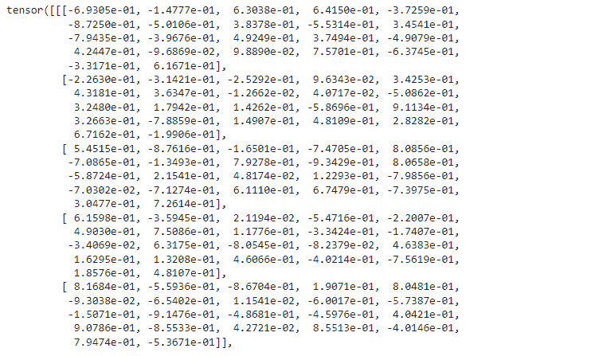
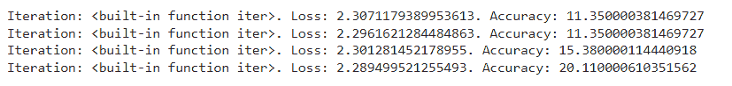
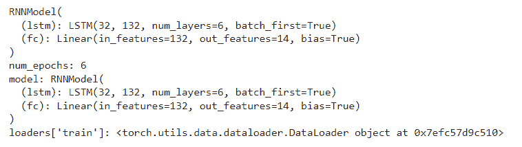
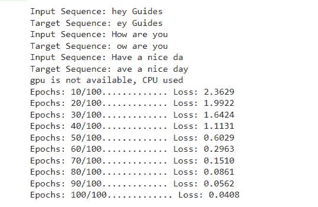
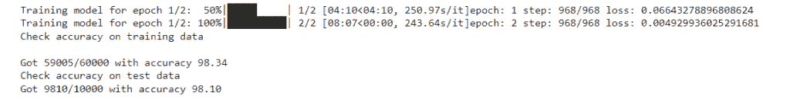
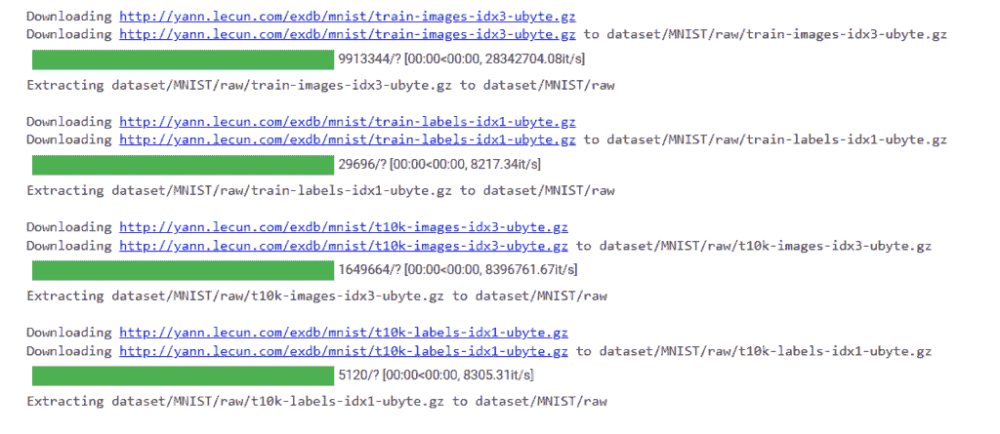

# py torch RNN-详细指南

> 原文：<https://pythonguides.com/pytorch-rnn/>

[](https://sharepointsky.teachable.com/p/python-and-machine-learning-training-course)

在这个 [Python 教程](https://pythonguides.com/learn-python/)中，我们将学习 Python 中的 `PyTorch RNN` ，我们还将涵盖与 `PyTorch RNN` 相关的不同例子。我们将讨论这些话题。

*   PyTorch RNN
*   PyTorch RNN 示例
*   pytorch rnn 细胞
*   PyTorch RNN 激活函数
*   PyTorch RNN 二元分类法
*   PyTorch RNN 情绪分析
*   PyTorch RNN 语言模型
*   pyzer rn 数据加载器

还有，查看最新 PyTorch 教程: [PyTorch 激活功能](https://pythonguides.com/pytorch-activation-function/)

目录

[](#)

*   [rn 指针](#PyTorch_RNN "PyTorch RNN")
*   [PyTorch RNN 的例子](#PyTorch_RNN_example "PyTorch RNN example")
*   [rn 细胞探针的研究](#PyTorch_RNN_Cell "PyTorch RNN Cell")
*   [PyTorch RNN 激活功能](#PyTorch_RNN_activation_function "PyTorch RNN activation function")
*   [PyTorch RNN 二元分类法](#PyTorch_RNN_binary_classification "PyTorch RNN  binary classification")
*   [PyTorch RNN 情绪分析](#PyTorch_RNN_sentiment_analysis "PyTorch RNN sentiment analysis")
*   [PyTorch RNN 语言模型](#PyTorch_RNN_language_model "PyTorch RNN language model")
*   [rn 数据加载器指针](#PyTorch_RNN_Dataloader "PyTorch RNN Dataloader")

## rn 指针

在这一节中，我们将学习 python 中的 **PyTorch RNN 模型**。

`RNN` 代表 **递归神经网络** 它是一类利用时序数据或时间序列数据的人工神经网络。它主要用于顺序或时间问题。

**语法:**

PyTorch RNN 的语法:

```py
torch.nn.RNN(input_size, hidden_layer, num_layer, bias=True, batch_first=False, dropout = 0, bidirectional = False)
```

**参数:**

*   **input_size:** 在输入 x 中期望特征的数量。
*   **hidden_layer:** 处于隐藏状态的特征数量。
*   **num _ layer:**num _ layer 作为几个循环层使用。
*   **偏差:**如果偏差为**假**，则该层不使用偏差权重。
*   **batch_first:** 如果 batch_first 为 `True` 则提供输入和输出张量(批处理，序列，特征)而不是(序列，批处理，特征)。batch_first 的默认值为 False。
*   **丢失:**如果非零，在每个 RNN 层的输出上启动丢失层，不包括丢失概率等于丢失的最后一层。dropout 的默认值为 0。
*   **双向:**如果为真，则成为双向 RNN。双向的默认值为 False。

阅读: [PyTorch 张量到 Numpy](https://pythonguides.com/pytorch-tensor-to-numpy/)

## PyTorch RNN 的例子

在这一节中，我们将学习如何用 python 实现 PyTorch RNN 示例。

**递归神经网络** 是一种神经网络，其中来自前一步骤的输出被持续作为当前步骤的输入。

RNN 的重要特征是隐藏状态，即回忆序列的一些信息。

**代码:**

在下面的代码中，我们将导入 torch 模块，从中我们可以计算 RNN 的输出。

*   **recnn = nn。RNN(12，22，4)** 用于解决序列预测问题
*   RNN。
*   **inp = torch.randn(7，5，12)** 用于生成随机数作为输入。
*   **outp，hn = recnn(inp，h)** 用于得到输出。
*   `print(outp)` 用于在屏幕上打印输出。

```py
import torch
import torch.nn as nn
recnn = nn.RNN(12, 22, 4)
inp = torch.randn(7, 5, 12)
h = torch.randn(4, 5, 22)
outp, hn = recnn(inp, h)
print(outp)
```

**输出:**

运行上面的代码后，我们得到下面的输出，我们可以看到 PyTorch RNN 值打印在屏幕上。



PyTorch RNN example

阅读: [PyTorch 批量标准化](https://pythonguides.com/pytorch-batch-normalization/)

## rn 细胞探针的研究

在这一节中，我们将学习 python 中的 **PyTorch RNN 单元**。

RNN 单元是任何有状态的东西，它执行一些接受输入矩阵的操作。

RNN 细胞在某种意义上与系统神经元不同，它们有一种状态，可以记住过去的信息。

**语法:**

```py
torch.nn.RNNCell(input_size, hidden_size, bias = True, nonlinearity = 'tanh', device = None, dtype = None)
```

**参数:**

*   `input_size` 输入 x 中期望特征的数量。
*   `hidden_size` 处于隐藏状态的特征数为 h。
*   **偏差**如果偏差为假，则该层不使用偏差权重。bias 的默认值为 True。
*   **非线性度**默认非线性度为 tanh。它可以是 tanh 或 relu。

阅读:[Keras Vs py torch–主要区别](https://pythonguides.com/keras-vs-pytorch/)

## PyTorch RNN 激活功能

在这一节中，我们将学习 python 中的 **PyTorch RNN 激活函数**。

PyTorch RNN 激活函数被定义为如何将输入的加权和转变为来自网络层中的一个或多个节点的输出。

**代码:**

在下面的代码中，我们将导入 torch 模块，rnn 模型的激活功能将从该模块开始工作。

*   traindt = dtsets。MNIST(root= '。/data '，train=True，transform=transform。ToTensor()，download=True) 作为数据集使用。
*   `self.hidendim = hidendim` 作为隐藏维度使用。
*   `self.layerdim = layerdim` 用作若干隐藏层。
*   **self.rnn = nn。RNN(inpdim，hidendim，layerdim，batch_first=True，nonlinearity='relu')** 用于建立 RNN 模型。
*   **self.fc = nn。**linear(hidendim，outpdim)用作读出层。
*   **h = torch.zeros(self.layerdim，y.size(0)，self.hidendim)。requires_grad_()** 用零初始化隐藏状态。
*   **outp = self.fc(outp[:，-1，:)**作为上一次对象的索引隐藏状态。
*   **optim = torch . optim . SGD(MDL . parameters()、lr=l_r)** 用于初始化优化器。
*   **imgs = imgs.view(-1，seqdim，inpdim)。requires_grad_()** 用于将图像加载为带梯度的张量
*   `optim.zero_grad()` 用作关于参数的清晰梯度。
*   **loss = criter(outps，lbls)** 用于计算损失。
*   `optim.step()` 用作更新参数。
*   `outps = mdl(imgs)` 仅用作获取输出的前向传递。
*   **_，predicted = torch.max(outps.data，1)** 用于从最大值得到预测。
*   `ttl += lbls.size(0)` 作为标签总数。
*   **crrct +=(预测== lbls)。sum()** 用作正确预测总数。
*   **打印('迭代:{}。损失:{}。准确性:{} '。format(iter，loss.item()，accu))** 用于在屏幕上打印为精度。

```py
import torch
import torch.nn as nn
import torchvision.transforms as transform
import torchvision.datasets as dtsets
traindt = dtsets.MNIST(root='./data', 
                            train=True, 
                            transform=transform.ToTensor(),
                            download=True)

testdt = dtsets.MNIST(root='./data', 
                           train=False, 
                           transform=transform.ToTensor())
batchsiz = 80
nitrs = 2800
numepoch = nitrs / (len(traindt) / batchsiz)
numepoch = int(numepoch)

trainldr = torch.utils.data.DataLoader(dataset=traindt, 
                                           batch_size=batchsiz, 
                                           shuffle=True)

testldr = torch.utils.data.DataLoader(dataset=testdt, 
                                          batch_size=batchsiz, 
                                          shuffle=False)
class rnn(nn.Module):
    def __init__(self, inpdim, hidendim, layerdim, outpdim):
        super(rnn, self).__init__()
        self.hidendim = hidendim

        self.layerdim = layerdim

        self.rnn = nn.RNN(inpdim, hidendim, layerdim, batch_first=True, nonlinearity='relu')
        self.fc = nn.Linear(hidendim, outpdim)

    def forward(self, y):
        h = torch.zeros(self.layerdim, y.size(0), self.hidendim).requires_grad_()
        outp, hx = self.rnn(y, h.detach())
        outp = self.fc(outp[:, -1, :]) 
        return outp
inpdim = 28
hidendim = 80
layerdim = 1
outpdim = 10
mdl = rnn(inpdim, hidendim, layerdim, outpdim)
criter= nn.CrossEntropyLoss()
l_r = 0.01

optim = torch.optim.SGD(mdl.parameters(), lr=l_r)  
list(mdl.parameters())[0].size()
seqdim = 28  

itr = 0
for epoch in range(numepoch):
    for x, (imgs, lbls) in enumerate(trainldr):
        mdl.train()
        imgs = imgs.view(-1, seqdim, inpdim).requires_grad_()
        optim.zero_grad()
        outps = mdl(imgs)
        loss = criter(outps, lbls)
        loss.backward()

        optim.step()

        itr += 1

        if itr % 500 == 0:
            mdl.eval()       
            crrct = 0
            ttl = 0
            for imgs, lbls in testldr:
                imgs = imgs.view(-1, seqdim, inpdim)

                outps = mdl(imgs)
                _, predicted = torch.max(outps.data, 1)

                ttl += lbls.size(0)

                crrct += (predicted == lbls).sum()

            accu = 100 * crrct / ttl

            print('Iteration: {}. Loss: {}. Accuracy: {}'.format(iter, loss.item(), accu)) 
```

**输出:**

在下面的输出中，我们可以看到屏幕上显示了 rnn 模型的准确性。



PyTorch rnn activation function

阅读: [PyTorch 保存模型–完整指南](https://pythonguides.com/pytorch-save-model/)

## PyTorch RNN 二元分类法

在这一节中，我们将学习 python 中的 **PyTorch RNN 二进制分类**。

二元分类可以预测一个或两个类别，或者涉及预测两个以上类别之一的多类别分类。

**代码:**

在下面的代码中，我们将导入 torch 模块，从中我们可以借助二进制分类来预测一个或两个类。

*   **device = torch . device(' cuda ' if torch . cuda . is _ available()else ' CPU ')**用作设备配置。
*   **nn。线性()**用于创建一个前馈神经网络。
*   **modl = RNNModel(inpsize，hidsize，numlayrs，numclases)。至(设备)。**用来(设备)初始化一个 RNN 模型。
*   optim = optim。Adam(modl.parameters()，lr = 0.01) 用于初始化优化器。
*   **print(f " num _ epochs:{ nume pchs } ")**用于打印历元数。

```py
import torch
import torch.nn as nn
from torchvision import datasets as dtsets
from torchvision.transforms import ToTensor
traindt = dtsets.MNIST(
    root = 'data',
    train = True,                         
    transform = ToTensor(), 
    download = True,            
)
testdt = dtsets.MNIST(
    root = 'data', 
    train = False, 
    transform = ToTensor()
)
from torch.utils.data import DataLoader
ldrs = {
    'train' : torch.utils.data.DataLoader(traindt, 
                                          batch_size=100, 
                                          shuffle=True, 
                                          num_workers=1),

    'test'  : torch.utils.data.DataLoader(testdt, 
                                          batch_size=100, 
                                          shuffle=True, 
                                          num_workers=1),
}
ldrs

device = torch.device('cuda' if torch.cuda.is_available() else 'cpu')
device
seqleng = 32
inpsize = 32
hidsize = 132
numlayrs = 6
numclases = 14
batchsiz = 100
numepchs = 6
l_r = 0.01
class RNNModel(nn.Module):

    def __init__(self, inpsiz, hidsize, numlayrs, numclases):
        super(RNNModel, self).__init__()
        self.hidden_size = hidsize
        self.num_layers = numlayrs
        self.lstm = nn.LSTM(inpsize, hidsize, numlayrs, batch_first=True)
        self.fc = nn.Linear(hidsize, numclases)

modl = RNNModel(inpsize, hidsize, numlayrs, numclases).to(device).to(device)
print(modl)
losfunc = nn.CrossEntropyLoss()
losfunc
from torch import optim
optim = optim.Adam(modl.parameters(), lr = 0.01)   
optim
def train(numepchs, modl, ldrs):
    print(f"num_epochs: {numepchs}")
    print(f"model: {modl}")
    print(f"loaders['train']: {ldrs['train']}")

train(numepchs, modl, ldrs)
```

**输出:**

在下面的输出中，我们可以看到 PyTorch RNN 二进制分类是在屏幕上完成的。



PyTorch RNN binary classification

阅读: [PyTorch 全连接层](https://pythonguides.com/pytorch-fully-connected-layer/)

## PyTorch RNN 情绪分析

在本节中，我们将学习 python 中的 **PyTorch RNN 情感分析**。

在继续之前，我们应该有一些关于情感分析的知识。

**情绪分析** 是一项预测建模任务，其中模型被训练来预测文本数据的二元性，如积极、消极或中性。

**代码:**

*   **characters = set("。**join(text))用于将所有的句子连接在一起并提取出唯一的字符。
*   `int 2 char = dict(enumerate(characters))`用于将整数映射到字符。
*   **inpseq . append(text[x][:-1])**用于删除输入序列的最后一个字符。
*   **targseq . append(text[x][1:])**用于从目标序列中删除第一个字符。
*   **features = np.zeros((batchsiz，seqleng，dicsiz)，dtype=np.float32)** 创建具有所需输出形状的多维数组。
*   `hiden = self . init _ hidden(batch siz)`用于初始化隐藏状态。
*   **modl = rnn model(inpsize = dicsiz，outpsize=dicsiz，hidendim=12，nlayrs=1)** 用超参数实例化模型。
*   **optim = torch . optim . Adam(modl . parameters()、lr=l_r)** 用于初始化优化器。
*   **print('Epochs: {}/{}…………'。格式(epoch，nepchs)，end=' ')** 用于打印历元。

```py
import torch
from torch import nn

import numpy as np
text = ['hey Guides','How are you','Have a nice day']

characts = set(''.join(text))

int2char = dict(enumerate(characts))

char2int = {char: ind for ind, char in int2char.items()}

maxleng = len(max(text, key=len))

for x in range(len(text)):
  while len(text[x])<maxleng:
      text[x] += ' '

inpseq = []
targseq = []

for x in range(len(text)):

  inpseq.append(text[x][:-1])

  targseq.append(text[x][1:])
  print("Input Sequence: {}\nTarget Sequence: {}".format(inpseq[x], targseq[x]))
for i in range(len(text)):
    inpseq[i] = [char2int[character] for character in inpseq[x]]
    targseq[i] = [char2int[character] for character in targseq[x]]
dicsiz = len(char2int)
seqleng = maxleng - 1
batchsiz = len(text)

def one_hot_encode(sequen, dicsiz, seqleng, batchsiz):
    features = np.zeros((batchsiz, seqleng, dicsiz), dtype=np.float32)

    for x in range(batchsiz):
        for y in range(seqleng):
            features[x, y, sequen[x][y]] = 1
    return features

inpseq = one_hot_encode(inpseq, dicsiz, seqleng, batchsiz)
inpseq = torch.from_numpy(inpseq)
target_seq = torch.Tensor(targseq)

is_cuda = torch.cuda.is_available()

if is_cuda:
    device = torch.device("cuda")
    print("gpu is available")
else:
    device = torch.device("cpu")
    print("gpu is not available, CPU used")
class RNNModel(nn.Module):
    def __init__(self, inpsize, outpsize, hidendim, nlayrs):
        super(RNNModel, self).__init__()

        **# Defining some parameters**
        self.hidendim = hidendim
        self.nlayrs = nlayrs

        **#Defining the layers**
        self.rnn = nn.RNN(inpsize, hidendim, nlayrs, batch_first=True)   
        **# Fully connected layer**
        self.fc = nn.Linear(hidendim, outpsize)

    def forward(self, z):

        batchsiz = z.size(0)
        hiden = self.init_hidden(batchsiz)

        outp, hiden = self.rnn(z, hiden)

        outp = outp.contiguous().view(-1, self.hidendim)
        outp = self.fc(outp)

        return outp, hiden

    def init_hidden(self, batchsiz):

        hiden = torch.zeros(self.nlayrs, batchsiz, self.hidendim)
        return hiden

modl = RNNModel(inpsize=dicsiz, outpsize=dicsiz, hidendim=12, nlayrs=1)
modl.to(device)
nepchs = 100
l_r=0.01
criter = nn.CrossEntropyLoss()
optim = torch.optim.Adam(modl.parameters(), lr=l_r)
for epoch in range(1, nepchs + 1):
        optim.zero_grad()
        inpseq.to(device)
        outp, hiden = modl(inpseq)
        loss = criter(outp, target_seq.view(-1).long())
        loss.backward() 
        optim.step() 

        if epoch%10 == 0:
            print('Epochs: {}/{}.............'.format(epoch, nepchs), end=' ')
            print("Loss: {:.4f}".format(loss.item())) 
```

**输出:**

运行上面的代码后，我们得到下面的输出，我们可以看到 epochs 和 loss 被打印在屏幕上。



PyTorch RNN sentiment analysis

阅读: [PyTorch MNIST 教程](https://pythonguides.com/pytorch-mnist/)

## PyTorch RNN 语言模型

在这一节中，我们将学习 python 中的 PyTorch RNN 语言模型。

*   RNN 语言模型是一种在网络中带有 RNN 模型的神经网络语言模型。
*   RNN 可以像在自然语言中一样对序列数据建模。

**代码:**

在下面的代码中，我们将导入 torch 模块，从中我们了解了 RNN 学习模型。

*   traindt = dtsets。MNIST(root='dataset/'，train=True，transform=transforms。ToTensor()，download=True) 用于加载数据集。
*   **modl = RNNlM(inpsize，hidensize，numlayrs，numclasses，sequlen)。【T1 到(device)】用于初始化 RNN 模型。**
*   optim = optim。Adam(modl.parameters()，lr=l_r) 用于初始化优化器。
*   **print(f ' got { num RCT }/{ num mples } with accuracy { float(num RCT)/float(num mples)* 100:. 2f } ')modl . train()**用于打印模型的精度。

```py
import torch
from tqdm import tqdm
import torch.nn as nn
import torch.optim as optim
import torchvision.datasets as dtsets
from torch.utils.data import DataLoader
from torchvision.transforms import transforms

device = torch.device('cuda' if torch.cuda.is_available() else 'cpu')

**# Declaring Hyper-parameters**
inpsize = 28
sequlen = 28
numlayrs = 2
hidensize = 254
numclasses = 10
l_r = 0.001
batchsiz = 62
numepchs = 2
class RNNlM(nn.Module):

   def __init__(self, inpsize, hidensize, numlayrs, numclasses, sequlen):
      super(RNNlM, self).__init__()
      self.hidensize = hidensize
      self.numlayrs = numlayrs
      self.lstm = nn.LSTM(inpsize, hidensize, numlayrs, batch_first=True)
      self.fc = nn.Linear(hidensize*sequlen, numclasses)

   def forward(self, data):
      h = torch.zeros(self.numlayrs, data.size(0), self.hidensize).to(device)
      c = torch.zeros(self.numlayrs, data.size(0), self.hidensize).to(device)

      outp, _ = self.lstm(data, (h, c))
      outp = outp.reshape(outp.shape[0], -1)
      outp = self.fc(outp)
      return outp

traindt = dtsets.MNIST(root='dataset/', train=True, transform=transforms.ToTensor(), download=True)
testdt = dtsets.MNIST(root='dataset/', train=False, transform=transforms.ToTensor(), download=True)

trainldr = DataLoader(dataset=traindt, batch_size=batchsiz, shuffle=True)
testldr = DataLoader(dataset=testdt, batch_size=batchsiz, shuffle=True)

modl = RNNlM(inpsize, hidensize, numlayrs, numclasses, sequlen).to(device)

criter = nn.CrossEntropyLoss()
optim = optim.Adam(modl.parameters(), lr=l_r)

**# Training Loop**
ep = 1
for epoch in tqdm(range(numepchs), desc=f'Training model for epoch {ep}/{numepchs}', total=numepchs):
   for batch_idx, (data, trgt) in enumerate(trainldr):
      data = data.to(device).squeeze(1)
      trgts = trgt.to(device)
      scores = modl(data)
      loss = criter(scores, trgts)
      optim.zero_grad()
      loss.backward()
      optim.step()
   print(f'epoch: {epoch + 1} step: {batch_idx + 1}/{len(trainldr)} loss: {loss}')
   ep += 1
   **# Evaluating our RNN model**
def check_accuracy(ldr, modlrnnlm):
   if ldr.dataset.train:
      print('Check accuracy on training data')
   else:
      print('Check accuracy on test data')

   numcrct = 0
   numsmples = 0
   modlrnnlm.eval()
   with torch.no_grad():
      for i,j in ldr:
         i = i.to(device).squeeze(1)
         j = j.to(device)
         score = modlrnnlm(i)
         _, predictions = score.max(1)
         numcrct += (predictions == j).sum()
         numsmples += predictions.size(0)

      print(f'Got {numcrct}/{numsmples} with accuracy {float(numcrct)/float(numsmples)*100:.2f}')
   modl.train()

check_accuracy(trainldr, modl)
check_accuracy(testldr, modl)
```

**输出:**

在下面的输出中，我们可以看到训练数据和测试数据的准确性被打印在屏幕上。



PyTorch RNN learning model

阅读: [PyTorch 车型总结](https://pythonguides.com/pytorch-model-summary/)

## rn 数据加载器指针

在这一节中，我们将学习 python 中的 **PyTorch RNN 数据加载器**。

数据集将训练或测试数据加载到内存中，或者数据加载器从数据集中获取数据，并将数据分批分发。

**代码:**

在下面的代码中，我们将导入 torch 模块，并从中加载 RNN 数据集。

*   **班 RNN(nn。模块):**用于定义 RNN 类。
*   traindt =数据集。MNIST(root='dataset/'，train=True，transform=transforms。ToTensor()，download=True) 作为数据集使用。
*   **train ldr = data loader(dataset = train dt，batch_size=batchsiz，shuffle=True)** 用于加载数据集。

```py
import torch
from tqdm import tqdm
import torch.nn as nn
import torch.optim as optim
import torchvision.datasets as datasets
from torch.utils.data import DataLoader
from torchvision.transforms import transforms
device = torch.device('cuda' if torch.cuda.is_available() else 'cpu')
inpsize = 30
seqlen = 30
numlayrs = 4
hidensize = 258
numclasses = 12
lr = 0.001
batchsiz = 66
numepchs = 4
class RNN(nn.Module):

   def __init__(self, inpsize, hidensize, numlayrs, numclasses, seqlen):
      super(RNN, self).__init__()
      self.hidensize = hidensize
      self.numlayrs = numlayrs
      self.lstm = nn.LSTM(inpsize, hidensize, numlayrs, batch_first=True)
      self.fc = nn.Linear(hidensize*seqlen, numclasses)

   def forward(self, data):
      h1 = torch.zeros(self.numlayers, data.size(0), self.hidensize).to(device)
      c1 = torch.zeros(self.numlayers, data.size(0), self.hidensize).to(device)

      outp, _ = self.lstm(data, (h1, c1))
      outp = outp.reshape(outp.shape[0], -1)
      outp = self.fc(outp)
      return outp

traindt = datasets.MNIST(root='dataset/', train=True, transform=transforms.ToTensor(), download=True)
testdt = datasets.MNIST(root='dataset/', train=False, transform=transforms.ToTensor(), download=True)

trainldr = DataLoader(dataset=traindt, batch_size=batchsiz, shuffle=True)
testldr = DataLoader(dataset=testdt, batch_size=batchsiz, shuffle=True)
```

**输出:**

运行上述代码后，我们得到以下输出，从中我们可以看到 RNN 模型数据可以加载到屏幕上。



PyTorch RNN data loader

你可能也喜欢阅读下面的 PyTorch 教程。

*   [数据加载器指针+示例](https://pythonguides.com/pytorch-dataloader/)
*   [PyTorch 逻辑回归](https://pythonguides.com/pytorch-logistic-regression/)
*   [PyTorch 提前停止+示例](https://pythonguides.com/pytorch-early-stopping/)
*   [py torch ms loss–详细指南](https://pythonguides.com/pytorch-mseloss/)

因此，在本教程中，我们讨论了 `PyTorch RNN` ，并且我们还涵盖了与其实现相关的不同示例。这是我们已经讨论过的例子列表。

*   PyTorch RNN
*   PyTorch RNN 示例
*   pytorch rnn 细胞
*   PyTorch RNN 激活函数
*   PyTorch RNN 二元分类法
*   PyTorch RNN 情绪分析
*   PyTorch RNN 语言模型
*   pyzer rn 数据加载器

[Bijay Kumar](https://pythonguides.com/author/fewlines4biju/)

Python 是美国最流行的语言之一。我从事 Python 工作已经有很长时间了，我在与 Tkinter、Pandas、NumPy、Turtle、Django、Matplotlib、Tensorflow、Scipy、Scikit-Learn 等各种库合作方面拥有专业知识。我有与美国、加拿大、英国、澳大利亚、新西兰等国家的各种客户合作的经验。查看我的个人资料。

[enjoysharepoint.com/](https://enjoysharepoint.com/)[](https://www.facebook.com/fewlines4biju "Facebook")[](https://www.linkedin.com/in/fewlines4biju/ "Linkedin")[](https://twitter.com/fewlines4biju "Twitter")