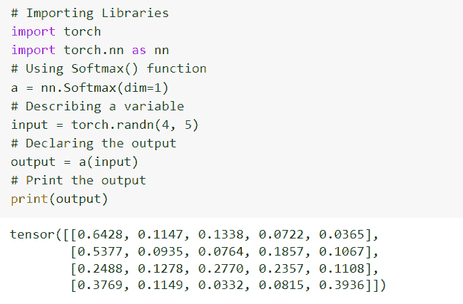
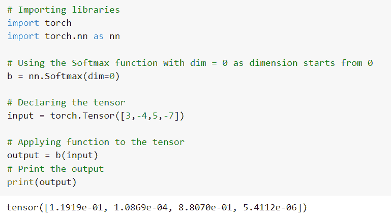
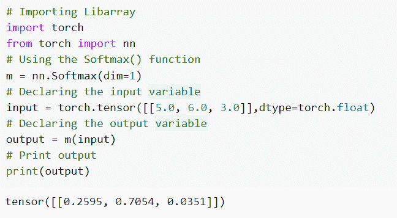
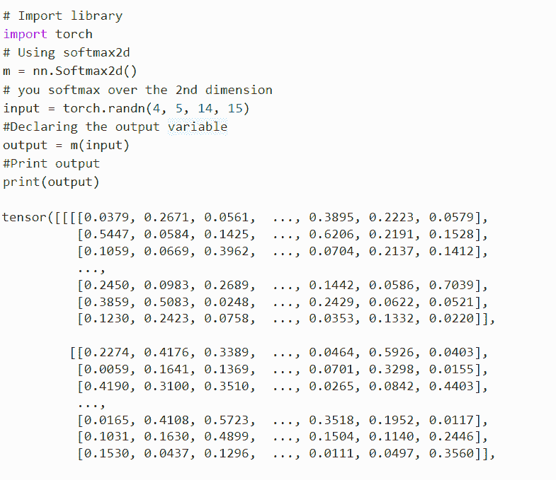
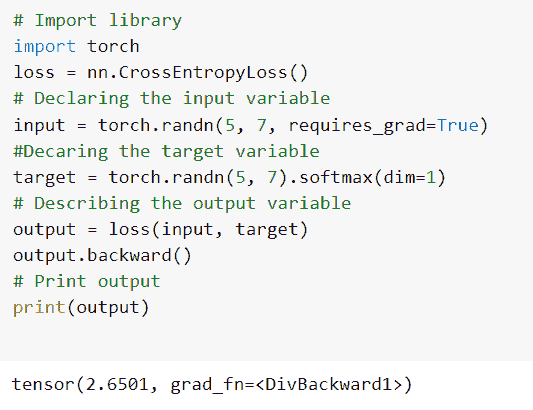
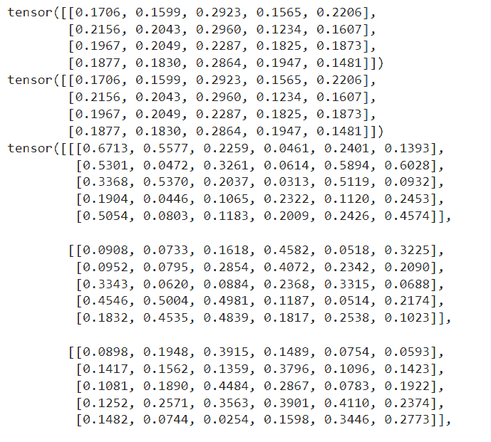

# py torch soft max[完整教程]

> 原文：<https://pythonguides.com/pytorch-softmax/>

[](https://sharepointsky.teachable.com/p/python-and-machine-learning-training-course)

PyTorch Softmax 是一个应用于 n 维输入张量并对其进行重新缩放的函数，n 维输出张量的元素位于范围[0，1]内。详细来说，我们将讨论在 Python 中使用 [PyTorch 的 Softmax。](https://pythonguides.com/what-is-pytorch/)

此外，我们还将介绍与 PyTorch softmax 相关的不同示例。我们将讨论这些话题。

*   什么是 PyTorch softmax
*   PyTorch softmax 示例
*   如何使用 PyTorch softmax 激活功能
*   PyTorch 函数 softmax
*   PyTorch softmax 维度
*   什么是 PyTorch softmax2d
*   PyTorch softmax 交叉熵
*   什么是 PyTorch Logsoftmax

目录

[](#)

*   [什么是 PyTorch softmax](#What_is_PyTorch_softmax "What is PyTorch softmax")
*   [PyTorch softmax 示例](#PyTorch_softmax_example "PyTorch softmax example")
*   [如何使用 PyTorch softmax 激活功能](#How_we_can_use_PyTorch_softmax_activation_function "How we can use PyTorch softmax activation function")
*   [PyTorch 功能 softmax](#PyTorch_functional_softmax "PyTorch functional softmax")
*   [PyTorch softmax 尺寸](#PyTorch_softmax_dimension "PyTorch softmax dimension")
*   [什么是 PyTorch softmax2d](#What_is_PyTorch_softmax2d "What is PyTorch softmax2d")
*   [PyTorch softmax 交叉熵](#PyTorch_softmax_cross_entropy "PyTorch softmax cross entropy")
*   [什么是 Pytorch Logsoftmax](#What_is_Pytorch_Logsoftmax "What is Pytorch Logsoftmax")

## 什么是 PyTorch softmax

在本节中，我们将学习 python 中的 `PyTorch softmax` 。

PyTorch softmax 应用于 n 维输入张量并对其进行重新缩放，使得 n 维张量的输出张量位于范围[0，1]内。

**语法:**

softmax 张量的语法是:

```py
torch.nn.Softmax(dim=None)
```

**参数:**

以下是 PyTorch softmax 的参数:

**dim:** dim 与 softmax 一起作为一个维度被计算，dim 上的每个块将被加和为一。

softmax 以输入的形式返回一个具有相同维度和形状的张量，其值在[0，1]范围内。

这样，我们通过使用 softmax()函数了解了 PyTorch softmax。

阅读[交叉熵损失 PyTorch](https://pythonguides.com/cross-entropy-loss-pytorch/)

## PyTorch softmax 示例

在本节中，我们将借助一个例子来了解**如何实现 Pytorch softmax** 。

softmax()函数应用于 n 维输入张量并对其进行重新缩放。softmax()可以通过使用 nn.softmax()函数来执行。

**代码:**

在下面的代码中，我们将导入所有必要的库，如 import torch 和 import torch.nn as nn。

*   **a = nn。Softmax(dim=1):** 这里我们使用的是 Softmax()函数。
*   **input = torch.randn(4，5):** 这里我们用 torch.randn()函数声明输入变量。
*   **打印(输出)**用于使用 print()函数打印输出。

```py
# Importing Libraries
import torch
import torch.nn as nn
# Using Softmax() function
a = nn.Softmax(dim=1)
# Describing a variable
input = torch.randn(4, 5)
# Declaring the output
output = a(input)
# Print the output
print(output)
```

**输出:**

运行上面的代码后，我们得到下面的输出，其中我们可以看到 PyTorch softmax 值打印在屏幕上。



PyTorch softmax example

这就是我们如何在一个例子的帮助下实现 PyTorch softmax 函数。

读取 [PyTorch 保存模型](https://pythonguides.com/pytorch-save-model/)

## 如何使用 PyTorch softmax 激活功能

在本节中，我们将学习 python 中的 **PyTorch softmax 激活函数**。

在继续之前，我们应该有一个关于激活函数的知识。

激活函数是执行计算以给出输出的函数，该输出充当下一个神经元的输入。

**代码:**

在下面的代码中，我们将首先导入所有必要的库，如 import torch，import torch.nn as nn。

*   b = nn。Softmax(dim=0) 用作 Softmax 函数，dim=0，因为尺寸从 0 开始。
*   **输入=火炬。张量([3，-4，5，-7])** 用来声明张量。
*   `output = b(input)` 用于对张量应用函数。
*   **打印(输出)**用于借助 print()函数打印输出。

```py
# Importing libraries
import torch
import torch.nn as nn

# Using the Softmax function with dim = 0 as dimension starts from 0
b = nn.Softmax(dim=0) 

# Declaring the tensor
input = torch.Tensor([3,-4,5,-7])

# Applying function to the tensor
output = b(input)
# Print the output
print(output)
```

**输出:**

在下面的输出中，我们可以看到 PyTorch softmax 激活函数值打印在屏幕上。



PyTorch softmax activation function

至此，我们了解了 python 中的 Pytorch softmax 激活函数。

## PyTorch 功能 softmax

在本节中，我们将学习 python 中的 **PyTorch 函数 softmax** 。

PyTorch functional softmax 与 dim 一起应用于所有块，并重新缩放它们，以便元素位于范围[0，1]内。

**语法:**

PyTorch 函数 softmax 的语法:

```py
torch.nn.functional.softmax(input, dim=None, dtype=None)
```

参数:

以下是 PyTorch functional softmax 的参数:

*   **输入:**输入参数定义为输入张量。
*   **dim:**dim 参数被定义为一个与 softmax 一起计算的尺寸。
*   **dtype:** 定义为返回张量的所需数据类型，用于防止数据类型溢出，dtype 的默认值为 None。

这就是我们如何通过使用 torch.nn.functional.Softmax()来理解 PyTorch 泛函 softmax。

阅读 [Adam optimizer PyTorch 示例](https://pythonguides.com/adam-optimizer-pytorch/)

## PyTorch softmax 尺寸

在本节中，我们将学习 python 中的 **PyTorch softmax 维度**。

在前进之前，我们应该有一个关于维度的知识。

维度被定义为特定种类的可量化的增加，如长度、高度、宽度和深度。

尺寸是一个参数，它与将被计算的 softmax 一起被定义为 dim。

**代码:**

在下面的代码中，我们将导入所有必要的库，如 import torch，import nn from torch。

*   **m = nn。Softmax(dim=1):** 这里我们使用的是 Softmax()函数。
*   **input = torch.tensor([[5.0，6.0，3.0]]，dtype=torch.float)** 用于通过 torch.tensor()函数声明输入变量。
*   `output = m(input)` 用于声明输出变量。
*   **打印(输出)**用于借助 print()函数打印输出。

```py
# Importing Libarray
import torch
from torch import nn
# Using the Softmax() function 
m = nn.Softmax(dim=1)
# Declaring the input variable
input = torch.tensor([[5.0, 6.0, 3.0]],dtype=torch.float)
# Declaring the output variable
output = m(input)
# Print output
print(output)
```

**输出:**

在下面的输出中，您可以看到 Pytorch softmax 尺寸值打印在屏幕上。



PyTorch softmax dimension

这样，我们通过使用 nn.softmax()函数了解了 PyTorch softmax 维度。

读取 [PyTorch nn 线性](https://pythonguides.com/pytorch-nn-linear/)

## 什么是 PyTorch softmax2d

在本节中，我们将了解 python 中的 `PyTorch softmax2d` 是什么。

PyTorch Softmax2d 是一个将 Softmax 应用于每个概念位置的类。

**语法:**

```py
torch.nn.softmax2d()
```

它返回与输入具有相同维数和形状的张量，其值在[0，1]范围内。

**举例:**

在下面的代码中，我们将导入火炬库作为导入火炬。

*   **m = nn。Softmax2d():** 这里我们使用的是 Softmax2d()。
*   **input = torch.randn(4，5，14，15):** 这里我们声明的是第二维上的 softmax。
*   **output = m(input):** 这里我们描述的是输出变量。
*   **打印(输出)**用于使用 print()函数打印输出。

```py
# Import library
import torch
# Using softmax2d
m = nn.Softmax2d()
# softmax over the 2nd dimension
input = torch.randn(4, 5, 14, 15)
#Declaring the output variable
output = m(input)
#Print output
print(output)
```

**输出:**

在下面的输出中，您可以看到 PyTorch Softmax2d 值打印在屏幕上。



这就是我们借助 softmax2d()函数理解 PyTorch softmax2d 的方法。

读取 [PyTorch 批量标准化](https://pythonguides.com/pytorch-batch-normalization/)

## PyTorch softmax 交叉熵

在本节中，我们将学习 python 中的 **PyTorch softmax 交叉熵**。

torch.nn.CrossEntropyLoss()类计算输入和目标之间的交叉熵损失，softmax()函数用于根据类概率确定目标。

**代码:**

在下面的代码中，我们将首先导入 torch 库，如 import torch。

*   **损失= nn。CrossEntropyLoss():** 这里我们使用的是 CrossEntropyLoss()函数。
*   **input = torch.randn(5，7，requires_grad=True)** 用于声明输入变量。
*   **target = torch.randn(5，7)。softmax(dim=1):** 这里我们声明目标变量。
*   **输出=损失(输入，目标):**这里我们描述的是输出变量。
*   **打印(输出)**用于借助 print()函数打印输出。

```py
# Import library
import torch
loss = nn.CrossEntropyLoss()
# Declaring the input variable
input = torch.randn(5, 7, requires_grad=True)
#Decaring the target variable
target = torch.randn(5, 7).softmax(dim=1)
# Describing the output variable
output = loss(input, target)
output.backward()
# Print output
print(output) 
```

**输出:**

运行上面的代码后，我们得到下面的输出，其中我们可以看到 PyTorch softmax 交叉熵值打印在屏幕上。



PyTorch softmax cross entropy

这样，我们理解了 python 中 PyTorch softmax 交叉熵。

读取 [PyTorch 负载模型](https://pythonguides.com/pytorch-load-model/)

## 什么是 Pytorch Logsoftmax

在本节中，我们将学习 python 中的 `PyTorch Logsoftmax` 。

PyTorch Logsoftmax 将 Logsoftmax()函数应用于 n 维输入张量。

**代码:**

在下面的代码中，我们将导入所有必要的库，如 import torch，import torch.nn as nn。

*   **input = torch.rand(4，5):** 这里我们用 torch.rand()函数声明输入变量。
*   **a = nn。Softmax(dim=1):** 这里我们使用的是 Softmax()函数。
*   **a = nn。LogSoftmax(dim=1)** 这里我们声明 LogSoftmax()函数。

```py
# Importing libraries
import torch
import torch.nn as nn

# Declaring the variable
input = torch.rand(4,5)

# Using the softmax
a = nn.Softmax(dim=1)
soft = a(input)
print(soft)

soft = torch.softmax(input, dim=1) 
print(soft)

# Declaring the Logsoftmax() function
input = torch.randn(4,5,6)
a = nn.LogSoftmax(dim=1)
output = m(input)
# print the output
print(output)
```

**输出:**

运行上面的代码后，我们得到下面的输出，其中我们可以看到 PyTorch Logsoftmax 值打印在屏幕上。



PyTorch Logsoftmax

这就是我们借助 python 中的 Logsigmoid()函数对 PyTorch Logsoftmax 的理解。

因此，在本教程中，我们将讨论 `PyTorch Softmax` ,并且我们还涵盖了与其实现相关的不同示例。这是我们已经讨论过的例子列表。

*   什么是 PyTorch softmax
*   PyTorch softmax 示例
*   如何使用 PyTorch softmax 激活功能
*   PyTorch 函数 softmax
*   PyTorch softmax 维度
*   什么是 PyTorch softmax2d
*   PyTorch softmax 交叉熵
*   什么是 PyTorch Logsoftmax

您可能会喜欢以下 PyTorch 教程:

*   [PyTorch TanH](https://pythonguides.com/pytorch-tanh/)
*   [如何使用 PyTorch Polar](https://pythonguides.com/pytorch-polar/)
*   [如何使用 PyTorch 猫功能](https://pythonguides.com/pytorch-cat-function/)
*   [Keras Vs PyTorch](https://pythonguides.com/keras-vs-pytorch/)
*   [PyTorch 栈教程](https://pythonguides.com/pytorch-stack/)
*   [创建 PyTorch 空张量](https://pythonguides.com/pytorch-empty-tensor/)

[Bijay Kumar](https://pythonguides.com/author/fewlines4biju/)

Python 是美国最流行的语言之一。我从事 Python 工作已经有很长时间了，我在与 Tkinter、Pandas、NumPy、Turtle、Django、Matplotlib、Tensorflow、Scipy、Scikit-Learn 等各种库合作方面拥有专业知识。我有与美国、加拿大、英国、澳大利亚、新西兰等国家的各种客户合作的经验。查看我的个人资料。

[enjoysharepoint.com/](https://enjoysharepoint.com/)[](https://www.facebook.com/fewlines4biju "Facebook")[](https://www.linkedin.com/in/fewlines4biju/ "Linkedin")[](https://twitter.com/fewlines4biju "Twitter")