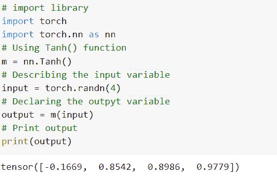
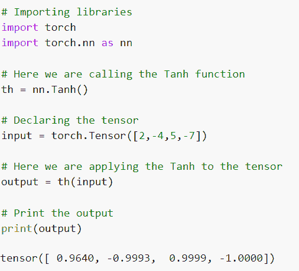
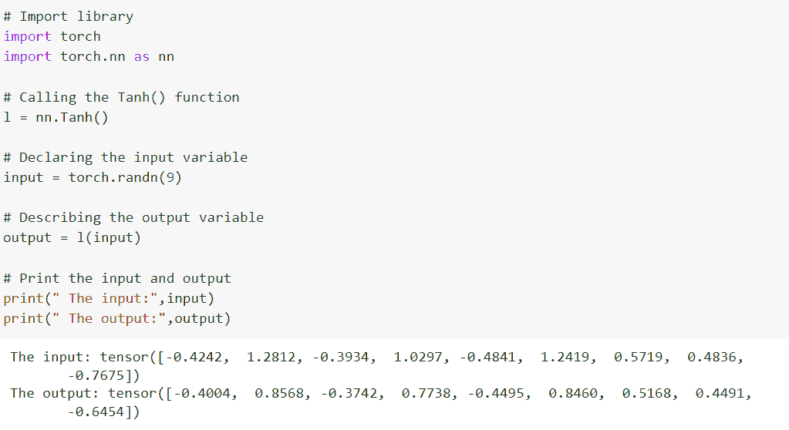
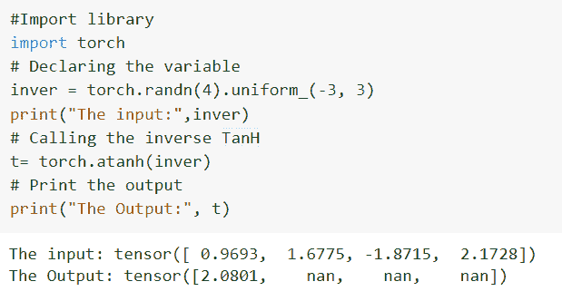
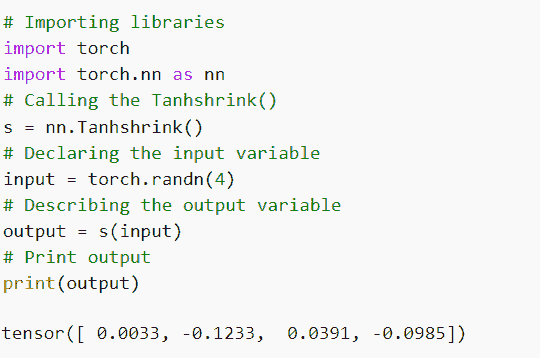
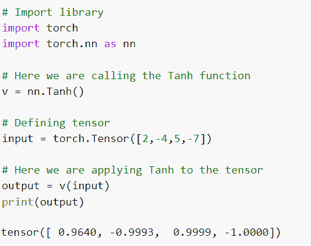
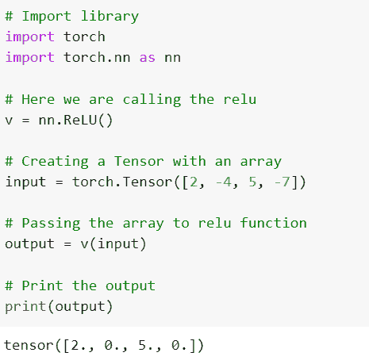

# PyTorch TanH

> 原文：<https://pythonguides.com/pytorch-tanh/>

[](https://sharepointsky.teachable.com/p/python-and-machine-learning-training-course)

`PyTorch TanH` 被定义为不同的非线性函数，与 sigmoid 函数相同，输出值在-1 到+1 的范围内。详细来说，我们将在 Python 中使用 [PyTorch 来讨论 TahnH。](https://pythonguides.com/what-is-pytorch/)

此外，我们还将涵盖与 PyTorch TanH 相关的不同示例。我们将讨论这些话题。

*   什么是 PyTorch TanH
*   PyTorch TanH 示例
*   PyTorch TanH inplace
*   PyTorch TanH 激活函数
*   塔赫纳层
*   PyTorch TanH 逆
*   什么是 PyTorch Tanhshrink
*   如何使用 PyTorch 功能性 TanH
*   皮托奇·塔恩 vs·里尔

目录

[](#)

*   [什么是 PyTorch TanH](#What_is_PyTorch_TanH "What is PyTorch TanH")
*   [PyTorch TanH 示例](#PyTorch_TanH_example "PyTorch TanH example")
*   [PyTorch TanH inplace](#PyTorch_TanH_inplace "PyTorch TanH inplace")
*   [PyTorch TanH 激活功能](#PyTorch_TanH_activation_function "PyTorch TanH activation function")
*   [串层指针](#Pytorch_TanH_layer "Pytorch TanH layer")
*   [PyTorch TanH 逆](#PyTorch_TanH_inverse "PyTorch TanH inverse")
*   [什么是 PyTorch Tanhshrink](#What_is_PyTorch_Tanhshrink "What is PyTorch Tanhshrink")
*   [如何使用 PyTorch functional TanH](#How_to_use_PyTorch_functional_TanH "How to use PyTorch functional TanH")
*   [PyTorch TanH Vs ReLU](#PyTorch_TanH_Vs_ReLU "PyTorch TanH Vs ReLU")

## 什么是 PyTorch TanH

在这一节中，我们将学习 python 中的 `PyTorch TanH` 。

PyTorch 双曲正切函数被定义为不同的非线性函数，与 sigmoid 函数相同，输出值在-1 到+1 的范围内。它是一条穿过原点的 S 形曲线。

**语法:**

PyTorch Tanh 的语法:

```py
torch.nn.Tanh()
```

Tanh 按元素返回双曲正切函数。

这就是我们借助 torch.nn.Tanh()函数对 PyTorch TanH 的理解。

阅读 [PyTorch 整形张量](https://pythonguides.com/pytorch-reshape-tensor/)

## PyTorch TanH 示例

在这一节中，我们将借助 python 中的一个例子学习如何实现 PyTorch TanH 。

Tanh 函数类似于 sigmoid 函数。这是一条 S 形曲线，但它穿过原点，Tanh 的输出值范围是从-1 到+1。双曲正切也是一个非线性和可微的函数。

**代码:**

在下面的代码中，首先我们导入所有必要的库，如 import torch，import torch.nn as nn。

*   **a = nn。Tanh():** 这里我们使用的是 Tanh()函数。
*   `input = torch.randn(4)` 用于通过使用 torch.randn()函数来描述输入变量。
*   `output = a(input)` 用于声明输出变量。
*   **打印(输出)**用于使用 print()函数打印输出。

```py
# import library
import torch
import torch.nn as nn
# Using Tanh() function
a = nn.Tanh()
# Describing the input variable
input = torch.randn(4)
# Declaring the output variable
output = a(input)
# Print output
print(output)
```

**输出:**

运行上面的代码后，我们得到下面的输出，其中我们可以看到 PyTorch tanh 值打印在屏幕上。



PyTorch TanH example

至此，我们借助一个例子理解了 PyTorch TanH 的实现。

读取 [PyTorch 添加尺寸](https://pythonguides.com/pytorch-add-dimension/)

## PyTorch TanH inplace

在这一节中，我们将借助 python 中的一个例子来了解 `Pytorch TanH inplace` 。

TanH 是激活函数的良好特性。它是非线性和可微分的，其输出范围在-1 到+1 之间。

**语法:**

PyTorch Tanh inplace 的语法:

```py
nn.Tanh(inplace=True)
```

**参数:**

以下是 PyTorch Tanh inplace 的参数:

`inplace = True` 这意味着它将直接改变输入，而不分配任何额外的输出，inplace 的默认值为 False。

这样，我们在 nn 的帮助下了解了 PyTorch TanH。Tanh()函数。

## PyTorch TanH 激活功能

在本节中，我们将学习 python 中的 **Pytorch TanH 激活函数**。

在继续之前，我们应该有一个关于激活函数的知识。

激活函数被定义为执行计算以给出输出的函数，该输出充当下一个神经元的输入。

双曲正切是一条穿过原点的 S 形曲线，输出值范围在-1 到+1 之间。

**代码:**

在下面的代码中，我们将导入库，如 import torch，import torch.nn as nn。

*   **th = nn。Tanh():** 这里我们使用的是 Tanh 函数。
*   **输入=火炬。张量([2，-4，5，-7])** 用于通过使用 torch.tensor()函数来声明输入变量。
*   **output = th(input):** 这里我们将双曲正切应用于张量。
*   **打印(输出)**用于借助 print()函数打印输出。

```py
# Importing libraries
import torch
import torch.nn as nn

# Here we are calling the Tanh function
th = nn.Tanh()

# Declaring the tensor
input = torch.Tensor([2,-4,5,-7])

# Here we are applying the Tanh to the tensor
output = th(input)

# Print the output
print(output)
```

**输出:**

运行上面的代码后，我们得到下面的输出，其中我们可以看到 PyTorch TanH 激活函数值被打印在屏幕上。



PyTorch TanH activation function

由此，我们了解了 pyhton 的 PyTorch TanH 激活功能。

读取 [PyTorch nn Conv2d](https://pythonguides.com/pytorch-nn-conv2d/)

## 串层指针

在这一节中，我们将学习 python 中的 **PyTorch TanH 层**。

PyTorch TanH 图层被定义为计算输入的双曲正切的图层。

**代码:**

在下面的代码中，我们将导入 torch 模块，如 import torch 和 import torch.nn as nn。

*   **l = nn。Tanh():** 这里我们调用 Tanh()函数。
*   **input = torch.randn(9):** 这里我们使用 torch.randn()函数声明输入变量。
*   **output = l(input):** 这里我们描述的是输出变量。
*   **print(" The input:"，input)** 用于打印输入的变量。
*   **print(" output:"，output)** 用于打印输出变量。

```py
# Import library
import torch
import torch.nn as nn

# Calling the Tanh() function
l = nn.Tanh()

# Declaring the input variable
input = torch.randn(9)

# Describing the output variable
output = l(input)

# Print the input and output
print(" The input:",input)
print(" The output:",output)
```

**输出:**

运行上面的代码后，我们得到下面的输出，其中我们可以看到 PyTorch TanH 图层值打印在屏幕上。



PyTorch TanH layer

这就是我们在神经网络的帮助下对 PyTorch TanH 层的理解。Tanh()函数。

读取 [PyTorch 超参数调谐](https://pythonguides.com/pytorch-hyperparameter-tuning/)

## PyTorch TanH 逆

在这一节中，我们将学习 python 中的 `PyTorch TanH inverse` 。

torch.aTanh()返回一个新的张量，它具有输入元素的反双曲正切值。PyTorch TanH 逆 tangel 的定义域是(-1，1)。

**代码:**

在下面的代码中，我们将导入 torch 库，如 import torch。

*   **inver = torch . randn④。uniform_(-3，3)** 通过使用 torch.randn()函数来声明逆变量。
*   **print(" input:"，inver)** 用于通过 print()函数打印输入。
*   **t= torch.atanh(inver):** 这里我们称之为逆 tanh。
*   **print(" Output:"，t)** 用于借助 print()函数打印输出。

```py
#Import library 
import torch
# Declaring the variable
inver = torch.randn(4).uniform_(-3, 3)
print("The input:",inver)
# Calling the inverse TanH
t= torch.atanh(inver)
# Print the output
print("The Output:", t)
```

**输出:**

运行上面的代码后，我们得到下面的输出，其中我们可以看到 PyTorch TanH 逆值打印在屏幕上。



PyTorch TanH inverse

因此，通过使用 Python 中的 atanh()函数，我们了解了 PyTorch TanH 逆运算。

阅读 [Jax Vs PyTorch](https://pythonguides.com/jax-vs-pytorch/)

## 什么是 PyTorch Tanhshrink

在这一节中，我们将学习 python 中的 PyTorch Tanhshrink。

PyTorch Tanhshrink 应用基于元素的函数，即 Tanhshrink = X–tanh(X)。TanH 应用基于元素的双曲正切函数。

**代码:**

在下面的代码中，我们将导入所有的 torch 库，如 import torch 和 import torch.nn as nn。

*   s = nn。Tanhshrink(): 这里我们调用的是 Tanhshrink()函数。
*   `input = torch.randn(4)` 用于通过使用 torch.randn()函数来声明输入变量。
*   `output = s(input)` 用来描述输出变量。
*   **打印(输出)**用于使用 print()函数打印输出。

```py
# Importing libraries
import torch
import torch.nn as nn
# Calling the Tanhshrink()
s = nn.Tanhshrink()
# Declaring the input variable
input = torch.randn(4)
# Describing the output variable
output = s(input)
# Print output
print(output)
```

**输出:**

运行上面的代码后，我们得到下面的输出，其中我们可以看到 PyTorch Tanhshrink 值被打印在屏幕上。



PyTorch Tanhshrink

这就是我们通过 python 使用 Tanhshrink()函数来理解 PyTorch Tanhshrink 的方法。

读取 [PyTorch 线性回归](https://pythonguides.com/pytorch-linear-regression/)

## 如何使用 PyTorch functional TanH

在本节中，我们将学习 python 中的 **PyTorch 函数 TanH** 。

PyTorch 泛函双曲正切函数被定义为 nn，functional.tanh()函数，它适用于元素。它是非线性和可微分的，其输出范围在-1 到+1 之间。

**语法:**

PyTorch 函数的语法是:

```py
torch.nn.functional.tanh(input)
```

**参数:**

以下是 PyTorch 泛函正切函数的参数:

**输入:**输入参数定义为输入张量。

这样，我们通过使用 torch.nn.functional.tanh()函数了解了 PyTorch 泛函 TanH。

## PyTorch TanH Vs ReLU

在这一节中，我们将讨论 python 中的 PyTorch TanH Vs ReLU。

`Pytorch TanH`

PyTorch 双曲正切函数被定义为不同的非线性函数，与 sigmoid 函数相同，输出值在-1 到+1 的范围内。

**代码:**

在下面的代码中，我们将导入 torch 模块，如 import torch，import torch.nn as nn。

*   **v = nn。Tanh():** 这里我们定义了 Tanh 函数。
*   **输入=火炬。张量([2，-4，5，-7])** 用于通过使用 torch.tensor()函数来描述输入变量。
*   **output = v(input):** 这里我们对张量应用双曲正切。
*   **打印(输出)**用于借助 print()函数打印输出。

```py
# Import library
import torch
import torch.nn as nn

# Here we are calling the Tanh function
v = nn.Tanh()

# Defining tensor
input = torch.Tensor([2,-4,5,-7])

# Here we are applying Tanh to the tensor
output = v(input)
print(output)
```

**输出:**

在下面的输出中，我们可以看到 PyTorch TanH 值打印在屏幕上。



PyTorch TanH

`PyTorch ReLU`

PyTorch ReLU 也是一个非线性且可微的函数。在 ReLU 中，如果输入是负的，那么它的导数变为零，神经元的学习速率停止。

**代码:**

在下面的代码中，我们将导入 torch 模块，如 import torch，import torch.nn as nn。

*   **v = nn。ReLU():** 这里我们调用 ReLU()函数。
*   **输入=火炬。张量([2，-4，5，-7])** 用于创建一个带数组的张量。
*   **output = v(input):** 这里我们将数组传递给 relu 函数。
*   **打印(输出)**用于使用 print()函数打印输出。

```py
# Import library
import torch
import torch.nn as nn

# Here we are calling the relu
v = nn.ReLU()

# Creating a Tensor with an array
input = torch.Tensor([2, -4, 5, -7])

# Passing the array to relu function
output = v(input)

# Print the output
print(output)
```

**输出:**

在下面的输出中，我们可以看到 PyTorch ReLU 值打印在屏幕上。



PyTorch ReLU

这样，我们理解了 python 中 PyTorch TanH 和 ReLU 之间的区别。

您可能会喜欢以下 PyTorch 教程:

*   [pytorch league relu](https://pythonguides.com/pytorch-leaky-relu/)
*   【numpy 指针为张量
*   [PyTorch 激活功能](https://pythonguides.com/pytorch-activation-function/)
*   [py torch nn s 形教程](https://pythonguides.com/pytorch-nn-sigmoid/)
*   [rn 指针](https://pythonguides.com/pytorch-rnn/)
*   [PyTorch 全连接层](https://pythonguides.com/pytorch-fully-connected-layer/)

因此，在本教程中，我们讨论了 `PyTorch TanH` ,我们还讨论了与其实现相关的不同示例。这是我们已经讨论过的例子列表。

*   什么是 PyTorch TanH
*   PyTorch TanH 示例
*   PyTorch TanH inplace
*   PyTorch TanH 激活函数
*   塔赫纳层
*   PyTorch TanH 逆
*   什么是 PyTorch Tanhshrink
*   如何使用 PyTorch 功能性 TanH
*   皮托奇·塔恩 vs·里尔

[Bijay Kumar](https://pythonguides.com/author/fewlines4biju/)

Python 是美国最流行的语言之一。我从事 Python 工作已经有很长时间了，我在与 Tkinter、Pandas、NumPy、Turtle、Django、Matplotlib、Tensorflow、Scipy、Scikit-Learn 等各种库合作方面拥有专业知识。我有与美国、加拿大、英国、澳大利亚、新西兰等国家的各种客户合作的经验。查看我的个人资料。

[enjoysharepoint.com/](https://enjoysharepoint.com/)[](https://www.facebook.com/fewlines4biju "Facebook")[](https://www.linkedin.com/in/fewlines4biju/ "Linkedin")[](https://twitter.com/fewlines4biju "Twitter")