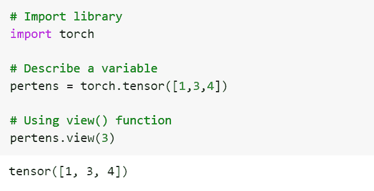
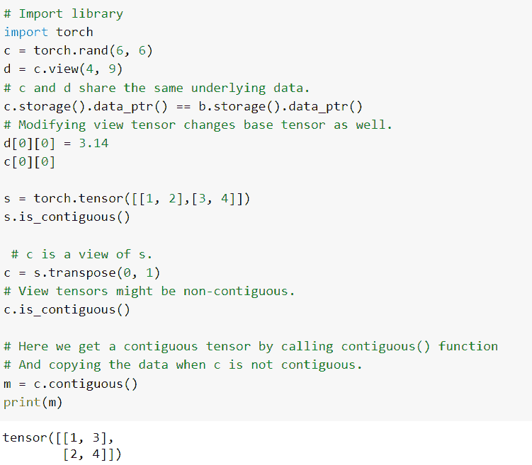
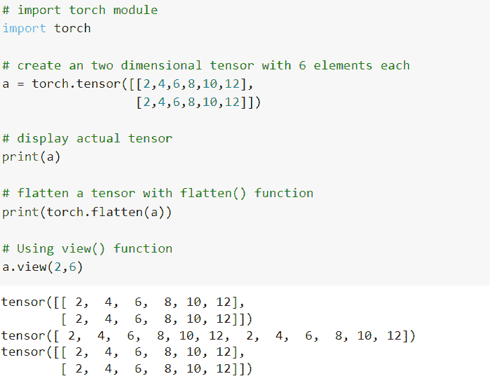
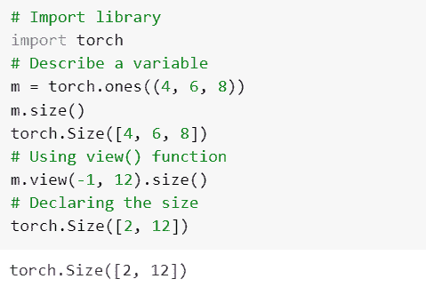
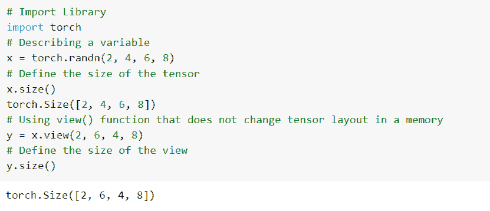
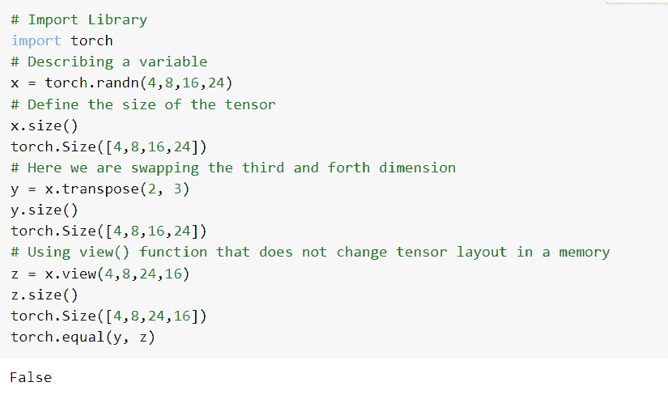
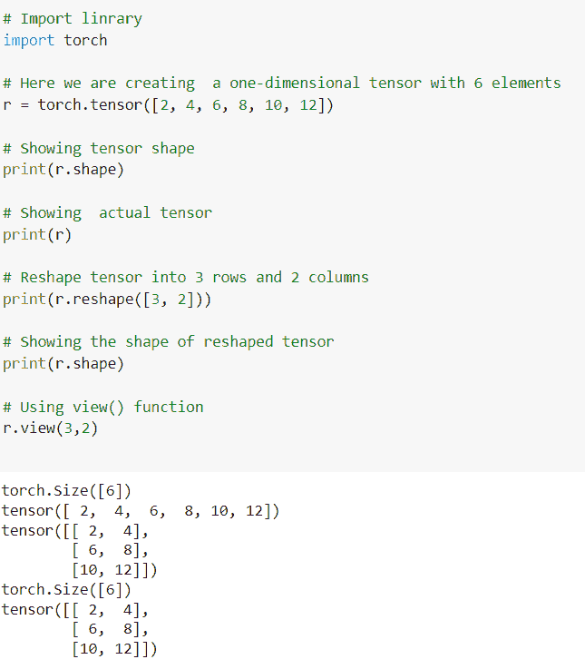
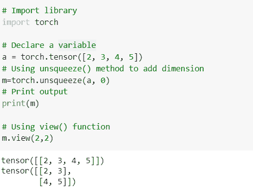
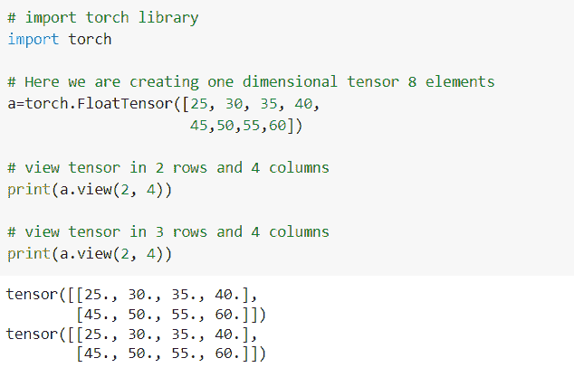
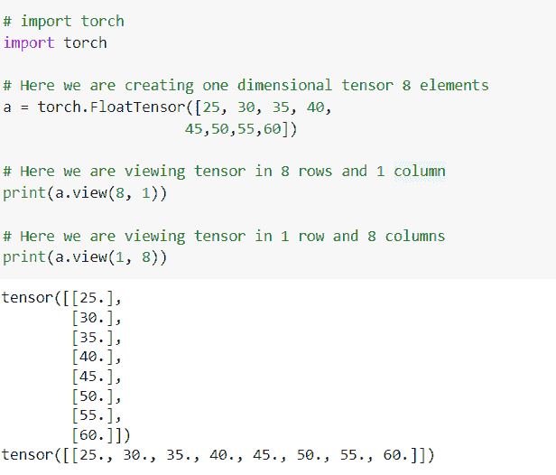

# PyTorch 视图教程[有 11 个例子]

> 原文：<https://pythonguides.com/pytorch-view/>

[](https://sharepointsky.teachable.com/p/python-and-machine-learning-training-course)

本 [PyTorch 教程](https://pythonguides.com/what-is-pytorch/)将讲解 Python 中 **PyTorch 视图**的用法。 `*PyTorch view()*` 函数返回一个具有相似数据数量的新张量，并且应该具有相似数量的元素。

此外，我们还将介绍与 PyTorch 视图相关的不同示例。我们将讨论这些话题。

*   PyTorch view
*   PyTorch 视图示例
*   PyTorch 视图批处理大小
*   PyTorch 视图连续
*   PyTorch 视图展平
*   NumPy 的 PyTorch 视图
*   PyTorch view size
*   PyTorch 视图转置
*   PyTorch 视图整形
*   PyTorch view unsqueeze
*   PyTorch 创建一个 8 元素的张量和 2 行 4 列的视图
*   PyTorch 将张量视图更改为 8 行 1 列

目录

[](#)

*   [视图指针](#PyTorch_view "PyTorch view")
*   [PyTorch 视图示例](#PyTorch_view_example "PyTorch view example")
*   [PyTorch 视图批处理大小](#PyTorch_view_Batchsize "PyTorch view Batchsize")
*   [PyTorch 视图连续](#PyTorch_view_contiguous "PyTorch view contiguous")
*   [PyTorch 视图展平](#PyTorch_view_flatten "PyTorch view flatten")
*   [numpy 中的 PyTorch 视图](#PyTorch_view_in_numpy "PyTorch view in numpy")
*   [视图大小指针](#PyTorch_view_size "PyTorch view size")
*   [PyTorch 视图转置](#PyTorch_view_transpose "PyTorch view transpose")
*   [PyTorch 视图重塑](#PyTorch_view_reshape "PyTorch view reshape")
*   [PyTorch view unsqueeze](#PyTorch_view_unsqueeze "PyTorch view unsqueeze")
*   [PyTorch 创建具有 8 个元素的张量和具有 2 行 4 列的视图](#PyTorch_to_create_a_tensor_with_8_elements_and_view_with_2_rows_and_4_columns "PyTorch to create a tensor with 8 elements and view with 2 rows and 4 columns")
*   [PyTorch 将张量视图变为 8 行 1 列](#PyTorch_to_change_the_view_of_a_tensor_into_8_rows_and_1_column "PyTorch to change the view of a tensor into 8 rows and 1 column")

## 视图指针

在本节中，我们将学习 python 中的 PyTorch 视图。

`*PyTorch view()*` 函数用于将张量转换为 2D 格式，即行和列。我们应该有一定数量的行和列来查看。

**语法:**

PyTorch 视图的语法是:

```py
tensor.view(no_of_rows, no_of_columns)
```

**参数:**

*   **行数:**我们可以查看几行。
*   列数:我们可以查看一些列。

这就是我们对 PyTorch 视图函数的理解。

另外，请查看:[py torch Lenet 简介](https://pythonguides.com/pytorch-lenet/)

## PyTorch 视图示例

在这一节中，我们将借助一个例子来了解**如何实现 PyTorch 视图**。

PyTorch view()函数返回一个具有相似数据数量的新张量，并且应该具有相似数量的元素。

**代码:**

在下面的代码中，我们将导入 torch 库，如 import torch。

*   **a = torch.randn(6，6):** 这里我们用 `torch.randn()` 函数声明一个变量。
*   **b = a.view(36):** 这里我们用 view()函数来描述一个变量。
*   **c = a.view(-1，12):** 这里的 size -1 是从其他维度推导出来的。

```py
 # Import library
import torch
# Describe a variable
a = torch.randn(6, 6)
torch.Size([6, 6])
# Using view() function
b = a.view(36)
# Print output
print(b)
b.size()
torch.Size([36])
# The size -1 is deduced from other dimensions
c = a.view(-1, 12)  
print(c)
```

**输出:**

运行上面的代码后，我们得到下面的输出，其中我们可以看到，使用 view()函数后，新的张量被返回，新张量的值被打印在屏幕上。


PyTorch view example

这样，我们借助一个例子理解了 PyTorch 的观点。

阅读: [PyTorch 添加尺寸](https://pythonguides.com/pytorch-add-dimension/)

## PyTorch 视图批处理大小

在本节中，我们将学习 python 中的 **PyTorch 视图批处理大小**。

在继续之前，我们应该对批量大小有所了解。

批量被定义为一个过程，在该过程中，模型之前制备的样品数量被更新。

PyTorch 视图 batchsize 用于返回具有相似数量数据的新张量。

**代码:**

在下面的代码中，首先我们将导入 torch 库，如 import torch。

*   **pertens = torch.tensor([1，3，4]):** 这里我们用 torch.tensor()函数声明 pertens 变量。
*   **pertens.view(3):** 这里我们使用 view()函数，它返回具有相似数量数据的新张量。

```py
# Import library
import torch

# Describe a variable
pertens = torch.tensor([1,3,4])

# Using view() function
pertens.view(3)
```

**输出:**

运行上面的代码后，我们得到下面的输出，其中我们可以看到 PyTorch 批处理大小值被打印在屏幕上。



PyTorch view batchsize

这就是我们对 PyTorch 视图批量大小的理解。

阅读: [PyTorch 超参数调谐](https://pythonguides.com/pytorch-hyperparameter-tuning/)

## PyTorch 视图连续

在本节中，我们将学习 python 中的 **PyTorch 视图连续**。

在继续之前，我们应该了解一些关于连续的知识。

连续被定义为顺序上的下一个或一起，或者我们可以说共享一个公共边界。

这里我们从产生非连续张量的连续张量的观点出发。

**代码:**

在下面的代码中，我们将导入 torch 模块，如 import torch。

*   **c = torch.rand(6，6):** 这里我们用 torch.rand()函数来描述一个变量。
*   **c .存储()。data_ptr() == b.storage()。data_ptr()** 用于共享相同的底层数据。
*   **s = torch.tensor([[1，2]，[3，4]]):** 这里我们用 torch.tensor()函数声明 s 变量。
*   **c = s.transpose(0，1):** 这里 c 是 s 的一个视图。
*   **m = c.contiguous():** 这里我们通过调用 contiguous()函数，复制 c 不连续时的数据，得到一个连续张量。

```py
# Import library
import torch
c = torch.rand(6, 6)
d = c.view(4, 9)
# c and d share the same underlying data.
c.storage().data_ptr() == b.storage().data_ptr()  
# Modifying view tensor changes base tensor as well.
d[0][0] = 3.14
c[0][0]

s = torch.tensor([[1, 2],[3, 4]])
s.is_contiguous()

 # c is a view of s. 
c = s.transpose(0, 1) 
# View tensors might be non-contiguous.
c.is_contiguous()

# Here we get a contiguous tensor by calling contiguous() function
# And copying the data when c is not contiguous.
m = c.contiguous()
print(m)
```

**输出:**

运行上面的代码后，我们得到了下面的输出，其中我们可以看到 PyTorch 视图的连续值被打印在屏幕上。



PyTorch view contiguous

这就是我们如何理解 PyTorch 视图的连续。

阅读: [PyTorch 线性回归](https://pythonguides.com/pytorch-linear-regression/)

## PyTorch 视图展平

在这一节中，我们将学习 python 中的 **PyTorch 视图展平**。

展平被定义为用于将 n 维张量展平为一维张量的过程。

**代码:**

在下面的代码中，我们将导入 torch 库，如 import torch。

*   **a = torch.tensor([[2，4，6，8，10，12]，[2，4，6，8，10，12]]):** 这里我们使用 torch.tensor()函数创建一个有六个元素的二维张量。
*   `print(a)` 用于显示一个实际的张量。
*   `print(torch.flatten(a))` 用 flatten()函数展平一个张量。
*   **a.view(2，6)** :这里我们使用一个 view()函数返回一个新的张量。

```py
# import torch module
import torch

# create an two dimensional tensor with 6 elements each
a = torch.tensor([[2,4,6,8,10,12],
                  [2,4,6,8,10,12]])

# Here we are displaying actual tensor
print(a)

# flatten a tensor with flatten() function
print(torch.flatten(a))

# Using view() function
a.view(2,6)
```

**输出:**

运行上面的代码后，我们得到下面的输出，其中我们可以看到 PyTorch 视图的展平值被打印在屏幕上。



PyTorch view flatten

由此，我们理解了 PyTorch 视图的扁平化。

阅读: [PyTorch Numpy to Tensor](https://pythonguides.com/pytorch-numpy-to-tensor/)

## numpy 中的 PyTorch 视图

在本节中，我们将学习 python 中 numpy 中的 **PyTorch 视图。**

Pytorch 视图用于在 torch 张量上注册以转换其形状。并在整形(numpy()函数)的帮助下转换 ndarray 的形状。

**代码:**

在下面的代码中，首先我们导入 torch 库，比如 import torch。

*   **m = torch.ones((4，6，8)):** 这里我们用 torch.ones()函数声明一个变量。
*   **m.view(-1，12)。size():** 这里我们使用 view()函数来返回新的张量。
*   **火炬。Size([2，12]):** 这里我们使用 torch.size()函数声明大小。

```py
# Import library
import torch
# Describe a variable
m = torch.ones((4, 6, 8))
m.size()
torch.Size([4, 6, 8])
# Using view() function
m.view(-1, 12).size()
# Declaring the size
torch.Size([2, 12])
```

**输出:**

运行上面的代码后，我们得到下面的输出，其中我们可以看到在 numpy 值中的 PyTorch 视图被打印在屏幕上。



PyTorch view in NumPy

由此，我们了解了 numpy 的 PyTorch 景观。

阅读:[py torch RNN-详细指南](https://pythonguides.com/pytorch-rnn/)

## 视图大小指针

在本节中，我们将学习 python 中的 **PyTorch 视图大小**。

正如我们所知，PyTorch view()函数返回具有相似数据的新张量，并且应该具有相似数量的元素，但大小不同。视图大小可以与其实际大小一致。

**代码:**

在下面的代码中，首先我们将导入 torch 库，如 import torch。

*   **x = torch.randn(2，4，6，8):** 这里我们用 torch.randn()函数来描述一个变量。
*   **火炬。尺寸([2，4，6，8])** 用来定义一个张量的大小。
*   **y = x.view(2，6，4，8):** 这里我们使用的是 view()函数，它不会改变张量在内存中的布局。
*   这里我们定义了视图的大小。

```py
# Import Library
import torch
# Describing a variable
x = torch.randn(2, 4, 6, 8)
# Define the size of the tensor
x.size()
torch.Size([2, 4, 6, 8])
# Using view() function that does not change tensor layout in a memory
y = x.view(2, 6, 4, 8) 
# Define the size of the view 
y.size()
```

**输出:**

运行上面的代码后，我们得到了下面的输出，其中您可以看到 PyTorch 视图大小值被绘制在屏幕上。



PyTorch view size

至此，我们了解了 PyTorch 视图的大小。

阅读: [PyTorch MNIST 教程](https://pythonguides.com/pytorch-mnist/)

## PyTorch 视图转置

在本节中，我们将学习 python 中的 **PyTorch 视图转置**。

PyTorch 视图转置被定义为将张量转移到不同的上下文或位置的过程，或者我们可以说改变两个或更多事物的位置。

**代码:**

在下面的代码中，我们将导入 torch 库，如 import torch。

*   **x = torch.randn(4，8，16，24):** 这里我们用 torch.randn()函数来描述一个变量。
*   **火炬。Size([4，8，16，24]):** 这里我们定义张量的大小。
*   **y = x.transpose(2，3):** 这里我们是交换第三和第四维。
*   **z = x.view(4，8，24，16):** 这里我们使用的是 view()函数，不改变张量在内存中的布局。

```py
# Import Library
import torch
# Describing a variable
x = torch.randn(4,8,16,24)
# Define the size of the tensor
x.size()
torch.Size([4,8,16,24])
# Here we are swapping the third and fourth dimension
y = x.transpose(2, 3)  
y.size()
torch.Size([4,8,16,24])
# Using view() function that does not change tensor layout in a memory
z = x.view(4,8,24,16)  
z.size()
torch.Size([4,8,24,16])
torch.equal(y, z)
```

**输出:**

在下面的输出中，您可以看到 PyTorch 视图移调值打印在屏幕上。



PyTorch view transpose

至此，我们了解了 PyTorch 视图转置。

阅读: [PyTorch 双星交叉熵](https://pythonguides.com/pytorch-binary-cross-entropy/)

## PyTorch 视图重塑

在本节中，我们将学习 python 中的 **PyTorch 视图整形**。

PyTorch 视图整形功能用于将尺寸整形或更改为给定的形状。张量被定义为输入张量。

**代码:**

在下面的代码中，我们将导入 torch 库，如 import torch。

*   **r = torch.tensor([2，4，6，8，10，12]):** 这里我们通过使用 torch.tensor()函数创建一个带有 size 元素的一维张量。
*   `print(r.shape)` 用于打印张量形状。
*   `print(r)` 用于显示实际形状。
*   **print(r . shape([3，2])**用于将张量整形为三行两列。
*   `print(r.shape)` 用于显示整形张量的形状。
*   **r.view(3，2):** 这里我们使用一个 view()函数返回新的张量。

```py
# Import linrary
import torch

# Here we are creating  a one-dimensional tensor with 6 elements
r = torch.tensor([2, 4, 6, 8, 10, 12])

# Showing tensor shape
print(r.shape)

# Showing  actual tensor
print(r)

# Reshape tensor into 3 rows and 2 columns
print(r.reshape([3, 2]))

# Showing the shape of reshaped tensor
print(r.shape)

# Using view() function
r.view(3,2) 
```

**输出:**

运行上面的代码后，我们得到下面的输出，其中我们可以看到 PyTorch 视图整形值被打印在屏幕上。



PyTorch view reshape

由此，我们了解了 PyTorch 观点的重塑。

阅读: [PyTorch 数据加载器+示例](https://pythonguides.com/pytorch-dataloader/)

## PyTorch view unsqueeze

在这一节中，我们将学习 python 中的 **PyTorch 视图 unsqueeze** 。

在前进之前，我们应该有一个关于 unsqueeze 的知识。

`unsqueeze()` 函数返回一个新的张量，其维数为 1，插入到定义的位置。

**代码:**

在下面的代码中，我们将导入 torch 库，如 import torch。

*   **a = torch.tensor([2，3，4，5]):** 这里我们用 torch.tensor()函数来描述变量。
*   **m=torch.unsqueeze(a，0):** 这里我们使用 unsqueeze()函数来添加维度。
*   `print(m)` 用于借助 print()函数打印输出。
*   **m.view(2，2):** 这里我们使用 view()函数返回新的张量。

```py
# Import library
import torch

# Declare a variable
a = torch.tensor([2, 3, 4, 5])
# Using unsqueeze() method to add dimension
m=torch.unsqueeze(a, 0)
# Print output
print(m)

# Using view() function
m.view(2,2)
```

**输出:**

运行上面的代码后，我们得到下面的输出，其中我们可以看到 PyTorch 视图的 unsqueeze 值被打印在屏幕上。



PyTorch view unsqueeze

这就是我们如何理解 PyTorch 视图挤压的原因。

阅读: [PyTorch 提前停止+示例](https://pythonguides.com/pytorch-early-stopping/)

## PyTorch 创建具有 8 个元素的张量和具有 2 行 4 列的视图

在本节中，我们将学习如何在 PyTorch 中创建一个包含 8 个元素的张量和一个包含 2 行 4 列的视图。

这里我们使用的是 view()函数。view()函数用于将张量转换为二维格式的行和列，这里我们创建了一个包含 8 个元素的张量和一个包含 2 行 4 列的视图。

代码:

在下面的代码中，首先我们导入 torch 库，比如 import torch。

*   a =火炬。FloatTensor([25，30，35，40，45，50，55，60]): 这里我们创建一个有 8 个元素的一维张量。
*   **print(a.view(2，4))** 用于查看 2 行 4 列的张量。
*   **print(a.view(2，4))** 用于查看 3 行 4 列的张量。

```py
# import torch library
import torch

# Here we are creating one dimensional tensor with 8 elements
a=torch.FloatTensor([25, 30, 35, 40,
                     45,50,55,60]) 

# view tensor in 2 rows and 4 columns
print(a.view(2, 4))

# view tensor in 3 rows and 4 columns
print(a.view(2, 4))
```

**输出:**

运行上面的代码后，我们得到了下面的输出，其中我们可以看到屏幕上打印了具有 8 个元素的 PyTorch 一维张量和具有 2 行 4 列值的视图。



PyTorch to create a tensor with 8 elements and view with 2 rows and 4 columns

这样，我们就了解了如何创建一个 8 元素的张量和 2 行 4 列的视图。

阅读: [PyTorch 预训练模型](https://pythonguides.com/pytorch-pretrained-model/)

## PyTorch 将张量视图变为 8 行 1 列

在这一节中，我们将学习如何在 PyTorch 中将一个张量的视图变成八个 **行和一个**列。

正如我们所知，PyTorch 视图函数用于将张量转换为行和列的 2D 格式。我们应该有一定数量的行和列来查看。

**代码:**

在下面的代码中，我们将导入 torch 模块，如 import torch。

*   a =火炬。FloatTensor([25，30，35，40，45，50，55，60]): 这里我们创建一个有八个元素的一维张量。
*   **print(a.view(8，1)):** 这里我们查看的是 8 行 1 列的张量。
*   **print(a.view(1，8)):** 这里我们正在查看 1 行 8 列的张量。

```py
# import torch
import torch

# Here we are creating one dimensional tensor 8 elements
a = torch.FloatTensor([25, 30, 35, 40,
                     45,50,55,60]) 

# Here we are viewing tensor in 8 rows and 1 column
print(a.view(8, 1))

# Here we are viewing tensor in 1 row and 8 columns
print(a.view(1, 8))
```

**输出:**

运行上面的代码后，我们得到下面的输出，其中我们可以看到屏幕上打印了将视图张量更改为 8 行和 1 列的值。



PyTorch to change the view of a tensor into 8 rows and 1 column

这就是我们如何理解如何将一个张量的视图变成 8 行。

您可能也喜欢阅读下面的 Python PyTorch 教程。

*   [指针为 Numpy](https://pythonguides.com/pytorch-tensor-to-numpy/)
*   [创建 PyTorch 空张量](https://pythonguides.com/pytorch-empty-tensor/)
*   [PyTorch 展平+ 8 个示例](https://pythonguides.com/pytorch-flatten/)
*   [PyTorch 负载模型+示例](https://pythonguides.com/pytorch-load-model/)
*   [亚当优化器 PyTorch](https://pythonguides.com/adam-optimizer-pytorch/)
*   [交叉熵损失 PyTorch](https://pythonguides.com/cross-entropy-loss-pytorch/)

因此，在本教程中，我们讨论了 **PyTorch 视图**,我们还讨论了与其实现相关的不同示例。这是我们已经讨论过的例子列表。

*   PyTorch view
*   PyTorch 视图示例
*   PyTorch 视图批处理大小
*   PyTorch 视图连续
*   PyTorch 视图展平
*   numpy 的 PyTorch 视图
*   PyTorch view size
*   PyTorch 视图转置
*   PyTorch 视图整形
*   PyTorch view unsqueeze
*   PyTorch 创建一个 8 元素的张量和 2 行 4 列的视图
*   PyTorch 将张量视图更改为 8 行 1 列

[Bijay Kumar](https://pythonguides.com/author/fewlines4biju/)

Python 是美国最流行的语言之一。我从事 Python 工作已经有很长时间了，我在与 Tkinter、Pandas、NumPy、Turtle、Django、Matplotlib、Tensorflow、Scipy、Scikit-Learn 等各种库合作方面拥有专业知识。我有与美国、加拿大、英国、澳大利亚、新西兰等国家的各种客户合作的经验。查看我的个人资料。

[enjoysharepoint.com/](https://enjoysharepoint.com/)[](https://www.facebook.com/fewlines4biju "Facebook")[](https://www.linkedin.com/in/fewlines4biju/ "Linkedin")[](https://twitter.com/fewlines4biju "Twitter")