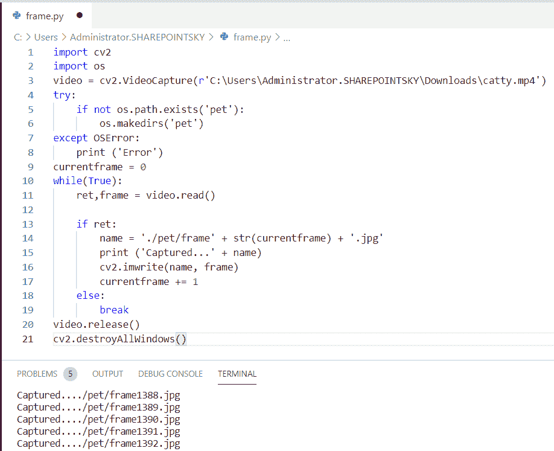
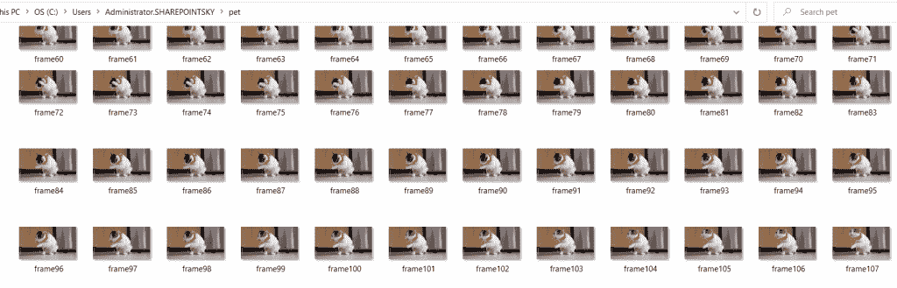

# 如何在 Python 中读取视频帧

> 原文：<https://pythonguides.com/read-video-frames-in-python/>

[](https://sharepointsky.teachable.com/p/python-and-machine-learning-training-course)

在本 [python 教程中，](https://pythonguides.com/python-hello-world-program/)我们将讨论如何在 python 中读取视频帧， **Python 读取视频帧，**我们还将讨论以下主题:

*   Python 读取视频帧
*   Python 从视频中提取特定帧

目录

[](#)

*   [Python 读取视频帧](#Python_read_video_frames "Python read video frames")
*   [Python 从视频中提取特定帧](#Python_extract_a_specific_frame_from_video "Python extract a specific frame from video")

## Python 读取视频帧

这里可以看到**如何用 python 读取视频帧**。

*   在这个例子中，我导入了名为 `cv2` 和 `os` 的模块。
*   接下来，我们应该读取视频的路径。
*   这里，我们使用 `os.makedirs` 创建一个名为 pet 的文件夹，将视频的帧复制到该文件夹中。**宠物**是文件夹的名字。
*   我使用了异常，如果文件夹没有被创建，它会产生一个错误。
*   当我们使用框架时，我们应该提到当前框架来使用它。
*   ret 用于返回帧。使用 while 条件，如果该条件为真，则将视频读入文件夹。
*   读取图像**。使用 jpg** 扩展名。将编号分配给文件夹中的每个框架 currentframe += 1。
*   如果条件为假，则执行 else，使用 `video.release()` 来释放对象。
*   cv2.destroyAllWindows() 简单地销毁所有创建的窗口。

**举例:**

```py
import cv2 
import os 
video = cv2.VideoCapture(r'C:\Users\Administrator.SHAREPOINTSKY\Downloads\catty.mp4') 
try:  
	if not os.path.exists('pet'): 
		os.makedirs('pet') 
except OSError: 
	print ('Error') 
currentframe = 0
while(True): 
	ret,frame = video.read() 

	if ret: 
		name = './pet/frame' + str(currentframe) + '.jpg'
		print ('Captured...' + name) 
		cv2.imwrite(name, frame) 
		currentframe += 1
	else: 
		break
video.release() 
cv2.destroyAllWindows()
```

下面的截图显示了作为输出的帧的创建。



Python read video frames

作为输出，我们可以看到文件夹中的视频帧。下面的截图显示了输出。



Python read video frames

这就是如何在 Python 中**读取视频帧。**

## Python 从视频中提取特定帧

在这里，我们可以看到**如何用 python 从视频**中提取特定的一帧。

*   在这个例子中，我将一个名为 **numpy 的模块作为 np** 和 `cv2` 导入，然后通过指定路径读取文件。
*   为了给出帧**的值，使用 cap.set(1，16)** 。这里，16 是帧的编号。
*   使用 cap.read 读取帧**。我已经使用了 `cv2.imshow()` 来显示指定帧的图像。**

示例:

```py
import numpy as np
import cv2
cap = cv2.VideoCapture(r'C:\Users\Administrator.SHAREPOINTSKY\Downloads\catty.mp4')
cap.set(1,16);
ret, frame = cap.read() 
cv2.imshow('window_name', frame) 
```

下面的截图显示了视频中指定的帧


Python extract a specific frame from video

这就是如何用 Python 从视频中**提取特定帧。**

您可能会喜欢以下 Python 教程:

*   [Python 熊猫中的 group by](https://pythonguides.com/groupby-in-python-pandas/)
*   [Python 程序打印数组中的元素](https://pythonguides.com/python-program-to-print-element-in-an-array/)
*   [Python 熊猫中的交叉表](https://pythonguides.com/crosstab-in-python-pandas/)
*   [Python 二叉树实现](https://pythonguides.com/python-binary-tree/)
*   [Python 字符串格式化示例](https://pythonguides.com/python-string-formatting/)
*   [Python 程序打印质数](https://pythonguides.com/python-program-to-print-prime-numbers/)
*   [Python 中的 NumPy 是什么](https://pythonguides.com/numpy/)

在本教程中，我们已经了解了 **Python 读取视频帧**，并且我们还涵盖了以下主题:

*   Python 读取视频帧
*   Python 从视频中提取特定帧

[Bijay Kumar](https://pythonguides.com/author/fewlines4biju/)

Python 是美国最流行的语言之一。我从事 Python 工作已经有很长时间了，我在与 Tkinter、Pandas、NumPy、Turtle、Django、Matplotlib、Tensorflow、Scipy、Scikit-Learn 等各种库合作方面拥有专业知识。我有与美国、加拿大、英国、澳大利亚、新西兰等国家的各种客户合作的经验。查看我的个人资料。

[enjoysharepoint.com/](https://enjoysharepoint.com/)[](https://www.facebook.com/fewlines4biju "Facebook")[](https://www.linkedin.com/in/fewlines4biju/ "Linkedin")[](https://twitter.com/fewlines4biju "Twitter")