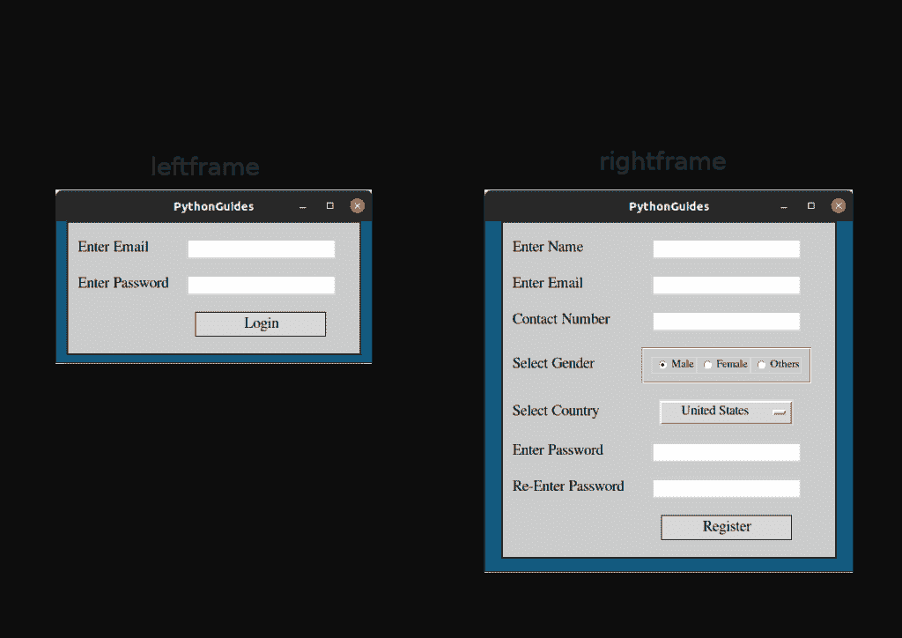
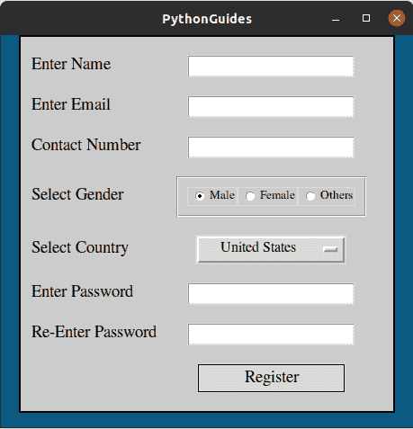
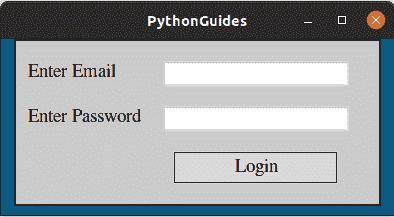
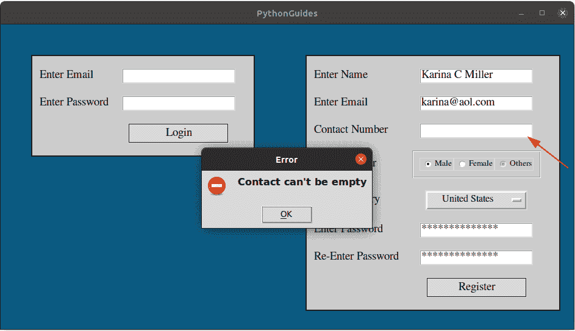
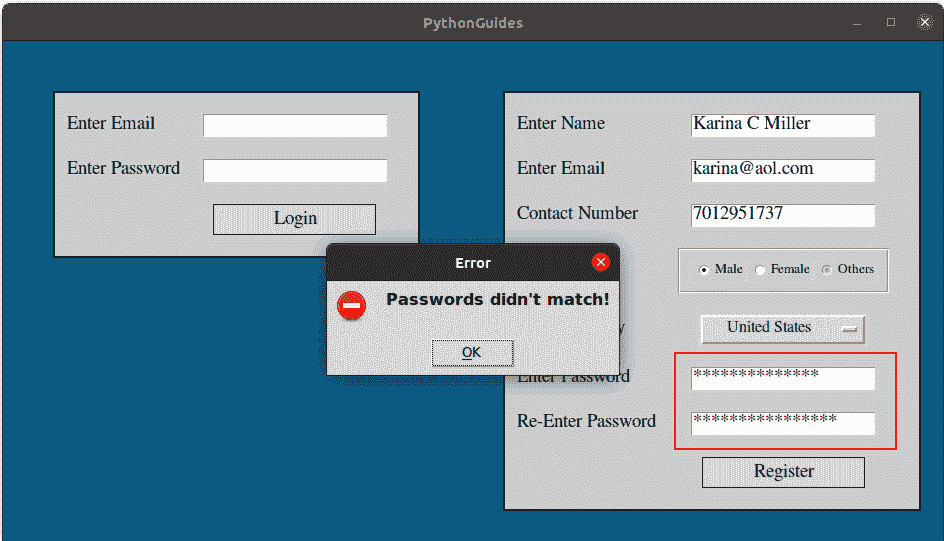
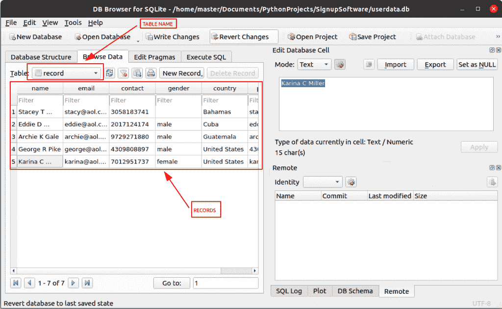
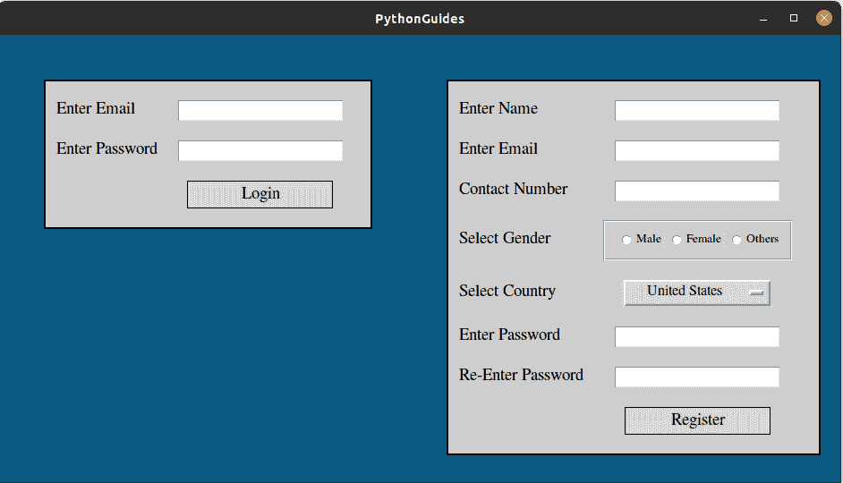
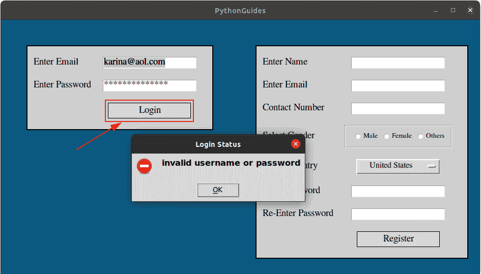
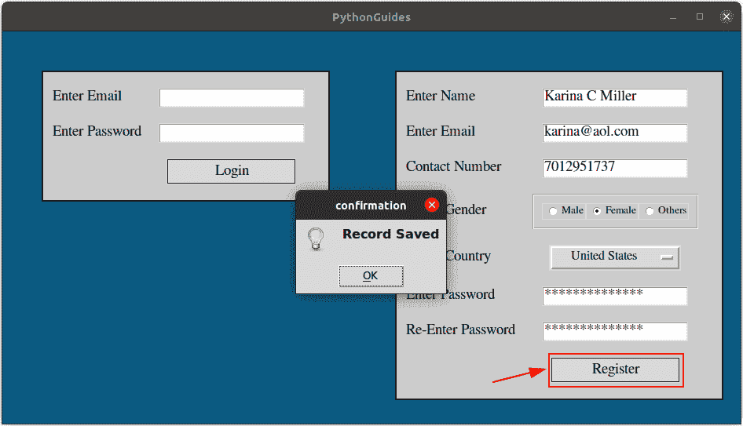
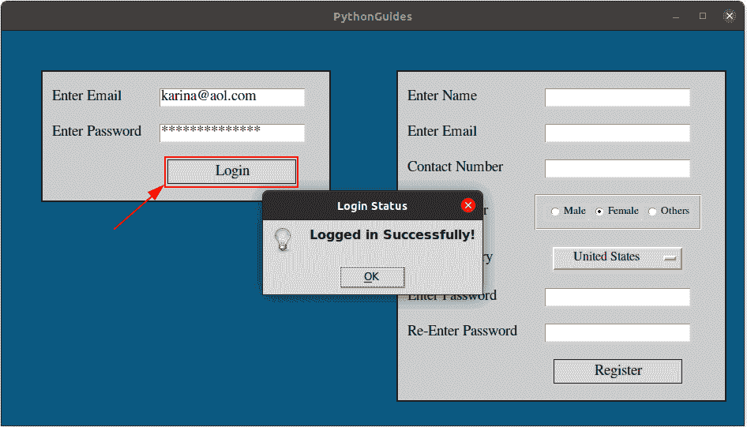

# 使用 Tkinter 的 Python 注册表+使用数据库 SQLite3 的 Python Tkinter 登录页面

> 原文：<https://pythonguides.com/registration-form-in-python-using-tkinter/>

[](https://sharepointsky.teachable.com/p/python-and-machine-learning-training-course)

这篇完整的 python 教程解释了如何使用 Python Tkinter 创建一个**注册表单，以及如何使用数据库 sqlite3** 在 Python Tkinter 中创建一个**登录页面。此外，我还解释了如何在 Python Tkinter 中验证注册表单中的表单字段。我希望，你会喜欢这个，**注册表在 Python 中使用 Tkinter** 的例子。**

所有数据将使用 **SQLite3 数据库**存储和提取。这是一个关于数据库的 python 中的**注册表单的完整项目，它可以用于在 Python 中的任何桌面应用程序中添加注册&登录屏幕。**

目录

[](#)

*   [使用 Tkinter 在 Python 中登录和注册表单概述](#Login_and_Registration_form_in_Python_using_Tkinter_Overview "Login and Registration form in Python using Tkinter Overview")
*   [Python Tkinter 注册表](#Python_Tkinter_Registration_Form "Python Tkinter Registration Form")
*   [使用数据库](#Login_page_in_Python_Tkinter_with_database "Login page in Python Tkinter with database")在 Python Tkinter 中登录页面
*   [对空字段使用 tkinter 验证的登记表](#Registration_form_using_tkinter_validation_for_empty_fields "Registration form using tkinter validation for empty fields")
*   [将 Python Tkinter 注册表单数据保存到 sqlite3](#Save_Python_Tkinter_registration_form_data_to_sqlite3 "Save Python Tkinter registration form data to sqlite3")

## 使用 Tkinter 在 Python 中登录和注册表单概述

*   使用 Python 库' `Tkinter` '创建登录和注册表单[阅读更多关于 [Python Tkinter](https://pythonguides.com/python-gui-programming/)
*   Tkinter 允许创建基于 GUI 的应用程序,并且有很多有用的小部件。
*   对于数据库，我们使用了 python 预装的 [SQLite3](https://www.sqlite.org/index.html) 。它是 SQL 的简化版本，可以存储 281 的数据。
*   我们已经在项目中的所有输入字段上添加了验证，这意味着必须提供所有信息。不这样做将提示一条错误消息。
*   异常处理程序是用来避免中断程序的，你也可以通过消息框看到错误。
*   下拉列表中显示了'**北美**'大陆的所有国家的名称。如果您想添加更多的国家，只需将 **[countries.txt](https://pythonguides.com/wp-content/uploads/2021/05/countries.txt)** 替换为您的文本文件，但一定要更改第 129 行代码中的名称。更简单的方法是编辑 inside `countries.txt` 的数据。
*   下面是对程序中使用的小部件的描述。此外，我们有一个项目中使用的每个部件的专用部分，我们在每个部件前面添加了一个链接。

| Widget Name | 小部件概述 |
| --- | --- |
| [Python Tkinter 帧](https://pythonguides.com/python-tkinter-frame/) | 我们使用了两个名为**左帧** & **右帧**的帧。他们定位登录和注册页面。用于定位框架的几何图形管理器是 Place。 |
| [Tkinter 标签](https://pythonguides.com/python-tkinter-label/) | 标签小部件用于在应用程序屏幕上显示文本。屏幕上的所有文本，如“输入电子邮件”、“输入姓名”等，都是使用标签小部件添加的。 |
| [入口小部件](https://pythonguides.com/python-tkinter-entry/) | 输入框为用户提供空白空间，用户可以在其中输入详细信息。它是任何应用程序中使用的最重要的小部件之一。 |
| [Python Tkinter 单选按钮](https://pythonguides.com/python-tkinter-radiobutton/) | Radiobutton 小部件用于向用户提供单一选择。在应用程序中。用户一次只能选择一种性别。 |
| [选项菜单](https://pythonguides.com/python-tkinter-optionmenu/) | OptionMenu 用于显示下拉菜单。它用于在应用程序中显示国家列表。了解有关 OptionMenu 的更多信息。 |
| [按钮](https://pythonguides.com/python-tkinter-button/) | 按钮用于在被点击时执行一个动作。在这个应用程序中，我们使用了两个名为 Login 和 Register 的按钮。 |

Widgets used in the application



Login and registration form in python using tkinter

使用 Tkinter 中的 pyqrcode 读取 [Python QR 码生成器](https://pythonguides.com/python-qr-code-generator/)

## Python Tkinter 注册表

在本节中，我们将讨论使用 tkinter 的 python 中的**注册表。**我们将在那时讨论小部件以及使用它们的目的。这里分享的代码只针对注册页面的界面。完整的应用程序代码在页面底部共享。

**框架` `小工具**

*   ws 是我们将要放置框架的主窗口
*   `bd` 是框架的边界
*   `bg` 是背景色。
*   **浮雕**是提供一种特殊效果。
*   这里使用的几何方法是' **pack'** ,但在下面的完整代码中，我们使用了**位置**,因为位置允许我们以更高的精度定位小部件。
*   创建这个小部件的想法是将其他小部件放入其中，这样一切看起来都很有条理。

```py
 right_frame = Frame(
    ws, 
    bd=2, 
    bg='#CCCCCC',
    relief=SOLID, 
    padx=10, 
    pady=10
    )

right_frame.pack()
```

**标签` `小工具**

*   标签用于向应用程序添加文本。我们已经多次使用标签来显示不同的文本。
*   这里我将解释一次，这将适用于程序中使用的所有标签。
*   在下面的代码中，Label 是用于创建标签小部件的关键字。
*   我们将这个标签放在**右帧**上。
*   此处添加的任何**文本**将显示在应用程序上
*   我们使用**网格**作为几何方法来定位文本。

```py
Label(
    right_frame, 
    text="Enter Name", 
    bg='#CCCCCC',
    font=f
    ).grid(row=0, column=0, sticky=W, pady=10) 
```

**入口小工具**

*   **条目**小部件用于接收用户的输入。它提供了一个空白空间，用户可以在其中键入任何文本。
*   入口小部件在代码中多次使用，这个解释在所有。
*   Entry 关键字用于所有的调用入口小工具，它被放置在 `right_frame`
*   我们使用**网格**作为几何方法来定位文本。

```py
register_name = Entry(
    right_frame, 
    font=f
    )

register_name.grid(row=0, column=1, pady=10, padx=20) 
```

**单选按钮**

*   **单选按钮**用于向用户提供多个选项，但用户只能选择一个选项。
*   我们创建了另一个名为' **gender_frame'** 的框架来容纳所有的单选按钮。
*   `text` 是我们想要显示在**单选按钮**旁边的名字，例如本例中的“男性”。
*   `bg` 是单选按钮的背景色。
*   **变量**意味着值将会改变，所以在这种情况下，我们将它设置为**变量**，也就是**字符串变量()**。现在提供的值必须是一个字符串。如果 var 设置为 `IntVar()` 在这种情况下，值应该是一个整数。
*   **值**可以是整数或字符串，这取决于我们使用的变量类型。值有助于识别选择了哪个单选按钮。
*   **包**几何方法被用来在允许的空间内展开&坚守自己的左侧。
*   当 3 个单选按钮以相同的属性放置时，它们看起来都是一样的，有组织的。

```py
 var = StringVar()
var.set('male')

male_rb = Radiobutton(
    gender_frame, 
    text='Male',
    bg='#CCCCCC',
    variable=var,
    value='male',
    font=('Times', 10),

)

male_rb.pack(expand=True, side=LEFT)
```

**选项菜单**

*   `OptionMenu` 用于在应用程序中创建下拉菜单。显示大数据并不理想，因为它没有滚动条，但它占用的空间较少，并显示适当数量的选项。
*   我们使用 OptionMenu 来显示北美大陆的国家列表。
*   在**步骤 1** 下，我们使用关键字 OptionMenu 来创建小工具，并将其放置在 `right_frame` 内，分配的变量是 StringVar()，这意味着将涉及不同的字符串值。***国家**指名单上的所有国家。
*   在**步骤 2** 下，我们有**国家= []** ，这是一个空列表，它将被附加上国家名称。 `variable =StringVar()` 表示字符串会不断变化。
*   在第三步中，我们从一个文本文件中读取国家名称，然后使用一个循环将每个国家追加到列表中。`country.rstrip('\n')`它从列表中删除。
*   **网格**是用于定位微件的几何方法。

```py
 # step 2
countries = []
variable = StringVar()

# step 3
world = open('countries.txt', 'r')
for country in world:
    country = country.rstrip('\n')
    countries.append(country)
variable.set(countries[22])

# step 1
register_country = OptionMenu(
    right_frame, 
    variable, 
    *countries)

# step 4
register_country.grid(row=4, column=1, pady=10, padx=20)
```

**按钮**

*   Python Tkinter 中的**按钮**用于触发活动。当它被点击时应该会发生一些事情。
*   在这个应用程序中，按钮用于保存数据库中的数据。
*   Button 关键字用于创建一个小部件，它被放置在 right_frame 中。
*   **宽度**是按钮的左右间距
*   文本是按钮上显示的名称。
*   **光标**是鼠标指针的图标。我们使用了**手 2** ，这意味着每当用户将光标放在按钮上时，光标就会变成一个指向的手指。
*   **命令**保存了关于点击按钮会发生什么的信息。这里我们将它设置为 None，这意味着什么都不会发生，但是在完整的代码中，我们为它提供了一个函数名。

```py
register_btn = Button(
    right_frame, 
    width=15, 
    text='Register', 
    font=f, 
    relief=SOLID,
    cursor='hand2',
    command=None
)
```

**使用 tkinter 代码的登记表**

下面是使用 tkinter 的 python 中的**注册表单的完整代码片段。该程序仅在用户界面方面不依赖于完整的代码。**

```py
from tkinter import *

ws = Tk()
ws.title('PythonGuides')
ws.config(bg='#0B5A81')

f = ('Times', 14)
var = StringVar()
var.set('male')

countries = []
variable = StringVar()
world = open('countries.txt', 'r')
for country in world:
    country = country.rstrip('\n')
    countries.append(country)
variable.set(countries[22])

right_frame = Frame(
    ws, 
    bd=2, 
    bg='#CCCCCC',
    relief=SOLID, 
    padx=10, 
    pady=10
    )

Label(
    right_frame, 
    text="Enter Name", 
    bg='#CCCCCC',
    font=f
    ).grid(row=0, column=0, sticky=W, pady=10)

Label(
    right_frame, 
    text="Enter Email", 
    bg='#CCCCCC',
    font=f
    ).grid(row=1, column=0, sticky=W, pady=10)

Label(
    right_frame, 
    text="Contact Number", 
    bg='#CCCCCC',
    font=f
    ).grid(row=2, column=0, sticky=W, pady=10)

Label(
    right_frame, 
    text="Select Gender", 
    bg='#CCCCCC',
    font=f
    ).grid(row=3, column=0, sticky=W, pady=10)

Label(
    right_frame, 
    text="Select Country", 
    bg='#CCCCCC',
    font=f
    ).grid(row=4, column=0, sticky=W, pady=10)

Label(
    right_frame, 
    text="Enter Password", 
    bg='#CCCCCC',
    font=f
    ).grid(row=5, column=0, sticky=W, pady=10)

Label(
    right_frame, 
    text="Re-Enter Password", 
    bg='#CCCCCC',
    font=f
    ).grid(row=6, column=0, sticky=W, pady=10)

gender_frame = LabelFrame(
    right_frame,
    bg='#CCCCCC',
    padx=10, 
    pady=10,
    )

register_name = Entry(
    right_frame, 
    font=f
    )

register_email = Entry(
    right_frame, 
    font=f
    )

register_mobile = Entry(
    right_frame, 
    font=f
    )

male_rb = Radiobutton(
    gender_frame, 
    text='Male',
    bg='#CCCCCC',
    variable=var,
    value='male',
    font=('Times', 10),

)

female_rb = Radiobutton(
    gender_frame,
    text='Female',
    bg='#CCCCCC',
    variable=var,
    value='female',
    font=('Times', 10),

)

others_rb = Radiobutton(
    gender_frame,
    text='Others',
    bg='#CCCCCC',
    variable=var,
    value='others',
    font=('Times', 10)

)

register_country = OptionMenu(
    right_frame, 
    variable, 
    *countries)

register_country.config(
    width=15, 
    font=('Times', 12)
)
register_pwd = Entry(
    right_frame, 
    font=f,
    show='*'
)
pwd_again = Entry(
    right_frame, 
    font=f,
    show='*'
)

register_btn = Button(
    right_frame, 
    width=15, 
    text='Register', 
    font=f, 
    relief=SOLID,
    cursor='hand2',
    command=None
)

register_name.grid(row=0, column=1, pady=10, padx=20)
register_email.grid(row=1, column=1, pady=10, padx=20) 
register_mobile.grid(row=2, column=1, pady=10, padx=20)
register_country.grid(row=4, column=1, pady=10, padx=20)
register_pwd.grid(row=5, column=1, pady=10, padx=20)
pwd_again.grid(row=6, column=1, pady=10, padx=20)
register_btn.grid(row=7, column=1, pady=10, padx=20)
right_frame.pack()

gender_frame.grid(row=3, column=1, pady=10, padx=20)
male_rb.pack(expand=True, side=LEFT)
female_rb.pack(expand=True, side=LEFT)
others_rb.pack(expand=True, side=LEFT)

ws.mainloop()
```

**输出:**

在这个输出中，您可以看到注册表单是使用 Python Tkinter 创建的。该表单具有使用 Python Tkinter 小部件创建的输入和选择字段。



registration form using tkinter

## 使用数据库在 Python Tkinter 中登录页面

本节将看到 python tkinter 中的**登录页面的代码解释，该页面带有数据库**。完整的应用程序代码共享在页面的末尾。本节中显示的代码仅在用户界面方面是完整的。

**Python Tkinter 中的框架小部件**

*   `Frame` widget 允许在上面放置其他 widget。如果框架上放置了其他小部件，应用程序外观会进行组织，并且它还可以控制各个部分。
*   这里 `left_frame` 用于创建应用程序的登录部分。
*   Frame 关键字用于调用 frame widget，它被放置在主窗口上，即 `ws` 。
*   `bd` 是 Python Tkinter 中框架小部件的边框宽度
*   **浮雕**有不同的模式，由我们用过的立体，它勾勒出轮廓。在相框周围。

```py
 left_frame = Frame(
    ws, 
    bd=2, 
    bg='#CCCCCC',   
    relief=SOLID, 
    padx=10, 
    pady=10
    )
```

**Python Tkinter 中的标签小部件**

*   标签用于向应用程序添加文本。
*   在下面的代码中，Label 是用于创建标签小部件的关键字。
*   我们将这个标签放在**左帧**上。
*   此处添加的任何**文本**将显示在应用程序上
*   我们使用**网格**作为几何方法来定位文本。

```py
Label(
    left_frame, 
    text="Enter Email", 
    bg='#CCCCCC',
    font=f).grid(row=0, column=0, sticky=W, pady=10)
```

**Python Tkinter 中的入口小部件**

*   **条目**小部件用于接收用户的输入。它提供了一个空白空间，用户可以在其中键入任何文本。
*   Entry 关键字用于所有的调用入口小部件，它被放置在 `left_frame` 上
*   我们使用**网格**作为几何方法来定位文本。

```py
email_tf = Entry(
    left_frame, 
    font=f
    )

email_tf.grid(row=0, column=1, pady=10, padx=20)
```

**Python Tkinter 中的按钮部件**

*   Python Tkinter 中的**按钮**用于触发活动。当它被点击时应该会发生一些事情。
*   在这个应用程序中，按钮用于保存数据库中的数据。
*   Button 关键字用于创建一个小部件，它被放置在 `left_frame` 中。
*   **宽度**是按钮的左右间距
*   **文本**是按钮上显示的名称。
*   **光标**是鼠标指针的图标。我们使用了 hand2，这意味着每当用户将光标放在按钮上时，光标就会变成一个指向的手指。
*   **命令**保存了关于点击按钮会发生什么的信息。这里我们将它设置为 None，这意味着什么都不会发生，但是在完整的代码中，我们为它提供了一个函数名。

```py
login_btn = Button(
    left_frame, 
    width=15, 
    text='Login', 
    font=f, 
    relief=SOLID,
    cursor='hand2',
    command=None
    )

login_btn.grid(row=2, column=1, pady=10, padx=20)
```

**登录的完整代码片段:**

下面是使用 Python Tkinter 的登录表单的完整代码片段。该程序仅在用户界面方面不依赖于完整的代码。

```py
from tkinter import *

ws = Tk()
ws.title('PythonGuides')
ws.config(bg='#0B5A81')

f = ('Times', 14)

left_frame = Frame(
    ws, 
    bd=2, 
    bg='#CCCCCC',   
    relief=SOLID, 
    padx=10, 
    pady=10
    )

Label(
    left_frame, 
    text="Enter Email", 
    bg='#CCCCCC',
    font=f).grid(row=0, column=0, sticky=W, pady=10)

Label(
    left_frame, 
    text="Enter Password", 
    bg='#CCCCCC',
    font=f
    ).grid(row=1, column=0, pady=10)

email_tf = Entry(
    left_frame, 
    font=f
    )
pwd_tf = Entry(
    left_frame, 
    font=f,
    show='*'
    )
login_btn = Button(
    left_frame, 
    width=15, 
    text='Login', 
    font=f, 
    relief=SOLID,
    cursor='hand2',
    command=None
    )

email_tf.grid(row=0, column=1, pady=10, padx=20)
pwd_tf.grid(row=1, column=1, pady=10, padx=20)
login_btn.grid(row=2, column=1, pady=10, padx=20)
left_frame.pack()

ws.mainloop()
```

**输出**:

在这个输出中，您可以看到一个使用 Python Tkinter 创建的登录表单。



simple login form in python

这是 python tkinter 中带有数据库的**登录页面的样子。**

## 对空字段使用 tkinter 验证的登记表

*   在本节中，我们将看到用于识别 **Python Tkinter 注册表**中的空字段的代码，我们将看到如何强制用户在相应的文本字段或选择字段(如 Radiobutton 和 OptionMenu)中提供输入。
*   我们使用了一个简单的策略来做到这一点。我们检查每个输入字段，并且每当用户提供输入时，我们就将 check_counter 变量加 1。
*   我们有了条目字段总数，现在我们用字段总数检查 check_count。如果它们相等，那么应用程序将继续并保存数据，否则它将为相应的空字段抛出一条错误消息。
*   应用程序中使用的另一个验证是密码验证。因为我们在注册表中有两个密码字段。
    *   输入口令
    *   呈现密码
*   我们已经把这两个进行了比较。如果两者相同，应用程序将继续运行，否则将抛出相关的错误消息。

**代码片段:**

下面是用于在 python 中验证**注册表中的条目字段的代码。**

```py
check_counter=0
warn = ""

if register_name.get() == "":
   warn = "Name can't be empty"
else:
    check_counter += 1
check_counter=0

if register_email.get() == "":
    warn = "Email can't be empty"
else:
    check_counter += 1

if register_mobile.get() == "":
   warn = "Contact can't be empty"
else:
    check_counter += 1

if  var.get() == "":
    warn = "Select Gender"
else:
    check_counter += 1

if variable.get() == "":
   warn = "Select Country"
else:
    check_counter += 1

if register_pwd.get() == "":
    warn = "Password can't be empty"
else:
    check_counter += 1

if pwd_again.get() == "":
    warn = "Re-enter password can't be empty"
else:
    check_counter += 1 
```

**输出:**

在这个输出中，用户试图在不提供联系号码的情况下注册，因此他收到了一个错误提示，上面提到了错误。如果用户试图跳过任何其他字段，也会发生同样的事情。



registration form in python using tkinter (validation for empty fields)

**代码片段:**

下面是密码不匹配验证的代码片段。

```py
if register_pwd.get() != pwd_again.get():
        warn = "Passwords didn't match!"
else:
   check_counter += 1
```

**输出:**

下面是显示密码不匹配时提示的错误的输出。



registration form in python using tkinter (password validation)

这就是我们如何使用 tkinter 在**注册表中实现验证。**

## 将 Python Tkinter 注册表单数据保存到 sqlite3

正如我们所知，这是一个使用 Tkinter 和数据库在 python 中注册表单的例子，在这个应用程序中，我们使用 SQLite3 在数据库中存储数据。SQLite3 预装了 python，你需要做的就是 `import sqlite3`。要访问数据库中的数据，您可以使用 [DB 浏览器](https://sqlitebrowser.org/)。

**使用 Python Tkinter 中的 SQLite 创建数据库**

这行代码将创建一个名为 `userdata.db` 的数据库。该文件将存储在主文件所在的位置。使用数据库浏览器，您可以查看和编辑数据。

```py
con = sqlite3.connect('userdata.db')
```

使用下面的代码，你可以为数据库创建表格。

```py
con = sqlite3.connect('userdata.db')
cur = con.cursor()
cur.execute('''CREATE TABLE IF NOT EXISTS record(
                    name text, 
                    email text, 
                    contact number, 
                    gender text, 
                    country text,
                    password text
                )
            ''')
con.commit()
```

**在 Python Tkinter 中使用 SQLite 插入数据**

*   一旦我们创建了数据库，现在重要的是连接到数据库中插入数据。
*   **`cur.execute()`** 用于传递插入查询。我们使用了字典格式传递查询。
*   **`con.commit()`** 写下数据库中的变化。

```py
 con = sqlite3.connect('userdata.db')
            cur = con.cursor()
            cur.execute("INSERT INTO record VALUES (:name, :email, :contact, :gender, :country, :password)", {
                            'name': register_name.get(),
                            'email': register_email.get(),
                            'contact': register_mobile.get(),
                            'gender': var.get(),
                            'country': variable.get(),
                            'password': register_pwd.get()

            })
            con.commit()
```

这是记录的输出，这是数据库浏览器软件的界面。



registration form in python using tkinter with database

**完整代码片段:**

这里是使用 Python Tkinter 创建的应用程序的完整代码。我们已经在上面部分解释了整个代码。

```py
from tkinter import *
from tkinter import messagebox
import sqlite3

f = ('Times', 14)

con = sqlite3.connect('userdata.db')
cur = con.cursor()
cur.execute('''CREATE TABLE IF NOT EXISTS record(
                    name text, 
                    email text, 
                    contact number, 
                    gender text, 
                    country text,
                    password text
                )
            ''')
con.commit()

ws = Tk()
ws.title('PythonGuides')
ws.geometry('940x500')
ws.config(bg='#0B5A81')

def insert_record():
    check_counter=0
    warn = ""
    if register_name.get() == "":
       warn = "Name can't be empty"
    else:
        check_counter += 1

    if register_email.get() == "":
        warn = "Email can't be empty"
    else:
        check_counter += 1

    if register_mobile.get() == "":
       warn = "Contact can't be empty"
    else:
        check_counter += 1

    if  var.get() == "":
        warn = "Select Gender"
    else:
        check_counter += 1

    if variable.get() == "":
       warn = "Select Country"
    else:
        check_counter += 1

    if register_pwd.get() == "":
        warn = "Password can't be empty"
    else:
        check_counter += 1

    if pwd_again.get() == "":
        warn = "Re-enter password can't be empty"
    else:
        check_counter += 1

    if register_pwd.get() != pwd_again.get():
        warn = "Passwords didn't match!"
    else:
        check_counter += 1

    if check_counter == 8:        
        try:
            con = sqlite3.connect('userdata.db')
            cur = con.cursor()
            cur.execute("INSERT INTO record VALUES (:name, :email, :contact, :gender, :country, :password)", {
                            'name': register_name.get(),
                            'email': register_email.get(),
                            'contact': register_mobile.get(),
                            'gender': var.get(),
                            'country': variable.get(),
                            'password': register_pwd.get()

            })
            con.commit()
            messagebox.showinfo('confirmation', 'Record Saved')

        except Exception as ep:
            messagebox.showerror('', ep) 
    else:
        messagebox.showerror('Error', warn)

def login_response():
    try:
        con = sqlite3.connect('userdata.db')
        c = con.cursor()
        for row in c.execute("Select * from record"):
            username = row[1]
            pwd = row[5]

    except Exception as ep:
        messagebox.showerror('', ep)

    uname = email_tf.get()
    upwd = pwd_tf.get()
    check_counter=0
    if uname == "":
       warn = "Username can't be empty"
    else:
        check_counter += 1
    if upwd == "":
        warn = "Password can't be empty"
    else:
        check_counter += 1
    if check_counter == 2:
        if (uname == username and upwd == pwd):
            messagebox.showinfo('Login Status', 'Logged in Successfully!')

        else:
            messagebox.showerror('Login Status', 'invalid username or password')
    else:
        messagebox.showerror('', warn)

var = StringVar()
var.set('male')

countries = []
variable = StringVar()
world = open('countries.txt', 'r')
for country in world:
    country = country.rstrip('\n')
    countries.append(country)
variable.set(countries[22])

# widgets
left_frame = Frame(
    ws, 
    bd=2, 
    bg='#CCCCCC',   
    relief=SOLID, 
    padx=10, 
    pady=10
    )

Label(
    left_frame, 
    text="Enter Email", 
    bg='#CCCCCC',
    font=f).grid(row=0, column=0, sticky=W, pady=10)

Label(
    left_frame, 
    text="Enter Password", 
    bg='#CCCCCC',
    font=f
    ).grid(row=1, column=0, pady=10)

email_tf = Entry(
    left_frame, 
    font=f
    )
pwd_tf = Entry(
    left_frame, 
    font=f,
    show='*'
    )
login_btn = Button(
    left_frame, 
    width=15, 
    text='Login', 
    font=f, 
    relief=SOLID,
    cursor='hand2',
    command=login_response
    )

right_frame = Frame(
    ws, 
    bd=2, 
    bg='#CCCCCC',
    relief=SOLID, 
    padx=10, 
    pady=10
    )

Label(
    right_frame, 
    text="Enter Name", 
    bg='#CCCCCC',
    font=f
    ).grid(row=0, column=0, sticky=W, pady=10)

Label(
    right_frame, 
    text="Enter Email", 
    bg='#CCCCCC',
    font=f
    ).grid(row=1, column=0, sticky=W, pady=10)

Label(
    right_frame, 
    text="Contact Number", 
    bg='#CCCCCC',
    font=f
    ).grid(row=2, column=0, sticky=W, pady=10)

Label(
    right_frame, 
    text="Select Gender", 
    bg='#CCCCCC',
    font=f
    ).grid(row=3, column=0, sticky=W, pady=10)

Label(
    right_frame, 
    text="Select Country", 
    bg='#CCCCCC',
    font=f
    ).grid(row=4, column=0, sticky=W, pady=10)

Label(
    right_frame, 
    text="Enter Password", 
    bg='#CCCCCC',
    font=f
    ).grid(row=5, column=0, sticky=W, pady=10)

Label(
    right_frame, 
    text="Re-Enter Password", 
    bg='#CCCCCC',
    font=f
    ).grid(row=6, column=0, sticky=W, pady=10)

gender_frame = LabelFrame(
    right_frame,
    bg='#CCCCCC',
    padx=10, 
    pady=10,
    )

register_name = Entry(
    right_frame, 
    font=f
    )

register_email = Entry(
    right_frame, 
    font=f
    )

register_mobile = Entry(
    right_frame, 
    font=f
    )

male_rb = Radiobutton(
    gender_frame, 
    text='Male',
    bg='#CCCCCC',
    variable=var,
    value='male',
    font=('Times', 10),

)

female_rb = Radiobutton(
    gender_frame,
    text='Female',
    bg='#CCCCCC',
    variable=var,
    value='female',
    font=('Times', 10),

)

others_rb = Radiobutton(
    gender_frame,
    text='Others',
    bg='#CCCCCC',
    variable=var,
    value='others',
    font=('Times', 10)

)

register_country = OptionMenu(
    right_frame, 
    variable, 
    *countries)

register_country.config(
    width=15, 
    font=('Times', 12)
)
register_pwd = Entry(
    right_frame, 
    font=f,
    show='*'
)
pwd_again = Entry(
    right_frame, 
    font=f,
    show='*'
)

register_btn = Button(
    right_frame, 
    width=15, 
    text='Register', 
    font=f, 
    relief=SOLID,
    cursor='hand2',
    command=insert_record
)

# widgets placement
email_tf.grid(row=0, column=1, pady=10, padx=20)
pwd_tf.grid(row=1, column=1, pady=10, padx=20)
login_btn.grid(row=2, column=1, pady=10, padx=20)
left_frame.place(x=50, y=50)

register_name.grid(row=0, column=1, pady=10, padx=20)
register_email.grid(row=1, column=1, pady=10, padx=20) 
register_mobile.grid(row=2, column=1, pady=10, padx=20)
register_country.grid(row=4, column=1, pady=10, padx=20)
register_pwd.grid(row=5, column=1, pady=10, padx=20)
pwd_again.grid(row=6, column=1, pady=10, padx=20)
register_btn.grid(row=7, column=1, pady=10, padx=20)
right_frame.place(x=500, y=50)

gender_frame.grid(row=3, column=1, pady=10, padx=20)
male_rb.pack(expand=True, side=LEFT)
female_rb.pack(expand=True, side=LEFT)
others_rb.pack(expand=True, side=LEFT)

# infinite loop
ws.mainloop()
```

**输出:**

在这个输出中，您可以看到主应用程序的界面。我们在左边有一个登录屏幕，在右边有一个注册屏幕。必须在登录和注册屏幕上提供所有信息。



Fig 1: Main Application Window

在这个屏幕中，试图登录的用户没有注册，这就是她看到这个错误消息的原因。如果注册用户输入了错误的凭证，也会出现同样的错误。



Fig 2: Login failed

这是验证错误，用户试图在没有填写所有字段的情况下登录。


Fig 3: Fields can’t be empty

这是另一个验证错误，重要的是密码和重新输入的密码相同。


Fig 4: Password match failed

在此输出中，用户提供了与重新输入密码列匹配的所有信息和密码。用户向应用程序注册。



Fig 5: Registration Successful

在这个输出中，您可以看到已经注册的用户可以通过提供正确的凭证来登录..



Fig 6: Login Successful

下面你可以看到，用 python 编写的注册表使用 tkinter 数据已经保存到了 sqlite3 数据库中。


Fig 7:

您可能还喜欢:

*   [从 PDF Python 中提取文本](https://pythonguides.com/extract-text-from-pdf-python/)
*   [使用 Python Tkinter 的身体质量指数计算器](https://pythonguides.com/bmi-calculator-using-python-tkinter/)
*   [如何使用 Python Tkinter 创建倒计时定时器](https://pythonguides.com/create-countdown-timer-using-python-tkinter/)
*   [用 Python Tkinter 上传文件](https://pythonguides.com/upload-a-file-in-python-tkinter/)
*   [如何使用 Python Tkinter 创建日期时间选择器](https://pythonguides.com/create-date-time-picker-using-python-tkinter/)

我希望你一定喜欢 python Tkinter 示例中完整的登录和注册表单，自己试试代码。它解决了以下问题:

*   带有数据库的 python 注册表
*   使用 tkinter 和数据库在 python 中注册表单
*   使用 tkinter 在 python 中注册表单
*   python 注册表单代码 tkinter
*   使用数据库 sqlite3 在 python tkinter 中登录页面
*   python 中的简单登录表单

[Bijay Kumar](https://pythonguides.com/author/fewlines4biju/)

Python 是美国最流行的语言之一。我从事 Python 工作已经有很长时间了，我在与 Tkinter、Pandas、NumPy、Turtle、Django、Matplotlib、Tensorflow、Scipy、Scikit-Learn 等各种库合作方面拥有专业知识。我有与美国、加拿大、英国、澳大利亚、新西兰等国家的各种客户合作的经验。查看我的个人资料。

[enjoysharepoint.com/](https://enjoysharepoint.com/)[](https://www.facebook.com/fewlines4biju "Facebook")[](https://www.linkedin.com/in/fewlines4biju/ "Linkedin")[](https://twitter.com/fewlines4biju "Twitter")