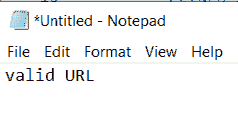

# Python 中的正则表达式

> 原文：<https://pythonguides.com/regular-expressions-in-python/>

[](https://sharepointsky.teachable.com/p/python-and-machine-learning-training-course)

想了解一下 Python 中的**正则表达式？在这个 [python 教程](https://pythonguides.com/python-programming-for-the-absolute-beginner/)中我们将讨论:**

*   Python 中的正则表达式
*   Python 中正则表达式的功能
*   Python 正则表达式特殊序列
*   Python 正则表达式函数
*   搜索功能()
*   分割函数()
*   findall 函数()
*   子函数()
*   Python 验证示例(使用正则表达式)
*   Python 密码字段验证
*   Python 中的手机号码字段验证
*   Python 中的电子邮件字段验证
*   Python 邮政编码字段验证
*   Python 中的 URL 字段验证

目录

[](#)

*   [Python 中的正则表达式](#Regular_Expressions_in_Python "Regular Expressions in Python")
*   [Python 中正则表达式的功能](#Functions_of_regular_expressions_in_Python "Functions of regular expressions in Python")
*   [Python 正则表达式特殊序列](#Python_regular_expressions_special_sequence "Python regular expressions special sequence")
*   [Python 正则表达式函数](#Python_regular_expression_functions "Python regular expression functions")
    *   [搜索功能()](#search_function "search function()")
    *   [分割函数()](#split_function "split function()")
    *   [findall 函数()](#findall_function "findall function()")
    *   [子函数()](#sub_function "sub function()")
*   [Python 验证示例(使用正则表达式)](#Python_Validation_Examples_using_regular_expressions "Python Validation Examples (using regular expressions)")
    *   [Python 密码域验证](#Python_Password_field_validation "Python Password field validation")
    *   [Python 中的手机号码字段验证](#Mobile_number_field_validation_in_Python "Mobile number field validation in Python")
    *   [Python 中的电子邮件字段验证](#Email_field_validation_in_Python "Email field validation in Python")
    *   [Python 邮政编码字段验证](#Python_Zip-code_field_validation "Python Zip-code field validation")
    *   [Python 中的 URL 字段验证](#URL_field_validation_in_Python "URL field validation in Python")

## Python 中的正则表达式

**正则表达式**或者也称为**正则表达式模式**帮助我们使用各种模式来查找或匹配。在 Python 中，我们可以通过导入 re 模块来使用正则表达式，如下所示:

要在 Python 中**导入 re 模块，可以使用下面的系统。**

```py
import re
```

## Python 中正则表达式的功能

re 模块有一些您可以使用的功能:

*   `search()` :该函数从字符串中返回匹配对象
*   `split()` :这个函数将给定的字符串拆分成列表
*   `find all()` :该函数返回字符串中的所有匹配项
*   `sub()` :此函数替换字符串中的任何匹配项

## Python 正则表达式特殊序列

这里有几个 **Python 正则表达式**特殊序列，它们是基于功能的字符。

| **特殊序列** |
| **\ A**-这将返回在字符串的**开头**的指定字符的匹配。 |
| **\ Z**–返回位于字符串**末端**的指定字符的匹配。 |
| **\ b**–返回位于字符串开头或**结尾**的指定字符的匹配。 |
| **\ B**–返回不在字符串开头或结尾的指定字符的匹配。 |
| **\ d**–如果字符串中出现**数字**，则返回一个匹配。 |
| **\ D**–如果字符串中的**数字不是**，则返回一个匹配。 |
| **\ s**–当字符**中包含空格**时，返回一个匹配。 |
| **\ S**–当字符**中不包含空格**时，返回一个匹配。 |
| **\ w**–当字符串中包含**单词字符**时，返回一个匹配项。 |
| **\ W**–当字符串**中不包含单词字符**时，返回一个匹配。 |

## Python 正则表达式函数

现在，让我们看看几个可以和 **Python 正则表达式**一起使用的 [Python 函数](https://pythonguides.com/function-in-python/)。

### 搜索功能()

现在我们可以看到**如何在 python 中的正则表达式**中执行搜索功能。

在这个例子中，我已经导入了一个**模块 re** 并指定了一个字符串为“芒果是黄色的” `re.search` ()函数用于从字符串中返回匹配对象。

**'\Amango'** 返回开头的字符。使用 **'\zstring'** 返回末尾的字符。

示例:

```py
import re
string = "Mango is yellow"
match = re.search('\AMango', string)
if match:
  print("pattern found")
else:
  print("pattern not found") 
```

下图显示了输出:


Python search function()

### 分割函数()

现在我们可以看到**如何在 python 中执行正则表达式**的 split function()

在这个例子中，我导入了一个**重新打包**， **re.split(pattern，a)** 这个函数在匹配的地方拆分字符串，并返回发生拆分的字符串列表。

示例:

```py
import re
a = 'mango 4 is yellow.'
pattern = '\d'
res = re.split(pattern, a) 
print(res) 
```

下图显示了输出:


Python split function()

### findall 函数()

现在我们可以看到**如何在 python 中执行正则表达式**的 findall()

在本例中，我采用了一个既有字符又有数字的字符串， `re.findall()` 函数查找所有匹配项，并返回一个匹配项列表作为字符串 **'\d+'** 这将返回字符串中的数字。

示例:

```py
import re
a = 'mango 24 is 12 yellow 6'
pattern = '\d+'
res = re.findall(pattern, a) 
print(res)
```

下图显示了输出:


findall function()

### 子函数()

现在我们可以看到**如何在 python 中执行正则表达式**的 sub function()

在这个例子中，我替换了字符串之间的空格， `re.sub()` 函数用另一个子字符串替换特定子字符串的出现。

示例:

```py
import re
string = 'I am having silver color car'

pattern = '\s'
replace = ''
newstring = re.sub(pattern, replace, string) 
print(newstring)
```

下图显示了输出:


sub function()

读取: [Python NumPy 连接](https://pythonguides.com/python-numpy-concatenate/)和 [Python NumPy 读取 CSV](https://pythonguides.com/python-numpy-read-csv/)

## Python 验证示例(使用正则表达式)

让我们看看几个使用 **Python 正则表达式**的 **Python 验证示例**。

### Python 密码域验证

现在，让我们看看如何在 Python 中验证**密码字段。**

验证:

*   [a-z]之间至少有一个字母
*   [A-Z]之间至少有一个字母
*   至少一个介于[0-9]之间的数字
*   至少包含[$#@]中的一个字符

现在，在这个概念中，我们可以看到**如何使用 python 中的正则表达式**来验证密码。

在本例中，我认为密码的长度应该大于 6 或小于 11，并且密码应该包含一个介于[a-z]之间的字母、一个介于[A-Z]之间的字母、一个介于[0-9]之间的数字和一个来自[$#@]的字符，如果条件有效，它应该打印“有效密码”，否则打印“无效密码”。

**举例:**

```py
import re
a= input("enter your password")
x = True
while x:  
    if (len(a)<6 or len(a)>11):
        break
    elif not re.search("[a-z]",a):
        break
    elif not re.search("[0-9]",a):
        break
    elif not re.search("[A-Z]",a):
        break
    elif not re.search("[$#@]",a):
        break
    elif re.search("\s",a):
        break
    else:
        print("Valid Password")
        x=False
        break

if x:
    print("Not a Valid Password") 
```

下图显示了输出:


Password field validation

### Python 中的手机号码字段验证

现在我们可以看到**如何使用 python 中的正则表达式**来验证手机号码。

*   起始数字应该是(0/91)
*   第一个数字应该在[7-9]之间
*   接下来的 9 个数字应该在[0-9]之间

在这个例子中，我将模式“9945555555”作为手机号码，将验证作为

```py
("(0/91)?[7-9][0-9]{9}")
```

**举例:**

```py
import re 
def isValid(p): 
    Pattern = re.compile("(0/91)?[7-9][0-9]{9}") 
    return Pattern.match(p) 
p = "9945555555"
if (isValid(p)):  
    print ("Valid Number")      
else : 
    print ("Invalid Number") 
```

通过这种方式，您可以在 Python 中**验证手机号码字段有效性。**

阅读: [Python NumPy 日志](https://pythonguides.com/python-numpy-log/)

### Python 中的电子邮件字段验证

现在我们可以看到**如何使用 python 中的正则表达式来验证电子邮件**

在这个例子中，我有一个输入字符串，验证格式是 **[A-Za-z0-9-_]+(。[A-Za-z0-9-_]+)*@[A-Za-z0-9-]+(。[A-Za-z0-9]+)*(。【A-Za-z】{ 2，})** 。IGNORECASE 允许在常规表达式中区分大小写匹配。 `re.match` ()将搜索正则表达式模式并返回字符串列表。

示例:

```py
import re
email = input ("Please type in an email address ")
if re.match("\A(?P<name>[\w\-_]+)@(?P<domain>[\w\-_]+).(?P<toplevel>[\w]+)\Z",email,re.IGNORECASE):
    print("email is valid")
else:
    print("email is invalid") 
```

验证的详细格式

```py
[A-Za-z0-9-_]+(.[A-Za-z0-9-_]+)*@[A-Za-z0-9-]+(.[A-Za-z0-9]+)*(.[A-Za-z]{2,})
```

下图显示了输出:


Email field validation

### Python 邮政编码字段验证

现在我们可以看到**如何使用 python 中的正则表达式**来验证 zipcode

在这个例子中，我们可以看到如何验证一个邮政编码**，re.match()** 将搜索正则表达式模式并返回字符串列表， **re.findall()将搜索**字符串中的所有模式。

*   **\d** :匹配并捕获列表中的一个数字
*   **？=** :前一项是可选的，几乎匹配一次
*   **\1** :被捕获组的反向引用
*   **< 2** :尾数应该小于真

示例:

```py
import re
a=input('enter a zipcode')
b = (re.match(r'^[1-9][\d]{5}$',a) and len(re.findall(r'(\d)(?=\d\1)',a))<2 )
print(b)
```

下图显示了 **Python 邮政编码验证**的输出。


Zip-code field validation

### Python 中的 URL 字段验证

这里我们可以看到**如何使用 python 中的正则表达式**来验证 URL

在这个例子中，我采用了验证格式，因为 url 必须以(http 或 https)开头，接下来它应该有://和 www。然后是长度{2，150}，最后是域名**。com** ，**。组织**

示例:

```py
import re
def isValidURL(string):
    regex = ("((http|https)://)(www.)?" +"[a-zA-Z0-9@:%._\\+~#?&//=]" +"{2,150}\\.[a-z]" +"{2,6}\\b([-a-zA-Z0-9@:%" +"._\\+~#?//&=]*)")
    a = re.compile(regex)
    if (string == None):
        return False
    if(re.search(a, string)):
        return True
    else:
        return False
url = "https://pythonguides.com"

if(isValidURL(url) == True):
    print("valid URL")
else:
    print("Not valid URL")
```

下图显示了输出:



URL field validation

您可能会喜欢以下 Python 教程:

*   [Python 布尔函数](https://pythonguides.com/python-booleans/)
*   [Python 打印 2 位小数](https://pythonguides.com/python-print-2-decimal-places/)
*   [Python 生成器](https://pythonguides.com/python-generators/)
*   [Python Tkinter 单选按钮–如何使用](https://pythonguides.com/python-tkinter-radiobutton/)
*   [Python 格式数字加逗号](https://pythonguides.com/python-format-number-with-commas/)
*   [Python 生成随机数和字符串](https://pythonguides.com/python-generate-random-number/)
*   [Python 将列表写入文件，并附有示例](https://pythonguides.com/python-write-list-to-file/)
*   [Python 线程和多线程](https://pythonguides.com/python-threading-and-multithreading/)
*   [如何将 Python 角度转换为弧度](https://pythonguides.com/python-threading-and-multithreading/)
*   [Python 比较运算符](https://pythonguides.com/python-threading-and-multithreading/)
*   [集合的并集 Python +实例](https://pythonguides.com/union-of-sets-python/)

我希望本教程有助于学习 python 中的**正则表达式，涵盖以下主题。**

*   Python 中的正则表达式
*   Python 中正则表达式的功能
*   Python 正则表达式特殊序列
*   Python 正则表达式函数
*   搜索功能()
*   分割函数()
*   findall 函数()
*   子函数()
*   Python 验证示例(使用正则表达式)
*   Python 密码字段验证
*   Python 中的手机号码字段验证
*   Python 中的电子邮件字段验证
*   Python 邮政编码字段验证
*   Python 中的 URL 字段验证

[Bijay Kumar](https://pythonguides.com/author/fewlines4biju/)

Python 是美国最流行的语言之一。我从事 Python 工作已经有很长时间了，我在与 Tkinter、Pandas、NumPy、Turtle、Django、Matplotlib、Tensorflow、Scipy、Scikit-Learn 等各种库合作方面拥有专业知识。我有与美国、加拿大、英国、澳大利亚、新西兰等国家的各种客户合作的经验。查看我的个人资料。

[enjoysharepoint.com/](https://enjoysharepoint.com/)[](https://www.facebook.com/fewlines4biju "Facebook")[](https://www.linkedin.com/in/fewlines4biju/ "Linkedin")[](https://twitter.com/fewlines4biju "Twitter")