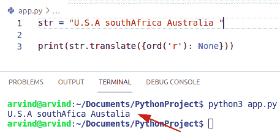
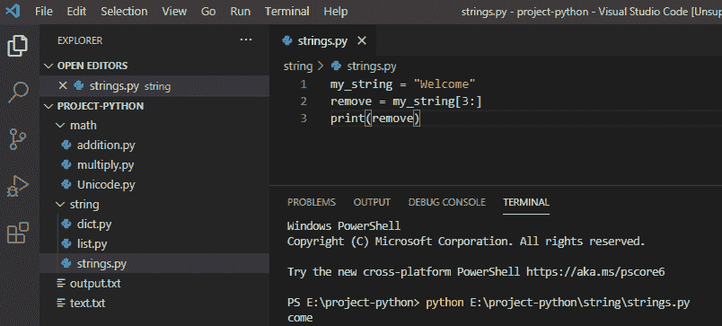
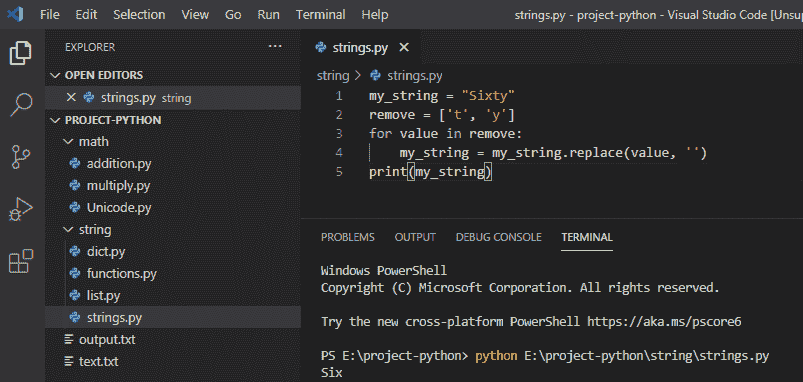
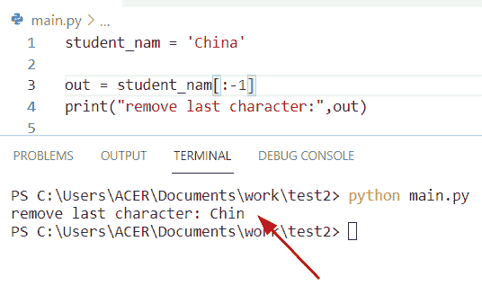

# 从字符串 Python 中移除字符(35 个示例)

> 原文：<https://pythonguides.com/remove-character-from-string-python/>

[](https://sharepointsky.teachable.com/p/python-and-machine-learning-training-course)

在本 [Python 教程](https://pythonguides.com/python-hello-world-program/)中，我们将讨论**如何从字符串 Python** 中移除字符。在这里，我添加了 35 个 Python 中各种字符串操作的例子。

我们还将检查:

*   **Python 从字符串中删除一个字符**
*   Python 使用 replace()方法从字符串中删除字符
*   Python 使用 replace()方法从字符串中删除多个字符
*   Python 使用 translate()方法从字符串中删除字符
*   Python 使用 translate()方法从字符串中删除多个字符
*   从字符串 python 中移除第一个字符
*   从字符串 python 中删除 n 个字符
*   从字符串 python 中移除换行符
*   在 python 中移除指定次数
*   Python 替换一个字符串中的多个字符
*   从字符串 python 中移除字符串
*   如何从字符串 python 中移除标点符号
*   移除字符串 python 中的最后一个字符
*   从字符串 python 中移除最后 4 个字符
*   Python 删除了字符串中所有空格
*   Python 只删除前导和尾随空格
*   在 python 中从一个字符串中删除多个字符
*   从字符串 python 中移除空格
*   python 从字符串中剥离子串
*   通过索引从字符串 python 中移除字符
*   从字符串中删除一个字符 python 熊猫
*   Python 从字符串中删除一个特殊字符
*   Python 从列表中的字符串中删除一个字符
*   Python 从字符串中删除一个字符的所有实例
*   Python 从字符串正则表达式中删除字符
*   Python 从字符串开头移除字符
*   Python 从字符串末尾移除字符
*   python 从字符串中移除字符(如果存在)
*   Python 从索引后的字符串中删除字符
*   从字符串 Python 中移除字母
*   从字符串 Python pandas 中删除多个字符
*   Python 剥离前两个字符
*   Python strip 最后两个字符
*   从字符串 Python 中移除*

目录

[](#)

*   [Python 从字符串中删除一个字符](#Python_remove_a_character_from_a_string "Python remove a character from a string")
*   [Python 使用 replace()方法从字符串中删除一个字符](#Python_remove_a_character_from_a_string_using_replace_method "Python remove a character from a string using replace() method")
*   [Python 使用 replace()方法从一个字符串中删除多个字符](#Python_remove_multiple_characters_from_a_string_using_replace_method "Python remove multiple characters from a string using replace() method")
*   [Python 使用 translate()方法从字符串中删除一个字符](#Python_remove_a_character_from_a_string_using_translate_method "Python remove a character from a string using translate() method")
*   [Python 使用 translate()方法从字符串中删除多个字符](#Python_remove_multiple_characters_from_a_string_using_translate_method "Python remove multiple characters from a string using translate() method")
*   [删除字符串 Python 的第一个字符](#Remove_first_character_from_string_Python "Remove first character from string Python")
*   [从字符串 python 中删除 n 个字符](#Remove_n_character_from_string_python "Remove n character from string python")
*   [从字符串 python 中移除换行符](#Remove_newline_from_string_python "Remove newline from string python")
*   [在 python 中删除指定次数](#Remove_specified_number_of_times_in_python "Remove specified number of times in python")
*   [Python 替换一个字符串中的多个字符](#Python_replace_multiple_characters_in_a_string "Python replace multiple characters in a string")
*   [从字符串 python 中移除字符串](#Remove_string_from_string_python "Remove string from string python")
*   [如何删除字符串中的标点符号 python](#How_to_remove_punctuation_from_a_string_python "How to remove punctuation from a string python")
*   [删除字符串 python 的最后一个字符](#Remove_last_character_from_string_python "Remove last character from string python")
*   [删除字符串 python 的最后 4 个字符](#Remove_last_4_characters_from_string_python "Remove last 4 characters from string python")
*   [Python 删除字符串中的所有空格](#Python_remove_all_whitespace_from_a_string "Python remove all whitespace from a string")
*   [Python 只删除前导和尾随空格](#Python_remove_only_leading_and_trailing_spaces "Python remove only leading and trailing spaces")
*   [在 python 中从一个字符串中删除多个字符](#Remove_multiple_characters_from_a_string_in_python "Remove multiple characters from a string in python")
*   [如何从字符串 python 中删除空格](#How_to_remove_spaces_from_string_python "How to remove spaces from string python")
*   [Python 从字符串中剥离子串](#Python_strip_substring_from_string "Python strip substring from string")
*   [Python 从字符串中删除指定字符](#Python_remove_a_specified_character_from_a_string "Python remove a specified character from a string")
*   [通过索引从字符串 Python 中删除一个字符](#Remove_a_character_from_a_string_Python_by_index "Remove a character from a string Python by index")
*   [从字符串中删除一个字符 python 熊猫](#Remove_a_character_from_a_string_python_pandas "Remove a character from a string python pandas")
*   [Python 从字符串中移除特殊字符](#Python_remove_a_special_character_from_a_string "Python remove a special character from a string")
*   [Python 从字符串列表中删除一个字符](#Python_remove_a_character_from_a_string_in_the_list "Python remove a character from a string in the list")
*   [Python 从字符串中移除一个字符的所有实例](#Python_remove_all_instances_of_a_character_from_a_string "Python remove all instances of a character from a string")
*   [Python 从字符串正则表达式中删除一个字符](#Python_remove_a_character_from_string_regex "Python remove a character from string regex")
*   [如何在 Python 中使用 regex 删除字符串中的多个字符](#How_to_remove_multiple_characters_from_string_by_using_regex_in_Python "How to remove multiple characters from string by using regex in Python")
*   [Python 从字符串开头移除字符](#Python_remove_character_from_string_beginning "Python remove character from string beginning")
*   [使用 Slice()方法从字符串开头删除一个字符](#Remove_a_character_from_the_string_beginning_using_Slice_method "Remove a character from the string beginning using Slice() method")
*   [通过使用 join()和列表理解方法](#By_using_join_and_list_comprehension_method "By using join() and list comprehension method")
*   [Python 从字符串末尾移除字符](#Python_remove_character_from_string_end "Python remove character from string end")
*   [通过使用 split()函数删除最后一个字符](#By_using_split_function_to_remove_last_character "By using split() function to remove last character")
*   [通过使用 rstrip()方法](#By_using_rstrip_method "By using rstrip() method")
*   [Python 删除字符串中存在的字符](#Python_remove_character_from_string_if_exists "Python remove character from string if exists")
*   [Python 从字符串中移除索引后的字符](#Python_remove_character_from_string_after_index "Python remove character from string after index")
*   [从字符串 Python 中删除字母](#Remove_letter_from_string_Python "Remove letter from string Python")
*   [从字符串中删除多个字符 Python 熊猫](#Remove_multiple_characters_from_string_Python_Pandas "Remove multiple characters from string Python Pandas")
*   [Python 剥离前两个字符](#Python_strip_first_two_characters "Python strip first two characters")
*   [Python 剥离最后两个字符](#Python_strip_last_two_characters "Python strip last two characters")
*   [使用 strip()方法从字符串中删除最后两个字符](#Remove_last_two_characters_from_string_by_using_strip_method "Remove last two characters from string by using strip() method")
*   [将*从字符串 Python 中移除](#Remove_from_string_Python "Remove * from string Python")

## Python 从字符串中删除一个字符

让我们看一个 **Python 从字符串**中删除字符的例子。

**在 Python** 中，从字符串中删除字符在许多应用程序中非常有用。过滤文本，情感总是需要能够从字符串中删除一个字符的主要方法和解决方案。

*   使用 replace()和 translate()方法可以很容易地从字符串中删除一个字符。
*   要从字符串中删除一个字符，有许多方法可以解决这个问题。
*   我们将讨论以下方法。
    *   使用 Python replace()方法
    *   使用 translate()方法
    *   使用切片方法
    *   使用 join()方法
    *   使用 filter()方法

*   `Replace()` :这个函数是一个内置的字符串方法，它将一个字符替换为另一个字符，并且总是显示一个新的字符串作为结果。

**语法:**

下面是 `replace()` 方法的语法

```py
replace
       [
        old_str
        new_str
        instance
       ]
```

*   `Translate()` :该方法将通过替换字符来改变字符串。我们必须为字符生成 Unicode，并生成 None 作为替换值，以便从主字符串中删除该值。

**语法:**

下面是 `translate()` 方法的语法

```py
str.translate(table)
```

存储两个字符之间映射的转换表是由 maketrans()方法创建的。

*   `Slicing()` :这个方法返回介于索引 a 和 b 之间的字符。如果用户想要删除特定索引处的字符，那么我们使用 Slicing()方法。

**语法:**

```py
String
      [start:end:step_value]
```

**举例:**

让我们举一个例子来检查如何使用切片方法从字符串中删除字符

```py
str="Japan"
str=str[:3]+str[4:] #remove character at index 3
print(str) 
```

下面是以下代码的截图


Python Remove character from string using slicing method

*   `Join()` :是将 iterable 对象的每个值和字符与字符串连接起来，返回一个新字符串的方法。要从字符串中删除一个字符，我们可以很容易地使用 join()方法，我们将不得不遍历字符串序列并删除该字符。

**语法:**

```py
string_name.join(iterable) 
```

**举例:**

让我们举一个例子来检查如何使用 join 方法从字符串中删除字符

```py
str="Australia Germany France"
list=['a','r'] 
str2="".join(i for i in str if i not in list) 
print(str2) 
```

下面是以下代码的截图


Python Remove character from a string using join

*   `Filter()`:Filter 方法在 join()函数的帮助下给出一个可迭代序列，该函数测试可迭代序列中的每个值和字符是否为真。

**举例:**

让我们举一个例子来检查如何使用 `filter()` 方法从字符串中删除一个字符

```py
str="Russia England China"
remove_char=['a','i','n'] 
new=filter(lambda i: i not in remove_char,str) 
new_str="" 
for i in new: 
    new_str+=i 
print(new_str) 
```

下面是以下代码的截图


Python remove a character from a string using a filter

阅读:[删除 python 中的 Unicode 字符](https://pythonguides.com/remove-unicode-characters-in-python/)

## Python 使用 replace()方法从字符串中删除一个字符

*   在这个方法中，我们将学习和讨论如何使用 replace()方法从字符串中删除一个字符。
*   这个方法可以很容易地用空白字符串 char 替换任何字符。
*   我们可以使用 replace()方法用一个新的字符来删除一个字符。
*   使用""作为新字符可以很容易地从字符串中删除一个字符。

**语法:**

```py
replace
       [
        old_str
        new_str
        instance
       ]
```

**举例:**

让我们举一个例子来检查如何使用 replace()方法从字符串中删除一个字符

```py
str1 = "Germany France"
print(str1.replace('e','o'))
```

*   在上面的代码中，我们将创建一个变量并分配一个字符串，然后使用函数 str.replace()。
*   在本例中，我们将用“o”替换字符“e”。
*   如果我们生成空字符串作为第二个参数，那么这个字符将很容易从字符串中删除。

下面是以下代码的截图


Python remove a character from string using replace

阅读: [Python 从字符串中移除子串](https://pythonguides.com/python-remove-substring-from-a-string/)

## Python 使用 replace()方法从一个字符串中删除多个字符

*   在这个方法中，我们将学习和讨论如何使用 replace()方法从一个字符串中删除多个字符。
*   要从一个字符串中删除多个字符，我们可以很容易地使用函数 str.replace 并传递一个参数 multiple characters。
*   String 类(Str)提供了一个 replace(old_str，new_str)的方法来替换一个字符串中的子字符串。它用新子字符串替换旧子字符串的所有元素。

**语法**

下面是 replace()方法的语法

```py
replace
       [
        old_str
        new_str
        instance
       ]
```

**举例:**

让我们举一个例子来检查如何使用 replace 方法从字符串中删除多个字符

```py
str = "Germany France"
result = str.replace('a', 'b').replace('e', 'u')
print(result)
```

下面是以下代码的截图


Python remove multiple characters from a string using replace

阅读 [Python 在字典中查找最大值](https://pythonguides.com/python-find-max-value-in-a-dictionary/)

## Python 使用 translate()方法从字符串中删除一个字符

*   在这个方法中，我们将学习和讨论**如何使用 translate()方法**从字符串中删除一个字符。
*   在 translate()方法中，我们必须为字符生成 Unicode 码位，并生成“None”作为替换，以便从结果字符串中删除它。
*   在 translate()中，我们可以很容易地使用 ord()函数来获取 unicode 字符。

**语法:**

下面是 `translate()` 方法的语法

```py
str.translate(table)
```

maketrans()方法声明了存储两个字符之间映射的转换表。

**举例:**

让我们举一个例子来检查如何使用 translate 方法从字符串中删除一个字符。

```py
str = "U.S.A southAfrica Australia "

print(str.translate({ord('r'): None}))
```

下面是以下代码的截图



Python remove a character from a string using translate

阅读:[如何在 Python 中把列表转换成字符串](https://pythonguides.com/python-convert-list-to-string/)

## Python 使用 translate()方法从字符串中删除多个字符

*   在本节中，我们将学习并讨论如何使用 translate()方法从字符串中删除多个字符。
*   如果用户想要替换多个字符，可以使用序列迭代器很容易地完成，它遍历我们想要从字符串中删除的字符串。
*   我们使用列表理解方法来迭代每个字符。

**语法:**

下面是 `translate()` 方法的语法

```py
str.translate(table)
```

**举例:**

让我们举一个例子来检查如何使用 translate()方法从一个字符串中删除多个字符。

```py
str = "Micheal George James"

print(str.translate({ord(i): None for i in 'aeo'}))
```

下面是以下代码的截图


Python remove multiple characters from a string using translate

## 删除字符串 Python 的第一个字符

现在，我们将看看如何在 Python 中从**字符串中**移除**的第一个字符。我们可以使用 replace()函数来删除第二个参数为空字符串的字符，然后删除该字符。**

**举例:**

```py
my_string = 'Welcome'
print(my_string.replace('W', '')
```

写完上面的代码后(从 string python 中删除第一个字符)，您将打印出 `" my_string.replace() "` ，然后输出将显示为 `" elcome "` 。这里，第一个字符是“W ”,在 python 中被替换为空字符串。

你可以参考下面的截图来删除字符串 python 中的第一个字符


Remove the first character from string python

这就是我们如何从字符串 python 中移除第一个字符。

阅读:[在 Python 中把 string 转换成 float 各种例子](https://pythonguides.com/convert-string-to-float-in-python/)

## 从字符串 python 中删除 n 个字符

现在，我们将看到如何用 Python 从字符串中移除 n 个字符。我们可以使用字符串切片“[n:]”，其中 n 表示要从字符串中删除的字符数量。

**举例:**

```py
my_string = 'Welcome'
remove = my_string[3:]
print(remove)
```

写完上面的代码(从字符串 python 中删除 n 个字符)，你将打印出 `" remove "` ，然后输出将显示为 `" come "` 。这里，n 是 3，所以前 3 个字符从字符串 python 中删除。

你可以参考下面的截图来删除字符串 python 中的 n 字符



Remove n character from string python

这就是我们如何从字符串 python 中移除 n 个字符。

阅读:[追加到字符串 Python](https://pythonguides.com/append-to-a-string-python/)

## 从字符串 python 中移除换行符

在 python 中，要从字符串中移除换行符，我们可以使用 `replace()` 函数移除字符串中的“\n ”,它将移除所有换行符。

**举例:**

```py
my_string = 'Welcome\nto\n2020'
print(my_string.replace('\n', ''))
```

写完上面的代码后(从 string python 中去掉换行符)，你将打印出 `" my_string.replace() "` ，然后输出将显示为 `" Welcometo2020 "` 。这里，“\n”被删除，空字符串作为第二个参数，换行符从字符串中删除。

你可以参考下面的截图来删除字符串 python 中的换行


Python Remove newline from string

这就是我们如何从字符串 python 中移除换行的方法

阅读:[添加字符串到列表 Python +示例](https://pythonguides.com/add-string-to-list-python/)

## 在 python 中删除指定次数

在 python 中，要删除指定的次数，我们可以使用带有 3 个参数的 `replace()` 函数来指定字符串中应该发生替换的次数。

**举例:**

```py
my_string = 'Welcome'
print(my_string.replace('e', 'E', 2))
```

写完上面的代码(在 python 中去掉指定的次数)，你将打印出 `" my_string.replace() "` 然后输出将显示为 `" WElcomE "` 。这里，“E”被删除，第二个参数是“E ”,第三个参数是替换发生的次数。

你可以参考下面的截图来删除 python 中指定的次数


Remove specified number of times in python

这就是我们如何在 python 中移除指定次数的方法。

*   [在 Python 中创建一个空集](https://pythonguides.com/python-create-empty-set/)
*   [Python 读取 CSV 文件并写入 CSV 文件](https://pythonguides.com/python-read-csv-file/)

## Python 替换一个字符串中的多个字符

在 python 中，要替换一个字符串中的多个字符，我们将使用 `str.replace()` 来替换字符，它将使用替换的字符创建一个新字符串。

**举例:**

```py
my_string = "Sixty"
remove = ['t', 'y']
for value in remove:
my_string = my_string.replace(value, '')
print(my_string)
```

写完上面的代码(python 替换一个字符串中的多个字符)，你将打印出 `" my_string "` ，然后输出将显示为 `" Six "` 。这里，“t”和“y”旧值被替换为空字符串 new。

你可以参考下面的 python 截图替换一个字符串中的多个字符



这就是我们如何在字符串中替换多个字符的方法。

阅读: [Python 程序反转字符串示例](https://pythonguides.com/python-program-to-reverse-a-string/)

## 从字符串 python 中移除字符串

在 python 中，要从字符串中删除一个字符串，我们将使用一个 `str.replace()` 方法从字符串 python 中删除该字符串，它将创建一个新的字符串。

**举例:**

```py
my_string = "Sixty people arrived in the hostel"
remove = ['arrived']
for value in remove:
my_string = my_string.replace(value, '')
print(my_string)
```

写完上面的代码后(从 string python 中移除 string)，你将打印出 `" my_string "` ，然后输出将显示为**"酒店中的六十个人"**。在这里，“到达”与空字符串一起被删除。

可以参考下面的截图 python 从字符串中移除字符串 python


这就是我们如何从字符串 python 中移除字符串的方法

*   [名称错误:Python 中没有定义名称](https://pythonguides.com/nameerror-name-is-not-defined/)
*   [Python 检查变量是否为整数](https://pythonguides.com/python-check-if-the-variable-is-an-integer/)
*   [值错误:数学域错误](https://pythonguides.com/valueerror-math-domain-error/)
*   [检查一个数是否是素数 Python](https://pythonguides.com/check-if-a-number-is-a-prime-python/)

## 如何删除字符串中的标点符号 python

在 python 中，要删除字符串 python 中的标点符号，我们将使用 for 循环来删除字符串 python 中的所有标点符号。

**举例:**

```py
punctuation = '''!/?@#$%^&*_~()-[]{};:'"\,<>.'''
my_string = "Hello!? World!!"
remove_punct = ""
for character in my_string:
if character not in punctuation:
remove_punct = remove_punct + character
print(remove_punct)
```

写完上面的代码(如何从字符串 python 中删除标点符号)，你将打印出 `" remove_punct "` ，然后输出将显示为 `" Hello World "` 。这里，我们将使用 for 循环检查字符串的每个字符，它将删除字符串中的所有标点符号。

你可以参考下面的截图，了解如何从字符串 python 中删除标点符号


这就是我们如何从字符串中删除标点符号的方法

阅读: [Python 字符串格式化示例](https://pythonguides.com/python-string-formatting/)

## 删除字符串 python 的最后一个字符

在 python 中，为了从字符串中移除最后一个字符，我们将使用字符串切片技术来移除最后一个字符。使用负索引 **"my_string[:-1]"** 将移除字符串的最后一个字符。

**举例:**

```py
my_string = 'University'
remove_char = my_string[:-1]
print(remove_char)
```

写完上面的代码后(从字符串 python 中删除最后一个字符)，你将打印出 `"remove_char "` ，然后输出将显示为 `" Universit "` 。在这里，我们将使用负索引 `-1` 来删除大学中的最后一个字符。

你可以参考下面的截图删除字符串 python 中的最后一个字符


这就是我们如何从字符串 python 中移除最后一个字符的方法

## 删除字符串 python 的最后 4 个字符

在 python 中，为了从字符串 python 中移除最后 4 个字符，我们将使用字符串切片技术，通过使用负索引“my_string[:-4]”来移除最后 4 个字符，并且它将移除字符串的最后 4 个字符。

**举例:**

```py
my_string = 'University'
remove_char = my_string[:-4]
print(remove_char)
```

在编写完上面的代码(从字符串 python 中删除最后 4 个字符)之后，一旦打印出 `"remove_char "` ，输出将显示为 `" Univer"` 。这里，我们将使用一个负索引 `-4` 来删除大学的最后 4 个字符。

你可以参考下面的截图，去掉字符串 python 中的最后 4 个字符


这就是我们如何**从字符串 python** 中删除最后 4 个字符

阅读:[如何在 python 中连接字符串](https://pythonguides.com/concatenate-strings-in-python/)

## Python 删除字符串中的所有空格

在 python 中，为了删除字符串中的所有空白，我们将使用 `replace()` 来删除字符串中的所有空白。

**举例:**

```py
my_string = " Welcome to Python "
remove = my_string.replace(" ", "")
print(remove)
```

写完上面的代码(python 删除字符串中的所有空格)，你将打印出 `"remove"` ，然后输出将显示为 `" WelcometoPython "` 。这里，我们将使用 replace()删除字符串中的所有空格。

你可以参考下面的截图 python 去除字符串中的所有空格


这就是我们如何从字符串 python 中移除所有空白的方法

阅读:[如何将 Python 字符串转换成字节数组并举例](https://pythonguides.com/python-string-to-byte-array/)

## Python 只删除前导和尾随空格

在 python 中，为了只删除前导和尾随空格，我们将使用 strip()函数从字符串的开头和结尾删除前导和尾随字符。

**举例:**

```py
my_string = " Welcome to Python \n\r\t "
remove = my_string.strip()
print(remove)
```

写完上面的代码(python 只删除前导和尾随空格)，你将打印出**“remove”**，然后输出将显示为**“欢迎使用 Python”**。这里，我们将使用 strip()函数从字符串的开头和结尾删除前导和尾随字符以及空格。

你可以参考下面的截图 python 只删除前导和尾随空格。


这就是 **python 如何只删除前导和尾随空格**。

## 在 python 中从一个字符串中删除多个字符

*   为了从一个字符串中删除多个字符，我们将首先创建一个原始字符串的副本。
*   将需要删除的多个字符放入一个字符串中。
*   然后使用 for-loop 遍历每个字符。
*   然后调用 new_string.replace()用 new 替换 old。

**举例:**

```py
o_string = "(Python@Guides)!"
characters_remove = "()@!"
new_string = o_string
for character in characters_remove:
  new_string = new_string.replace(character, "")
print(new_string)
```

在编写了上面的代码(在 python 中从一个字符串中删除多个字符)之后，一旦您打印了**“new _ string”**，那么输出将显示为**“python guides”**。在这里，字符串中的多个字符将被删除，它将返回一个排除这些字符的新字符串。

你可以参考下面的截图在 python 中从一个字符串中删除多个字符


Remove multiple characters from a string in python

上面的代码我们可以用来在 Python 中从一个字符串中移除多个字符。

阅读[如何创建一个空的 Python 字典](https://pythonguides.com/how-to-create-an-empty-python-dictionary/)

## 如何从字符串 python 中删除空格

在 python 中，要删除字符串中的空格，我们有 replace()方法来删除单词之间的所有空格，它将删除字符串中的空白。

**举例:**

```py
string = ' Welcome to Python '
remove = string.replace(" ", "")
print(remove)
```

写完上面的 Python 代码(从 string python 中删除空格)，你将打印出 `"remove"` ，然后输出将出现 `"WelcometoPython"` 。这里，replace()将删除字符串中的所有空格。另外，你可以参考下面的截图。


Remove spaces from string python

上面的代码我们可以用来**从字符串 python** 中删除空格。

## Python 从字符串中剥离子串

让我们看一个 **Python 从字符串**中剥离字符的例子。

python 中的 `strip()` 方法返回字符串的副本。它将从字符串中去除指定的字符。

**举例:**

```py
my_str = "www.pythonguides"
r = my_str.strip("guides")
print(r)
```

在编写了上面的代码(python 从字符串中剥离字符)之后，一旦打印出**“r”**，输出将显示为**“www .巨蟒"**。这里， `my_str.strip("guides")` 用于从字符串中剥离字符 `"guides"` 。

你可以参考下面 python 从字符串中剥离字符的截图。


Python strip characters from a string

将 [Python 字典读成 CSV](https://pythonguides.com/python-dictionary-to-csv/)

## Python 从字符串中删除指定字符

*   在这一节中，我们将学习如何在 Python 中从一个字符串中移除一个指定的字符。
*   Python 使用多种方法从字符串中删除一个字符，通过这些方法我们可以很容易地从字符串中删除一个字符。
*   以下是方法列表
    *   字符串替换()
    *   字符串翻译()

`String replace()` 方法用另一个指定的字符替换一个指定的字符。

语法:

下面是字符串 replace()的语法

```py
replace[

        old_Str1,
        new_Str2,
        instance
       ] 
```

让我们举一个例子来检查如何从字符串中删除一个字符

```py
str1 = 'john'
print(str1.replace('o','')) 
```

下面是以下代码的截图


Python remove a character from string

`String translate()` :通过替换字符或删除字符来改变字符串。我们必须指定字符的 Unicode 作为替换，以便将其从字符串中删除。

让我们举一个例子来检查如何使用 translate()从字符串中删除一个字符

```py
str1 = 'john'
print(str1.translate({ord('o'):None})) 
```

下面是下面给出的代码的截图。


Python remove a character from string translate method

读取 [Python 将字典转换为数组](https://pythonguides.com/python-convert-dictionary-to-an-array/)

## 通过索引从字符串 Python 中删除一个字符

*   在本节中，我们将学习如何通过索引从字符串 Python 中移除字符。
*   通过索引从字符串中删除一个字符我们可以很容易地使用 string by slicing 函数。

string Slicing()方法总是返回介于索引 a 和 b 之间的字符。从 a 开始，a+1，a+2……直到 b-1。

语法:

下面是字符串切片的语法。

```py
String
      [start:end:step_value]
```

让我们举一个例子来检查**如何通过索引**从字符串 Python 中删除一个字符。

```py
str1 = "William"
print(str1[3:-2]) 
```

下面是下面给出的代码的截图。


Remove a character from a string python by index

## 从字符串中删除一个字符 python 熊猫

Pandas 是一个 python 模块，用于数据操作、分析和清理。Python pandas 模块或库非常适合不同的数据集，比如我们可以处理表格数据或序列。

*   在这个方法中，我们将学习和讨论如何从字符串 Python pandas 中删除一个字符。
*   首先，我们必须创建一个数据框，其中一列存储一个字符串。
*   然后，我们必须使用 str replace()方法，用另一个指定的字符指定一个字符。

语法:

下面是字符串切片的语法。

```py
Column name
           [
            replace[

        old_Str1,
        new_Str2,
        instance
       ]
]
```

让我们举一个例子来检查**如何从字符串 Python Pandas** 中删除一个字符。

```py
import pandas as pd

dt = {'ALPHABET':  ['a','z','f','h']

         }
df = pd.DataFrame(dt, columns= ['ALPHABET'])
df['ALPHABET'] = df['ALPHABET'].str.replace('a','l')
print (df) 
```

下面是下面给出的代码的截图。


Remove character from string python pandas

读取[从字典中获取所有值 Python](https://pythonguides.com/get-all-values-from-a-dictionary-python/)

## Python 从字符串中移除特殊字符

*   在这一节中，我们将学习如何在 Python 中从字符串中移除一个特殊字符。
*   Python 使用多种方法从字符串中删除一个特殊字符，通过这些方法我们可以很容易地从字符串中删除一个字符。
*   以下是方法列表
    *   isalnum 页()
    *   过滤器(str.isalnum，Str2)

Str.isalnum()方法总是返回一个布尔值，这意味着所有特殊字符都将从字符串中删除，并输出结果 true。如果字符串中有特殊字符，它将始终返回 False。

让我们举一个例子来检查**如何使用** str 从字符串中删除一个特殊字符。 **isalnum()方法**。

```py
str1 = "John! what's up#"
new_str2 = ''.join(char for char in str1 if char.isalnum())
print(new_str2)
```

下面是以下代码的截图


Remove a special character from string in python

filter(str.isalnum，Str2)函数也用于删除特殊字符。但是在这个函数中，我们没有在 str.isalnum，Str2 上使用 for 循环和 if 语句。我们将使用 filter()方法。

让我们举一个例子来检查**如何使用` `过滤器(str.isalnum，Str2)** 从字符串中删除一个特殊字符

```py
str2 = "John! what's up#"
new_str1 = ''.join(filter(str.isalnum,str2))
print(new_str1)
```

下面是以下代码的截图


Remove a special character from string in python using filter

上面的 Python 代码我们可以用来从字符串中删除一个特殊字符。

## Python 从字符串列表中删除一个字符

*   在这一节中，我们将学习如何在 Python 中从列表的字符串中删除一个字符。
*   `String replace()` 方法从字符串列表中替换一个字符。

语法:

以下是字符串替换的语法

```py
replace[

        old_Str1,
        new_Str2,

       ] 
```

让我们举一个例子来检查如何从列表中的字符串中删除一个字符

```py
str2=['a','e','k','h']
str3="Micheal"
for i in str2:
    str3=str3.replace(i,"")
print(str3)
```

下面是以下代码的截图


Remove a character from the string in the list

这是如何从 Python 列表中的字符串中删除字符。

阅读 [Python 元组字典](https://pythonguides.com/python-dictionary-of-tuples/)

## Python 从字符串中移除一个字符的所有实例

*   在这一节中，我们将学习如何从 Python 中的字符串中删除一个字符的所有实例。
*   `String replace()` 方法从字符串列表中替换一个字符。
*   例如，要删除“California”中“a”的所有实例，我们必须使用字符串 replace()函数。

语法:

下面是字符串替换的语法。

```py
replace[

        old_Str2,
        new_Str3,
        instance
       ] 
```

让我们举一个例子来检查如何从一个字符串中删除一个字符的所有实例。

```py
str2="calfornia"
str3= str2.replace("a","")
print(str3)
```

下面是下面给出的代码的截图。


Remove all instances of a character from a string

这就是如何在 Python 中从一个字符串中删除一个字符的所有实例。

## Python 从字符串正则表达式中删除一个字符

*   让我们看看如何在 Python 中使用 regex 从字符串中删除一个字符。在 Python 中，regex 代表一个正则表达式，它是一个字符序列，创建一个空间搜索模式来查找一个字符串。要在 Python 中使用 regex，我们可以使用**‘re’**模块。
*   在 Python 中，match 和 findall 方法用于搜索一个模式，它已经被导入到`re`模块中。

**例子:**

让我们举一个例子，看看如何使用正则表达式从字符串中删除字符

假设你想从字符串中删除所有的**‘o’**字符，那么我们需要使用 `sub()` 函数来匹配给定字符串中的字符。在 Python 中，如果你想用空白字符替换字符串中的字符，那么使用 `sub()` 函数。

**源代码:**

```py
import re
given_str = "Python is a good programmig language"
del_chr = r'o'

new_str = re.sub(del_chr, '', given_str)
print(new_str)
```

下面是以下给定代码的执行过程


Python remove a character from string regex

阅读 [Python 从两个列表中创建了一个字典](https://pythonguides.com/python-creates-a-dictionary-from-two-lists/)

## 如何在 Python 中使用 regex 删除字符串中的多个字符

假设您想从字符串中删除所有的 **'o '，' r '，' t'** 字符，那么我们需要使用 `sub()` 函数来比较字符串中字符' **o '，' r '，' t'** 的所有情况。

**源代码:**

```py
import re
str1 = "Micheal is a good boy"
new_cmp = r'[oit]'

out_str = re.sub(new_cmp, '', str1)
print(out_str) 
```

在上面的代码中，我们将首先导入“re”模块，然后创建一个变量**“str 1”**，并用双引号将一个字符串赋值。现在我们需要在**‘new _ CMP’**变量中传递一个模式，它将比较给定字符串中的所有字符。

下面是以下给定代码的实现


Python remove a character from the string regex method

## Python 从字符串开头移除字符

*   为了执行这个任务，我们可以使用不同的 Python 方法。第一种方法是使用 `split()` 函数从字符串开头删除一个字符。
*   在 Python 中， `split()` 函数在指定的分隔符处将一个字符串分成一个列表。

**举例:**

让我们看看如何使用 split()函数从字符串中删除第一个字符

**代码:**

```py
str1 = '!England!'
new_char = '!'

str2 = ''.join(str1.split(new_char, 1))
print(str2) 
```

在这个例子中，我们使用了 **join 和 split()** 函数的组合来移除给定字符的第一个情况。

下面是以下代码的截图


Python remove a character from the string beginning

阅读 [Python 字典弹出](https://pythonguides.com/python-dictionary-pop/)

## 使用 Slice()方法从字符串开头删除一个字符

为了解决这个问题，我们可以使用切片和连接方法的组合。在 Python 中， `slice()` 方法用于指定如何分割一个可迭代序列，而串联方法用于组合两个字符串。

**源代码:**

```py
new_char = "Germany"

out_new_str = new_char[:0] +  new_char[1:] 
print ("Remove first character: ",out_new_str) 
```

在上面的例子中，我们从索引 0 到 1 对对象**‘new _ char’**进行了切片，我们得到了类似**‘ermany’**的字符串，因为我们已经从字符串中移除了第一个开始字符。

下面是以下给定代码的输出


Python remove a character from the string beginning method

## 通过使用 join()和列表理解方法

在这种方法中，字符串中的每个字符都被转换成列表中的一个等价字符。为了删除这个特殊的字符，我们必须提到在 `join()` 函数中的索引号作为一个参数。

**源代码:**

```py
new_str3 = "Oliva"

output = ''.join([new_str3[m] for m in range(len(new_str3)) if m != 0]) 
print ("Remove first character: ", output) 
```

下面是以下给定代码的执行过程


Python remove a character from the string beginning

通过列表读取 [Python 循环](https://pythonguides.com/python-loop-through-a-list/)

## Python 从字符串末尾移除字符

*   让我们看看如何在 Python 中从字符串中移除结束字符。
*   在这里，我们可以应用负索引方法来删除字符串的结束字符。通过使用切片，它从开始的索引到结尾提取字符串。

**源代码:**

```py
student_nam = 'China'

out = student_nam[:-1]
print("remove last character:",out)
```

下面是以下给定代码的执行过程



Python remove a character from the string end

## 通过使用 split()函数删除最后一个字符

在这个例子中，我们使用了 **join()和 split()** 函数的组合来移除给定字符的最后一个情况，我们已经在代码中提到了要从字符串中移除哪个字符。

**源代码:**

```py
giv_str = '!Japan'
new_char = 'n'

new_output = ''.join(giv_str.split(new_char, 1))
print(new_output) 
```

下面是以下给定代码的输出


Python remove a character from string end split

## 通过使用 rstrip()方法

在 Python 中， `rstrip()` 方法帮助用户删除给定字符串右侧的字符。此方法返回字符串的副本，并删除字符串中的所有尾随字符。

**语法:**

下面是 rstrip()方法的语法

```py
rstrip([chars])
```

**举例:**

让我们举一个例子，看看如何从字符串中删除结束字符

```py
stu_str = 'Elite'

new_result = stu_str.rstrip(stu_str[-1])
print(new_result)
```

下面是以下给定代码的实现


Python remove a character from the string end

这就是如何在 Python 中从字符串中移除结束字符。

阅读 [Python 字典包含+示例](https://pythonguides.com/python-dictionary-contains/)

## Python 删除字符串中存在的字符

这里我们可以看到字符是否存在于字符串中，它将从字符串中删除一个字符，否则它将显示'不存在'。

**源代码:**

```py
new_str1 = "Micheal"
new_str2 = "gf"

if new_str1.find(new_str2) != -1:
    print("Exist!")
else:
    print("Not Exist!")
```

下面是以下给定代码的输出


Python remove a character from a string if exists

## Python 从字符串中移除索引后的字符

*   这里我们可以看到如何在 Python 中从 index 之后的字符串中删除一个字符。
*   在这个例子中，我们已经指定了索引变量**‘z’**并分配了它们的编号。现在创建一个变量，并使用切片从字符串的特定索引处删除一个字符。

**源代码:**

```py
new_char = "France"

z = 2
new_res =  new_char[:z] + new_char[z+1:]
print(new_res) 
```

下面是以下代码的截图


Python remove a character from the string after an index

阅读 [Python 中的循环索引+示例](https://pythonguides.com/python-for-loop-index/)

## 从字符串 Python 中删除字母

在 Python 中要从字符串中删除一个字母，我们可以使用 **Python string.replace()方法**。这个方法将帮助用户用一个新字符替换一个字符，但是在这个例子中，我们必须用一个空字符串替换一个字符。

**源代码:**

```py
str_name = input("Enter the name: ")
new_name = str_name.replace("o", "")

print("Remove letter from name: ",new_name)
```

如果您执行这段代码，它会要求您输入名称。replace()方法从字符串中删除**‘o’**字符，并显示没有‘o’字符的结果。

下面是以下给定代码的执行过程


Remove a letter from string Python

## 从字符串中删除多个字符 Python 熊猫

*   让我们看看如何使用 [Python pandas](https://pythonguides.com/pandas-in-python/) 从一个字符串中删除多个字符。
*   为了完成这个任务，我们可以使用 dataframe 和 pandas 的概念从一个字符串中删除多个字符。

**举例:**

```py
import pandas as pd

new_val = pd.DataFrame({'spcial_char':['/','@','&','*','%']})
rem_char= new_val['spcial_char'].str.replace('&','')
print (rem_char)
```

下面是以下给定代码的执行过程


Remove multiple characters from string Python Pandas

## Python 剥离前两个字符

为了在 Python 中去掉字符串的前两个字符，我们可以应用切片方法的概念。在本例中， **[2:]** slice 表示从索引 2 开始，一直延续到结尾。

**源代码:**

```py
str_new="This is my book"

b = str_new[2:]
print(b) 
```

下面是以下给定代码的输出


Python strip first two characters

阅读 [Python 字典理解](https://pythonguides.com/python-dictionary-comprehension/)

## Python 剥离最后两个字符

*   这里我们可以看到如何在 Python 中去掉字符串的最后两个字符。
*   我们可以通过使用 list comprehension 和 `list slicing()` 方法来实现。为了从字符串列表中删除最后两个字符，我们将首先初始化一个列表，然后创建一个变量**‘rem _ las’**，我们在其中传递了切片方法。

**举例:**

```py
new_lis = ['Newzealand']

rem_las = [m[ : -2] for m in new_lis]

print("strip last two characters:",rem_las)
```

下面是以下给定代码的执行过程


Python strip last two characters

## 使用 strip()方法从字符串中删除最后两个字符

在 Python 中， `strip()` 函数从字符串的开头和结尾删除字符。如果你想删除字符串开头和结尾的空格，你可以使用 `strip()` 函数，它将返回相同的不带空格的字符串。

**语法:**

以下是给定代码的语法

```py
"string".strip()
```

**举例:**

```py
str2 = "John Appleseed**"

print(str2.strip('*')) 
```

下面是以下给定代码的实现


Python strip last two characters using strip

## 将*从字符串 Python 中移除

在这里，我们可以使用 **join 和 split()** 函数的组合来从 Python 中的字符串中移除' * '。

**源代码:**

```py
str_new= '*France*'
new_char = '*'

res_str = ''.join(str_new.split(new_char, 7))
print("Remove * from string:",res_str) 
```

下面是以下给定代码的执行过程


remove from string python

您可能会喜欢以下 Python 教程:

*   [如何在 Python 中把字符串转换成日期时间](https://pythonguides.com/convert-a-string-to-datetime-in-python/)
*   [Python 生成随机数和字符串](https://pythonguides.com/python-generate-random-number/)
*   [Python 将字符串写入文件](https://pythonguides.com/python-write-string-to-a-file/)
*   [Python 中的字符串方法及示例](https://pythonguides.com/string-methods-in-python/)
*   [创建 Python 变量–完整教程](https://pythonguides.com/create-python-variable/)

在本教程中，我们学习了如何从字符串 Python 中移除字符。

1.  如何**在 Python 中从字符串中删除一个字符**
2.  Python 使用 replace()方法从字符串中删除字符
3.  Python 使用 replace()方法从字符串中删除多个字符
4.  Python 使用 translate()方法从字符串中删除字符
5.  Python 使用 translate()方法从字符串中删除多个字符
6.  从字符串 python 中移除第一个字符
7.  从字符串 python 中删除 n 个字符
8.  从字符串 python 中移除换行符
9.  在 python 中移除指定次数
10.  Python 替换一个字符串中的多个字符
11.  从字符串 python 中移除字符串
12.  如何从字符串 python 中移除标点符号
13.  移除字符串 python 中的最后一个字符
14.  从字符串 python 中移除最后 4 个字符
15.  Python 删除了字符串中所有空格
16.  Python 只删除前导和尾随空格
17.  在 python 中从一个字符串中删除多个字符
18.  如何从字符串 python 中移除空格
19.  python 从字符串中剥离子字符串
20.  通过索引从字符串 python 中移除字符
21.  从字符串中删除一个字符 python 熊猫
22.  Python 从字符串中删除一个特殊字符
23.  Python 从列表中的字符串中删除一个字符
24.  Python 从字符串中删除一个字符的所有实例
25.  Python 从字符串正则表达式中删除字符
26.  Python 从字符串开头移除字符
27.  Python 从字符串末尾移除字符
28.  python 从字符串中移除字符(如果存在)
29.  Python 从索引后的字符串中删除字符
30.  从字符串 Python 中移除字母
31.  从字符串 Python pandas 中删除多个字符
32.  Python 剥离前两个字符
33.  Python strip 最后两个字符
34.  从字符串 Python 中移除*

[Bijay Kumar](https://pythonguides.com/author/fewlines4biju/)

Python 是美国最流行的语言之一。我从事 Python 工作已经有很长时间了，我在与 Tkinter、Pandas、NumPy、Turtle、Django、Matplotlib、Tensorflow、Scipy、Scikit-Learn 等各种库合作方面拥有专业知识。我有与美国、加拿大、英国、澳大利亚、新西兰等国家的各种客户合作的经验。查看我的个人资料。

[enjoysharepoint.com/](https://enjoysharepoint.com/)[](https://www.facebook.com/fewlines4biju "Facebook")[](https://www.linkedin.com/in/fewlines4biju/ "Linkedin")[](https://twitter.com/fewlines4biju "Twitter")