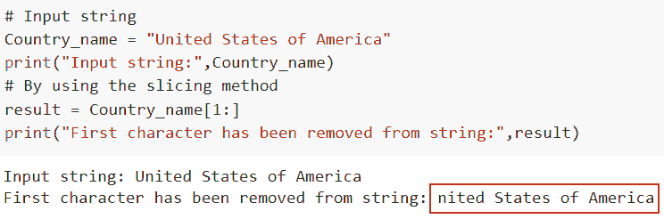

# 如何在 Python 中删除字符串的第一个字符

> 原文：<https://pythonguides.com/remove-first-character-from-a-string-in-python/>

[](https://sharepointsky.teachable.com/p/python-and-machine-learning-training-course)

在这个 Python 教程中，我们将讨论如何以不同的方式从 Python 中的字符串中移除第一个字符。考虑到 Python 字符串是不可变的，这意味着它不能被改变。

1.  使用 python 中的切片方法移除字符串的第一个字符
2.  使用 python 中的 replace 方法移除字符串的第一个字符
3.  使用 python 中的 lstrip()方法移除字符串的第一个字符
4.  使用 python 中的 translate 方法移除字符串的第一个字符
5.  使用 python 中的 regex 方法移除字符串的第一个字符
6.  使用 python 中的 split 函数移除字符串的第一个字符
7.  使用 python 中的连接和列表理解方法移除字符串的第一个字符
8.  如何从 Python 熊猫字符串中删除第一个字符
9.  如何在 Python 中删除字符串的第一个 n 字符
10.  如何移除列表中字符串的第一个字符

目录

[](#)

*   [使用 python 中的切片方法删除字符串的第一个字符](#Remove_first_character_from_a_string_using_the_slicing_method_in_python "Remove first character from a string using the slicing method in python")
*   [使用 python 中的 replace 方法删除字符串的第一个字符](#Remove_the_first_character_from_a_string_using_replace_method_in_python "Remove the first character from a string using replace method in python")
*   [使用 python 中的 lstrip()方法删除字符串的第一个字符](#Remove_the_first_character_from_a_string_using_the_lstrip_method_in_python "Remove the first character from a string using the lstrip() method in python")
*   [使用 python 中的 translate 方法删除字符串的第一个字符](#Remove_the_first_character_from_a_string_using_the_translate_method_in_python "Remove the first character from a string using the translate method in python")
*   [使用 python 中的 regex 方法删除字符串的第一个字符](#Remove_the_first_character_from_a_string_using_the_regex_method_in_python "Remove the first character from a string using the regex method in python")
*   [使用 python 中的 split 函数删除字符串的第一个字符](#Remove_the_first_character_from_a_string_using_the_split_function_in_python "Remove the first character from a string using the split function in python")
*   [使用 python 中的连接和列表理解方法删除字符串的第一个字符](#Remove_the_first_character_from_a_string_using_the_join_and_list_comprehension_method_in_python "Remove the first character from a string using the join and list comprehension method in python")
*   [如何从 Python Pandas 字符串中删除第一个字符](#How_to_remove_the_first_character_from_the_string_Python_Pandas "How to remove the first character from the string Python Pandas")
*   [如何在 Python 中删除字符串的第一个 n 字符](#How_to_remove_the_first_n_character_from_a_string_in_Python "How to remove the first n character from a string in Python")
*   [如何删除列表中字符串的第一个字符](#How_to_remove_the_first_character_from_a_string_in_a_list "How to remove the first character from a string in a list")

## 使用 python 中的切片方法删除字符串的第一个字符

*   在这个例子中，我们将讨论如何使用切片方法在 Python 中删除字符串的第一个字符。
*   切片技术可用于从 Python 字符串中移除第一个字符，生成的字符串将没有第一个字符。通过使用切片 **[1:]** ，我们将获得除第一个字符之外的剩余字符串。

**举例**:

让我们举一个例子，看看如何使用切片方法从 Python 中删除字符串的第一个字符。

```py
**# Input string**
Country_name = "United States of America"
print("Input string: ", Country_name)

**# By using the slicing method**
result = Country_name[1:]
print("First character has been removed from string: ", result)
```

在下面给出的代码中，我们将首先创建一个名为 country_name 的输入字符串，其中我们将字符串值赋给美利坚合众国(USA)。

现在我们要删除第一个字符**‘U’**，为此我们将使用 **str[:1]** 的概念，并获取除第一个字符之外的剩余字符串。

你可以参考下面的截图



How to remove the first character from a string in Python

这是如何使用切片方法从 Python 中删除字符串的第一个字符。

阅读[如何用 Python 从列表中获取字符串值](https://pythonguides.com/how-to-get-string-values-from-list-in-python/)

## 使用 python 中的 replace 方法删除字符串的第一个字符

*   在本节中，我们将了解如何使用 `replace()` 方法从 Python 中删除字符串的第一个字符。
*   在 Python 中用新字符替换单个字符时，使用 `replace()` 方法，这个方法将产生一个字符串的副本，用另一个子字符串替换一个子字符串的每个实例。
*   在这个例子中，如果我们想从字符串中删除第一个字符，那么我们必须提到第二个参数是一个空字符串。

**语法**:

让我们看一下语法并理解 Python 中的 `str.replace()` 方法的工作原理。

```py
str.replace(old,  new, count)
```

*   它由几个参数组成
    *   `old` :-该参数定义了将要被替换的字符串。
    *   `new` :用新值(一个字符或字符串)替换现有值。
    *   `count` :-一个整数值，表示要用新字符或子串替换多少个旧字符或子串。这是一个可选参数。

**举例**:

这里我们将举一个例子，检查如何使用 `replace()` 方法从 Python 中删除字符串的第一个字符。

**源代码** :-

```py
**# Input string**
state_name_in_USA = 'Alaska'

**# Using replace() method**
result= state_name_in_USA.replace('A', '')

**# Display the content**
print(result)
```

在上面的例子中，我们使用了 `str.replace()` 函数，在这个函数中，我们提到了旧字符**‘A’**，并用一个新字符替换了它，但是在这种情况下，我们必须删除这个字符，所以第二个参数将是一个空字符串。

下面是以下给定代码的实现


How to remove the first character from a string in Python using replace

正如你在截图中看到的，我们已经讨论了如何使用 `replace()` 方法从 Python 中删除字符串的第一个字符。

读取 [Python 按空格分割字符串](https://pythonguides.com/python-split-string-by-space/)

## 使用 python 中的 lstrip()方法删除字符串的第一个字符

*   这里我们将了解如何使用 `str.lstrip()` 方法在 Python 中移除字符串的第一个字符。
*   在移除作为输入提供的前导字符后， `lstrip()` 方法返回字符串的副本。如果没有给定参数，默认情况下会删除前导空格。

下面的示例代码展示了如何使用 `str.lstrip()` 方法删除字符串的开头字符。

**源代码** :-

```py
**# Input String**
Cars_in_USA = "Ford F-150, Chevrolet Silverado 1500"
print("Input string:",Cars_in_USA)

**# By using the lstrip()**
result = Cars_in_USA.lstrip("F")

**# Display the Content**
print("Remove first character:",result)
```

在下面给定的代码中，我们首先声明了一个变量**‘Cars _ in _ USA’**，然后分配美国最高的汽车。现在我们想要删除第一个字符，我们将使用 `lstrip()` 函数，在这个函数中，我们将第一个字符传递给它，我们想要从输入字符串中删除它。

下面是以下代码的截图


How to remove the first character from a string in Python using the lstrip() method

这就是我们如何使用 lstrip 方法从 Python 中删除字符串的第一个字符。

读取字符串中的 [Python 查找数字](https://pythonguides.com/python-find-number-in-string/)

## 使用 python 中的 translate 方法删除字符串的第一个字符

*   在本节中，我们将了解如何使用 `translate()` 方法从 Python 中删除字符串的第一个字符。
*   Python 的 `translate()` 函数用于返回一个字符串，字符串中的每个字符都被映射到翻译表中相应的位置。
*   要从结果字符串中删除一个字符，我们必须给出该字符的 Unicode 码位和单词**“None”**作为替换。为了确定字符的 Unicode 码位，我们可以利用 `ord()` 方法。

**语法**:

下面是 Python 中 `string.translate()` 函数的语法。

```py
string.translate(table)
```

注意:这个参数只接受一个参数，并定义一个转换表来存储两个字符之间的映射。

**举例**:

让我们举一个例子，看看如何使用 `translate()` 方法从 Python 中删除字符串的第一个字符

```py
**# Input string**
cities_of_USA = 'New York, Los Angeles, California'
print("Original string:",cities_of_USA)

**# Using the translate() method**
result= cities_of_USA.translate({ord('N'): None})
print("First character removed:",result)
```

下面是以下给定代码的执行过程


How to remove the first character from a string in Python using the translate method

在这个例子中，我们已经了解了如何使用 translate 方法从 Python 中删除字符串的第一个字符。

## 使用 python 中的 regex 方法删除字符串的第一个字符

*   既然我们已经介绍了 `slicing()` 和 `str.lstrip()` 方法，那么是时候看看 python 中的 regex()函数了。regex 模块的' re '类具有函数`re sub()`。也可以使用它来删除初始字符。
*   Re.sub()用替换的值创建一个字符串，代表子串。当我们应用这个函数时，我们可以替换几个元素，它将替换所有匹配正则表达式的字符。

**语法**:

让我们看一下语法并理解 Python 中的`re sub()`方法的工作原理。

```py
re.sub(pattern, repl, string, count=0, flags=0)
```

*   它由几个参数组成
    *   **模式**:该参数定义了我们想要替换的字符串/模式。
    *   `repl` :该参数用于定义替换花样的花样。
    *   `Count` :默认情况下，取值为 0，它定义了应该发生的替换次数。

**举例**:

这里我们将举一个例子，看看如何在 Python 中删除字符串的第一个字符。

**源代码**:

```py
import re
**# input string**
Country_name = "U.S.A, Australia, Belgium"

**# By using the re.sub() method**
result = re.sub(r'.', '', Country_name, count = 1)

**# Display the content**
print(result)
```

因此，我们将首先导入 re 库来验证这个函数，它在 re 模块中，然后，我们生成一个字符串。

然后执行`re()`命令，并在其中传递参数字符串和计数。这里，我们利用表达式**“计数= 1”**来表示字符删除。

你可以参考下面的截图


How to remove the first character from a string in Python using the regex method

这就是我们如何使用 regex 方法从 Python 中删除字符串的第一个字符。

读取 [Python 字符串以列出](https://pythonguides.com/python-string-to-list/)

## 使用 python 中的 split 函数删除字符串的第一个字符

*   在这个例子中，我们将讨论如何使用 `split()` 函数从 Python 中删除字符串的第一个字符。
*   这个函数用于在给定的字符串被指定的分隔符分割后，将字符串分割成子字符串。
*   此参数采用两个参数，并指定分隔符和最大拆分。它将在分割输入字符串后返回一个字符串列表。

**举例**:

```py
Bikes_in_USA = 'Aprilia, Kawasaki, Ducati'
print("Input string:",Bikes_in_USA)
**#Using the split() function**

result= Bikes_in_USA.split("A")
print("First character remove from string:",result)
```

你可以参考下面的截图


How to remove the first character from a string in Python using the split function

这就是如何使用 split 函数从 Python 中删除字符串的第一个字符

## 使用 python 中的连接和列表理解方法删除字符串的第一个字符

*   在这一节中，我们将讨论如何使用 list comprehension 和 `join()` 方法从 Python 中删除字符串的第一个字符。
*   使用 Python 中的 `join()` 方法将一个字符串和一个 iterable 对象连接起来。它返回一个产品字符串，该字符串组合了 iterable 中的所有字符串。
*   通过使用 list comprehension 和 join 方法，我们可以很容易地将每个 string 元素拆分成相关的 list 元素，然后将它们连接起来以声明一个新的 string。

**举例**:

```py
Country_name = "U.S.A, Germany, Australia"
 print ("Input string: ", Country_name)

**# By using the join() method** 
output = ''.join([Country_name [i] for i in range(len(Country_name )) if i != 0]) 

**# Display the Content** 
print ("First character remove from string: ",output) 
```

在下面给出的代码中，我们首先创建了一个名为**“Country _ name”**的输入字符串，并在其中指定了国家名称。接下来，我们使用了 `join()` 方法并用一个设定的条件迭代这些值，如果 **i！=0** ，它将从字符串中删除第一个字符。

下面是以下给定代码的执行过程


How to remove the first character from a string in Python using the join method

正如你在截图中看到的，我们已经讨论了如何使用连接和列表理解方法从 Python 中删除字符串的第一个字符。

阅读[从字符串 Python 中移除字符](https://pythonguides.com/remove-character-from-string-python/)

## 如何从 Python Pandas 字符串中删除第一个字符

*   这里我们将讨论如何在 Python Pandas 中删除字符串的第一个字符。
*   为了执行这个特定的任务，我们将使用切片方法。切片技术可用于从 Python 字符串中删除第一个字符，生成的字符串将没有第一个字符。通过使用切片 **[1:]** ，我们将获得除第一个字符之外的剩余字符串。

**举例:**

让我们举一个例子，看看如何在 Python Pandas 中删除字符串的第一个字符

```py
import pandas as pd

df = pd.DataFrame({"Country_name":["U.S.A"]})
df
df["Country_name"].str[1:]
```

在上面的代码中，我们首先导入了 Pandas 库，然后使用 `pd.dataframe()` 创建了一个 dataframe，在这个函数中，我们指定了 country_name。接下来，我们使用切片方法，将从字符串中删除第一个字符。

你可以参考下面的截图


How to remove the first character from the string Python Pandas

这就是如何在 Python Pandas 中删除字符串的第一个字符。

## 如何在 Python 中删除字符串的第一个 n 字符

*   在这一节中，我们将讨论如何在 Python 中删除字符串的第一个 n 字符。
*   如果您想从字符串中删除前 n 个字符，那么从第`n`个索引开始并在末尾结束对字符串进行切片。如果从第 n 个索引到末尾对字符串进行切片，则字符串的前 n 个字符将被删除，因为字符串中的字符是从零开始索引的。

**举例**:

下面是一个例子，我们将了解如何在 Python 中删除字符串的第一个 n 字符。

```py
**# Input string**
Country_name = "United States of America"
print("Input string:",Country_name)

**# By using the slicing method**
result = Country_name[5:]
print("First character has been removed from string:",result)
```

在上面的代码中，我们设置 n=5，它将从输入字符串中删除前 5 个字符。

下面是以下给定代码的实现


How to remove the first n character from a string in Python

这是如何在 Python 中删除字符串的第一个 n 字符。

阅读[如何在 Python 中创建字符串](https://pythonguides.com/create-a-string-in-python/)

## 如何删除列表中字符串的第一个字符

*   在这个例子中，我们将了解如何从 Python 列表中的每个字符串中删除第一个字符。
*   在 Python 中用新字符替换单个字符时，使用 `replace()` 方法，这个方法将产生一个字符串的副本，用另一个子字符串替换一个子字符串的每个实例。
*   在这个例子中，如果我们想删除列表中字符串的第一个字符，然后使用 for 循环方法迭代这些值。

示例:

这里我们将举一个例子，看看如何从 Python 列表中删除字符串的第一个字符。

```py
cities_in_USA = ['New York', 'Los Angeles', 'Chicago', 'Houston']

**# Display original list**
print("Input list : ", cities_in_USA)

new_output = []
for m in cities_in_USA:
	m=m.replace(m[0],"",1)
	new_output.append(m)

**# Display the result**
print("First character has been removed from list :", new_output)
```

下面是以下代码的截图


How to remove the first character from each string in a list

这就是如何从列表中的每个字符串中删除第一个字符。

本文基于如何从 Python 字符串中删除第一个字符。已经提出了七种不同的方法，所有的方法都非常简单易懂。

*   使用 python 中的切片方法移除字符串的第一个字符
*   使用 python 中的 replace 方法移除字符串的第一个字符
*   使用 python 中的 lstrip()方法移除字符串的第一个字符
*   使用 python 中的 translate 方法移除字符串的第一个字符
*   使用 python 中的 regex 方法移除字符串的第一个字符
*   使用 python 中的 split 函数移除字符串的第一个字符
*   使用 python 中的连接和列表理解方法移除字符串的第一个字符
*   如何从 Python 熊猫字符串中删除第一个字符
*   如何在 Python 中删除字符串的第一个 n 字符
*   如何移除列表中字符串的第一个字符

您可能会喜欢以下 Python 教程:

*   [Python 从字符串中移除子串](https://pythonguides.com/python-remove-substring-from-a-string/)
*   [如何在 Python 中将集合转换成列表](https://pythonguides.com/convert-a-set-to-a-list-in-python/)
*   [Python 替换文件中的字符串](https://pythonguides.com/python-3-string-replace/)
*   [Python 比较字符串](https://pythonguides.com/python-compare-strings/)
*   [Python 3 字符串方法及示例](https://pythonguides.com/string-methods-in-python/)
*   [Python 在字符串中查找子串](https://pythonguides.com/python-find-substring-in-string/)

[Arvind](https://pythonguides.com/author/arvind/)

Arvind 目前是 TSInfo Technologies 的高级 Python 开发人员。他精通 Python 库，如 NumPy 和 Tensorflow。