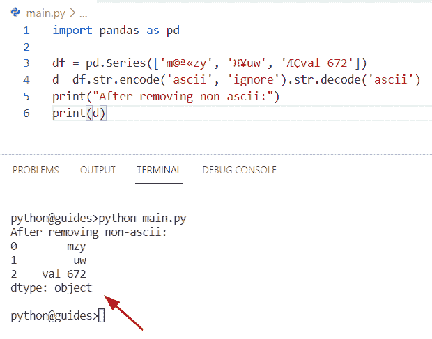
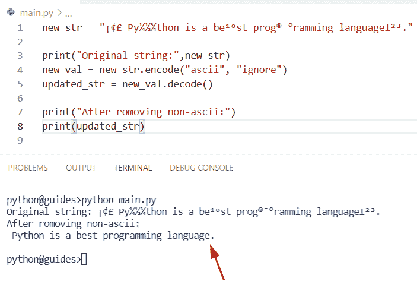
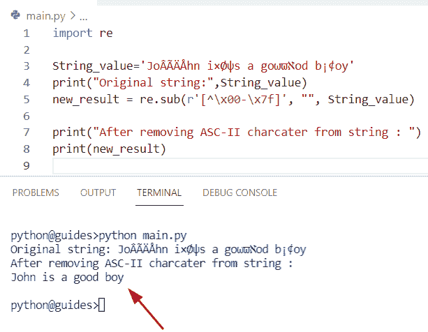
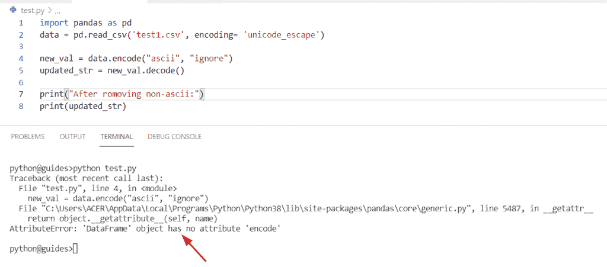
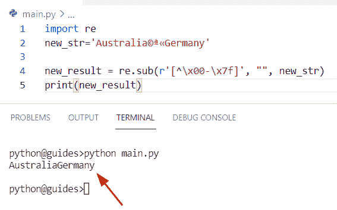
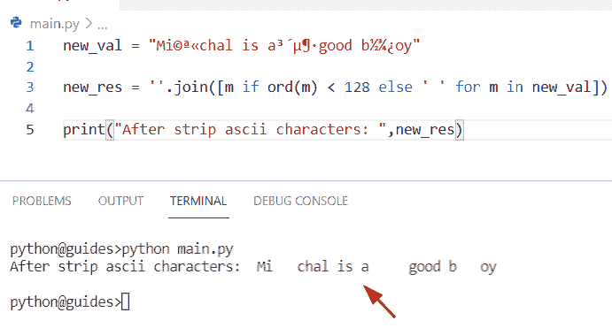
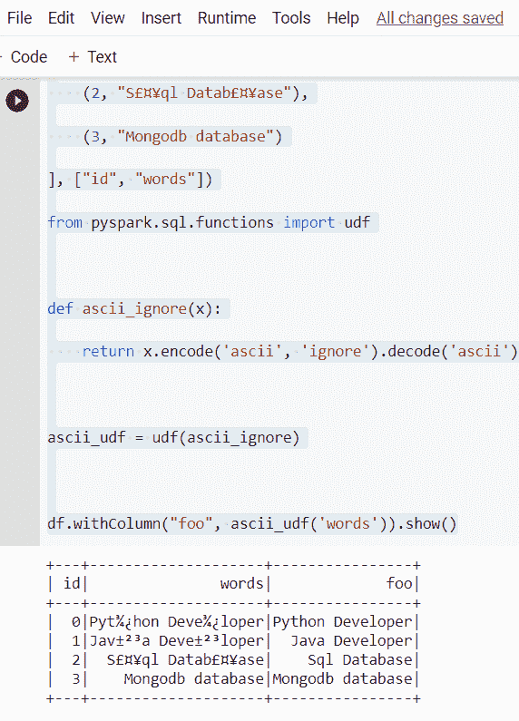
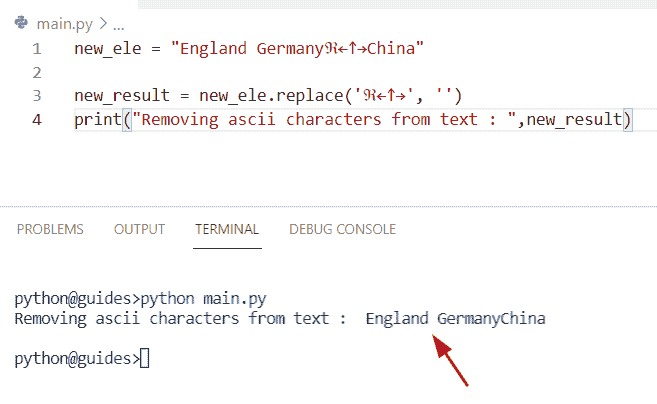
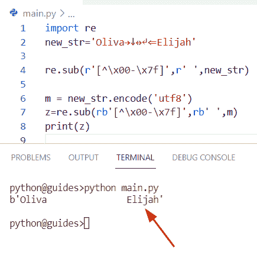

# 移除非 ASCII 字符 Python

> 原文：<https://pythonguides.com/remove-non-ascii-characters-python/>

[](https://sharepointsky.teachable.com/p/python-and-machine-learning-training-course)

这篇 [Python 教程](https://pythonguides.com/python-hello-world-program/)讲的都是“**去除非 ASCII 字符 Python** ”。我们将会看到，如何用各种例子来删除 Python 中的非 ASCII 字符。

此外，我们将涵盖这些主题。

*   移除非 ASCII 字符 Python 熊猫
*   移除非 ASCII 字符 Python
*   移除非 ASCII 字符 Python 正则表达式
*   从 CSV Python 中移除非 ASCII 字符
*   从文件 Python 中移除非 ASCII 字符
*   去掉非 ASCII 字符 Python
*   Pyspark 替换非 ASCII 字符 Python
*   从文本 Python 中移除非 ASCII 字符
*   Python 从字节中删除了非 ASCII 字符

ASCII 代表**美国信息交换标准码**。美国键盘上的所有关键字都有一些 ASCII 码。非 ASCII 码大多出现在不同国家的地区语言中。

例如，中文、日文、印度文等属于非 ASCII 字符。在本教程中，我们将学习如何删除 python 中的非 ASCII 字符。

您可能想知道非 ASCII 字符是什么样子的。这是非 ASCII 字符的例子。

```py
¡¢£¤¥¦§¨©ª«¬®¯°±²³´µ¶·¸¹º»¼½¾¿ÀÁÂÃÄÅÆÇËÎÐÖÑ×Øψϑωϖℵℜ←↑→↓↔↵⇐⇑⇒⇓⇔∀
```

目录

[](#)

*   [删除非 ASCII 字符 Python 熊猫](#Remove_Non_ASCII_Characters_Python_Pandas "Remove Non ASCII Characters Python Pandas")
*   [删除非 ASCII 字符 Python](#Remove_Non_ASCII_Characters_Python "Remove Non ASCII Characters Python")
*   [删除非 ASCII 字符 Python Regex](#Remove_Non_ASCII_Characters_Python_Regex "Remove Non ASCII Characters Python Regex")
*   [从 CSV Python 中删除非 ASCII 字符](#Remove_Non_ASCII_Characters_From_CSV_Python "Remove Non ASCII Characters From CSV Python")
*   [剥离非 ASCII 字符 Python](#Strip_Out_Non_ASCII_Characters_Python "Strip Out Non ASCII Characters Python")
*   [如何剥离 Python 中的非 ASCII 字符](#How_to_strip_out_Non-ASCII_characters_in_Python "How to strip out Non-ASCII characters in Python")
*   [Pyspark 替换非 ASCII 字符 Python](#Pyspark_Replace_Non_ASCII_Characters_Python "Pyspark Replace Non ASCII Characters Python")
*   [从文本 Python 中删除非 ASCII 字符](#Remove_Non-ASCII_Characters_From_Text_Python "Remove Non-ASCII Characters From Text Python")
*   [Python 从字节中删除非 ASCII 字符](#Python_Remove_Non-ASCII_Characters_From_Bytes "Python Remove Non-ASCII Characters From Bytes")

## 删除非 ASCII 字符 Python 熊猫

*   在这一节中，我们将学习如何删除 [Python pandas](https://pythonguides.com/pandas-in-python/) 中的非 ASCII 字符。
*   通过使用编码和解码功能，我们可以很容易地从 Pandas 数据帧中移除非 ASCII 字符。在 Python 中， `encode()` 函数用于使用给定的编码对字符串进行编码，解码意味着将一串字节转换成 Unicode 字符串。

**源代码:**

```py
import pandas as pd

df = pd.Series(['m©ª«zy', '¤¥uw', 'ÆÇval 672'])
d= df.str.encode('ascii', 'ignore').str.decode('ascii')
print("After removing non-ascii:")
print(d)
```

在上面的代码中，我们首先导入了 Pandas 库，然后创建了一个数据帧，在其中我们分配了一些字符和非 ASCII 字符。

现在应用 `encode()` 函数，它将帮助用户将字符串编码成**‘ASCII’**，还将错误作为**‘忽略’**传递，以移除非 ASCII 字符。

下面是以下给定代码的执行过程



Remove Non-ASCII Characters Python Pandas

阅读[如何将 Python 数据帧转换成 JSON](https://pythonguides.com/how-to-convert-python-dataframe-to-json/)

## 删除非 ASCII 字符 Python

*   在本期节目中，我们将讨论**如何去除 Python 3** 中的非 ASCII 字符。
*   这里我们可以应用方法 `str.encode()` 从字符串中删除非 ASCII 字符。要执行这项任务，首先创建一个简单的字符串，并在其中分配多个字符，就像非 ASCII 字符一样。现在，首先我们将应用 encode()方法将字符串编码为 ASCII，然后使用 decode()方法帮助用户将字节字符串转换为新字符串。

**举例:**

```py
new_str = "¡¢£ Py¼½¾thon is a be¹ºst prog®¯°ramming language±²³."

print("Original string:",new_str)
new_val = new_str.encode("ascii", "ignore")
updated_str = new_val.decode()

print("After romoving non-ascii:")
print(updated_str)
```

你可以参考下面的截图



Remove Non-ASCII Characters Python

阅读[如何在 Pandas 中把浮点数转换成整数](https://pythonguides.com/convert-floats-to-integer-in-pandas/)

## 删除非 ASCII 字符 Python Regex

*   让我们看看**如何在 Python Regex** 中移除非 ASCII 字符。
*   在这个程序中，我们将看到如何使用正则表达式从字符串中删除非 ASCII 字符。在 Python 中，正则表达式可用于在字符串中搜索模式。在 Python 中， **'re'** 模块提供了在程序中使用正则表达式的支持。

**源代码:**

```py
import re

String_value='JoÂÃÄÅhn i×Øψs a goωϖℵod b¡¢oy'
print("Original string:",String_value)
new_result = re.sub(r'[^\x00-\x7f]', "", String_value)

print("After removing ASC-II charcater from string : ")
print(new_result)
```

在上面的代码中，我们先导入 re 模块，然后在名为 **'String_value'** 的变量中创建一个字符串。

现在我们将使用函数`re sub()`从字符串中删除非 ASCII 字符，并将结果存储在输出变量**‘new _ result’**中。

一旦打印了' **new_result'** ,输出将显示更新后的字符串。

下面是以下给定代码的输出



Remove Non-ASCII Characters Python Regex

阅读 [Python 将二进制转换成十进制](https://pythonguides.com/python-convert-binary-to-decimal/)

## 从 CSV Python 中删除非 ASCII 字符

*   在这一节中，我们将学习如何在 Python 中从 CSV 文件中移除非 ASCII 字符。
*   这里我们可以看到如何**删除 CSV 文件**中的非 ASCII 字符。为了完成这个任务，我们将应用 Pandas 方法，并在数据帧中使用 `encode()` 方法。

**源代码:**

```py
import pandas as pd
data = pd.read_csv('test1.csv', encoding= 'unicode_escape')

new_val = data.encode("ascii", "ignore")
updated_str = new_val.decode()

print("After romoving non-ascii:")
print(updated_str) 
```



Remove Non-ASCII Characters From CSV Python

正如您在屏幕截图中看到的，作为特定非 ASCII 字符的输出没有从 CSV 文件中删除，因为数据帧没有属性，并且在 CSV 文件模式下不会更新。

查看，[如何在 Python 中获得前 N 行熊猫数据帧](https://pythonguides.com/get-first-n-rows-of-pandas-dataframe/)

## 剥离非 ASCII 字符 Python

*   这里我们可以看到如何在 Python 中去除 ASCII 字符。
*   在这个例子中，我们将使用. sub()方法，在这个方法中，我们分配了一个标准代码 **'[^\x00-\x7f]'** ，这个代码表示 0-127 ASCII 码之间的值，这个方法包含输入字符串**‘new _ str’**。一旦您将打印**‘new _ result’**，那么输出将显示新的字符串，并且其中不包含任何非 ASCII 字符。

**源代码:**

```py
import re
new_str='Australia©ª«Germany'

new_result = re.sub(r'[^\x00-\x7f]', "", new_str)
print(new_result)
```

下面是以下给定代码的输出



Strip Out Non-ASCII Characters Python

读取 [Python 文件中的字数](https://pythonguides.com/python-count-words-in-file/)

## 如何剥离 Python 中的非 ASCII 字符

在这个程序中，我们将结合使用 ord()和 for 循环方法来删除字符串中的非 ASCII 字符。

在 Python 中， `ord()` 方法只接受单个字符，这个方法将帮助用户检查一个字符串是否包含单个 Unicode 字符。

**举例:**

```py
new_val = "Mi©ª«chal is a³´µ¶·good b½¾¿oy"

new_res = ''.join([m if ord(m) < 128 else ' ' for m in new_val])

print("After strip ascii characters: ",new_res)
```

在上面的代码中，我们首先创建了一个字符串**‘new _ val’**，并为它们分配了非 ASCII 字符。

现在我们将在 ord()方法中使用 `join()` 函数。正如您在下面的屏幕截图中看到的，非 ASCII 字符从新字符串中删除后的输出。

你可以参考下面的截图



Strip Out Non-ASCII Characters Python

阅读[熊猫用 0 替换 nan](https://pythonguides.com/pandas-replace-nan-with-0/)

## Pyspark 替换非 ASCII 字符 Python

*   在本节中，我们将学习如何在 pyspark python 中替换非 ASCII 字符。
*   在 Python 中，如果您想使用 Apache Spark 运行应用程序，那么我们将应用 Pyspark 库，例如，如果您正在使用 Python 应用程序处理大数据集，那么 Pyspark 是解决这个问题的最佳方式，它比 Pandas 库更快。
*   在本例中，我们导入了 Pyspark 模块，首先使用 pyspark.row 库来表示 DataFrame 中的一行数据。现在，我们将使用 spark 上下文和 spark 会话来创建数据帧。

**源代码:**

```py
from pyspark.sql import Row

from pyspark.context import SparkContext
from pyspark.sql.session import SparkSession
sc = SparkContext('local')
spark = SparkSession(sc)
df = spark.createDataFrame([

    (0, "Pyt¾¿hon Deve¾¿loper"),

    (1, "Jav±²³a Deve±²³loper"),

    (2, "S£¤¥ql Datab£¤¥ase"),

    (3, "Mongodb database")

], ["id", "words"])

from pyspark.sql.functions import udf

def ascii_ignore(x):

    return x.encode('ascii', 'ignore').decode('ascii')

ascii_udf = udf(ascii_ignore)

df.withColumn("foo", ascii_udf('words')).show()
```

在上面的代码中，我们首先使用 spark.createDataFrame 创建了一个 Dataframe 对象，并在其中分配了非 ASCII 字符。

现在使用 `UDF` (用户自定义函数)，它用于在 Spark 中创建一个可重用的方法。

下面是以下给定代码的执行过程



Pyspark Replace Non-ASCII Characters Python

阅读[如何用 Python 将 Pandas 数据帧转换成 NumPy 数组](https://pythonguides.com/convert-pandas-dataframe-to-numpy-array/)

## 从文本 Python 中删除非 ASCII 字符

*   在这一节中，我们将学习如何用 Python 从文本中删除非 ASCII 字符。
*   这里我们可以使用 `replace()` 方法从字符串中删除非 ASCII 字符。在 Python 中，str.replace()是一个内置函数，这个方法将帮助用户用新的或空的字符串替换旧的字符。

**源代码:**

```py
new_ele = "England Germanyℜ←↑→China"

new_result = new_ele.replace('ℜ←↑→', '')
print("Removing ascii characters from text : ",new_result)
```

在上面的代码中，我们首先创建了一个字符串“new_ele ”,然后使用 `str.replace()` 方法用空格替换特定的非 ASCII 字符。

一旦您打印了**‘new _ result’**，那么输出将显示删除了所有非 ASCII 字符的新字符串。

下面是以下给定代码的实现



Remove Non-ASCII Characters from Text Python

阅读[如何在 Python 数据帧中找到重复项](https://pythonguides.com/how-to-find-duplicates-in-python-dataframe/)

## Python 从字节中删除非 ASCII 字符

*   在这一节中，我们将学习如何在 Python 中从字节中删除非 ASCII 字符。
*   让我们看看如何在 `encode()` 函数中使用字节码从字符串中删除非 ASCII 字符。

**源代码:**

```py
import re
new_str='Oliva→↓↔↵⇐Elijah'

re.sub(r'[^\x00-\x7f]',r' ',new_str)  

m = new_str.encode('utf8')
z=re.sub(rb'[^\x00-\x7f]',rb' ',m) 
print(z)
```

下面是以下代码的截图



Python Remove Non-ASCII Characters From Bytes

您可能会喜欢以下 Python 教程:

*   [Python 中的乘法与例题](https://pythonguides.com/multiply-in-python/)
*   [删除 Python 中字符串的第一个字符](https://pythonguides.com/remove-first-character-from-a-string-in-python/)
*   [Python 中的字符串索引超出范围](https://pythonguides.com/indexerror-string-index-out-of-range-python/)
*   [Python 查找列表中元素的索引](https://pythonguides.com/python-find-index-of-element-in-list/)
*   [使用 python 从 URL 下载 zip 文件](https://pythonguides.com/download-zip-file-from-url-using-python/)
*   [Python 对于基数为 10 的 int()无效文字](https://pythonguides.com/python-invalid-literal-for-int-with-base-10/)
*   [删除 python 中的 Unicode 字符](https://pythonguides.com/remove-unicode-characters-in-python/)
*   [Python 中的注释行](https://pythonguides.com/comment-lines-in-python/)

在本教程中，我们学习了如何在 python 中**移除非 ASCII 字符。此外，我们已经讨论了这些主题。**

*   移除非 ASCII 字符 Python 熊猫
*   移除非 ASCII 字符 Python
*   移除非 ASCII 字符 Python 正则表达式
*   从 CSV Python 中移除非 ASCII 字符
*   从文件 Python 中移除非 ASCII 字符
*   去掉非 ASCII 字符 Python
*   Pyspark 替换非 ASCII 字符 Python
*   从文本 Python 中移除非 ASCII 字符
*   Python 从字节中删除了非 ASCII 字符

[Bijay Kumar](https://pythonguides.com/author/fewlines4biju/)

Python 是美国最流行的语言之一。我从事 Python 工作已经有很长时间了，我在与 Tkinter、Pandas、NumPy、Turtle、Django、Matplotlib、Tensorflow、Scipy、Scikit-Learn 等各种库合作方面拥有专业知识。我有与美国、加拿大、英国、澳大利亚、新西兰等国家的各种客户合作的经验。查看我的个人资料。

[enjoysharepoint.com/](https://enjoysharepoint.com/)[](https://www.facebook.com/fewlines4biju "Facebook")[](https://www.linkedin.com/in/fewlines4biju/ "Linkedin")[](https://twitter.com/fewlines4biju "Twitter")