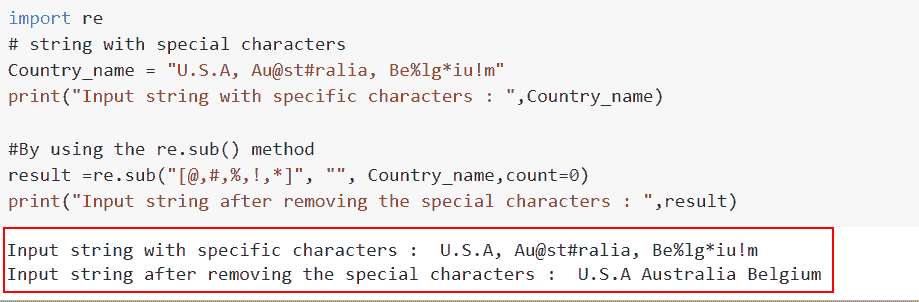

# 在 Python 中从字符串中移除特定字符

> 原文：<https://pythonguides.com/remove-specific-character-from-string-in-python/>

[](https://sharepointsky.teachable.com/p/python-and-machine-learning-training-course)

在本 [Python 教程](https://pythonguides.com/python-hello-world-program/)中，我们将讨论**如何以不同的方式从 Python** 中的字符串中移除特定字符。Python 有内置函数，允许您删除字符串中的每个特殊字符。以下是我们将要讨论的话题。

*   如何使用 `isalpha()` 函数在 Python 中删除字符串中的特定字符
*   如何在 Python 中使用正则表达式方法从字符串中移除特定字符
*   如何使用 isdecimal()函数在 Python 中删除字符串中的特定字符
*   如何使用 translate 函数在 Python 中移除字符串中的特定字符
*   如何使用 filter()方法在 Python 中移除字符串中的特定字符
*   如何使用连接和列表理解方法在 Python 中删除字符串中的特定字符

目录

[](#)

*   [在 Python 中使用 isalpha()函数从字符串中删除特定字符](#Remove_a_specific_character_from_a_string_in_Python_using_isalpha_function "Remove a specific character from a string in Python using isalpha() function")
*   [使用 Python 中的正则表达式从字符串中删除特定字符](#Remove_a_specific_character_from_a_string_using_regular_expression_in_Python "Remove a specific character from a string using regular expression in Python")
*   [如何使用 isdecimal()](#How_to_remove_a_specific_character_from_a_string_in_Python_using_isdecimal "How to remove a specific character from a string in Python using isdecimal()") 在 Python 中移除字符串中的特定字符
*   [使用 translate()](#Remove_a_specific_character_from_a_string_in_Python_using_translate "Remove a specific character from a string in Python using translate()") 在 Python 中删除字符串中的特定字符
*   [如何使用 filter()方法在 Python 中删除字符串中的特定字符](#How_to_remove_a_specific_character_from_a_string_in_Python_using_filter_method "How to remove a specific character from a string in Python using filter() method")
*   [使用连接和列表理解方法从 Python 中的字符串中删除特定字符](#Remove_a_specific_character_from_a_string_in_Python_using_join_and_list_comprehension_method "Remove a specific character from a string in Python using join and list comprehension method")

## 在 Python 中使用 isalpha()函数从字符串中删除特定字符

*   如果字符串中的所有字符都是字母或数字， `string.isalnum()` 方法返回 True 否则，它返回 False。
*   `isalnum()` 如果字符串包含一个或多个与以下任何组都不匹配的字符，则返回 False。
*   现在，在这个例子中，我们可以很容易地使用 `isalnum()` 函数来删除 Python 中一个字符串的所有特定字符。

**语法**:

让我们看一下语法，理解如何在 Python 中从字符串中删除特定的字符。

```py
str.isalnum()
```

> **注意**:这个函数不包含任何参数，它总是返回 false 或 true。

**举例**:

让我们举一个例子，看看如何通过使用 `str.isalnum()` 方法从 Python 中删除字符串中的特定字符。

```py
**#Input string**
Country_name = "Unit$ed S@tates o!f Amer^ica"

**# By using the str.isalpha() function**
result="".join(m for m in Country_name if m.isalpha())

**# Display the new string**
print (result) 
```

在上面的例子中，列表中的所有条目都被连接起来，生成一个字符串。加入”功能。这里我们使用输入字符串作为国家名称“Unit$ed S@tates o！f Amer^ica”，现在想要删除输入字符串中所有可用的特定字符。

为此，我们使用了 `m.isalpha()` 函数，它将从字符串中删除所有特定的字符。

下面是以下给定代码的实现


How to remove a specific character from a string by using the isalpha function

这就是我们如何使用 isalpha 函数从字符串中删除特定的字符。

阅读:[用 Python 乘法并举例](https://pythonguides.com/multiply-in-python/)

## 使用 Python 中的正则表达式从字符串中删除特定字符

*   为了创建可用于搜索字符串中特殊字符的模式，使用了正则表达式。Python 要求在使用正则表达式之前导入重新打包。
*   在 Python 中从字符串中移除特殊字符时，会使用该属性。重新打包后，我们可以通过多种方式使用正则表达式。Python 的`re sub()`方法可以用来消除字符串中的特殊字符。
*   当我们应用这个函数时，我们可以替换特定的元素，它将替换所有匹配正则表达式的字符。

**语法**:

让我们看一下语法并理解 Python 中的`re sub()`方法的工作原理。

```py
re.sub(pattern, repl, string, count=0, flags=0)
```

*   它由几个参数组成
    *   **模式**:该参数定义了我们想要替换的字符串/模式。
    *   `repl` :该参数用于定义替换花样的花样。
    *   `Count` :默认情况下，它取一个 `0` 值，它定义了应该发生的替换次数。

**举例**:

让我们举一个例子，看看如何使用 `re.sub()` 函数从 Python 字符串中删除特殊字符

```py
import re
**# string with special characters** 
Country_name = "U.S.A, Au@st#ralia, Be%lg*iu!m"
print("Input string with specific characters : ",Country_name)

**#By using the re.sub() method** result =re.sub("[@,#,%,!,*]", "", Country_name,count=0)
print("Input string after removing the special characters : ",result)
```

因此，我们将首先导入 re 库来验证 re 模块中的函数，然后，我们生成一个字符串，输入字符串是 Country_name，在该字符串中我们将国家名称分配给它**" U . s . a，Au@st#ralia，Be%lg*iu！m"** 。

现在我们想从字符串中删除特殊字符，为此我们将在`re sub()`函数中创建一个特殊字符列表。

然后执行`re()`命令，并在其中传递参数字符串和计数。这里，我们利用表达式**“计数= 1”**来表示字符删除。

下面是以下给定代码的实现。



How to remove a specific character from a string by using the regular expression method

正如你在截图中看到的，我们已经讨论了如何使用正则表达式方法从字符串中删除特定的字符。

阅读:[解析 Python 时意外的 EOF](https://pythonguides.com/unexpected-eof-python/)

## 如何使用 isdecimal() 在 Python 中移除字符串中的特定字符

*   在本节中，我们将讨论如何使用 `isdecimal()` 函数从字符串中删除特定字符。
*   如果字符串中的每个字符都是十进制字符，则 `isdecimal()` 方法返回 True。如果不是，则返回 False。十进制字符是那些基数为 `10` 的字符。

**语法**:

下面是 Python 中 `isdecimal()` 函数的语法

```py
isdecimal() 
```

**注意**:这个函数不包含任何参数，它总是返回 false 或 true。

**举例**:

让我们举一个例子，看看如何使用 `isdecimal()` 函数从字符串中删除特定的字符。

**源代码**:

```py
**# input string**
new_string ="4@1$#4%5^"

**# By using the str.isdecimal() function**
new_output="".join(i for i in new_string if  i.isdecimal())

**# Display the new_string**
print ("Special characters removed from strings:",new_output)
```

在下面给出的代码中，我们首先导入输入字符串，然后使用 `str.isdecimal()` 函数。它遍历字符串，确定每个字符是否是数字，如果是，则返回该字符。

你可以参考下面的截图。


How to remove a specific character from a string by using the isdecimal function

这是如何使用 Python 中的 isdecimal 函数从字符串中删除特定字符。

阅读: [Python 对于基数为 10 的 int()无效文字](https://pythonguides.com/python-invalid-literal-for-int-with-base-10/)

## 使用 translate() 在 Python 中删除字符串中的特定字符

*   在这里，我们将了解如何使用 Python 中的 translate 函数从字符串中删除特定字符。
*   要从结果字符串中删除一个字符，我们必须给出该字符的 Unicode 码位和单词**“None”**作为替换。为了确定字符的 Unicode 码位，我们可以利用 `ord()` 方法。

**语法**:

下面是 Python 中 `string.translate()` 函数的语法。

```py
string.translate(table)
```

> **注意:**该参数只取一个参数，定义一个存储两个字符之间映射的翻译表。

**举例**:

让我们举一个例子，看看如何使用 `translate()` 方法从 Python 中删除字符串中的特定字符

```py
import string as st
**# Input string**
cities_of_USA = 'New@York, Los#Angeles, Cal$ifornia, Hou*ston, San&Jose'

**# Creating list of special characters**
list_of_specific_char=['@','#','$','*','&']

**# Display the input**
print("Input string : ",cities_of_USA )
new_trans = {special_char: '' for special_char in st.punctuation}

**# By using the maketrans()**
result = str.maketrans(new_trans)
new_str = cities_of_USA .translate(result)
print("Specific characters removed from string : ",new_str)
```

在上面的例子中，我们创建了一个名为 **'cities_of_USA'** 的输入字符串，在这个字符串中，我们指定了位于美国的城市名称。

现在我们必须从字符串中删除特殊字符，为此，我们使用了事务和**标点()**函数。

包含所有特殊字符的字符串称为 ***string .标点()*** 。利用这一点，生成一个以特殊字符为键，以空值为值的字典。

下面是以下给定代码的实现


How to remove a specific character from a string by using the translate function

在这个例子中，我们已经了解了如何使用 translate 函数从字符串中删除特定的字符。

阅读: [Python 检查变量是否为整数](https://pythonguides.com/python-check-if-the-variable-is-an-integer/)

## 如何使用 filter()方法在 Python 中删除字符串中的特定字符

*   在本节中，我们将讨论如何使用 Python 中的 `filter()` 方法从字符串中删除特定字符。
*   `str.isalpha` 方法将被 `filter()` 函数应用于字符串中的每一个元素，如果返回 True，将返回该元素。如果不是，它将忽略该项目。
*   **在**过滤器()**返回一个包含字符串中所有字母的迭代器后，join ()** 函数将用一个空字符串连接迭代器中的所有元素。

**举例**:

让我们举一个例子，看看如何使用 `filter()` 方法从字符串中删除特定的字符

```py
**# Input string**
Bikes_in_USA = 'Ap@ril#ia, Ka$was%aki, Du&ca!ti'

**# By using the filter and isalpha() method**
new_var=filter(str.isalpha,Bikes_in_USA)
result="".join(new_var)
print ("Remove specific characters from string :",result)
```

在下面的代码中，我们首先创建了输入字符串 **Bikes_in_USA = 'Ap@ril#ia，Ka$was%aki，Du & ca！然后使用了**过滤器()**函数，在这个函数中，我们传递了 `str.isalpha` 作为参数。**

你可以参考下面的截图


How to remove a specific character from a string by using the filter method

这就是我们如何使用 Python 中的 filter 方法从字符串中删除特定字符。

读取:[检查一个数字是否是质数](https://pythonguides.com/check-if-a-number-is-a-prime-python/)

## 使用连接和列表理解方法从 Python 中的字符串中删除特定字符

*   在这个例子中，我们将讨论如何通过使用 python 中的连接和列表理解方法从 Python 中的字符串中删除特定字符。
*   通过使用 list comprehension 和 join 方法，我们可以很容易地将每个 string 元素拆分成相关的 list 元素，然后将它们连接起来以声明一个新的 string。

**举例**:

让我们举一个例子，看看如何使用 python 中的连接和列表理解方法从字符串中删除特定的字符。

**源代码**:

```py
**# Input String**
Cars_in_USA = "Te@sla, Toyota, Ford"
print("Input string:",Cars_in_USA)
 **# By using the join() method** 
output = ''.join([Cars_in_USA [i] for i in range(len(Cars_in_USA )) if i != 2]) 

**# Display the Content  ** 
print ("First character remove from string: ",output) 
```

下面是以下给定代码的实现


How to remove a specific character from a string by using the join and list comprehension method in python

另外，看看更多的 Python 教程。

*   [python 中的百分号是什么意思](https://pythonguides.com/percent-sign-mean-in-python/)
*   [Python 中如何在数字前加零](https://pythonguides.com/add-zeros-before-a-number-in-python/)
*   [如何在 Python 中从列表中找到一个字符串](https://pythonguides.com/find-a-string-from-a-list-in-python/)
*   [Python 内置函数示例](https://pythonguides.com/python-built-in-functions/)
*   [Python 语法错误:函数外的“return”](https://pythonguides.com/syntaxerror-return-outside-function-python/)
*   [二分搜索法的 Python 程序](https://pythonguides.com/python-program-for-binary-search/)

在本文中，我们已经讨论了如何以不同的方式从 Python 的字符串中删除特定的字符。我们还介绍了一些不同的方法，允许你从字符串中删除每个特殊字符。

*   如何使用 `isalpha()` 函数在 Python 中删除字符串中的特定字符
*   如何在 Python 中使用正则表达式方法从字符串中移除特定字符
*   如何使用 isdecimal()函数在 Python 中删除字符串中的特定字符
*   如何使用 translate 函数在 Python 中移除字符串中的特定字符
*   如何使用 filter()方法在 Python 中移除字符串中的特定字符
*   如何使用连接和列表理解方法在 Python 中删除字符串中的特定字符

[Arvind](https://pythonguides.com/author/arvind/)

Arvind 目前是 TSInfo Technologies 的高级 Python 开发人员。他精通 Python 库，如 NumPy 和 Tensorflow。