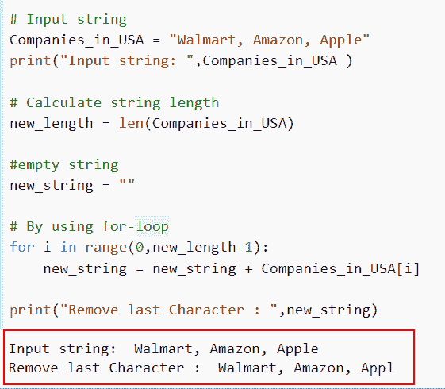

# 如何在 Python 中删除字符串的最后一个字符

> 原文：<https://pythonguides.com/remove-the-last-character-from-a-string-in-python/>

[](https://sharepointsky.teachable.com/p/python-and-machine-learning-training-course)

在本 [Python 教程](https://pythonguides.com/python-programming-for-the-absolute-beginner/)中，我们将讨论**如何在 Python** 中移除一个字符串的最后一个字符。此外，我们将演示七种有趣的技术来删除 Python 中字符串的最后一个字符。

*   如何在 Python 中删除字符串的最后一个字符
*   如何使用切片方法从 Python 中移除字符串的最后一个字符
*   如何使用 translate 方法在 Python 中移除字符串的最后一个字符
*   如何使用 rstrip 方法在 Python 中移除字符串的最后一个字符
*   如何使用 regex 方法从 Python 中删除字符串的最后一个字符
*   如何使用 for 循环概念在 Python 中删除字符串的最后一个字符
*   如何使用连接和列表理解方法在 Python 中删除字符串的最后一个字符
*   如何使用 replace()方法在 Python 中移除字符串的最后一个字符
*   如何从字符串 Python NumPy 中删除最后一个字符

目录

[](#)

*   [如何使用切片方法从 Python 中删除字符串的最后一个字符](#How_to_remove_the_last_character_from_a_string_in_Python_by_using_the_slicing_method "How to remove the last character from a string in Python by using the slicing method")
*   [如何使用 translate 方法删除 Python 中字符串的最后一个字符](#How_to_remove_the_last_character_from_a_string_in_Python_by_using_the_translate_method "How to remove the last character from a string in Python by using the translate method")
*   [如何使用 rstrip 方法从 Python 中删除字符串的最后一个字符](#How_to_remove_the_last_character_from_a_string_in_Python_by_using_the_rstrip_method "How to remove the last character from a string in Python by using the rstrip method ")
*   [如何使用 regex 方法删除 Python 中字符串的最后一个字符](#How_to_remove_the_last_character_from_a_string_in_Python_by_using_the_regex_method "How to remove the last character from a string in Python by using the regex method")
*   [如何使用 for 循环概念从 Python 中删除字符串的最后一个字符](#How_to_remove_the_last_character_from_a_string_in_Python_by_using_the_for_loop_concept "How to remove the last character from a string in Python by using the for loop concept")
*   [如何使用连接和列表理解方法从 Python 中删除字符串的最后一个字符](#How_to_remove_the_last_character_from_a_string_in_Python_by_using_the_join_and_list_comprehension_method "How to remove the last character from a string in Python by using the join and list comprehension method")
*   [如何使用 replace()方法从 Python 中删除字符串的最后一个字符](#How_to_remove_the_last_character_from_a_string_in_Python_by_using_the_replace_method "How to remove the last character from a string in Python by using the replace() method")
*   [如何删除字符串 Python NumPy 的最后一个字符](#How_to_remove_the_last_character_from_the_string_Python_NumPy "How to remove the last character from the string Python NumPy")

## 如何使用切片方法从 Python 中删除字符串的最后一个字符

*   在这里，我们将尝试理解如何使用切片方法从 Python 中删除字符串的最后一个字符。
*   字符串切片是一种从字符串中删除最后一个字符的 Python 技术。您可以通过使用字符串切片函数获得一个子字符串。为了从字符串中提取某些字符，使用了索引。
*   在这个例子中，我们将通过切片使用负索引来删除字符串中的最后一个字符。

**语法**:

```py
str[:-1]
```

**举例**:

让我们看一个例子来帮助你更好地理解这个概念。

```py
**# Input string**
Country_name = " The United States of America"
print("Input string: ", Country_name)

**# By using the slicing negative index**
result = Country_name[:-1]

**# Display the Content**
print("Last character has been removed from string: ", result)
```

这里我们取了一个输入字符串`Country _ name = " United States of America "`，然后为了删除字符串中的最后一个字符，索引从 `-1` 开始。

我们通过在-1 索引处对字符串进行切片，删除了它的最后一个字符。最后，结果已经打印出来。因此，我们可以看到最后一个字符已被删除。

你可以参考下面的截图。


How to remove the last character from a string in Python by using the slicing method

阅读:[如何将列表追加到另一个列表中](https://pythonguides.com/python-append-list-to-another-list/)

## 如何使用 translate 方法删除 Python 中字符串的最后一个字符

*   在这个例子中，我们将讨论如何使用 translate 方法从 Python 字符串中删除最后一个字符。
*   Python 的 `translate()` 函数用于返回一个字符串，字符串中的每个字符都被映射到翻译表中相应的位置。
*   要从结果字符串中删除一个字符，我们必须给出该字符的 Unicode 码位和单词**“None”**作为替换。为了确定字符的 Unicode 码位，我们可以利用 `ord()` 方法。

**举例:**

```py
**# Input string**
cities_of_USA = 'New York, Los Angeles, California'
print("Input string:",cities_of_USA)

**# Using the translate() method**
new_output= cities_of_USA.translate({ord('a'): None})

**# Display the Content**
print("Last character removed: ", new_output)
```

下面是以下给定代码的实现


How to remove the last character from a string in Python by using the translate method

在这个例子中，我们讨论了如何使用 translate 方法从 Python 中删除字符串的最后一个字符。

阅读:[如何在 Python 中使用 For 循环对列表中的元素求和](https://pythonguides.com/sum-elements-in-list-in-python-using-for-loop/)

## 如何使用 rstrip 方法从 Python 中删除字符串的最后一个字符

*   使用字符串函数 rstrip 移除给定字符串右侧的字符。因此，我们将使用它来删除字符串的最后一个字符。
*   方法从提供的后续字符中去掉字符串的最后几个字符。如果没有提供参数，它将删除末尾的空格。

**语法**:

让我们看一下语法并理解 Python 中的`rst rip()`方法的工作原理。

```py
string.rstrip(chars)
```

**注意:**它只有一个参数，表示要删除的尾部字符。

示例:

```py
new_val = input("Enter the Country name : ")

new_output = new_val.rstrip(new_val[-1])

print("Last character removed from String : ",new_output)
```

你可以参考下面的截图


How to remove the last character from a string in Python by using the rstrip method

这是如何使用 rstrip 方法从 Python 中移除字符串的最后一个字符。

阅读:[如何在 Python 中求完全数](https://pythonguides.com/perfect-number-in-python/)

## 如何使用 regex 方法删除 Python 中字符串的最后一个字符

*   Regex()是一个 Python 函数，可用于匹配字符串中的两个组。regex 模块的' re '类具有函数`re sub()`。最后一个字符也可以用它来删除。
*   Re.sub()是 Python regex 提供的一种方法，用于搜索和替换字符串中的模式。通过使用这种技术，我们可以用不同的字符串替换目标字符串中的一个或多个正则表达式模式实例。

**语法**:

让我们看一下语法并理解 Python 中的`re sub()`方法的工作原理。

```py
re.sub(pattern, repl, string, count=0, flags=0)
```

*   它由几个参数组成
    *   **模式**:该参数定义了我们想要替换的字符串/模式。
    *   `repl` :该参数用于定义替换花样的花样。
    *   `Count` :默认情况下，取值为 0，它定义了应该发生的替换次数。

**举例**:

为了更好地理解这个想法，让我们看一个例子。

**源代码**:

```py
import re
# input string
Country_name = "U.S.A, France, Belgium"

# By using the re.sub() method
new_output = re.sub(r'm', '', Country_name, count = 1)

# Display the content
print("Removed last character from input string: ",new_output)
```

因此，我们将首先导入 re 库来验证这个函数，它在 re 模块中，然后，我们生成一个字符串。

然后执行`re()`命令，并在其中传递参数字符串和计数。这里，我们利用表达式**“count = 1”**来表示字符删除，在这个函数中，我们传递了想要从输入字符串中删除的字母。

下面是以下给定代码的实现。


How to remove the last character from a string in Python by using the regex method

正如你在截图中看到的，我们已经讨论了如何使用 regex 方法从 Python 中删除字符串的最后一个字符。

阅读:[如何在 Python 中反转一个数字](https://pythonguides.com/reverse-a-number-in-python/)

## 如何使用 for 循环概念从 Python 中删除字符串的最后一个字符

*   字符串中的最后一个字符也可以使用 for 循环删除。函数 `len()` 将用于提取字符串的长度。
*   接下来，将生成一个空字符串。之后，我们将通过从 0 到 l-2 的循环迭代将字符串追加到空字符串。
*   输出将作为最终的字符串打印出来。

**举例**:

让我们举一个例子，看看如何在 Python 中删除字符串的最后一个字符。

**源代码**:

```py
# Input string
Companies_in_USA = "Walmart, Amazon, Apple"
print("Input string: ",Companies_in_USA )

# Calculate string length
new_length = len(Companies_in_USA)

#empty string
new_string = ""

# By using for-loop
for i in range(0,new_length-1):
    new_string = new_string + Companies_in_USA[i]

print("Remove last Character : ",new_string)
```

在本例中，我们首先获取输入字符串`Companies _ in _ USA`=“Walmart，Amazon，Apple ”,然后我们使用 len()函数来确定字符串的长度。

为了创建新的字符串，我们采用了一个空字符串，并将其附加到现有的字符串。接下来，我们将空字符串中的字符添加到 for 循环的每次迭代中，我们使用它从索引 0 到 `new_length-1` 。

我们最终打印出了创建好的字符串，它将显示从输入字符串中删除的最后一个字符。

下面是以下给定代码的实现。



How to remove the last character from a string in Python by using the for loop concept

这是如何使用 for 循环概念从 Python 中删除字符串的最后一个字符。

阅读: [Python 程序求偶或奇](https://pythonguides.com/python-program-for-even-or-odd/)

## 如何使用连接和列表理解方法从 Python 中删除字符串的最后一个字符

*   这里我们将讨论如何通过使用 python 中的连接和列表理解方法来删除 Python 中字符串的最后一个字符。
*   通过使用 list comprehension 和 join 方法，我们可以很容易地将每个 string 元素拆分成相关的 list 元素，然后将它们连接起来以声明一个新的 string。

**举例**:

这里我们将举一个例子，检查如何通过使用 python 中的****连接和列表理解**方法从 Python 中删除字符串的最后一个字符。**

 ****源代码**:

```py
# Input string
state_name_in_USA = 'Alaska'
print ("Original string: ", state_name_in_USA)

# By using the join() method 
new_result = ''.join([state_name_in_USA [m] for m in range(len(state_name_in_USA )) if m != 5]) 

# Display the Content   
print ("Last character remove from string: ",new_result) 
```

在下面给出的代码中，我们首先创建了一个名为**“state _ name _ in _ USA”**的输入字符串，并在其中为其指定了州名。接下来，我们使用了 `join()` 方法并用一个设定的条件迭代这些值，如果 **i！=5** ，它将删除字符串中的最后一个字符。

下面是以下代码的截图


How to remove the last character from a string in Python by using the join and list comprehension method in python

正如你在截图中看到的，我们已经讨论了如何使用连接和列表理解方法从 Python 中删除字符串的最后一个字符。

阅读:[Python 中的复数](https://pythonguides.com/complex-numbers-in-python/)

## 如何使用 replace()方法从 Python 中删除字符串的最后一个字符

*   在这个例子中，我们将了解如何通过使用 Python 中的 `replace()` 方法来删除 Python 中字符串的最后一个字符。
*   Python 中一个名为 `replace()` 的内置函数通过用一个子字符串替换另一个子字符串来创建一个新字符串。
*   在本例中，如果我们想从输入字符串中删除最后一个字符，那么我们必须提供第二个参数作为空字符串“”。

**语法**:

让我们看一下语法并理解 Python 中的 `str.replace()` 方法的工作原理。

```py
str.replace(old,  new, count)
```

*   它由几个参数组成
    *   `old` :-该参数定义了将要被替换的字符串。
    *   `new` :用新值(一个字符或字符串)替换现有值。
    *   `count` :-一个整数值，表示要用新字符或子串替换多少个旧字符或子串。这是一个可选参数。

**举例**:

```py
# Input string
Cars_in_USA = 'Tesla, BMW'

# By Using replace() method
new_output= Cars_in_USA.replace('W', '')

# Display the content
print("Last character has been removed from string: ",new_output)
```

在下面给定的代码中，我们使用了 `str.replace()` 函数，在这个方法中，我们提供了旧字符**‘W’**，并用一个新字符替换了它，但是在这种情况下，我们必须删除这个字符，所以第二个参数将是一个空字符串。

你可以参考下面的截图


How to remove the last character from a string in Python by using the replace method in Python

在这个例子中，我们已经了解了如何通过使用 Python 中的 replace 方法来删除 Python 中字符串的最后一个字符。

阅读: [Python 回文程序](https://pythonguides.com/python-palindrome-program/)

## 如何删除字符串 Python NumPy 的最后一个字符

*   在这一节中，我们将讨论如何在 NumPy Python 中删除字符串的最后一个字符。
*   为了执行这个特定的任务，我们将使用 `numpy.char.replace()` 函数。在每个实例中，旧的子串被新的子串替换后， `replace()` 函数返回一个字符串或字符串数组的副本。
*   当您想要用新的字符串值替换数组元素中的子字符串时，这个函数非常有用。

**语法**:

下面是 Python 中 `numpy.char.replace()` 函数的语法

```py
numpy.char.replace(a, old, new, count=None)
```

*   它由几个参数组成
    *   `a` :这个参数定义了我们插入字符串元素的输入数组。
    *   `old` :要替换的原始子串由该参数指定。
    *   `new` :该参数定义用来替换旧子串的新子串。

**举例**:

```py
import numpy as np

# Creation of input array
Country_name = np.array([" The United States of America"])

# Create old character
old = "a"

# creating a new character
new = " "

# By using the char.replace() function
new_result = np.char.replace(Country_name, old, new)
print("last character removed from array: ",new_result)
```

下面是以下代码的截图


How to remove the last character from the string Python NumPy

您可能也喜欢阅读以下 Python 教程。

*   [Python 中的阿姆斯特朗数](https://pythonguides.com/armstrong-number-in-python/)
*   [Python 命名约定](https://pythonguides.com/python-naming-conventions/)
*   [Python 字典追加](https://pythonguides.com/python-dictionary-append/)
*   [寻找 3 个数最大值的 Python 程序](https://pythonguides.com/python-program-for-finding-greatest-of-3-numbers/)

在本教程中，我们讨论了如何在 Python 中删除一个字符串的最后一个字符，我们还应用了不同的技术来删除 Python 中一个字符串的最后一个字符。

*   如何在 Python 中删除字符串的最后一个字符
*   如何使用切片方法从 Python 中移除字符串的最后一个字符
*   如何使用 translate 方法在 Python 中移除字符串的最后一个字符
*   如何使用 rstrip 方法在 Python 中移除字符串的最后一个字符
*   如何使用 regex 方法从 Python 中删除字符串的最后一个字符
*   如何使用 for 循环概念在 Python 中删除字符串的最后一个字符
*   如何使用连接和列表理解方法在 Python 中删除字符串的最后一个字符
*   如何使用 replace()方法在 Python 中移除字符串的最后一个字符
*   如何从字符串 Python NumPy 中删除最后一个字符

[Arvind](https://pythonguides.com/author/arvind/)

Arvind 目前是 TSInfo Technologies 的高级 Python 开发人员。他精通 Python 库，如 NumPy 和 Tensorflow。**