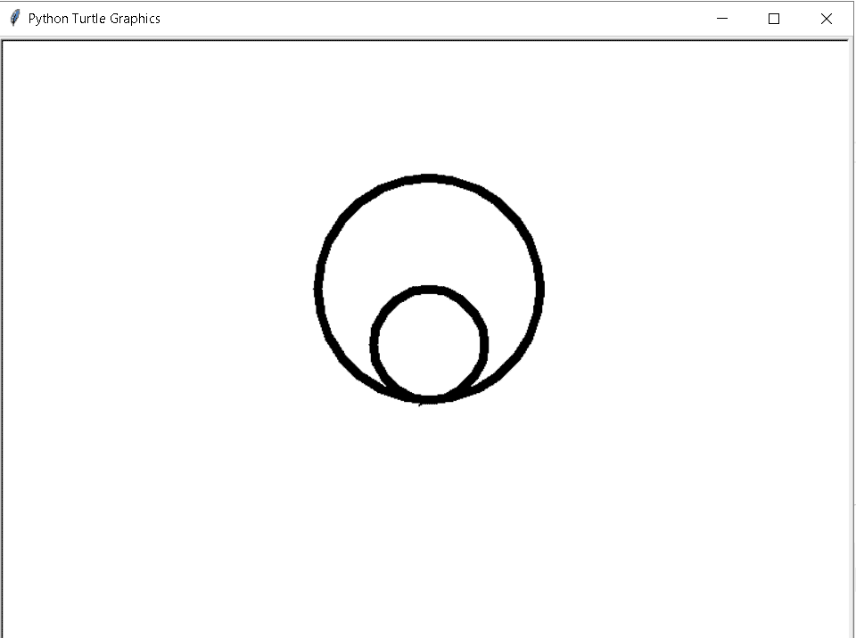
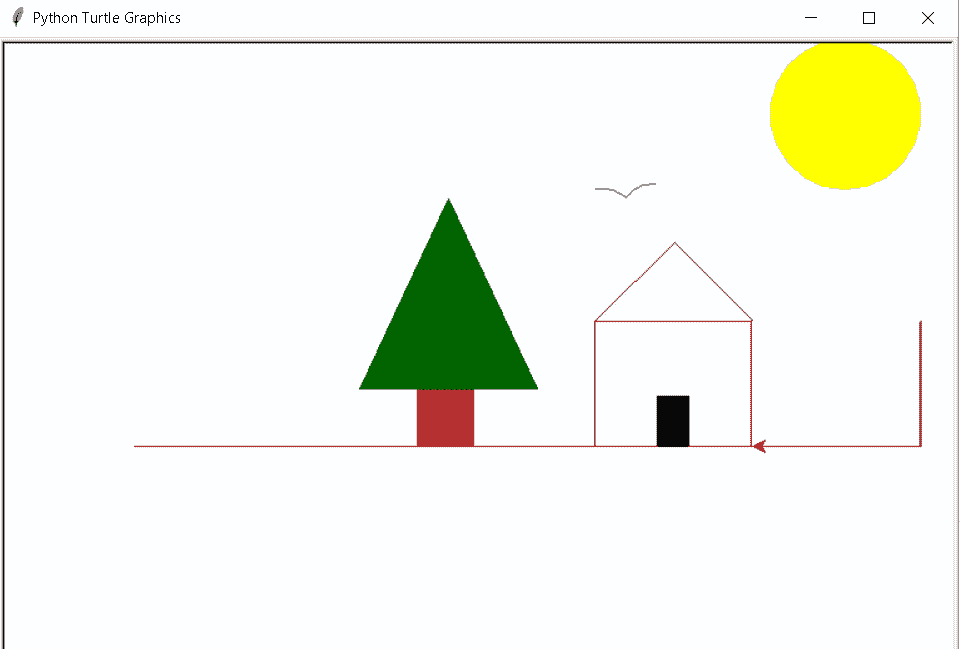

# Replit 蟒蛇龟

> 原文：<https://pythonguides.com/replit-python-turtle/>

[](https://sharepointsky.teachable.com/p/python-and-machine-learning-training-course)

在本[巨蟒龟](https://pythonguides.com/turtle-programming-in-python/)教程中，我们将学习如何使用 **Replit 巨蟒龟**，我们还将介绍与 **Replit 龟**相关的不同示例。我们将讨论这些话题。

*   Replit 蟒蛇龟
*   Replit Python 海龟馆

目录

[](#)

*   [Replit 蟒蛇龟](#Replit_Python_Turtle "Replit Python Turtle")
*   [Replit 蟒蛇龟屋](#Replit_Python_turtle_house "Replit Python turtle house")

## Replit 蟒蛇龟

在这一节中，我们将学习 Python Turtle 中的 `Replit` 。Replit 是一个编码平台，我们可以在这里写代码，做项目。在这里，我们可以借助 Replit 托管应用程序。

**它有不同的使用方式，可以用以下方式代替:**

*   代码编辑器(相对于代码、子行)
*   像 NPM 一样建造工具
*   云服务提供商(AWS、Netlify)
*   社区协作工具(谷歌、Github)

**代码:**

我们从 turtle import * 、**导入 turtle 模块**作为 turn**。**

*   `tur.pensize(8)` 用于增加或减少线条的粗细。
*   `tur.circle(100)` 用于在屏幕上画圆。

```py
from turtle import *
import turtle as tur

tur.pensize(8)
tur.circle(100)
tur.circle(50)
tur.done()
```

**输出:**

运行上述代码后，我们可以看到下面的输出，这是使用 Replit 中的 `pensize()` 和 `circle()` 函数完成的。



Replit python turtle Output

阅读:[蟒龟大小](https://pythonguides.com/python-turtle-size/)

## Replit 蟒蛇龟屋

在这一节中，我们将学习如何用 Python 构建一个 Replit turtle house。

正如我们所知，replit 是一个编码平台，我们可以编写代码并执行它，甚至我们可以将应用程序托管到该平台上。在这里，我们编写了一个可以在 replit 上执行的代码，并在浏览器上托管该应用程序。

**代码:**

在下面的代码中，我们导入了 turtle 模块，它有助于绘制图片。

*   **速度(0)** 用来给乌龟速度， `0` 是最快的速度。
*   `color()` 用于给图像着色，以获得吸引人的外观。
*   `forward()` 是在龟笔上移动做出形状的方向函数。
*   `left()` 是在龟笔上移动做出形状的方向函数。
*   `right()` 是在龟笔上移动做出形状的方向函数。

```py
 from turtle import *
import turtle

speed(0)

color('brown')
forward(350)

left(90)	
forward(100)

color("alice blue")		
begin_fill()
forward(250)

left(90)	
forward(490)

left(90)			
forward(250)

left(90)
forward(491)
end_fill()

color("brown")	
right(90)
forward(100)
right(90)
forward(630)

penup()
left(180)
forward(180)
left(90)
forward(45)

color("dark green") 
begin_fill()
right(385)

forward(170)

right(130)
forward(170)

right(115)
forward(82)
end_fill() 

penup()	
color("brown")
right(180)
forward(30)

pendown()
begin_fill()
right(90)
forward(45)

right(90)
forward(45)

right(90)
forward(45)

right(90)
forward(45)
end_fill() 

penup()
right(90)
forward(45)

right(90)
forward(45)

#pendown()
color("brown")
forward(110)

color("brown")
right(90)
forward(105)
color("blue")
forward(105)

color("blue")
right(90)
forward(300)

right(180) 

pendown()

circle(30,50)
right(90)
circle(30,50)

penup()
left(170)
forward(200)

pendown()           
color("yellow")
begin_fill()
circle(60) 
end_fill()

penup()
color("blue")
right(90)

forward(206)

right(90)
forward(125)

pendown() 
color("black")		
begin_fill()
forward(25)

right(90) 
forward(40)
right(90)
forward(25)
right(90)
forward(40)

end_fill()

color("red")     

left(90)
forward(50)

left(90)
forward(100)
left(90)
forward(125)
left(90)
forward(100)

left(90)
forward(50)

right(180)
forward(50)

right(90)
forward(100)

right(45)	
forward(90)

right(90)
forward(90)

right(45)

penup()
forward(100)
right(90)
turtle.done()
```

**输出:**

在上面的代码中，我们使用 python turtle 模块和 `forward()` 、 `right() color()` 、 `left()` 函数，用 python turtlepen 制作了一张房子的图片。

在 Replit 中，我们可以在任何地方都能访问的服务器上托管我们的应用和运行我们的代码。

**链接:**在这个[链接](https://replit.com/@techvaishali/Replit-Python-turtle-House#main.py)中，我们可以看到我们的代码是如何在 Replit 平台上工作的，我们可以访问它来查看输出。



Replit Python turtle house Output

你可能也喜欢读下面的文章。

*   [蟒龟字体](https://pythonguides.com/python-turtle-font/)
*   [蟒龟示踪器](https://pythonguides.com/python-turtle-tracer/)
*   [蟒龟广场](https://pythonguides.com/python-turtle-square/)
*   [蟒龟三角](https://pythonguides.com/python-turtle-triangle/)
*   [蟒龟艺术](https://pythonguides.com/python-turtle-art/)
*   [蟒龟圈](https://pythonguides.com/python-turtle-circle/)
*   [蟒龟速度](https://pythonguides.com/python-turtle-speed/)
*   [蟒蛇龟的颜色](https://pythonguides.com/python-turtle-colors/)
*   [如何在蟒蛇龟身上画花](https://pythonguides.com/draw-flower-in-python-turtle/)

因此，在本教程中，我们讨论了 `Replit Python Turtle` ,我们还讨论了与其实现相关的不同示例。这是我们已经讨论过的例子列表。

*   Replit 蟒蛇龟
*   Replit Python 海龟馆

[Bijay Kumar](https://pythonguides.com/author/fewlines4biju/)

Python 是美国最流行的语言之一。我从事 Python 工作已经有很长时间了，我在与 Tkinter、Pandas、NumPy、Turtle、Django、Matplotlib、Tensorflow、Scipy、Scikit-Learn 等各种库合作方面拥有专业知识。我有与美国、加拿大、英国、澳大利亚、新西兰等国家的各种客户合作的经验。查看我的个人资料。

[enjoysharepoint.com/](https://enjoysharepoint.com/)[](https://www.facebook.com/fewlines4biju "Facebook")[](https://www.linkedin.com/in/fewlines4biju/ "Linkedin")[](https://twitter.com/fewlines4biju "Twitter")