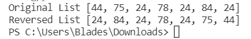

# 如何在 Python 中反转列表

> 原文：<https://pythonguides.com/reverse-a-list-in-python/>

[](https://sharepointsky.teachable.com/p/python-and-machine-learning-training-course)

在本 [Python 教程](https://pythonguides.com/python-download-and-installation/)中，我们将学习如何在 python 中**反转一个列表。我们将讨论与反转列表相关的不同例子。这是我们将要涉及的例子列表。**

*   用反转函数反转 python 中的列表
*   用反向迭代器反转 python 中的列表
*   在 python 中不使用反转函数反转列表
*   如何在 python 中使用 while 循环反转列表
*   使用 for 循环反转 python 中的列表
*   使用切片反转 python 中的列表
*   使用递归在 python 中反转列表

目录

[](#)

*   [用反转函数反转 python 中的列表](#Reverse_a_list_in_python_with_reverse_function "Reverse a list in python with reverse function")
*   [用反向迭代器反转 python 中的列表](#Reverse_a_list_in_python_with_reversed_iterator "Reverse a list in python with reversed iterator")
*   [在 python 中不用反转函数反转一个列表](#Reverse_a_list_in_python_without_reverse_function "Reverse a list in python without reverse function")
*   [如何使用 while 循环反转 python 中的列表](#How_to_reverse_a_list_in_python_using_while_loop "How to reverse a list in python using while loop")
*   [使用 for 循环反转 python 中的列表](#Reverse_a_list_in_python_using_for_loop "Reverse a list in python using for loop")
*   [使用切片反转 python 中的列表](#Reverse_a_list_in_python_using_slicing "Reverse a list in python using slicing")
*   [使用递归在 python 中反转列表](#Reverse_a_list_in_python_using_recursion "Reverse a list in python using recursion")

## 用反转函数反转 python 中的列表

Python 有一个名为 `reverse()` 的内置函数，我们可以用它来反转一个 [Python 列表](https://pythonguides.com/create-list-in-python/)。让我们看一个例子。我们将创建一个列表，并使用 `reverse()` 函数来反转它。看看下面的代码。

```py
list1=[12,14,56,24,25,52,54]
list1.reverse()
print(list1)
```

*   我们创建了一个名为 `list1` 的列表，并使用 reverse()函数来反转列表。查看下面的输出:


Reversed list

这样，就可以使用内置的 reverse()函数来反转一个列表。

阅读: [Python 程序反转一个字符串](https://pythonguides.com/python-program-to-reverse-a-string/)

## 用反向迭代器反转 python 中的列表

python 中还有另一个内置选项来反转列表。我们可以使用**反向**迭代器。使用这个选项，我们可以以相反的顺序迭代我们的列表，或者我们也可以以列表的形式存储结果。让我们看看如何。

```py
list1= [23, 54, 76, 82, 40, 45]
for element in reversed(list1):
    print(element)
```


Elements printed in reverse order

您可以看到元素是以相反的顺序打印的。

同样，你可以用这个反向迭代器来做一个列表。但是你必须把这个迭代器对象转换成一个列表。

```py
list1= [23, 54, 76, 82, 40, 45]
print(list(reversed(list1)))
```


Reversed List

这样，你就可以使用反向迭代器在 python 中得到一个反向列表。

阅读: [11 Python 列表方法](https://pythonguides.com/python-list-methods/)

## 在 python 中不用反转函数反转一个列表

当我们想在 python 中反转一个列表时，一般会使用 `reverse()` 函数。但是我们也可以编写自己的逻辑来完成同样的任务。

在下面几节中，我解释了一些不用 `reverse()` 函数就可以在 python 中反转列表的方法。

## 如何使用 while 循环反转 python 中的列表

在 python 中，可以使用 while 循环来反转列表。看看下面的代码:

```py
list1= [54,78,23,54,67,90,12,43]
print('Original list:', list1)
list2=[]
length=len(list1)
while length > 0:
    list2.append(list1[length-1])
    length = length - 1
print('Reversed list:', list2)
```


Reversed list

*   在上面的代码中，我们迭代了列表的长度。我们递减长度的值，当长度为零时，循环将停止。
*   在索引的帮助下，我们将原始列表的值存储到一个新列表中。

这样，您可以使用 while 循环来反转 python 中的列表。

阅读: [Python 将数据帧转换为列表](https://pythonguides.com/python-convert-dataframe-to-list/)

## 使用 for 循环反转 python 中的列表

还可以使用 for 循环来反转 python 中的列表。我将解释使用 for 循环反转列表的各种例子。

**例 1:**

考虑以下 python 代码:

```py
original_list=[71, 36, 51, 75, 82, 78, 40]
print('Orginal List:', original_list)
reversed_list=[]
for i in original_list:
    reversed_list.insert(0,i)
print('Reversed List:', reversed_list)
```


Reversed List

*   在上面的例子中，我们使用了 `insert()` 函数在新列表的第一个位置插入一个元素。
*   当我们在列表中的第一个索引处插入一个元素时，其余的元素被转移到下一个索引处。
*   例如，以下是每次迭代后反转列表的值:
    *   `[71]`
    *   [36, 71]
    *   [51, 36, 71]
    *   [75, 51, 36, 71]
    *   [82, 75, 51, 36, 71]
    *   [78, 82, 75, 51, 36, 71]
    *   [40, 78, 82, 75, 51, 36, 71]

*   你可以看到，在所有迭代结束时，我们的列表是颠倒的。

现在让我们看另一个使用 for 循环反转列表的例子。

**例 2:**

在这个例子中，我们将使用列表的 `insert()` 函数和 `pop()` 方法来反转列表。pop()方法删除列表的最后一个元素，并返回这个被删除的值，我们可以将它存储到一个变量中。

这一次，我们不会创建一个新的列表，而只会反转现有列表中的元素。

```py
original_list=[71, 36, 51, 75, 82, 78, 40]
print('Orginal List:', original_list)
for i in range(len(original_list)):
    popped= original_list.pop()
    original_list.insert(i, popped)
print('Reversed List:', original_list)
```


Reversed List

*   我们使用 pop()方法删除最后一个元素，并将这个删除的元素存储到一个变量中。
*   然后我们使用 insert()函数在列表中插入弹出的元素。
*   为了更好地理解它，您可以在每次迭代后看到列表的值:
    *   [71, 36, 51, 75, 82, 78, 40]
    *   [40, 71, 36, 51, 75, 82, 78]
    *   [40, 78, 71, 36, 51, 75, 82]
    *   [40, 78, 82, 71, 36, 51, 75]
    *   [40, 78, 82, 75, 71, 36, 51]
    *   [40, 78, 82, 75, 51, 71, 36]
    *   [40, 78, 82, 75, 51, 36, 71]
    *   [40, 78, 82, 75, 51, 36, 71]

因此，您可能已经学会了如何在 for 循环中使用 pop()和 insert()函数来反转列表。

**例 3** :

在这个例子中，我将解释一种不使用内置函数的非常有效的反转列表的方法。看看下面的代码；

```py
list1 = [32, 65, 79, 45, 35, 62, 74]
print('Original List:', list1)
Length = len(list1)
for i in range(int(Length / 2)):
    temp = list1[i]
    list1[i] = list1[Length - i - 1]
    list1[Length - i - 1] = temp
print('Reversed List:', list1)
```


Reversed List

*   在上面的代码中，循环将运行列表中一半数量的元素。
*   这意味着运行该程序的时间复杂度将低于其他一些方法，使其成为一个非常有效的解决方案。

**代码**的解释 **:**

*   在上面的程序中，我们试图在一个循环内将左侧的一个元素与右侧的相应元素交换。
*   使用这个逻辑，我们只需要运行这个程序列表中元素总数的一半。
*   让我一个一个给你看迭代:

**原列表:**【32，65，79，45，35，62，74】

**列表长度:** 7

**迭代次数:** int(7/2) = 3

**迭代 1:**

[74, 65, 79, 45, 35, 62, 32]

**迭代 2:**

[74, 62, 79, 45, 35, 65, 32]

**迭代 3:**

[74, 62, 35, 45, 79, 65, 32]

你可以看到在最后一次迭代中，我们颠倒了我们的列表。通过这种方式，您可以使用 for 循环以非常高效的方式来反转 python 中的列表。

**例 4:**

下面的例子只是为了实践，并不是一个可行的解决方案，因为它有很高的空间和时间复杂度。

在这个方法中，我们迭代原始列表元素。我们将每个元素转换成一个列表，并将它与最初为空的新列表连接起来。

```py
original_list=[71, 36, 51, 75, 82, 78, 40]
print('Original List:', original_list) 
reversed_list=[]
for element in original_list:
    reversed_list= [element] + reversed_list
print('Reversed List:', reversed_list)
```


Reversed List

阅读: [Python 字符串列表](https://pythonguides.com/python-string-to-list/)

## 使用切片反转 python 中的列表

在本节中，您将学习如何使用切片方法来反转列表。在这个方法中，我们必须制作一个新的列表副本。这增加了程序的空间需求。

看看下面的代码:

```py
list1=[44, 75, 24, 78, 24, 84, 24]
print('Original List', list1)
new_list=list1[::-1]
print('Reversed List', new_list)
```



Reversed List

您可以看到列表的副本以相反的顺序存储元素。这样，您可以使用切片或索引方法来获得逆序列表。

阅读: [Python 从两个列表中创建了一个字典](https://pythonguides.com/python-creates-a-dictionary-from-two-lists/)

## 使用递归在 python 中反转列表

在 python 中，还可以使用一些递归方法来反转列表。让我们借助一个例子来理解。

```py
list1= [43, 56, 23, 75, 92, 34, 45]
print('Original list:', list1)
def rev(lst):
    if len(lst) == 0:
        return []
    return [lst[-1]] + rev(lst[:-1])
print('Reversed list:', rev(list1))
```


Reversing a list using recursion

*   在上面的代码中，我们创建了一个递归函数。
*   这个函数返回列表的最后一个元素，并将它转换成一个列表。
*   然后这个函数使用连接操作符并再次调用自己，但是这次传递的列表不包括列表的最后一个元素。
*   因此，该函数将递归地返回从最后一个位置到第一个位置的所有元素，并在最后一次迭代中连接它们。
*   这将返回一个逆序的列表。

让我形象地解释一下:

**原始列表:**版本([43，56，23，75，92，34，45])

**迭代 1:**

现在这个函数将分解为:

[45] + rev([43，56，23，75，92，34])

**迭代 2:**

类似地，该函数将再次分解为:

[45] + [34] + rev([43，56，23，75，92])

**迭代 3:**

[45] + [34] + [92] + rev([43，56，23，75])

第四次迭代:

[45] + [34] + [92] + [75] + rev([43，56，23])

**迭代 5:**

[45]+[34]+[92]+[75]+[23]+rev([43，56])

**迭代 6:**

[45]+[34]+[92]+[75]+[23]+[56]+rev([43])

这相当于:

[45] + [34] + [92] + [75] + [23] + [56] + [43] = [45, 34, 92, 75, 23, 56, 43]

因此在最后一次迭代中，我们颠倒了我们的列表。通过这种方式，你可以使用递归方法来反转 python 中的列表。

您可能也喜欢阅读以下 python 教程。

*   [Python 循环遍历](https://pythonguides.com/python-loop-through-a-list/) [列表](https://pythonguides.com/python-loop-through-a-list/)
*   [在 Python 列表中找到最小的数字](https://pythonguides.com/find-smallest-number-in-a-python-list/)
*   [Python 查找列表中元素的索引](https://pythonguides.com/python-find-index-of-element-in-list/)
*   [Python 统计文件中的字数](https://pythonguides.com/python-count-words-in-file/)
*   [Python 在字符串中查找数字](https://pythonguides.com/python-find-number-in-string/)
*   [Python 元组排序列表](https://pythonguides.com/python-sort-list-of-tuples/)
*   [Python NumPy to list](https://pythonguides.com/python-numpy-to-list/)
*   [Python 字典值列表](https://pythonguides.com/python-dictionary-values-to-list/)
*   [在 Python 中检查列表是否为空](https://pythonguides.com/check-if-a-list-is-empty-in-python/)
*   [如何在 Python 中把列表转换成字符串](https://pythonguides.com/python-convert-list-to-string/)

因此，你可能已经学会了用 python 反转列表的各种方法。下面是我们上面讨论过的方法列表。

*   用反转函数反转 python 中的列表
*   用反向迭代器反转 python 中的列表
*   在 python 中不使用反转函数反转列表
*   如何在 python 中使用 while 循环反转列表
*   使用 for 循环反转 python 中的列表
*   使用切片反转 python 中的列表
*   使用递归在 python 中反转列表

[Bijay Kumar](https://pythonguides.com/author/fewlines4biju/)

Python 是美国最流行的语言之一。我从事 Python 工作已经有很长时间了，我在与 Tkinter、Pandas、NumPy、Turtle、Django、Matplotlib、Tensorflow、Scipy、Scikit-Learn 等各种库合作方面拥有专业知识。我有与美国、加拿大、英国、澳大利亚、新西兰等国家的各种客户合作的经验。查看我的个人资料。

[enjoysharepoint.com/](https://enjoysharepoint.com/)[](https://www.facebook.com/fewlines4biju "Facebook")[](https://www.linkedin.com/in/fewlines4biju/ "Linkedin")[](https://twitter.com/fewlines4biju "Twitter")