# 如何在 Python 中反转一个数字[11 种不同的方法]

> 原文：<https://pythonguides.com/reverse-a-number-in-python/>

[](https://sharepointsky.teachable.com/p/python-and-machine-learning-training-course)

你知道如何在 Python 中 ***反转一个数字吗？本教程将讨论如何在 Python*** 中 ***反转一个数字。此外，我们还将讨论以下主题。***

*   在 python 中反转数字
*   如何在 Python 中使用 for 循环反转一个数字
*   在不使用 for 循环的情况下在 Python 中反转一个数字
*   在 Python 中使用函数反转数字
*   使用 while 循环反转 Python 中的数字
*   如何在 Python 中使用递归反转一个数字
*   在 Python 中使用内置函数反转一个数字
*   不使用内置函数在 Python 中反转一个数字
*   在 Python 中使用切片反转一个数字
*   如何在 Python 中反转数字的顺序
*   如何在 Python 中反转列表中的数字
*   反转一个数字，检查它是否是 Python 中的回文
*   Python 中的反向字符

目录

[](#)

*   [在 python 中反转一个数字](#Reverse_a_number_in_python "Reverse a number in python")
*   [使用 for 循环在 Python 中反转一个数字](#Reverse_a_number_in_Python_using_for_loop "Reverse a number in Python using for loop")
*   [在不使用 for 循环的情况下用 Python 反转一个数字](#Reverse_a_number_in_Python_without_using_for_loop "Reverse a number in Python without using for loop")
*   [使用函数](#Reverse_a_number_in_Python_using_the_function "Reverse a number in Python using the function")在 Python 中反转一个数字
*   [使用 while 循环在 Python 中反转一个数字](#Reverse_a_number_in_Python_using_a_while_loop "Reverse a number in Python using a while loop")
*   [使用递归在 Python 中反转一个数字](#Reverse_a_number_in_Python_using_recursion "Reverse a number in Python using recursion")
*   [在 Python 中使用内置函数反转一个数字](#Reverse_a_number_in_Python_using_an_inbuilt_function "Reverse a number in Python using an inbuilt function")
*   [使用切片在 Python 中反转一个数字](#Reverse_a_number_in_Python_using_slicing "Reverse a number in Python using slicing")
*   [如何反转 Python 中的数字顺序](#How_to_reverse_the_order_of_numbers_in_Python "How to reverse the order of numbers in Python")
*   [在 Python 中反转列表中的数字](#Reverse_a_number_in_a_list_in_Python "Reverse a number in a list in Python")
*   [反转一个数字，检查它是否是 Python 中的回文](#Reverse_a_number_and_check_if_it_is_a_palindrome_in_Python "Reverse a number and check if it is a palindrome in Python")
*   [Python 中的反向字符](#Reverse_character_in_Python "Reverse character in Python")

## 在 python 中反转一个数字

*   当一个数反转时，它的数字排列是第一个数字在前，最后一个数字在后，倒数第二个数字在后，以此类推，最后一个数字在最后。
*   Python 中的列表方法、切片方法、递归方法和其他预定义方法可以与条件语句结合使用，以创建反向逻辑函数。对任何类型的用户提供的输入执行这个过程的最简单的方法是使用 reverse()方法。

以数学方式对数字进行简单的逻辑反转:

首先，我们将一个整数除以 10，直到余数不会以相反的顺序出现。

第一次迭代:

```py
num= 675
Reminder = num %10
Reminder = 675%10 = 5

# Second iteration
reminder = Num%10
reminder = 67 %10 = 7 
```

**举例**:

通过使用切片方法，我们可以很容易地得到 Python 中原始输入数的倒数。

**源代码**:

```py
new_number = 76354
print(str(new_number)[::-1])
```

您可以通过使用字符串切片方法获得反转的字符串。开始:停止:步骤的值为-1。当您将-1 作为一个步骤传递时，起点移动到起点，并在终点停止。

下面是以下给定代码的实现

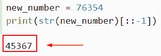

Reverse a number in python

这就是我们如何在 Python 中反转一个输入数字。

阅读: [Python 程序求偶或奇](https://pythonguides.com/python-program-for-even-or-odd/)

## 使用 for 循环在 Python 中反转一个数字

*   通过利用 for 循环和原始字符串后面的字符，我们可以使用这种技术来反转一个数字。以这种方式，创建了一个新的字符串，该字符串是颠倒的，因为首先添加最后一个字符，然后是倒数第二个，依此类推，最后添加第一个字符。
*   使用 input()或 raw_input()方法，可以读取输入的数字。接下来，确定输入的值是否是整数。现在检查提供的数字是否大于零。
*   创建一个名为“reverse”的变量，并将其初始值设置为“0”利用 mod (%)运算符，找出指定输入数字的剩余部分。将变量 reverse 乘以 10 后的剩余值相加。

**举例**:

```py
input_number = '6783'

result = ''
for m in range(len(input_number), 0, -1):
   result += input_number[m-1]
print('The reverse number is =', result)
```

在这个例子中，我们首先声明一个变量，并给它分配一个整数，然后使用 for 循环方法和 len()方法。

下面是下面给出的代码的截图。

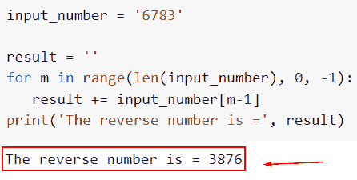

Reverse a number in Python using for loop

在这个例子中，我们已经了解了如何使用 for 循环方法在 Python 中反转一个数字。

阅读:[在 Python 中检查列表是否为空](https://pythonguides.com/check-if-a-list-is-empty-in-python/)

## 在不使用 for 循环的情况下用 Python 反转一个数字

*   本节将讨论如何在不使用 for 循环的情况下在 Python 中反转一个数字。
*   该值必须首先由用户输入，并存储在变量 n 中。执行 while 循环，并利用模数运算符来确定数字的最后一位。然后，下一个数字保持在位置 1，倒数第二个数字保持在位置 10，依此类推。
*   最后一步是将数字除以 10，去掉最后一个数字。当数字的值为 0 时，循环结束，数字打印在背面。

**举例**:

```py
new_number = int(input("Enter the value: "))
result = 0
while(new_number>0):
 remainder = new_number % 10
 result = (result * 10) + remainder
 new_number = new_number//10
# Print the result
 print("Reverse number:",result)
```

在这个例子中，我们将设置条件，如果输入的数字小于 0，那么它将除以 10 并显示结果。

你可以参考下面给出的代码截图

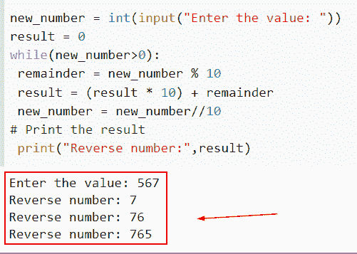

Reverse a number in Python without using for loop

这就是我们如何在不使用 for-loop 方法的情况下在 Python 中反转一个数字。

阅读: [Python 方块一号](https://pythonguides.com/python-square-a-number/)

## 使用函数在 Python 中反转一个数字

*   在这个例子中，我们将使用 reversed()函数获得 Python 中一个数字的倒数。
*   reversed()函数返回一个对象，以逆序遍历组件，但实际上并不反转任何内容。reversed()方法提供了一个迭代器来帮助以逆序遍历所提供的列表，但是它会修改列表。
*   为了反转一个数字，我们可以很容易地使用 Python reversed()函数。可以反向迭代字符串或列表的指针是函数的返回值。之后，我们可以使用 Python 的 join()方法从这个迭代器中提取反转的数字。

**举例**:

```py
new_number = 65783
con_str = str(new_number)
#By using the reversed method
result = "".join(reversed(con_str))
#Display reversed number
print("Reversed Number is:",result)
```

在下面给出的代码中，我们首先声明输入数字，然后将数字转换成字符串。之后，我们使用 reversed()函数，并将转换后的字符串赋给它。执行此代码后，它将显示原始数字的倒数。

下面是以下给定代码的执行过程

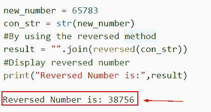

Reverse a number in Python using the function

这就是我们如何在 Python 中使用 reversed 函数来反转一个数字。

阅读: [Python 打印无换行符](https://pythonguides.com/python-print-without-newline/)

## 使用 while 循环在 Python 中反转一个数字

*   在这里，我们将讨论如何使用 while 循环概念来获取 Python 中原始数字的倒数。
*   我们需要首先添加最后一位数字，因为我们将开始一个新的变量来保存我们的倒计数。我们可以在 while 循环中取这个数的 10 的模来获得最终的数字。最后一个数字将揭示这个问题的解决方案。

**举例**:

```py
new_number = 8656
new_output = 0

while new_number != 0:
    new_val = new_number % 10
    new_output = new_output * 10 + new_val
    new_number //= 10

print("Display the reversed Number: " + str(new_output))
```

下面是以下代码的截图

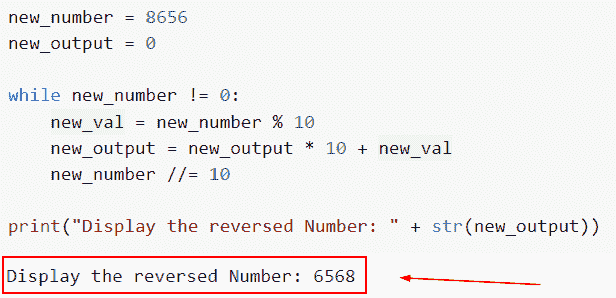

Reverse a number in Python using a while loop

正如你在截图中看到的，我们已经学会了如何使用 while 循环概念来获取 Python 中原始数字的倒数。

阅读: [11 Python 列表方法](https://pythonguides.com/python-list-methods/)

## 使用递归在 Python 中反转一个数字

*   递归用于以这种方式反转一个数。递归的缺点是它允许无限调用递归函数，直到到达最后一个索引。
*   然后，在这个基本实例中，可以将字母添加到生成的反向字符串中，这将作为我们的起点。将首先插入最后一个索引，然后是倒数第二个索引，依此类推，最后添加第一个索引。因此，通过首先使用递归函数，然后添加字母，我们可以反转字符串。

**举例**:

```py
new_num = 0
def reverse(new_val):
    global new_num
    if(new_val > 0):
        Reminder = new_val %10
        new_num = (new_num *10) + Reminder
        reverse(new_val //10)
    return new_num

new_val = int(input(" Enter the number : "))
new_num = reverse(new_val)
print(" The Result reverse number is:",new_num)
```

下面是以下给定代码的输出

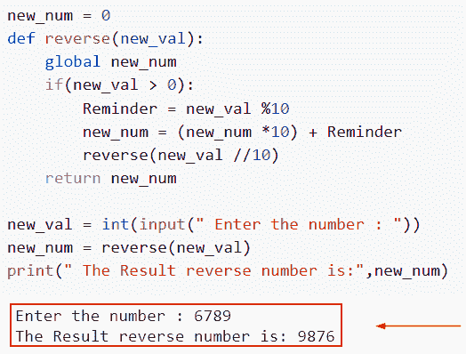

Reverse a number in Python using recursion

这是如何在 Python 中通过使用递归方法来反转一个数字。

阅读: [Python 命名约定](https://pythonguides.com/python-naming-conventions/)

## 在 Python 中使用内置函数反转一个数字

*   这里我们讨论如何使用 Python 中的内置函数来反转一个数字。
*   Python 中具有预定义功能的函数称为内置函数。Python 解释器上随时都有各种函数可供使用。
*   在这个例子中，我们将使用 Python 中提供的 reversed()内置函数，Python 有一个名为 reversed 的内置方法，它返回一个已被反转的序列的迭代器。

**举例**:

让我们举一个例子，并检查如何通过使用内置函数在 Python 中反转一个数字。

**源代码**:

```py
def new_number(m):  
   result = ''.join(reversed(m))
   return result

new_val = input('Enter the value: ')
# Display the result
print('Reverse number is:', new_number(new_val))
```

你可以参考下面的截图

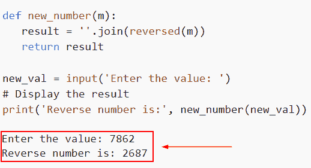

Reverse a number in Python using an inbuilt function

在这个例子中，我们已经了解了如何通过使用内置函数来反转 Python 中的数字。

阅读: [Python 添加示例](https://pythonguides.com/python-addition/)

## 使用切片在 Python 中反转一个数字

*   在这种方法中，我们将使用字符串切片技术反转数字。首先将数字转换为字符串，然后使用 Python 语言的字符串切片功能将字符串分割并以相反的顺序相加。我们将对给定的整数输入执行以下操作。
*   将数字的格式更改为字符串，然后利用字符串切片来反转数字。
*   通过使用这种技术，我们可以使用字符串切片方法来反转一个数字。在 Python 中，切片是检索字符串的子串的过程。

**举例**:

让我们举一个例子，检查如何通过使用切片方法在 Python 中反转一个数字。

```py
new_num = 73485
str_val = str(new_num)
m = len(str_val )
result = str_val [m::-1]

#output reversed number
print("Reversed Number is:", result)
```

下面是以下给定代码的实现

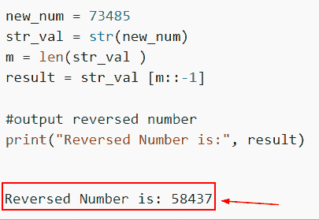

Reverse a number in Python using slicing

正如你在截图中看到的，我们已经学习了如何使用切片方法在 Python 中反转一个数字。

阅读:[解析 Python 时意外的 EOF](https://pythonguides.com/unexpected-eof-python/)

## 如何反转 Python 中的数字顺序

*   在这一节中，我们将讨论如何在 Python 中反转数字的顺序。
*   通过将输入变量从输入数字的后面移到前面，可以反转数字。当一个数反转时，它的数字排列是第一个数字在前，最后一个数字在后，倒数第二个数字在后，以此类推，最后一个数字在最后。

**举例**:

```py
input_number = '5678'

result = ''
for m in range(len(input_number), 0, -1):
   result += input_number[m-1]
print('The reverse number is =', result)
```

你可以参考下面的截图

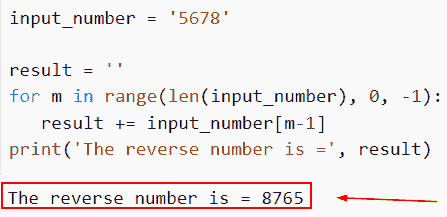

How to reverse the order of numbers in Python

在这个例子中，我们已经理解了如何在 Python 中反转数字的顺序。

阅读: [Python 对于基数为 10 的 int()无效文字](https://pythonguides.com/python-invalid-literal-for-int-with-base-10/)

## 在 Python 中反转列表中的数字

*   在这种技术中，我们利用了 Python 中的列表提供 reverse()方法来翻转列表元素的事实。
*   因此，使用 Python 的 list()函数，我们只需将我们的数字添加到列表中，反转它们以获得相反的顺序，然后将它们合并以获得最终的反转数字。
*   要将一个字符串与一个 iterable 对象结合起来，可以使用 Python 的 join()函数。结果，iterable 的字符串被连接起来创建一个全新的字符串。如果 iterable 包含任何非字符串值，它将引发 TypeError 异常。

示例:

```py
new_num = "9432"
# Convert input num into list
new_lis = list(new_num)
# By using the reverse() method
new_lis .reverse()
#converting list into number
new_num = ''.join(new_lis )
print (" Result of input number is: ", new_num)
```

下面是以下给定代码的输出。

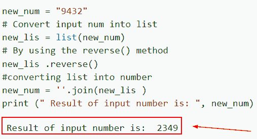

Reverse a number in a list in Python

这就是我们如何在 Python 中创建列表中的反向数字。

阅读:[Python 中的注释行](https://pythonguides.com/comment-lines-in-python/)

## 反转一个数字，检查它是否是 Python 中的回文

*   回文是由字母组成的一个单词或一组数字，当向前和向后阅读时，这些字母拼成同一个单词。Python 回文允许回文单词中包含标点、符号、字母和空格。
*   当反转时，一个数必须保持不变，才有资格成为回文。如果数字不等于它本身的倒数，它就不是一个回文。

**举例**:

```py
new_val=input(("Enter the value:"))
new_reverse = int(str(new_val)[::-1])

if new_val == new_reverse:
  print('It is Not Palindrome')
else:
  print("It is Palindrome")
```

下面是以下代码的截图

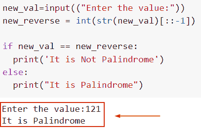

Reverse a number and check if it is a palindrome in Python

阅读: [Python 检查变量是否为整数](https://pythonguides.com/python-check-if-the-variable-is-an-integer/)

## Python 中的反向字符

*   在这一节中，我们将讨论如何在 Python 中反转一个字符或字符串。
*   在本例中，我们将创建一个向后移动并从字符串末尾开始的切片。
*   在这种情况下，片段短语[::-1]表示向后移动一步，从位置 0 开始，到字符串的末尾结束。

**举例**:

```py
new_char = "USA" [::-1]
print(new_char)
```

下面是以下给定代码的实现

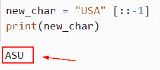

Reverse character in Python

另外，看看更多的 Python 教程。

*   [如何在 Python 中从路径中获取文件名](https://pythonguides.com/python-get-filename-from-the-path/)
*   [在 Python 中检查一个字符串是否包含子串](https://pythonguides.com/check-if-a-string-contains-a-substring-in-python/)
*   [面向对象编程 python](https://pythonguides.com/object-oriented-programming-python/)
*   [如何在 Python 中寻找完全数](https://pythonguides.com/perfect-number-in-python/)
*   [Python 读取 CSV 文件并写入 CSV 文件](https://pythonguides.com/python-read-csv-file/)

在本文中，我们将讨论如何在 Python 中反转一个数字。此外，我们还将讨论以下主题。

*   在 python 中反转数字
*   使用 for 循环反转 Python 中的数字
*   在不使用 for 循环的情况下在 Python 中反转一个数字
*   在 Python 中使用函数反转数字
*   使用 while 循环反转 Python 中的数字
*   使用递归在 Python 中反转一个数字
*   在 Python 中使用内置函数反转一个数字
*   不使用内置函数在 Python 中反转一个数字
*   在 Python 中使用切片反转一个数字
*   如何在 Python 中反转数字的顺序
*   在 Python 中反转列表中的数字
*   反转一个数字，检查它是否是 Python 中的回文
*   Python 中的反向字符

[Arvind](https://pythonguides.com/author/arvind/)

Arvind 目前是 TSInfo Technologies 的高级 Python 开发人员。他精通 Python 库，如 NumPy 和 Tensorflow。