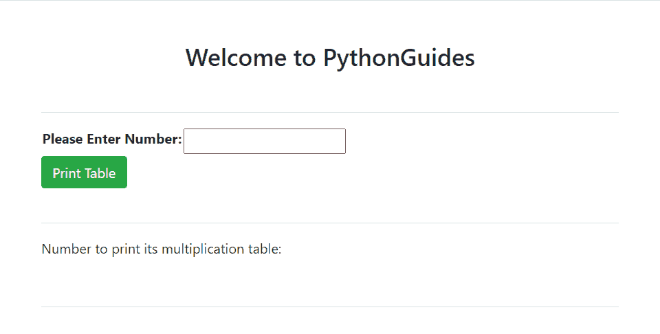
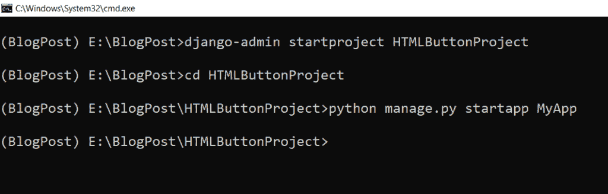
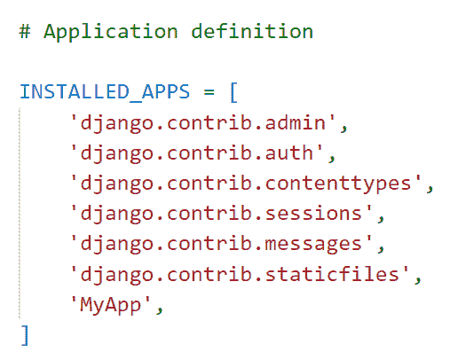
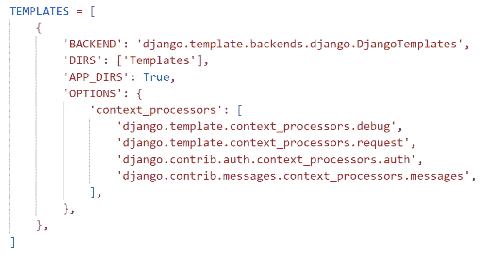
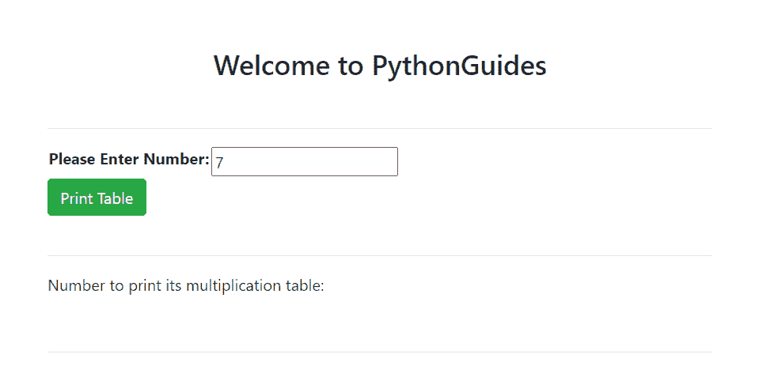
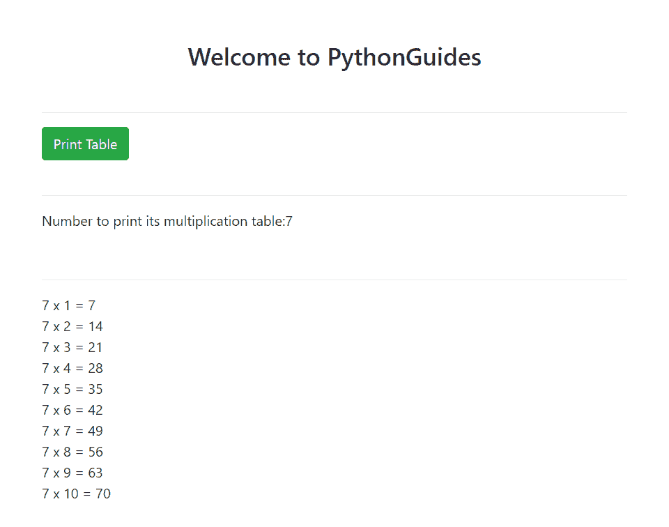

# 点击 Django 中的 HTML 按钮运行 Python 函数

> 原文：<https://pythonguides.com/run-python-function-by-clicking-on-html-button-in-django/>

[](https://sharepointsky.teachable.com/p/python-and-machine-learning-training-course)

在本 [Python Django 教程](https://pythonguides.com/what-is-python-django/)中，我将讲解如何通过点击 DjangoT5 中的 HTML 按钮来运行 ***python 函数。***

在进行 Django 项目时，我需要一个 HTML 按钮来调用 python 函数。所以，我做了研究，并最终创建了一个 HTML 按钮，点击打印表乘法。

所以，在这里我们会看到:

*   如何在 Django 建立项目
*   如何在 Django 中创建 HTML 按钮来执行 python 函数
*   通过点击 Django 中的 HTML 按钮运行 Python 函数来获得乘法表
*   如何在 Django 模板标签中使用 for 循环
*   如何在 Django 中使用范围函数
*   使用 FormClass 创建 Django 表单

在本文的最后，您可以通过点击一个 HTML 按钮来下载执行 python 脚本的代码。

这是我们将在这里建造的。



Run Python function by clicking on HTML Button in Django to get multiplication table

目录

[](#)

*   [点击 Django 中的 HTML 按钮运行 Python 函数](#Run_Python_function_by_clicking_on_HTML_Button_in_Django "Run Python function by clicking on HTML Button in Django")
*   [点击 Django 中的 HTML 按钮，下载运行 Python 函数的完整代码](#Download_the_complete_code_to_Run_Python_function_by_clicking_on_HTML_Button_in_Django "Download the complete code to Run Python function by clicking on HTML Button in Django")
*   [结论](#Conclusion "Conclusion")

## 点击 Django 中的 HTML 按钮运行 Python 函数

现在，让我们一步一步地看看如何在 Django 中点击按钮运行 Python 函数并显示表乘法。

#### 建立 Django 项目

首先，我们需要使用下面给出的命令在 Django 中建立一个项目。这里 `HTMLButtonProject` 是项目的名称。

```py
django-admin startproject HTMLButtonProject
```

在 Django 项目中，使用如下命令创建一个名为 `MyApp` 的 Django 应用程序。

```py
python manage.py startapp MyApp
```



Set Up Django Project

打开项目目录下的 `settings.py` 文件，将 `MyApp` 添加到 `INSTALLED_APP` 列表中。



Install MyApp

Django 中的请求首先到达位于项目目录中的 `urls.py` ，然后到达 app 目录中 urls.py 中的匹配 URL。在其中添加下面的代码。

```py
from django.contrib import admin
from django.urls import path,include

urlpatterns = [
    path('admin/', admin.site.urls),
    path('',include('MyApp.urls')),
]
```

此外，检查:Django 中的应用程序和项目之间的[差异](https://pythonguides.com/django-app-vs-project/)

#### 创建 Django 表单

创建 Django 表单， `MyApp` 应用程序将使用该表单从用户处接收数字输入。将以下代码添加到我们在 app 目录中创建的 `forms.py` 文件中。

```py
from django import forms

class TableForm(forms.Form):
    num = forms.IntegerField(label='Please Enter Number:')
```

这里，我们使用**表单创建一个表单。表单**类命名为**表格表单**。它有**号**作为 Django **整数字段**。此外，我们通过传递 `label` 关键字来更改它的标签。

#### 点击 Django 中的 HTML 按钮运行 Python 函数，得到乘法表

在主项目目录中创建一个名为 `Templates` 的子目录来存储 Django 应用程序的 HTML 文件。

打开 `settings.py` 文件，更新 `DIRS` 指向 Templates 文件夹的位置。



Set Templates Folder Location

要在 HTML 按钮 click 上定义表格乘法函数的前端，在**模板**文件夹中创建一个名为`home.html`的 HTML 文件。并添加下面的代码。

```py
<!DOCTYPE html>
<html lang="en">

<head>
    <meta charset="UTF-8">
    <meta http-equiv="X-UA-Compatible" content="IE=edge">
    <meta name="viewport" content="width=device-width, initial-scale=1.0">
    <title>Table Multiplication</title>

    <!-- Bootstrap CSS -->
    <link rel="stylesheet" href="https://cdn.jsdelivr.net/npm/bootstrap@4.0.0/dist/css/bootstrap.min.css"
        integrity="sha384-Gn5384xqQ1aoWXA+058RXPxPg6fy4IWvTNh0E263XmFcJlSAwiGgFAW/dAiS6JXm" crossorigin="anonymous">

</head>

<body>
    <div class="mt-md-5">
        <div class="pl-sm-5">
            <div class="pr-sm-5">
                <h3 align="center">Welcome to PythonGuides</h3>
                <br>
                <hr>
                <form method="POST">
                    
                    <table>
                        {{ form.as_table }}
                    </table>
                    <button type="submit" class="btn btn-success">Print Table</button>
                </form>
                <br>
                <hr>
                <p>Number to print its multiplication table:{{Number}}</p>
                <br>
                <hr>
                
                {{ Number }} x {{x}} =  <br>
                
            </div>
        </div>
    </div>

    <!-- jQuery first, then Popper.js, then Bootstrap JS -->
    <script src="https://code.jquery.com/jquery-3.2.1.slim.min.js"
        integrity="sha384-KJ3o2DKtIkvYIK3UENzmM7KCkRr/rE9/Qpg6aAZGJwFDMVNA/GpGFF93hXpG5KkN"
        crossorigin="anonymous"></script>
    <script src="https://cdn.jsdelivr.net/npm/popper.js@1.12.9/dist/umd/popper.min.js"
        integrity="sha384-ApNbgh9B+Y1QKtv3Rn7W3mgPxhU9K/ScQsAP7hUibX39j7fakFPskvXusvfa0b4Q"
        crossorigin="anonymous"></script>
    <script src="https://cdn.jsdelivr.net/npm/bootstrap@4.0.0/dist/js/bootstrap.min.js"
        integrity="sha384-JZR6Spejh4U02d8jOt6vLEHfe/JQGiRRSQQxSfFWpi1MquVdAyjUar5+76PVCmYl"
        crossorigin="anonymous"></script>
</body>

</html>
```

*   首先，通过在任何其他样式表之前添加样式表到页面标题的链接来加载 CSS。
*   然后，分别使用 **div 类 mt-md-5** 、 **div 类 pl-sm-5** 和 **div 类 pr-sm-5** 来添加引导填充和间距。
*   为了构建我们用来从用户输入数字的表单，我们使用了带有 `POST` 方法的 `form` 标签。然后，使用 `csrf_token` 保护表单免受网络攻击，使用 `form.as_table` 以表格格式呈现表单字段。
*   添加一个**提交**按钮来打印乘法表。并且，使用 `p` 标签打印乘法表。然后，我们将使用循环的**从序列中一次获取一个值。**
*   然后，我们使用这个单一值来获得输入数字的表乘法。为了得到表格乘法，我们使用了一个 `widthratio` 过滤器，在过滤器中，( `Number 1 x` )的意思就是(Number * x)。
*   另外，我们使用 `h3` 、 `br` 和 `hr` 标签分别添加标题、换行和水平线。

阅读: [Python Django 表单验证](https://pythonguides.com/django-form-validation/)

#### 定义视图

要定义主逻辑，打开 `views.py` 文件并添加下面给出的代码。

```py
from django.shortcuts import render
from .forms import TableForm

# Create your views here.

def html_button(request):
    if request.method == "POST":  
        form = TableForm(request.POST)  
        if form.is_valid():  
            num = form.cleaned_data['num']
            return render(request, 'home.html', {'Number':num, 'range': range(1,11)})
    else:  
        form = TableForm()  
    return render(request,'home.html',{'form':form})
```

*   首先，从 `forms.py` 中导入 `TableForm` 并创建一个名为 `html_button` 的视图。
*   然后调用 `if` 语句，检查请求方法是否为 `POST` 。
    *   如果是，我们通过 **TableForm(请求。POST)** 将数据绑定到表单类，这样我们就可以进行验证。
    *   现在，调用 `is_valid` 方法来验证用户输入的内容，如果验证成功，调用表单**cleaned _ data[‘表单域’]**来验证数据。
    *   用 `num` 和 `range()` 函数返回`home.html`，通过传递给 `render` 函数得到一个从 1 到 10 的数字列表。
*   如果请求方法是 `GET` ，用户将看到一个空白的输入字段，使用 `render()` 函数输入数字。

现在，我们必须用 URL 映射视图以便调用它，因此我们必须在 app 目录中创建一个名为 `urls.py` 的文件。包括下面的代码。

```py
from django.urls import path
from . import views

urlpatterns = [
path('', views.html_button, name='htmlbutton'),
]
```

阅读: [Python Django app 上传文件](https://pythonguides.com/django-app-upload-files/)

#### 执行 Django 应用程序

要启动开发服务器，请在终端中键入下面给出的命令并运行服务器。

```py
python manage.py runserver
```

它成功地打开了用于做表乘法的网页，如下所示。


Run Python Function on HTML Button Click

现在，填写您要打印其表格的号码，然后单击“打印表格”按钮。



Table Multiplication Web Page

例如，我在这里输入数字 7，单击打印表格按钮，它将打印 7 的表格。



HTML Button Click Python

这就是我们如何通过使用 Django 点击 HTML 按钮来运行 Python 函数。

## 点击 Django 中的 HTML 按钮，下载运行 Python 函数的完整代码

代码如下:

[Execute Python Function on HTML Button click](https://pythonguides.com/wp-content/uploads/2022/12/HTMLButtonProject.zip)

## 结论

这样，我们就成功地创建了一个 Python 函数，它将在单击 HTML 按钮时执行。我们还学习了使用 form 类创建一个表单，该表单将接受用户在 integer 字段中的输入。

此外，我们还讨论了以下主题

*   如何在 Django 建立项目
*   如何在 Django 中创建 HTML 按钮来执行 python 函数
*   通过点击 Django 中的 HTML 按钮运行 Python 函数来获得乘法表
*   如何在 Django 模板标签中使用 for 循环
*   如何在 Django 中使用范围函数
*   使用 FormClass 创建 Django 表单

另外，请查看以下关于 Python Django 的教程

*   [用电子邮件建立 Django 联系表单](https://pythonguides.com/build-a-django-contact-form-with-email/)
*   [使用 PostgreSQL 的 Django CRUD 示例](https://pythonguides.com/django-crud-example-with-postgresql/)
*   [Django 联系表，带有基于类的视图](https://pythonguides.com/django-contact-form-with-class-based-views/)

[Bijay Kumar](https://pythonguides.com/author/fewlines4biju/)

Python 是美国最流行的语言之一。我从事 Python 工作已经有很长时间了，我在与 Tkinter、Pandas、NumPy、Turtle、Django、Matplotlib、Tensorflow、Scipy、Scikit-Learn 等各种库合作方面拥有专业知识。我有与美国、加拿大、英国、澳大利亚、新西兰等国家的各种客户合作的经验。查看我的个人资料。

[enjoysharepoint.com/](https://enjoysharepoint.com/)[](https://www.facebook.com/fewlines4biju "Facebook")[](https://www.linkedin.com/in/fewlines4biju/ "Linkedin")[](https://twitter.com/fewlines4biju "Twitter")