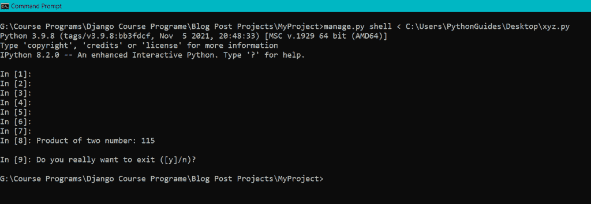

# 在 Django 中运行 Python 脚本

> 原文：<https://pythonguides.com/run-python-script-in-django/>

[](https://sharepointsky.teachable.com/p/python-and-machine-learning-training-course)

当您有了一种处理 web 开发和 Python 的新方法时，您可能偶尔需要在一个 [Django](https://pythonguides.com/how-to-install-django/) 项目或 shell 中运行 Python 脚本。有多种方法可以做到这一点。在本文中，我们将研究运行 Python 脚本的各种 Django 方法。还有，我已经讲了这几点:—

*   如何使用 shell 在 Django 项目中运行 Python 脚本
*   如何使用 execfile 在 Django 中运行 Python 脚本
*   如何使用扩展包在 Django 中运行 Python 脚本

目录

[](#)

*   [使用 shell 在 Django 项目中运行 Python 脚本](#Run_Python_Script_in_Django_Project_using_shell "Run Python Script in Django Project using shell")
    *   [运行 Python 脚本和管理文件位于同一个文件夹](#Run_Python_Script_and_Manage_File_are_located_in_the_same_folder "Run Python Script and Manage File are located in the same folder")
    *   [运行 Python 脚本并管理位于不同文件夹的文件](#Run_Python_Script_and_Manage_File_located_in_different_folders "Run Python Script and Manage File located in different folders")
*   [使用 execfile 在 Django 中运行 Python 脚本](#Run_Python_Script_in_Django_using_execfile "Run Python Script in Django using execfile")
*   [如何使用扩展包在 Django 中运行 Python 脚本](#How_to_run_Python_Script_in_Django_using_extension_package "How to run Python Script in Django using extension package")
    *   [结论](#Conclusion "Conclusion")

## 使用 shell 在 Django 项目中运行 Python 脚本

我们先来了解一下什么是 Python 脚本。

打算立即执行的 Python 文件被称为脚本。当你运行它的时候，它应该立即行动。因此，脚本经常包含在任何类或函数的参数之外编写的代码。

### 运行 Python 脚本和管理文件位于同一个文件夹

现在，让我们学习使用 shell 在 Django 项目中运行 Python 脚本。

*   首先，使用下面给出的命令在 Django 中创建一个项目(名为*“my project”*)。

```py
django-admin startproject MyProject
```

*   现在，在 Django 项目的 *manage.py* 文件所在的同一个文件夹中创建一个 python 文件(名为 *"sample.py"* )。

```py
# Program to add two numbers
# Define number
num1 = 15
num2 = 26
# Add number
result = num1 + num2
# Print result
print('Sum of the two number:', result)
```

这里，我们定义了 *num1* 和 *num2* 两个具有整型值的变量。接下来，我们使用 *+* 操作符定义将 num1 和 num2 相加的结果变量。最后调用 *print()* 函数打印两个数之和。

*   导航到 Django 项目的根文件夹，其中有 *manage.py* 文件。


Navigate to the manage.py file folder

*   键入下面给出的命令，使用 shell 在 Django 项目中运行 Python 脚本 *"sample.py"* 。

```py
manage.py shell < sample.py
```


Run Python Script in Django Project

当 Python 脚本和管理文件位于同一个文件夹中时，这就是如何使用 shell 在 Django 项目中运行 Python 脚本。

阅读: [Python 列表追加 Django](https://pythonguides.com/python-list-append-django/)

### 运行 Python 脚本并管理位于不同文件夹的文件

现在，让我们学习使用 shell 在 Django 项目中运行 Python 脚本。

*   首先，使用下面给出的命令在 Django 中创建一个项目(名为*“my project”*)。

```py
django-admin startproject MyProject
```

*   现在，在任何其他位置创建一个 python 文件(名为 *"xyz.py"* )。

```py
# Program to multiple two numbers
# Define number
num1 = 23
num2 = 5
# Multiply number
result = 23 * 5
# Print result
print('Product of two number:'. result)
```

这里，我们定义了 *num1* 和 *num2* 两个具有整型值的变量。接下来，我们使用 *** 运算符定义将 num1 和 num2 相乘的*结果*变量。最后调用 *print()* 函数打印两个数的乘积。

*   导航到 Django 项目的根文件夹，其中有 *manage.py* 文件。
*   键入下面给出的命令，使用 shell 在 Django 项目中运行 Python 脚本“xyz.py”。

```py
manage.py shell < C:\Users\PythonGuides\Desktop\xyz.py
```



Run Python Script in Django Project

这就是当 Python 脚本和管理文件不在同一个文件夹中时，如何使用 shell 在 Django 项目中运行 Python 脚本。

阅读: [Python Django 连接字符串](https://pythonguides.com/django-concatenate-string/)

## 使用 execfile 在 Django 中运行 Python 脚本

我们先来了解一下什么是 execfile。

execfile 或 exec 是评估文件内容的 python 方法。

现在，让我们学习使用 execfile 在 Django 项目中运行 Python 脚本。

*   首先，使用下面的命令在 Django 中创建一个名为*“my project”*的项目。

```py
django-admin startproject MyProject
```

*   现在，在您选择的任何位置创建一个 python 文件(名称为*“ABC . py”*)。

```py
# Python program to swap two variables
# To take inputs from the user
a = input('Enter value of x: ')
b = input('Enter value of y: ')

# create a temporary variable and swap the values
temp = a
a = b
b = temp

# Print the result
print('The value of a after swapping: {}'.format(a))
print('The value of b after swapping: {}'.format(b)) 
```

这里，我们定义了两个名为 *a* 和 *b* 的变量，它们通过 *input()* 方法接受用户输入。然后将第一个变量 *a* 的值存储在临时变量 *temp* 中。

然后将第二个变量 *b* 的值赋给变量 *a* 。最后，通过给变量 *b* 赋予临时变量 *temp* 给定值，我们完成了在两个变量之间交换值的过程。

使用 *print()* 方法最终打印交换的值。

*   导航到 Django 项目的根文件夹，其中有 *manage.py* 文件。

*   现在，通过键入下面给出的命令登录 Django shell。

```py
manage.py shell
```

*   键入下面给出的命令，使用 execfile 在 Django 项目中运行 Python 脚本 *"abc.py"* 。

```py
exec(open(''C:/Users/PythonGuides/Desktop/abc.py'').read()) 
```


Run Python Script in Django Project

这就是当 Python 脚本和管理文件位于任何位置时，如何使用 exec 在 Django 项目中运行 Python 脚本。

阅读: [Python Django MySQL CRUD](https://pythonguides.com/python-django-mysql-crud/)

## 如何使用扩展包在 Django 中运行 Python 脚本

有时候你对网站开发有新的想法，但是我们对此并不确定。这个新想法可以是任何脚本，包括数据加载、处理和清理。

因此，实现业务逻辑的理想方式通常不是直接将其放在视图或模型中。此时，您可以将 Django 扩展作为一个包安装，这样就可以运行额外的脚本。

现在，让我们学习使用扩展包在 Django 项目中运行 Python 脚本。

*   如您所知，Django 扩展是一个允许您运行额外脚本的包。你必须先用 pip 安装它。打开终端窗口并键入。

```py
pip install django-extensions
```


Install django-extensions

*   通过在终端中键入下面给出的命令，创建一个 Django 项目*“Course”*。

```py
django-admin startproject Course
```

*   通过在终端键入以下命令，在 Django 项目中创建一个 Django 应用程序*“Register”*。

```py
python manage.py startapp Register
```

*   在位于 *settings.py* 文件的已安装 app 列表中添加*“DJ nago-extensions”*包和*“注册”* app。


Settings.py

*   默认情况下，Django 在项目下有一个 *urls.py* 文件。Django 建议将新创建的应用程序*“注册”*映射到其中。

```py
from django.contrib import admin
from django.urls import path, include

urlpatterns = [
    path("admin/", admin.site.urls),
    path('', include('Register.urls'))
] 
```

*   创建 Django 模型，定义我们将要存储的*“Register”*应用程序数据的字段和行为。在 Django app 中打开 *models.py* 文件，添加下面的代码。

```py
from django.db import models

# Create your models here.

class CourseRegister(models.Model):
    title = models.CharField(max_length = 500)
    author = models.CharField(max_length=200)

    def __str__(self):
        return self.author 
```

在这里，我们创建了模型类*“course register”*，它具有以下数据库字段。

*   **标题:**博文的标题。
*   **作者:**写帖子的人。

并使用 *def __str__(self)* 来更改 Django 模型中对象的显示名称。当我们返回*自己的作者*时，它将呈现作者的名字。

*   要在管理站点注册一个模型*“course register”*，打开 *admin.py* 文件并添加下面给出的代码。

```py
# Register your models here.
from django.contrib import admin
from .models import CourseRegister

admin.site.register(CourseRegister)
```

*   为了映射视图，在 app 目录下创建一个 *urls.py* 文件，并在其中添加下面给出的代码。

```py
from django.urls import path
from Register import views

urlpatterns = [
    path('', views.home, name='home'),
]
```

*   视图是接收 web 请求并返回 web 响应的 Python 函数或类。将下面给出的代码添加到 app 目录下的 *views.py* 文件中。

```py
from django.shortcuts import render

# Create your views here.
def home():
    print('Hello') 
```

*   要为模型创建一个迁移，使用下面给出的命令。在迁移文件夹中，将创建一个迁移文件。

```py
python manage.py makemigrations
```

*   创建一个迁移，然后迁移它以反映数据库。下面是 migrate 命令。

```py
python manage.py migrate
```

*   要创建超级用户，请在终端中键入以下命令。

```py
python manage.py createsuperuser
```

*   要在*“course register”*模型中添加记录，请打开管理应用程序并添加它。


Admin Site

*   在项目目录中创建一个*脚本*文件夹来添加额外的 Python 脚本。
*   创建 *__init__。脚本文件夹中的 py* 文件，表明脚本也是 Django 项目的一部分。
*   创建一个新文件 *"sample.py"* ，它将包含您需要执行的代码。在其中添加下面给出的代码。

```py
from Register.models import CourseRegister

def run():
    result = CourseRegister.objects.all()
    print(result)
```

为了在运行服务器之前从 *CourseRegister* 模型中获取所有对象，我们创建了这个额外的脚本，它有一个函数 *run* 。

*   现在，通过键入下面给出的命令运行脚本 *sample* 。

```py
python manage.py runscript sample
```


Run Script

这就是如何使用扩展包在 Django 中运行 Python 脚本。

您可能也喜欢阅读下面的 Python Django 教程。

*   模型 Django 上的联合操作
*   [在 Python Django 中登录系统](https://pythonguides.com/login-system-in-python-django/)
*   [Python Django 随机数](https://pythonguides.com/django-random-number/)
*   [Python 改 Django 版本](https://pythonguides.com/python-change-django-version/)

### 结论

在本文中，我们从 Django 学习了三种不同的运行 Python 脚本的方法。此外，我们还讨论了以下主题。

*   如何使用 shell 在 Django 项目中运行 Python 脚本
*   如何使用 execfile 在 Django 中运行 Python 脚本
*   如何使用扩展包在 Django 中运行 Python 脚本

[Tanya Puri](https://pythonguides.com/author/tanya/)

拥有丰富 Django 和 Matplotlib 经验的 Python 开发人员，目前在 TSInfo Technologies 工作。我正在成为专业程序员、博客写手和 YouTuber 的路上。