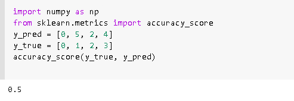
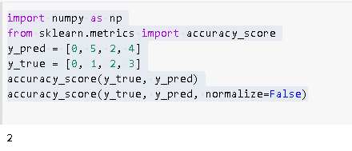
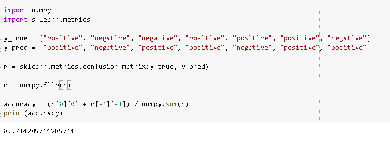

# Scikit 学习准确性 _ 分数

> 原文：<https://pythonguides.com/scikit-learn-accuracy-score/>

[](https://sharepointsky.teachable.com/p/python-and-machine-learning-training-course)

在本 [Python 教程](https://pythonguides.com/learn-python/)中，我们将了解 python 中的**sci kit learn accuracy _ score，我们还将涵盖与`sci kit learn accuracy _ score`相关的不同示例。我们将讨论这些话题。**

*   scikit 学习准确性 _ 分数
*   scikit 学习准确性 _ 分数示例
*   scikit 如何学习 accuracy_score 的工作原理

目录

[](#)

*   [Scikit 学习准确度 _ 分数](#Scikit_learn_accuracy_score "Scikit learn accuracy_score")
*   [scikit 学习准确性 _ 分数示例](#scikit_learn_accuracy_score_examples "scikit learn accuracy_score examples")
*   [scikit 如何学习 accuracy_score 的工作原理](#How_scikit_learn_accuracy_score_works "How scikit learn accuracy_score works")

## Scikit 学习准确度 _ 分数

`accuracy_score` 方法用于计算 Python [Scikit learn](https://pythonguides.com/what-is-scikit-learn-in-python/) 中正确预测的派系或计数的准确度。

从数学上来说，它代表了所有预测中真阳性和真阴性之和的比率。

```py
Accuracy Score = (TP+TN)/ (TP+FN+TN+FP)
```

在这里，我们还可以借助 sklearn 的 accuracy_score 方法来计算准确度。

```py
accuracy_score(y_true, y_pred, normalize=False)
```

在多标签分类中，函数返回子集精度。如果样本的整个预测标签集与真实标签集精确匹配。那么子集的精度是 1.0，否则，它的精度几乎是 0.0。

**语法:**

```py
sklearn.metrics.accuracy_score(y_true,y_pred,normalize=False,sample_weight=None)
```

**参数:**

*   **y_true:** 标签指示数组/稀疏矩阵正确标签。
*   **y_pred:** 分类器返回的标签指示数组/稀疏矩阵预测标签。
*   **规格化:**包含布尔值(真/假)。如果为假，则返回正确机密样本的数量。否则，它返回正确机密样本的分数。

**退货:**

**分数:浮动**

*   如果 normalize == True，则返回正确机密样本的数量(float)，否则返回正确机密样本的数量(int)。
*   最佳性能是归一化==真时的 1，归一化==假时的样本数。

我们也可以用以下方式编写 accure_score:

```py
accuracy_score(
 y_true,
 y_pred,
 normalize: bool=True,
 sample_weight:__class__ =None
)
```

阅读[sci kit-学习逻辑回归](https://pythonguides.com/scikit-learn-logistic-regression/)

## scikit 学习准确性 _ 分数示例

正如我们所知，scikit learn library 用于专注于数据建模，而不是专注于加载和操作数据。这里我们可以使用 scikit learn accuracy_score 来计算数据的准确性。

**例 1:**

在这个例子中，我们可以看到

*   **y_pred = [0，5，2，4]** 作为我们可以选择的预测值。
*   **y_true = [0，1，2，3]** 用作已经给定的真值。
*   **accuracy_score(y_true，y_pred)** 用于检查真值和预测值的 accuracy_score。

```py
 import numpy as np
 from sklearn.metrics import accuracy_score
 y_pred = [0, 5, 2, 4]
 y_true = [0, 1, 2, 3]
 accuracy_score(y_true, y_pred)
```

**输出:**

运行上面的代码后，我们得到了下面的输出，我们可以看到这里的归一化值为真，由此我们得到了浮点值。



scikit learn accuracy score example

**例 2:**

在这个**例子**中，我们可以看到:

*   如果 normalize == False，则返回正确的置信度样本数(int)。
*   **y_pred = [0，5，2，4]** 作为我们可以选择的预测值。
*   **y_true = [0，1，2，3]** 用作已经给定的真值。

*   **accuracy_score(y_true，y_pred，normalize=False)** 用于检查真值和预测值的 accuracy_score。

```py
import numpy as np
from sklearn.metrics import accuracy_score
y_pred = [0, 5, 2, 4]
y_true = [0, 1, 2, 3]
accuracy_score(y_true, y_pred)
accuracy_score(y_true, y_pred, normalize=False)
```

**输出:**

运行上述代码后，我们得到以下输出，其中我们可以看到 true_value 和 predicted_value 的准确性得分。



scikit learn accuracy score normalize example

Read [Scikit-learn Vs Tensorflow](https://pythonguides.com/scikit-learn-vs-tensorflow/)

## scikit 如何学习 accuracy_score 的工作原理

sci kit learn`accuracy_score`使用多标签分类，其中 accuracy _ score 函数计算子集准确度。

*   为样本预测的标签集必须与 `y_true` 中的相应标签集完全匹配。
*   定义模型如何执行所有类的准确性。如果所有的类都同等重要，这是很有用的。
*   模型的准确性计算为正确预测数与预测总数之间的比率。

**代码:**

在下面的代码中，我们导入了两个库 `import numpy` 和 `import sklearn.metrics` ，用于预测模型的准确性。

*   **y_true = ["正"、"负"、"正"、"正"、"正"、"负"]** 这是模型的真值。
*   **y_pred = ["正"，"负"，"正"，"正"，"负"，"正"，**"正"]该模型的预测值。
*   精度= (r[0][0] + r[-1][-1]) / numpy。 `sum(r)` 用于计算模型的精度 csore。
*   `print(accuracy)` 用于在屏幕上打印 accuracy_score。

```py
import numpy 
import sklearn.metrics

y_true = ["positive", "negative", "negative", "positive", "positive", "positive", "negative"]
y_pred = ["positive", "negative", "positive", "positive", "negative", "positive", "positive"]

r = sklearn.metrics.confusion_matrix(y_true, y_pred)

r = numpy.flip(r)

accuracy = (r[0][0] + r[-1][-1]) / numpy.sum(r)
print(accuracy)
```

**输出:**

在运行上面的代码之后，我们得到了下面的输出，我们可以看到模型的准确度分数被打印在屏幕上。



How scikit learn accuracy score works

`sklearn.metrics` 有函数 `accuracy_score()` 可以用来计算准确度。

```py
accuracy = sklearn.metrics.accuracy_score(y_true, y_pred)
```

您可能还喜欢:

*   [Scikit 学习决策树](https://pythonguides.com/scikit-learn-decision-tree/)
*   [Scikit 学岭回归](https://pythonguides.com/scikit-learn-ridge-regression/)
*   [Scikit 学习分类教程](https://pythonguides.com/scikit-learn-classification/)
*   [Scikit 学习隐马尔可夫模型](https://pythonguides.com/scikit-learn-hidden-markov-model/)
*   [Scikit 学习层次聚类](https://pythonguides.com/scikit-learn-hierarchical-clustering/)

因此，在本教程中，我们讨论了在 `python` 中的`sci kit learn accuracy _ score`，我们还涵盖了与其实现相关的不同示例。这是我们已经讨论过的例子列表。

*   scikit 学习准确性 _ 分数
*   scikit 学习准确性 _ 分数示例
*   scikit 如何学习 accuracy_score 的工作原理

[Bijay Kumar](https://pythonguides.com/author/fewlines4biju/)

Python 是美国最流行的语言之一。我从事 Python 工作已经有很长时间了，我在与 Tkinter、Pandas、NumPy、Turtle、Django、Matplotlib、Tensorflow、Scipy、Scikit-Learn 等各种库合作方面拥有专业知识。我有与美国、加拿大、英国、澳大利亚、新西兰等国家的各种客户合作的经验。查看我的个人资料。

[enjoysharepoint.com/](https://enjoysharepoint.com/)[](https://www.facebook.com/fewlines4biju "Facebook")[](https://www.linkedin.com/in/fewlines4biju/ "Linkedin")[](https://twitter.com/fewlines4biju "Twitter")