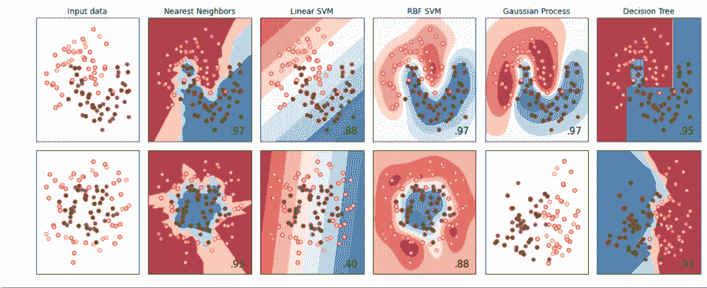
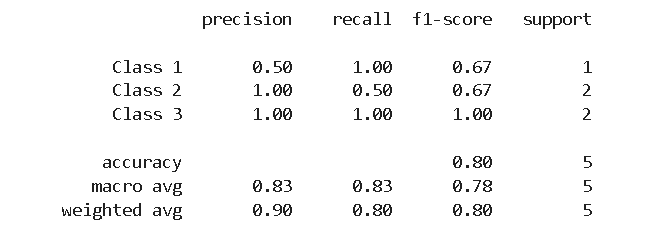
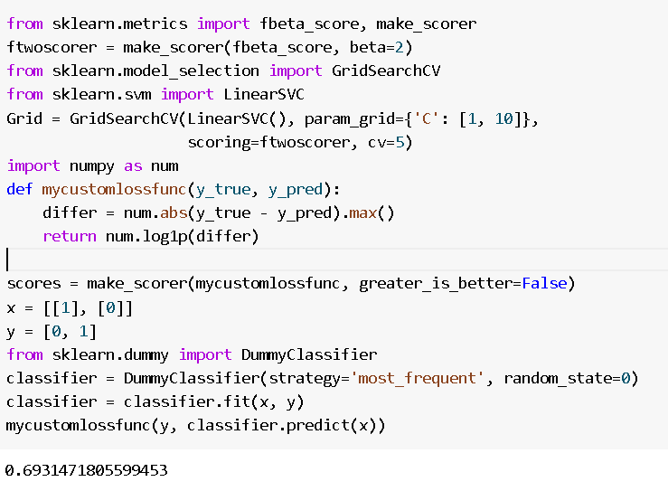
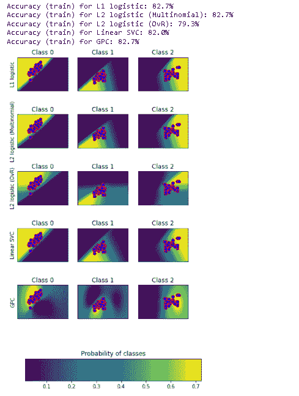
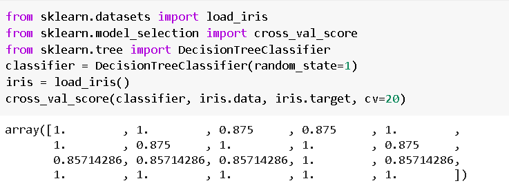
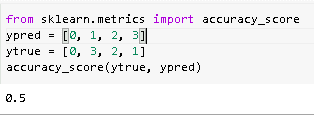
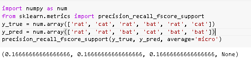

# Scikit 学习分类教程

> 原文：<https://pythonguides.com/scikit-learn-classification/>

[](https://sharepointsky.teachable.com/p/python-and-machine-learning-training-course)

在本[Python 教程](https://pythonguides.com/learn-python/)中，我们将学习**scikit 如何学习分类**，我们还将涵盖与 **scikit 学习分类**相关的不同例子。此外，我们将涵盖这些主题。

*   Scikit 学习分类
*   Scikit 学习分类报告
*   Scikit 学习分类指标
*   Scikit 学习分类示例
*   Scikit 学习分类树
*   Scikit 学习分类准确性
*   Scikit 学习分类报告支持

目录

[](#)

*   [Scikit 学习分类](#Scikit_learn_Classification "Scikit learn Classification")
*   [Scikit 学习分类报告](#Scikit_learn_Classification_Report "Scikit learn Classification Report")
*   [Scikit 学习分类指标](#Scikit_learn_Classification_Metrics "Scikit learn Classification Metrics")
*   [Scikit 学习分类示例](#Scikit_learn_Classification_Example "Scikit learn Classification Example")
*   [Scikit 学习分类树](#Scikit_learn_Classification_Tree "Scikit learn Classification Tree")
*   [Scikit 学习分类精度](#Scikit_learn_Classification_Accuracy "Scikit learn Classification Accuracy")
*   [Scikit 学习分类报告支持](#Scikit_learn_Classification_Report_Support "Scikit learn Classification Report Support")

## Scikit 学习分类

在本节中，我们将了解**如何在 Python 中使用 **[Scikit 学习](https://pythonguides.com/what-is-scikit-learn-in-python/)** 分类**的工作原理。

*   分类是一种数据分析形式，它提取描述重要数据类别的模型。
*   分类是一堆不同的类，并将这些类分成不同的类别。

**代码:**

在下面的代码中，我们将导入一些库，从中我们可以执行分类任务。

*   ****中的**x _ tra，x_test，y_train，y_test = train_test_split(x，y，test_size=0.4，random_state=42)** 用于拆分训练和测试部分的数据。
*   **axis.scatter(x_train[:，0]，x_train[:，1]，c=y_train，cmap=cm_bright，edgecolors="k")** 用于绘制训练点。
*   **x_test[:，0]，x_test[:，1]，c=y_test，cmap=cm_bright，alpha=0.6，edgecolors="k")** 用于绘制测试点。

```py
import numpy as num
import matplotlib.pyplot as plot
from matplotlib.colors import ListedColormap
from sklearn.model_selection import train_test_split
from sklearn.preprocessing import StandardScaler
from sklearn.datasets import make_moons, make_circles, make_classification
from sklearn.neural_network import MLPClassifier
from sklearn.neighbors import KNeighborsClassifier
from sklearn.svm import SVC
from sklearn.gaussian_process import GaussianProcessClassifier
from sklearn.gaussian_process.kernels import RBF
from sklearn.tree import DecisionTreeClassifier
from sklearn.ensemble import RandomForestClassifier, AdaBoostClassifier
from sklearn.naive_bayes import GaussianNB
from sklearn.discriminant_analysis import QuadraticDiscriminantAnalysis

h = 0.02 

name = [
    "Nearest Neighbors",
    "Linear SVM",
    "RBF SVM",
    "Gaussian Process",
    "Decision Tree",
    "Random Forest",
    "Neural Net",
    "AdaBoost",
    "Naive Bayes",
    "QDA",
]

classifier = [
    KNeighborsClassifier(3),
    SVC(kernel="linear", C=0.025),
    SVC(gamma=2, C=1),
    GaussianProcessClassifier(1.0 * RBF(1.0)),
    DecisionTreeClassifier(max_depth=5),
    RandomForestClassifier(max_depth=5, n_estimators=10, max_features=1),
    MLPClassifier(alpha=1, max_iter=1000),
    AdaBoostClassifier(),
    GaussianNB(),
    QuadraticDiscriminantAnalysis(),
]

x, y = make_classification(
    n_features=2, n_redundant=0, n_informative=2, random_state=1, n_clusters_per_class=1
)
rang = num.random.RandomState(2)
x += 2 * rang.uniform(size=x.shape)
linearly_separable = (x, y)

datasets = [
    make_moons(noise=0.3, random_state=0),
    make_circles(noise=0.2, factor=0.5, random_state=1),
    linearly_separable,
]

figure = plot.figure(figsize=(27, 9))
i = 1

for ds_cnt, ds in enumerate(datasets):

    x, y = ds
    x = StandardScaler().fit_transform(x)
    x_train, x_test, y_train, y_test = train_test_split(
        x, y, test_size=0.4, random_state=42
    )

    x_min, x_max = x[:, 0].min() - 0.5, x[:, 0].max() + 0.5
    y_min, y_max = x[:, 1].min() - 0.5, x[:, 1].max() + 0.5
    xx, yy = num.meshgrid(num.arange(x_min, x_max, h), num.arange(y_min, y_max, h))

    cm = plot.cm.RdBu
    cm_bright = ListedColormap(["pink", "green"])
    axis = plot.subplot(len(datasets), len(classifier) + 1, i)
    if ds_cnt == 0:
        axis.set_title("Input data")

    axis.scatter(x_train[:, 0], x_train[:, 1], c=y_train, cmap=cm_bright, edgecolors="r")

    axis.scatter(
        x_test[:, 0], x_test[:, 1], c=y_test, cmap=cm_bright, alpha=0.6, edgecolors="r"
    )
    axis.set_xlim(xx.min(), xx.max())
    axis.set_ylim(yy.min(), yy.max())
    axis.set_xticks(())
    axis.set_yticks(())
    i += 1

    for name, clf in zip(name, classifier):
        axis = plot.subplot(len(datasets), len(classifier) + 1, i)
        clf.fit(x_train, y_train)
        score = clf.score(x_test, y_test)

        if hasattr(clf, "decision_function"):
            Z = clf.decision_function(num.c_[xx.ravel(), yy.ravel()])
        else:
            Z = clf.predict_proba(num.c_[xx.ravel(), yy.ravel()])[:, 1]

        Z = Z.reshape(xx.shape)
        axis.contourf(xx, yy, Z, cmap=cm, alpha=0.8)

        axis.scatter(
            x_train[:, 0], x_train[:, 1], c=y_train, cmap=cm_bright, edgecolors="r"
        )

        axis.scatter(
            x_test[:, 0],
            x_test[:, 1],
            c=y_test,
            cmap=cm_bright,
            edgecolors="r",
            alpha=0.6,
        )

        axis.set_xlim(xx.min(), xx.max())
        axis.set_ylim(yy.min(), yy.max())
        axis.set_xticks(())
        axis.set_yticks(())
        if ds_cnt == 0:
            axis.set_title(name)
        axis.text(
            xx.max() - 0.3,
            yy.min() + 0.3,
            ("%.2f" % score).lstrip("0"),
            size=15,
            horizontalalignment="right",
        )
        i += 1

plot.tight_layout()
plot.show()
```

**输出:**

运行上面的代码后，我们得到了下面的输出，其中我们可以看到我们有一个不同的分类器，并且我们将这个分类分类到不同的类别中。



scikit learn classification

另外，检查: [Scikit-learn 逻辑回归](https://pythonguides.com/scikit-learn-logistic-regression/)

## Scikit 学习分类报告

在本节中，我们将了解**sci kit 学习分类报告**如何在 python 中工作。

分类报告是用于根据分类算法计算预测值的过程。

**代码:**

在下面的代码中，我们将从 sklearn.metrics 导入 classification_report，通过它我们可以计算分类算法的预测值。

*   **targetnames = ['Class 1 '，' Class 2 '，' Class 3']** 用作目标变量。
*   **【打印(分类 _ 报告(y_true，y_pred，target_names=targetnames))** 用于打印分类的报告。

```py
from sklearn.metrics import classification_report
y_true = [0, 1, 2, 2, 1]
y_pred = [0, 0, 2, 2, 1]
targetnames = ['Class 1', 'Class 2', 'Class 3']
print(classification_report(y_true, y_pred, target_names=targetnames))
```

**输出:**

运行上面的代码后，我们得到下面的输出，我们可以看到屏幕上打印了分类报告。



scikit learn classification report

阅读: [Scikit 学习决策树](https://pythonguides.com/scikit-learn-decision-tree/)

## Scikit 学习分类指标

在这一节中，我们将学习**scikit 如何在 python 中学习分类指标**。

*   分类度量是需要正面类别的概率评估的过程。
*   `sklearn.metrics` 是实现分数、概率函数来计算分类性能的函数。

**代码:**

在下面的代码中，我们将从 `sklearn.metrics` 导入 fbeta_score，make_scorer，通过它需要正类的概率评估。

*   **scores = make _ scorer(mycustomlossfunc，greater_is_better=False)** 用于计算得分函数。
*   **classifier = classifier.fit(x，y)** 用于拟合分类器。

```py
from sklearn.metrics import fbeta_score, make_scorer
ftwoscorer = make_scorer(fbeta_score, beta=2)
from sklearn.model_selection import GridSearchCV
from sklearn.svm import LinearSVC
Grid = GridSearchCV(LinearSVC(), param_grid={'C': [1, 10]},
                    scoring=ftwoscorer, cv=5)
import numpy as num
def mycustomlossfunc(y_true, y_pred):
    differ = num.abs(y_true - y_pred).max()
    return num.log1p(differ)

scores = make_scorer(mycustomlossfunc, greater_is_better=False)
x = [[1], [0]]
y = [0, 1]
from sklearn.dummy import DummyClassifier
classifier = DummyClassifier(strategy='most_frequent', random_state=0)
classifier = classifier.fit(x, y)
mycustomlossfunc(y, classifier.predict(x))
```

**输出:**

运行上面的代码后，我们得到下面的输出，我们可以看到一个损失函数打印在屏幕上。



scikit learn classification metrics

阅读: [Scikit 学习层次聚类](https://pythonguides.com/scikit-learn-hierarchical-clustering/)

## Scikit 学习分类示例

在本节中，我们将学习 python 中的 **scikit 学习分类示例**。

分类是一种数据分析形式，它提取描述重要数据类别的模型。

**代码:**

在下面的代码中，我们将从 `sklearn.gaussian_process` 导入 gaussianProcessClassifier，还将**导入 matplotlib.pyplot 作为我们绘制概率类的 plot** 。

*   `iris = datasets . load _ iris()`用于加载 iris 数据集。
*   **x = iris.data[:，0:2]** 用于只取前两个特征进行可视化。
*   **plot.figure(figsize=(3 * 2，nclassifiers * 2))** 用于在屏幕上绘制图形。
*   `probe = classifier . predict _ proba(xfull)`用于查看概率。
*   **axis = plot.axes([0.16，0.05，0.8，0.06])** 用于在图形上绘制坐标轴。
*   **plot.title("类的概率")**用来给图加标题。

```py
import matplotlib.pyplot as plot
import numpy as num

from sklearn.metrics import accuracy_score
from sklearn.linear_model import LogisticRegression
from sklearn.svm import SVC
from sklearn.gaussian_process import GaussianProcessClassifier
from sklearn.gaussian_process.kernels import RBF
from sklearn import datasets

iris = datasets.load_iris()
x = iris.data[:, 0:2]  
y = iris.target

nfeatures = x.shape[1]

c = 10
kernel = 1.0 * RBF([1.0, 1.0]) 

classifier = {
    "L1 logistic": LogisticRegression(
        C=c, penalty="l1", solver="saga", multi_class="multinomial", max_iter=10000
    ),
    "L2 logistic (Multinomial)": LogisticRegression(
        C=c, penalty="l2", solver="saga", multi_class="multinomial", max_iter=10000
    ),
    "L2 logistic (OvR)": LogisticRegression(
        C=c, penalty="l2", solver="saga", multi_class="ovr", max_iter=10000
    ),
    "Linear SVC": SVC(kernel="linear", C=c, probability=True, random_state=0),
    "GPC": GaussianProcessClassifier(kernel),
}

nclassifiers = len(classifiers)

plot.figure(figsize=(3 * 2, nclassifiers * 2))
plot.subplots_adjust(bottom=0.2, top=0.95)

xx = num.linspace(3, 9, 100)
yy = num.linspace(1, 5, 100).T
xx, yy = num.meshgrid(xx, yy)
xfull = num.c_[xx.ravel(), yy.ravel()]

for index, (name, classifier) in enumerate(classifiers.items()):
    classifier.fit(x, y)

    y_predict = classifier.predict(x)
    accuracy = accuracy_score(y, y_predict)
    print("Accuracy (train) for %s: %0.1f%% " % (name, accuracy * 100))

    probab = classifier.predict_proba(xfull)
    nclasses = num.unique(y_pred).size
    for k in range(nclasses):
        plot.subplot(nclassifiers, nclasses, index * nclasses + k + 1)
        plot.title("Class %d" % k)
        if k == 0:
            plot.ylabel(name)
        imshowhandle = plot.imshow(
            probab[:, k].reshape((100, 100)), extent=(3, 9, 1, 5), origin="lower"
        )
        plot.xticks(())
        plot.yticks(())
        idx = y_pred == k
        if idx.any():
            plot.scatter(x[idx, 0], x[idx, 1], marker="o", c="b", edgecolor="r")

axis = plot.axes([0.16, 0.05, 0.8, 0.06])
plot.title("Probability of classes")
plot.colorbar(imshowhandle, cax=axis, orientation="horizontal")

plot.show()
```

**输出:**

运行上面的代码后，我们得到下面的输出，从中我们可以看到模型的准确性和概率显示在屏幕上。



scikit learn classification example

阅读: [Scikit 学习随机森林](https://pythonguides.com/scikit-learn-random-forest/)

## Scikit 学习分类树

在这一节中，我们将了解 **scikit 如何在 python 中学习分类树**。

分类树是一种监督学习方法。该功能旨在创建一个模型，通过该模型预测目标变量。

**代码:**

在下面的代码中，我们将从 sklearn.model_selection 中导入 **cross_val_score，通过它我们可以计算交叉值得分。**

*   `classifier = decision tree classifier(random _ state = 1)`用于创建模型并预测目标值。
*   **cross_val_score(classifier，iris.data，iris.target，cv=20)** 用于计算交叉值得分。

```py
from sklearn.datasets import load_iris
from sklearn.model_selection import cross_val_score
from sklearn.tree import DecisionTreeClassifier
classifier = DecisionTreeClassifier(random_state=1)
iris = load_iris()
cross_val_score(classifier, iris.data, iris.target, cv=20)
```

**输出:**

运行上面的代码后，我们得到下面的输出，其中我们可以看到交叉值得分被打印在屏幕上。



scikit learn classification tree

阅读: [Scikit 学习隐马尔可夫模型](https://pythonguides.com/scikit-learn-hidden-markov-model/)

## Scikit 学习分类精度

在这一节中，我们将了解**sci kit 如何学习分类精度**在 python 中的工作原理。

*   分类是一个有一堆类别的过程，这些类别被分为不同的类别。
*   分类的准确性定义为预测总数中正确预测的数量。

**代码:**

在下面的代码中，我们将**从 sklearn.metrics** 导入 accuracy_score，它实现 score、probability 函数来计算分类性能。

**accuracy_score(ytrue，ypred)** 用于计算准确度分数。

```py
from sklearn.metrics import accuracy_score
ypred = [0, 1, 2, 3]
ytrue = [0, 3, 2, 1]
accuracy_score(ytrue, ypred)
```

**输出:**

运行上面的代码后，我们得到了下面的输出，我们可以看到屏幕上显示了准确度分数。



scikit learn classification accuracy

关于 accuracy_score 的详细信息，请查看以下教程:[Scikit learn accuracy _ score](https://pythonguides.com/scikit-learn-accuracy-score/)。

## Scikit 学习分类报告支持

在本节中，我们将了解**sci kit 学习分类报告支持**如何在 python 中工作。

正如我们所知，分类报告用于计算预测的价值，支持度定义为放置在给定类别中的真实反应的样本数。

**代码:**

*   在下面的代码中，我们将**从 sklearn.metrics** 导入 precision _ recall _ fs core _ support，通过它打印真实的响应。
*   **precision _ recall _ fs core _ support(y _ true，y_pred，average='micro')** 用于在屏幕上打印报告支持得分。

```py
import numpy as num
from sklearn.metrics import precision_recall_fscore_support
y_true = num.array(['rat', 'cat', 'rat', 'bat', 'rat', 'cat'])
y_pred = num.array(['rat', 'rat', 'bat', 'cat', 'bat', 'bat'])
precision_recall_fscore_support(y_true, y_pred, average='micro')
```

**输出:**

运行上面的代码后，我们得到下面的输出，其中我们可以看到屏幕上打印了报告支持得分。



scikit learn classification report support

另外，看看 Scikit learn 上的更多文章。

*   [Scikit 学习功能选择](https://pythonguides.com/scikit-learn-feature-selection/)
*   [Scikit 学岭回归](https://pythonguides.com/scikit-learn-ridge-regression/)
*   [Scikit 学习线性回归](https://pythonguides.com/scikit-learn-linear-regression/)
*   [Scikit 学习遗传算法](https://pythonguides.com/scikit-learn-genetic-algorithm/)

因此，在本教程中，我们讨论了 **scikit learn 分类**，并且我们还涵盖了与其实现相关的不同示例。这里是我们已经介绍过的的例子列表。

*   Scikit 学习分类
*   Scikit 学习分类报告
*   Scikit 学习分类指标
*   Scikit 学习分类示例
*   Scikit 学习分类树
*   Scikit 学习分类准确性
*   Scikit 学习分类报告支持

[Bijay Kumar](https://pythonguides.com/author/fewlines4biju/)

Python 是美国最流行的语言之一。我从事 Python 工作已经有很长时间了，我在与 Tkinter、Pandas、NumPy、Turtle、Django、Matplotlib、Tensorflow、Scipy、Scikit-Learn 等各种库合作方面拥有专业知识。我有与美国、加拿大、英国、澳大利亚、新西兰等国家的各种客户合作的经验。查看我的个人资料。

[enjoysharepoint.com/](https://enjoysharepoint.com/)[](https://www.facebook.com/fewlines4biju "Facebook")[](https://www.linkedin.com/in/fewlines4biju/ "Linkedin")[](https://twitter.com/fewlines4biju "Twitter")