# Scikit 学习混淆矩阵

> 原文：<https://pythonguides.com/scikit-learn-confusion-matrix/>

[](https://sharepointsky.teachable.com/p/python-and-machine-learning-training-course)

在这个 [Python 教程](https://pythonguides.com/learn-python/)中，我们将学习**sci kit 学习混淆矩阵如何在 Python 中工作**，我们还将涵盖与 **Scikit 学习混淆矩阵**相关的不同示例。我们将讨论这些话题。

*   Scikit 学习混淆矩阵
*   Scikit 学习混淆矩阵示例
*   Scikit 学习混淆矩阵图
*   Scikit 学习混淆矩阵准确性
*   Scikit 学习混淆矩阵多类
*   Scikit 学习混淆矩阵显示
*   Scikit 学习混淆矩阵标签
*   Scikit 学习混淆矩阵标准化

目录

[](#)

*   [Scikit 学习混淆矩阵](#Scikit_learn_confusion_matrix "Scikit learn confusion matrix")
*   [Scikit 学习混淆矩阵示例](#Scikit_learn_confusion_matrix_example "Scikit learn confusion matrix example")
*   [Scikit 学习混淆矩阵图](#Scikit_learn_confusion_matrix_plot "Scikit learn confusion matrix plot")
*   [Scikit 学习混淆矩阵准确度](#Scikit_learn_confusion_matrix_accuracy "Scikit learn confusion matrix accuracy")
*   [Scikit 学习混淆矩阵多类](#Scikit_learn_confusion_matrix_multiclass "Scikit learn confusion matrix multiclass")
*   [Scikit 学习混淆矩阵显示](#Scikit_learn_confusion_matrix_display "Scikit learn confusion matrix display")
*   [Scikit 学习混淆矩阵标签](#Scikit_learn_confusion_matrix_labels "Scikit learn confusion matrix labels")
*   [Scikit 学习混淆矩阵归一化](#Scikit_learn_confusion_matrix_normalize "Scikit learn confusion matrix normalize")

## Scikit 学习混淆矩阵

在本节中，我们将了解**sci kit 学习混淆矩阵如何在 python 中工作**。

*   [Scikit learn](https://pythonguides.com/what-is-scikit-learn-in-python/) 混淆矩阵被定义为一种计算分类性能的技术。
*   混淆矩阵也用于预测或总结分类问题的结果。

**代码:**

*   **y_true = [2，0，0，2，0，1]** 用于获取真值。
*   **y_pred = [0，0，2，0，0，2]** 用于得到预测值。
*   **混淆矩阵(y_true，y_pred)** 用于评估混淆矩阵。

```py
from sklearn.metrics import confusion_matrix
y_true = [2, 0, 0, 2, 0, 1]
y_pred = [0, 0, 2, 0, 0, 2]
confusion_matrix(y_true, y_pred)
```

**输出:**

运行上面的代码后，我们得到下面的输出，我们可以看到混淆矩阵值被打印在屏幕上。

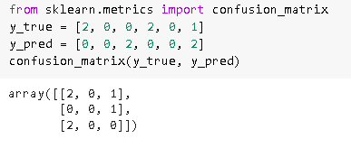

Scikit learn confusion matrix

阅读: [Scikit 学习图像处理](https://pythonguides.com/scikit-learn-image-processing/)

## Scikit 学习混淆矩阵示例

在本节中，我们将了解**Scikit 如何学习混淆矩阵示例**在 python 中工作。

*   Scikit 学习混淆矩阵示例被定义为总结分类结果的技术。
*   混淆矩阵还预测了分类模型的正确和错误预测的数量。

**代码:**

在下面的代码中，我们将导入一些库，从中我们可以制作混淆矩阵。

*   `iris = datasets . load _ iris()`用于加载虹膜数据。
*   `class _ names = iris . target _ names`用于获取目标名称。
*   **x_train，x_test，y_train，y_test = train_test_split(x，y，random_state=0)** 用于将数据集拆分为训练和测试数据。
*   **分类器= svm。SVC(kernel="linear "，C=0.02)。**fit(x _ train，y_train)用于拟合模型。
*   `confusionmatrix display . from _ estimator()`用于绘制混淆矩阵。
*   `print(display . confusion _ matrix)`用于打印混淆矩阵。

```py
import numpy as num
import matplotlib.pyplot as plot

from sklearn import svm, datasets
from sklearn.model_selection import train_test_split
from sklearn.metrics import ConfusionMatrixDisplay

iris = datasets.load_iris()
x = iris.data
y = iris.target
class_names = iris.target_names

x_train, x_test, y_train, y_test = train_test_split(x, y, random_state=0)

classifier = svm.SVC(kernel="linear", C=0.02).fit(x_train, y_train)

num.set_printoptions(precision=2)

title_options = [
    ("Confusion matrix, without normalization", None),
    ("Normalized confusion matrix", "true"),
]
for title, normalize in title_options:
    display = ConfusionMatrixDisplay.from_estimator(
        classifier,
        x_test,
        y_test,
        display_labels=class_names,
        cmap=plot.cm.Blues,
        normalize=normalize,
    )
    display.ax_.set_title(title)

    print(title)
    print(display.confusion_matrix)

plot.show()
```

**输出:**

在下面的输出中，我们可以看到分类的结果在混淆矩阵的帮助下总结在屏幕上。

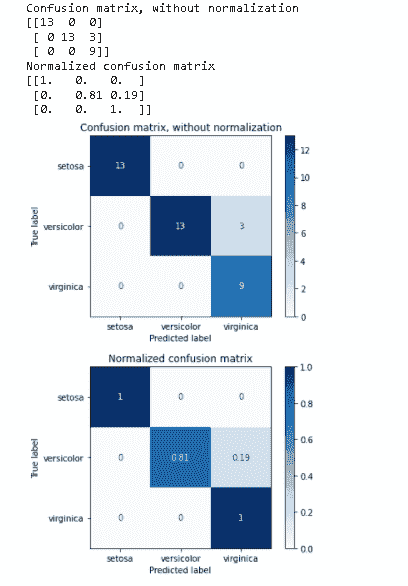

Scikit learn confusion matrix example

阅读: [Scikit 学习非线性【完全指南】](https://pythonguides.com/scikit-learn-non-linear/)

## Scikit 学习混淆矩阵图

在本节中，我们将了解 Scikit 如何在 python 中学习混淆矩阵图。

*   Scikit 学习混淆矩阵图用于在屏幕上绘制图形，以总结模型的结果。
*   它用于绘制图表，以预测模型的正确或错误预测数。

**代码:**

在下面的代码中，我们将导入一些库，从中我们可以在屏幕上绘制混淆矩阵。

*   **x，y = make _ class ification(random _ state = 0)**用于进行分类。
*   **x_train，x_test，y_train，y_test = train_test_split(x，y，random_state=0)** 用于将数据集拆分为训练集和测试集。
*   **classifier.fit(x_train，y_train)** 用于拟合模型。
*   **绘制混淆矩阵(分类器，x_test，y_test)** 用于在屏幕上绘制混淆矩阵。

```py
import matplotlib.pyplot as plot
from sklearn.datasets import make_classification
from sklearn.metrics import plot_confusion_matrix
from sklearn.model_selection import train_test_split
from sklearn.svm import SVC
x, y = make_classification(random_state=0)
x_train, x_test, y_train, y_test = train_test_split(
         x, y, random_state=0)
classifier = SVC(random_state=0)
classifier.fit(x_train, y_train)
SVC(random_state=0)
plot_confusion_matrix(classifier, x_test, y_test)  
plot.show()
```

**输出:**

运行上面的代码后，我们得到下面的输出，其中我们可以看到屏幕上绘制的混淆矩阵。

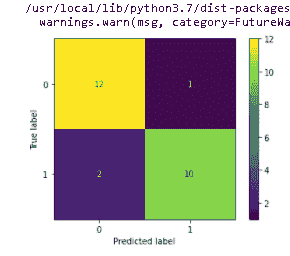

Scikit learn confusion matrix plot

阅读: [Scikit 学习 KNN 教程](https://pythonguides.com/scikit-learn-knn-tutorial/)

## Scikit 学习混淆矩阵准确度

在本节中，我们将了解 python 中模型的 **Scikit learn 混淆矩阵精度**。

Scikit learn 混淆矩阵精度用于计算矩阵的精度我们的模型结果有多精确。

**代码:**

在下面的代码中，我们将导入一些库，从中我们可以计算模型的精度。

*   **y_pred = [1，3，2，0]** 用于预测预测值。
*   **y_true = [0，1，2，3]** 用于预测真值。
*   **accuracy_score(y_true，y_pred)** 用于预测准确率得分。

```py
from sklearn.metrics import confusion_matrix
from sklearn.metrics import accuracy_score
y_pred = [1, 3, 2, 0]
y_true = [0, 1, 2, 3]
accuracy_score(y_true, y_pred)
accuracy_score(y_true, y_pred, normalize=False)
import numpy as num
accuracy_score(num.array([[0, 1], [1, 1]]), num.ones((2, 2)))
```

**输出:**

运行上面的代码后，我们得到下面的输出，其中我们可以看到屏幕上打印了混淆矩阵准确度分数。

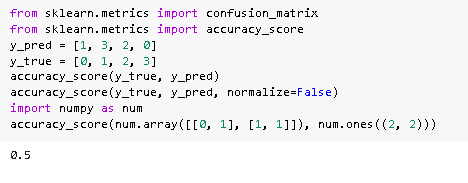

Scikit learn confusion matrix accuracy

阅读: [Scikit 学习情绪分析](https://pythonguides.com/scikit-learn-sentiment-analysis/)

## Scikit 学习混淆矩阵多类

在这一节中，我们将学习**scikit 如何在 python 中学习混淆矩阵多类工作**。

Scikit 学习混淆矩阵多类被定义为对三个或更多类中的一个进行分类的问题。

**代码:**

在下面的代码中，我们将导入一些库，从中我们可以创建一个混淆矩阵多类。

*   `df = PD . read _ CSV(" iris . CSV ")`用于加载数据集。
*   `df.dtypes` 用于选择数据的类型。

```py
**#importing packages**
import pandas as pds
import numpy as num
import seaborn as sb
import matplotlib.pyplot as plot

df = pd.read_csv("IRIS.csv")
df.head()
df.dtypes
```

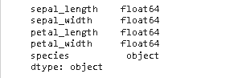

Scikit learn confusion matrix multi-class dataset

*   **x = df.drop(['species']，axis=1)** 用于分离自变量和因变量。
*   `print(x.shape)` 用于打印数据集的形状。

```py
**#Separating independant variable and dependent variable("Species")**
x = df.drop(['species'], axis=1)
y = df['species']

print(x.shape)

print(y.shape)
```

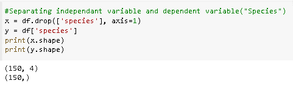

scikit learn confusion matrix multiclass separating dependent or independent variable

*   **x_train，x_test，y_train，y_test = train_test_split(x，y，test_` size= `0.3，random_state=0)** 用于将数据集拆分为训练集和测试集。
*   `print(x_train.shape)` 用于打印列车组的形状。
*   `print(x_test.shape)` 用于打印测试集的形状。

```py
**# Splitting the dataset to Train and test**
from sklearn.model_selection import train_test_split
x_train, x_test, y_train, y_test = train_test_split(x, y, test_size=0.3, random_state=0)

print(x_train.shape)
print(y_train.shape)
print(x_test.shape)
print(y_test.shape)
```

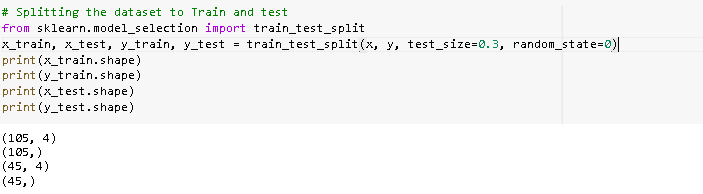

Scikit learn confusion matrix multi-class train test data split

*   **分类器= SVC(内核= '线性')。fit(x_train，y_train)** 用于从 x 训练和 y 训练中训练分类器。
*   **cm =混淆矩阵(y_test，y_pred)** 用于创建混淆矩阵。
*   **cm_df = pd。DataFrame()** 用于创建数据帧。
*   **plot.figure(figsize=(5，4))** 用于绘制图形。

```py
from sklearn.svm import SVC
from sklearn.metrics import confusion_matrix

classifier = SVC(kernel = 'linear').fit(x_train,y_train)
classifier.predict(x_train)

y_pred = classifier.predict(X_test)

cm = confusion_matrix(y_test, y_pred)

cm_df = pd.DataFrame(cm,
                     index = ['SETOSA','VERSICOLR','VIRGINICA'], 
                     columns = ['SETOSA','VERSICOLR','VIRGINICA'])

plot.figure(figsize=(5,4))
sb.heatmap(cm_df, annot=True)
plot.title('Confusion Matrix')
plot.ylabel('Actal Values')
plot.xlabel('Predicted Values')
plot.show()
```

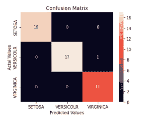

Scikit learn confusion matrix multiclass

阅读: [Scikit 学习梯度下降](https://pythonguides.com/scikit-learn-gradient-descent/)

## Scikit 学习混淆矩阵显示

在本节中，我们将了解 **Scikit 如何在 python 中学习混淆矩阵显示**。

Scikit 学习混淆矩阵显示被定义为一个矩阵，其中 I，j 等于一个组中预测的观察次数。

**代码:**

在下面的代码中，我们将学习导入一些库，从中我们可以看到混淆矩阵是如何在屏幕上显示的。

*   **x，y = make _ class ification(random _ state = 0)**用于进行分类。
*   **x_train，x_test，y_train，y_test = train_test_split(x，y，random_state=0)** 用于将数据集拆分为训练和测试数据。
*   **classifier.fit(x_train，y_train)** 用于拟合数据。
*   predictions = classifier . predict(x _ test)用于预测数据。
*   **display = confusionmatrix display(confusion _ matrix = cm，display _ labels = classifier . classes _)**用于显示混淆矩阵。
*   `display.plot()` 用于绘制矩阵。

```py
import matplotlib.pyplot as plot
from sklearn.datasets import make_classification
from sklearn.metrics import confusion_matrix, ConfusionMatrixDisplay
from sklearn.model_selection import train_test_split
from sklearn.svm import SVC
x, y = make_classification(random_state=0)
x_train, x_test, y_train, y_test = train_test_split(x, y,
                                                    random_state=0)
classifier = SVC(random_state=0)
classifier.fit(x_train, y_train)
SVC(random_state=0)
predictions = classifier.predict(x_test)
cm = confusion_matrix(y_test, predictions, labels=classifier.classes_)
display = ConfusionMatrixDisplay(confusion_matrix=cm,
                               display_labels=classifier.classes_)
display.plot()

plot.show()
```

**输出:**

运行上面的代码后，我们得到下面的输出，我们可以看到屏幕上显示了一个混淆矩阵。

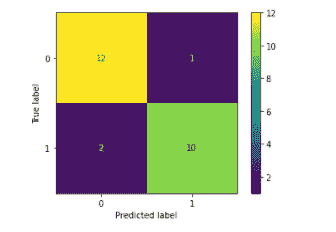

Scikit learn confusion matrix display

阅读: [Scikit 学习分类教程](https://pythonguides.com/scikit-learn-classification/)

## Scikit 学习混淆矩阵标签

在本节中，我们将学习**Scikit 如何在** python 中学习混淆矩阵标签。

Scikit 学习混淆矩阵标签被定义为二维阵列，其将预测的标签组与真实标签进行对比。

**代码:**

在下面的代码中，我们将导入一些库来了解 scikit 学习混淆矩阵标签是如何工作的。

*   **y_true = num.array([[1，0，0]，[0，1，1]])** 用于收集数组中的真标签。
*   **y_pred = num.array([[1，0，1]，[0，1，0]])** 用于收集数组中的预测标签。
*   **多标签混淆矩阵(y_true，y_pred)** 用于得到多标签混淆矩阵。

```py
import numpy as num
from sklearn.metrics import multilabel_confusion_matrix
y_true = num.array([[1, 0, 0],
                    [0, 1, 1]])
y_pred = num.array([[1, 0, 1],
                   [0, 1, 0]])
multilabel_confusion_matrix(y_true, y_pred)
```

**输出:**

运行上面的代码后，我们得到下面的输出，我们可以看到混淆矩阵标签打印在屏幕上。

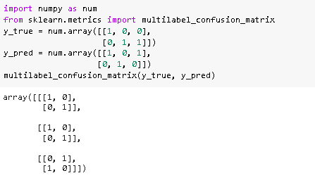

Scikit learn confusion matrix labels

阅读: [Scikit 学习超参数调整](https://pythonguides.com/scikit-learn-hyperparameter-tuning/)

## Scikit 学习混淆矩阵归一化

在本节中，我们将了解**sci kit 如何学习混淆矩阵规范化在 python 中的工作方式**。

Scikit 学习混淆矩阵标准化被定义为代表每组中存在一个样本的过程。

**代码:**

在下面的代码中，我们将导入一些库，从中我们可以规范化矩阵。

*   `iris = datasets . load _ iris()`用于加载数据。
*   **x_train，x_test，y_train，y_test = train_test_split(X，y，random_state=0)** 用于将数据集拆分为训练和测试数据。
*   **分类器= svm。SVC(kernel='linear '，C=0.01)** 用作分类器。
*   **y _ pred = classifier . fit(x _ train，y_train)。【T1 预测(x_test)】用于拟合模型。**
*   **cm =混淆矩阵(y_true，y_pred)** 用于计算混淆矩阵。
*   **classes = classes[unique _ labels(y _ true，y_pred)]** 用于数据中出现的标签。
*   **图，axis = plot.subplots()** 用于在屏幕上绘制图。
*   **plot . setp(axis . get _ xticklabels()，rotation=45，ha="right "，rotation_mode="anchor")** 用于设置对齐和旋转刻度。
*   **plot _ confusion _ matrix(y _ test，y_pred，classes=class_names，normalize=True，title= '归一化混淆矩阵')**用于绘制归一化混淆矩阵。

```py
import numpy as num
import matplotlib.pyplot as plot
from sklearn import svm, datasets
from sklearn.model_selection import train_test_split
from sklearn.metrics import confusion_matrix
from sklearn.utils.multiclass import unique_labels

iris = datasets.load_iris()
x_digits = iris.data
y = iris.target
class_names = iris.target_names

x_train, x_test, y_train, y_test = train_test_split(X, y, random_state=0)

classifier = svm.SVC(kernel='linear', C=0.01)
y_pred = classifier.fit(x_train, y_train).predict(x_test)

def plot_confusion_matrix(y_true, y_pred, classes,
                          normalize=False,
                          title=None,
                          cmap=plot.cm.Blues):

    if not title:
        if normalize:
            title = 'Normalized confusion matrix'

    cm = confusion_matrix(y_true, y_pred)

    classes = classes[unique_labels(y_true, y_pred)]
    if normalize:
        cm = cm.astype('float') / cm.sum(axis=1)[:, num.newaxis]
        print("Normalized confusion matrix")

    print(cm)

    figure, axis = plot.subplots()
    im = axis.imshow(cm, interpolation='nearest', cmap=cmap)
    axis.figure.colorbar(im, ax=axis)

    axis.set(xticks=num.arange(cm.shape[1]),
           yticks=num.arange(cm.shape[0]),

           xticklabels=classes, yticklabels=classes,
           title=title,
           ylabel='True label',
           xlabel='Predicted label')

    plot.setp(axis.get_xticklabels(), rotation=45, ha="right",
             rotation_mode="anchor")

    fmt = '.2f' if normalize else 'd'
    thresh = cm.max() / 2.
    for i in range(cm.shape[0]):
        for j in range(cm.shape[1]):
            axis.text(j, i, format(cm[i, j], fmt),
                    ha="center", va="center",
                    color="cyan" if cm[i, j] > thresh else "red")
    figure.tight_layout()
    return axis

plot_confusion_matrix(y_test, y_pred, classes=class_names, normalize=True,
                      title='Normalized confusion matrix')

plot.show()
```

**输出:**

在下面的代码中，我们将看到一个标准化的混淆矩阵数组被创建，并且一个标准化的混淆矩阵图被绘制在屏幕上。

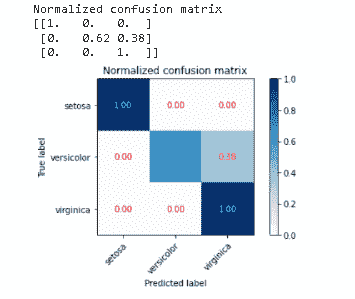

Scikit learn confusion matrix normalized

另外，看看更多的 Scikit 学习教程。

*   [Scikit 学习线性回归](https://pythonguides.com/scikit-learn-linear-regression/)
*   [Scikit 学习功能选择](https://pythonguides.com/scikit-learn-feature-selection/)
*   [Scikit 学岭回归](https://pythonguides.com/scikit-learn-ridge-regression/)
*   [Scikit 学习随机森林](https://pythonguides.com/scikit-learn-random-forest/)

因此，在本教程中，我们讨论了 **Scikit learn 混淆矩阵**，并且我们还涵盖了与其实现相关的不同示例。这是我们已经讨论过的例子列表。

*   Scikit 学习混淆矩阵
*   Scikit 学习混淆矩阵示例
*   Scikit 学习混淆矩阵图
*   Scikit 学习混淆矩阵准确性
*   Scikit 学习混淆矩阵多类
*   Scikit 学习混淆矩阵显示
*   Scikit 学习混淆矩阵标签
*   Scikit 学习混淆矩阵标准化

[Bijay Kumar](https://pythonguides.com/author/fewlines4biju/)

Python 是美国最流行的语言之一。我从事 Python 工作已经有很长时间了，我在与 Tkinter、Pandas、NumPy、Turtle、Django、Matplotlib、Tensorflow、Scipy、Scikit-Learn 等各种库合作方面拥有专业知识。我有与美国、加拿大、英国、澳大利亚、新西兰等国家的各种客户合作的经验。查看我的个人资料。

[enjoysharepoint.com/](https://enjoysharepoint.com/)[](https://www.facebook.com/fewlines4biju "Facebook")[](https://www.linkedin.com/in/fewlines4biju/ "Linkedin")[](https://twitter.com/fewlines4biju "Twitter")