# Scikit learn 交叉验证[实用指南]

> 原文：<https://pythonguides.com/scikit-learn-cross-validation/>

[](https://sharepointsky.teachable.com/p/python-and-machine-learning-training-course)

在这个 [Python 教程](https://pythonguides.com/learn-python/)中，我们将学习**Scikit learn 交叉验证如何在 Python 中工作**，我们还将涵盖与 Scikit learn 交叉验证相关的不同示例。此外，我们将涵盖这些主题。

*   Scikit 学习交叉验证
*   Scikit 学习交叉验证分数
*   Scikit 学习交叉验证套索
*   Scikit 学习交叉验证预测
*   Scikit 学习交叉验证时间序列
*   Scikit 学习交叉验证分离
*   Scikit 学习交叉验证混淆矩阵
*   Scikit 学习交叉验证超参数
*   Scikit 学习交叉验证混洗
*   Scikit 学习交叉验证网格搜索

目录

[](#)

*   [Scikit 学习交叉验证](#Scikit_learn_Cross-validation "Scikit learn Cross-validation")
*   [Scikit 学习交叉验证分数](#Scikit_learn_cross-validation_score "Scikit learn cross-validation score")
*   [Scikit 学习交叉验证套索](#Scikit_learn_Cross-validation_lasso "Scikit learn Cross-validation lasso")
*   [Scikit 学习交叉验证预测](#Scikit_learn_cross-validation_predict "Scikit learn cross-validation predict")
*   [Scikit 学习交叉验证时间序列](#Scikit_learn_cross-validation_time_series "Scikit learn cross-validation time series")
*   [Scikit 学习交叉验证分割](#Scikit_learn_cross-validation_split "Scikit learn cross-validation split")
*   [Scikit 学习交叉验证混淆矩阵](#Scikit_learn_cross-validation_confusion_matrix "Scikit learn cross-validation confusion matrix")
*   [Scikit 学习交叉验证超参数](#Scikit_learn_cross-validation_hyperparameter "Scikit learn cross-validation hyperparameter")
*   [Scikit 学习交叉验证洗牌](#Scikit_learn_cross-validation_shuffle "Scikit learn cross-validation shuffle")
*   [Scikit 学习交叉验证网格搜索](#Scikit_learn_cross-validation_grid_search "Scikit learn cross-validation grid search")

## Scikit 学习交叉验证

在本节中，我们将了解 python 中的 **Scikit learn 交叉验证**工作原理。

**交叉验证**被定义为一个过程，在该过程中，我们使用数据集训练我们的模型，然后使用支持数据集进行评估。

**代码:**

在下面的代码中，我们将导入一些库，我们将从这些库中训练我们的模型并对其进行评估。

*   **x，y = datasets . load _ iris(return _ X _ y = True)**用于加载数据集。
*   **x_train，x_test，y_train，y_test = train_test_split(x，y，test_size=0.4，random_state=0)** 用于将数据集拆分为训练数据和测试数据。
*   **x_train.shape，y_train.shape** 用于评估列车模型的形状。
*   **分类器= svm。SVC(内核= '线性'，C=1)。**fit(x _ train，y_train)用于拟合模型。
*   **scores = cross _ val _ score(classifier，x，y，cv=7)** 用于计算交叉值得分。

```py
import numpy as num
from sklearn.model_selection import train_test_split
from sklearn import datasets
from sklearn import svm

x, y = datasets.load_iris(return_X_y=True)
x.shape, y.shape
x_train, x_test, y_train, y_test = train_test_split(
       x, y, test_size=0.4, random_state=0)

x_train.shape, y_train.shape
x_test.shape, y_test.shape
classifier = svm.SVC(kernel='linear', C=1).fit(x_train, y_train)
classifier.score(x_test, y_test)
from sklearn.model_selection import cross_val_score
classifier = svm.SVC(kernel='linear', C=1, random_state=42)
scores = cross_val_score(classifier, x, y, cv=7)
```

**输出:**

运行上述代码后，我们得到以下输出，其中我们可以看到交叉验证指标得分以数组的形式打印在屏幕上。

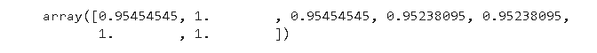

Scikit learn cross-validation

Read: [Scikit-learn Vs Tensorflow](https://pythonguides.com/scikit-learn-vs-tensorflow/)

## Scikit 学习交叉验证分数

在本节中，我们将了解 **Scikit 如何在 python 中学习交叉验证分数**。

**交叉验证分数**定义为估计新数据的模型能力并计算数据分数的过程。

**代码:**

在下面的代码中，我们将导入一些库，从中我们可以计算交叉验证分数。

*   `diabetes = datasets . load _ diabetes()`用于加载数据。
*   **x = diabetes.data[:170]** 用于计算糖尿病数据。
*   **print(cross_val_score(lasso，x，y，cv=5))** 用于在屏幕上打印分数。

```py
from sklearn import datasets, linear_model
from sklearn.model_selection import cross_val_score
diabetes = datasets.load_diabetes()
x = diabetes.data[:170]
y = diabetes.target[:170]
lasso = linear_model.Lasso()
print(cross_val_score(lasso, x, y, cv=5))
```

**输出:**

运行上面的代码后，我们得到下面的输出，其中我们可以看到交叉验证分数被打印在屏幕上。

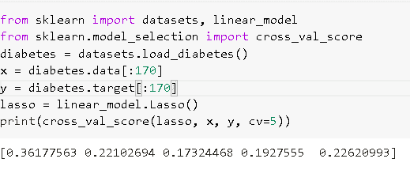

Scikit learn cross-validation score

阅读: [Scikit 学习决策树](https://pythonguides.com/scikit-learn-decision-tree/)

## Scikit 学习交叉验证套索

在本节中，我们将了解 **Scikit 如何在 python 中学习交叉验证套索**的工作原理。

Lasso 代表最小绝对收缩和选择器运算符，用于确定惩罚项的权重。

**代码:**

在下面的代码中，我们将导入一些库，从中我们可以计算交叉验证 lasso 得分。

*   **x，y = make_regression(noise=5，random_state=0)** 用于进行或生成回归。
*   **回归= LassoCV(cv=7，random_state=0)。**fit(x，y)用于拟合套索模型。
*   **regression.score(x，y)** 用于计算 lasso 得分。

```py
 from sklearn.linear_model import LassoCV
from sklearn.datasets import make_regression
x, y = make_regression(noise=5, random_state=0)
regression = LassoCV(cv=7, random_state=0).fit(x, y)
regression.score(x, y)
```

**输出:**

在下面的输出中，我们可以看到 lasso 分数被计算出来，结果被打印在屏幕上。

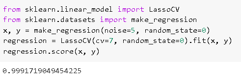

Scikit learn cross-validation lasso score

阅读: [Scikit 学习隐马尔可夫模型](https://pythonguides.com/scikit-learn-hidden-markov-model/)

## Scikit 学习交叉验证预测

在这一节中，我们将了解 **Scikit learn 交叉验证预测**如何在 python 中工作。

*   Scikit learn 交叉验证预测方法用于通过可视化来预测误差。
*   交叉验证用于评估数据，并使用数据的不同部分来训练和测试模型。

**代码:**

在下面的代码中，我们将导入一些库，从中我们可以通过交叉验证来评估预测。

*   **x，y = datasets . load _ diabetes(return _ X _ y = True)**用于加载数据集。
*   **predict = cross _ val _ predict(linear model，x，y，cv=10)** 用于预测模型，返回相同大小的数组。
*   **fig，axis = plot.subplots()** 用于在屏幕上绘制图形。
*   **axis.scatter(y，predict，edgecolors=(0，0，0))** 用于在图形上绘制散点图。
*   **axis.plot([y.min()，y.max()]，[y.min()，y.max()]，" b-"，lw=6)** 用于在图形上绘制轴。
*   `axis . set _ xlabel(" Measured ")`用于在图形上绘制 x 标签。
*   `axis . set _ y label(" Predicted ")`用于在图形上绘制 y 标签。

```py
from sklearn import datasets
from sklearn.model_selection import cross_val_predict
from sklearn import linear_model
import matplotlib.pyplot as plot

linearmodel = linear_model.LinearRegression()
x, y = datasets.load_diabetes(return_X_y=True)

predict = cross_val_predict(linearmodel,x, y, cv=10)

fig, axis = plot.subplots()
axis.scatter(y, predict, edgecolors=(0, 0, 0))
axis.plot([y.min(), y.max()], [y.min(), y.max()], "b--", lw=6)
axis.set_xlabel("Measured")
axis.set_ylabel("Predicted")
plot.show()
```

**输出:**

运行上面的代码后，我们得到了下面的输出，其中我们可以看到在屏幕上绘制了带有交叉验证预测的图形。

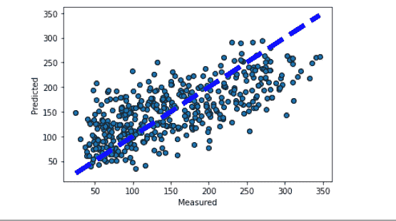

scikit learn cross-validation predict

阅读: [Scikit 学习层次聚类](https://pythonguides.com/scikit-learn-hierarchical-clustering/)

## Scikit 学习交叉验证时间序列

在这一节中，我们将了解**Scikit 如何在 python 中学习交叉验证时序工作**。

*   Scikit learn crossvalidation 时间序列被定义为由单个观察值组成的一系列测试集。
*   训练集只包括在时间上早于形成测试集观测值的观测值。
*   在时间序列交叉验证中，在构建预测时不考虑未来的观测值。

**代码:**

在下面的代码中，我们将导入一些库，从中我们可以看到如何通过时间序列分割数据。

*   **x = num.array([[1，2]，[3，4]，[1，2]，[3，4]，[1，2]，[3，4]])** 用于给 x 赋值。
*   **y = num.array([1，2，3，4，5，6])** 用于给 y 赋值。
*   `print(timeseriscv)`用于打印时间序列交叉验证数据。
*   **x = num . randn(12，2)** 用于将 12 个样本的测试规模固定为 2。
*   **print("TRAIN:"，train_index，" TEST:"，test_index)** 用于打印训练和测试数据。

```py
import numpy as num
from sklearn.model_selection import TimeSeriesSplit
x = num.array([[1, 2], [3, 4], [1, 2], [3, 4], [1, 2], [3, 4]])
y = num.array([1, 2, 3, 4, 5, 6])
timeseriescv = TimeSeriesSplit()
print(timeseriescv)
for train_index, test_index in timeseriescv.split(x):
     print("TRAIN:", train_index, "TEST:", test_index)
     x_train, x_test = x[train_index], x[test_index]
     y_train, y_test = y[train_index], y[test_index]

x = num.random.randn(12, 2)
y = num.random.randint(0, 2, 12)
timeseriescv = TimeSeriesSplit(n_splits=3, test_size=2)
for train_index, test_index in tscv.split(x):
    print("TRAIN:", train_index, "TEST:", test_index)
    x_train, x_test = x[train_index], x[test_index]
    y_train, y_test = y[train_index], y[test_index]
```

**输出:**

在下面的输出中，我们可以看到训练和测试数据被时间序列交叉验证分割。

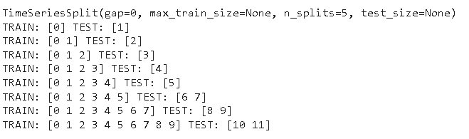

Scikit learn cross-validation time series

阅读: [Scikit 学习岭回归](https://pythonguides.com/scikit-learn-ridge-regression/)

## Scikit 学习交叉验证分割

在本节中，我们将了解**Scikit 如何在 python 中学习交叉验证分割**。

*   交叉验证被定义为用于评估有限数据样本上的模型的过程。
*   交叉验证数据可以用一个称为 k 的参数分成许多组。

**代码:**

在下面的代码中，我们将导入一些库，从这些库中模型可以被分成许多组。

*   `num.random.seed(1338)` 用于生成随机数。
*   `n_splits = 6` 用于拆分数据。
*   **percentiles_classes = [0.1，0.3，0.6]** 用于生成类数据。
*   **groups = num . h stack([[ii]* 10 for ii in range(10)])**用于平均分割组
*   **fig，axis = plot.subplots()** 用于绘制图形。
*   `axis.scatter()` 用于绘制散点图。
*   **axis.set_title("{} ")。格式(类型(cv))。__name__)，fontsize=15)** 用来给图形加标题。

```py
from sklearn.model_selection import (
    TimeSeriesSplit,
    KFold,
    ShuffleSplit,
    StratifiedKFold,
    GroupShuffleSplit,
    GroupKFold,
    StratifiedShuffleSplit,
    StratifiedGroupKFold,
)
import numpy as num
import matplotlib.pyplot as plot
from matplotlib.patches import Patch

num.random.seed(1338)
cmapdata = plot.cm.Paired
cmapcv = plot.cm.coolwarm
n_splits = 6
n_points = 100
x = num.random.randn(100, 10)

percentiles_classes = [0.1, 0.3, 0.6]
y = num.hstack([[ii] * int(100 * perc) for ii, perc in enumerate(percentiles_classes)])

groups = num.hstack([[ii] * 10 for ii in range(10)])

def visualize_groups(classes, groups, name):
    # Visualize dataset groups
    fig, axis = plot.subplots()
    axis.scatter(
        range(len(groups)),
        [0.5] * len(groups),
        c=groups,
        marker="_",
        lw=50,
        cmap=cmapdata,
    )
    axis.scatter(
        range(len(groups)),
        [3.5] * len(groups),
        c=classes,
        marker="_",
        lw=50,
        cmap=cmapdata,
    )
    axis.set(
        ylim=[-1, 5],
        yticks=[0.5, 3.5],
        yticklabels=["Data\ngroup", "Data\nclass"],
        xlabel="Sample index",
    )

visualize_groups(y, groups, "nogroups")
def plot_cv_indices(cv, x, y, group, ax, n_splits, lw=10):
    """Create a sample plot for indices of a cross-validation object."""

    **# Generate the training/testing visualizations for each CV split
    for ii, (tr, tt) in enumerate(cv.split(X=x, y=y, groups=group)):**
        **# Fill in indices with the training/test groups**
        indices = np.array([np.nan] * len(x))
        indices[tt] = 1
        indices[tr] = 0

      **  # Visualize the results**
        axis.scatter(
            range(len(indices)),
            [ii + 0.5] * len(indices),
            c=indices,
            marker="_",
            lw=lw,
            cmap=cmapcv,
            vmin=-0.2,
            vmax=1.2,
        )

    axis.scatter(
        range(len(x)), [ii + 1.5] * len(x), c=y, marker="_", lw=lw, cmap=cmapdata
    )

    axis.scatter(
        range(len(x)), [ii + 2.5] * len(x), c=group, marker="_", lw=lw, cmap=cmapdata
    )

    **# Formatting**
    yticklabels = list(range(n_splits)) + ["class", "group"]
    axis.set(
        yticks=np.arange(n_splits + 2) + 0.5,
        yticklabels=yticklabels,
        xlabel="Sample index",
        ylabel="CV iteration",
        ylim=[n_splits + 2.2, -0.2],
        xlim=[0, 100],
    )
    axis.set_title("{}".format(type(cv).__name__), fontsize=15)
    return axis
fig, axis = plot.subplots()
cv = KFold(n_splits)
plot_cv_indices(cv, x, y, groups, axis, n_splits)
```

**输出:**

运行上述代码后，我们得到以下输出，其中我们可以看到屏幕上显示了 scikit learn 交叉验证分割。

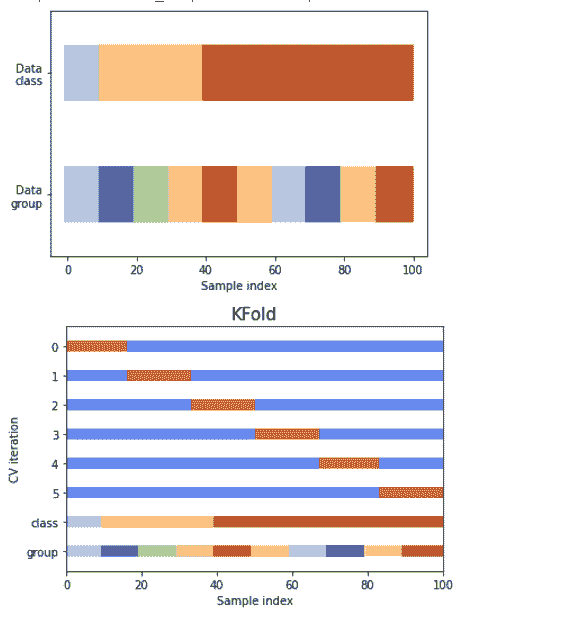

scikit learn cross-validation split

阅读: [Scikit 学习功能选择](https://pythonguides.com/scikit-learn-feature-selection/)

## Scikit 学习交叉验证混淆矩阵

在本节中，我们将了解 Scikit learn 交叉验证矩阵如何在 python 中工作。

交叉验证混淆矩阵被定义为一个评估矩阵，从中我们可以估计模型的性能。

**代码:**

在下面的代码中，我们将导入一些库，从中我们可以评估模型性能。

*   `iris = datasets . load _ iris()`用于加载虹膜数据。
*   **打印(虹膜。【描述】(T1)用于打印虹膜数据。**
*   **predicted _ targets = num . array([])**用于预测目标值模型。
*   **actual _ targets = num . array([])**用于获取实际目标值。
*   **分类器= svm。SVC()。**fit(train _ x，train_y)用于拟合分类器。
*   `predicted _ labels = classifiers . predict(test _ x)`用于预测测试集的标签。

```py
import matplotlib.pyplot as plot
import numpy as num
from sklearn import svm, datasets
from sklearn.metrics import confusion_matrix
from sklearn.model_selection import KFold
iris = datasets.load_iris()
data = iris.data
target = iris.target
classnames = iris.target_names
classnames
labels, counts = num.unique(target, return_counts=True)
print(iris.DESCR)
def evaluate_model(data_x, data_y):
    k_fold = KFold(10, shuffle=True, random_state=1)

    predicted_targets = num.array([])
    actual_targets = num.array([])

    for train_ix, test_ix in k_fold.split(data_x):
        train_x, train_y, test_x, test_y = data_x[train_ix], data_y[train_ix], data_x[test_ix], data_y[test_ix]

        classifiers = svm.SVC().fit(train_x, train_y)
        predicted_labels = classifiers.predict(test_x)

        predicted_targets = num.append(predicted_targets, predicted_labels)
        actual_targets = num.append(actual_targets, test_y)

    return predicted_targets, actual_targets 
```

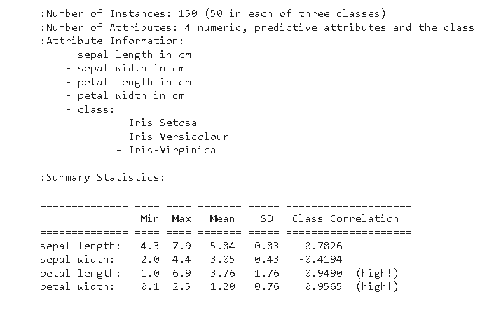

scikit learn cross-validation confusion matrix data

在这部分代码中，我们将生成规范化的混淆矩阵。

*   **plot.imshow(cnf_matrix，interpolation='nearest '，cmap=plt.get_cmap('Blues'))** 用于绘制矩阵。
*   **plot.title(标题)**用于在图形上绘制标题。
*   **plot.xticks(tick_marks，classes，rotation=45)** 用于绘制 x 刻度。
*   **plot.ylabel('真实标签')**用于在图形上绘制标签。
*   **plot.xlabel('预测标签')**用于在图形上绘制 x 标签。
*   **plot _ confusion _ matrix(predicted _ target，actual_target)** 用于在屏幕上绘制混淆矩阵。

```py
def plot_confusion_matrix(predicted_labels_list, y_test_list):
    cnf_matrix = confusion_matrix(y_test_list, predicted_labels_list)
    num.set_printoptions(precision=2)

    plot.figure()
    generate_confusion_matrix(cnf_matrix, classes=class_names, normalize=True, title='Normalized confusion matrix')
    plot.show()
def generate_confusion_matrix(cnf_matrix, classes, normalize=False, title='Confusion matrix'):
    if normalize:
        cnf_matrix = cnf_matrix.astype('float') / cnf_matrix.sum(axis=1)[:, num.newaxis]
        print("Normalized confusion matrix")
    else:
        print('Confusion matrix, without normalization')

    plot.imshow(cnf_matrix, interpolation='nearest', cmap=plt.get_cmap('Blues'))
    plot.title(title)
    plot.colorbar()

    tick_marks = np.arange(len(classes))
    plot.xticks(tick_marks, classes, rotation=45)
    plot.yticks(tick_marks, classes)

    fmt = '.2f' if normalize else 'd'
    thresh = cnf_matrix.max() / 2.

    for i, j in itertools.product(range(cnf_matrix.shape[0]), range(cnf_matrix.shape[1])):
        plot.text(j, i, format(cnf_matrix[i, j], fmt), horizontalalignment="center",
                 color="black" if cnf_matrix[i, j] > thresh else "blue")

    plot.tight_layout()
    plot.ylabel('True label')
    plot.xlabel('Predicted label')

    return cnf_matrix
predicted_target, actual_target = evaluate_model(data, target)
plot_confusion_matrix(predicted_target, actual_target)
```

运行上述代码后，我们得到以下输出，其中我们可以看到屏幕上绘制的混淆矩阵，

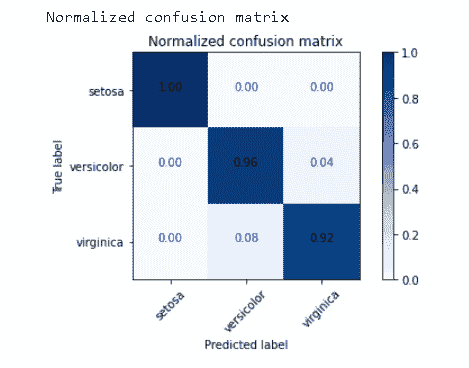

scikit learn cross-validation confusion matrix

阅读: [Scikit 学习线性回归+例题](https://pythonguides.com/scikit-learn-linear-regression/)

## Scikit 学习交叉验证超参数

在本节中，我们将了解 Scikit learn 交叉验证超参数在 python 中的工作原理。

交叉验证超参数定义为用于搜索理想模型架构的过程，也用于评估模型的性能。

**代码:**

在下面的代码中，我们将导入一些库，从中我们可以搜索理想的模型架构。

*   **paramgrid = {'max_depth': [4，5，10]，' min_samples_split': [3，5，10]}** 用于定义 paramgrid。
*   **x，y = make _ class ification(n _ samples = 1000，random_state=0)** 用于进行分类。
*   **base _ estimator = SVC(gamma = ' scale ')**用于定义基本估计量。
*   **sh = halvinggridsearchv(base _ estimator，paramgrid，cv=5，factor=2，max_resources=40，aggressive_elimination=True，)。**fit(x，y)用于拟合模型。

```py
from sklearn.datasets import make_classification
from sklearn.ensemble import RandomForestClassifier
from sklearn.experimental import enable_halving_search_cv  
from sklearn.model_selection import HalvingGridSearchCV
import pandas as pd
paramgrid = {'max_depth': [4, 5, 10],
               'min_samples_split': [3, 5, 10]}
base_estimator = RandomForestClassifier(random_state=0)
x, y = make_classification(n_samples=1000, random_state=0)
sh = HalvingGridSearchCV(base_estimator, paramgrid, cv=6,
                          factor=2, resource='n_estimators',
                          max_resources=30).fit(x, y)
sh.best_estimator_
RandomForestClassifier(max_depth=5, n_estimators=24, random_state=0)
from sklearn.datasets import make_classification
from sklearn.svm import SVC
from sklearn.experimental import enable_halving_search_cv  
from sklearn.model_selection import HalvingGridSearchCV
import pandas as pds
paramgrid= {'kernel': ('linear', 'rbf'),
             'C': [2, 10, 100]}
base_estimator = SVC(gamma='scale')
x, y = make_classification(n_samples=1000)
sh = HalvingGridSearchCV(base_estimator, paramgrid, cv=6,
                          factor=2, min_resources=20).fit(x, y)
sh.n_resources_
sh = HalvingGridSearchCV(base_estimator, paramgrid, cv=5,
                         factor=2, min_resources='exhaust').fit(x, y)
sh.n_resources_
from sklearn.datasets import make_classification
from sklearn.svm import SVC
from sklearn.experimental import enable_halving_search_cv  
from sklearn.model_selection import HalvingGridSearchCV
import pandas as pds
paramgrid = {'kernel': ('linear', 'rbf'),
              'C': [2, 10, 100]}
base_estimator = SVC(gamma='scale')
x, y = make_classification(n_samples=1000)
sh = HalvingGridSearchCV(base_estimator, paramgrid, cv=6,
                         factor=2, max_resources=40,
                         aggressive_elimination=False).fit(x, y)
sh.n_resources_
sh = HalvingGridSearchCV(base_estimator, paramgrid, cv=5,
                           factor=2,
                           max_resources=40,
                           aggressive_elimination=True,
                           ).fit(x, y)
sh.n_resources_
```

**输出:**

在下面的输出中，我们可以看到 Scikit 学习交叉验证超参数，它选择屏幕上显示的理想模型。

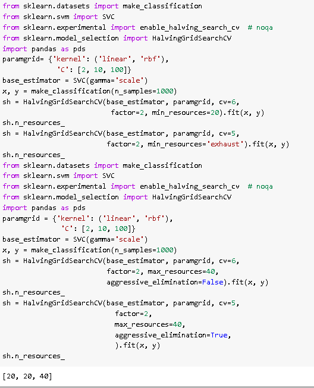

Scikit learn cross-validation hyperparameter

阅读: [Scikit 学习超参数调整](https://pythonguides.com/scikit-learn-hyperparameter-tuning/)

## Scikit 学习交叉验证洗牌

在本节中，我们将学习 python 中的 **scikit learn 交叉验证** shuffle `works` 。

交叉验证混洗被定义为用户生成训练和测试分割首先数据样本被混洗，然后被分割成训练和测试集。

**代码:**

在下面的代码中，我们将学习导入一些库，我们可以从中混洗数据，然后将数据分成训练和测试。

*   **x = num.array([[1，2]，[3，4]，[1，2]，[3，4]])** 用于生成数组。
*   `kf = KFold(n_splits=2)` 用于拆分数据。
*   **print("TRAIN:"，train_index，" TEST:"，test_index)** 用于打印训练和测试数据。

```py
import numpy as num
from sklearn.model_selection import KFold
x = num.array([[1, 2], [3, 4], [1, 2], [3, 4]])
y = num.array([1, 2, 3, 4])
kf = KFold(n_splits=2)
kf.get_n_splits(x)
print(kf)
for train_index, test_index in kf.split(x):
     print("TRAIN:", train_index, "TEST:", test_index)
     x_train, x_test = x[train_index], x[test_index]
     y_train, y_test = y[train_index], y[test_index]
```

**输出:**

运行上面的代码后，我们得到了下面的输出，我们可以看到，在此之后的数据洗牌将它分为训练和测试数据。

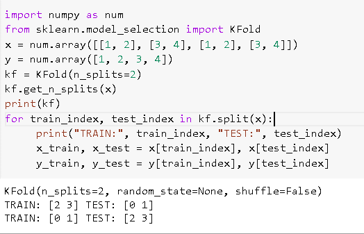

scikit learn cross-validation shuffle

阅读: [Scikit 学习 hidden _ layer _ size](https://pythonguides.com/scikit-learn-hidden_layer_sizes/)

## Scikit 学习交叉验证网格搜索

在本节中，我们将了解 Scikit 如何在 python 中学习交叉验证**网格搜索工作**。

交叉验证网格搜索被定义为为所有参数化网格模型选择最佳参数的过程。

**代码:**

在下面的代码中，我们将导入一些库，从中我们可以从网格中选择最佳参数。

*   `iris = datasets . load _ iris()`用于加载 iris 数据集。
*   **parameters = { ' kernel ':(' linear '，' rbf ')，' C':[1，12]}** 用于定义参数。
*   **classifier.fit(iris.data，iris.target)** 用于拟合模型。
*   **已排序(classifier.cv_results_。**()【keys】用于对分类器进行排序。

```py
from sklearn import svm, datasets
from sklearn.model_selection import GridSearchCV
iris = datasets.load_iris()
parameters = {'kernel':('linear', 'rbf'), 'C':[1, 12]}
svc = svm.SVC()
classifier = GridSearchCV(svc, parameters)
classifier.fit(iris.data, iris.target)
sorted(classifier.cv_results_.keys())
```

**输出:**

在下面的输出中，我们可以看到屏幕上显示了从参数网格中搜索到的最佳参数。

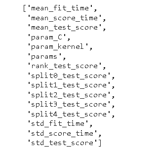

scikit learn cross-validation grid search

另外，看看更多的 Scikit 学习教程。

*   [Scikit 学习遗传算法](https://pythonguides.com/scikit-learn-genetic-algorithm/)
*   [Scikit 学习分类教程](https://pythonguides.com/scikit-learn-classification/)
*   [Scikit 学习梯度下降](https://pythonguides.com/scikit-learn-gradient-descent/)
*   [Scikit 学习混淆矩阵](https://pythonguides.com/scikit-learn-confusion-matrix/)
*   [Scikit 学习情绪分析](https://pythonguides.com/scikit-learn-sentiment-analysis/)
*   [Scikit 学习管道+示例](https://pythonguides.com/scikit-learn-pipeline/)

因此，在本教程中，我们讨论了 **Scikit learn 交叉验证**，并且我们还涵盖了与其实现相关的不同示例。这是我们已经讨论过的例子列表。

*   Scikit 学习交叉验证
*   Scikit 学习交叉验证分数
*   Scikit 学习交叉验证套索
*   Scikit 学习交叉验证预测
*   Scikit 学习交叉验证时间序列
*   Scikit 学习交叉验证分离
*   Scikit 学习交叉验证混淆矩阵
*   Scikit 学习交叉验证超参数
*   Scikit 学习交叉验证混洗
*   Scikit 学习交叉验证网格搜索

[Bijay Kumar](https://pythonguides.com/author/fewlines4biju/)

Python 是美国最流行的语言之一。我从事 Python 工作已经有很长时间了，我在与 Tkinter、Pandas、NumPy、Turtle、Django、Matplotlib、Tensorflow、Scipy、Scikit-Learn 等各种库合作方面拥有专业知识。我有与美国、加拿大、英国、澳大利亚、新西兰等国家的各种客户合作的经验。查看我的个人资料。

[enjoysharepoint.com/](https://enjoysharepoint.com/)[](https://www.facebook.com/fewlines4biju "Facebook")[](https://www.linkedin.com/in/fewlines4biju/ "Linkedin")[](https://twitter.com/fewlines4biju "Twitter")