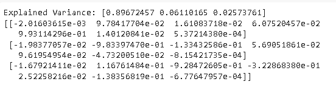

# Scikit 学习功能选择

> 原文：<https://pythonguides.com/scikit-learn-feature-selection/>

[](https://sharepointsky.teachable.com/p/python-and-machine-learning-training-course)

在这个 [Python 教程](https://pythonguides.com/learn-python/)中，我们将学习 `python` 中的 **Scikit learn 特性选择**，我们还将涵盖与特性选择相关的不同示例。我们将讨论这些话题。

*   Scikit 学习功能选择
*   Scikit 学习功能选择管道
*   Scikit 学习功能选择 chi2
*   Scikit 学习功能选择 rfe
*   Scikit 学习功能选择选择测试
*   Scikit 学习基于特征选择树估计器
*   Scikit 学习特征选择分类
*   Scikit 学习特征选择交互信息
*   Scikit 学习功能选择 PCA

目录

[](#)

*   [Scikit 学习功能选择](#Scikit_learn_Feature_Selection "Scikit learn Feature Selection")
*   [Scikit 学习功能选择管道](#Scikit_learn_Feature_Selection_Pipeline "Scikit learn Feature Selection Pipeline")
*   [Scikit 学习功能选择 chi2](#Scikit_learn_Feature_Selection_chi2 "Scikit learn Feature Selection chi2")
*   [Scikit 学习特性选择 rfe](#Scikit_learn_Feature_Selection_rfe "Scikit learn Feature Selection rfe")
*   [Scikit 学习功能选择 selectkbest](#Scikit_learn_Feature_Selection_selectkbest "Scikit learn Feature Selection selectkbest")
*   [Scikit 学习基于特征选择树的估计器](#Scikit_learn_Feature_Selection_Tree-based_estimator "Scikit learn Feature Selection Tree-based estimator")
*   [Scikit 学习特征选择分类](#Scikit_learn_Feature_Selection_Classification "Scikit learn Feature Selection Classification")
*   [Scikit 学习特征选择交互信息](#Scikit_learn_Feature_Selection_mutual_information "Scikit learn Feature Selection mutual information")
*   [Scikit 学习特征选择 PCA](#Scikit_learn_Feature_Selection_PCA "Scikit learn Feature Selection PCA")

## Scikit 学习功能选择

在本节中，我们将了解**scikit 如何在 Python 中学习特性选择工作**。

*   当我们开发预测模型时使用特征选择，它用于减少输入变量的数量。
*   它还参与评估每个输入变量和目标变量之间的关系。

**代码:**

在下面的代码中，我们将**从 sklearn.feature_selection** 导入 varianceThreshold **，我们可以从中选择特性。**

此外，`select = variance threshold(threshold =(. 8 *(1-. 8)))`用于计算来自特征选择的方差阈值。

```py
from sklearn.feature_selection import VarianceThreshold
X = [[0, 0, 1], [0, 1, 0], [1, 0, 0], [0, 1, 1], [0, 1, 0], [0, 1, 1]]
select = VarianceThreshold(threshold=(.8 * (1 - .8)))
select.fit_transform(X)
```

**输出:**

运行上述代码后，我们得到以下输出，从中我们可以看到方差阈值删除了所有样本中具有相同值的所有零方差特征。


scikit learn feature selection

另外，请阅读: [Scikit-learn Vs Tensorflow](https://pythonguides.com/scikit-learn-vs-tensorflow/)

## Scikit 学习功能选择管道

在本节中，我们将了解 Python 中的 **Scikit 学习特性选择管道工作**。

流水线被线性地用于应用一系列语句。它用于删除训练集中一些不太重要的特征，还用于选择提高模型准确性的最佳特征。

**代码:**

在下面的代码中，我们将**从 sklearn.pipeline** 导入管道。流水线用于移除一些不太重要的特征，并且还选择提高准确度的最佳特征。

*   **pipeline.fit(x_train，y_train)** 用于避免测试集泄露到训练集中。
*   **pipeline.score(x_test，y_test)** 用于计算模型的得分。

```py
from sklearn.svm import SVC
from sklearn.preprocessing import StandardScaler
from sklearn.datasets import make_classification
from sklearn.model_selection import train_test_split
from sklearn.pipeline import Pipeline
x, y = make_classification(random_state=0)
x_train, x_test, y_train, y_test = train_test_split(x, y,random_state=0)
pipeline = Pipeline([('scaler', StandardScaler()), ('svc', SVC())])

pipeline.fit(x_train, y_train)
Pipeline(steps=[('scaler', StandardScaler()), ('svc', SVC())])
pipeline.score(x_test, y_test)
```

**输出:**

运行上述代码后，我们得到以下输出，从中我们可以看到屏幕上显示了模型通过管道得到的改进的准确性分数。


scikit learn feature selection pipeline

阅读: [Scikit-learn 逻辑回归](https://pythonguides.com/scikit-learn-logistic-regression/)

## Scikit 学习功能选择 chi2

在这一节中，我们将了解**scikit 如何在 `python` 中学习特性选择 chi2 的工作方式**。

Chi2 检验用于测量非线性变量之间的相关性。它只包含非负变量，如布尔或频率。

**代码:**

在下面的代码中，我们将从 sklearn.feature_selection 导入 chi2，它测量非线性变量之间的依赖关系。

*   **X，y = load _ iris(return _ X _ y = True)**用于从 iris 加载数据。
*   `X.shape` 用于管理数据的形状。

```py
from sklearn.datasets import load_iris
from sklearn.feature_selection import chi2
X, y = load_iris(return_X_y=True)
X.shape
```

**输出:**

运行上面的代码后，我们得到下面的输出，我们可以看到非线性变量被打印在屏幕上。


scikit learn feature selection chi2

阅读: [Scikit 学习决策树](https://pythonguides.com/scikit-learn-decision-tree/)

## Scikit 学习特性选择 rfe

在这一节中，我们将了解**scikit 如何在 `python` 中学习特征选择 RFE 工作**。

RFE 意味着递归特征消除，即给一个特征分配权重。递归特征消除的目标是选择较小的特征集。

**代码:**

在下面的代码中，我们将从 sklearn.feature_selection 导入 RFE，通过它我们可以选择较小的功能集。

*   `digits = load_digits()` 用于加载数字数据集。
*   **recursivefeatureelimination = RFE(estimator = SVC，n_features_to_select=1，step=1)** 用于创建 RFE 对象，并对每个像素进行排序。
*   **plot.title("用 RFE 排列像素")**用来给窗口加标题。

```py
from sklearn.svm import SVC
from sklearn.datasets import load_digits
from sklearn.feature_selection import RFE
import matplotlib.pyplot as plot

digits = load_digits()
X = digits.images.reshape((len(digits.images), -1))
y = digits.target

svc = SVC(kernel="linear", C=1)
recursivefeatureelimination = RFE(estimator=svc, n_features_to_select=1, step=1)
recursivefeatureelimination.fit(X, y)
ranking = recursivefeatureelimination.ranking_.reshape(digits.images[0].shape)

plot.matshow(ranking, cmap=plot.cm.Blues)
plot.colorbar()
plot.title("Ranking of pixels with RFE")
plot.show()
```

**输出:**

运行上面的代码后，我们得到了下面的输出，我们可以看到像素 RFE 的排名绘制在屏幕上。


scikit learn feature selection RFE

阅读: [Scikit 学习准确度 _ 分数](https://pythonguides.com/scikit-learn-accuracy-score/)

## Scikit 学习功能选择 selectkbest

在接下来的章节中，我们将了解**Scikit 如何学习特性选择` `selectKbest 在 Python 中的工作**。

*   在前进之前，我们应该有一个选择最佳的知识。
*   选择最佳是从给定数据集提取最佳特征的过程。它可以根据 K 个最高分来选择特征。

**代码:**

在下面的代码中，我们将从 sklearn.feature_selection 导入 SelectkBest，通过它我们可以提取数据集的最佳特征。

*   **从 sklearn.datasets 导入 load_iris** 用于加载 iris 数据集，我们可以从中收集数据。
*   **X_new = SelectKBest(chi2，k=2)。fit_transform(X，y)** 用于提取数据集的最佳特征。

```py
from sklearn.datasets import load_iris
from sklearn.feature_selection import SelectKBest
X_new = SelectKBest(chi2, k=2).fit_transform(X, y)
X_new.shape
from sklearn.datasets import load_iris
from sklearn.feature_selection import SelectKBest
X_new = SelectKBest(chi2, k=2).fit_transform(X, y)
X_new.shape
```

**输出:**

运行上面的代码后，我们得到下面的输出，其中我们可以看到 SelectkBest 进程开始工作，并用于提取数据集的最佳特征。


scikit learn feature selection SelectkBest

阅读: [Scikit 学习层次聚类](https://pythonguides.com/scikit-learn-hierarchical-clustering/)

## Scikit 学习基于特征选择树的估计器

在本节中，我们将了解 **Scikit 如何在 `Python` 中学习基于特征选择树的工作**。

基于树的估计器用于确定基于杂质的特征重要性，这又可用于消除不重要的特征。

**代码:**

在下面的代码中，我们将**从 sklearn.esemble** 导入 ExtraTreesClassifier，通过它我们可以确定特征的杂质。

```py
from sklearn.ensemble import ExtraTreesClassifier
from sklearn.datasets import load_iris
from sklearn.feature_selection import SelectFromModel
X, y = load_iris(return_X_y=True)
X.shape
```

运行上面的代码后，我们得到下面的输出，我们可以看到树分类器的形状打印在屏幕上。


scikit learn feature selection tree-based

在这里，我们可以估计特征的重要性，即树的特征有多重要。

```py
clf = ExtraTreesClassifier(n_estimators=50)
clf = clf.fit(X, y)
clf.feature_importances_ 
```


scikit learn feature selection tree-based estimator

在这里，我们可以看到额外的基于树的估计器取消了不重要的特征，并确定了基于杂质的特征。

```py
model = SelectFromModel(clf, prefit=True)
X_new = model.transform(X)
X_new.shape 
```


scikit learn feature selection tree-based

阅读: [Scikit 学习隐马尔可夫模型](https://pythonguides.com/scikit-learn-hidden-markov-model/)

## Scikit 学习特征选择分类

在本节中，我们将学习 `Python` 中的 **Scikit 学习特征选择分类**。

分类是监督学习，用于将不同的事物分类。

**代码:**

在下面的代码中，我们将导入不同的库，从中我们可以选择不同分类器的特性。

*   **x，y = load _ iris(return _ X _ y = True)**用于加载 iris 数据集。
*   **SequentialFeatureSelector = SequentialFeatureSelector(KNN，n_features_to_select=3)** 用于选择分类器的特征。

```py
from sklearn.feature_selection import SequentialFeatureSelector
from sklearn.neighbors import KNeighborsClassifier
from sklearn.datasets import load_iris
x, y = load_iris(return_X_y=True)
knn = KNeighborsClassifier(n_neighbors=3)
sequentialfeatureselector = SequentialFeatureSelector(knn, n_features_to_select=3)
sequentialfeatureselector.fit(x, y)
```

**输出:**

运行上面的程序后，我们得到下面的输出，从中我们可以看到屏幕上的特征选择分类已经完成。


scikit learn feature selection classification

阅读: [Scikit 学习岭回归](https://pythonguides.com/scikit-learn-ridge-regression/)

## Scikit 学习特征选择交互信息

在本节中，我们将了解 **Scikit 如何在 `python` 中学习特征选择交互` `信息**。

互信息用于度量变量之间的相关性。如果两个随机变量是独立的，则互信息等于零。

**代码:**

在下面的代码中，我们将**从`**sk learn . feature _ selection`导入 f_regression，mutual_info_regression，通过它我们可以从交互信息中选择一个特征。

*   **mutual info = mutual _ info _ regression(x，y)** 用于获取互信息。
*   **plot.figure(figsize=(15，5))** 用于在屏幕上绘制图形。
*   **plot.scatter(x[:，i]，y，edgecolor="black "，s=20)** 用于绘制散点图。
*   **plot.title("F-test={:.2f}，MI={:.2f} "。format(f_test[i]，mutualinfo[i])，fontsize=16)** 用于给图赋予标题。

```py
import numpy as np
import matplotlib.pyplot as plot
from sklearn.feature_selection import f_regression, mutual_info_regression

np.random.seed(0)
x = np.random.rand(1000, 3)
y = x[:, 0] + np.sin(6 * np.pi * x[:, 1]) + 0.1 * np.random.randn(1000)

f_test, _ = f_regression(x, y)
f_test /= np.max(f_test)

mutualinfo = mutual_info_regression(x, y)
mutualinfo /= np.max(mutualinfo)

plot.figure(figsize=(15, 5))
for i in range(3):
    plot.subplot(1, 3, i + 1)
    plot.scatter(x[:, i], y, edgecolor="black", s=20)
    plot.xlabel("$x_{}$".format(i + 1), fontsize=14)
    if i == 0:
        plot.ylabel("$y$", fontsize=14)
    plot.title("F-test={:.2f}, MI={:.2f}".format(f_test[i], mutualinfo[i]), fontsize=16)
plot.show()
```

**输出:**

运行上面的代码后，我们得到下面的输出，我们可以看到散点图绘制在屏幕上。


scikit learn feature selection mutual information

阅读: [Scikit 学习随机森林](https://pythonguides.com/scikit-learn-random-forest/)

## Scikit 学习特征选择 PCA

在本节中，我们将了解**Scikit 如何在 `Python` 中学习特性选择**。

*   在继续之前，我们应该了解一些关于 Scikit learn PCA 的知识。
*   PCA 代表主成分分析，其被用作使用数据的奇异值分解的线性维度。

**代码:**

在下面的代码中，我们将**从 sklearn.decomposition** 导入 PCA，通过它我们可以选择特性。

*   **dataseturl = " https://raw . githubusercontent . com/jbrownlee/Datasets/master/pima-Indians-diabetes . CSV "**用于加载数据集。
*   **datanames = ['preg '，' plas '，' pres '，' skin '，' test '，' mass '，' pedi '，' age '，' class']** 即从数据集中给出名称。
*   `PCA(n_components=3)` 用于提取特征。
*   **print("解释的差异:% s " % fit . Explained _ Variance _ ratio _)**用于在屏幕上打印差异。

```py
import numpy
from pandas import read_csv
from sklearn.decomposition import PCA

dataseturl = "https://raw.githubusercontent.com/jbrownlee/Datasets/master/pima-indians-diabetes.csv"
datanames = ['preg', 'plas', 'pres', 'skin', 'test', 'mass', 'pedi', 'age', 'class']
dataframe = read_csv(dataseturl, names=datanames)
array = dataframe.values
x = array[:,0:7]
y = array[:,7]

pca = PCA(n_components=3)
fit = pca.fit(x)

print("Explained Variance: %s" % fit.explained_variance_ratio_)
print(fit.components_)
```

**输出:**

运行上面的代码后，我们得到下面的输出，我们可以看到差异被打印在屏幕上。



scikit learn feature selection PCA

另外，看看更多的 scikit 学习教程。

*   [Scikit 学习 hidden _ layer _ size](https://pythonguides.com/scikit-learn-hidden_layer_sizes/)
*   [Scikit 学习超参数调整](https://pythonguides.com/scikit-learn-hyperparameter-tuning/)

因此，在本教程中，我们讨论了 **Scikit 学习功能选择**，并且我们还涵盖了与其实现相关的不同示例。这是我们已经讨论过的例子列表。

*   Scikit 学习功能选择
*   Scikit 学习功能选择管道
*   Scikit 学习功能选择 chi2
*   Scikit 学习功能选择 rfe
*   Scikit 学习功能选择选择测试
*   Scikit 学习基于特征选择树估计器
*   Scikit 学习特征选择分类
*   Scikit 学习特征选择交互信息
*   Scikit 学习功能选择 PCA

[Bijay Kumar](https://pythonguides.com/author/fewlines4biju/)

Python 是美国最流行的语言之一。我从事 Python 工作已经有很长时间了，我在与 Tkinter、Pandas、NumPy、Turtle、Django、Matplotlib、Tensorflow、Scipy、Scikit-Learn 等各种库合作方面拥有专业知识。我有与美国、加拿大、英国、澳大利亚、新西兰等国家的各种客户合作的经验。查看我的个人资料。

[enjoysharepoint.com/](https://enjoysharepoint.com/)[](https://www.facebook.com/fewlines4biju "Facebook")[](https://www.linkedin.com/in/fewlines4biju/ "Linkedin")[](https://twitter.com/fewlines4biju "Twitter")