# Scikit 了解高斯–您需要知道的一切

> 原文：<https://pythonguides.com/scikit-learn-gaussian/>

[](https://sharepointsky.teachable.com/p/python-and-machine-learning-training-course)

在这个 [Python 教程](https://pythonguides.com/learn-python/)中，我们将学习 **Scikit 学习高斯如何在 Python 中工作**，我们还将涵盖与 **Scikit 学习高斯**相关的不同示例。我们将讨论这些话题。

*   Scikit 学习高斯
*   Scikit 学习高斯混合模型
*   Scikit 学习高斯过程
*   Scikit 学习高斯回归
*   Scikit 学习高斯回归示例
*   Scikit 学习高斯朴素贝叶斯
*   Scikit 学习高斯内核
*   Scikit 学习高斯分类器
*   Scikit 学习高斯过程分类器
*   Scikit 学习高斯过程 RBF 核

在继续本教程之前，我们建议您阅读一下[什么是 Python 中的 Scikit Learn](https://pythonguides.com/what-is-scikit-learn-in-python/)。

目录

[](#)

*   [Scikit 学习高斯](#Scikit_learn_Gaussian "Scikit learn Gaussian")
*   [Scikit 学习高斯混合模型](#Scikit_learn_Gaussian_mixture_model "Scikit learn Gaussian mixture model")
*   [Scikit 学习高斯过程](#Scikit_learn_Gaussian_process "Scikit learn Gaussian process")
*   [Scikit 学习高斯回归](#Scikit_learn_Gaussian_regression "Scikit learn Gaussian regression")
*   [Scikit 学习高斯回归示例](#Scikit_learn_Gaussian_regression_example " Scikit learn Gaussian regression example")
*   [Scikit 学习高斯朴素贝叶斯](#Scikit_learn_Gaussian_Naive_Bayes "Scikit learn Gaussian Naive Bayes")
*   [Scikit 学习高斯内核](#Scikit_learn_Gaussian_Kernel "Scikit learn Gaussian Kernel")
*   [Scikit 学习高斯分类器](#Scikit_learn_Gaussian_classifier "Scikit learn Gaussian classifier")
*   [Scikit 学习高斯过程分类器](#Scikit_learn_Gaussian_process_classifier "Scikit learn Gaussian process classifier")
*   [Scikit 学习高斯过程 RBF 内核](#Scikit_learn_Gaussian_process_RBF_Kernel "Scikit learn Gaussian process RBF Kernel")

## Scikit 学习高斯

在这一节中，我们将了解**Scikit 如何在 python 中学习高斯函数**。

*   `Scikit learn Gaussian` 是一个有监督的机器学习模型。它用于解决回归和分类问题。
*   **高斯**过程也被定义为具有多元分布的随机变量的有限群。

**代码:**

在下面的代码中，我们将导入一些可以解决回归问题的库。

*   **X = num.linspace(start=0，stop=12，num=1_000)。整形(-1，1)** 用于创建一个行空间。
*   **plot.plot(X，Y，label=r"$f(x) = x \sin(x)$ "，linestyle="dotted")** 用于在屏幕上绘制图形。
*   **plot.xlabel("$x$")** 用于绘制 xlabel。
*   **plot.ylabel("$f(x)$")** 用于绘制 y 标签。
*   **高斯= plot.title("真生成过程")**用于给图加标题。

```py
import numpy as num

X = num.linspace(start=0, stop=12, num=1_000).reshape(-1, 1)
Y = num.squeeze(X * num.sin(X))
import matplotlib.pyplot as plot

plot.plot(X, Y, label=r"$f(x) = x \sin(x)$", linestyle="dotted")
plot.legend()
plot.xlabel("$x$")
plot.ylabel("$f(x)$")
Gaussian = plot.title("True Generative Process")
```

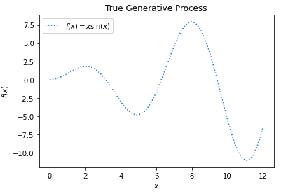

Scikit learn Gaussian true generative process

*   `range = num . random . random state(1)`用于生成随机数。
*   **X_train，Y _ train = X[training _ indexes]，Y[training _ indexes]**用于创建训练和测试数据。
*   **gaussianprocess.fit(X_train，Y_train)** 用于拟合模型。
*   **plot.plot(X，Y，label=r"$f(x) = x \sin(x)$ "，linestyle="dotted"** )用于绘制图形。
*   **plot.scatter(X_train，Y_train，label="Observations")** 用于绘制散点图。
*   **plot.xlabel("$x$")** 用于绘制 x 标签。
*   **plot.ylabel("$f(x)$")** 用于绘制 y 标签。
*   **plot.title("无噪声数据集上的高斯过程回归")**用于给图加标题。

```py
range = num.random.RandomState(1)
training_indices = range.choice(num.arange(Y.size), size=8, replace=False)
X_train, Y_train = X[training_indices], Y[training_indices]
from sklearn.gaussian_process import GaussianProcessRegressor
from sklearn.gaussian_process.kernels import RBF

kernel = 1 * RBF(length_scale=1.0, length_scale_bounds=(1e-2, 1e2))
gaussianprocess = GaussianProcessRegressor(kernel=kernel, n_restarts_optimizer=9)
gaussianprocess.fit(X_train, Y_train)
gaussianprocess.kernel_
mean_prediction, std_prediction = gaussian_process.predict(X, return_std=True)

plot.plot(X, Y, label=r"$f(x) = x \sin(x)$", linestyle="dotted")
plot.scatter(X_train, Y_train, label="Observations")
plot.plot(X, mean_prediction, label="Mean Prediction")
plot.fill_between(
    X.ravel(),
    mean_prediction - 1.98 * std_prediction,
    mean_prediction + 1.98 * std_prediction,
    alpha=0.7,
    label=r"95% confidence interval",
)
plot.legend()
plot.xlabel("$x$")
plot.ylabel("$f(x)$")
Gaussian = plot.title("Gaussian Process Regression on noise-free dataset")
```

运行上述代码后，我们得到以下输出，其中我们可以看到无噪声数据集上的高斯过程回归。

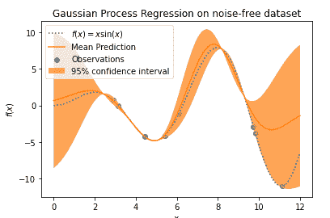

Scikit learn Gaussian

另外，检查: [Scikit-learn 逻辑回归](https://pythonguides.com/scikit-learn-logistic-regression/)

## Scikit 学习高斯混合模型

在本节中，我们将了解**Scikit 如何在 python 中学习高斯混合模型的工作方式**。

*   **Scikit 学习高斯混合模型**用于定义表示高斯模型概率分布的过程。
*   **高斯混合**也允许评估模型的参数。

**代码:**

在下面的代码中，我们将导入一些代表高斯模型概率分布的库。

*   `num.random.seed(0)` 用于生成两个分量的随机样本。
*   **shiftedgaussian = num . random . randn(n _ samples，2) + num.array([25，25])** 用于生成球面数据。
*   **stretchedgaussian = num . dot(num . random . randn(n _ samples，2)，c)** 用于生成以零为中心的拉伸高斯数据。
*   **X _ train = num . v stack([shiftedgaussian，stretchedgaussian])** 用于将两个数据集集中到最终的训练集中。
*   **分类器=混合物。GaussianMixture(n_components=2，协方差 _type="full")** 用于拟合具有两个分量的高斯混合模型。
*   **cs=plot.contour(X，Y，Z，norm=LogNorm(vmin=2.0，vmax=1000.0)，levels=num.logspace(0，3，10) )** 用于预测分数作为反标绘。
*   **plot.scatter(X_train[:，0]，X_train[:，1]，0.10)** 用于绘制散点图。
*   **plot.title("高斯混合法预测的负对数似然")**用于在图上标出标题。
*   **plot.axis("紧")**用于在图形上绘制轴。

```py
import numpy as num
import matplotlib.pyplot as plot
from matplotlib.colors import LogNorm
from sklearn import mixture

n_samples = 350

num.random.seed(0)

shiftedgaussian = num.random.randn(n_samples, 2) + num.array([25, 25])

c = num.array([[0.0, -0.9], [3.5, 0.9]])
stretchedgaussian = num.dot(num.random.randn(n_samples, 2), c)

X_train = num.vstack([shiftedgaussian, stretchedgaussian])

classifier = mixture.GaussianMixture(n_components=2, covariance_type="full")
classifier.fit(X_train)

x = num.linspace(-25.0, 35.0)
y = num.linspace(-25.0, 45.0)
X, Y = num.meshgrid(x, y)
XX = num.array([X.ravel(), Y.ravel()]).T
Z = -classifier.score_samples(XX)
Z = Z.reshape(X.shape)

cs = plot.contour(
    X, Y, Z, norm=LogNorm(vmin=2.0, vmax=1000.0), levels=num.logspace(0, 3, 10)
)
cb = plot.colorbar(cs, shrink=0.10, extend="both")
plot.scatter(X_train[:, 0], X_train[:, 1], 0.10)

plot.title("Negative log-likelihood predicted by a Gaussian Mixture Method")
plot.axis("tight")
plot.show()
```

**输出:**

运行上面的代码后，我们得到下面的输出，其中我们可以看到高斯混合方法是基于屏幕的。

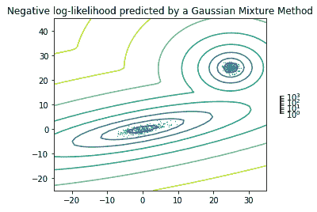

Scikit learn Gaussian mixture model

阅读: [Scikit 学习隐马尔可夫模型](https://pythonguides.com/scikit-learn-hidden-markov-model/)

## Scikit 学习高斯过程

在本节中，我们将了解**Scikit 如何在 python 中学习高斯过程的工作方式**。

*   Scikit learn Gaussian processes 可用于回归和分类，在此帮助下，我们可以创建离散数据结构。
*   离散数据结构被定义为离散形式的数据。

**代码:**

在下面的代码中，我们将导入一些库，在高斯过程的帮助下，我们可以从中创建一个离散的数据结构。

*   `self . baseline _ similarity _ bounds = baseline _ similarity _ bounds`用于创建基线边界。
*   **return sum([1.0 if C1 = = C2 else self . baseline _ similarity for C1 in S1 for C2 in S2])**用于返回一对序列之间的核值。
*   **plot.figure(figsize=(8，5))** 用于在屏幕上绘制图形。
*   **plot . X ticks(num . arange(len(X))，X)** 用于在图形上绘制 X 刻度。
*   **plot . y ticks(num . arange(len(X))，X)** 用于在图形上绘制 y 刻度。
*   **plot.title("核下序列相似度")**用于给出屏幕上的标题。
*   `Gaussian process = Gaussian process regressor(kernel = kernel)`用于处理高斯回归量。
*   **Gaussian process . fit(X[training _ idx]，Y[training_idx])** 用于拟合模型。
*   **plot.bar(num.arange(len(X))，gp.predict(X)，color="r "，label="prediction")** 用于在屏幕上绘制条形。
*   **plot . X ticks(num . arange(len(X))，X)** 用于绘制 X 刻度。
*   **plot.title("序列上的回归")**用于给图形赋予标题。
*   `Gaussian process = Gaussian process classifier(kernel)`用于处理高斯分类器。
*   **plot.figure(figsize=(8，5))** 用于在屏幕上绘制图形。

```py
import numpy as num
import matplotlib.pyplot as plot
from sklearn.gaussian_process.kernels import Kernel, Hyperparameter
from sklearn.gaussian_process.kernels import GenericKernelMixin
from sklearn.gaussian_process import GaussianProcessRegressor
from sklearn.gaussian_process import GaussianProcessClassifier
from sklearn.base import clone

class SequenceKernel(GenericKernelMixin, Kernel):

    def __init__(self, baseline_similarity=0.6, baseline_similarity_bounds=(1e-5, 1)):
        self.baseline_similarity = baseline_similarity
        self.baseline_similarity_bounds = baseline_similarity_bounds

    def hyperparameter_baseline_similarity(self):
        return Hyperparameter(
            "baseline_similarity", "numeric", self.baseline_similarity_bounds
        )

    def _f(self, s1, s2):
                return sum(
            [1.0 if c1 == c2 else self.baseline_similarity for c1 in s1 for c2 in s2]
        )

    def _g(self, s1, s2)
        return sum([0.0 if c1 == c2 else 1.0 for c1 in s1 for c2 in s2])

    def __call__(self, X, Y=None, eval_gradient=False):
        if Y is None:
            Y = X

        if eval_gradient:
            return (
                num.array([[self._f(x, y) for y in Y] for x in X]),
                num.array([[[self._g(x, y)] for y in Y] for x in X]),
            )
        else:
            return num.array([[self._f(x, y) for y in Y] for x in X])

    def diag(self, X):
        return num.array([self._f(x, x) for x in X])

    def is_stationary(self):
        return False

    def clone_with_theta(self, theta):
        cloned = clone(self)
        cloned.theta = theta
        return cloned

kernel = SequenceKernel()

X = num.array(["AGCT", "AGC", "AACT", "TAA", "AAA", "GAACA"])

K = kernel(X)
D = kernel.diag(X)

plot.figure(figsize=(8, 5))
plot.imshow(num.diag(D ` -0.5).dot(K).dot(num.diag(D ` -0.5)))
plot.xticks(num.arange(len(X)), X)
plot.yticks(num.arange(len(X)), X)
plot.title("Sequence similarity Under kernel")

"""
Regression

"""

X = num.array(["AGCT", "AGC", "AACT", "TAA", "AAA", "GAACA"])
Y = num.array([2.0, 2.0, 3.0, 3.0, 4.0, 4.0])

training_idx = [1, 2, 3, 4]
gaussianprocess = GaussianProcessRegressor(kernel=kernel)
gaussianprocess.fit(X[training_idx], Y[training_idx])

plot.figure(figsize=(8, 5))
plot.bar(num.arange(len(X)), gp.predict(X), color="r", label="prediction")
plot.bar(training_idx, Y[training_idx], width=0.2, color="y", alpha=1, label="training")
plot.xticks(num.arange(len(X)), X)
plot.title("Regression On Sequences")
plot.legend()

"""
Classification
"""

X_train = num.array(["AGCT", "CGA", "TAAC", "TCG", "CTTT", "TGCT"])
Y_train = num.array([True, True, True, False, False, False])

gaussianprocess  = GaussianProcessClassifier(kernel)
gaussianprocess.fit(X_train, Y_train)

X_test = ["AAA", "ATAG", "CTC", "CT", "C"]
Y_test = [True, True, False, False, False]

plot.figure(figsize=(8, 5))
plot.scatter(
    num.arange(len(X_train)),
    [1.0 if c else -1.0 for c in Y_train],
    s=100,
    marker="o",
    edgecolor="none",
    facecolor=(1, 0.75, 0),
    label="training",
)
plot.scatter(
    len(X_train) + num.arange(len(X_test)),
    [1.0 if c else -1.0 for c in Y_test],
    s=100,
    marker="o",
    edgecolor="none",
    facecolor="b",
    label="truth",
)
plot.scatter(
    len(X_train) + num.arange(len(X_test)),
    [1.0 if c else -1.0 for c in gp.predict(X_test)],
    s=100,
    marker="x",
    edgecolor=(0, 2.0, 0.4),
    linewidth=2,
    label="prediction",
)
plot.xticks(num.arange(len(X_train) + len(X_test)), num.concatenate((X_train, X_test)))
plot.yticks([-1, 1], [False, True])
plot.title("Classification On Sequences")
plot.legend()

plot.show()
```

**输出:**

运行上述代码后，我们得到以下输出，其中我们可以看到在 scikit learn Gaussian 进程的帮助下，离散数据结构被绘制在屏幕上。

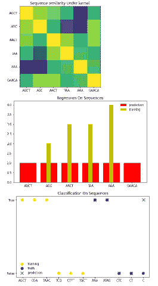

Scikit learn Gaussian Processes

阅读: [Scikit 学习随机森林](https://pythonguides.com/scikit-learn-random-forest/)

## Scikit 学习高斯回归

在本节中，我们将了解**Scikit 如何在 python 中学习高斯回归的工作方式**。

**Scikit learn 高斯回归**被定义为一种在机器学习领域产生波动的非参数方法。

**代码:**

在下面的代码中，我们将导入一些库，从中我们可以创建一个高斯回归器。

*   **x，y = make_friedman2(n_samples=550，noise=0，random_state=0)** 用于制作 friedman。
*   **gaussianProcessregression = GaussianProcessRegressor(内核=内核，随机状态=0)。fit(x，y)** 用于创建高斯回归方程并拟合模型。
*   **gaussianprocessregression . score(x，y)** 用于统计分数。

```py
from sklearn.datasets import make_friedman2
from sklearn.gaussian_process import GaussianProcessRegressor
from sklearn.gaussian_process.kernels import DotProduct, WhiteKernel
x, y = make_friedman2(n_samples=550, noise=0, random_state=0)
kernel = DotProduct() + WhiteKernel()
gaussianProcessregression = GaussianProcessRegressor(kernel=kernel,
        random_state=0).fit(x, y)
gaussianProcessregression.score(x, y)
```

**输出:**

运行上面的代码后，我们得到了下面的输出，其中我们可以看到屏幕上打印出了高斯回归函数的分数。

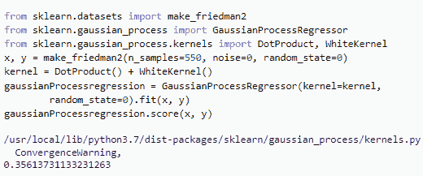

Scikit learn Gaussian regressor

阅读: [Scikit 学习功能选择](https://pythonguides.com/scikit-learn-feature-selection/)

## Scikit 学习高斯回归示例

在本节中，我们将了解 Scikit 学习 python 中高斯回归的例子。

*   Scikit 将高斯学习为具有多元分布随机变量的有限组。
*   Scikit learn 高斯回归被定义为在区域中产生波的贝叶斯方法。

**代码:**

在下面的代码中，我们将导入一些库，从中我们可以创建一个回归图。

*   **x = num.linspace(0，7，num=30)。shape(-1，1)** 用于创建一个 linspace。
*   **y = target_generator(x，add_noise=False)** 用于创建目标生成器。
*   `Gaussian regression = plot . y label(" y ")`用于绘制图表上的 y 标签。
*   `range = num . random . random state(0)`用于生成随机数。
*   **plot.plot(x，y，label= "预期信号")**用于绘制预期信号。
*   `plot.xlabel("x")` 用于绘制 x 标签。
*   **Gaussian process regression = Gaussian process regressor(kernel = kernel，alpha=0.0)** 用于创建高斯回归量。
*   **y_mean，y _ STD = gaussianprocessregression . predict(x，return_std=True)** 用于预测模型。

```py
import numpy as num
def target_generator(x, add_noise=False):
    target = 0.7 + num.sin(5 * x)
    if add_noise:
        range = num.random.RandomState(1)
        target += range.normal(0, 0.5, size=target.shape)
    return target.squeeze()
x = num.linspace(0, 7, num=30).reshape(-1, 1)
y = target_generator(x, add_noise=False)
import matplotlib.pyplot as plot

Gaussianregression= plot.ylabel("y")
range = num.random.RandomState(0)
x_train = range.uniform(0, 5, size=20).reshape(-1, 1)
y_train = target_generator(x_train, add_noise=True)
plot.plot(x, y, label="Expected signal")
plot.scatter(
    x=x_train[:, 0],
    y=y_train,
    color="red",
    alpha=0.4,
    label="Observations",
)
plot.legend()
plot.xlabel("x")
Gaussianregression = plot.ylabel("y")
from sklearn.gaussian_process import GaussianProcessRegressor
from sklearn.gaussian_process.kernels import RBF, WhiteKernel

kernel = 1.0 * RBF(length_scale=1e1, length_scale_bounds=(1e-2, 1e3)) + WhiteKernel(
    noise_level=1, noise_level_bounds=(1e-5, 1e1)
)

gaussianprocessregression = GaussianProcessRegressor(kernel=kernel, alpha=0.0)
gaussianprocessregression.fit(x_train, y_train)
y_mean, y_std = gaussianprocessregression.predict(x, return_std=True)
```

**输出:**

运行上面的代码后，我们得到下面的输出，其中我们可以看到屏幕上绘制的高斯回归示例。

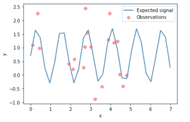

Scikit learn Gaussian regressor example

阅读: [Scikit 学习 hidden _ layer _ size](https://pythonguides.com/scikit-learn-hidden_layer_sizes/)

## Scikit 学习高斯朴素贝叶斯

在这一节中，我们将了解到**scikit 如何学习高斯朴素贝叶斯在 python 中的工作方式**。

*   高斯朴素贝叶斯被定义为支持连续值特征的过程。
*   它创建了一个简单的模型，并通过简单地找到点的平均值和标准偏差来拟合该模型。

**代码:**

在下面的代码中，我们将导入一些库，从中创建高斯朴素贝叶斯分类器。

*   `n_samples = 50000` 用于创建 n 个样本。
*   `n _ bin = 5`校准曲线使用 5 个 bin。
*   **x，y = make _ blob(n _ samples = n _ samples，centers=centers，shuffle=False，random_state=42)** 用于生成 5 个 blob，一半的 blob 为正，一半为负。
*   **sample _ weight = NP . random . randomstate(42)。rand(y.shape[0])** 用于生成随机样本。
*   **x_train，x_test，y_train，y_test，sw_train，sw_test = train_test_split(x，y，sample_weight，test_size=0.9，random_state=42 )** 用于将数据集拆分为训练数据和测试数据。
*   **classifier.fit(x_train，y_train)** 定义高斯不支持样本权重。
*   **分类器 _ 保序= CalibratedClassifierCV(分类器，cv=2，方法= "保序")**用于定义保序校准的高斯朴素贝叶斯。
*   **classifier _ sigmoid = calibrated classifiercv(classifier，cv=2，method="sigmoid")** 用于定义为 sigmoid 校准的高斯朴素贝叶斯。
*   `plot.figure()` 用于在屏幕上绘制图形。
*   `plot.scatter()` 用于绘制散点图。
*   `plot.title("Data")` 用于给图形加标题。

```py
import numpy as num
import matplotlib.pyplot as plot
from matplotlib import cm

from sklearn.datasets import make_blobs
from sklearn.naive_bayes import GaussianNB
from sklearn.metrics import brier_score_loss
from sklearn.calibration import CalibratedClassifierCV
from sklearn.model_selection import train_test_split

n_samples = 50000
n_bins = 5  

centers = [(-7, -7), (0, 0), (7, 7)]
x, y = make_blobs(n_samples=n_samples, centers=centers, shuffle=False, random_state=42)

y[: n_samples // 2] = 0
y[n_samples // 2 :] = 1
sample_weight = np.random.RandomState(42).rand(y.shape[0])

x_train, x_test, y_train, y_test, sw_train, sw_test = train_test_split(
    x, y, sample_weight, test_size=0.9, random_state=42
)

classifier = GaussianNB()
classifier.fit(x_train, y_train)  
probability_pos_classifier = classifier.predict_proba(x_test)[:, 1]

classifier_isotonic = CalibratedClassifierCV(classifier, cv=2, method="isotonic")
classifier_isotonic.fit(x_train, y_train, sample_weight=sw_train)
probability_pos_isotonic = classifier_isotonic.predict_proba(X_test)[:, 1]

classifier_sigmoid = CalibratedClassifierCV(classifier, cv=2, method="sigmoid")
classifier_sigmoid.fit(x_train, y_train, sample_weight=sw_train)
probability_pos_sigmoid = classifier_sigmoid.predict_proba(x_test)[:, 1]

print("Brier Score Losses: (the smaller the better)")

classifier_score = brier_score_loss(y_test, probability_pos_classifier, sample_weight=sw_test)
print("No Calibration: %1.3f" % clf_score)

classifier_isotonic_score = brier_score_loss(y_test, probability_pos_isotonic, sample_weight=sw_test)
print("With Isotonic Calibration: %1.3f" % classifier_isotonic_score)

classifier_sigmoid_score = brier_score_loss(y_test, probability_pos_sigmoid, sample_weight=sw_test)
print("With Sigmoid Calibration: %1.3f" % classifier_sigmoid_score)

plot.figure()
y_unique = num.unique(y)
colors = cm.rainbow(num.linspace(0.0, 1.0, y_unique.size))
for this_y, color in zip(y_unique, colors):
    this_x = x_train[y_train == this_y]
    this_sw = sw_train[y_train == this_y]
    plot.scatter(
        this_x[:, 0],
        this_x[:, 1],
        s=this_sw * 50,
        c=color[num.newaxis, :],
        alpha=0.5,
        edgecolor="y",
        label="Class %s" % this_y,
    )
plot.legend(loc="best")
plot.title("Data")

plot.figure()
order = num.lexsort((probability_pos_classifier,))
plot.plot(prob_pos_clf[order], "b", label="No Calibration (%1.3f)" % classifier_score)
plot.plot(
    prob_pos_isotonic[order],
    "g",
    linewidth=3,
    label="Isotonic Calibration (%1.3f)" % classifier_isotonic_score,
)
plot.plot(
    probability_pos_sigmoid[order],
    "y",
    linewidth=3,
    label="Sigmoid Calibration (%1.3f)" % classifier_sigmoid_score,
)
plot.plot(
    num.linspace(0, y_test.size, 51)[1::2],
    y_test[order].reshape(25, -1).mean(1),
    "r",
    linewidth=3,
    label=r"Empirical",
)
plot.ylim([-0.05, 1.05])
plot.xlabel("Instances Sorted According to Predicted Probability (uncalibrated GNB)")
plot.ylabel("P(y=1)")
plot.legend(loc="upper left")
plot.title("Gaussian naive Bayes probabilities")

plot.show()
```

**输出:**

运行上面的代码后，我们得到下面的输出，其中我们可以看到高斯朴素贝叶斯图绘制在屏幕上。

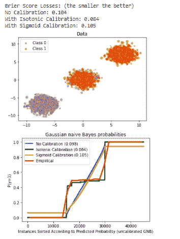

Scikit learn Gaussian naive Bayes

阅读:

## Scikit 学习高斯内核

在本节中，我们将了解 **Scikit 如何在 python 中学习高斯内核**。

**Scikit 学习高斯核**定义为 sigma 确定核的宽度的过程。

**代码:**

在下面的代码中，我们将导入一些库，从中我们可以通过高斯核计算得分。

*   **x，y = load _ iris(return _ X _ y = True)**用于加载数据。
*   **内核= 1.0 * RBF(1.0)** 用于计算内核。
*   **GaussianProcessClassifier = GaussianProcessClassifier(kernel = kernel，random_state=0)。**fit(x，y)用于拟合模型。
*   **gaussianprocessclassifier . score(x，y)** 用于计算得分。

```py
from sklearn.datasets import load_iris
from sklearn.gaussian_process import GaussianProcessClassifier
from sklearn.gaussian_process.kernels import RBF
x, y = load_iris(return_X_y=True)
kernel = 1.0 * RBF(1.0)
gaussianprocessclassifier = GaussianProcessClassifier(kernel=kernel,
                  random_state=0).fit(x, y)
gaussianprocessclassifier.score(x, y)
```

**输出:**

运行上面的代码后，我们得到下面的输出，其中我们可以看到高斯核分数被打印在屏幕上。

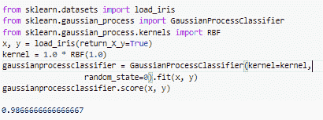

scikit learn Gaussian kernel

阅读: [Scikit 学习分类教程](https://pythonguides.com/scikit-learn-classification/)

## Scikit 学习高斯分类器

在本节中，我们将了解**Scikit 如何学习 python 中的高斯分类器**。

**Scikit learn Gaussian 分类器**被定义为一种高效的方法，致力于将输入类条件分布建模。

**代码:**

在下面的代码中，我们将导入一些库，从中我们可以预测高斯分类器的概率。

*   **x，y = load _ iris(return _ X _ y = True)**用于加载数据。
*   **GaussianProcessClassifier = GaussianProcessClassifier(kernel = kernel，random_state=0)。**fit(x，y)用于拟合分类器模型。
*   **Gaussian classifier . predict _ proba(x[:2，])** 用于预测分类器的概率。

```py
from sklearn.datasets import load_iris
from sklearn.gaussian_process import GaussianProcessClassifier
from sklearn.gaussian_process.kernels import RBF
x, y = load_iris(return_X_y=True)
kernel = 1.0 * RBF(1.0)
gaussianclassifier = GaussianProcessClassifier(kernel=kernel,
                    random_state=0).fit(x, y)
gaussianclassifier.score(x, y)
gaussianclassifier.predict_proba(x[:2,:])
```

**输出:**

运行上面的代码后，我们得到下面的输出，其中我们可以看到屏幕上预测了高斯分类器的概率。

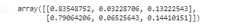

Scikit learn Gaussian classifier

阅读: [Scikit 学习超参数调整](https://pythonguides.com/scikit-learn-hyperparameter-tuning/)

## Scikit 学习高斯过程分类器

在本节中，我们将了解**Scikit 如何在 python 中学习高斯过程分类器的工作方式**。

**Scikit learn 高斯过程分类器**被定义为拉普拉斯近似和支持多类分类的有效方法。

**代码:**

在下面的代码中，我们将导入一些库，在高斯过程分类器的帮助下，我们可以从中制作图形。

*   `iris = datasets . load _ iris()`用于加载一些虹膜数据。
*   **X = iris.data[:，:2]** 用于取前两个特征。
*   **Gaussian process classifier _ RBF _ isotropic = Gaussian process classifier(kernel = kernel)。**fit(X，y)用于拟合模型。
*   **titles = ["各向同性 RBF "，"各向异性 RBF"]** 用来给图加标题。
*   **Z = classifier . predict _ proba(num . c _[xx . ravel()，yy.ravel()])** 用于预测概率
*   **plot.imshow(Z，extent=(x_min，x_max，y_min，y_max)，origin="lower")** 用于绘制图形。
*   **plot.scatter(X[:，0]，X[:，1]，c=num.array(["y "，" c "，" g"])[y]，edgecolors=(0，0，0))** 用于绘制散点图。
*   **plot.xlabel("萼片长度")**用于绘制 x 标签。
*   **plot.title("%s，LML:%.3f(titles[i]，分类器. log_marginal_likelihood(分类器.内核 _)。**)【θ】)`)`用于在图上绘制标题。

```py
import numpy as num
import matplotlib.pyplot as plot
from sklearn import datasets
from sklearn.gaussian_process import GaussianProcessClassifier
from sklearn.gaussian_process.kernels import RBF

iris = datasets.load_iris()
X = iris.data[:, :2] 
y = num.array(iris.target, dtype=int)

h = 0.04  
kernel = 1.0 * RBF([1.0])
gaussianprocessclassifier_rbf_isotropic = GaussianProcessClassifier(kernel=kernel).fit(X, y)
kernel = 1.0 * RBF([1.0, 1.0])
gaussianprocessclassifier_rbf_anisotropic = GaussianProcessClassifier(kernel=kernel).fit(X, y)

x_min, x_max = X[:, 0].min() - 1, X[:, 0].max() + 1
y_min, y_max = X[:, 1].min() - 1, X[:, 1].max() + 1
xx, yy = num.meshgrid(num.arange(x_min, x_max, h), num.arange(y_min, y_max, h))

titles = ["Isotropic RBF", "Anisotropic RBF"]
plot.figure(figsize=(12, 7))
for i, classifier in enumerate((gaussianprocessclassifier_rbf_isotropic, gaussianprocessclassifier_rbf_anisotropic)):

    plot.subplot(1, 2, i + 1)

    Z = classifier.predict_proba(num.c_[xx.ravel(), yy.ravel()])

    Z = Z.reshape((xx.shape[0], xx.shape[1], 3))
    plot.imshow(Z, extent=(x_min, x_max, y_min, y_max), origin="lower")

    plot.scatter(X[:, 0], X[:, 1], c=num.array(["y", "c", "g"])[y], edgecolors=(0, 0, 0))
    plot.xlabel("Sepal length")
    plot.ylabel("Sepal width")
    plot.xlim(xx.min(), xx.max())
    plot.ylim(yy.min(), yy.max())
    plot.xticks(())
    plot.yticks(())
    plot.title(
        "%s, LML: %.3f" % (titles[i], classifier.log_marginal_likelihood(classifier.kernel_.theta))
    )

plot.tight_layout()
plot.show()
```

**输出:**

运行上述代码后，我们得到以下输出，其中我们可以看到屏幕上绘制了高斯过程分类器图。

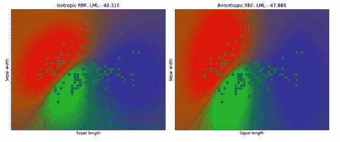

scikit learn Gaussian process classifier

阅读: [Scikit 学习梯度下降](https://pythonguides.com/scikit-learn-gradient-descent/)

## Scikit 学习高斯过程 RBF 内核

在本节中，我们将了解**Scikit 如何学习高斯过程 RBF 内核在 python 中的工作方式**。

**Scikit 学习高斯过程 RBF 核**定义为作为定标器或具有相同维数的核。

**代码:**

在下面的代码中，我们将导入一些库，在 RBF 内核的帮助下，我们可以从中制作一个图形。

*   **x = num.linspace(0，5，100)** 用于创建一个 linspace。
*   **y _ samples = GPR _ model . sample _ y(X，n_samples)** 用于创建样本模型。
*   `axis.plot()` 用于绘制模型。
*   **axis.plot(x，y_mean，color="blue "，label="Mean")** 用于绘制轴。
*   X_train = range.uniform(0，5，10)。整形(-1，1) 用于创建均匀范围。
*   **plot _ GPR _ samples(gaussianprocessregressor，n_samples=n_samples，axis=axs[0])** 用于绘制样本。
*   **axs[0]。set_title("来自先前分布的样本")**用于给图形加标题。
*   **axs[1]。散点图(X_train[:，0]，y_train，color="red "，zorder=10，label="Observations")** 用于绘制散点图。

```py
import matplotlib.pyplot as plot
import numpy as num

def plot_gpr_samples(gpr_model, n_samples, axis):

    x = num.linspace(0, 5, 100)
    X = x.reshape(-1, 1)

    y_mean, y_std = gpr_model.predict(X, return_std=True)
    y_samples = gpr_model.sample_y(X, n_samples)

    for idx, single_prior in enumerate(y_samples.T):
        axis.plot(
            x,
            single_prior,
            linestyle="--",
            alpha=0.7,
            label=f"Sampled function #{idx + 1}",
        )
    axis.plot(x, y_mean, color="blue", label="Mean")
    axis.fill_between(
        x,
        y_mean - y_std,
        y_mean + y_std,
        alpha=0.1,
        color="blue",
        label=r"$\pm$ 1 std. dev.",
    )
    axis.set_xlabel("x")
    axis.set_ylabel("y")
    axis.set_ylim([-3, 3])
    range = num.random.RandomState(4)
X_train = range.uniform(0, 5, 10).reshape(-1, 1)
y_train = num.sin((X_train[:, 0] - 2.5) ** 2)
n_samples = 5
from sklearn.gaussian_process import GaussianProcessRegressor
from sklearn.gaussian_process.kernels import RBF

kernel = 1.0 * RBF(length_scale=1.0, length_scale_bounds=(1e-1, 10.0))
gaussianprocessregressor = GaussianProcessRegressor(kernel=kernel, random_state=0)

fig, axs = plot.subplots(nrows=2, sharex=True, sharey=True, figsize=(10, 8))

plot_gpr_samples(gaussianprocessregressor, n_samples=n_samples, axis=axs[0])
axs[0].set_title("Samples from prior distribution")

gpr.fit(X_train, y_train)
plot_gpr_samples(gaussianprocessregressor, n_samples=n_samples, axis=axs[1])
axs[1].scatter(X_train[:, 0], y_train, color="red", zorder=10, label="Observations")
axs[1].legend(bbox_to_anchor=(1.05, 1.5), loc="upper left")
axs[1].set_title("Samples from posterior distribution")

fig.suptitle("Radial Basis Function kernel", fontsize=18)
plot.tight_layout()
```

**输出:**

运行上述代码后，我们得到以下输出，其中我们可以看到屏幕上绘制了 scikit learn Gaussian process RBF 内核图。

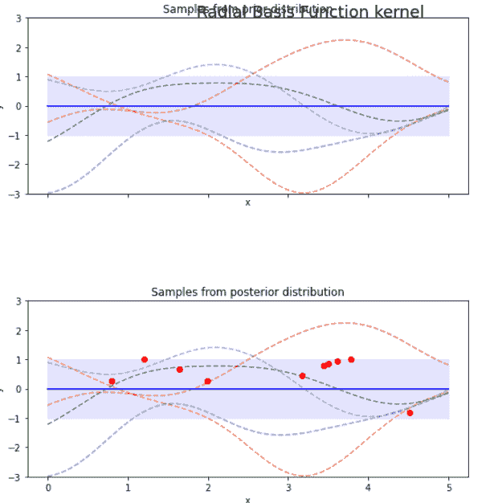

scikit learn Gaussian process RBF kernel

另外，看看更多的 Scikit 学习教程。

*   [Scikit 学习交叉验证【有用指南】](https://pythonguides.com/scikit-learn-cross-validation/)
*   [Scikit 学习管道+示例](https://pythonguides.com/scikit-learn-pipeline/)
*   [Scikit 学习混淆矩阵](https://pythonguides.com/scikit-learn-confusion-matrix/)
*   [Scikit 学习分割数据](https://pythonguides.com/scikit-learn-split-data/)

因此，在本教程中，我们讨论了 `Scikit learn Gaussian` ，我们还涵盖了与其实现相关的不同示例。这是我们已经讨论过的例子列表。

*   Scikit 学习高斯
*   Scikit 学习高斯混合模型
*   Scikit 学习高斯过程
*   Scikit 学习高斯回归
*   Scikit 学习高斯回归示例
*   Scikit 学习高斯朴素贝叶斯
*   Scikit 学习高斯内核
*   Scikit 学习高斯分类器
*   Scikit 学习高斯过程分类器
*   Scikit 学习高斯过程 RBF 核

[Bijay Kumar](https://pythonguides.com/author/fewlines4biju/)

Python 是美国最流行的语言之一。我从事 Python 工作已经有很长时间了，我在与 Tkinter、Pandas、NumPy、Turtle、Django、Matplotlib、Tensorflow、Scipy、Scikit-Learn 等各种库合作方面拥有专业知识。我有与美国、加拿大、英国、澳大利亚、新西兰等国家的各种客户合作的经验。查看我的个人资料。

[enjoysharepoint.com/](https://enjoysharepoint.com/)[](https://www.facebook.com/fewlines4biju "Facebook")[](https://www.linkedin.com/in/fewlines4biju/ "Linkedin")[](https://twitter.com/fewlines4biju "Twitter")