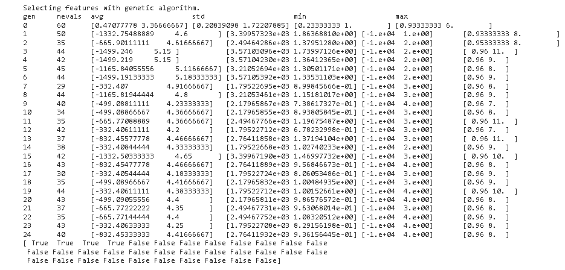
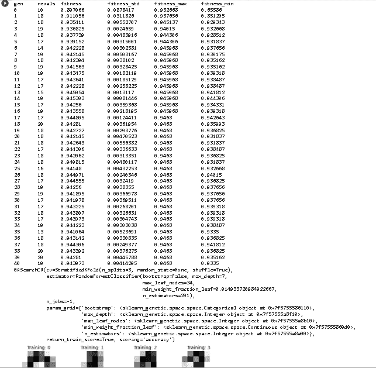
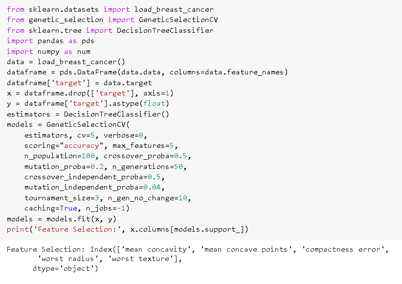
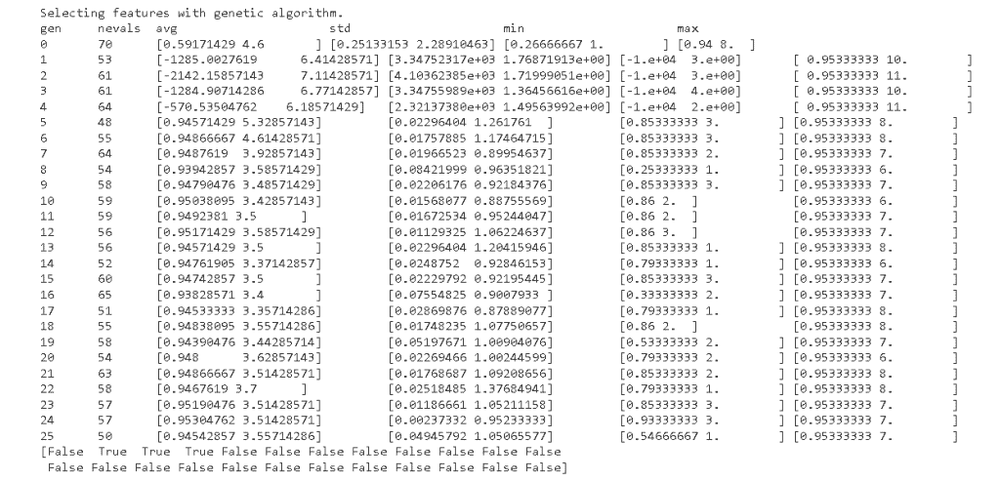

# Scikit 学习遗传算法

> 原文：<https://pythonguides.com/scikit-learn-genetic-algorithm/>

[](https://sharepointsky.teachable.com/p/python-and-machine-learning-training-course)

在本 [Python 教程](https://pythonguides.com/learn-python/)中，我们将学习**sci kit learn 遗传算法如何工作**，我们还将涵盖与遗传算法相关的不同示例。此外，我们将涵盖这些主题。

*   Scikit 学习遗传算法
*   Scikit 学习遗传选项
*   Scikit 学习遗传算法特征选择
*   Scikit 学习遗传选择 cv
*   Scikit 学习遗传算法的优缺点

目录

[](#)

*   [Scikit 学习遗传算法](#Scikit_learn_genetic_algorithm "Scikit learn genetic algorithm ")
*   [Scikit 学习基因选项](#Scikit_learn_genetic_opt "Scikit learn genetic opt")
*   [Scikit 学习遗传算法特征选择](#Scikit_learn_genetic_algorithm_feature_selection "Scikit learn genetic algorithm feature selection")
*   [Scikit 学习基因选择 cv](#Scikit_learn_genetic_selection_cv "Scikit learn genetic selection cv")
*   [Scikit 学习遗传算法的优缺点](#Scikit_learn_genetic_algorithm_advantages_and_disadvantages "Scikit learn genetic algorithm advantages and disadvantages")

## Scikit 学习遗传算法

在这一节，我们将学习**如何 [scikit 学习](https://pythonguides.com/what-is-scikit-learn-in-python/)遗传算法如何**在 python 中工作。

*   在前进之前，我们应该有一些关于遗传学的知识。**基因**被定义为生物进化或与基因有关的品种。
*   **遗传算法**完全专注于自然选择，轻松解决有约束和无约束升级或者我们可以说优化问题。

**代码:**

在下面的代码中，我们将**导入 GeneticSelectionCv** ，从中我们可以从数据集中选择特性。

*   `from _ _ future _ _ import print _ function`用于将打印功能从 python 3 引入 python 2.6。
*   **x = num.hstack((iris.data，e))** 用于逐列堆叠输入数组的序列。
*   **选择器= selectors.fit(x，Y)** 用于将数据拟合到模型中。
*   `print(selectors . support _)`用于打印选中的数据。

```py
from __future__ import print_function
import numpy as num
from sklearn import datasets, linear_model

from genetic_selection import GeneticSelectionCV

def main():
    iris = datasets.load_iris()

    **# Some noisy data not correlated**
    e = num.random.uniform(0, 0.2, size=(len(iris.data), 30))

    x = num.hstack((iris.data, e))
    Y = iris.target

    estimators = linear_model.LogisticRegression(solver="liblinear", multi_class="ovr")

    selectors = GeneticSelectionCV(estimators,
                                  cv=6,
                                  verbose=2,
                                  scoring="accuracy",
                                  max_features=6,
                                  n_population=60,
                                  crossover_proba=0.6,
                                  mutation_proba=0.2,
                                  n_generations=50,
                                  crossover_independent_proba=0.6,
                                  mutation_independent_proba=0.06,
                                  tournament_size=4,
                                  n_gen_no_change=20,
                                  caching=True,
                                  n_jobs=-2)
    selectors = selectors.fit(x, Y)

    print(selectors.support_)

if __name__ == "__main__":
    main()
```

**输出:**

运行上面的代码后，我们得到下面的输出，其中我们可以看到所选的特性被打印在屏幕上。



scikit learn genetic algorithm

另外，请查看: [Scikit-learn 与 tensor flow–详细对比](https://pythonguides.com/scikit-learn-vs-tensorflow/)

## Scikit 学习基因选项

在这一节中，我们将学习 python 中的**基因选择是如何工作的**。

*   Scikit learn genetic opt 定义为观察到的优化交叉验证指标的一组参数。
*   它使用进化算法来选择特征并设计不同的分类或回归模型。

**代码:**

在下面的代码中，我们将导入不同的库，从这些库中我们可以借助 genetic opt 找到分类问题。

*   `GASearchCV` 用于使用进化算法运行拟合过程。
*   `data = load_digits()` 用于加载数据。
*   **x = data . images . shape((n sample，-1))** 用于对数据图像进行整形。
*   **cv = StratifiedKFold(n _ splits = 3，shuffle=True)** 用作交叉验证策略 is 可能只是 int。
*   **evolved _ estimator . fit(x _ train，y_train)** 用于训练和优化估计器。

```py
import matplotlib.pyplot as plot
from sklearn_genetic import GASearchCV
from sklearn_genetic.space import Categorical, Integer, Continuous
from sklearn.model_selection import train_test_split, StratifiedKFold
from sklearn.ensemble import RandomForestClassifier
from sklearn.datasets import load_digits
from sklearn.metrics import accuracy_score
data = load_digits()
nsample = len(data.images)
x = data.images.reshape((nsample, -1))
y = data['target']
x_train, x_test, y_train, y_test = train_test_split(x, y, test_size=0.33, random_state=42)

_, axes = plot.subplots(nrows=1, ncols=4, figsize=(10, 3))
for axis, image, label in zip(axes, data.images, data.target):
    axis.set_axis_off()
    axis.imshow(image, cmap=plot.cm.gray_r, interpolation='nearest')
    axis.set_title('Training: %i' % label)
    param_grid = {'min_weight_fraction_leaf': Continuous(0.01, 0.5, distribution='log-uniform'),
              'bootstrap': Categorical([True, False]),
              'max_depth': Integer(2, 30),
              'max_leaf_nodes': Integer(2, 35),
              'n_estimators': Integer(100, 300)}

classifier = RandomForestClassifier()

cv = StratifiedKFold(n_splits=3, shuffle=True)

**# The main class from sklearn-genetic-opt**
evolved_estimator = GASearchCV(estimator=classifier,
                              cv=cv,
                              scoring='accuracy',
                              param_grid=param_grid,
                              n_jobs=-1,
                              verbose=True)

evolved_estimator.fit(x_train, y_train)
```

**输出:**

运行上面的代码后，我们得到下面的输出，其中我们可以看到数据在 `GASearchCV` 的帮助下被拟合并打印在屏幕上。



scikit learn genetic opt

阅读: [Scikit-learn 逻辑回归](https://pythonguides.com/scikit-learn-logistic-regression/)

## Scikit 学习遗传算法特征选择

在本节中，我们将学习 **scikit 如何在 python 中学习遗传算法特征选择**。

*   特征选择被定义为当预测模型由开发者开发时减少输入变量数量的过程。
*   遗传算法是对问题的最优值进行自然选择的过程。

**代码:**

在下面的代码中，我们将导入一些库，通过这些库，我们可以在遗传选择函数的帮助下选择特性。

*   `data = load _ breast _ cancer()`用于加载乳腺癌数据集。
*   dataframe = pds。DataFrame(data.data，columns=data.feature_names) 用于导入数据集。
*   **models = models.fit(x，y)** 用于将数据拟合到模型中。
*   **print('Feature Selection:'，x.columns[models.support_])** 用于在屏幕上打印所选特征。

```py
from sklearn.datasets import load_breast_cancer
from genetic_selection import GeneticSelectionCV
from sklearn.tree import DecisionTreeClassifier
import pandas as pds
import numpy as num
data = load_breast_cancer()
dataframe = pds.DataFrame(data.data, columns=data.feature_names)
dataframe['target'] = data.target
x = dataframe.drop(['target'], axis=1)
y = dataframe['target'].astype(float)
estimators = DecisionTreeClassifier()
models = GeneticSelectionCV(
    estimators, cv=5, verbose=0,
    scoring="accuracy", max_features=5,
    n_population=100, crossover_proba=0.5,
    mutation_proba=0.2, n_generations=50,
    crossover_independent_proba=0.5,
    mutation_independent_proba=0.04,
    tournament_size=3, n_gen_no_change=10,
    caching=True, n_jobs=-1)
models = models.fit(x, y)
print('Feature Selection:', x.columns[models.support_])
```

**输出:**

运行上面的代码后，我们得到了下面的输出，其中我们可以看到特性选择被打印在屏幕上。



scikit learn genetic algorithm feature selection

阅读: [Scikit 学习决策树](https://pythonguides.com/scikit-learn-decision-tree/)

## Scikit 学习基因选择 cv

在本节中，我们将了解**scikit 如何在 python 中学习遗传选择 cv 的工作方式**。

scikit learn 遗传选择被定义为探索函数的最佳值的自然选择过程

**代码:**

在下面的代码中，我们将从 genetic_selection 导入 GeneticSelectionCV，选择器通过它选择最佳特性。

*   `from _ _ future _ _ import print _ function`用于将打印功能从 python 3 引入 python 2.6。
*   **e = np.random.uniform(0，0.1，size=(len(iris.data)，20))** 用于均匀生成随机数。
*   **x = np.hstack((iris.data，e))** 用于按列堆叠输入数组的序列。
*   `GeneticSelectionCV()` 用于从样本空间中随机生成特征集。
*   **selectors = selectors.fit(x，y)** 用于拟合模型。
*   `print(selectors . support _)`用于打印选中的数据。

```py
from __future__ import print_function
import numpy as num
from sklearn import datasets, linear_model

from genetic_selection import GeneticSelectionCV

def main():
    iris = datasets.load_iris()
    e = np.random.uniform(0, 0.1, size=(len(iris.data), 20))

    x = np.hstack((iris.data, e))
    y = iris.target

    estimators = linear_model.LogisticRegression(solver="liblinear", multi_class="ovr")

    selectors = GeneticSelectionCV(estimators,
                                  cv=10,
                                  verbose=4,
                                  scoring="accuracy",
                                  max_features=8,
                                  n_population=70,
                                  crossover_proba=0.7,
                                  mutation_proba=0.4,
                                  n_generations=80,
                                  crossover_independent_proba=0.7,
                                  mutation_independent_proba=0.07,
                                  tournament_size=5,
                                  n_gen_no_change=20,
                                  caching=True,
                                  n_jobs=-4)
    selectors = selectors.fit(x, y)

    print(selectors.support_)

if __name__ == "__main__":
    main()
```

**输出:**

运行上面的代码后，我们得到下面的输出，其中我们可以看到所选的数据被打印在屏幕上。



scikit learn genetic selection cv

阅读: [Scikit 学习隐马尔可夫模型](https://pythonguides.com/scikit-learn-hidden-markov-model/)

## Scikit 学习遗传算法的优缺点

在本节中，我们将学习关于 **scikit 学习遗传算法的优点和缺点**在 python 中。

**优点:**

*   遗传算法是很容易理解的人可以很容易地理解这个算法中发生的事情。
*   遗传算法对于噪声环境非常好。
*   遗传算法从染色体组或点群中搜索，而不是从单个点中搜索。
*   遗传算法使用概率转移规则，而不使用确定性规则。
*   遗传算法很容易并行化。
*   遗传算法可以很容易或很好地处理连续或离散问题。
*   遗传算法支持多目标优化。
*   遗传算法是概率性的、时间相关的、非线性的、非平稳的。
*   遗传算法需要的信息更少。
*   使用染色体的遗传算法。

**劣势:**

*   遗传算法要求或需要一个特殊的定义。
*   遗传算法需要较少的关于问题的信息，但是操作符编写和表示很困难。
*   遗传算法具有计算复杂性。
*   遗传算法非常耗时。

您可能还想阅读 Scikit learn 上的以下教程。

*   [Scikit 学习随机森林](https://pythonguides.com/scikit-learn-random-forest/)
*   [Scikit 学岭回归](https://pythonguides.com/scikit-learn-ridge-regression/)
*   [Scikit 学习梯度下降](https://pythonguides.com/scikit-learn-gradient-descent/)
*   [Scikit 学习功能选择](https://pythonguides.com/scikit-learn-feature-selection/)
*   [Scikit 学习线性回归](https://pythonguides.com/scikit-learn-linear-regression/)
*   [Scikit 学习情绪分析](https://pythonguides.com/scikit-learn-sentiment-analysis/)
*   [Scikit 学习管道+示例](https://pythonguides.com/scikit-learn-pipeline/)

因此，在本教程中，我们讨论了****sci kit 学习遗传算法**，我们还涵盖了与其实现相关的不同示例。这是我们已经讨论过的例子列表。**

 ***   Scikit 学习遗传算法
*   Scikit 学习遗传选项
*   Scikit 学习遗传算法特征选择
*   Scikit 学习遗传选择 cv
*   Scikit 学习遗传算法的优缺点

[Bijay Kumar](https://pythonguides.com/author/fewlines4biju/)

Python 是美国最流行的语言之一。我从事 Python 工作已经有很长时间了，我在与 Tkinter、Pandas、NumPy、Turtle、Django、Matplotlib、Tensorflow、Scipy、Scikit-Learn 等各种库合作方面拥有专业知识。我有与美国、加拿大、英国、澳大利亚、新西兰等国家的各种客户合作的经验。查看我的个人资料。

[enjoysharepoint.com/](https://enjoysharepoint.com/)[](https://www.facebook.com/fewlines4biju "Facebook")[](https://www.linkedin.com/in/fewlines4biju/ "Linkedin")[](https://twitter.com/fewlines4biju "Twitter")**