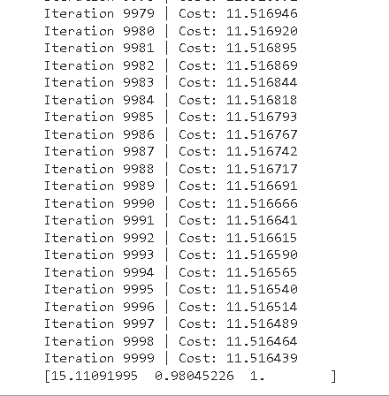
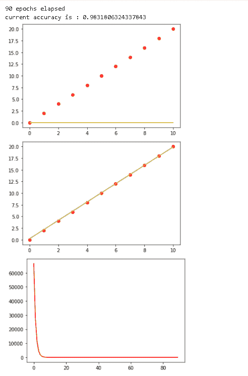
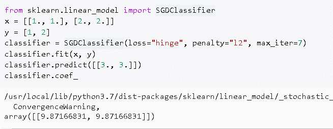
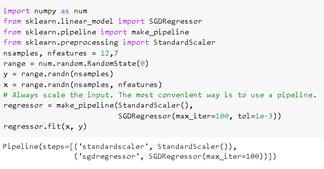
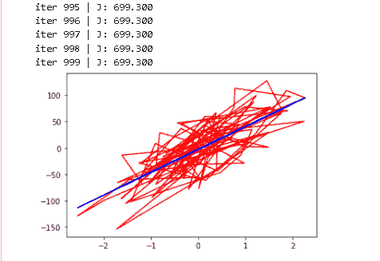
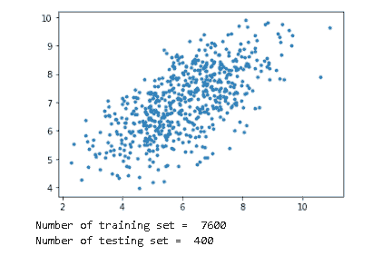
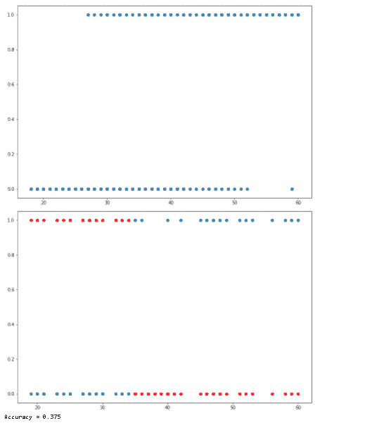
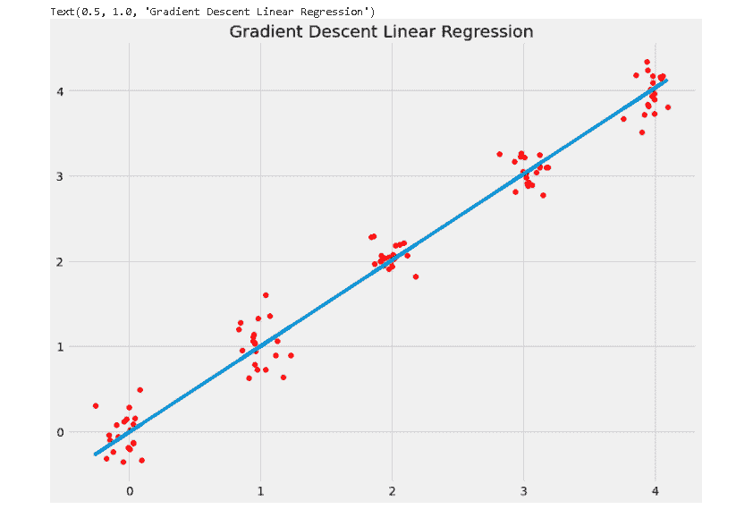

# Scikit 学习梯度下降

> 原文：<https://pythonguides.com/scikit-learn-gradient-descent/>

[](https://sharepointsky.teachable.com/p/python-and-machine-learning-training-course)

在本 [Python 教程](https://pythonguides.com/learn-python/)中，我们将学习**Scikit learn Gradient descent 如何在python 中工作**，我们还将涵盖与**渐变 descent** 相关的不同例子。此外，我们将涵盖这些主题。

*   Scikit 学习梯度下降
*   Scikit 学习梯度下降回归
*   Scikit 学习随机梯度下降分类器
*   Scikit 学习批次梯度下降
*   Scikit 学习迷你批次梯度下降
*   Scikit 学习随机梯度下降回归
*   Scikit 学习逻辑回归梯度下降
*   Scikit 学习梯度下降线性回归

目录

[](#)

*   [Scikit 学习梯度下降](#Scikit_learn_gradient_descent "Scikit learn gradient descent ")
*   [Scikit 学习梯度下降回归](#Scikit_learn_gradient_descent_regression "Scikit learn gradient descent regression")
*   [Scikit 学习随机梯度下降分类器](#Scikit_learn_stochastic_gradient_descent_classifier "Scikit learn stochastic gradient descent classifier")
*   [Scikit 学习随机梯度下降回归](#Scikit_learn_stochastic_gradient_descent_regression "Scikit learn stochastic gradient descent regression")
*   [Scikit 学习批次梯度下降](#Scikit_learn_batch_gradient_descent "Scikit learn batch gradient descent ")
*   [Scikit 学习迷你批次梯度下降](#Scikit_learn_minibatch_gradient_descent "Scikit learn minibatch gradient descent")
*   [Scikit 学习逻辑回归梯度下降](#Scikit_learn_logistic_regression_gradient_descent "Scikit learn logistic regression gradient descent")
*   [Scikit 学习梯度下降线性回归](#Scikit_learn_gradient_descent_linear_regression "Scikit learn gradient descent linear regression")

## Scikit 学习梯度下降

在本节中，我们将了解**Scikit 如何在python 中学习渐变下降**。

*   **梯度下降**是[机器学习](https://pythonguides.com/machine-learning-using-python/)的主干，在训练模型时使用。它还结合了每一个算法，很容易理解。
*   [Scikit learn](https://pythonguides.com/what-is-scikit-learn-in-python/) 梯度下降是回归器和分类器的一种非常简单有效的方法。
*   它还适用于大规模和机器学习问题，并且在文本分类、自然语言处理方面也有经验。
*   在 scikit 学习梯度下降中，损失梯度一次猜测每个样本，然后更新我们的模型。

**代码:**

在下面的代码中，我们导入一些函数来计算损失、假设以及梯度。

*   **假设= num.dot(X，theta)** 用于计算假设。
*   **损失=假设–Y**用于计算损失。
*   `CST = num . sum(loss * * 2)/(2 * a)`用于计算成本。
*   **theta = theta–alpha * gradient**用于更新 theta 参数。
*   **Y[I]=(I+bias)+rand . uniform(0，2) *方差**作为目标变量。
*   **X，Y = genData(90，20，9)** 用于生成 90 个点，以 20 和 10 方差为基础，作为一点噪声。
*   **打印(θ)**用于打印θ的值。

```py
import numpy as num
import random as rand

def gradientDescent(X, Y, theta, alpha, a, numIterations):
    Xtrans = X.transpose()
    for i in range(0, numIterations):
        hypothesis = num.dot(X, theta)
        loss = hypothesis - Y

        cst = num.sum(loss ** 2) / (2 * a)
        print("Iteration %d | Cost: %f" % (i, cst))
        gradient = num.dot(Xtrans, loss) / a
        theta = theta - alpha * gradient
    return theta

def genData(numPoints, bias, variance):
    X = num.zeros(shape=(numPoints, 3))
    Y = num.zeros(shape=numPoints)
    **# basically a straight line**
    for i in range(0, numPoints):
        X[i][0] = 2
        X[i][1] = i
        Y[i] = (i + bias) + rand.uniform(0, 2) * variance
    return X, Y
X,Y = genData(90, 20, 9)
a, b = num.shape(X)
numIterations= 10000
alpha = 0.0004
theta = num.ones(b)
theta = gradientDescent(X,Y, theta, alpha,a, numIterations)
print(theta)
```

**输出:**

运行上面的代码后，我们得到下面的输出，我们可以看到点数已经生成，theta 的值打印在屏幕上。



Scikit learn gradient descent

阅读: [Scikit-learn 逻辑回归](https://pythonguides.com/scikit-learn-logistic-regression/)

## Scikit 学习梯度下降回归

在本节中，我们将了解**Scikit 如何学习梯度下降回归在 python 中工作**。

*   sci kit learn gradient descent regressor 被定义为计算成本函数并支持不同损失函数以拟合回归模型的过程。
*   梯度下降回归模型便于处理大量的训练数据。

**代码:**

在下面的代码中，我们将导入一些库，从中预测最佳回归线。

*   **自我。X = X** 用于定义一个类的方法。
*   `y_pred = self.predict()` 函数用于预测模型。
*   **self . a[0]= self . a[0]–(learning rate *(1/b)* NP . sum(y _ pred–y)))**用于更新模型的系数。
*   **J =(1/2 * b)*(NP . sum(y _ pred–self . y)* * 2)**用于计算模型的成本。
*   `f = plt.figure(fig)` 用于在图形上绘制图形。
*   **regr.plot_best_fit(y_pred，'初始最佳拟合线')**用于绘制最佳拟合线。
*   **plot.plot(range(iterations)，costs，color='r')** 用于验证成本函数的减少。
*   **regr . predict([I for I in range(10)])**用于使用回归器进行预测。

```py
import numpy as num
import matplotlib.pyplot as plot

class Linear_Regression:
    def __init__(self, X, y):
        self.X = X
        self.y = y
        self.a = [0, 0]

    def update_coeffs(self, learningrate):
        y_pred = self.predict()
        y = self.y
        b = len(y)
        self.a[0] = self.a[0] - (learningrate * ((1/b) *
                                np.sum(y_pred - y)))

        self.a[1] = self.a[1] - (learningrate * ((1/b) *
                                np.sum((y_pred - y) * self.X)))

    def predict(self, X=[]):
        y_pred = np.array([])
        if not X: X = self.X
        a = self.a
        for x in X:
            y_pred = np.append(y_pred, a[0] + (a[1] * x))

        return y_pred

    def get_current_accuracy(self, y_pred):
        t, e = y_pred, self.y
        s = len(y_pred)
        return 1-sum(
            [
                abs(t[i]-e[i])/e[i]
                for i in range(s)
                if e[i] != 0]
        )/s

    def compute_cost(self, y_pred):
        b = len(self.y)
        J = (1 / 2*b) * (np.sum(y_pred - self.y)**2)
        return J

    def plot_best_fit(self, y_pred, fig):
                f = plt.figure(fig)
                plot.scatter(self.X, self.y, color='r')
                plot.plot(self.X, y_pred, color='y')
                f.show()

def main():
    X = np.array([i for i in range(11)])
    y = np.array([2*i for i in range(11)])

    regr = Linear_Regression(X, y)

    iterations = 0
    steps = 90
    learningrate = 0.01
    costs = []

    y_pred = regr.predict()
    regr.plot_best_fit(y_pred, 'Initial best fit line')

    while 1:
        y_pred = regr.predict()
        cst = regr.compute_cost(y_pred)
        costs.append(cst)
        regr.update_coeffs(learningrate)

        iterations += 1
        if iterations % steps == 0:
            print(iterations, "epochs elapsed")
            print("current accuracy is :",
                regr.get_current_accuracy(y_pred))
            break

    **#final best-fit line**
    regr.plot_best_fit(y_pred, 'Final Best Fit Line')

    h = plot.figure('Verification')
    plot.plot(range(iterations), costs, color='r')
    h.show()

    regr.predict([i for i in range(10)])

if __name__ == '__main__':
    main()
```

**输出:**

运行上面的代码后，我们得到下面的代码输出，其中我们可以看到当前的精度和回归最佳拟合线绘制在屏幕上。



Scikit learn gradient descent regression

阅读: [Scikit 学习决策树](https://pythonguides.com/scikit-learn-decision-tree/)

## Scikit 学习随机梯度下降分类器

在本节中，我们将了解**sci kit 如何学习 python 中的随机梯度下降分类器**。

**Scikit learn 随机梯度下降分类器**是一个寻找能够降低代价函数的系数的值的过程。

**代码:**

在下面的代码中，我们将**从 sklearn.linear_model** 中导入 SDGClassifier，通过它我们可以很容易的理解每一个算法。

*   x = [[1。, 1.], [2., 2.]] 用于保存训练样本。
*   **y = [1，2]** 用于保存目标样本。
*   **classifier.fit(x，y)** 用于拟合分类器。
*   分类器预测。, 3.]]) 用于预测分类器。
*   `classifier.coef_` 用于获取保存模型参数的分类器的系数。

```py
from sklearn.linear_model import SGDClassifier
x = [[1., 1.], [2., 2.]]
y = [1, 2]
classifier = SGDClassifier(loss="hinge", penalty="l2", max_iter=7)
classifier.fit(x, y)
classifier.predict([[3., 3.]])
classifier.coef_
```

**输出:**

运行上面的代码后，我们得到下面的输出，其中我们可以看到分类器的系数被打印在屏幕上。



scikit learn stochastic gradient descent classifier

阅读: [Scikit 学习层次聚类](https://pythonguides.com/scikit-learn-hierarchical-clustering/)

## Scikit 学习随机梯度下降回归

在本节中，我们将在 `python` 中了解**sci kit 随机梯度下降回归如何工作**。

**Scikit 学习随机梯度下降回归**计算代价函数，支持损失函数。

**代码:**

在下面的代码中，我们将**从 sklearn.linear_model** 中导入 SGCRegressor，通过它我们可以计算函数的开销，并且还支持不同的对数函数。

*   `range = num . random . random state(0)`用于创建随机函数。
*   `y = range.randn(nsamples)` 用于保存目标样本。
*   **x = range.randn(nsamples，nfeatures)** 用于保存训练样本。
*   **regressor = make _ pipeline(standard scaler()、SGDRegressor(max_iter=100，tol=1e-3))** pipeline 用作带有拟合和预测功能的设置。
*   **regressor.fit(x，y)** 用于拟合模型。

```py
import numpy as num
from sklearn.linear_model import SGDRegressor
from sklearn.pipeline import make_pipeline
from sklearn.preprocessing import StandardScaler
nsamples, nfeatures = 12,7
range = num.random.RandomState(0)
y = range.randn(nsamples)
x = range.randn(nsamples, nfeatures)
#Always scale the input.The most convenient way to use a pipeline.
regressor = make_pipeline(StandardScaler(),
                          SGDRegressor(max_iter=100, tol=1e-3))
regressor.fit(x, y)
```

**输出:**

运行上面的代码后，我们得到下面的输出，我们可以看到屏幕上显示了回归函数。



Scikit learn stochastic gradient descent regressor

阅读: [Scikit 学习隐马尔可夫模型](https://pythonguides.com/scikit-learn-hidden-markov-model/)

## Scikit 学习批次梯度下降

在本节中，我们将了解**Scikit 如何在 python 中学习批量渐变下降的工作方式**。

*   梯度下降是一个观察使函数代价最小的函数参数值的过程。
*   在批量梯度下降中，计算梯度时在每个步骤中使用整个数据集。它还在模型内部构建了简单的更新。

**代码:**

在下面的代码中，我们将**从 sklearn.datasets** 导入 make_regression，批处理梯度下降就是通过它来工作的。

*   **s = X.shape[0]** 作为样本数。
*   l **oss =假设–Y**用于计算损失。
*   `J = num.sum(loss ** 2) / (2 * s)` 用于计算成本。
*   **theta = theta–alpha *梯度**用于更新 he 模型。
*   **X = num.c_[ num.ones(s)，X]** 用于插入列中的值。
*   **Y _ predict = theta[0]+theta[1]* X**用于预测值。
*   **pylab.plot(X[:，1]，Y，' r')** 用于绘制图形。

```py
import numpy as num
import random as rand
from sklearn.datasets import make_regression 
import pylab
from scipy import stats

def gradient_descent_2(alpha, X, Y, numIterations):
    s = X.shape[0]
    theta = num.ones(2)
    X_transpose = X.transpose()
    for iter in range(0, numIterations):
        hypothesis = num.dot(X, theta)
        loss = hypothesis - Y
        J = num.sum(loss ** 2) / (2 * s)  
        print ("iter %s | J: %.3f" % (iter, J))    
        gradient = np.dot(X_transpose, loss) / s         
        theta = theta - alpha * gradient  
    return theta

if __name__ == '__main__':

    X, Y = make_regression(n_samples=100, n_features=1, n_informative=1, 
                        random_state=0, noise=35) 
    s, q = num.shape(X)
    X = num.c_[ num.ones(s), X] # insert column
    alpha = 0.01 # learning rate
    theta = gradient_descent_2(alpha, X, Y, 1000)

    for i in range(X.shape[1]):
        Y_predict = theta[0] + theta[1]*X 
    pylab.plot(X[:,1],Y,'r')
    pylab.plot(X,Y_predict,'b-')
    pylab.show()
```

**输出:**

运行上面的代码后，我们得到下面的输出，其中我们可以看到批量梯度下降图打印在屏幕上。



scikit learn batch gradient descent

阅读: [Scikit 学习岭回归](https://pythonguides.com/scikit-learn-ridge-regression/)

## Scikit 学习迷你批次梯度下降

在本节中，我们将了解 **Scikit 如何在 python 中学习 minibatch 渐变下降的工作方式**。

*   sci kit learn mini batch gradient descent 是 gradient descent 的替代方法，它将大型数据集分成小批，并计算模型的误差。
*   Minibatch 梯度下降可以轻松快速地更新参数。如果批量较大，更新模型时噪音较小。

**代码:**

在下面的代码中，我们将导入一些库，从中我们可以制作一个 minibatch 梯度下降图。

*   **data = num . random . multivarial _ normal(mean，cov，8000)** 用于创建数据。
*   **plot.scatter(data[:600，0]，data[:600，1]，marker = ' . ')**用于绘制或可视化数据。
*   **data = num . h stack((num . ones((data . shape[0]，2))，data))** 用于将输入数组的序列按列堆叠。
*   **X_train = data[:split，:-1]** 用于将数据集拆分成训练数据。
*   **X_test = data[split:，-1]** 用于将数据集拆分成测试数据。
*   **print(" Number of training set = % d " %(X _ train . shape[0])**用于打印训练数据集的数量。
*   **print(" Number of testing set = % d " %(X _ test . shape[0])**用于打印测试数据集的数量。

```py
 import numpy as num
import matplotlib.pyplot as plot

mean = num.array([6.0, 7.0])
cov = num.array([[2.0, 0.97], [0.97, 1.3]])
data = num.random.multivariate_normal(mean, cov, 8000)

plot.scatter(data[:600, 0], data[:600, 1], marker = '.')
plot.show()

data = num.hstack((num.ones((data.shape[0], 2)), data))

split_factor = 0.95
split = int(split_factor * data.shape[0])

X_train = data[:split, :-1]
y_train = data[:split, -1].reshape((-1, 1))
X_test = data[split:, :-1]
y_test = data[split:, -1].reshape((-1, 1))

print("Number of training set = % d"%(X_train.shape[0]))
print("Number of testing set = % d"%(X_test.shape[0]))
```

**输出:**

运行上面的代码后，我们得到下面的输出，其中我们可以看到屏幕上绘制了带有图形的训练和测试集的数量。



scikit learn minibatch gradient descent

阅读: [Scikit 学习随机森林](https://pythonguides.com/scikit-learn-random-forest/)

## Scikit 学习逻辑回归梯度下降

在本节中，我们将了解 **Scikit 如何学习逻辑回归梯度下降在 python 中的工作方式**。

*   Scikit learn 逻辑回归梯度下降是一个解决分类问题的过程，离散变量是一个结果。
*   梯度下降被定义为最小化模型损失或误差的优化算法。

**代码:**

在下面的代码中，我们将导入一些库，从中我们可以进行逻辑回归梯度下降。

*   **数据集来源——https://www.kaggle.com/rakeshrau/social-network-ads**从此处下载数据集。
*   `data = PDS . read _ CSV(" dataa . CSV ")`用于加载数据集。
*   **plot.scatter(data['Age']，data['Purchased'])** 用于绘制或可视化数据集。
*   **X_train，X_test，y_train，y _ test = train _ test _ split(data[' Age ']，data['Purchased']，test_size=0.20)** 用于将数据集分为训练集和测试集。
*   **y_pred = predict(X，b1，b2)** 用于预测模型。
*   **d _ b1 =-2 * sum((Y–Y _ pred)* Y _ pred *(1–Y _ pred))**用于推导相对于 B1 的损失。
*   **d _ b2 =-2 * sum(X *(Y–Y _ pred)* Y _ pred *(1–Y _ pred))**用于推导关于 B2 的损失。
*   **b0，b1 = logistic_regression(X_train，y_train)** 用于训练模型。
*   **y_pred = predict(X_test_norm，b0，b1)** 用于进行预测。
*   **plot.scatter(X_test，y_pred，c="red")** 用于绘制图形。
*   **print(f " Accuracy = { Accuracy/len(y _ pred)} "**用于打印精度。

```py
import numpy as num
import pandas as pds
import matplotlib.pyplot as plot
from sklearn.model_selection import train_test_split
from sklearn.linear_model import LogisticRegression
from math import exp
plot.rcParams["figure.figsize"] = (12, 8)

data = pds.read_csv("dataa.csv")
data.head()

plot.scatter(data['Age'], data['Purchased'])
plot.show()

X_train, X_test, y_train, y_test = train_test_split(data['Age'], data['Purchased'], test_size=0.20)

def normalize(X):
    return X - X.mean()

**# Method to make predictions**
def predict(X, b1, b2):
    return num.array([1 / (1 + exp(-1*b1 + -1*b2*x)) for x in X])

def logistic_regression(X, Y):

    X = normalize(X)

    **# Initializing variables**
    b1 = 0
    b2 = 0
    l = 0.001
    epochs = 350

    for epoch in range(epochs):
        y_pred = predict(X, b1, b2)
        d_b1 = -2 * sum((Y - y_pred) * y_pred * (1 - y_pred))  
        d_b2 = -2 * sum(X * (Y - y_pred) * y_pred * (1 - y_pred))  
       ** # Update b1 and b2**
        b1 = b1 - l * d_b1
        b2 = b2 - l * d_b2

    return b0, b1
b0, b1 = logistic_regression(X_train, y_train)

X_test_norm = normalize(X_test)
y_pred = predict(X_test_norm, b0, b1)
y_pred = [1 if p >= 0.7 else 0 for p in y_pred]

plot.clf()
plot.scatter(X_test, y_test)
plot.scatter(X_test, y_pred, c="red")
plot.show()

accuracy = 0
for i in range(len(y_pred)):
    if y_pred[i] == y_test.iloc[i]:
        accuracy += 1
print(f"Accuracy = {accuracy / len(y_pred)}")
```

**输出:**

运行上面的代码后，我们得到下面的输出，可以看到屏幕上打印了逻辑回归图和准确度分数。



Scikit learn Logistic regression gradient descent

阅读: [Scikit 学习功能选择](https://pythonguides.com/scikit-learn-feature-selection/)

## Scikit 学习梯度下降线性回归

在这一节中，我们将学习关于 **scikit 学习梯度回归线性回归` `在 python 中的作品**。

*   [线性回归](https://pythonguides.com/scikit-learn-linear-regression/)被定义为线性系统，线性回归的系数使用线性代数计算。
*   梯度下降线性回归也是一种优化算法，可以最小化模型的损失和误差。

**代码:**

在下面的代码中，我们将 numpy 作为 num 导入，以找到线性回归梯度下降模型。

*   `a = 0` 是直线的截距。
*   `m = 7` 是直线的斜率。
*   `num.random.seed(45)` 用于生成随机数。
*   **classifier.fit_model(x，y)** 用于拟合模型。
*   **plot.plot(x，classifier . predict _ model(x))**用于绘制图形。
*   **plot.title("梯度下降线性回归")**用于给图加标题。

```py
import numpy as num

class GradientDescentLinearRegression:
    def __init__(self, learning_rate=0.02, iterations=1000):
        self.learning_rate, self.iterations = learning_rate, iterations

    def fit_model(self, x, y):
        a = 0
        m = 7
        n = x.shape[0]
        for _ in range(self.iterations):
            a_gradient = -2 * num.sum(y - m*x + a) / n
            m_gradient = -2 * num.sum(x*(y - (m*x + a))) / n
            a = a + (self.learning_rate * a_gradient)
            m = m - (self.learning_rate * m_gradient)
        self.m, self.a = m, a

    def predict_model(self, X):
        return self.m*X + self.a
num.random.seed(45)
x = num.array(sorted(list(range(5))*20)) + num.random.normal(size=100, scale=0.10)
y = num.array(sorted(list(range(5))*20)) + num.random.normal(size=100, scale=0.20)

classifier = GradientDescentLinearRegression()
classifier.fit_model(x, y)

import matplotlib.pyplot as polt

plot.scatter(x, y, color='red')
plot.plot(x, classifier.predict_model(x))
plot.title("Gradient Descent Linear Regression")
```

**输出:**

运行上面的代码后，我们得到下面的输出，其中我们可以看到屏幕上绘制了梯度下降线性回归图。



scikit gradient decent linear regression

您可能还想阅读 Scikit learn 上的以下教程。

*   [Scikit 学习超参数调整](https://pythonguides.com/scikit-learn-hyperparameter-tuning/)
*   [Scikit 学习 hidden _ layer _ size](https://pythonguides.com/scikit-learn-hidden_layer_sizes/)
*   [Scikit 学习高斯](https://pythonguides.com/scikit-learn-gaussian/)
*   [Scikit 学习 KNN 教程](https://pythonguides.com/scikit-learn-knn-tutorial/)

因此，在本教程中，我们讨论了`sci kit learn gradient descent`，并且我们还涵盖了与其实现相关的不同示例。这是我们已经讨论过的例子列表。

*   Scikit 学习梯度下降
*   Scikit 学习梯度下降回归
*   Scikit 学习随机梯度下降分类器
*   Scikit 学习批次梯度下降
*   Scikit 学习迷你批次梯度下降
*   Scikit 学习随机梯度下降回归
*   Scikit 学习逻辑回归梯度下降
*   Scikit 学习梯度下降线性回归

[Bijay Kumar](https://pythonguides.com/author/fewlines4biju/)

Python 是美国最流行的语言之一。我从事 Python 工作已经有很长时间了，我在与 Tkinter、Pandas、NumPy、Turtle、Django、Matplotlib、Tensorflow、Scipy、Scikit-Learn 等各种库合作方面拥有专业知识。我有与美国、加拿大、英国、澳大利亚、新西兰等国家的各种客户合作的经验。查看我的个人资料。

[enjoysharepoint.com/](https://enjoysharepoint.com/)[](https://www.facebook.com/fewlines4biju "Facebook")[](https://www.linkedin.com/in/fewlines4biju/ "Linkedin")[](https://twitter.com/fewlines4biju "Twitter")