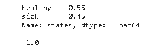

# Scikit 学习隐马尔可夫模型

> 原文：<https://pythonguides.com/scikit-learn-hidden-markov-model/>

[](https://sharepointsky.teachable.com/p/python-and-machine-learning-training-course)

在这个 [Python 教程](https://pythonguides.com/learn-python/)中，我们将学习**如何在 `python` 中创建一个 scikit learn Markov 模型**，我们还将涵盖这些与 Markov 模型相关的例子。我们将讨论这些话题。

*   什么是 scikit learn 马尔可夫模型？
*   是什么让 scikit 学会了马尔可夫模型隐藏
*   Scikit 学习隐马尔可夫模型示例

目录

[](#)

*   [什么是 scikit 学习马尔可夫模型？](#What_is_scikit_learn_Markov_model "What is scikit learn Markov model?")
*   [是什么让 scikit 学会了马尔科夫模型隐藏](#What_made_scikit_learn_Markov_model_hidden "What made scikit learn Markov model hidden")
*   [Scikit 学习隐马尔可夫模型示例](#Scikit_learn_hidden_Markov_model_example "Scikit learn hidden Markov model example")

## 什么是 scikit 学习马尔可夫模型？

在本节中，我们将了解 python 中的 **[Scikit learn](https://pythonguides.com/what-is-scikit-learn-in-python/) 马尔可夫模型**及其工作原理。

马尔可夫模型被定义为随机过程，而未来状态的考虑概率取决于当前过程状态。

**举例:**

假设你想建立一个模型，在给定猫当前状态的情况下，我们的猫处于三态的概率。

我们认为我们的猫很懒。我们定义它的状态睡觉，吃饭，便便。我们将初始概率分别设为 45%、35%和 20%。

**代码:**

```py
import numpy as np
import pandas as pd
import networkx as nx
import matplotlib.pyplot as plot
%matplotlib inline

states = ['sleeping', 'eating', 'pooping']
pi = [0.45, 0.35, 0.2]
state_space = pd.Series(pi, index=states, name='states')
print(state_space)
print(state_space.sum())
```

运行上面的代码后，我们得到下面的输出，其中我们可以看到猫的假设状态的概率。


scikit learn Markov model prediction

下一步是定义简单地处于相同状态或移动到给定当前状态的不同状态的概率。

```py
q_df = pd.DataFrame(columns=states, index=states)
q_df.loc[states[0]] = [0.4, 0.2, 0.4]
q_df.loc[states[1]] = [0.40, 0.40, 0.2]
q_df.loc[states[2]] = [0.40, 0.20, .4]

print(q_df)

q_f = q_df.values
print('\n', q_f, q_f.shape, '\n')
print(q_df.sum(axis=1))
```


scikit learn Markov model transition process

完成上述过程后，我们有了初始概率和转移概率，现在我们使用 Networkx 包创建一个马尔可夫图。

```py
from pprint import pprint 

def _get_markov_edges(Q):
    edge = {}
    for column in Q.columns:
        for index in Q.index:
            edge[(index,column)] = Q.loc[index,column]
    return edge

edge_wt = _get_markov_edges(q_df)
pprint(edge_wt)
```


scikit learn Markov model using networkx

现在我们可以创建一个 scikit 学习马尔可夫模型图。

*   `graph . add _ nodes _ from(States)`用于创建状态对应的节点。
*   **Graph.add_edge(tmp_origin，tmp_destination，weight=v，label=v)** 边代表转移概率。

```py
Graph = nx.MultiDiGraph()

Graph.add_nodes_from(states)
print(f'Nodes:\n{Graph.nodes()}\n')

for k, v in edge_wt.items():
    tmp_origin, tmp_destination = k[0], k[1]
    Graph.add_edge(tmp_origin, tmp_destination, weight=v, label=v)
print(f'Edges:')
pprint(Graph.edges(data=True))    

position = nx.drawing.nx_pydot.graphviz_layout(Graph, prog='dot')
nx.draw_networkx(Graph, position)

edge_labels = {(n1,n2):d['label'] for n1,n2,d in Graph.edges(data=True)}
nx.draw_networkx_edge_labels(Graph , position, edge_labels=edge_labels)
nx.drawing.nx_pydot.write_dot(Graph, 'pet_dog_markov.dot')
```


Scikit learn Markov model graph

阅读: [Scikit-learn 逻辑回归](https://pythonguides.com/scikit-learn-logistic-regression/)

## 是什么让 scikit 学会了马尔科夫模型隐藏

在本节中，我们将了解隐藏的 **scikit 学习模型**以及谁隐藏了马尔可夫模型。

考虑到我们的猫行为怪异，我们发现它们为什么会这样，我们的猫的行为是由于疾病，或者仅仅是它们这样做。

**代码:**

在这里，我们创造了一个空间，可以看到我们的猫是健康的还是生病的。

```py
hidden_state = ['healthy', 'sick']
pi = [0.55, 0.45]
state_space = pd.Series(pi, index=hidden_state, name='states')
print(state_space)
print('\n', state_space.sum())
```



scikit learn Markov hidden state space

下一步，我们将为隐藏状态创建一个转换矩阵。

```py
a1_df = pd.DataFrame(columns=hidden_state, index=hidden_state)
a1_df.loc[hidden_state[0]] = [0.7, 0.3]
a1_df.loc[hidden_state[1]] = [0.4, 0.6]

print(a1_df)

a1 = a1_df.values
print('\n', a1, a1.shape, '\n')
print(a1_df.sum(axis=1))
```


scikit learn transition matrix hidden state

在这一步，我们创建一个发射和观察矩阵。我们创建的矩阵是 axb 的大小。a 是隐藏状态的数量，b 是可观察状态的数量。

```py
observable_state = states

b1_df = pd.DataFrame(columns=observable_state, index=hidden_state)
b1_df.loc[hidden_state[0]] = [0.3, 0.5, 0.2]
b1_df.loc[hidden_state[1]] = [0.3, 0.3, 0.4]

print(b1_df)

b1 = b1_df.values
print('\n', b1, b1.shape, '\n')
print(b1_df.sum(axis=1))
```


scikit learn emission and observable matrix

在这一步中，我们将创建图形边和图形对象，从中我们可以创建一个完整的图形。

```py
hide_edges_wt = _get_markov_edges(a1_df)
pprint(hide_edges_wt)

emit_edges_wt = _get_markov_edges(b1_df)
pprint(emit_edges_wt)
```


scikit learn hidden state graph

这里我们可以画出隐马尔可夫模型的完整图形。

```py
G = nx.MultiDiGraph()

G.add_nodes_from(hidden_state)
print(f'Nodes:\n{G.nodes()}\n')

for k, v in hide_edges_wt.items():
    tmp_origin, tmp_destination = k[0], k[1]
    G.add_edge(tmp_origin, tmp_destination, weight=v, label=v)

for k, v in emit_edges_wt.items():
    tmp_origin, tmp_destination = k[0], k[1]
    G.add_edge(tmp_origin, tmp_destination, weight=v, label=v)

print(f'Edges:')
pprint(G.edges(data=True))    

pos = nx.drawing.nx_pydot.graphviz_layout(G, prog='neato')
nx.draw_networkx(G, pos)
```


scikit learn Markov hidden model

阅读: [Scikit 学习决策树](https://pythonguides.com/scikit-learn-decision-tree/)

## Scikit 学习隐马尔可夫模型示例

在本节中，我们将了解 scikit 在 python 中学习隐马尔可夫模型的例子。

scikit 学习隐马尔可夫模型是一个过程，而未来的未来概率取决于当前状态。

**代码:**

在下面的代码中，我们将导入一些库，并从中创建一个隐马尔可夫模型。

**状态空间= pd。系列(pi，index=states，name='states')** 用于创建状态空间和初始状态空间概率。

**edge[(index，column)] = Q.loc[index，column]** 用于创建映射转移概率数据帧的函数。

`graph . add _ nodes _ from(States)**`用于添加数据**帧对应的节点。

**Graph.add_edge(tmp_origin，tmp_destination，weight=v，label=v)** edges 用于表示过渡属性。

```py
import numpy as np
import pandas as pd
import networkx as nx
import matplotlib.pyplot as plot
%matplotlib inline

states = ['sleeping', 'eating', 'pooping']
pi = [0.45, 0.35, 0.2]
state_space = pd.Series(pi, index=states, name='states')
print(state_space)
print(state_space.sum())
q_df = pd.DataFrame(columns=states, index=states)
q_df.loc[states[0]] = [0.4, 0.2, 0.4]
q_df.loc[states[1]] = [0.40, 0.40, 0.2]
q_df.loc[states[2]] = [0.40, 0.20, .4]

print(q_df)

q_f = q_df.values
print('\n', q_f, q_f.shape, '\n')
print(q_df.sum(axis=1))
from pprint import pprint 

def _get_markov_edges(Q):
    edge = {}
    for column in Q.columns:
        for index in Q.index:
            edge[(index,column)] = Q.loc[index,column]
    return edge

edge_wt = _get_markov_edges(q_df)
pprint(edge_wt)
Graph = nx.MultiDiGraph()

Graph.add_nodes_from(states)
print(f'Nodes:\n{Graph.nodes()}\n')

for k, v in edge_wt.items():
    tmp_origin, tmp_destination = k[0], k[1]
    Graph.add_edge(tmp_origin, tmp_destination, weight=v, label=v)
print(f'Edges:')
pprint(Graph.edges(data=True))    

position = nx.drawing.nx_pydot.graphviz_layout(Graph, prog='dot')
nx.draw_networkx(Graph, position)

edge_labels = {(n1,n2):d['label'] for n1,n2,d in Graph.edges(data=True)}
nx.draw_networkx_edge_labels(Graph , position, edge_labels=edge_labels)
nx.drawing.nx_pydot.write_dot(Graph, 'pet_dog_markov.dot') 
```

**输出:**

运行上面的代码后，我们得到下面的输出，可以看到 Markov 模型被绘制在屏幕上。


scikit learn hidden Markov model

您可能还想阅读以下 Scikit 学习教程。

*   [Scikit-learn Vs Tensorflow](https://pythonguides.com/scikit-learn-vs-tensorflow/)
*   [Scikit 学岭回归](https://pythonguides.com/scikit-learn-ridge-regression/)
*   [Scikit 学习准确度 _ 分数](https://pythonguides.com/scikit-learn-accuracy-score/)
*   [Scikit 学习图像处理](https://pythonguides.com/scikit-learn-image-processing/)
*   [Scikit 学习超参数调整](https://pythonguides.com/scikit-learn-hyperparameter-tuning/)
*   [Scikit 学习层次聚类](https://pythonguides.com/scikit-learn-hierarchical-clustering/)

因此，在本教程中，我们讨论了`sci kit learn hidden Markov model`，并且我们还涵盖了与其实现相关的不同示例。这是我们已经讨论过的例子列表。

*   什么是 scikit learn 马尔可夫模型？
*   是什么让 scikit 学会了马尔可夫模型隐藏
*   Scikit 学习隐马尔可夫模型的例子。

[Bijay Kumar](https://pythonguides.com/author/fewlines4biju/)

Python 是美国最流行的语言之一。我从事 Python 工作已经有很长时间了，我在与 Tkinter、Pandas、NumPy、Turtle、Django、Matplotlib、Tensorflow、Scipy、Scikit-Learn 等各种库合作方面拥有专业知识。我有与美国、加拿大、英国、澳大利亚、新西兰等国家的各种客户合作的经验。查看我的个人资料。

[enjoysharepoint.com/](https://enjoysharepoint.com/)[](https://www.facebook.com/fewlines4biju "Facebook")[](https://www.linkedin.com/in/fewlines4biju/ "Linkedin")[](https://twitter.com/fewlines4biju "Twitter")