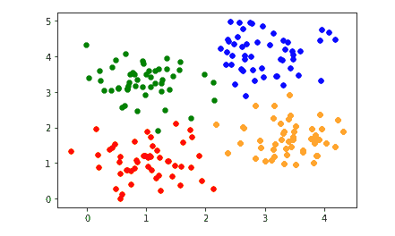
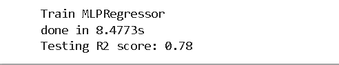
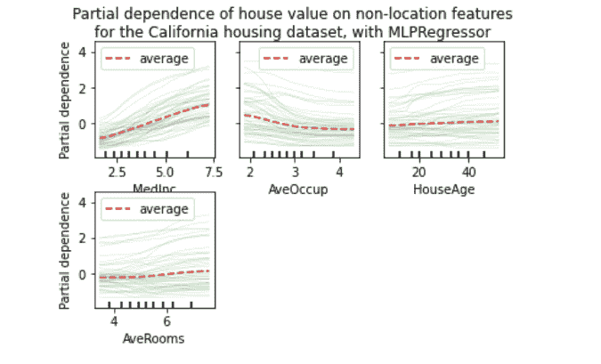

# Scikit 学习隐藏层尺寸

> 原文：<https://pythonguides.com/scikit-learn-hidden_layer_sizes/>

[](https://sharepointsky.teachable.com/p/python-and-machine-learning-training-course)

在这个[Python 教程](https://pythonguides.com/learn-python/)中，我们将学习**scikit 如何在 Python** 中学习 hidden _ layer _ sizes**的工作原理，我们还将涵盖与 hidden_layers_sizes 相关的不同示例。此外，我们将涵盖这些主题。**

*   Scikit 学习隐藏层尺寸
*   Scikit 学习 hidden _ layer _ sizes 示例

目录

[](#)

*   [Scikit 学习 hidden _ layer _ size](#Scikit_learn_hidden_layer_sizes "Scikit learn hidden_layer_sizes")
*   [Scikit 学习 hidden_layer_sizes 示例](#Scikit_learn_hidden_layer_sizes_examples "Scikit learn hidden_layer_sizes examples")

## Scikit 学习 hidden _ layer _ size

在本节中，我们将了解 scikit learn hidden_layer_sizes 如何在 Python 中工作。[Scikit learn](https://pythonguides.com/what-is-scikit-learn-in-python/)hidden _ layer _ sizes 定义为一个参数，允许我们设置神经网络分类器中的层数和节点数。

**代码:**

在下面的代码中，我们将**从 sklearn.datasets** 导入 make _ blobs，通过它我们可以设置层数和节点数。

`n_samples = 200` 用于设置样本数。

**fig，axis = plot.subplots()** 是用来在屏幕上绘制图形的 subplot。

```py
import matplotlib.pyplot as plot
from sklearn.datasets import make_blobs

n_samples = 200
blob_centers = ([1, 1], [3, 4], [1, 3.3], [3.5, 1.8])
data, labels = make_blobs(n_samples = n_samples,
   centers = blob_centers,
   cluster_std = 0.5,
   random_state = 0)

colours = ('red', 'blue', "green", "orange")
fig, axis = plot.subplots()

for n_class in range(len(blob_centers)):
   axis.scatter(data[labels == n_class][: , 0],
      data[labels == n_class][: , 1],
      c = colours[n_class],
      s = 30,
      label = str(n_class))
```

**输出:**

运行上面的代码后，我们得到下面的输出，其中我们可以看到屏幕上绘制了散点。



scikit learn hidden_layer_sizes

另外，检查: [Scikit 学习岭回归](https://pythonguides.com/scikit-learn-ridge-regression/)

## Scikit 学习 hidden_layer_sizes 示例

在本节中，我们将了解 scikit 如何在 Python 中学习 hidden_layer_sizes 示例。

神经网络中的 hidden_layer_sizes 作为一个参数，允许我们设置层数。

**例 1:**

在下面的代码中，**我们将从 sklearn.model_selection** 导入 tain_test_aplit，通过它我们可以拆分训练和测试数据集。

**X = pd。DataFrame(cal_housing.data，columns = cal _ housing . feature _ names)**用于创建数据集。

**X_train，X_test，y_train，y_test = train_test_split(X，y，test_size=0.1，random_state=0)** 用于拆分训练和测试数据。

**est = make _ pipeline(quantile transformer()、MLPRegressor(hidden_layer_sizes =(30，15)、learning_rate_init=0.01、early_stopping=True、random_state=0)，**用于制作管道，在这里面我们给出 hidden _ layer _ sizes。

```py
import pandas as pds
from sklearn.datasets import fetch_california_housing
from sklearn.model_selection import train_test_split

calhousing = fetch_california_housing()
x = pds.DataFrame(calhousing.data, columns=calhousing.feature_names)
y = calhousing.target

y -= y.mean()

x_train, x_test, y_train, y_test = train_test_split(x, y, test_size=0.2, random_state=0)
from time import time
from sklearn.pipeline import make_pipeline
from sklearn.preprocessing import QuantileTransformer
from sklearn.neural_network import MLPRegressor

print("Train MLPRegressor")
tim = time()
estm = make_pipeline(
    QuantileTransformer(),
    MLPRegressor(
        hidden_layer_sizes=(40, 25),
        learning_rate_init=0.02,
        early_stopping=True,
        random_state=0,
    ),
)
estm.fit(x_train, y_train)
print(f"done in {time() - tim:.4f}s")
print(f"Testing R2 score: {estm.score(x_test, y_test):.2f}")
```

**输出:**

运行上面的代码后，我们得到了下面的输出，其中我们可以看到测试分数被打印在屏幕上。



scikit learn hidden_layer_sizes example

**例 2:**

在下面的代码中，我们将**从 sklearn.inspection** 导入 partial _ dependence，通过它我们可以计算部分依赖图。

*   **displays.figure_。suptitle("房屋价值对非位置特征的部分依赖性\n " "对于加利福尼亚住房数据集，使用 mlpre pressor ")**用于显示图形子标题。
*   **displays.figure_。**subplots _ adjust(hspace = 0.3)用于绘制图形。

```py
import matplotlib.pyplot as plt
from sklearn.inspection import partial_dependence
from sklearn.inspection import PartialDependenceDisplay

print("Compute partial dependence plots...")
tim = time()
features = ["MedInc", "AveOccup", "HouseAge", "AveRooms"]
displays = PartialDependenceDisplay.from_estimator(
    est,
    X_train,
    features,
    kind="both",
    subsample=50,
    n_jobs=3,
    grid_resolution=20,
    random_state=0,
    ice_lines_kw={"color": "tab:green", "alpha": 0.2, "linewidth": 0.5},
    pd_line_kw={"color": "tab:red", "linestyle": "--"},
)
print(f"done in {time() - tim:.3f}s")
displays.figure_.suptitle(
    "Partial dependence of house value on non-location features\n"
    "for the California housing dataset, with MLPRegressor"
)
displays.figure_.subplots_adjust(hspace=0.3)
```

**输出:**

运行上述代码后，我们得到以下输出，其中我们可以看到屏幕上绘制了 California housing 数据集的房价对非位置要素的部分依赖关系。



scikit learn hidden_layer_sizes examples

您可能还想阅读以下 Scikit 学习教程。

*   [Scikit 学习功能选择](https://pythonguides.com/scikit-learn-feature-selection/)
*   [Scikit 学习随机森林](https://pythonguides.com/scikit-learn-random-forest/)
*   [Scikit 学习决策树](https://pythonguides.com/scikit-learn-decision-tree/)
*   [Scikit 学习层次聚类](https://pythonguides.com/scikit-learn-hierarchical-clustering/)
*   [Scikit 学习隐马尔可夫模型](https://pythonguides.com/scikit-learn-hidden-markov-model/)
*   [Scikit 学习超参数调整](https://pythonguides.com/scikit-learn-hyperparameter-tuning/)

因此，在本教程中，我们讨论了`Scikit learn hidden _ layer _ sizes`，我们还涵盖了与其实现相关的不同示例。这是我们已经讨论过的例子列表。

*   Scikit 学习隐藏层尺寸
*   Scikit 学习 hidden _ layer _ sizes 示例

[Bijay Kumar](https://pythonguides.com/author/fewlines4biju/)

Python 是美国最流行的语言之一。我从事 Python 工作已经有很长时间了，我在与 Tkinter、Pandas、NumPy、Turtle、Django、Matplotlib、Tensorflow、Scipy、Scikit-Learn 等各种库合作方面拥有专业知识。我有与美国、加拿大、英国、澳大利亚、新西兰等国家的各种客户合作的经验。查看我的个人资料。

[enjoysharepoint.com/](https://enjoysharepoint.com/)[](https://www.facebook.com/fewlines4biju "Facebook")[](https://www.linkedin.com/in/fewlines4biju/ "Linkedin")[](https://twitter.com/fewlines4biju "Twitter")