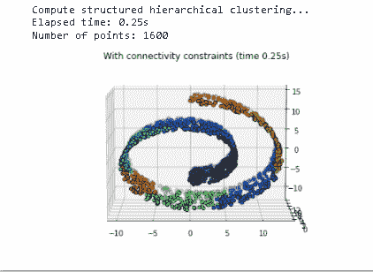
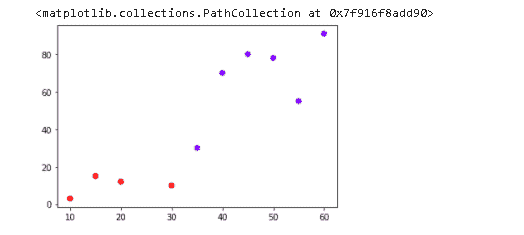
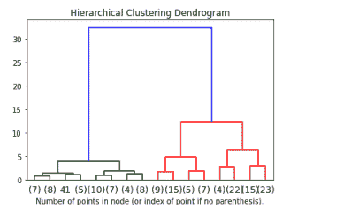
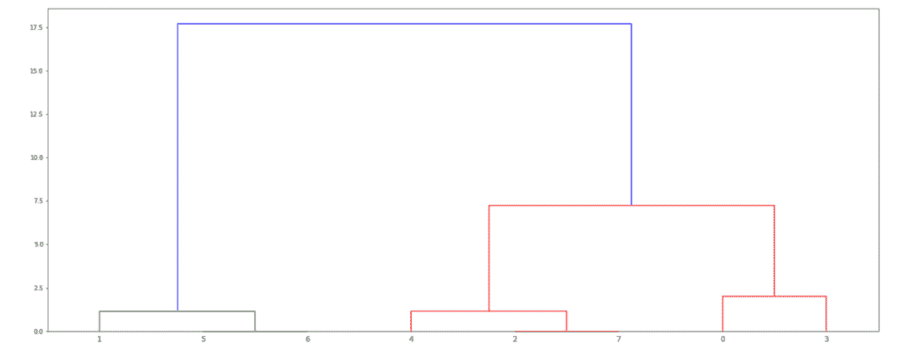
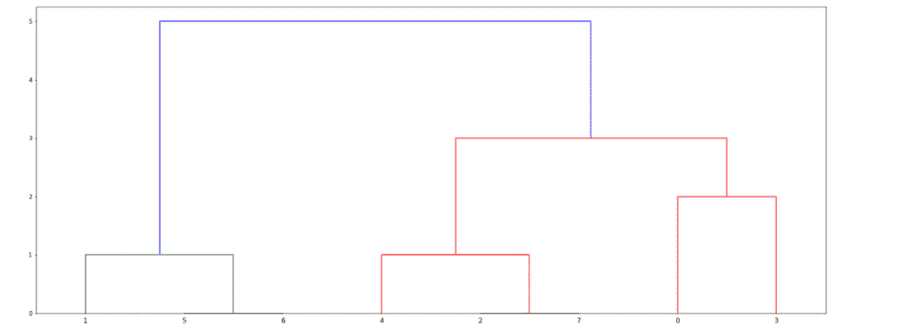
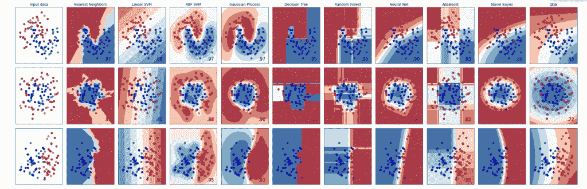

# Scikit 学习层次聚类

> 原文：<https://pythonguides.com/scikit-learn-hierarchical-clustering/>

[](https://sharepointsky.teachable.com/p/python-and-machine-learning-training-course)

在本 Python 教程中，我们将学习**如何让 Scikit 学习 Python** 中的层次聚类，我们还将涵盖与层次聚类相关的不同示例。我们将讨论这些话题。

*   Scikit 学习层次聚类
*   Scikit 学习分层聚类示例
*   Scikit 了解分层聚类功能
*   Scikit 学习层次聚类树状图
*   Scikit 学习层次聚类链接
*   Scikit 学习层次分类

学习[什么是 Python 中的 Scikit 学习](https://pythonguides.com/what-is-scikit-learn-in-python/)

目录

[](#)

*   [Scikit 学习层次聚类](#Scikit_learn_hierarchical_clustering "Scikit learn hierarchical clustering")
*   [Scikit 学习层次聚类示例](#Scikit_learn_hierarchical_clustering_example "Scikit learn hierarchical clustering example")
*   [Scikit 学习层次聚类特性](#Scikit_learn_hierarchical_clustering_features "Scikit learn hierarchical clustering features")
*   [Scikit 学习层次聚类树状图](#Scikit_learn_hierarchical_clustering_dendrogram "Scikit learn hierarchical clustering dendrogram ")
*   [Scikit 学习层次聚类联动](#Scikit_learn_hierarchical_clustering_linkage "Scikit learn hierarchical clustering linkage")
*   [Scikit 学习层次分类](#Scikit_learn_hierarchical_classification "Scikit learn hierarchical classification")

## Scikit 学习层次聚类

在本节中，我们将了解**如何让 scikit 学习 python** 中的层次聚类。

分层聚类的定义是，它是一种将相似对象分类成组的算法。

集群的端点是一组集群，并且每个集群都不同于其他集群。

**代码:**

在下面的代码中，我们将导入一些库 **import time 作为 time** ， **import numpy 作为 np** ， **import matplotlib.pyplot 作为 plot** ，从中我们定义数据的结构。

*   **print(" Compute structured hierarchical clustering…)**用于计算聚类并在屏幕上打印。
*   `plot.figure()` 用于在屏幕上绘制图形。
*   **p3。Axes3D(fig)** 用于在屏幕上绘制 3d fig。

*   **plot . title(" With connectivity constraints(time % . 2fs)" % elapsed _ time)**用来给图加标题。

```py
import time as time
import numpy as np
import matplotlib.pyplot as plot
import mpl_toolkits.mplot3d.axes3d as p3
from sklearn.cluster import AgglomerativeClustering
from sklearn.datasets import make_swiss_roll

connectivity = kneighbors_graph(X, n_neighbors=12, include_self=False)

print("Compute structured hierarchical clustering...")
st = time.time()
ward = AgglomerativeClustering(
    n_clusters=8, connectivity=connectivity, linkage="ward"
).fit(X)
elapsed_time = time.time() - st
label = ward.labels_
print("Elapsed time: %.2fs" % elapsed_time)
print("Number of points: %i" % label.size)

fig = plot.figure()
axis = p3.Axes3D(fig)
axis.view_init(8, -90)
for l in np.unique(label):
    axis.scatter(
        X[label == l, 0],
        X[label == l, 1],
        X[label == l, 2],
        color=plt.cm.jet(float(l) / np.max(label + 1)),
        s=20,
        edgecolor="k",
    )
plot.title("With connectivity constraints (time %.2fs)" % elapsed_time)

plot.show()
```

**输出:**

运行上面的代码后，我们得到了下面的输出，从中我们可以看到层次聚类是通过约束的连通性完成的。



scikit learn hierarchical clustering

阅读[sci kit-学习逻辑回归](https://pythonguides.com/scikit-learn-logistic-regression/)

## Scikit 学习层次聚类示例

在本节中，我们将学习**如何让 scikit 学习 python** 中的层次聚类示例。

*   众所周知，层次聚类将相似的对象分成不同的组。它将每个集群视为一个单独的集群。
*   它识别彼此非常接近的两个集群。合并两个最相似的聚类。

**代码:**

在下面的代码中，我们将导入一些库，从中我们可以绘制层次聚类图。

*   `X = np.array()` 用于创建数据集。
*   **from sklearn.cluster 导入聚合集群**用于从集群导入类。
*   `clusters.fit_predict(X)` 用于预测每个数据点所属的聚类。
*   **plt.scatter(X[:，0]，X[:，1]，c=clusters.labels_，cmap='rainbow')** 用于在屏幕上绘制聚类。

```py
import matplotlib.pyplot as plt
import pandas as pd
%matplotlib inline
import numpy as np
X = np.array([[10,3],
    [15,15],
    [20,12],
    [30,10],
    [35,30],
    [40,70],
    [45,80],
    [50,78],
    [55,55],
    [60,91],])
from sklearn.cluster import AgglomerativeClustering
clusters = AgglomerativeClustering(n_clusters=2, affinity='euclidean', linkage='ward')
clusters.fit_predict(X)
print(clusters.labels_)
plt.scatter(X[:,0],X[:,1], c=clusters.labels_, cmap='rainbow')
```

**输出:**

运行上述代码后，我们得到以下输出，其中我们可以看到显示了两个集群组，前五个集群在一起，后五个集群在一起。



scikit learn hierarchical clustering example

Read [Scikit-learn Vs Tensorflow](https://pythonguides.com/scikit-learn-vs-tensorflow/)

## Scikit 学习层次聚类特性

在本节中，我们将了解 python 中的 **scikit learn 层次聚类特性。**

python 中 sci kit learn hierarchical clusterin 的主要特性有:

*   删除问题
*   数据层次
*   通过指针分级
*   最小化磁盘输入和输出
*   快速导航
*   记录之间的预定义关系
*   难以重组

1.  **删除问题:**删除问题发生在父集群被删除，然后子集群被自动删除，因为子集群连接到父集群。

2.**数据层次:**层次聚类的所有数据都表示为一棵层次树。

3.**通过指针的层次结构**:指针用于链接记录。指针指出哪条记录是父记录，哪条是子记录。

4.**最小化磁盘输入和输出:**父子记录在存储设备上存储得非常接近，这样可以最小化硬盘输入和输出。

5.**快速导航:**父节点与子节点之间的距离非常小，这就是数据性能得以提高的原因。并且在数据库中导航非常快。

6.**记录间的预定义关系:**所有的关系都是预定义的。在层次聚类中，所有的根节点、父节点都是在数据库中预定义的。

7.难以重组:在分层集群中，由于父子关系，很难重组数据库。子节点连接到父节点，如果我们重新组织数据，父节点和子节点之间的关系会变得不匹配。

阅读 [Scikit 学习决策树](https://pythonguides.com/scikit-learn-decision-tree/)

## Scikit 学习层次聚类树状图

本节我们将学习**如何用 python** 让 scikit 学习层次聚类树状图。

分层聚类用于构建聚类树来表示数据，其中每个聚类与最近的相似节点相链接，并形成一个树状图。

**代码:**

在下面的代码中，我们将导入一些库 `import numpy as np` ，从 matplotlib 导入 pyplot as plot ，从 scipy.cluster.hierarchy 导入树状图由此我们构建了一个树状图。

*   **树状图(linkagematrix，`kwargs)` 用于绘制树状图。
*   **model = agglomerate clustering(distance_threshold = 0，n_clusters=None)** 用于设置 distance _ threshold 以确保我们完成完整的树。
*   **plot_dendrogram(model，truncate_mode="level "，p=3)** 用于绘制树状图的前三级。

```py
import numpy as np
from matplotlib import pyplot as plot
from scipy.cluster.hierarchy import dendrogram
from sklearn.datasets import load_iris
from sklearn.cluster import AgglomerativeClustering

def plot_dendrogram(model, **kwargs):

    count = np.zeros(model.children_.shape[0])
    nsamples = len(model.labels_)
    for i, merge in enumerate(model.children_):
        currentcount = 0
        for child_idx in merge:
            if child_idx < nsamples:
                currentcount += 1  
            else:
                currentcount += count[child_idx - nsamples]
        count[i] = currentcount

    linkagematrix = np.column_stack(
        [model.children_, model.distances_, count]
    ).astype(float)

    dendrogram(linkagematrix, **kwargs)

iris = load_iris()
X = iris.data

model = AgglomerativeClustering(distance_threshold=0, n_clusters=None)

model = model.fit(X)
plot.title("Hierarchical Clustering Dendrogram")
plot_dendrogram(model, truncate_mode="level", p=3)
plot.xlabel("Number of points in node (or index of point if no parenthesis).")
```

**输出:**

运行上面的代码后，我们得到下面的输出，我们可以看到屏幕上显示了一个树状图。



scikit learn hierarchical clustering dendrogram

读取 [Scikit 学习准确度 _ 分数](https://pythonguides.com/scikit-learn-accuracy-score/)

## Scikit 学习层次聚类联动

在这一节中，我们将学习 python 中的 **scikit learn 层次聚类链接。**

分层聚类用于构建聚类树来表示数据，其中每个聚类与最近的相似节点相链接。

在层次链接聚类中，两个聚类之间的链接是两点之间的最长距离。

**代码:**

在下面的代码中，我们将从 scipy 导入树图、链接，还将从 [matplotlib](https://pythonguides.com/how-to-install-matplotlib-python/) 导入 pyplot 作为 plot。

我们可以在两个集群之间创建一个 ward 链接，并绘制该集群的图形。

```py
from scipy.cluster.hierarchy import dendrogram, linkage
from matplotlib import pyplot as plot
x = [[i] for i in [4, 12, 0, 6, 1, 11, 11, 0]]
Z = linkage(x, 'ward')
figure = plot.figure(figsize=(25, 10))
den = dendrogram(Z)
```

运行上面的代码后，我们得到下面的输出，我们可以看到屏幕上绘制了一个 ward clusters 树状图。



scikit learn hierarchical clustering ward linkage

在这里，我们可以在两个集群之间创建一个链接集群，并绘制这些集群的图形。

```py
Z = linkage(x, 'single')
figure = plot.figure(figsize=(25, 10))
den = dendrogram(Z)
plot.show()
```

运行上面的代码后，我们得到了下面的输出，其中我们可以看到以树形图的形式创建了一个链接。



scikit learn hierarchical clustering single linkage

阅读: [Scikit 学习线性回归](https://pythonguides.com/scikit-learn-linear-regression/)

## Scikit 学习层次分类

在本节中，我们将学习 python 中的`scikit learn hierarchical class ification`。

等级分类被定义为根据等级或顺序对事物进行聚类的系统。

**代码:**

在这段代码中，我们将导入一些库，从中我们可以创建分类器并进行分层分类。

*   **标准定标器()。**fit _ transform(x)用于拟合数据。
*   **x_train，x_test，y_train，y_test = train_test_split(x，y，test_size=0.4，random_state=42)** 它是一个预处理数据集，将 `t` he 数据拆分为训练和测试部分。
*   **ax.scatter(x_train[:，0]，x_train[:，1]，c=y_train，cmap=cm_bright，edgecolors="k")** 它只是绘制训练点。
*   **ax.scatter(x_test[:，0]，x_test[:，1]，c=y_test，cmap=cm_bright，alpha=0.6，edgecolors="k")** 它只是绘制测试点。

```py
import numpy as np
import matplotlib.pyplot as plot
from matplotlib.colors import ListedColormap
from sklearn.model_selection import train_test_split
from sklearn.preprocessing import StandardScaler
from sklearn.datasets import make_moons, make_circles, make_classification
from sklearn.neural_network import MLPClassifier
from sklearn.neighbors import KNeighborsClassifier
from sklearn.svm import SVC
from sklearn.gaussian_process import GaussianProcessClassifier
from sklearn.gaussian_process.kernels import RBF
from sklearn.tree import DecisionTreeClassifier
from sklearn.ensemble import RandomForestClassifier, AdaBoostClassifier
from sklearn.naive_bayes import GaussianNB
from sklearn.discriminant_analysis import QuadraticDiscriminantAnalysis

h = 0.02  

classifiernames = [
    "Nearest Neighbors",
    "Linear SVM",
    "RBF SVM",
    "Gaussian Process",
    "Decision Tree",
    "Random Forest",
    "Neural Net",
    "AdaBoost",
    "Naive Bayes",
    "QDA",
]

classifiers = [
    KNeighborsClassifier(3),
    SVC(kernel="linear", C=0.025),
    SVC(gamma=2, C=1),
    GaussianProcessClassifier(1.0 * RBF(1.0)),
    DecisionTreeClassifier(max_depth=5),
    RandomForestClassifier(max_depth=5, n_estimators=10, max_features=1),
    MLPClassifier(alpha=1, max_iter=1000),
    AdaBoostClassifier(),
    GaussianNB(),
    QuadraticDiscriminantAnalysis(),
]

x, y = make_classification(
    n_features=2, n_redundant=0, n_informative=2, random_state=1, n_clusters_per_class=1
)
rng = np.random.RandomState(2)
x += 2 * rng.uniform(size=x.shape)
linearly_separable = (x, y)

datasets = [
    make_moons(noise=0.3, random_state=0),
    make_circles(noise=0.2, factor=0.5, random_state=1),
    linearly_separable,
]

figure = plot.figure(figsize=(27, 9))
i = 1

for ds_cnt, ds in enumerate(datasets):

    x, y = ds
    x = StandardScaler().fit_transform(x)
    x_train, x_test, y_train, y_test = train_test_split(
        x, y, test_size=0.4, random_state=42
    )

    x_min, x_max = x[:, 0].min() - 0.5, x[:, 0].max() + 0.5
    y_min, y_max = x[:, 1].min() - 0.5, x[:, 1].max() + 0.5
    xx, yy = np.meshgrid(np.arange(x_min, x_max, h), np.arange(y_min, y_max, h))
    cm = plot.cm.RdBu
    cm_bright = ListedColormap(["#FF0000", "#0000FF"])
    ax = plt.subplot(len(datasets), len(classifiers) + 1, i)
    if ds_cnt == 0:
        ax.set_title("Input data")

    ax.scatter(x_train[:, 0], x_train[:, 1], c=y_train, cmap=cm_bright, edgecolors="k")

    ax.scatter(
        x_test[:, 0], x_test[:, 1], c=y_test, cmap=cm_bright, alpha=0.6, edgecolors="k"
    )
    ax.set_xlim(xx.min(), xx.max())
    ax.set_ylim(yy.min(), yy.max())
    ax.set_xticks(())
    ax.set_yticks(())
    i += 1

    for name, clf in zip(classifiernames, classifiers):
        ax = plt.subplot(len(datasets), len(classifiers) + 1, i)
        clf.fit(x_train, y_train)
        score = clf.score(x_test, y_test)

        if hasattr(clf, "decision_function"):
            Z = clf.decision_function(np.c_[xx.ravel(), yy.ravel()])
        else:
            Z = clf.predict_proba(np.c_[xx.ravel(), yy.ravel()])[:, 1]

        Z = Z.reshape(xx.shape)
        ax.contourf(xx, yy, Z, cmap=cm, alpha=0.8)

        # Plot the training points
        ax.scatter(
            x_train[:, 0], x_train[:, 1], c=y_train, cmap=cm_bright, edgecolors="k"
        )

        ax.scatter(
            x_test[:, 0],
            x_test[:, 1],
            c=y_test,
            cmap=cm_bright,
            edgecolors="k",
            alpha=0.6,
        )

        ax.set_xlim(xx.min(), xx.max())
        ax.set_ylim(yy.min(), yy.max())
        ax.set_xticks(())
        ax.set_yticks(())
        if ds_cnt == 0:
            ax.set_title(name)
        ax.text(
            xx.max() - 0.3,
            yy.min() + 0.3,
            ("%.2f" % score).lstrip("0"),
            size=15,
            horizontalalignment="right",
        )
        i += 1

plot.tight_layout()
plot.show()
```

**输出:**

运行上面的代码后，我们得到下面的输出，我们可以看到屏幕上的分类已经完成。



scikit learn hierarchical classification

另外，看看 scikit learn 上的更多教程。

*   [Scikit 学习隐马尔可夫模型](https://pythonguides.com/scikit-learn-hidden-markov-model/)
*   [Scikit 学岭回归](https://pythonguides.com/scikit-learn-ridge-regression/)
*   [Scikit 学习遗传算法](https://pythonguides.com/scikit-learn-genetic-algorithm/)
*   [Scikit 学习分类教程](https://pythonguides.com/scikit-learn-classification/)

因此，在本教程中，我们讨论了`sci kit learn hierarchical clustering`，我们还介绍了与其实现相关的不同示例。这是我们已经讨论过的例子列表。

*   Scikit 学习层次聚类
*   Scikit 学习分层聚类示例
*   Scikit 了解分层聚类功能
*   Scikit 学习层次聚类树状图
*   Scikit 学习层次聚类链接
*   Scikit 学习层次分类

[Bijay Kumar](https://pythonguides.com/author/fewlines4biju/)

Python 是美国最流行的语言之一。我从事 Python 工作已经有很长时间了，我在与 Tkinter、Pandas、NumPy、Turtle、Django、Matplotlib、Tensorflow、Scipy、Scikit-Learn 等各种库合作方面拥有专业知识。我有与美国、加拿大、英国、澳大利亚、新西兰等国家的各种客户合作的经验。查看我的个人资料。

[enjoysharepoint.com/](https://enjoysharepoint.com/)[](https://www.facebook.com/fewlines4biju "Facebook")[](https://www.linkedin.com/in/fewlines4biju/ "Linkedin")[](https://twitter.com/fewlines4biju "Twitter")