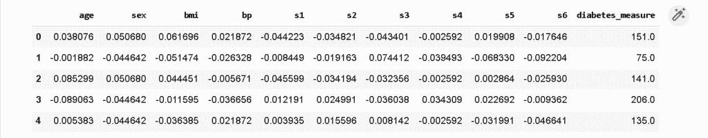

# Scikit 学习超参数调谐

> 原文：<https://pythonguides.com/scikit-learn-hyperparameter-tuning/>

[](https://sharepointsky.teachable.com/p/python-and-machine-learning-training-course)

在本 [Python 教程](https://pythonguides.com/learn-python/)中，我们将学习 **Scikit learn 超参数调优**，我们还将使用 [Scikit learn](https://pythonguides.com/what-is-scikit-learn-in-python/) 涵盖与**超参数调优**相关的不同示例。此外，我们将涵盖这些主题。

*   Scikit 学习超参数调谐
*   Scikit 学习随机森林超参数
*   Scikit 学习逻辑回归超参数调整
*   Scikit 学习神经网络超参数调整
*   Scikit 学习线性回归超参数
*   Scikit 学习 SVM 超参数
*   Scikit 学习超参数估计
*   Scikit 学习超参数优化

目录

[](#)

*   [Scikit 学习超参数调整](#Scikit_learn_Hyperparameter_Tuning "Scikit learn Hyperparameter Tuning")
*   [Scikit 学习随机森林超参数](#Scikit_learn_random_forest_hyperparameter "Scikit learn random forest hyperparameter")
*   [Scikit 学习逻辑回归超参数整定](#Scikit_learn_logistic_regression_hyperparameter_tuning "Scikit learn logistic regression hyperparameter tuning")
*   [Scikit 学习神经网络超参数整定](#Scikit_learn_neural_network_hyperparameter_tuning "Scikit learn neural network hyperparameter tuning")
*   [Scikit 学习线性回归超参数](#Scikit_learn_linear_regression_hyperparameters "Scikit learn linear regression hyperparameters")
*   [Scikit 学习 SVM 超参数](#Scikit_learn_SVM_hyperparameter "Scikit learn SVM hyperparameter")
*   [Scikit 学习超参数估计](#Scikit_learn_hyperparameter_estimation "Scikit learn hyperparameter estimation")
*   [Scikit 学习超参数优化](#Scikit_learn_hyperparameter_optimization "Scikit learn hyperparameter optimization")

## Scikit 学习超参数调整

在本节中，我们将了解 **python 中的 **scikit learn 超参数调优工作**。**

**超参数调整**被定义为作为参数传递给估计器类的构造函数的参数。

**代码:**

*   在下面的代码中，我们将**从 sklearn.utils.fixes** 导入 loguniform，通过它我们比较超参数估计的随机搜索和网格搜索。
*   **load_digits(return_X_y=True，n_class=3)** 用于加载数据。
*   **clf = SGD classifier(loss = " hinge "，penalty="elasticnet "，fit_intercept=True)** 用于构建分类器。
*   **random _ search = RandomizedSearchCV(clf，param_distributions=param_dist，n_iter=n_iter_search)** 用于运行随机大小。
*   **grid _ search = GridSearchCV(clf，param_grid=param_grid)** 用于运行网格搜索。

```py
import numpy as np
from time import time
import scipy.stats as stats
from sklearn.utils.fixes import loguniform

from sklearn.model_selection import GridSearchCV, RandomizedSearchCV
from sklearn.datasets import load_digits
from sklearn.linear_model import SGDClassifier

x, y = load_digits(return_X_y=True, n_class=3)

clf = SGDClassifier(loss="hinge", penalty="elasticnet", fit_intercept=True)

def report(results, n_top=3):
    for i in range(1, n_top + 1):
        candidate = np.flatnonzero(results["rank_test_score"] == i)
        for candidate in candidate:
            print("Model with rank: {0}".format(i))
            print(
                "Mean validation score: {0:.3f} (std: {1:.3f})".format(
                    results["mean_test_score"][candidate],
                    results["std_test_score"][candidate],
                )
            )
            print("Parameters: {0}".format(results["params"][candidate]))
            print("")

param_dist = {
    "average": [True, False],
    "l1_ratio": stats.uniform(0, 1),
    "alpha": loguniform(1e-2, 1e0),
}

n_iter_search = 15
random_search = RandomizedSearchCV(
    clf, param_distributions=param_dist, n_iter=n_iter_search
)

start = time()
random_search.fit(x, y)
print(
    "RandomizedSearchCV took %.2f seconds for %d candidates parameter settings."
    % ((time() - start), n_iter_search)
)
report(random_search.cv_results_)

param_grid = {
    "average": [True, False],
    "l1_ratio": np.linspace(0, 1, num=10),
    "alpha": np.power(10, np.arange(-2, 1, dtype=float)),
}

grid_search = GridSearchCV(clf, param_grid=param_grid)
start = time()
grid_search.fit(x, y)

print(
    "GridSearchCV took %.2f seconds for %d candidate parameter settings."
    % (time() - start, len(grid_search.cv_results_["params"]))
)
report(grid_search.cv_results_)
```

**输出:**

运行上面的代码后，我们得到下面的输出，其中我们可以看到在屏幕上对超参数的随机搜索和网格搜索进行了比较。


scikit learn hyperparameter tuning

另外，请阅读: [Scikit-learn Vs Tensorflow](https://pythonguides.com/scikit-learn-vs-tensorflow/)

## Scikit 学习随机森林超参数

在本节中，我们将了解 **scikit 在 `python` 中学习随机森林超参数的工作方式**。

在 scikit 中，学习超参数包括决策树的数量和在节点分裂时通过分裂每棵树所考虑的特征的数量。

**代码:**

在下面的代码中，我们将**从 sklearn.ensemble** 中导入 RandomForestRegressor，通过它我们可以看到当前使用的超参数。

```py
from sklearn.ensemble import RandomForestRegressor
rf = RandomForestRegressor(random_state = 42)
from pprint import pprint

print('Hyperparameters currently in use:\n')
pprint(rf.get_params())
```

**输出:**

运行上面的代码后，我们得到下面的输出，其中我们可以看到当前使用的超参数被打印在屏幕上。


scikit learn random forest hyperparameter tuning

阅读: [Scikit-learn 逻辑回归](https://pythonguides.com/scikit-learn-logistic-regression/)

## Scikit 学习逻辑回归超参数整定

在本节中，我们将了解 python 中的 **scikit learn 逻辑回归超参数调整**。

*   逻辑回归是一种用于描述数据的预测性分析。它用于评估模型性能的指标，以决定最佳超参数。
*   **代码:**
*   在下面的代码中，我们将从 sklearn 导入 linear_model，通过它我们可以评估模型性能的度量，以决定最佳的超参数。
*   `dataset = datasets . load _ wine()`用于加载数据集。
*   **五氯苯甲醚=分解。PCA()** 主成分分析用于降低特征维数。
*   **print('BestPenalty:'，clf_GS.best_estimator_。get _ params([' logistic _ Regression _ _ penalty '])**用于在屏幕上打印最佳超参数。

```py
import numpy as np
from sklearn import linear_model, decomposition, datasets
from sklearn.pipeline import Pipeline
from sklearn.model_selection import GridSearchCV
from sklearn.preprocessing import StandardScaler
dataset = datasets.load_wine()
X = dataset.data
y = dataset.target
pca = decomposition.PCA()
logistic_Regression = linear_model.LogisticRegression()
pipe = Pipeline(steps=[('std_slc', std_slc),
                       ('pca', pca),
                       ('logistic_Regression', logistic_Regression)])
n_components = list(range(1,X.shape[1]+1,1))
C = np.logspace(-4, 4, 50)
penalty = ['l1', 'l2']
parameters = dict(pca__n_components=n_components,
                      logistic_Regression__C=C,
                      logistic_Regression__penalty=penalty)
clf_GS = GridSearchCV(pipe, parameters)
clf_GS.fit(X, y)
print('Best Penalty:', clf_GS.best_estimator_.get_params()['logistic_Regression__penalty'])
print('Best C:', clf_GS.best_estimator_.get_params()['logistic_Regression__C'])
print('Best Number Of Components:', clf_GS.best_estimator_.get_params()['pca__n_components'])
print(); print(clf_GS.best_estimator_.get_params()['logistic_Regression'])
```

**输出:**

运行上面的代码后，我们得到下面的输出，其中我们可以看到 hyperparameter 的最佳值被打印在屏幕上。


scikit learn logistic regression hyperparameter tuning

阅读: [Scikit 学习决策树](https://pythonguides.com/scikit-learn-decision-tree/)

## Scikit 学习神经网络超参数整定

在本节中，我们将了解 scikit 如何在 python 中学习神经网络超参数调整。

神经网络超参数调整被定义为多个超参数，例如多个隐藏神经元。

**代码:**

在下面的代码中，我们将从 sklearn.neural_network 导入 MLPClassifier，通过它我们可以创建一个神经网络超参数调整。

```py
from sklearn.neural_network import MLPClassifier
x = [[0., 0.], [1., 1.]]
y = [0, 1]
classifier = MLPClassifier(solver='lbfgs', alpha=1e-5,
                    hidden_layer_sizes=(5, 2), random_state=1)

classifier.fit(x, y)
classifier.predict([[2., 2.], [-1., -2.]])
[coef.shape for coef in clf.coefs_]
classifier.predict_proba([[2., 2.], [1., 2.]])
```

**输出:**

运行上述代码后，我们得到以下输出，其中我们可以看到神经网络超参数调整打印在屏幕上。


scikit learn neural network hyperparameter tuning

## Scikit 学习线性回归超参数

在本节中，我们将了解 **scikit 如何在 python 中学习线性回归超参数的工作方式**。

超参数是一个寻找理想模型架构的过程。scikit 学习线性回归是一种线性建模方法。

**代码:**

在下面的代码中，我们将**导入 pandas 作为 pd，导入 numpy 作为 np** 来创建模型。

*   `diabetes = datasets . load _ diabetes()`用于创建数据集。
*   `df.head()` 用于打印前五行。

```py
import numpy as np
import pandas as pd
import matplotlib.pylab as plt
%matplotlib inline
import sklearn
from sklearn import datasets
diabetes = datasets.load_diabetes()
df=pd.DataFrame(diabetes.data)
df.columns= diabetes.feature_names

df['diabetes_measure']=diabetes.target
df.head()
```

运行上面的代码后，我们得到下面的输出，从中我们可以看到数据集的前五行被打印在屏幕上。



scikit learn linear regression hyperparameter dataset

*   **x=df.iloc[:，:-1]** 用于创建特征矩阵 x
*   **y=df.iloc[:，-1]** 用于创建响应向量 y
*   **b = x.iloc[:，2]** 用于将数组整形为二维。
*   **从 sklearn.linear_model 导入 LinearRegression** 导入线性模型的 LinearRegression 类。
*   **plt.figure(figsize=(10，6))** 用于在散点图上绘制回归线。

```py
 x=df.iloc[:,:-1]

y=df.iloc[:,-1]
b = x.iloc[:,2]
b=b[:,np.newaxis]

y= df.iloc[:,-1]
y=y[:,np.newaxis]

from sklearn.linear_model import LinearRegression

simple_lr = LinearRegression()

simple_lr = LinearRegression().fit(b,y)

predicted_y = simple_lr.predict(b)

plt.figure(figsize=(10,6))
plt.scatter(b, y)
plt.plot(b, predicted_y, c='r')
plt.title('Scatter plot and a Simple Linear Regression Model')
plt.ylabel("y")
plt.xlabel("b")
plt.show()
```

运行上面的代码后，我们得到了下面的输出，其中我们可以看到屏幕上绘制了回归线。


scikit learn linear regression hyperparameter scatter plot

*   这里**从 sklearn.model_selection 导入 cross_val_score** 用于从 model_selection 导入 cross_val_score 函数。
*   而 **cross_val_score(simple_lr，b，y，scoring = ' neg _ mean _ squared _ error '，cv=10)** 用于在一个对象中存储十个分数。

```py
from sklearn.model_selection import cross_val_score
mse= cross_val_score(simple_lr,b,y,scoring='neg_mean_squared_error',cv=10)
mse.mean()
```

运行上面的代码后，我们得到了下面的输出，其中我们可以看到模型的平均值显示了作为理想模型的线性回归。


scikit learn linear regression hyperparameter tuning

阅读: [Scikit 学习层次聚类](https://pythonguides.com/scikit-learn-hierarchical-clustering/)

## Scikit 学习 SVM 超参数

在本节中，我们将了解 **Scikit 如何在 `Python` 中学习 SVM 超参数的工作方式**。

*   在前进之前，我们应该有一个关于 SVM 的知识。SVM 代表支持向量机。
*   SVM 被用作个人观察的坐标。它用于分类和回归。
*   SVM 超参数定义为一个参数，其值用于控制学习过程。

**代码:**

在下面的代码中，我们将**从 sklearn.svm** 中导入 SVC，作为个体观测的坐标。

超参数被定义为作为参数传递给估计器类的构造函数的参数。

**base _ estimator = SVC(gamma = ' scale ')**gamma 用于支持向量分类器。

```py
from sklearn.datasets import make_classification
from sklearn.svm import SVC
from sklearn.experimental import enable_halving_search_cv 
from sklearn.model_selection import HalvingGridSearchCV
import pandas as pd
parameter_grid= {'kernel': ('linear', 'rbf'),
             'C': [1, 10, 100]}
base_estimator = SVC(gamma='scale')
X, y = make_classification(n_samples=1000)
sh = HalvingGridSearchCV(base_estimator, parameter_grid, cv=5,
                         factor=2, min_resources=20).fit(X, y)
sh.n_resources_
```

运行上述代码后，我们得到以下输出，其中我们可以看到屏幕上打印了 scikit 学习 SVM 超参数资源。


scikit learn SVM hyperparameter

阅读: [Scikit 学习随机森林](https://pythonguides.com/scikit-learn-random-forest/)

## Scikit 学习超参数估计

在本节中，我们将学习 `python` 中的 **scikit 学习超参数估计**。

*   众所周知，超参数是作为参数传递给估计器的构造函数的参数。
*   超参数是不使用实际观测数据估计的模型参数。

**代码:**

在下面的代码中，我们将**从 sklearn.datasets** 中导入 make_classification，通过它在不使用实际观测数据的情况下估计模型参数。

这里**sh = halvinggridsearchv(base _ estimator，parameter_grid，cv=5，factor=2，resource='n_estimators '，max_resources=30)。fit(x，y)** 用于在不使用实际观测数据的情况下进行估计。

```py
from sklearn.datasets import make_classification
from sklearn.ensemble import RandomForestClassifier
from sklearn.experimental import enable_halving_search_cv 
from sklearn.model_selection import HalvingGridSearchCV
import pandas as pd

parameter_grid = {'max_depth': [3, 5, 10],
                  'min_samples_split': [2, 5, 10]}
base_estimator = RandomForestClassifier(random_state=0)
x, y = make_classification(n_samples=1000, random_state=0)
sh = HalvingGridSearchCV(base_estimator, parameter_grid, cv=5,
                         factor=2, resource='n_estimators',
                         max_resources=30).fit(x, y)
sh.best_estimator_
```

**输出:**

在运行上面的代码之后，我们得到了下面的输出，其中我们可以看到模型的最佳估计被打印在屏幕上。


scikit learn hyperparameter estimation

阅读: [Scikit 学习隐马尔可夫模型](https://pythonguides.com/scikit-learn-hidden-markov-model/)

## Scikit 学习超参数优化

在本节中，我们将学习 **python 中的 **scikit learn 超参数优化**。**

超参数优化被定义为选择一组最优超参数的过程或问题。

**语法:**

在这种语法中，估计器被优化以找到所有参数的名称和当前值。

```py
estimator.get_parameter()
```

**代码:**

在下面的代码中，我们将从数据中导入 read_csv 来读取数据集，并使用 hyperparameter 来查找性能良好的模型配置。

*   **' https:`//`raw . githubusercontent . com/jbrownlee/Datasets/master/sonar . CSV '**用于加载数据集。
*   `data = dataframe.values` 用于分割输入和输出元素。

```py
from pandas import read_csv
dataseturl = 'https://raw.githubusercontent.com/jbrownlee/Datasets/master/sonar.csv'
dataframe = read_csv(url, header=None)
data = dataframe.values
x, y = data[:, :-1], data[:, -1]
print(x.shape, y.shape)
```

**输出:**

运行上面的代码后，我们得到下面的输出，其中我们可以看到 208 行数据和 60 个变量。


scikit learn hyperparameter optimization

您可能还想阅读以下 Scikit 学习教程。

*   [Scikit 学习 KNN 教程](https://pythonguides.com/scikit-learn-knn-tutorial/)
*   [Scikit 学岭回归](https://pythonguides.com/scikit-learn-ridge-regression/)
*   [Scikit 学习功能选择](https://pythonguides.com/scikit-learn-feature-selection/)
*   [Scikit 学习梯度下降](https://pythonguides.com/scikit-learn-gradient-descent/)

因此，在本教程中，我们讨论了 **Scikit learn 超参数调整**，我们还涵盖了与其实现相关的不同示例。这是我们已经讨论过的例子列表。

*   Scikit 学习超参数调谐
*   Scikit 学习随机森林超参数
*   Scikit 学习逻辑回归超参数调整
*   Scikit 学习神经网络超参数调整
*   Scikit 学习线性回归超参数
*   Scikit 学习 SVM 超参数
*   Scikit 学习超参数估计
*   Scikit 学习超参数优化

[Bijay Kumar](https://pythonguides.com/author/fewlines4biju/)

Python 是美国最流行的语言之一。我从事 Python 工作已经有很长时间了，我在与 Tkinter、Pandas、NumPy、Turtle、Django、Matplotlib、Tensorflow、Scipy、Scikit-Learn 等各种库合作方面拥有专业知识。我有与美国、加拿大、英国、澳大利亚、新西兰等国家的各种客户合作的经验。查看我的个人资料。

[enjoysharepoint.com/](https://enjoysharepoint.com/)[](https://www.facebook.com/fewlines4biju "Facebook")[](https://www.linkedin.com/in/fewlines4biju/ "Linkedin")[](https://twitter.com/fewlines4biju "Twitter")