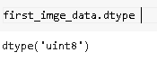

# Scikit 学习图像处理

> 原文：<https://pythonguides.com/scikit-learn-image-processing/>

[](https://sharepointsky.teachable.com/p/python-and-machine-learning-training-course)

在本 [Python 教程](https://pythonguides.com/learn-python/)中，我们将学习 **Scikit 学习映像**，我们还将涵盖与 **Scikit 学习映像**相关的不同示例。我们将讨论这些话题。

*   Scikit 学习图像相似性
*   Scikit 学习图像聚类
*   Scikit 学习图像增强
*   Scikit 学习图像数据集
*   Scikit 学习图像预处理
*   Scikit 学习图像特征提取
*   sci kit-学习图像分类
*   Scikit 学习图像分割
*   Scikit 学习图像识别
*   Scikit 学习映像安装
*   Scikit 学习图像读取图像

目录

[](#)

*   [Scikit 学习图像相似度](#Scikit_learn_image_similarity "Scikit learn image similarity")
*   [Scikit 学习图像聚类](#Scikit_learn_image_clustering "Scikit learn image clustering")
*   [Scikit 学习图像增强](#Scikit_learn_image_augmentation "Scikit learn image augmentation")
*   [Scikit 学习图像数据集](#Scikit_learn_image_dataset "Scikit learn image dataset")
*   [Scikit 学习图像预处理](#Scikit_learn_image_preprocessing "Scikit learn image preprocessing")
*   [Scikit 学习图像特征提取](#Scikit_learn_image_feature_extraction "Scikit learn image feature extraction")
*   [Scikit 学习图像分类](#Scikit_learn_image_classification "Scikit learn image classification")
*   [Scikit 学会图像分割](#Scikit_learn_image_segmentation "Scikit learn image segmentation")
*   [Scikit 学习图像识别](#Scikit_learn_image_recognition "Scikit learn image recognition")
*   [Scikit 学习镜像安装](#Scikit_learn_image_install "Scikit learn image install")
*   [Scikit 学习图像读取图像](#Scikit_learn_image_read_image "Scikit learn image read image")

## Scikit 学习图像相似度

在本节中，我们将了解**scikit 如何使用 python 学习图像相似性**。

**Scikit 学习图像相似度**定义为估计两幅相同图像相似度的过程。

**代码:**

在下面的代码中，我们将**从 skimage.metrics** 导入 structural_similarity 作为 ssim，通过它我们可以估计图像的相似性。

*   `image = img _ as _ float(data . camera())`用于举例运行图像。
*   `range = num . random . default _ RNG()`用于生成随机默认范围。
*   `image_noise = image + noise` 用于给图像添加噪声。
*   **fig，axes = plot.subplots(nrows=1，ncols=3，figsize=(10，4)，sharex=True，sharey=True)** 用于在屏幕上绘制图像。
*   **MSE _ none = mean _ squared _ error(image，image)** 用于表示图像中的相似性。
*   **轴[0]。imshow(image，cmap=plot.cm.gray，vmin=0，vmax=1)** 用于在屏幕上显示轴。
*   **轴[0]。set _ xlabel(f ' MSE:{ MSE _ none:. 2f }，SSIM: {ssim_none:.2f}')** 用于给轴加 x 标签。
*   **轴[0]。set_title('原始图像')**用来给图像加标题。

```py
import numpy as num
import matplotlib.pyplot as plot

from skimage import data, img_as_float
from skimage.metrics import structural_similarity as ssim
from skimage.metrics import mean_squared_error

image = img_as_float(data.camera())
rows, cols = image.shape

noise = num.ones_like(image) * 0.3 * (image.max() - image.min())
range = num.random.default_rng()
noise[range.random(size=noise.shape) > 0.6] *= -1

image_noise = image + noise
image_const = image + abs(noise)

fig, axes = plot.subplots(nrows=1, ncols=3, figsize=(10, 4),
                         sharex=True, sharey=True)
axis = axes.ravel()

mse_none = mean_squared_error(image, image)
ssim_none = ssim(image, image, data_range=image.max() - image.min())

mse_noise = mean_squared_error(image, image_noise)
ssim_noise = ssim(image, image_noise,
                  data_range=image_noise.max() - image_noise.min())

mse_const = mean_squared_error(image, image_const)
ssim_const = ssim(image, image_const,
                  data_range=image_const.max() - image_const.min())

axis[0].imshow(image, cmap=plot.cm.gray, vmin=0, vmax=1)
axis[0].set_xlabel(f'MSE: {mse_none:.2f}, SSIM: {ssim_none:.2f}')
axis[0].set_title('Original image')

axis[1].imshow(image_noise, cmap=plot.cm.gray, vmin=0, vmax=1)
axis[1].set_xlabel(f'MSE: {mse_noise:.2f}, SSIM: {ssim_noise:.2f}')
axis[1].set_title('Image with noise')

axis[2].imshow(img_const, cmap=plot.cm.gray, vmin=0, vmax=1)
axis[2].set_xlabel(f'MSE: {mse_const:.2f}, SSIM: {ssim_const:.2f}')
axis[2].set_title('Image plus constant')

plot.tight_layout()
plot.show()
```

**输出:**

运行上述代码后，我们得到以下输出。在输出中，我们可以看到屏幕上显示了 scikit 学习图像相似性。


scikit learn image similarity

阅读: [Scikit 学习隐马尔可夫模型](https://pythonguides.com/scikit-learn-hidden-markov-model/)

## Scikit 学习图像聚类

在本节中，我们将了解 python 中的`scikit learn image clustering works`。

*   聚类被定义为将未标记的数据集分组或将数据分组到具有相似数据点的不同簇中。
*   这里我们使用谱聚类，它用于切割图形并最小化梯度的比率。

**代码:**

在下面的代码中，我们将**从 sklearn.cluster** 导入 spectral_clustering，通过它我们可以切割图形并最小化梯度的比率。

*   **x，y = NP . indexes((l，l))** 用于返回代表网格索引的数组。
*   `imge = circle 1+circle 2+circle 3+circle 4`用于创建四个圆。
*   `mask = imge.astype(bool)` 用于限制前景。
*   **graph = image . img _ to _ graph(imge，mask=mask)** 用于将图像转换为边缘带有渐变值的图形。
*   **label _ im = num . full(mask . shape，-1.0)** 用于给出图形的完整形状。
*   plot.matshow(imge)用于绘制图像。
*   **labels = spectral _ clustering(graph，n_clusters=2，eigen_solver="arpack")** 用于最小化梯度的比率。

```py
import numpy as num
import matplotlib.pyplot as plot

from sklearn.feature_extraction import image
from sklearn.cluster import spectral_clustering

l = 100
x, y = np.indices((l, l))

center1 = (29, 25)
center2 = (41, 51)
center3 = (68, 59)
center4 = (25, 71)

radius1, radius2, radius3, radius4 = 17, 15, 16, 15

circle1 = (x - center1[0]) ** 2 + (y - center1[1]) ** 2 < radius1 ** 2
circle2 = (x - center2[0]) ** 2 + (y - center2[1]) ** 2 < radius2 ** 2
circle3 = (x - center3[0]) ** 2 + (y - center3[1]) ** 2 < radius3 ** 2
circle4 = (x - center4[0]) ** 2 + (y - center4[1]) ** 2 < radius4 ** 2

imge = circle1 + circle2 + circle3 + circle4

mask = imge.astype(bool)

imge = imge.astype(float)
imge += 1 + 0.2 * num.random.randn(*imge.shape)

graph = image.img_to_graph(imge, mask=mask)

graph.data = num.exp(-graph.data / graph.data.std())

labels = spectral_clustering(graph, n_clusters=4, eigen_solver="arpack")
label_im = num.full(mask.shape, -1.0)
label_im[mask] = labels

plot.matshow(imge)
plot.matshow(label_im)

imge = circle1 + circle2
mask = imge.astype(bool)
imge = imge.astype(float)

imge += 1 + 0.2 * num.random.randn(*imge.shape)

graph = image.img_to_graph(imge, mask=mask)
graph.data = num.exp(-graph.data / graph.data.std())

labels = spectral_clustering(graph, n_clusters=2, eigen_solver="arpack")
label_im = num.full(mask.shape, -1.0)
label_im[mask] = labels

plot.matshow(imge)
plot.matshow(label_im)

plot.show()
```

**输出:**

运行上述代码后，我们得到以下输出，从中我们可以看到屏幕上执行了 scikit learn 图像聚类。


scikit learn image clustering

另外，检查: [Scikit 学习层次聚类](https://pythonguides.com/scikit-learn-hierarchical-clustering/)

## Scikit 学习图像增强

在本节中，我们将了解**sci kit 如何在 python 中学习图像增强功能**。

**图像增强**被定义为一种用于增加我们图像大小的技术，也是通过图像的变换来完成的。

**代码:**

在下面的代码中，我们将导入一些库，从中我们可以对图像进行放大。

*   **figure = plot . figure(tight _ layout = ' auto '，figsize=(10，7))** 用于在屏幕上绘制图形。
*   **imge = im read(' buter fly . jpg ')/255**用于加载图像。
*   `plot.imshow(img)` 用于绘制原始图像。

```py
from skimage import transform
from skimage.transform import rotate, AffineTransform,warp
from skimage.util import random_noise
from skimage.filters import gaussian
from scipy import ndimage
import random
from skimage import img_as_ubyte
import os
**#basic Function to display image side by side**
def plotsides(imge1, imge2, title1, title2, cmap = None):
    figure = plot.figure(tight_layout='auto', figsize=(10, 7))
    figure.add_subplot(221)
    plot.title(title1)
    plot.imshow(imge)
    figure.add_subplot(222)
    plot.title(title2)
    plot.imshow(imge2, cmap = None)
    return fig

imge = imread('buterfly.jpg') / 255

plot.imshow(img)
plot.title('Original')
plot.show()
```


scikit learn augmentation original image

*   **rotate30 = rotate(imge，angle=30)** 用于将图像旋转 30°的角度。
*   **rotate45 = rotate(imge，angle=45)** 用于将图像旋转 45 度。
*   **rotate60 = rotate(imge，angle=60)** 用于将图像旋转 60 度。
*   **rotate90 = rotate(imge，angle=90)** 用于将图像旋转 90 度。
*   **figure = plot . figure(tight _ layout = ' auto '，figsize=(10，10))** 用于绘制屏幕上的所有图形。
*   **plot.title('旋转 30')** 用于给屏幕加标题。

```py
rotate30 = rotate(imge, angle=30)
rotate45 = rotate(imge, angle=45)
rotate60 = rotate(imge, angle=60)
rotate90 = rotate(imge, angle=90)
figure = plot.figure(tight_layout='auto', figsize=(10, 10))
figure.add_subplot(221)
plot.title('Rotate 30')
plot.imshow(rotate30)
figure.add_subplot(222)
plot.title('Rotate 45')
plot.imshow(rotate45)
figure.add_subplot(223)
plot.title('Rotate 60')
plot.imshow(rotate60)
figure.add_subplot(224)
plot.title('Rotate 90')
plot.imshow(rotate90)
plot.show()
```


`scikit learn augmentation rotation images`

*   这里， **sheared = transform.warp(img，tf，order=1，preserve_range=True，mode='wrap')** 用于将图像原物变换为 sheared。

```py
tf = AffineTransform(shear=-0.5)
sheared = transform.warp(img, tf, order=1, preserve_range=True, mode='wrap')
sheared_figure = plot_side(img, sheared, 'Original', 'Sheared')
```


scikit learn augmentation sheared image

*   这里， **warp_images = warp(imge，transform，mode="wrap")** 就是对图像进行包裹。
*   这里， **warp_figure = plot_side(imge，warp_images，' Original '，' Wrap images')** 用于在屏幕上绘制图形。

```py
 transform = AffineTransform(translation=(-200,0)) 

warp_images = warp(imge,transform, mode="wrap") 

warp_figure = plot_side(imge,warp_images , 'Original', 'Wrap images')
```


scikit learn image augmentation transformation

现在， **noise_figure = plot_side(imge，Noise _ images，' Original '，' Noise_image')** 用于创建和绘制噪声图像。

```py
 noisy_images = random_noise(imge, var=0.1**.01)
noise_figure = plot_side(imge,noisy_images , 'Original', 'Noise_image')
```


scikit learn augmentation noisy image

*   **blured _ images = ndimage . uniform _ filter(imge，size=(11，11，1))** 用于制作模糊图像。
*   **noise_figure = plot_side(imge，blured_images，'原始'，'模糊')**用于在屏幕上绘制图像。

```py
 from scipy import ndimage
blured_images = ndimage.uniform_filter(imge, size=(11, 11, 1))
noise_figure = plot_side(imge,blured_images , 'Original', 'Blurred')
```


scikit learn image augmentation blurring

*   `high brightness = imge+(100/255)`用于增加图像的亮度。
*   **figure _ highBrightness = plot _ side(imge，high brightness，' Original '，' brighted ')**用于在屏幕上绘制图像。

```py
 highBrightness = imge + (100/255)
figure_highBrightness = plot_side(imge, highBrightness, 'Original', 'Brightened')
plot.show()
```


scikit learn image augmentation increasing brightness

*   `up_down = np.flipud(imge)` 用于上下翻转图像。
*   **figure _ Up Down = plot _ side(imge，up_down，' Original '，' Up-Down')** 用于在屏幕上绘制图形。

```py
# flip up-down using np.flipud
up_down = np.flipud(imge)
figure_updown = plot_side(imge, up_down, 'Original', 'Up-Down')
plot.show()
```


scikit learn image augmentation flipping up down

阅读: [Scikit 学习分类教程](https://pythonguides.com/scikit-learn-classification/)

## Scikit 学习图像数据集

在本节中，我们将了解**Scikit 如何在 python 中学习图像数据集的工作方式**。

图像数据集被定义为将图像的数据存储在数据容器中，并通过多种算法返回结果。

**代码:**

在下面的代码中，我们**将从 sklearn.datasets** 导入 load_sample_images，通过它我们可以在数据的帮助下加载图像。

*   `len(datasets.images)` 用于获取图像的长度。
*   `first_imge_data.shape` 用于获取图像的形状。

```py
from sklearn.datasets import load_sample_images
datasets = load_sample_images()     
len(datasets.images)
first_imge_data = dataset.images[0] 
first_imge_data.shape 
```


scikit learn image dataset

`first_imge_data.dtype` 用于获取数据的类型。

```py
first_imge_data.dtype 
```



scikit learn image dataset type

阅读: [Scikit 学习超参数调整](https://pythonguides.com/scikit-learn-hyperparameter-tuning/)

## Scikit 学习图像预处理

在本节中，我们将了解 **scikit 如何在 python 中学习图像预处理**。

**图像预处理**定义为图像在用于模型训练之前进行合成的步骤。

代码:

在下面的代码中，我们**将从 sklearn** 导入 io 对图像进行预处理。

*   首先，**files = OS . path . join(' ladybug . jpg ')**用于加载图片。
*   第二， **io.imshow(瓢虫)**用于显示输入图像。

```py
import os

import skimage
from skimage import io

files = os.path.join( 'ladybug.jpg')

ladybug = io.imread(files)

io.imshow(ladybug)
io.show()
```

**输出:**

运行上述代码后，我们得到以下输出。在输出中，我们可以看到 **Scikit 学习图像预处理**是在屏幕上完成的。


scikit learn image preprocessing

阅读: [Scikit 学习 hidden _ layer _ size](https://pythonguides.com/scikit-learn-hidden_layer_sizes/)

## Scikit 学习图像特征提取

在本节中，我们将学习**scikit 如何学习 python 中的图像特征提取**。

*   顾名思义，图像特征提取从图像中提取特征。特征提取与降维有关。
*   特征提取也被定义为减少能够轻松描述大量数据的资源数量。

**代码:**

在下面的代码中，我们将使用来自 `skimage.io` 的 `imread.imshow` 来运行图像。

在代码中，**image1 = im read(' grasshopper . jpg ')**用于加载图像。

```py
import pandas as pd
import numpy as np
import matplotlib.pyplot as plt
%matplotlib inline
from skimage.io import imread, imshow
image1 = imread('grasshopper.jpg')
imshow(image1);
```


scikit learn feature extraction original image

另外，**image2 = imread(' grasshopper . jpg '，as_gray=True)** 用于加载灰色阴影图像。

```py
image2 = imread('grasshopper.jpg', as_gray=True)
imshow(image2);
```


scikit learn feature extraction greyscale image

*   `print(image1.shape)` 用于打印 image1 的形状。
*   **打印(image2.shape)** 用于打印 image2 的形状。

```py
print(image1.shape)
print(image2.shape)
```


scikit learn image feature extraction shape

*   `print(image1.size)` 用于打印 image1 的大小。
*   `print(image2.size)` 用于打印 image2 的大小。

```py
print(image1.size)
print(image2.size)
```


scikit learn image feature extraction size

这里， **feature2 = np.reshape(image2，(280 * 390 ))** 用于查找对 image2 的形状进行整形并返回数组的特征。

```py
feature2 = np.reshape(image2, (280 * 390 ))
feature2
```


scikit learn image feature extraction grayscale

而**feature 1 = NP . shape(image1，(280 * 390 * 3))** 用于寻找对 image1 形状进行整形的特征并返回数组。

```py
feature1 = np.reshape(image1, (280 * 390 * 3))
feature1
```


scikit learn image feature extraction original

阅读: [Scikit 学习线性回归+例题](https://pythonguides.com/scikit-learn-linear-regression/)

## Scikit 学习图像分类

在本节中，我们将了解**scikit 如何在 python 中学习图像分类的工作方式**。

图像分类被定义为将图像分类到其不同类别的过程。

**代码:**

在下面的代码中，我们将导入一些可以对图像进行分类的库。

*   **clfdata['description'] = '已调整大小({0}x{1})的 rgb 动物图像'。格式(int(width)，int(height))** 用于给出数据的描述。
*   **current _ path = OS . path . join(src，subdir)** 用于从路径中读取图像，并根据目标路径调整图像大小。
*   **clf data _ path = '/content/drive/my drive/Image '**使用的是我的驱动器的路径。

```py
import matplotlib.pyplot as plot
import numpy as num
import os
import pprint
pp = pprint.PrettyPrinter(indent=4)
import joblib
from skimage.io import imread
from skimage.transform import resize

def resize_all(src, pklname, include, width=150, height=None):

    height = height if height is not None else width

    clfdata = dict()
    clfdata['description'] = 'resized ({0}x{1})animal images in rgb'.format(int(width), int(height))
    clfdata['label'] = []
    clfdata['filename'] = []
    clfdata['data'] = []   

    pklname = f"{pklname}_{width}x{height}px.pkl"

    for subdir in os.listdir(src):
        if subdir in include:
            print(subdir)
            current_path = os.path.join(src, subdir)

            for file in os.listdir(current_path):
                if file[-3:] in {'jpg', 'png'}:
                    im = imread(os.path.join(current_path, file))
                    im = resize(im, (width, height)) 
                    clfdata['label'].append(subdir[:-4])
                    clfdata['filename'].append(file)
                    clfdata['data'].append(im)

        joblib.dump(clfdata, pklname)
clfdata_path = '/content/drive/MyDrive/Image'
os.listdir(clfdata_path)
```

**输出:**

运行上面的代码后，我们得到下面的输出，我们可以看到动物数据集被打印在屏幕上。


scikit learn image classification dataset

*   **basename = 'animal_faces'** 用作数据集的名称。
*   **resize_all(src=clfdata_path，pklname=basename，width=width，include=include)** 用于调整数据集的大小。

```py
basename = 'animal_faces'
width = 80

include = {'ChickenHead', 'BearHead', 'ElephantHead', 
           'EagleHead', 'DeerHead', 'MonkeyHead', 'PandaHead'}

resize_all(src=clfdata_path, pklname=basename, width=width, include=include)
```


scikit learn image classification resizes dataset

*   **clf data = joblib . load(f“{ basename } _ { width } x { width } px . pkl ')**用于加载数据集。
*   **print('number of samples:'，len(clf data[' data '])**用于打印样本数。
*   print('keys:'，list(clfdata.keys()))用于打印键的数量。
*   **打印('图像形状: '，clfdata['数据'][0]。【形状)】T1 用于打印图像的形状。**
*   **print('labels:'，num . unique(clf data[' label '])**用于打印标签。
*   **计数器(clfdata['label'])** 用于打印计数器。

```py
from collections import Counter

clfdata = joblib.load(f'{basename}_{width}x{width}px.pkl')

print('number of samples: ', len(clfdata['data']))
print('keys: ', list(clfdata.keys()))
print('description: ', clfdata['description'])
print('image shape: ', clfdata['data'][0].shape)
print('labels:', num.unique(clfdata['label']))

Counter(clfdata['label'])
```


scikit learn image classification counter data

*   `labels = num . unique(clf data`[' label '**])**用于获取标签列表中所有唯一的值。
*   **figure，axes = plot.subplots(1，len(labels))** 用于根据标签数量设置 matplotlib 图形和轴。
*   **idx = clfdata['label']。index(label)** 用于获取与其搜索字符串相对应的第一个项目的索引。

```py
 labels = num.unique(clfdata['label'])

figure, axes = plot.subplots(1, len(labels))
figure.set_size_inches(17,6)
figure.tight_layout()

for axis, label in zip(axes, labels):
    idx = clfdata['label'].index(label)

    axis.imshow(clfdata['data'][idx])
    axis.axis('off')
    axis.set_title(label)
```


scikit learn image classification

*   **x_train，x_test，y_train，y_test=train_test_split(x，y，test_size=0.4，shuffle=True，random_state=44，)**用于将数据集拆分为训练数据和测试数据。
*   **unique，counts = num.unique(y，return_counts=True)** 用于计算每种类型的球场。
*   **counts = 100 * counts[sorted _ index]/len(y)**用于表示百分比。
*   **counts = counts[sorted _ index]**用于绘图作为计数。
*   **plot.xticks(xtemp，unique，rotation=45)** 用于绘制 x 刻度。
*   **plot.suptitle('每种类型的相对照片数量')**用于在屏幕上绘制字幕。
*   **plot_bar(y_train，loc='left')** 用于在屏幕上绘制 y_train 条。
*   **plot_bar(y_test，loc='right')** 用于在屏幕上绘制 y_test 条。

```py
x = num.array(clfdata['data'])
y = num.array(clfdata['label'])
from sklearn.model_selection import train_test_split

x_train, x_test, y_train, y_test = train_test_split(
    x, 
    y, 
    test_size=0.4, 
    shuffle=True,
    random_state=44,
)
def plot_bar(y, loc='left', relative=True):
    width = 0.37
    if loc == 'left':
        n = -0.7
    elif loc == 'right':
        n = 0.7

    unique, counts = num.unique(y, return_counts=True)
    sorted_index = num.argsort(unique)
    unique = unique[sorted_index]

    if relative:

        counts = 100*counts[sorted_index]/len(y)
        ylabel_text = '% count'
    else:

        counts = counts[sorted_index]
        ylabel_text = 'count'

    xtemp = num.arange(len(unique))

    plot.bar(xtemp + n*width, counts, align='center', alpha=.7, width=width)
    plot.xticks(xtemp, unique, rotation=45)
    plot.xlabel('equipment type')
    plot.ylabel(ylabel_text)

plot.suptitle('relative amount of photos per type')
plot_bar(y_train, loc='left')
plot_bar(y_test, loc='right')
plot.legend([
    'train ({0} photos)'.format(len(y_train)), 
    'test ({0} photos)'.format(len(y_test))
]);
```


scikit learn image classification graph

阅读: [Scikit 学习功能选择](https://pythonguides.com/scikit-learn-feature-selection/)

## Scikit 学会图像分割

在本节中，我们将了解**scikit 如何在 python 中学习图像分割的工作方式**。

Scikit learn 图像分割被定义为平衡圆体积的算法。如果所有的圆大小相同，分割效果很好，如果大小不同，分割会失败。

**代码:**

*   **x，y = NP . indexes((l，l))** 用于返回代表网格索引的数组。
*   `imge = circle 1+circle 2+circle 3+circle 4`用于创建四个圆。
*   `mask = imge.astype(bool)` 用于限制前景。
*   **graph = image . img _ to _ graph(imge，mask=mask)** 用于将图像转换为边缘带有渐变值的图形。
*   **label _ im = num . full(mask . shape，-1.0)** 用于给出图形的完整形状。
*   plot.matshow(imge)用于绘制图像。
*   **labels = spectral _ clustering(graph，n_clusters=2，eigen_solver="arpack")** 用于最小化梯度的比率。

```py
import numpy as num
import matplotlib.pyplot as plot

from sklearn.feature_extraction import image
from sklearn.cluster import spectral_clustering

l = 100
x, y = num.indices((l, l))

center1 = (27, 23)
center2 = (39, 49)
center3 = (66, 57)
center4 = (23, 69)

radius1, radius2, radius3, radius4 = 15, 13, 14, 13

circle1 = (x - center1[0]) ** 2 + (y - center1[1]) ** 2 < radius1 ** 2
circle2 = (x - center2[0]) ** 2 + (y - center2[1]) ** 2 < radius2 ** 2
circle3 = (x - center3[0]) ** 2 + (y - center3[1]) ** 2 < radius3 ** 2
circle4 = (x - center4[0]) ** 2 + (y - center4[1]) ** 2 < radius4 ** 2

imge = circle1 + circle2 + circle3 + circle4

mask = imge.astype(bool)

imge = imge.astype(float)
imge += 2 + 0.3 * num.random.randn(*imge.shape)

graph = image.img_to_graph(imge, mask=mask)

graph.data = num.exp(-graph.data / graph.data.std())

labels = spectral_clustering(graph, n_clusters=4, eigen_solver="arpack")
label_im = num.full(mask.shape, -4.0)
label_im[mask] = labels

plot.matshow(imge)
plot.matshow(label_im)

imge = circle1 + circle2+circle3
mask = imge.astype(bool)
imge = imge.astype(float)

imge += 2 + 0.3 * num.random.randn(*imge.shape)

graph = image.img_to_graph(imge, mask=mask)
graph.data = num.exp(-graph.data / graph.data.std())

labels = spectral_clustering(graph, n_clusters=2, eigen_solver="arpack")
label_im = num.full(mask.shape, -2.0)
label_im[mask] = labels

plot.matshow(imge)
plot.matshow(label_im)

plot.show()
```

**输出:**

运行上面的代码后，我们得到下面的输出，我们可以看到圆的大小和形状是相同的，分割不会失败。


scikit learn image segmentation

阅读: [Scikit 学习岭回归](https://pythonguides.com/scikit-learn-ridge-regression/)

## Scikit 学习图像识别

在本节中，我们将了解 **Scikit 如何在 python 中学习图像识别**的工作原理。

Scikit 学习图像识别是一个识别图像的过程，也用于识别物体。

**代码:**

在下面的代码中，我们将导入一些我们可以从中识别图像的库。

*   **dog = rescale(dog，1/3，mode='reflect')** 用于将图像缩小到三分之一。
*   **dog_hog，dog_hog_img = hog(dog，pixels_per_cell=(14，14)，cells_per_block=(2，2)，orientations=9，visualize=True，block_norm='L2-Hys')** 用于计算 hog 并返回可视化表示。
*   **a.tick_params(bottom=False，left=False，labelbottom=False，labelleft=False)** 用于移除它们的刻度和标签。
*   **轴[0]。set_title('dog')** 用来给图像加标题。

```py
from skimage.feature import hog
from skimage.io import imread
from skimage.transform import rescale
import matplotlib.pyplot as plot

dog = imread('dog.jpg', as_gray=True)

dog = rescale(dog, 1/3, mode='reflect')

dog_hog, dog_hog_img = hog(
    dog, pixels_per_cell=(14,14), 
    cells_per_block=(2, 2), 
    orientations=9, 
    visualize=True, 
    block_norm='L2-Hys')

figure, axis = plot.subplots(1,2)
figure.set_size_inches(8,6)

[a.tick_params(bottom=False, left=False, labelbottom=False, labelleft=False) 
    for a in axis]

axis[0].imshow(dog, cmap='gray')
axis[0].set_title('dog')
axis[1].imshow(dog_hog_img, cmap='gray')
axis[1].set_title('hog')
plot.show()
```

**输出:**

运行上面的代码后，我们得到下面的输出，其中我们可以识别一只狗的图像。


scikit learn image recognition

从这段代码中，我们可以看到在我们的模型中处理的一些数据点减少了。经过一些想象，我们可以认出这条狗。

```py
print('number of pixels: ', dog.shape[0] * dog.shape[1])
print('number of hog features: ', dog_hog.shape[0])
```


scikit learn image recognition percentage

阅读: [Scikit 学习决策树](https://pythonguides.com/scikit-learn-decision-tree/)

## Scikit 学习镜像安装

在这一节中，我们将了解到**scikit 如何学习映像以在 python 中安装**。

如果我们想安装 scikit 学习镜像，那么首先检查 sci kit-镜像是否已经安装，或者它是否工作，并检查安装版本。

我们可以通过以下命令检查 scikit-image 版本或其工作情况:

```py
import skimage
print(skimage.__version__)
```


scikit learn install image check version

如果我们想要更新版本或再次安装，请使用以下命令:

```py
 pip  install -U scikit-image
```

我们已经安装了 scikit-image 的更新版本，如图所示。


scikit learn install image update version

Read: [Scikit-learn Vs Tensorflow](https://pythonguides.com/scikit-learn-vs-tensorflow/)

## Scikit 学习图像读取图像

在本节中，我们将了解**scikit 如何在 python 中学习图像读取图像工作**。

Scikit 学习图像读取图像功能用于读取或处理图像。我们还可以在 scikit-image 模块的帮助下读取图像。

**代码:**

在下面的代码中，我们将导入一些库，从中我们可以读取图像并处理图像。

代码中，**image _ gray = imread(' player . jpg '，as_gray=True)** 用于读取灰度图像并加载到屏幕上。

```py
from skimage.io import imread, imshow
import matplotlib.pyplot as plt
%matplotlib inline

image_gray = imread('player.jpg', as_gray=True)
imshow(image_gray)
```


scikit learn image read image

*   `print(image_gray.shape)` 用于打印灰度图像的形状。

```py
image_gray = imread('player.jpg', as_gray=True)
print(image_gray.shape)
print(image_gray)
```


scikit learn image read image gray shape

*   **image _ color = im read(' player . jpg '，as_gray=False)** 用于加载和读取屏幕上的彩色图像。
*   `print(image_color.shape)` 用于在屏幕上打印彩色图像形状。

```py
from skimage.io import imread, imshow
import matplotlib.pyplot as plt
%matplotlib inline

image_color = imread('player.jpg', as_gray=False)
print(image_color.shape)
imshow(image_color)
```


scikit learn image read image color shape

另外，看看更多的 Scikit 学习教程。

*   [Scikit 学习非线性【完全指南】](https://pythonguides.com/scikit-learn-non-linear/)
*   [Scikit 学习交叉验证【有用指南】](https://pythonguides.com/scikit-learn-cross-validation/)
*   [Scikit 了解高斯——你需要知道的一切](https://pythonguides.com/scikit-learn-gaussian/)

因此，在本教程中，我们讨论了 **Scikit 学习映像**,我们还涵盖了与其实现相关的不同示例。这是我们已经讨论过的例子列表。

*   Scikit 学习图像相似性
*   Scikit 学习图像聚类
*   Scikit 学习图像增强
*   Scikit 学习图像数据集
*   Scikit 学习图像预处理
*   Scikit 学习图像特征提取
*   sci kit-学习图像分类
*   Scikit 学习图像分割
*   Scikit 学习图像识别
*   Scikit 学习映像安装
*   Scikit 学习图像读取图像

[Bijay Kumar](https://pythonguides.com/author/fewlines4biju/)

Python 是美国最流行的语言之一。我从事 Python 工作已经有很长时间了，我在与 Tkinter、Pandas、NumPy、Turtle、Django、Matplotlib、Tensorflow、Scipy、Scikit-Learn 等各种库合作方面拥有专业知识。我有与美国、加拿大、英国、澳大利亚、新西兰等国家的各种客户合作的经验。查看我的个人资料。

[enjoysharepoint.com/](https://enjoysharepoint.com/)[](https://www.facebook.com/fewlines4biju "Facebook")[](https://www.linkedin.com/in/fewlines4biju/ "Linkedin")[](https://twitter.com/fewlines4biju "Twitter")