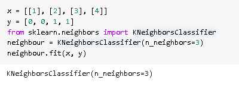
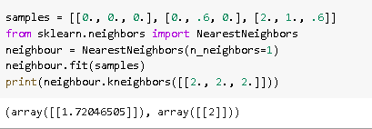
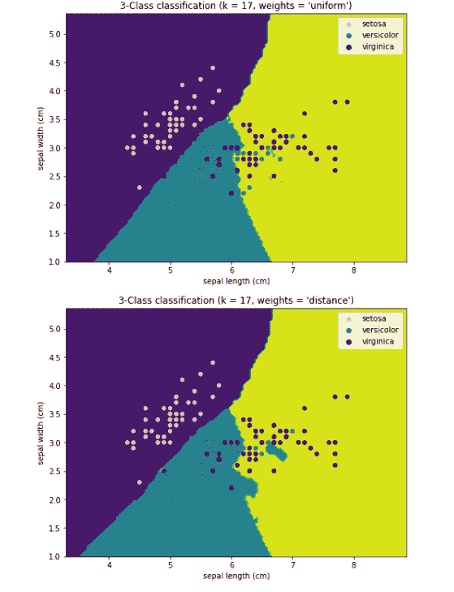
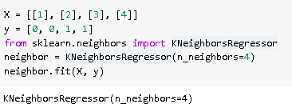
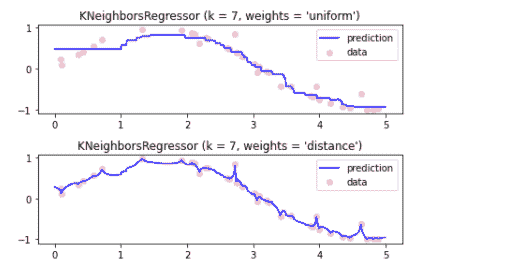
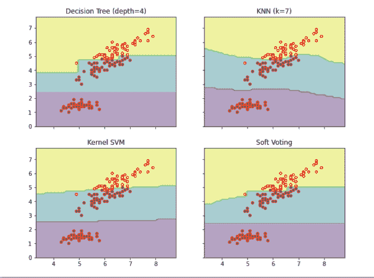
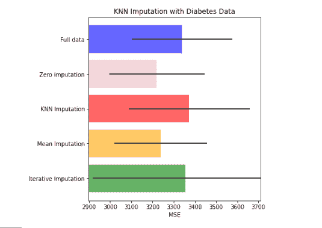
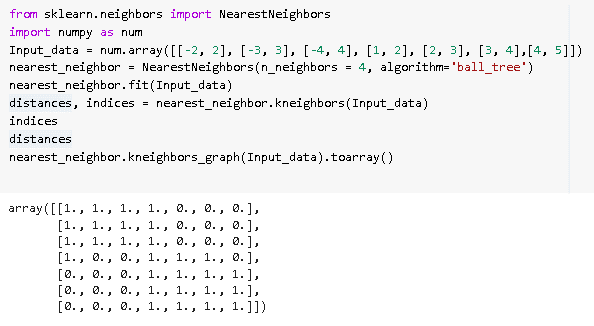

# Scikit 学习 KNN 教程

> 原文：<https://pythonguides.com/scikit-learn-knn-tutorial/>

[](https://sharepointsky.teachable.com/p/python-and-machine-learning-training-course)

在这个 [Python 教程](https://pythonguides.com/learn-python/)中，我们将学习 **Scikit 学习 KNN 如何使用 `Python` 工作**，我们还将涵盖与 **Scikit 学习 KNN** 相关的不同示例。我们将讨论这些话题。

*   Scikit 学习 KNN
*   Scikit 学习 KNN 分类
*   Scikit 了解 KNN 的优点和缺点
*   Scikit 学习 KNN 回归
*   Scikit 学习 KNN 回归示例
*   Scikit 学习 KNN 示例
*   Scikit 学习 KNN 插补
*   Scikit 学习 KNN 距离

目录

[](#)

*   [Scikit 学习 KNN](#Scikit_learn_KNN "Scikit learn KNN")
*   [Scikit 学会 KNN 分类](#Scikit_learn_KNN_classification "Scikit learn KNN classification")
*   [Scikit 了解 KNN 的优缺点](#Scikit_learn_KNN_advantages_and_disadvantages "Scikit learn KNN advantages and disadvantages")
*   [Scikit 学习 KNN 回归](#Scikit_learn_KNN_Regression "Scikit learn KNN Regression")
*   [Scikit 学习 KNN 回归的例子](#Scikit_learn_KNN_Regression_Example "Scikit learn KNN Regression Example")
*   [Scikit 学习 KNN 的例子](#Scikit_learn_KNN_Example "Scikit learn KNN Example")
*   [Scikit 学会 KNN 插补](#Scikit_learn_KNN_Imputation "Scikit learn KNN Imputation")
*   [Scikit 学习 KNN 距离](#Scikit_learn_KNN_Distance "Scikit learn KNN Distance")

## Scikit 学习 KNN

在这一节中，我们将了解**如何 [Scikit 学习](https://pythonguides.com/what-is-scikit-learn-in-python/) KNN 在 Python 中的工作**。

*   KNN 代表 K 近邻，它是机器学习的最简单和最容易的算法。
*   KNN 是监督学习技术，用于分类和回归，但主要用于分类。
*   KNN 算法在假设把新数据放在与新数据相似的类别中之后，假设可用数据和新数据之间的相似性。
*   KNN 是一个懒惰学习算法的例子，因为它不从训练集学习，而是存储数据集，并在分类时执行其操作。

**代码:**

在下面的代码中，我们将**从 sklearn.neighbors** 导入 KNeighborsclssifier，它假设在假设将新数据放入与新类别相似且最接近的=at 类别后，可用数据和新数据之间存在相似性。

*   `neighborsclassifier(n _ neighbors = 3)`显示有 3 个最近邻居。
*   **neighbor . fit(x，y)** 用于拟合最近的邻居。

```py
x = [[1], [2], [3], [4]]
y = [0, 0, 1, 1]
from sklearn.neighbors import KNeighborsClassifier
neighbour = KNeighborsClassifier(n_neighbors=3)
neighbour.fit(x, y)
```



scikit learn KNN

在下面的代码中，我们在一个表示数据集的数组的帮助下创建了最近邻类，并提出了一个问题，即哪个点离[2，2，2]最近。

```py
samples = [[0., 0., 0.], [0., .6, 0.], [2., 1., .6]]
from sklearn.neighbors import NearestNeighbors
neighbour = NearestNeighbors(n_neighbors=1)
neighbour.fit(samples)
print(neighbour.kneighbors([[2., 2., 2.]]))
```

运行上面的代码后，我们得到下面的输出，我们可以看到它返回[1.72046]和[2]，这意味着元素在距离 1.72046 处。



scikit learn KNN Nearest neighbor

Read: [Scikit-learn Vs Tensorflow](https://pythonguides.com/scikit-learn-vs-tensorflow/)

## Scikit 学会 KNN 分类

在这一节中，我们将了解 **Scikit 如何在 python 中学习 KNN 分类**。

*   Scikit 学习 KNN 是一种非参数分类方法。它用于分类和回归，但主要用于分类。
*   在 KNN 分类中，输出取决于类成员，并且对象通过其邻居的各种投票被分类，并且对象被分配到最接近 k 个最近邻居的那个类。

**代码:**

在下面的代码中，我们将从 sklearn 导入 neighbors 数据集，通过它我们可以将对象分配到与 k 个最近邻居最接近的那个类。

*   X = iris.data[:，:2]用于取前两个特征。
*   h = 0.04 用于取步长大小。
*   colormap _ light = listed colormap([" yellow "，" orange "，" lightblue"])用于创建色彩映射表。
*   分类器=邻居。KNeighborsClassifier(n _ neighbors，weights=weights)用于创建邻居的实例。
*   classifier.fit(X，y)用于拟合数据。
*   xx，YY = num . mesh grid(num . arange(x _ min，x_max，h)，num.arange(y_min，y_max，h))用于绘制决策边界。
*   plot.contourf(xx，yy，Z，colormap=colormap_light)用于将结果放入颜色图中。

```py
import numpy as num
import matplotlib.pyplot as plot
import seaborn as sb
from matplotlib.colors import ListedColormap
from sklearn import neighbors, datasets

n_neighbors = 17

iris = datasets.load_iris()

X = iris.data[:, :2]
y = iris.target

h = 0.04  

colormap_light = ListedColormap(["yellow", "orange", "lightblue"])
colormap_bold = ["pink", "c", "darkblue"]

for weights in ["uniform", "distance"]:

    classifier = neighbors.KNeighborsClassifier(n_neighbors, weights=weights)
    classifier.fit(X, y)

    x_min, x_max = X[:, 0].min() - 1, X[:, 0].max() + 1
    y_min, y_max = X[:, 1].min() - 1, X[:, 1].max() + 1
    xx, yy = num.meshgrid(num.arange(x_min, x_max, h), num.arange(y_min, y_max, h))
    Z = classifier.predict(num.c_[xx.ravel(), yy.ravel()])

    Z = Z.reshape(xx.shape)
    plot.figure(figsize=(8, 6))
    plot.contourf(xx, yy, Z, colormap=colormap_light)

   ** # Plot the training points**
    sb.scatterplot(
        x=X[:, 0],
        y=X[:, 1],
        hue=iris.target_names[y],
        palette=colormap_bold,
        alpha=1.0,
        edgecolor="brown",
    )
    plot.xlim(xx.min(), xx.max())
    plot.ylim(yy.min(), yy.max())
    plot.title(
        "3-Class classification (k = %i, weights = '%s')" % (n_neighbors, weights)
    )
    plot.xlabel(iris.feature_names[0])
    plot.ylabel(iris.feature_names[1])

plot.show()
```

**输出:**

运行上述代码后，我们得到以下输出，其中我们可以看到屏幕上完成了 scikit 学习 KNN 分类。



scikit learn KNN classification

阅读: [Scikit 学习分类教程](https://pythonguides.com/scikit-learn-classification/)

## Scikit 了解 KNN 的优缺点

在这一节中，我们将了解到 **scikit 在 `python` 中学习 KNN 的优缺点**。

**优点:**

1.  Scikit 学习 KNN 算法简单，易于实现。
2.  Scikit 学会 KNN 在做出任何预测之前没有训练的要求。
3.  在 KNN sci kit learn 中，可以理想地添加新数据。
4.  Scikit learn 也称为懒惰学习者，因为它不需要任何实时预测培训。
5.  懒惰的学习者使 KNN 比其他算法快得多。
6.  KNN 算法是非常强大的噪声训练数据。

**缺点**:

1.  在 KNN 算法中，我们总是计算 K 的值，这有时可能很困难。
2.  在 KNN，大型数据集的预测成本很高，因为计算新数据和令人兴奋的数据之间的距离的成本很高。
3.  KNN 对嘈杂的数据集非常敏感。
4.  在 KNN，我们需要在将 KNN 算法应用于任何数据集之前进行要素缩放。
5.  KNN 不处理分类特征，因为很难找到分类变量的距离。

阅读: [Scikit 学习超参数调整](https://pythonguides.com/scikit-learn-hyperparameter-tuning/)

## Scikit 学习 KNN 回归

在本节中，我们将了解 scikit 如何在 Python 中学习 KNN 回归。

*   Scikit 学习 KNN 回归算法被定义为回归的值是 K 个最近邻的值的平均值。
*   在 scikit learn KNN 中，程序的输出是对象的属性值。

**代码:**

在下面的代码中，我们将从 sklearn.neighbors 导入 KNeighborsRegressor，通过它回归的值是 K-nearest neighbors 值的平均值。

*   `neighbors regressor(n _ neighbors = 4)`用于寻找一个点的 K-邻居。
*   **neighbor.fit(X，y)** 用于拟合训练集的 k 近邻回归。

```py
X = [[1], [2], [3], [4]]
y = [0, 0, 1, 1]
from sklearn.neighbors import KNeighborsRegressor
neighbor = KNeighborsRegressor(n_neighbors=4)
neighbor.fit(X, y)
```

运行上述代码后，我们得到以下输出，其中我们可以看到屏幕上打印了 scikit learn knn 回归点。



scikit learn KNN regression

阅读: [Scikit 学习线性回归](https://pythonguides.com/scikit-learn-linear-regression/)

## Scikit 学习 KNN 回归的例子

在这一节中，我们将讨论一个用 python 编写的 **scikit 学习 KNN 回归的例子**。

我们知道，**scikit 学习的 KNN 回归** 算法被定义为回归的值是 K 个最近邻居的值的平均值。

**代码:**

在下面的代码中，我们将从 sklearn 导入邻居，通过它我们可以获得回归的值。

*   **y[::5]+= 1 *(0.5–NP . rand . rand(8))**用于给目标添加噪声。
*   `n_neighbors = 7` 是拟合回归模型。
*   **knn =邻居。KNeighborsRegressor(n _ neighbors，weights=weights)** 用于寻找一个点的 k-邻居。
*   **y_ = knn.fit(x，y)。predict(T)** 用于拟合训练集的 K- neighbors 回归。
*   **plot.plot(T，y_，color="blue "，label="prediction")** 用于在屏幕上绘制图形。
*   **plot . title(" KNeighborsRegressor(k = % I，weights = '%s')" % (n_neighbors，weights))** 用于给图赋予标题。

```py
import numpy as num
import matplotlib.pyplot as plot
from sklearn import neighbors

num.random.seed(0)
x = num.sort(5 * np.random.rand(40, 1), axis=0)
t = num.linspace(0, 5, 500)[:, num.newaxis]
y = num.sin(x).ravel()

y[::5] += 1 * (0.5 - np.random.rand(8))

n_neighbors = 7

for i, weights in enumerate(["uniform", "distance"]):
    knn = neighbors.KNeighborsRegressor(n_neighbors, weights=weights)
    y_ = knn.fit(x, y).predict(T)

    plot.subplot(2, 1, i + 1)
    plot.scatter(x, y, color="pink", label="data")
    plot.plot(T, y_, color="blue", label="prediction")
    plot.axis("tight")
    plot.legend()
    plot.title("KNeighborsRegressor (k = %i, weights = '%s')" % (n_neighbors, weights))

plot.tight_layout()
plot.show()
```

**输出:**

运行上述代码后，我们得到以下输出，其中我们可以看到屏幕上绘制了 scikit 学习回归图。



scikit learn KNN regression example

阅读: [Scikit 学习功能选择](https://pythonguides.com/scikit-learn-feature-selection/)

## Scikit 学习 KNN 的例子

在这一节中，我们将了解 scikit 如何在 python 中学习 KNN 示例。

*   KNN 代表 K-最近邻是一种非参数分类算法。它用于分类和回归，但主要用于分类。
*   KNN 算法在假设把新数据放在与新数据相似的类别中之后，假设可用数据和新数据之间的相似性。

**代码:**

在下面的输出中，我们将**从 sklearn.neighbors** 导入 KneihborsClassifier，通过它我们可以评估数据点成为一个组的成员的可能性。

*   `iris = datasets . load _ iris()`用于加载数据。
*   **分类器 1 =决策树分类器(max_depth=4)** 用作训练分类器。
*   **xx，YY = num . mesh grid(num . arange(x _ min，x_max，0.1)，num.arange(y_min，y_max，0.1))** 用于绘制决策区域。
*   **Z = classifier . predict(num . c _[xx . ravel()，yy.ravel()])** 用于预测分类器。
*   **axarr[idx[0]，idx[1]]。scatter(X[:，0]，X[:，1]，c=y，s=20，edgecolor="r")** 用于绘制图形上的点。

```py
 import numpy as num
import matplotlib.pyplot as plot

from sklearn import datasets
from sklearn.tree import DecisionTreeClassifier
from sklearn.neighbors import KNeighborsClassifier
from sklearn.svm import SVC
from sklearn.ensemble import VotingClassifier

iris = datasets.load_iris()
X = iris.data[:, [0, 2]]
y = iris.target

classifier1 = DecisionTreeClassifier(max_depth=4)
classifier2 = KNeighborsClassifier(n_neighbors=7)
classifier3 = SVC(gamma=0.1, kernel="rbf", probability=True)
eclassifier = VotingClassifier(
    estimators=[("dt", classifier1), ("knn", classifier2), ("svc", classifier3)],
    voting="soft",
    weights=[2, 1, 2],
)

classifier1.fit(X, y)
classifier2.fit(X, y)
classifier3.fit(X, y)
eclassifier.fit(X, y)

x_min, x_max = X[:, 0].min() - 1, X[:, 0].max() + 1
y_min, y_max = X[:, 1].min() - 1, X[:, 1].max() + 1
xx, yy = num.meshgrid(num.arange(x_min, x_max, 0.1), num.arange(y_min, y_max, 0.1))

f, axarr = plot.subplots(2, 2, sharex="col", sharey="row", figsize=(10, 8))

for idx, classifier, tt in zip(
    product([0, 1], [0, 1]),
    [classifier1, classifier2, classifier3, eclassifier],
    ["Decision Tree (depth=4)", "KNN (k=7)", "Kernel SVM", "Soft Voting"],
):

    Z = classifier.predict(num.c_[xx.ravel(), yy.ravel()])
    Z = Z.reshape(xx.shape)

    axarr[idx[0], idx[1]].contourf(xx, yy, Z, alpha=0.4)
    axarr[idx[0], idx[1]].scatter(X[:, 0], X[:, 1], c=y, s=20, edgecolor="r")
    axarr[idx[0], idx[1]].set_title(tt)

plot.show()
```

**输出:**

运行上述代码后，我们得到以下输出，其中我们可以看到屏幕上显示了 scikit learn KNN 示例。



scikit learn KNN example

阅读: [Scikit 学习岭回归](https://pythonguides.com/scikit-learn-ridge-regression/)

## Scikit 学会 KNN 插补

在本节中，我们将了解 scikit 如何在 python 中学习 KNN 插补。

*   KNN 是一种 K 近邻算法，用于识别与可用数据接近且相似的 K 个样本。
*   我们使用 k 个样本来猜测缺失数据点的值。通过 k 近邻的平均值，我们可以估算样本缺失值。

**代码:**

在下面的代码中，我们**将从 sklearn.datasets** 导入 load_diabetes，通过它我们可以用 imputer 替换这个数据集的缺失值。

*   `n _ missing _ samples = int(n _ samples * missing _ rate)`用于添加 75%行中的缺失值。
*   **从 sklearn.impute 导入 SimpleImputer，KNNImputer，iterative imputr**用于从 sklearn.impute 模块导入估算器。
*   **full _ scores = cross _ val _ score(regressor，X_full，y_full，scoring = " neg _ mean _ squared _ error "，cv=N_SPLITS)** 用于估计分数。
*   **imputr = simple imputr(missing _ values = NP . nan，add_indicator=True，strategy="constant "，fill_value=0)** 用于替换缺失值 bu 零。
*   **imputr = KNNImputer(missing _ values = NP . nan，add _ indicator = True)KNN _ input _ scores = get _ scores _ for _ imputr(imputr，X_missing，y_missing)** 用于根据所需的最近邻数来估算缺失值。
*   **imputr = simple imputr(missing _ values = NP . nan，strategy="mean "，add_indicator=True)** 用于用均值对缺失值进行估算。
*   **plot.figure(figsize=(12，6))** 用于绘制图形。
*   **axis1.set_title("用糖尿病数据进行 KNN 插补")**用于给图表加标题。

```py
import numpy as num

from sklearn.datasets import load_diabetes

range = num.random.RandomState(42)

X_diabetes, y_diabetes = load_diabetes(return_X_y=True)

def add_missing_values(X_full, y_full):
    n_samples, n_features = X_full.shape

    missing_rate = 0.75
    n_missing_samples = int(n_samples * missing_rate)

    missing_samples = np.zeros(n_samples, dtype=bool)
    missing_samples[:n_missing_samples] = True

    range.shuffle(missing_samples)
    missing_features = range.randint(0, n_features, n_missing_samples)
    X_missing = X_full.copy()
    X_missing[missing_samples, missing_features] = num.nan
    y_missing = y_full.copy()

    return X_missing, y_missing

X_miss_diabetes, y_miss_diabetes = add_missing_values(X_diabetes, y_diabetes)
range = num.random.RandomState(0)

from sklearn.ensemble import RandomForestRegressor

from sklearn.experimental import enable_iterative_imputer  
from sklearn.impute import SimpleImputer, KNNImputer, IterativeImputer
from sklearn.model_selection import cross_val_score
from sklearn.pipeline import make_pipeline

N_SPLITS = 5
regressor = RandomForestRegressor(random_state=0)
def get_scores_for_imputer(imputer, X_missing, y_missing):
    estimator = make_pipeline(imputer, regressor)
    impute_scores = cross_val_score(
        estimator, X_missing, y_missing, scoring="neg_mean_squared_error", cv=N_SPLITS
    )
    return impute_scores

x_labels = []

mses_diabetes = num.zeros(5)
stds_diabetes = num.zeros(5)

def get_full_score(X_full, y_full):
    full_scores = cross_val_score(
        regressor, X_full, y_full, scoring="neg_mean_squared_error", cv=N_SPLITS
    )
    return full_scores.mean(), full_scores.std()

mses_diabetes[0], stds_diabetes[0] = get_full_score(X_diabetes, y_diabetes)
x_labels.append("Full data")

def get_impute_zero_score(X_missing, y_missing):

    imputer = SimpleImputer(
        missing_values=np.nan, add_indicator=True, strategy="constant", fill_value=0
    )
    zero_impute_scores = get_scores_for_imputer(imputer, X_missing, y_missing)
    return zero_impute_scores.mean(), zero_impute_scores.std()

mses_diabetes[1], stds_diabetes[1] = get_impute_zero_score(
    X_miss_diabetes, y_miss_diabetes
)
x_labels.append("Zero imputation")

def get_impute_knn_score(X_missing, y_missing):
    imputer = KNNImputer(missing_values=np.nan, add_indicator=True)
    knn_impute_scores = get_scores_for_imputer(imputer, X_missing, y_missing)
    return knn_impute_scores.mean(), knn_impute_scores.std()

mses_diabetes[2], stds_diabetes[2] = get_impute_knn_score(
    X_miss_diabetes, y_miss_diabetes
)
x_labels.append("KNN Imputation")

def get_impute_mean(X_missing, y_missing):
    imputer = SimpleImputer(missing_values=np.nan, strategy="mean", add_indicator=True)
    mean_impute_scores = get_scores_for_imputer(imputer, X_missing, y_missing)
    return mean_impute_scores.mean(), mean_impute_scores.std()

mses_diabetes[3], stds_diabetes[3] = get_impute_mean(X_miss_diabetes, y_miss_diabetes)
x_labels.append("Mean Imputation")
def get_impute_iterative(X_missing, y_missing):
    imputer = IterativeImputer(
        missing_values=np.nan,
        add_indicator=True,
        random_state=0,
        n_nearest_features=5,
        sample_posterior=True,
    )
    iterative_impute_scores = get_scores_for_imputer(imputer, X_missing, y_missing)
    return iterative_impute_scores.mean(), iterative_impute_scores.std()

mses_diabetes[4], stds_diabetes[4] = get_impute_iterative(
    X_miss_diabetes, y_miss_diabetes
)
x_labels.append("Iterative Imputation")

mses_diabetes = mses_diabetes * -1
import matplotlib.pyplot as plot

n_bars = len(mses_diabetes)
xval = num.arange(n_bars)

colors = ["b", "pink", "r", "orange", "green"]

plot.figure(figsize=(12, 6))
axis1 = plot.subplot(121)
for j in xval:
    axis1.barh(
        j,
        mses_diabetes[j],
        xerr=stds_diabetes[j],
        color=colors[j],
        alpha=0.6,
        align="center",
    )

axis1.set_title("KNN Imputation with Diabetes Data")
axis1.set_xlim(left=num.min(mses_diabetes) * 0.9, right=num.max(mses_diabetes) * 1.1)
axis1.set_yticks(xval)
axis1.set_xlabel("MSE")
axis1.invert_yaxis()
axis1.set_yticklabels(x_labels)

plot.show()
```

**输出:**

运行上述代码后，我们得到以下输出，可以看到屏幕上绘制了糖尿病数据的 KNN 插补。



scikit learn KNN imputation

阅读: [Scikit 学习隐马尔可夫模型](https://pythonguides.com/scikit-learn-hidden-markov-model/)

## Scikit 学习 KNN 距离

在本节中，我们将了解 scikit 如何在 python 中学习 KNN 距离。

*   Scikit 学习 KNN 距离定义为测量数据集最近邻的距离。
*   KNN 算法在假设将新数据放入与新类别相似的类别后，假设可用数据与新数据之间的相似性。

**代码:**

在下面的代码中，我们将从 sklearn.neighbors 导入 NearestNeighbors，通过它我们可以测量离数据集最近的邻居的距离。

*   **输入数据=数量**。数组([[-2，2]，[-3，3]，[-4，4]，[1，2]，[2，3]，[3，4]，[4，5]] `)` 用于定义数据集。
*   `nearest _ neighbor . fit(Input _ data)`用于用输入数据集拟合模型。
*   **distances，indexes = nearest _ neighbors . kneighbors(Input _ data)**用于查找数据集的 K 个最近邻。

```py
from sklearn.neighbors import NearestNeighbors
import numpy as num
Input_data = num.array([[-2, 2], [-3, 3], [-4, 4], [1, 2], [2, 3], [3, 4],[4, 5]])
nearest_neighbor = NearestNeighbors(n_neighbors = 4, algorithm='ball_tree')
nearest_neighbor.fit(Input_data)
distances, indices = nearest_neighbor.kneighbors(Input_data)
indices
distances
nearest_neighbor.kneighbors_graph(Input_data).toarray()
```

**输出:**

运行上述代码后，我们得到以下输出，其中我们可以看到 scikit 学习 KNN 距离以数组的形式打印在屏幕上。



scikit learn KNN distance

您可能还想阅读 Scikit Learn 上的以下教程。

*   [Scikit 学习层次聚类](https://pythonguides.com/scikit-learn-hierarchical-clustering/)
*   [Scikit 学习遗传算法](https://pythonguides.com/scikit-learn-genetic-algorithm/)
*   [Scikit 学习决策树](https://pythonguides.com/scikit-learn-decision-tree/)

因此，在本教程中，我们讨论了 `Scikit learn KNN` 的工作方式，并且我们还涵盖了与其实现相关的不同示例。这是我们已经讨论过的例子列表。

*   Scikit 学习 KNN
*   Scikit 学习 KNN 分类
*   Scikit 了解 KNN 的优点和缺点
*   Scikit 学习 KNN 回归
*   Scikit 学习 KNN 回归示例
*   Scikit 学习 KNN 示例
*   Scikit 学习 KNN 插补
*   Scikit 学习 KNN 距离

[Bijay Kumar](https://pythonguides.com/author/fewlines4biju/)

Python 是美国最流行的语言之一。我从事 Python 工作已经有很长时间了，我在与 Tkinter、Pandas、NumPy、Turtle、Django、Matplotlib、Tensorflow、Scipy、Scikit-Learn 等各种库合作方面拥有专业知识。我有与美国、加拿大、英国、澳大利亚、新西兰等国家的各种客户合作的经验。查看我的个人资料。

[enjoysharepoint.com/](https://enjoysharepoint.com/)[](https://www.facebook.com/fewlines4biju "Facebook")[](https://www.linkedin.com/in/fewlines4biju/ "Linkedin")[](https://twitter.com/fewlines4biju "Twitter")