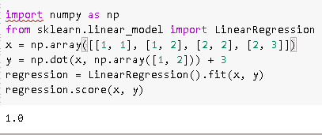
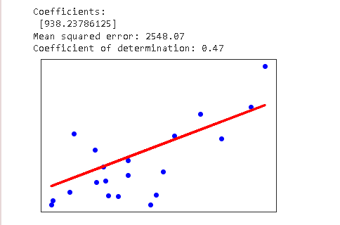
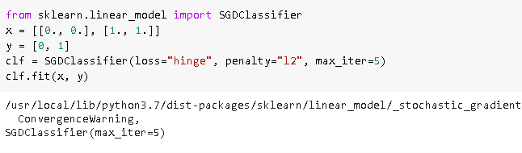
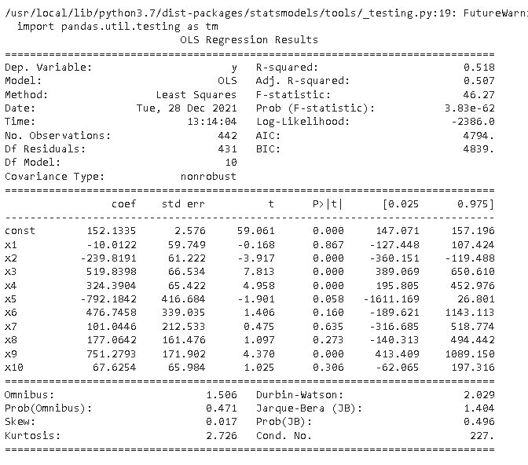
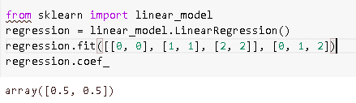
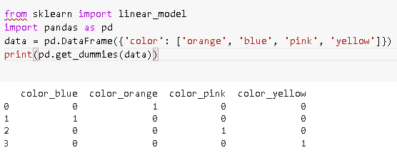

# Scikit 学习线性回归+示例

> 原文：<https://pythonguides.com/scikit-learn-linear-regression/>

[](https://sharepointsky.teachable.com/p/python-and-machine-learning-training-course)

在这个 [Python 教程](https://pythonguides.com/learn-python/)中，我们将学习**Scikit 如何在 `Python` 中学习线性回归工作**，我们还将涵盖与**线性回归**相关的不同例子。我们将讨论这些话题。

*   Scikit 学习线性回归
*   Scikit 学习线性回归示例
*   Scikit 了解线性回归的优缺点
*   Scikit 学习线性回归梯度下降
*   Scikit 学习线性回归 p 值
*   Scikit 学习线性回归多重特性
*   Scikit 学习线性回归分类变量

目录

[](#)

*   [Scikit 学习线性回归](#Scikit_learn_Linear_Regression "Scikit learn Linear Regression")
*   [Scikit 学习线性回归示例](#Scikit_learn_Linear_Regression_example "Scikit learn Linear Regression example")
*   [Scikit 学习线性回归的优缺点](#Scikit_learn_Linear_Regression_advantages_and_disadvantages "Scikit learn Linear Regression advantages and disadvantages")
*   [Scikit 学习线性回归梯度下降](#Scikit_learn_Linear_Regression_gradient_descent "Scikit learn Linear Regression gradient descent")
*   [Scikit 学习线性回归 p 值](#Scikit_learn_Linear_Regression_p-value "Scikit learn Linear Regression p-value")
*   [Scikit 学习线性回归多重特性](#Scikit_learn_Linear_Regression_multiple_features "Scikit learn Linear Regression multiple features")
*   [Scikit 学习线性回归分类变量](#Scikit_learn_Linear_Regression_categorical_Variable "Scikit learn Linear Regression categorical Variable")

## Scikit 学习线性回归

在这一节中，我们将了解**如何 [Scikit 学习](https://pythonguides.com/what-is-scikit-learn-in-python/)线性回归在 **Python 中的工作方式**。**

*   线性回归是预测建模技术的一种形式，它调查因变量和自变量之间的关系。
*   线性回归是建模因变量和自变量之间关系的线性方法。

**代码:**

在下面的代码中，我们将**从 sklearn.linear_model** 导入线性回归，通过它我们可以调查因变量和自变量之间的关系。

**回归=线性回归()。**fit(x，y)用于拟合线性模型。

```py
import numpy as np
from sklearn.linear_model import LinearRegression
x = np.array([[1, 1], [1, 2], [2, 2], [2, 3]])
# y = 1 * x_0 + 2 * x_1 + 3
y = np.dot(x, np.array([1, 2])) + 3
regression = LinearRegression().fit(x, y)
regression.score(x, y)
```

**输出:**

运行上面的代码后，我们得到下面的输出，我们可以看到线性回归的分数打印在屏幕上。



scikit learn linear regression

另外，检查: [Scikit-learn 逻辑回归](https://pythonguides.com/scikit-learn-logistic-regression/)

## Scikit 学习线性回归示例

在本节中，我们将了解**如何` `scikit 学习 Python 中的线性回归示例工作**。

正如我们所知，线性回归评估一个或多个预测变量之间的关系。

**代码:**

在下面的代码中，我们将从 sklearn 导入数据集 linear_model，通过它我们可以评估预测变量之间的关系。

*   **diabetes_x，diabetes _ y = datasets . load _ diabetes(return _ X _ y = True)**用于导入糖尿病数据集。
*   **diabetes_x = diabetes_x[:，np.newaxis，2]** 仅使用一个特征。
*   **diabetes _ x _ train = diabetes _ x[:-20]**用于将数据拆分成训练集或测试集。
*   **回归=线性 _ 模型。**linear regression()用于创建一个线性回归对象。
*   **regression . fit(diabetes _ x _ train，diabetes_y_train)** 用于使用训练集对模型进行训练。
*   **打印(" Coefficients: \n "，regression.coef_)** 用于打印系数。
*   **print(" meansquadererror:% . 2f " % mean _ squared _ error(diabetes _ y _ test，diabetes_y_pred))** 用于计算均方误差。
*   **plot . scatter(diabetes _ x _ test，diabetes_y_test，color="blue")** 用于绘制散点图。

```py
import matplotlib.pyplot as plot
import numpy as np
from sklearn import datasets, linear_model
from sklearn.metrics import mean_squared_error, r2_score

diabetes_x, diabetes_y = datasets.load_diabetes(return_X_y=True)

diabetes_x = diabetes_x[:, np.newaxis, 2]

diabetes_x_train = diabetes_x[:-20]
diabetes_x_test = diabetes_x[-20:]

diabetes_y_train = diabetes_y[:-20]
diabetes_y_test = diabetes_y[-20:]

regression = linear_model.LinearRegression()

regression.fit(diabetes_x_train, diabetes_y_train)

diabetes_y_pred = regression.predict(diabetes_x_test)

print("Coefficients: \n", regression.coef_)

print("Mean squared error: %.2f" % mean_squared_error(diabetes_y_test, diabetes_y_pred))

print("Coefficient of determination: %.2f" % r2_score(diabetes_y_test, diabetes_y_pred))

plot.scatter(diabetes_x_test, diabetes_y_test, color="blue")
plot.plot(diabetes_x_test, diabetes_y_pred, color="red", linewidth=3)

plot.xticks(())
plot.yticks(())

plot.show()
```

**输出:**

运行上述代码后，我们得到以下输出，从中我们可以看到均方误差和决定系数打印在屏幕上。



scikit learn linear regression example

阅读: [Scikit 学习决策树](https://pythonguides.com/scikit-learn-decision-tree/)

## Scikit 学习线性回归的优缺点

在这一节中，我们将了解到 **Scikit 学习线性回归的优点和**T2 在 Python 中的缺点。

**优点:**

1.  线性回归简单且易于实施，并且解释了输出的系数。

2.线性回归避免了降维技术，但允许过度拟合。

3.当我们研究因变量和自变量之间的关系时，线性回归是最合适的。

4.与其他算法相比，线性回归的复杂性较低。

**缺点:**

1.  在线性回归中，存在对边界和回归有很大影响的异常值。

2.线性回归关注因变量和自变量的平均值。如果平均值给出了单个变量的完整描述，那么线性变量不能给出变量之间关系的描述。

3.线性回归研究因变量和自变量之间的关系，因此这意味着它们之间存在直线关系。

阅读:[Scikit-learn Vs tensor flow–详细对比](https://pythonguides.com/scikit-learn-vs-tensorflow/)

## Scikit 学习线性回归梯度下降

在本节中，我们将了解到**scikit 如何在 `Python` 中学习线性回归梯度下降` `工作**。

*   在前进之前，我们应该有一些关于梯度下降的知识。梯度作为斜率函数工作，并且梯度简单地计算权重的变化。
*   梯度越高，斜率越低，模型越快。

**代码:**

在下面的代码中，我们将从 sklearn.linear_model 导入 SGDClassifier，通过它我们可以作为斜率函数工作。

```py
from sklearn.linear_model import SGDClassifier
x = [[0., 0.], [1., 1.]]
y = [0, 1]
clf = SGDClassifier(loss="hinge", penalty="l2", max_iter=5)
clf.fit(x, y)
```

**输出:**

运行上面的代码后，我们得到下面的输出，我们可以看到随机梯度下降值打印在屏幕上。



scikit learn linear regression gradient descent

阅读: [Scikit 学习准确度 _ 分数](https://pythonguides.com/scikit-learn-accuracy-score/)

## Scikit 学习线性回归 p 值

在本节中，我们将了解**sci kit 如何在 python 中学习线性回归 p 值的工作方式**。

p 值被定义为当零假设为零时的概率，或者我们可以说，告诉零假设的统计显著性被拒绝或不被拒绝。一般来说，p 值小于 0.05

**代码:**

在下面的代码中，我们将**从 sklearn.linear_model** 导入 LinearRegression，通过它我们计算 p 值。

*   `sm.add_constant(x)` 用于添加常量。
*   `p.fit()` 用于拟合数值。

```py
import pandas as pd
import numpy as np
from sklearn import datasets, linear_model
from sklearn.linear_model import LinearRegression
import statsmodels.api as sm
from scipy import stats

diabetesdataset = datasets.load_diabetes()
x = diabetesdataset.data
y = diabetesdataset.target

x2 = sm.add_constant(x)
p = sm.OLS(y, x2)
p2 = p.fit()
print(p2.summary())
```

**输出:**

运行上面的代码后，我们得到下面的输出，其中我们可以看到 p 值被打印在屏幕上。



scikit learn linear regression p-value

阅读: [Scikit 学习层次聚类](https://pythonguides.com/scikit-learn-hierarchical-clustering/)

## Scikit 学习线性回归多重特性

在本节中，我们将了解**Python 中的线性回归多重特性如何工作**。

*   众所周知，线性回归是预测建模技术的一种形式，它调查因变量和自变量之间的关系。
*   线性回归有多个特征，其中一个特征是普通最小二乘法。
*   这种线性回归用它们的系数来拟合线性模型，以最小化数据集中被观察目标之间的剩余观察总和。

**代码:**

在下面的代码中，我们将**从 sklearn** 导入 linear_model，通过它我们计算回归系数。

*   **regression.fit([[0，0]，[1，1]，[2，2]，[0，1，2])** 用于拟合模型。
*   `regression.coef_` 用于计算模型的系数。

```py
from sklearn import linear_model
regression = linear_model.LinearRegression()
regression.fit([[0, 0], [1, 1], [2, 2]], [0, 1, 2])
regression.coef_
```

**输出:**

运行上面的代码后，我们得到了下面的输出，其中我们可以看到回归系数被打印在屏幕上。



scikit learn linear regression multiple features

另外，请阅读: [Scikit 学习功能选择](https://pythonguides.com/scikit-learn-feature-selection/)

## Scikit 学习线性回归分类变量

在本节中，我们将学习 **scikit 如何在 **Python 中学习线性回归分类变量工作**。**

在继续之前，我们将有一些关于分类变量的知识。

分类变量被定义为只接受非数字值的变量，如年龄、性别等。

**代码:**

在下面的代码中，我们将**从 sklearn** 导入线性回归，通过它我们可以创建一个分类虚拟变量。

**数据= pd。DataFrame({'color': ['orange '，' blue '，' pink '，' yellow']})** 用于创建数据集。

```py
from sklearn import linear_model
import pandas as pd
data = pd.DataFrame({'color': ['orange', 'blue', 'pink', 'yellow']})
print(pd.get_dummies(data))
```

**输出:**

运行上面的代码后，我们得到下面的输出，我们可以看到分类数据被打印在屏幕上。



scikit learn linear regression categorical variable

另外，看看 Scikit learn 上的更多教程。

*   [Scikit 学岭回归](https://pythonguides.com/scikit-learn-ridge-regression/)
*   [Scikit 学习隐马尔可夫模型](https://pythonguides.com/scikit-learn-hidden-markov-model/)
*   [Scikit 学习 hidden _ layer _ size](https://pythonguides.com/scikit-learn-hidden_layer_sizes/)
*   [Scikit 学习梯度下降](https://pythonguides.com/scikit-learn-gradient-descent/)

因此，在本教程中，我们讨论了`Scikit learn linear regression`，并涵盖了与其实现相关的不同示例。这是我们已经讨论过的例子列表。

*   Scikit 学习线性回归
*   Scikit 学习线性回归示例
*   Scikit 了解线性回归的优缺点
*   Scikit 学习线性回归梯度下降
*   Scikit 学习线性回归 p 值
*   Scikit 学习线性回归多重特性
*   Scikit 学习线性回归分类变量

[Bijay Kumar](https://pythonguides.com/author/fewlines4biju/)

Python 是美国最流行的语言之一。我从事 Python 工作已经有很长时间了，我在与 Tkinter、Pandas、NumPy、Turtle、Django、Matplotlib、Tensorflow、Scipy、Scikit-Learn 等各种库合作方面拥有专业知识。我有与美国、加拿大、英国、澳大利亚、新西兰等国家的各种客户合作的经验。查看我的个人资料。

[enjoysharepoint.com/](https://enjoysharepoint.com/)[](https://www.facebook.com/fewlines4biju "Facebook")[](https://www.linkedin.com/in/fewlines4biju/ "Linkedin")[](https://twitter.com/fewlines4biju "Twitter")