# sci kit-学习逻辑回归

> 原文：<https://pythonguides.com/scikit-learn-logistic-regression/>

[](https://sharepointsky.teachable.com/p/python-and-machine-learning-training-course)

在这个 [Python 教程](https://pythonguides.com/learn-python/)中，我们将学习`sci kit-learn logistic regression`，我们还将涵盖与`sci kit-learn logistic regression`相关的不同示例。我们将讨论这些话题。

*   sci kit-学习逻辑回归
*   sci kit-学习逻辑回归标准误差
*   sci kit-学习逻辑回归系数
*   sci kit-学习逻辑回归 p 值
*   sci kit-了解逻辑回归特性的重要性
*   sci kit-学习逻辑回归分类变量
*   Scikit-learn 逻辑回归交叉验证
*   sci kit-学习逻辑回归阈值

目录

[](#)

*   [Scikit-learn 逻辑回归](#Scikit-learn_logistic_regression "Scikit-learn logistic regression")
*   [sci kit-学习逻辑回归标准误差](#Scikit-learn_logistic_regression_standard_errors "Scikit-learn logistic regression standard errors")
*   [sci kit-学习逻辑回归系数](#Scikit-learn_logistic_regression_coefficients "Scikit-learn logistic regression coefficients")
*   [sci kit-学习逻辑回归 p 值](#Scikit-learn_logistic_regression_p_value "Scikit-learn logistic regression p value")
*   [sci kit-学习逻辑回归特征重要性](#Scikit-learn_logistic_regression_feature_importance "Scikit-learn logistic regression feature importance")
*   [sci kit-学习逻辑回归分类变量](#Scikit-learn_logistic_regression_categorical_variables "Scikit-learn logistic regression categorical variables")
*   [Scikit-learn 逻辑回归交叉验证](#Scikit-learn_logistic_regression_cross-validation "Scikit-learn logistic regression cross-validation")
*   [sci kit-学习逻辑回归阈值](#Scikit-learn_logistic_regression_threshold "Scikit-learn logistic regression threshold")

## Scikit-learn 逻辑回归

在本节中，我们将在 [scikit-learn](https://pythonguides.com/what-is-scikit-learn-in-python/) 中了解**如何使用逻辑回归**。

*   逻辑回归是一种防止二元分类的统计方法，或者我们可以说，当因变量为二元时进行逻辑回归。
*   二分意味着有两个可能的类，如二进制类(0&1)。
*   逻辑回归用于分类和回归。它计算事件发生的概率。

**代码:**

在这段代码中，我们将借助 sklearn 库导入 load_digits 数据集。数据内置在 sklearn 中，我们不需要上传数据。

```py
from sklearn.datasets import load_digits
digits = load_digits()
```

我们已经可以在 sklearn 的帮助下导入数据。从下面的命令上传的数据中，我们可以看到数据集中有 1797 个图像和 1797 个标签。

```py
 print('Image Data Shape' , digits.data.shape)

print("Label Data Shape", digits.target.shape
```

在下面的输出中，我们可以看到图像数据形状值和标签数据形状值正在屏幕上打印。

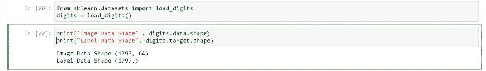

Importing dataset value

在这一部分，我们将看到我们的图像和标签看起来如何像图像，并帮助唤起您的数据。

*   **plot.figure(figsize=(30，4))** 用于在屏幕上绘制图形。
*   **for index，(image，label)in enumerate(zip(digits . data[5:10]，digits . target[5:10]):**用于给图片赋予完美的大小或标签。
*   plot.subplot(1，5，index + 1)用于绘制索引。
*   **plot . im show(NP . shape(image，(8，8))，cmap=plt.cm.gray)** 用于对图像进行整形。
*   **plot.title('Set: %i\n' % label，fontsize = 30)** 用于给图像加标题。

```py
import numpy as np 
import matplotlib.pyplot as plot
plot.figure(figsize=(30,4))
for index, (image, label) in enumerate(zip(digits.data[5:10], digits.target[5:10])):
 plot.subplot(1, 5, index + 1)
 plot.imshow(np.reshape(image, (8,8)), cmap=plt.cm.gray)
 plot.title('Set: %i\n' % label, fontsize = 30)
```

运行上面的代码后，我们得到下面的输出，我们可以看到图像以 Set5，Set6，Set7，Set8，Set9 的形式绘制在屏幕上。

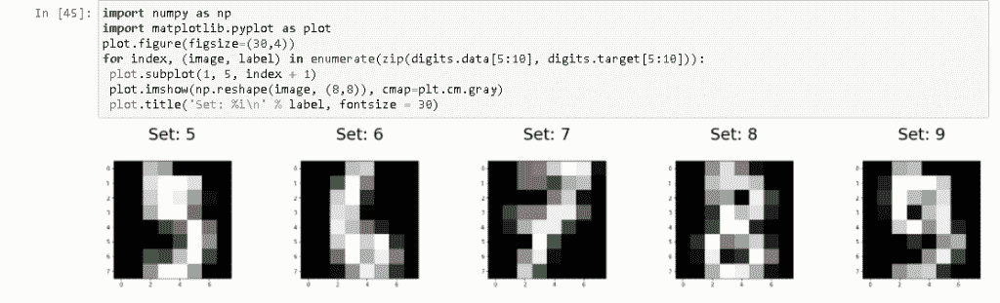

Enumerate digits target set

在下面的代码中，我们将数据分为两种形式:训练数据和测试数据。

```py
from sklearn.model_selection import train_test_split
x_train, x_test, y_train, y_test = train_test_split(digits.data, digits.target, test_size=0.25, random_state=0)
```

这里我们从 sklearn 导入逻辑回归。sklearn 用于专注于数据集建模。

```py
from sklearn.linear_model import LogisticRegression
```

在下面的代码中，我们创建了模型的一个实例。在这里，所有未指定的参数都设置为默认值。

```py
logisticRegression= LogisticRegression()
```

上面我们把数据分成两组训练和测试数据。我们可以在训练完我们想要测试的数据后训练模型

```py
logisticRegression.fit(x_train, y_train)
```

该模型可以在模型训练过程中学习，并从一个观察预测数据，并以数组的形式返回数据。

```py
logisticRegression.predict(x_test[0].reshape(1,-1)
```

在下面的输出中，我们看到 NumPy 数组在预测一次观察后返回。

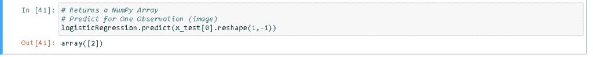

Return the array

从下面的代码中，我们可以一次预测多个观察值。

```py
logisticRegression.predict(x_test[0:10])
```

从这段代码中，我们可以预测整个数据。

```py
logisticRegression.predict(x_test[0:10])
```

经过训练和测试，我们的模型是准备好了还是没有发现，我们可以衡量模型的准确性，我们可以使用评分方法来获得模型的准确性。

```py
predictions = logisticRegression.predict(x_test)
score = logisticRegression.score(x_test, y_test)
print(score)
```

在这个输出中，我们可以通过使用评分方法来获得模型的准确性。

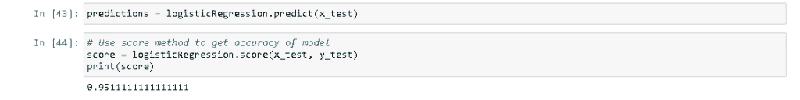

Predict the accuracy of a model

另外，检查: [Scikit 学习决策树](https://pythonguides.com/scikit-learn-decision-tree/)

## sci kit-学习逻辑回归标准误差

正如我们所知，逻辑回归是一种防止二元分类的统计方法，并且我们知道当因变量为二元时进行逻辑回归。

这里我们可以研究逻辑标准误差。标准误差被定义为模型的系数是协方差矩阵的对角元素的平方根。

**代码:**

在下面的代码中，我们将处理逻辑回归的**标准误差，因为我们知道标准误差是协方差矩阵对角元素的平方根。**

```py
from sklearn.metrics import mean_squared_error
y_true = [4, -0.6, 3, 8]
y_pred = [3.5, 0.1, 3, 9]
mean_squared_error(y_true, y_pred)
0.475
y_true = [4, -0.6, 3, 8]
y_pred = [3.5, 0.1, 3, 9]
mean_squared_error(y_true, y_pred, squared=False)
0.712
y_true = [[0.6, 2],[-2, 2],[8, -7]]
y_pred = [[1, 3],[-1, 3],[7, -6]]
mean_squared_error(y_true, y_pred)
0.808
mean_squared_error(y_true, y_pred, squared=False)
0.922
mean_squared_error(y_true, y_pred, multioutput='raw_values')
array=([0.51666667, 2])
mean_squared_error(y_true, y_pred, multioutput=[0.3, 0.7])
0.925
```

**输出:**

运行上面的代码后，我们得到下面的输出，其中我们可以看到错误值已经生成并显示在屏幕上。

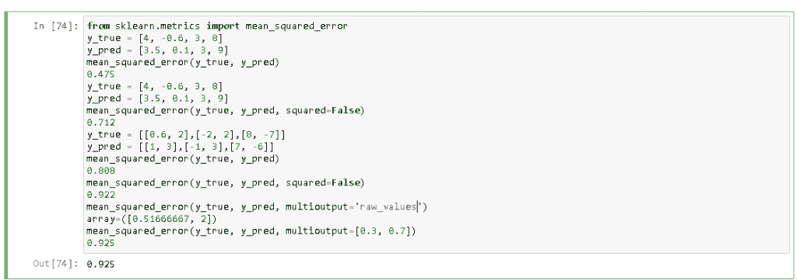

Scikit-learn logistic regression standard error

阅读: [Scikit 学习随机森林](https://pythonguides.com/scikit-learn-random-forest/)

## sci kit-学习逻辑回归系数

在本节中，我们将了解如何在 scikit-learn 中使用逻辑回归系数。

系数被定义为给定项的值彼此相乘的数。这里，逻辑回归表示变量的大小和方向。

**代码:**

在下面的代码中，我们将库**作为 pd** 导入熊猫，**作为 np** 导入 numpy，**作为 sl 导入 sklearn。**

*   **panda 库**用于数据操作， `numpy` 用于处理数组。
*   **sklearn 库**用于专注于建模数据，而不是专注于操纵数据。
*   **x = np.random.randint(0，7，size=n)** 用于生成随机函数。
*   **res_sd = sd。Logit(y，x)。fit(method="ncg "，maxiter=max_iter)** 用于执行不同的静态任务。
*   `print(res_sl.coef_)` 用于在屏幕上打印系数。

```py
 import pandas as pd
import numpy as np
import sklearn as sl
from sklearn.linear_model import LogisticRegression
import statsmodels.api as sd

n = 250

x = np.random.randint(0, 7, size=n)
y = (x > (0.10 + np.random.normal(0, 0.10, n))).astype(int)

display(pd.crosstab( y, x ))

max_iter = 150

res_sd = sd.Logit(y, x).fit(method="ncg", maxiter=max_iter)
print(res_sd.params)

res_sl = LogisticRegression( solver='newton-cg', multi_class='multinomial', max_iter=max_iter, fit_intercept=True, C=1e8 )
res_sl.fit( x.reshape(n, 1), y )
print(res_sl.coef_) 
```

**输出:**

运行上述代码后，我们得到以下输出，其中我们可以看到屏幕上打印了 scikit learn 逻辑回归系数。

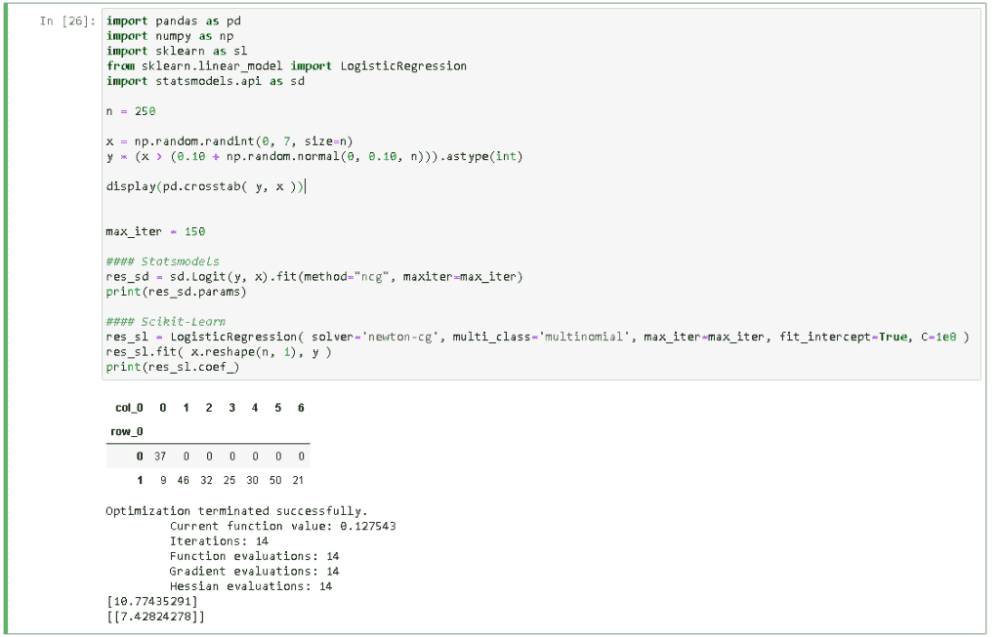

scikit learn logistic regression coefficient

阅读: [Scikit 学习功能选择](https://pythonguides.com/scikit-learn-feature-selection/)

## sci kit-学习逻辑回归 p 值

在本节中，我们将了解如何在 scikit learn 中计算逻辑回归的 p 值。

逻辑回归 pvalue 用于检验零假设，其系数等于零。最低的 p 值是 **< 0.05** ，这个最低的值表示你可以拒绝零假设。

**代码:**

在下面的代码中，我们将把库 **import numpy 作为处理数组的 np** 来导入。

*   在此，我们首先计算 scikit 学习逻辑回归的 z 分数。
*   **def logit_p1value(model，x):** 在这里，我们使用一些类似 model 和 x 的参数。
*   **模型**:用于拟合的 sklearn.linear_model。具有截距和大 C 值的逻辑回归
*   **x:** 用作模型拟合的矩阵。
*   **model = logistic regression(C = 1e 30)。fit(x，y)** 用于测试 pvalue。
*   **print(logit_pvalue(model，x))** 进一步测试该值后，通过该方法将该值打印在屏幕上。
*   **sd_model = sd。Logit(y，sm.add_constant(x))。fit(disp=0)** 用于比较 pvalue 和 statmodels。

```py
import numpy as np
from scipy.stats import norm
from sklearn.linear_model import LogisticRegression

def logit_p1value(model, x):

    p1 = model.predict_proba(x)
    n1 = len(p1)
    m1 = len(model.coef_[0]) + 1
    coefs = np.concatenate([model.intercept_, model.coef_[0]])
    x_full = np.matrix(np.insert(np.array(x), 0, 1, axis = 1))
    answ = np.zeros((m1, m1))
    for i in range(n1):
        answ = answ + np.dot(np.transpose(x_full[i, :]), x_full[i, :]) * p1[i,1] * p1[i, 0]
    vcov = np.linalg.inv(np.matrix(answ))
    se = np.sqrt(np.diag(vcov))
    t1 =  coefs/se  
    p1 = (1 - norm.cdf(abs(t1))) * 2
    return p1

x = np.arange(10)[:, np.newaxis]
y = np.array([0,0,0,1,0,0,1,1,1,1])
model = LogisticRegression(C=1e30).fit(x, y)
print(logit_pvalue(model, x))

import statsmodels.api as sd
sd_model = sd.Logit(y, sm.add_constant(x)).fit(disp=0)
print(sd_model.pvalues)
sd_model.summary()
```

**输出:**

运行上述代码后，我们得到以下输出，从中我们可以看到屏幕上创建了逻辑回归 p 值。

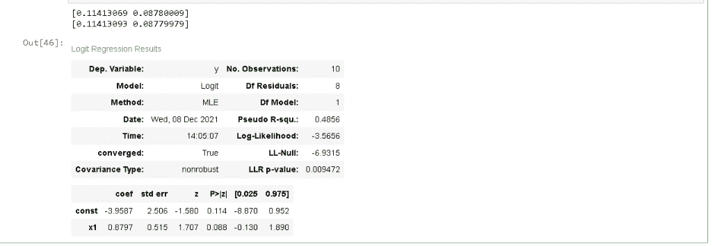

scikit learn logistic regression p value

## sci kit-学习逻辑回归特征重要性

在本节中，我们将了解到**在 scikit learn 中逻辑回归**的重要性。

特征重要性被定义为一种为输入特征分配值的方法，这些值是根据它们对预测目标变量的帮助程度来分配的。

**代码:**

在下面的代码中，我们将从 sklearn.linear_model 导入 LogisticRegression，还将导入 pyplot 以在屏幕上绘制图形。

*   **x，y = make _ classification(n _ samples = 100，n_features=10，n _ informative = 5，n_redundant=5，random_state=1)** 用于定义 dtatset。
*   `model = LogisticRegression()`用于定义模型。
*   **model.fit(x，y)** 用于拟合模型。
*   **impact = model . coef _[0]**用于获取特征的重要性。
*   **py plot . bar([X for X in range(len(impact))]，impact)**用于绘制特征重要性。

```py
 from sklearn.datasets import make_classification
from sklearn.linear_model import LogisticRegression
from matplotlib import pyplot

x, y = make_classification(n_samples=100, n_features=10, n_informative=5, n_redundant=5, random_state=1)

model = LogisticRegression()

model.fit(x, y)

imptance = model.coef_[0]

for i,j in enumerate(importance):
	print('Feature: %0d, Score: %.5f' % (i,j))

pyplot.bar([X for X in range(len(imptance))], imptance)
pyplot.show()
```

**输出:**

运行上述代码后，我们得到以下输出，从中我们可以看到屏幕上显示了逻辑回归特征的重要性。

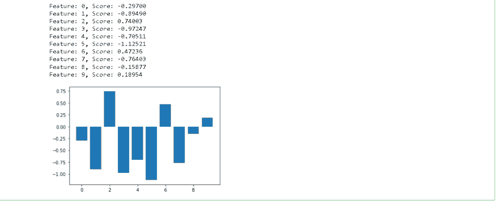

scikit learn logistic regression feature importance

另外，请阅读: [Scikit-learn 与 tensor flow–详细对比](https://pythonguides.com/scikit-learn-vs-tensorflow/)

## sci kit-学习逻辑回归分类变量

在本节中，我们将了解 scikit learn 中的逻辑回归分类变量。

顾名思义，将数据分为不同的类别，或者我们可以说分类变量是一个单独分配给某个基本定性属性的特定组的变量。

**代码:**

在下面的代码中，我们将导入一些库如 `import pandas as pd` ， `import NumPy` as np 也导入 copy。Pandas 用于操作和分析数据，NumPy 用于支持多个数组。

```py
import pandas as pd
import numpy as np
import copy
%matplotlib inline
```

在这里，我们可以上传 CSV 数据文件，以获取客户的一些数据。

`df_data.head()` 用于显示文件内数据的前五行。

```py
df_data = pd.read_csv('data.csv')

df_data.head()
```

在下面的输出中，我们可以看到，我们从屏幕上显示的数据集中获得了前五行。

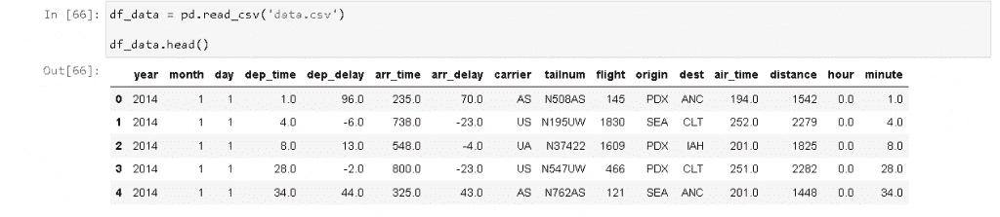

scikit learn logistic regression categorical variable data

`print(df_data.info())` 用于打印屏幕上的数据信息。

```py
print(df_data.info())
```

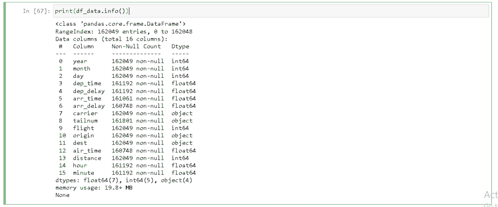

Printing the data info

生成箱线图是为了显示数据集的完整摘要。

```py
df_data.boxplot('dep_time','origin',rot = 30,figsize=(5,6))
```

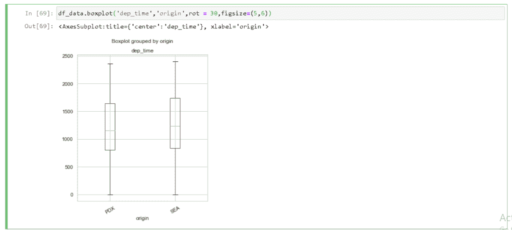

Boxplot

给你。如果在数据框中进行了任何更改，并且此更改不影响原始数据，则使用 copy()方法。

```py
cat_df_data = df_data.select_dtypes(include=['object']).copy()
```

。hed()函数用于检查你是否有任何需要填充的内容

```py
cat_df_data.head()
```

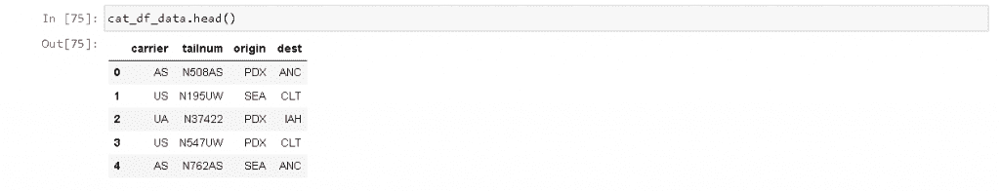

Filter the columns

这里我们使用这些命令来检查数据集中的空值。由此，我们可以得到缺失值的总数。

```py
print(cat_df_data.isnull().values.sum())
```

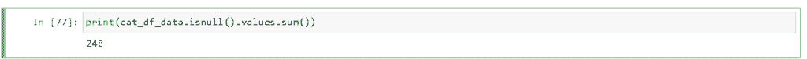

Missing values

这将检查空值的列分布。

```py
print(cat_df_data.isnull().sum())
```

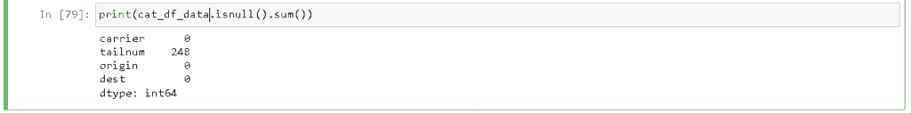

column-wise distribution

。value_count()方法用于返回每个类别的频率分布。

```py
cat_df_data = cat_df_data.fillna(cat_df_data['tailnum'].value_counts().index[0])
```

现在，我们可以在分配不同的方法后再次检查空值，结果是零计数。

```py
print(cat_df_data.isnull().values.sum())
```


Result of null value

**。value_count()** 方法用于分类特征的类别的频率分布。

```py
print(cat_df_data['carrier'].value_counts())
```

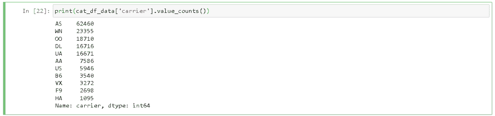

Frequency distribution

这用于计算特征的不同类别。

```py
print(cat_df_data['carrier'].value_counts().count())
```

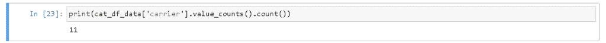

Feature of different category

*   **SNS . bar plot(carrier _ count . index，carrier_count.values，alpha=0.9)** 用于绘制条形图。
*   **PLT . title(‘载波频率分布’)**用于给柱状图命名。
*   **plt.ylabel('出现次数'，fontsize** =12)用于给 y 轴加标签。
*   **plt.xlabel('Carrier '，fontsize=12)** 用于给 x 轴加标签。

```py
import seaborn as sns
import matplotlib.pyplot as plt
carrier_count = cat_df_data['carrier'].value_counts()
sns.set(style="darkgrid")
sns.barplot(carrier_count.index, carrier_count.values, alpha=0.9)
plt.title('Frequency Distribution of Carriers')
plt.ylabel('Number of Occurrences', fontsize=12)
plt.xlabel('Carrier', fontsize=12)
plt.show()
```

在这张图片中，我们可以看到条形图绘制在屏幕上。

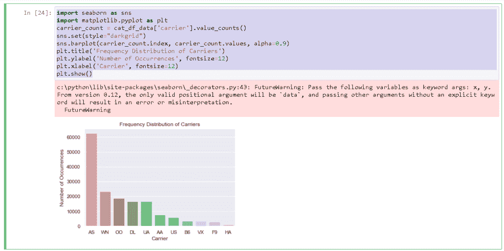

Bar graph of a categorical variable

*   **labels = cat _ df _ data[' carrier ']。astype(' category '). cat . categories . to list()**用于给图表加标签。
*   **size =[counts[var _ cat]for var _ cat in labels]**用于给出饼图的大小。
*   **fig1，ax1 = plt.subplots()** 用于绘制图表。

```py
labels = cat_df_data['carrier'].astype('category').cat.categories.tolist()
counts = cat_df_data['carrier'].value_counts()
sizes = [counts[var_cat] for var_cat in labels]
fig1, ax1 = plt.subplots()
ax1.pie(sizes, labels=labels, autopct='%1.1f%%', shadow=True) #autopct is show the % on plot
ax1.axis('equal')
plt.show()
```

在下面的输出中，我们可以看到屏幕上绘制了一个饼图，其中的值被分成不同的类别。

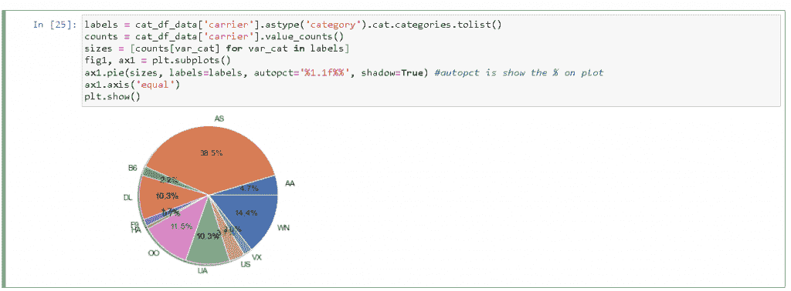

Plotting the pie chart

阅读: [Scikit 学习情绪分析](https://pythonguides.com/scikit-learn-sentiment-analysis/)

## Scikit-learn 逻辑回归交叉验证

在本节中，我们将了解 scikit learn 中的逻辑回归交叉验证。

*   正如我们所知，scikit 学习库用于集中建模数据。它只是专注于数据建模，而不是加载数据。
*   这里使用 scikit learn 我们还创建了逻辑回归交叉验证的结果。
*   交叉验证是一种在不同迭代中使用测试序列和测试模型的不同数据位置的方法。

**代码:**

在下面的代码中，我们导入不同的库来获得逻辑回归交叉验证的准确值。

*   **x，y = make _ classification(n _ samples = 1000，n_features=20，n _ informative = 15，n_redundant=5，random_state=1)** 用于创建数据集。
*   **CV = KFold(n_splits=10，random_state=1，shuffle=True)** 用于准备交叉验证程序。
*   `model = LogisticRegression()`用于创建模型。
*   **score = cross_val_score(model，x，y，scoring='accuracy '，cv=CV，n_jobs=-1)** 用于评估模型。
*   **print(' Accuracy:% . 3f(% . 3f)' %(mean(score)，std(score)))** 用于准备绩效报告。

```py
from numpy import mean
from numpy import std
from sklearn.datasets import make_classification
from sklearn.model_selection import KFold
from sklearn.model_selection import cross_val_score
from sklearn.linear_model import LogisticRegression

x, y = make_classification(n_samples=1000, n_features=20, n_informative=15, n_redundant=5, random_state=1)

CV = KFold(n_splits=10, random_state=1, shuffle=True)

model = LogisticRegression()

score = cross_val_score(model, x, y, scoring='accuracy', cv=CV, n_jobs=-1)

print('Accuracy: %.3f (%.3f)' % (mean(score), std(score)))
```

**输出:**

运行上述代码后，我们得到以下输出，从中我们可以看到交叉验证的准确性显示在屏幕上。

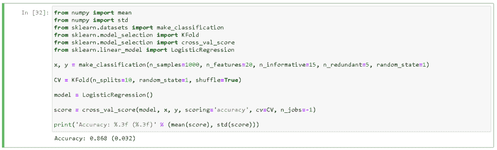

scikit learn logistic regression cross-validation

## sci kit-学习逻辑回归阈值

在本节中，我们将了解如何在 scikit learn 中获取逻辑回归阈值。

*   众所周知，逻辑回归是一种防止二元分类的统计方法。二进制类被定义为 0 或 1，或者我们可以说是真或假。
*   在这里，逻辑回归将每一行指定为真的概率，并且如果该值小于 0.5，则将该值作为 0 进行预测。
*   阈值的默认值为 0.5。

**代码:**

在下面的代码中，我们将导入不同的方法，从中我们得到逻辑回归的阈值。阈值的默认值为 0.5，如果阈值小于 0.5，则我们将该值视为 0。

*   **X，y = make _ classification(n _ samples = 1000，n_features=2，n_redundant=0，n_clusters_per_class=1，weights=[0.99]，flip_y=0，random_state=4)** 用于生成数据集。
*   **trainX，testX，trainy，testy = train_test_split(X，y，test_size=0.5，random_state=2，strategy = y)**用于将数据拆分为训练和测试。
*   **models.fit(trainX，trainy)** 用于拟合模型。
*   `yhat = model . predict _ proba(testX)`用于预测概率。
*   **yhat = yhat[:，1]** 仅用于保持正面结果的概率。
*   **fpr，tpr，thresholds = roc_curve(testy，yhat)** 用于计算 roc 曲线。

```py
 from numpy import argmax
from sklearn.datasets import make_classification
from sklearn.linear_model import LogisticRegression
from sklearn.model_selection import train_test_split
from sklearn.metrics import roc_curve

X, y = make_classification(n_samples=1000, n_features=2, n_redundant=0,
	n_clusters_per_class=1, weights=[0.99], flip_y=0, random_state=4)

trainX, testX, trainy, testy = train_test_split(X, y, test_size=0.5, random_state=2, stratify=y)

models = LogisticRegression(solver='lbfgs')
models.fit(trainX, trainy)

yhat = model.predict_proba(testX)

yhat = yhat[:, 1]

fpr, tpr, thresholds = roc_curve(testy, yhat)
Jt = tpr - fpr
ix = argmax(Jt)
best_threshold = thresholds[ix]
print('Best Threshold=%f' % (best_threshold))
```

**输出:**

运行上面的代码后，我们得到下面的输出，其中我们可以看到阈值被打印在屏幕上。

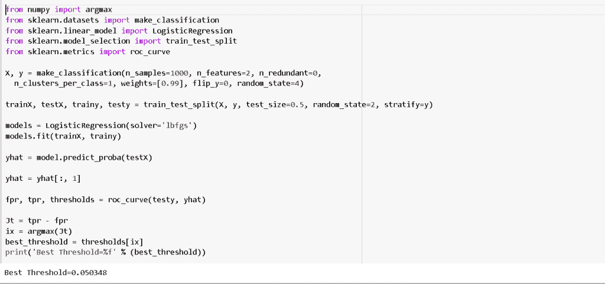

scikit learn logistic regression threshold

因此，在本教程中，我们讨论了`sci kit learn logistic regression`，我们还涵盖了与其实现相关的不同示例。这是我们已经讨论过的例子列表。

*   sci kit-学习逻辑回归
*   sci kit-学习逻辑回归标准误差
*   sci kit-学习逻辑回归系数
*   sci kit-学习逻辑回归 p 值
*   sci kit-了解逻辑回归特性的重要性
*   sci kit-学习逻辑回归分类变量
*   Scikit-learn 逻辑回归交叉验证
*   sci kit-学习逻辑回归阈值

[Bijay Kumar](https://pythonguides.com/author/fewlines4biju/)

Python 是美国最流行的语言之一。我从事 Python 工作已经有很长时间了，我在与 Tkinter、Pandas、NumPy、Turtle、Django、Matplotlib、Tensorflow、Scipy、Scikit-Learn 等各种库合作方面拥有专业知识。我有与美国、加拿大、英国、澳大利亚、新西兰等国家的各种客户合作的经验。查看我的个人资料。

[enjoysharepoint.com/](https://enjoysharepoint.com/)[](https://www.facebook.com/fewlines4biju "Facebook")[](https://www.linkedin.com/in/fewlines4biju/ "Linkedin")[](https://twitter.com/fewlines4biju "Twitter")