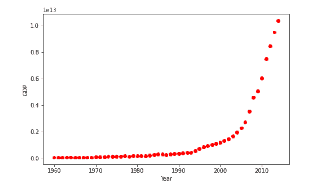

# Scikit 非线性学习[完整指南]

> 原文：<https://pythonguides.com/scikit-learn-non-linear/>

[](https://sharepointsky.teachable.com/p/python-and-machine-learning-training-course)

在这个 [Python 教程](https://pythonguides.com/learn-python/)中，我们将学习**Scikit 如何学习非线性工作**，我们还将涵盖与 **Scikit 学习非线性**相关的不同示例。此外，我们将涵盖这些主题。

*   Scikit 学习非线性
*   Scikit 学习非线性回归
*   Scikit 学习非线性回归示例
*   Scikit 学习非线性 SVM
*   Scikit 学习非线性模型
*   Scikit 学习非线性分类器
*   Scikit 学习非线性降维
*   Scikit 学习非线性 PCA

在继续本教程之前，我们建议您阅读一下[什么是 Python 中的 Scikit Learn](https://pythonguides.com/what-is-scikit-learn-in-python/)。

目录

[](#)

*   [Scikit 学习非线性](#Scikit_learn_non-linear "Scikit learn non-linear")
*   [Scikit 学习非线性回归](#Scikit_learn_non-linear_regression "Scikit learn non-linear regression")
*   [Scikit 学习非线性回归示例](#Scikit_learn_non-linear_regression_example "Scikit learn non-linear regression example")
*   [Scikit 学习非线性 SVM](#Scikit_learn_non-linear_SVM "Scikit learn non-linear SVM")
*   [Scikit 学习非线性模型](#Scikit_learn_non-linear_model "Scikit learn non-linear model")
*   [Scikit 学习非线性分类器](#Scikit_learn_a_non-linear_classifier "Scikit learn a non-linear classifier")
*   [Scikit 学习非线性降维](#Scikit_learn_non-linear_dimensionality_reduction "Scikit learn non-linear dimensionality reduction")
*   [Scikit 学习非线性 PCA](#Scikit_learn_non-linear_PCA "Scikit learn non-linear PCA")

## Scikit 学习非线性

在本节中，我们将学习 Scikit 如何学习 python 中的非线性作品。

**代码:**

在下面的代码中，我们将导入一些库，从中我们可以创建 scikit 学习非线性。

*   **x = num . sort(5 * num . random . rand(42，1)，axis=0)** 用于生成相同的数据。
*   **y[::5]+= 3 *(0.5–num . rand . rand(9))**用于向目标添加噪声。
*   **svrrbf = SVR(kernel="rbf "，C=100，gamma=0.1，epsilon=0.1)** 用于它的回归模型。
*   `lw = 2` 用来看结果。
*   **fig，axes = plot.subplots(nrows=1，ncols=3，figsize=(15，10)，sharey=True)** 用于在屏幕上绘制图形和轴。
*   **轴【ix】。plot(x，svr.fit(x，y)。predict(x)，color=model_color[ix]，lw=lw，label{}model”。format(kernel_label[ix])，)**用于在屏幕上绘制轴。
*   **轴【ix】。scatter(x[svr.support_]，y[svr.support_]，facecolor="none "，edgecolor=model_color[ix]，s=50，label="{} support vectors "。format(kernel_label[ix])，)**用于在屏幕上绘制散点图。
*   **fig.text(0.5，0.04，" data "，ha="center "，va="center")** 用于文字到图形。

```py
import numpy as num
from sklearn.svm import SVR
import matplotlib.pyplot as plot

x = num.sort(5 * num.random.rand(42, 1), axis=0)
y = num.sin(x).ravel()
y[::5] += 3 * (0.5 - num.random.rand(9))

svrrbf = SVR(kernel="rbf", C=100, gamma=0.1, epsilon=0.1)

lw = 2

svrs = [svrrbf]
kernel_label = ["RBF"]
model_color = ["m"]

fig, axes = plot.subplots(nrows=1, ncols=3, figsize=(15, 10), sharey=True)
for ix, svr in enumerate(svrs):
    axes[ix].plot(
        x,
        svr.fit(x, y).predict(x),
        color=model_color[ix],
        lw=lw,
        label="{} model".format(kernel_label[ix]),
    )
    axes[ix].scatter(
        x[svr.support_],
        y[svr.support_],
        facecolor="none",
        edgecolor=model_color[ix],
        s=50,
        label="{} support vectors".format(kernel_label[ix]),
    )
    axes[ix].scatter(
        x[num.setdiff1d(num.arange(len(x)), svr.support_)],
        y[num.setdiff1d(num.arange(len(x)), svr.support_)],
        facecolor="none",
        edgecolor="r",
        s=50,
        label="other training data",
    )

fig.text(0.5, 0.04, "data", ha="center", va="center")
fig.text(0.06, 0.5, "target", ha="center", va="center", rotation="vertical")
plot.show()
```

**输出:**

运行上面的代码后，我们得到下面的输出，我们可以看到非线性数据显示在屏幕上。


Scikit learn non-linear

阅读: [Scikit-learn 逻辑回归](https://pythonguides.com/scikit-learn-logistic-regression/)

## Scikit 学习非线性回归

在本节中，我们将学习**Scikit 如何在 python 中学习非线性回归工作**。

*   回归被定义为有监督的机器学习技术。有两种类型的回归算法线性和非线性。
*   这里，我们可以使用非线性回归技术，该技术用于描述非线性及其取决于一个或多个独立变量的参数。

**代码:**

在下面的代码中，我们将学习一些库，从中我们可以创建一个非线性回归模型。

*   `df = PDS . read _ CSV(" regression China _ GDP . CSV ")`用于读取我们正在导入的文件。
*   **plot.figure(figsize=(8，5))** 用于绘制图形。
*   **x_data，y_data = (df[“年”]。值，df[“值”]。【数值)**用于描述数值和年份。
*   **plot.plot(x_data，y_data，' ro')** 用于绘制 x 数据和 y 数据。
*   **plot.ylabel('GDP')** 用于绘制 y 标签。
*   **plot.xlabel('Year')** 用于绘制 x 标签。

```py
import numpy as num
import pandas as pds
import matplotlib.pyplot as plot
df = pds.read_csv("regressionchina_gdp.csv")
df.head(10)
plot.figure(figsize=(8,5))
x_data, y_data = (df["Year"].values, df["Value"].values)
plot.plot(x_data, y_data, 'ro')
plot.ylabel('GDP')
plot.xlabel('Year')
plot.show()
```



scikit learn non-linear regression

在下面的代码中，我们选择一个模型在屏幕上绘制一个线性回归。

*   **plot.plot(x，y)** 用于绘制屏幕上的 x 和 y。
*   **plot.ylabel('因变量')**用于在屏幕上绘制 y 标签。
*   **plot . xlabel(' independent 变量')**用于在屏幕上绘制 x 标签。

```py
x = np.arange(-5.0, 5.0, 0.1)
y = 1.0 / (1.0 + np.exp(-x))
plot.plot(x,y) 
plot.ylabel('Dependent Variable')
plot.xlabel('Indepdendent Variable')
plot.show()
```


scikit learn non-linear regression choosing a model

这里，我们可以使用逻辑函数来构建我们的非线性模型。

现在， **plot.plot(x_data，Y_pred*15000000000000。)**用于绘制相对于数据点的初始位置。

```py
def sigmoid(x, Beta_1, Beta_2):
     y = 1 / (1 + np.exp(-Beta_1*(x-Beta_2)))
     return y
beta1 = 0.10
beta2 = 1990.0
**#logistic function**
Y_pred = sigmoid(x_data, beta1 , beta2)

plot.plot(x_data, Y_pred*15000000000000.)
plot.plot(x_data, y_data, 'ro')
```


scikit learn non-linear regression building a model

在这里，我们可以标准化我们的数据，使曲线的最佳拟合。

*   **plot.figure(figsize=(8，5))** 用于在屏幕上绘制图形。
*   **plot.plot(xdata，ydata，' ro '，label='data')** 用于在屏幕上绘制 ydata 和 xdata。
*   **plot.plot(x，y，linewidth=3.0，label='fit')** 用于在屏幕上绘制拟合线。

```py
 xdata =x_data/max(x_data)
ydata =y_data/max(y_data)
from scipy.optimize import curve_fit
popt, pcov = curve_fit(sigmoid, xdata, ydata)
**# Now we plot our resulting regression model.**
x = np.linspace(1960, 2015, 55)
x = x/max(x)
plot.figure(figsize=(8,5))
y = sigmoid(x, *popt)
plot.plot(xdata, ydata, 'ro', label='data')
plot.plot(x,y, linewidth=3.0, label='fit')
plot.legend(loc='best')
plot.ylabel('GDP')
plot.xlabel('Year')
plot.show()
```

运行上面的代码后，我们得到下面的输出，其中我们可以看到屏幕上绘制的非线性最佳拟合线。


scikit learn non-linear regression best fit parameter

阅读: [Scikit 学习决策树](https://pythonguides.com/scikit-learn-decision-tree/)

## Scikit 学习非线性回归示例

在本节中，我们将了解**Scikit 如何学习 python 中的非线性回归示例**。

非线性回归被定义为在因变量和自变量之间建立关系的二次回归。这个数据用曲线表示。

**代码:**

在下面的代码中，我们将导入一些库，非线性回归示例通过这些库工作。

*   `df = PDS . read _ csv(" regression China _ GDP . CSV ")`用于读取我们加载的 CSV 文件。
*   `y = 1/(1+NP . exp(-Beta _ 1 *(x-Beta _ 2)))`用于定义一个 sigmoid 函数。
*   **ypred = sigmoid(x_data，beta1，beta2)** 用作逻辑函数。
*   **plot.plot(x_data，ypred * 1600000000000。)**用于绘制数据点的初始预测。
*   **plot.plot(x_data，y_data，' go')** 用于在图形上绘制 x_data 和 y_data。

```py
import numpy as num
import pandas as pds
import matplotlib.pyplot as plot

df = pds.read_csv("regressionchina_gdp.csv")

def sigmoid(x, Beta_1, Beta_2):
     y = 1 / (1 + np.exp(-Beta_1*(x-Beta_2)))
     return y

beta1 = 0.10
beta2 = 1990.0

ypred = sigmoid(x_data, beta1, beta2)

plot.plot(x_data, ypred * 16000000000000.)
plot.plot(x_data, y_data, 'go')
```

**输出:**

运行上面的代码后，我们得到下面的输出，可以看到曲线显示了图形的非线性。


scikit learn non-linear regression example

阅读: [Scikit 学习层次聚类](https://pythonguides.com/scikit-learn-hierarchical-clustering/)

## Scikit 学习非线性 SVM

在本节中，我们将学习**scikit 如何学习 python 中的非线性 SVM 工作方式**。

*   非线性 SVM 代表支持向量机，支持向量机是一种监督机器学习算法，用于分类和回归。
*   正如我们所知，非线性被定义为因变量和自变量之间的关系，它用曲线来描述模型。

**代码:**

在下面的代码中，我们将导入一些库，从中我们可以制作一个非线性 SVM 模型。

*   **x = num . randn . randn(350，2)** 用于生成随机数。
*   **分类器= svm。NuSVC()** 用于制作 svm 分类器
*   **classifier.fit(x，Y)** 用于拟合模型。
*   **Z = classifier . decision _ function(NP . c _[xx . ravel()，yy.ravel()])** 用于绘制网格上每个数据点的决策函数。
*   **plot.imshow(Z，interpolation='nearest '，extent=(xx.min()，xx.max()，yy.min()，yy.max())，aspect='auto '，origin='lower '，cmap=plot.cm.PuOr_r)** 用于在屏幕上绘制图形。
*   **plot.scatter(x[:，0]，x[:，1]，s=35，c=Y，cmap=plot.cm.Paired)** 用于在网格上绘制散点。

```py
import numpy as num
import matplotlib.pyplot as plot
from sklearn import svm

xx, yy = num.meshgrid(num.linspace(-3, 3, 500),
                     num.linspace(-3, 3, 500))
num.random.seed(0)
x = num.random.randn(350, 2)
Y = num.logical_xor(x[:, 0] > 0, x[:, 1] > 0)

classifier = svm.NuSVC()
classifier.fit(x, Y)

Z = classifier.decision_function(np.c_[xx.ravel(), yy.ravel()])
Z = Z.reshape(xx.shape)

plot.imshow(Z, interpolation='nearest',
           extent=(xx.min(), xx.max(), yy.min(), yy.max()), aspect='auto',
           origin='lower', cmap=plot.cm.PuOr_r)
contours = plot.contour(xx, yy, Z, levels=[0], linewidths=2,
                       linetypes='--')
plot.scatter(x[:, 0], x[:, 1], s=35, c=Y, cmap=plot.cm.Paired)
plot.xticks(())
plot.yticks(())
plot.axis([-3, 3, -3, 3])
plot.show()
```

**输出:**

运行上述代码后，我们得到以下输出，其中我们可以看到屏幕上绘制了 Scikit learn 非线性 SVM 图。


scikit learn non-linear SVM

阅读: [Scikit 学习隐马尔可夫模型](https://pythonguides.com/scikit-learn-hidden-markov-model/)

## Scikit 学习非线性模型

在本节中，我们将了解**Scikit 如何在 python 中学习非线性模型的工作方式**。

*   非线性模型根据一个或多个独立变量定义了数据及其参数之间的非线性关系。
*   非线性显示在数据点形成曲线的地方，由此证明了数据的非线性。

**代码:**

在下面的代码中，我们将导入一些库，从中我们可以看到非线性模型的工作原理。

*   `range = num . random . random state(0)`用于生成随机状态。
*   **lendata =(data max–data min)**用于获取数据的长度。
*   **data = num . sort(range . rand(n sample)* lendata–lendata/2)**用于对数据进行排序，以便绘图。
*   **目标=数据* * 3–0.6 *数据** 2 +噪声**用于制作目标。
*   **完整数据= pds。DataFrame({"input feature": data，" target": target})** 用于从 DataFrame 中获取完整的数据。
*   **非线性数据= sns .散点图(data=full_data，x="input feature "，y="target "，color="blue "，alpha=0.5)** 用于在图形上绘制散点。

```py
import numpy as num

range = num.random.RandomState(0)

nsample = 100
datamax, datamin = 1.5, -1.5
lendata = (datamax - datamin)

data = num.sort(range.rand(nsample) * lendata - lendata / 2)
noise = range.randn(nsample) * .3
target = data ` 3 - 0.6 * data ` 2 + noise
import pandas as pds

full_data = pds.DataFrame({"input feature": data, "target": target})
import seaborn as sns

nonlineardata = sns.scatterplot(data=full_data, x="input feature", y="target",
color="blue", alpha=0.5)
```

**输出:**

运行上述代码后，我们得到以下输出，其中我们可以看到屏幕上绘制了 Scikit learn 非线性模型。


Scikit learn non-linear model

阅读: [Scikit 学习岭回归](https://pythonguides.com/scikit-learn-ridge-regression/)

## Scikit 学习非线性分类器

在本节中，我们将了解**Scikit 如何学习 python 中的非线性分类器**。

非线性分类器被定义为用于描述非线性及其取决于一个或多个独立变量的参数的分类过程。

**代码:**

在下面的代码中，我们将导入一些库，从中我们可以创建一个非线性分类器。

*   `x = x.copy()` 用于复制数据。
*   **x = num.random.normal(size=(n，2))** 用于生成随机数。
*   **xtrain，xtest，ytrain，ytest = train_test_split(x，y，random_state=0，test_size=0.5)** 用于将数据集拆分为训练数据和测试数据。
*   **plot.figure(figsize=(5，5))** 用于在屏幕上绘制图形。
*   **plot.scatter(xtrain[:，0]，xtrain[:，1]，c=ytrain，edge colors = ' r ')；**用于在屏幕上绘制散点图。

```py
import numpy as num
import matplotlib.pyplot as plot

from sklearn.model_selection import train_test_split
from sklearn.metrics import accuracy_score

%config InlineBackend.figure_format = 'svg' 
plot.style.use('bmh')
plot.rcParams['image.cmap'] = 'Paired_r'
num.random.seed(5)

def f(x):
    x = x.copy()
    x[:,0] -= 0.4
    x[:,1] += 0.2
    return 1.1*x[:,0]**2 + 0.3*x[:,1]**2 - 0.6*x[:,0]*x[:,1]

def makedata():
    n = 800
    x = num.random.normal(size=(n, 2))
    y = f(x) < 0.5
    x += num.random.normal(size=(n,2), scale=0.2)
    return x, y

x, y = makedata()

xtrain, xtest, ytrain, ytest = train_test_split(x, y, random_state=0, test_size=0.5)

plot.figure(figsize=(5,5))
plot.scatter(xtrain[:,0], xtrain[:,1], c=ytrain, edgecolors='r');
```


scikit learn a non-linear classifier

在下面的代码中，我们将绘制分类器的边界。

*   **xx，YY = num . mesh grid(num . arange(x _ min，x_max，h)，num.arange(y_min，y_max，h))** 用于在屏幕上创建网格。
*   **Z = classifier . predict(num . c _[xx . ravel()，yy.ravel()])** 用于预测分类器。
*   **plot.figure(figsize=(5，5))** 用于在屏幕上绘制分类器。
*   **plot.scatter(X[:，0]，X[:，1]，c=Y，edge colors = ' r ')；**用于在屏幕上绘制散点图。
*   **plot_boundary(classifier，xtrain，ytrain)** 用于绘制分类器的边界。
*   **accuracy_score(ytest，classifier.predict(xtest))** 用于预测准确率得分。

```py
def plot_boundary(classifier, X, Y):
    h = 0.02
    x_min, x_max = X[:,0].min() - 10*h, X[:,0].max() + 10*h
    y_min, y_max = X[:,1].min() - 10*h, X[:,1].max() + 10*h
    xx, yy = num.meshgrid(num.arange(x_min, x_max, h),
                         num.arange(y_min, y_max, h))
    Z = classifier.predict(num.c_[xx.ravel(), yy.ravel()])
    Z = Z.reshape(xx.shape)

    plot.figure(figsize=(5,5))
    plot.contourf(xx, yy, Z, alpha=0.25)
    plot.contour(xx, yy, Z, colors='r', linewidths=0.7)
    plot.scatter(X[:,0], X[:,1], c=Y, edgecolors='r');
    from sklearn.linear_model import LogisticRegression
classifier = LogisticRegression().fit(xtrain, ytrain)

plot_boundary(classifier, xtrain, ytrain)
accuracy_score(ytest, classifier.predict(xtest))
```


scikit learn non-linear classifier boundary

阅读: [Scikit 学习线性回归](https://pythonguides.com/scikit-learn-linear-regression/)

## Scikit 学习非线性降维

在本节中，我们将了解 **Scikit 如何在 python 中学习非线性降维**。

非线性降维用于在不丢失任何信息的情况下减少数据集中的项目数量。

**代码:**

在下面的代码中，我们将导入一些库，从中我们可以创建 scikit learn 非线性降维。

*   **warnings . filter warnings(' ignore ')**用于给出过滤器警告。
*   **x，y = make _ s _ curve(n _ samples = 100)**用于制作曲线。
*   `digits = load _ digits(n _ class = 6)`用于加载数字。
*   **plot.figure(figsize=(12，8))** 用于在屏幕上绘制图形。
*   **axis = plot . axes(projection = ' 3d ')**用于在屏幕上绘制轴。
*   **axis.scatter3D(x[:，0]，x[:，1]，x[:，2]，c=y)** 用于在图形上绘制散点图。

```py
import sklearn

import numpy as num
import pandas as pds
import matplotlib.pyplot as plot
from mpl_toolkits.mplot3d import Axes3D

import warnings
import sys

warnings.filterwarnings('ignore')

%matplotlib inline
from sklearn.datasets import make_s_curve

x, y = make_s_curve(n_samples=100)
from sklearn.datasets import load_digits

digits = load_digits(n_class=6)
x_digits, y_digits  = digits.data, digits. target
print('Dataset Size : ', x_digits.shape, y_digits.shape)
plot.figure(figsize=(12,8))
axis = plot.axes(projection='3d')

axis.scatter3D(x[:, 0], x[:, 1], x[:, 2], c=y)
axis.view_init(10, -60);
```

**输出:**

运行上面的代码后，我们得到下面的输出，其中我们可以看到非线性的维数减少。


Scikit learn non-linear dimensionality reduction

阅读: [Scikit 学习超参数调整](https://pythonguides.com/scikit-learn-hyperparameter-tuning/)

## Scikit 学习非线性 PCA

在这一节，我们将了解**Scikit 如何学习 python 中的非线性 PCA 工作方式**。我们将展示主成分分析和核主成分分析的区别。

*   在这里，我们通过使用一个例子来解释不同之处，在这个例子中，一方面，核主成分分析能够找到将它们线性分开的数据的投影，而这在主成分分析的情况下不会发生。
*   PCA 代表主成分分析。在这个过程中，它是这个过程中使用的主要成分。也是降维方法有助于降维。
*   现在，我们通过使用投影数据解释 PCA 与 KernalPCA 的差异来解释非线性 PCA 的例子。

**代码:**

在下面的代码中，我们将讲述在使用 PCA 投影数据时使用内核的优势。

在这段代码中，我们生成了两个嵌套数据集。

```py
from sklearn.datasets import make_circles
from sklearn.model_selection import train_test_split

x, y = make_circles(n_samples=1_000, factor=0.3, noise=0.05, random_state=0)
x_train, x_test, y_train, y_test = train_test_split(x, y, stratify=y, random_state=0)

import matplotlib.pyplot as plot

_, (train_ax1, test_ax1) = plot.subplots(ncols=2, sharex=True, sharey=True, figsize=(8, 4))

train_ax1.scatter(x_train[:, 0], x_train[:, 1], c=y_train)
train_ax1.set_ylabel("Feature 1")
train_ax1.set_xlabel("Feature 0")
train_ax1.set_title("Train data")

test_ax1.scatter(x_test[:, 0], x_test[:, 1], c=y_test)
test_ax1.set_xlabel("Feature 0")
_ = test_ax1.set_title("Test data")
```

**输出:**

运行下面的代码后，我们得到下面的输出，我们可以快速查看两个嵌套生成的数据集。

*   一个是训练数据集，另一个是测试数据集。
*   来自每个类的样本不能线性分离，因为不存在线性分离的直线，通过该直线可以分割内部数据集和外部数据集。


Scikit learn non-linear PCA

在这段代码中，我们使用了带内核和不带内核的 PCA，看看在使用内核时会有什么影响。

*   这里使用的内核是**径向基函数(RBF)内核**。
*   `orig _ data _ ax1 . set _ y label()`用于给**测试数据**的 y 轴加标签。
*   `orig _ data _ ax1 . set _ xlabel()`用于给**测试数据**的 x 轴加标签。
*   `orig _ data _ ax1 . set _ Title()`用于给**测试数据**的图形标题加标签。
*   `PCA _ proj _ ax1 . set _ y label()`用于给 `PCA` 的 y 轴加标签。
*   `PCA _ proj _ ax1 . set _ xlabel()`用于给 `PCA` 的 x 轴加标签。
*   `pca_proj_ax1.set_title()` 用于为 `PCA` 给出图形的标题。

```py
from sklearn.decomposition import PCA, KernelPCA

pca1 = PCA(n_components=2)
kernel_pca1 = KernelPCA(
    n_components=None, kernel="rbf", gamma=10, fit_inverse_transform=True, alpha=0.1
)

x_test_pca1 = pca1.fit(x_train).transform(x_test)
x_test_kernel_pca1 = kernel_pca1.fit(x_train).transform(x_test)

fig, (orig_data_ax1, pca_proj_ax1, kernel_pca_proj_ax1) = plot.subplots(
    ncols=3, figsize=(14, 4)
)

orig_data_ax1.scatter(x_test[:, 0], x_test[:, 1], c=y_test)
orig_data_ax1.set_ylabel("Feature 1")
orig_data_ax1.set_xlabel("Feature 0")
orig_data_ax1.set_title("Testing data")

pca_proj_ax1.scatter(x_test_pca1[:, 0], x_test_pca1[:, 1], c=y_test)
pca_proj_ax1.set_ylabel("Principal component 1")
pca_proj_ax1.set_xlabel("Principal component 0")
pca_proj_ax1.set_title("projection of test data\n using PCA")

kernel_pca_proj_ax1.scatter(x_test_kernel_pca1[:, 0], x_test_kernel_pca1[:, 1], c=y_test)
kernel_pca_proj_ax1.set_ylabel("Principal component 1")
kernel_pca_proj_ax1.set_xlabel("Principal component 0")
_ = kernel_pca_proj_ax1.set_title("projection of test data using\n Kernel PCA")
```

**输出:**

运行下面的代码后，我们得到了下面的输出，在这里我们可以看到测试数据的比较，使用 PCA 的测试数据投影，以及使用 KernelPCA 的测试数据投影。

*   让我们修改一下，PCA 线性地变换数据，这意味着排列的系统将被居中，相对于它的方差重新调整所有分量，并最终被旋转。
*   查看下面的输出，我们可以在中间的结构中看到，与缩放相关的结构没有变化。
*   内核 PCA 允许进行非线性投影。
*   在这里，通过使用 RBF 核，我们期望投影将打开数据集，同时关心保持在自然空间中彼此接近的数据点对的相对距离。
*   我们可以在右边的 KernelPCA 结构中看到和观察到这样的差异。


Scikit learn non-linear Kernel PCA

你也可以阅读 Scikit learn 上的教程。

*   [Scikit 学习分割数据](https://pythonguides.com/scikit-learn-split-data/)
*   [Scikit 学习遗传算法](https://pythonguides.com/scikit-learn-genetic-algorithm/)
*   [Scikit 学习分类教程](https://pythonguides.com/scikit-learn-classification/)
*   [Scikit 学习 hidden _ layer _ size](https://pythonguides.com/scikit-learn-hidden_layer_sizes/)
*   [Scikit 学习高斯教程](https://pythonguides.com/scikit-learn-gaussian/)
*   [Scikit 学习交叉验证](https://pythonguides.com/scikit-learn-cross-validation/)

因此，在本教程中，我们讨论了 **Scikit 学习非线性**，我们还涵盖了与其实现相关的不同示例。这是我们已经讨论过的例子列表。

*   Scikit 学习非线性
*   Scikit 学习非线性回归
*   Scikit 学习非线性回归示例
*   Scikit 学习非线性 SVM
*   Scikit 学习非线性模型
*   Scikit 学习非线性分类器
*   Scikit 学习非线性降维
*   Scikit 学习非线性 PCA

[Bijay Kumar](https://pythonguides.com/author/fewlines4biju/)

Python 是美国最流行的语言之一。我从事 Python 工作已经有很长时间了，我在与 Tkinter、Pandas、NumPy、Turtle、Django、Matplotlib、Tensorflow、Scipy、Scikit-Learn 等各种库合作方面拥有专业知识。我有与美国、加拿大、英国、澳大利亚、新西兰等国家的各种客户合作的经验。查看我的个人资料。

[enjoysharepoint.com/](https://enjoysharepoint.com/)[](https://www.facebook.com/fewlines4biju "Facebook")[](https://www.linkedin.com/in/fewlines4biju/ "Linkedin")[](https://twitter.com/fewlines4biju "Twitter")