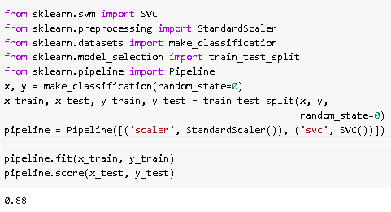
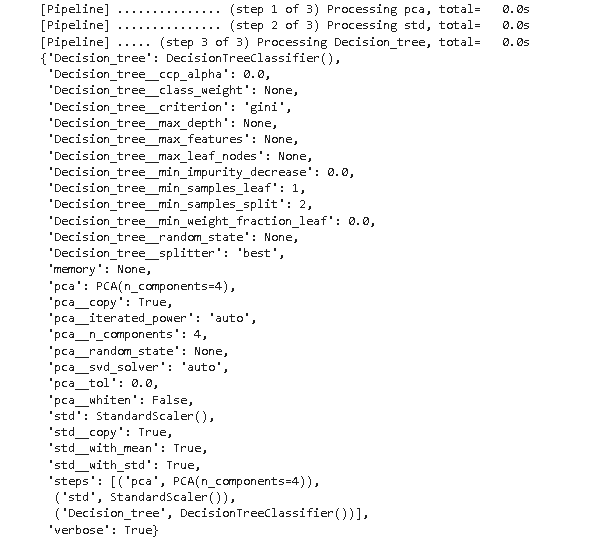
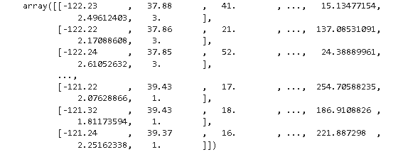
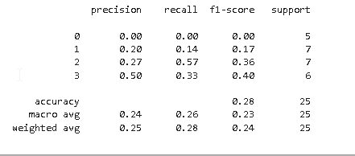
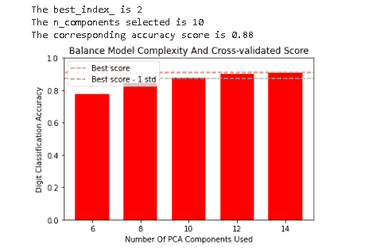
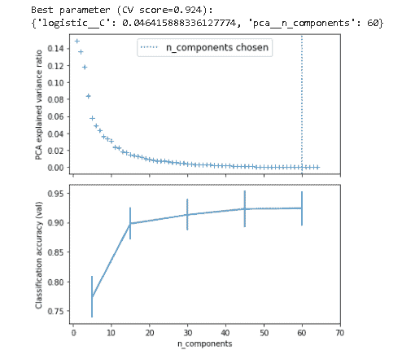
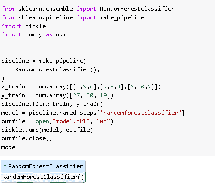
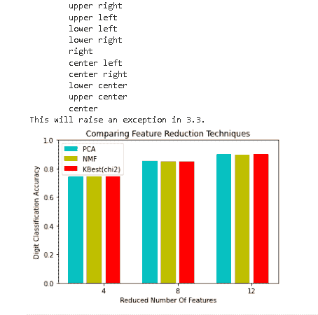
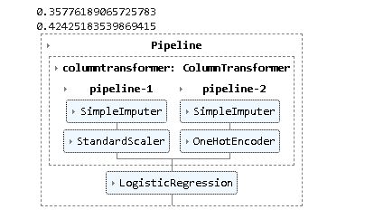

# Scikit 学习管道+示例

> 原文：<https://pythonguides.com/scikit-learn-pipeline/>

[](https://sharepointsky.teachable.com/p/python-and-machine-learning-training-course)

在这个 [Python 教程](https://pythonguides.com/learn-python/)中，我们将学习 **Scikit 学习管道如何在 Python 中工作**，我们还将涵盖与 Scikit 学习管道相关的不同示例。此外，我们将涵盖这些主题。

*   Scikit 学习管道
*   Scikit 学习管道示例
*   Scikit 学习管道自定义功能
*   Scikit 了解管道的优势和劣势
*   Scikit 学习管道功能选择
*   Scikit 学习管道交叉验证
*   Scikit 学习管道熊猫
*   Scikit 学习管道酸洗
*   Scikit 学习管道网格搜索
*   Scikit 学习管道 one-hot 编码

目录

[](#)

*   [Scikit 学习管道](#Scikit_learn_Pipeline "Scikit learn Pipeline")
*   [Scikit 学习管道示例](#Scikit_learn_Pipeline_example "Scikit learn Pipeline example")
*   [Scikit 学习管道自定义功能](#Scikit_learn_Pipeline_custom_function "Scikit learn Pipeline custom function")
*   [Scikit 学习管道的优势和劣势](#Scikit_learn_Pipeline_advantages_and_disadvantage "Scikit learn Pipeline advantages and disadvantage")
*   [Scikit 学习管道特征选择](#Scikit_learn_Pipeline_feature_selection "Scikit learn Pipeline feature selection ")
*   [Scikit 学习管道交叉验证](#Scikit_learn_Pipeline_cross_validation "Scikit learn Pipeline cross validation")
*   [Scikit 学习管道熊猫](#Scikit_learn_Pipeline_pandas "Scikit learn Pipeline pandas")
*   [Scikit 学习管道酸洗](#Scikit_learn_Pipeline_Pickle "Scikit learn Pipeline Pickle")
*   [Scikit 学习管道网格搜索](#Scikit_learn_Pipeline_grid_search "Scikit learn Pipeline grid search")
*   [Scikit 学习流水线 one-hot 编码](#Scikit_learn_Pipeline_one-hot_encoding "Scikit learn Pipeline one-hot encoding")

## Scikit 学习管道

在这一节中，我们将学习 **[Scikit 如何在 python 中学习](https://pythonguides.com/what-is-scikit-learn-in-python/)管道工作**。

管道被定义为收集数据和端到端组装的过程，该过程安排数据流，并且输出被形成为多个模型的集合。

**代码:**

在下面的代码中，我们将导入一些库，从中我们可以了解管道是如何工作的。

*   **x，y = make _ class ification(random _ state = 0)**用于进行分类。
*   **x_train，x_test，y_train，y_test = train_test_split(x，y，random_state=0)** 用于将数据集拆分为训练数据和测试数据。
*   **pipeline = Pipeline([('scaler '，StandardScaler())，(' svc '，SVC())])** 用作估计器，避免将测试集泄露到训练集中。
*   **pipeline.fit(x_train，y_train)** 用于拟合模型。
*   **pipeline.score(x_test，y_test)** 用于计算管道的得分。

```py
from sklearn.svm import SVC
from sklearn.preprocessing import StandardScaler
from sklearn.datasets import make_classification
from sklearn.model_selection import train_test_split
from sklearn.pipeline import Pipeline
x, y = make_classification(random_state=0)
x_train, x_test, y_train, y_test = train_test_split(x, y,
                                                    random_state=0)
pipeline = Pipeline([('scaler', StandardScaler()), ('svc', SVC())])

pipeline.fit(x_train, y_train)
pipeline.score(x_test, y_test)
```

**输出:**

在下面的输出中，我们可以看到管道模型的精度分数打印在屏幕上。



Scikit learn Pipeline

阅读: [Scikit 学习 KNN 教程](https://pythonguides.com/scikit-learn-knn-tutorial/)

## Scikit 学习管道示例

在本节中，我们将了解**Scikit 如何学习 python 中的管道示例**。

管道是端到端的加密数据，并且还安排数据流，并且输出形成为一组多个模型。

**代码:**

在下面的代码中，我们将导入一些库，借助例子来解释管道模型。

*   `iris = datasets . load _ iris()`用于将数据导入 sklearn 进行虹膜分类。
*   **x_train，x_test，y_train，y_test = train_test_split(x，y，test_size = 0.25)** 用于将数据集拆分为训练数据和测试数据。
*   **pipeline = Pipeline([('pca '，PCA(n_components = 4))，(' std '，StandardScaler())，(' Decision_tree '，Decision tree classifier()]，verbose = True)** 用于制作管道。
*   **pipeline.fit(x_train，y_train)** 用于拟合模型。
*   `pipeline.get_params()` 用于查看所有的超参数。

```py
from sklearn import datasets
from sklearn.model_selection import train_test_split
from sklearn.preprocessing import StandardScaler
from sklearn.decomposition import PCA
from sklearn.tree import DecisionTreeClassifier

iris = datasets.load_iris()
x = iris.data
y = iris.target

x_train, x_test, y_train, y_test = train_test_split(x, y, test_size = 0.25)

from sklearn.pipeline import Pipeline
pipeline = Pipeline([('pca', PCA(n_components = 4)), ('std', StandardScaler()), ('Decision_tree', DecisionTreeClassifier())], verbose = True)

pipeline.fit(x_train, y_train)

# to see all the hyper parameters
pipeline.get_params()
```

**输出:**

运行上面的代码后，我们得到下面的输出，其中我们可以看到所有的超参数都显示在屏幕上，这些参数是在管道中传递的类中设置的。



scikit learn pipeline example

阅读: [Scikit 学习情绪分析](https://pythonguides.com/scikit-learn-sentiment-analysis/)

## Scikit 学习管道自定义功能

在本节中，我们将了解**scikit 如何学习 python 中的管道自定义函数**。

Scikit learn 自定义函数用于返回二维数组的值或者也用于删除离群值。

**代码:**

在下面的代码中，我们将导入一些库，从中我们可以解释管道自定义函数。

*   **zip file _ path = OS . path . join(our _ path，" housing.tgz")** 用于设置 zip 文件的路径。
*   **url lib . request . URL retrieve(our _ data _ URL，zipfile_path)** 用于从 URL 获取文件。
*   **our file _ path = OS . path . join(our _ path，" housing.csv")** 用于设置 csv 文件路径。
*   `return PDS . read _ CSV(our file _ path)`用于读取熊猫文件。
*   `imputr = simple imputr(strategy = " median ")`用于计算每列的中间值。
*   **our dataset _ num = our _ dataset . drop(" ocean _ proximity "，axis=1)** 用于移除海洋邻近度。
*   `inputr . fit(our dataset _ num)`用于拟合模型。
*   **our _ text _ cats = our _ dataset[[' ocean _ proximity ']]**用于选择文本属性。
*   **rooms_per_household = x[:，rooms] / x[:，household]** 用于通过划分适当的属性得到三个额外的属性。

```py
import os
import tarfile
from six.moves import urllib

OURROOT_URL = "https://raw.githubusercontent.com/ageron/handson-ml/master/"
OURPATH = "datasets/housing"
OURDATA_URL = OURROOT_URL + OURPATH + "/housing.tgz"

def get_data(our_data_url=OURDATA_URL, our_path=OURPATH):
      if not os.path.isdir(our_path):
            os.makedirs(our_path)

      zipfile_path = os.path.join(our_path, "housing.tgz")

      urllib.request.urlretrieve(our_data_url, zipfile_path)
      ourzip_file = tarfile.open(zipfile_path)
      ourzip_file.extractall(path=our_path)
      ourzip_file.close()

get_data()

import pandas as pds

def loadour_data(our_path=OUR_PATH):
    ourfile_path = os.path.join(our_path, "housing.csv")

    return pds.read_csv(ourfile_path)

ourdataset = load_our_data()
ourdataset.head()
from sklearn.impute import SimpleImputer

imputer = SimpleImputer(strategy="median")

ourdataset_num = our_dataset.drop("ocean_proximity", axis=1)

imputer.fit(ourdataset_num)
**#transforming using the learnedparameters**
x = imputer.transform(ourdataset_num)
**#setting the transformed dataset to a DataFrame**
ourdataset_numeric = pds.DataFrame(x, columns=ourdataset_num.columns)
from sklearn.preprocessing import OrdinalEncoder

our_text_cats = our_dataset[['ocean_proximity']]
our_encoder = OrdinalEncoder()
**#transforming it**
our_encoded_dataset = our_encoder.fit_transform(our_text_cats)
import numpy as num
from sklearn.base import BaseEstimator, TransformerMixin
**#initialising column numbers**
rooms,  bedrooms, population, household = 4,5,6,7

class CustomTransformer(BaseEstimator, TransformerMixin):
    **#the constructor**
    def __init__(self, add_bedrooms_per_room = True):
        self.add_bedrooms_per_room = add_bedrooms_per_room
   ** #estimator method**
    def fit(self, x, y = None):
        return self
   ** #transfprmation**
    def transform(self, x, y = None):

        rooms_per_household = x[:, rooms] / x[:, household]
        population_per_household = x[:, population] / x[:, household]
        if self.add_bedrooms_per_room:
            bedrooms_per_room = x[:, bedrooms] / x[:, rooms]
            return num.c_[x, rooms_per_household, population_per_household, bedrooms_per_room]
        else:
            return num.c_[x, rooms_per_household, population_per_household]

attrib_adder = CustomTransformer()
our_extra_attributes = attrib_adder.transform(our_dataset.values)
from sklearn.pipeline import Pipeline
from sklearn.compose import ColumnTransformer
**#the numeric attributes transformation pipeline**
numericpipeline = Pipeline([
        ('imputer', SimpleImputer(strategy="median")),
        ('attribs_adder', CustomTransformer()),
    ])
numericattributes = list(our_dataset_numeric)
**#the textual transformation pipeline**
text_attribs = ["ocean_proximity"]
#setting the order of the two pipelines
our_full_pipeline = ColumnTransformer([
        ("numeric", numericpipeline, numericattributes),
        ("text", OrdinalEncoder(), text_attribs),
    ])
our_dataset_prepared = our_full_pipeline.fit_transform(our_dataset)
our_dataset_prepared
```

**输出:**

在下面的输出中，我们可以看到管道自定义函数返回值的二维数组。



scikit learn pipeline custom function

阅读: [Scikit 学习梯度下降](https://pythonguides.com/scikit-learn-gradient-descent/)

## Scikit 学习管道的优势和劣势

在本节中，我们将学习 Python 中的 **scikit learn pipeline 优缺点**。

**Scikit 学习管道的优势**

sci kit learn pipeline 是一个工具，它使我们的工作变得非常容易，我们可以很快理解所有事情。

1.  它应用步骤的实现和顺序。
2.  它可以收集数据和收集数据的过程。数据可以是实时的，也可以是各种来源的集合数据。
3.  它可以支持松弛通知
4.  它可以提供分布式计算选项。

**sci kit 学习管道的缺点**

1.  它不支持自动管道选项。
2.  它没有设计成在不使用数据库的情况下在相关任务之间传递数据。

阅读: [Scikit 学习遗传算法](https://pythonguides.com/scikit-learn-genetic-algorithm/)

## Scikit 学管道特征选择

在本节中，我们将学习**scikit 如何在 python 中学习管道特性选择**。

特征选择被定义为选择特征或重复选择管线特征的方法。

**代码:**

在下面的代码中，我们将导入一些库，从中我们可以选择管道的特征。

*   **x，y = make_classification()** 用于进行分类。
*   **x_train，x_test，y_train，y_test = train_test_split(x，y，random_state=42)** 用于将数据集拆分为训练和测试数据。
*   **ANOVA filter = selectk best(f _ classif，k=5)** 用于选择最佳特征。
*   **ANOVA _ SVM = make _ pipeline(ANOVA _ filter，classifier)** 用于制作管道。
*   **anova_svm.fit(x_train，y_train)** 用于拟合模型。
*   **打印(classification_report(y_test，y_pred))** 用于打印分类报告。

```py
from sklearn.datasets import make_classification
from sklearn.model_selection import train_test_split

x, y = make_classification(
    n_features=22,
    n_informative=5,
    n_redundant=0,
    n_classes=4,
    n_clusters_per_class=4,
    random_state=44,
)
x_train, x_test, y_train, y_test = train_test_split(x, y, random_state=42)
from sklearn.feature_selection import SelectKBest, f_classif
from sklearn.pipeline import make_pipeline
from sklearn.svm import LinearSVC

anovafilter = SelectKBest(f_classif, k=5)
classifier = LinearSVC()
anova_svm = make_pipeline(anova_filter, classifier)
anova_svm.fit(x_train, y_train)
from sklearn.metrics import classification_report

y_pred = anova_svm.predict(x_test)
print(classification_report(y_test, y_pred))
```

**输出:**

运行上面的代码后，我们得到下面的输出，我们可以看到屏幕上显示了选择功能。



scikit learn pipeline feature selection

阅读: [Scikit 学习分类教程](https://pythonguides.com/scikit-learn-classification/)

## Scikit 学习管道交叉验证

在本节中，我们将学习**Scikit 如何在 python 中学习管道交叉验证**。

Scikit learn pipeline 交叉验证技术被定义为评估静态模型结果的过程，该结果将扩展到看不见的数据。

**代码:**

在下面的代码中，我们将导入一些库，从中我们可以解释管道交叉验证模型。

*   **best score _ idx = num . arg max(cv _ result[" mean _ test _ score "])**用于计算最佳得分。
*   `threshold = lower _ bound(cv _ result)`用于计算下限模型的阈值。
*   **best _ idx = candidate _ idx[cv _ result[" param _ reduce _ dim _ _ n _ components "]**用于计算交叉验证的结果。
*   **param _ grid = { " reduce _ dim _ _ n _ components ":[6，8，10，12，14]}** 用于计算参数网格。
*   **x，y = load _ digits(return _ X _ y = True)**用于加载数字。
*   **plot.bar(n_components，test_scores，width=1.4，color="r")** 用于绘制条形。
*   **plot.title("平衡模型复杂度和交叉验证分数")**用于绘制图形的标题。
*   **print(" best _ index _ is % d " % best _ index _)**用于在屏幕上绘制最佳索引网格。

```py
import numpy as num
import matplotlib.pyplot as plot

from sklearn.datasets import load_digits
from sklearn.decomposition import PCA
from sklearn.model_selection import GridSearchCV
from sklearn.pipeline import Pipeline
from sklearn.svm import LinearSVC

def lower_bound(cv_result):

    bestscore_idx = num.argmax(cv_result["mean_test_score"])

    return (
        cv_result["mean_test_score"][bestscore_idx]
        - cv_result["std_test_score"][bestscore_idx]
    )

def best_low_complexity(cv_result):

    threshold = lower_bound(cv_result)
    candidate_idx = num.flatnonzero(cv_result["mean_test_score"] >= threshold)
    best_idx = candidate_idx[
        cv_result["param_reduce_dim__n_components"][candidate_idx].argmin()
    ]
    return best_idx

pipeline = Pipeline(
    [
        ("reduce_dim", PCA(random_state=42)),
        ("classify", LinearSVC(random_state=42, C=0.01)),
    ]
)

param_grid = {"reduce_dim__n_components": [6, 8, 10, 12, 14]}

grid = GridSearchCV(
    pipeline,
    cv=10,
    n_jobs=1,
    param_grid=param_grid,
    scoring="accuracy",
    refit=best_low_complexity,
)
x, y = load_digits(return_X_y=True)
grid.fit(X, y)

n_components = grid.cv_results_["param_reduce_dim__n_components"]
test_scores = grid.cv_results_["mean_test_score"]

plot.figure()
plot.bar(n_components, test_scores, width=1.4, color="r")

lower = lower_bound(grid.cv_results_)
plot.axhline(np.max(test_scores), linestyle="--", color="y", label="Best score")
plot.axhline(lower, linestyle="--", color=".6", label="Best score - 1 std")

plot.title("Balance Model Complexity And Cross-validated Score")
plot.xlabel("Number Of PCA Components Used")
plot.ylabel("Digit Classification Accuracy")
plot.xticks(n_components.tolist())
plot.ylim((0, 1.0))
plot.legend(loc="upper left")

best_index_ = grid.best_index_

print("The best_index_ is %d" % best_index_)
print("The n_components selected is %d" % n_components[best_index_])
print(
    "The corresponding accuracy score is %.2f"
    % grid.cv_results_["mean_test_score"][best_index_]
)
plot.show()
```

**输出:**

运行上述代码后，我们得到以下输出，其中我们可以看到管道交叉验证分数打印在屏幕上。



scikit learn pipeline cross-validation

阅读: [Scikit 学习超参数调整](https://pythonguides.com/scikit-learn-hyperparameter-tuning/)

## Scikit 学习管道熊猫

在这一节中，我们将学习**Scikit 如何在 python 中学习 pipeline pandas 的工作方式**。

Scikit learn pipeline pandas 被定义为一个允许我们将各种用户定义的函数串在一起以构建管道的过程。

**代码:**

在下面的代码中，我们将导入一些库，在熊猫的帮助下，我们可以从这些库中绘制管道。

*   `pca = pca()` 用于定义一个流水线来搜索 PCA 的最佳组合。
*   `scaler = StandardScaler()` 用于定义一个标准的 scaler 来归一化输入。
*   **pipeline = Pipeline(步骤=[("scaler "，scaler)，(" pca "，pca)，(" logistic "，logisticregr)])** 用于定义流水线的步骤。
*   **search grid = GridSearchCV(pipeline，param_grid，n_jobs=2)** 用于定义网格搜索。
*   **print("最佳参数(CV 分数= % 0.3f):" % search grid . Best _ score _)**用于定义最佳参数分数。
*   `pca.fit(x_digits)` 用于拟合模型。

```py
import numpy as num
import matplotlib.pyplot as plot
import pandas as pds

from sklearn import datasets
from sklearn.decomposition import PCA
from sklearn.linear_model import LogisticRegression
from sklearn.pipeline import Pipeline
from sklearn.model_selection import GridSearchCV
from sklearn.preprocessing import StandardScaler

pca = PCA()
scaler = StandardScaler()
logisticregr = LogisticRegression(max_iter=10000, tol=0.2)
pipeline = Pipeline(steps=[("scaler", scaler), ("pca", pca), ("logistic", logisticregr)])

x_digits, y_digits = datasets.load_digits(return_X_y=True)
param_grid = {
    "pca__n_components": [5, 15, 30, 45, 60],
    "logistic__C": np.logspace(-4, 4, 4),
}
searchgrid = GridSearchCV(pipeline, param_grid, n_jobs=2)
searchgrid.fit(x_digits, y_digits)
print("Best parameter (CV score=%0.3f):" % searchgrid.best_score_)
print(searchgrid.best_params_)
pca.fit(x_digits)

fig, (axis0, axis1) = plot.subplots(nrows=2, sharex=True, figsize=(6, 6))
axis0.plot(
    num.arange(1, pca.n_components_ + 1), pca.explained_variance_ratio_, "+", linewidth=2
)
axis0.set_ylabel("PCA explained variance ratio")

axis0.axvline(
    searchgrid.best_estimator_.named_steps["pca"].n_components,
    linestyle=":",
    label="n_components chosen",
)
axis0.legend(prop=dict(size=12))

**# For each number of components, find the best classifier results**
results = pds.DataFrame(searchgrid.cv_results_)
components_col = "param_pca__n_components"
best_classifications = results.groupby(components_col).apply(
    lambda g: g.nlargest(1, "mean_test_score")
)

best_classifications.plot(
    x=components_col, y="mean_test_score", yerr="std_test_score", legend=False, ax=axis1
)
axis1.set_ylabel("Classification accuracy (val)")
axis1.set_xlabel("n_components")

plot.xlim(-1, 70)

plot.tight_layout()
plot.show()
```

**输出:**

运行上面的代码后，我们得到下面的输出，其中我们可以看到管道是在 pandas 的帮助下绘制的。



scikit learn pipeline pandas

阅读: [Scikit 学习线性回归+例题](https://pythonguides.com/scikit-learn-linear-regression/)

## Scikit 学习管道酸洗

在这一节中，我们将了解**Scikit 如何在 python 中学习 pipeline pickle 的工作方式**。

Scikit 学习管道 pickle 被定义为一个定期保存文件的过程，或者我们可以说是序列化对象的方式。

**代码:**

在下面的代码中，我们将导入一些库，在 pickle 的帮助下，我们可以从这些库中序列化数据。

*   **x_train = num.array([[3，9，6]，[5，8，3]，[2，10，5]])** 用于创建一些数据。
*   **pipeline.fit(x_train，y_train)** 用于训练模型。
*   **model = pipeline . named _ steps[' randomforestclassifier ']**用于酸洗模型。

```py
from sklearn.ensemble import RandomForestClassifier
from sklearn.pipeline import make_pipeline
import pickle
import numpy as num

pipeline = make_pipeline(

    RandomForestClassifier(),
)

x_train = num.array([[3,9,6],[5,8,3],[2,10,5]])
y_train = num.array([27, 30, 19])

pipeline.fit(x_train, y_train)

model = pipeline.named_steps['randomforestclassifier']
outfile = open("model.pkl", "wb")
pickle.dump(model, outfile)
outfile.close()
model
```

**输出:**

运行上述代码后，我们得到以下输出，其中我们可以看到屏幕上显示了 Scikit 学习管道 pickle。



Scikit learn Pipeline Pickle

阅读: [Scikit 学习功能选择](https://pythonguides.com/scikit-learn-feature-selection/)

## Scikit 学习管道网格搜索

在本节中，我们将了解 Scikit learn pipeline grid search 如何在 python 中工作。

Scikit learn pipeline grid search 是一种定义超参数的操作，它告诉用户模型的准确率。

**代码:**

在下面的代码中，我们将导入一些库，从中我们可以计算模型的准确率。

*   **n_feature_options = [4，8，12]** 用于创建特征选项。
*   **grid = GridSearchCV(pipeline，n_jobs=1，param_grid=param_grid)** 用于创建网格搜索。
*   `mean _ scores = mean _ scores . max(axis = 0)`用于选择最佳 c 的得分
*   **plot.bar(bar_offsets + i，reducer_scores，label=label，color=COLORS[i])** 用于在图形上绘制条形。
*   **plot.title("比较特征缩减技术")**用于在图上绘制标题。

```py
 import numpy as num
import matplotlib.pyplot as plot
from sklearn.datasets import load_digits
from sklearn.model_selection import GridSearchCV
from sklearn.pipeline import Pipeline
from sklearn.svm import LinearSVC
from sklearn.decomposition import PCA, NMF
from sklearn.feature_selection import SelectKBest, chi2

pipeline = Pipeline(
    [
        **# the reduce_dim stage is populated by the param_grid**
        ("reduce_dim", "passthrough"),
        ("classify", LinearSVC(dual=False, max_iter=10000)),
    ]
)

n_feature_options = [4, 8, 12]
c_options = [1, 10, 100, 1000]
param_grid = [
    {
        "reduce_dim": [PCA(iterated_power=7), NMF()],
        "reduce_dim__n_components": n_feature_options,
        "classify__C": c_options,
    },
    {
        "reduce_dim": [SelectKBest(chi2)],
        "reduce_dim__k": n_feature_options,
        "classify__C": c_options,
    },
]
reducer_labels = ["PCA", "NMF", "KBest(chi2)"]

grid = GridSearchCV(pipeline, n_jobs=1, param_grid=param_grid)
x, y = load_digits(return_X_y=True)
grid.fit(x, y)

mean_scores = num.array(grid.cv_results_["mean_test_score"])

mean_scores = mean_scores.reshape(len(c_options), -1, len(n_feature_options))

mean_scores = mean_scores.max(axis=0)
bar_offsets = np.arange(len(n_feature_options)) * (len(reducer_labels) + 1) + 0.5

plot.figure()
COLORS = "cyr"
for i, (label, reducer_scores) in enumerate(zip(reducer_labels, mean_scores)):
    plot.bar(bar_offsets + i, reducer_scores, label=label, color=COLORS[i])

plot.title("Comparing Feature Reduction Techniques")
plot.xlabel("Reduced Number Of Features")
plot.xticks(bar_offsets + len(reducer_labels) / 2, n_feature_options)
plot.ylabel("Digit Classification Accuracy")
plot.ylim((0, 1))
plot.legend(loc="Upper Left")

plot.show()
```

**输出:**

在下面的输出中，我们可以看到屏幕上绘制了 scikit 学习管道网格搜索栏。



scikit learn pipeline grid search

阅读: [Scikit 学习岭回归](https://pythonguides.com/scikit-learn-ridge-regression/)

## Scikit 学习流水线 one-hot 编码

在本节中，我们将了解**Scikit 如何学习 python 中的管道一热编码工作**。

Scikit 学习管道 one-hot 编码被定义或表示分类变量。在这种情况下，对分类变量的需求被映射为整数值。

**代码:**

在下面的代码中，我们将导入一些库，从中我们可以进行一次性编码。

*   **y = range . poisson(lam = num . exp(x[:，5]) / 2)** 用于获取正的整数目标。
*   **x_train，x_test，y_train，y_test = train_test_split(x，y，random_state=range)** 用于将数据集拆分成测试数据或训练数据。
*   `set _ config(display = " diagram ")`用于配置数据。
*   **num _ proc = make _ pipeline(simple imputr(strategy = " median ")，StandardScaler())** 用于制作管道。

```py
import numpy as num
from sklearn.model_selection import train_test_split
from sklearn.linear_model import PoissonRegressor
from sklearn.ensemble import HistGradientBoostingRegressor

nsamples, nfeatures = 1000, 20
range = num.random.RandomState(0)
x = range.randn(nsamples, nfeatures)

y = range.poisson(lam=num.exp(x[:, 5]) / 2)
x_train, x_test, y_train, y_test = train_test_split(x, y, random_state=range)
glm = PoissonRegressor()
gbdt = HistGradientBoostingRegressor(loss="poisson", learning_rate=0.01)
glm.fit(x_train, y_train)
gbdt.fit(x_train, y_train)
print(glm.score(x_test, y_test))
print(gbdt.score(x_test, y_test))
from sklearn import set_config
from sklearn.pipeline import make_pipeline
from sklearn.preprocessing import OneHotEncoder, StandardScaler
from sklearn.impute import SimpleImputer
from sklearn.compose import make_column_transformer
from sklearn.linear_model import LogisticRegression

set_config(display="diagram")

num_proc = make_pipeline(SimpleImputer(strategy="median"), StandardScaler())

cat_proc = make_pipeline(
    SimpleImputer(strategy="constant", fill_value="missing"),
    OneHotEncoder(handle_unknown="ignore"),
)

preprocessor = make_column_transformer(
    (num_proc, ("feat1", "feat3")), (cat_proc, ("feat0", "feat2"))
)

classifier = make_pipeline(preprocessor, LogisticRegression())
classifier
```

**输出:**

运行上述代码后，我们得到以下输出，从中可以看到屏幕上完成了 scikit 学习管道 one-hot 编码。



scikit learn pipeline one-hot encoding

您可能还想阅读以下 Scikit 学习教程。

*   [Scikit 学习随机森林](https://pythonguides.com/scikit-learn-random-forest/)
*   [Scikit 学习隐马尔可夫模型](https://pythonguides.com/scikit-learn-hidden-markov-model/)
*   [Scikit 学习决策树](https://pythonguides.com/scikit-learn-decision-tree/)
*   [Scikit 学习分割数据](https://pythonguides.com/scikit-learn-split-data/)
*   [Scikit 学习层次聚类](https://pythonguides.com/scikit-learn-hierarchical-clustering/)

因此，在本教程中，我们讨论了 **Scikit 学习管道**,我们还涵盖了与其实现相关的不同示例。这是我们已经讨论过的例子列表。

*   Scikit 学习管道
*   Scikit 学习管道示例
*   Scikit 学习管道自定义功能
*   Scikit 了解管道的优势和劣势
*   Scikit 学习管道功能选择
*   Scikit 学习管道交叉验证
*   Scikit 学习管道熊猫
*   Scikit 学习管道酸洗
*   Scikit 学习管道网格搜索
*   Scikit 学习管道 one-hot 编码

[Bijay Kumar](https://pythonguides.com/author/fewlines4biju/)

Python 是美国最流行的语言之一。我从事 Python 工作已经有很长时间了，我在与 Tkinter、Pandas、NumPy、Turtle、Django、Matplotlib、Tensorflow、Scipy、Scikit-Learn 等各种库合作方面拥有专业知识。我有与美国、加拿大、英国、澳大利亚、新西兰等国家的各种客户合作的经验。查看我的个人资料。

[enjoysharepoint.com/](https://enjoysharepoint.com/)[](https://www.facebook.com/fewlines4biju "Facebook")[](https://www.linkedin.com/in/fewlines4biju/ "Linkedin")[](https://twitter.com/fewlines4biju "Twitter")