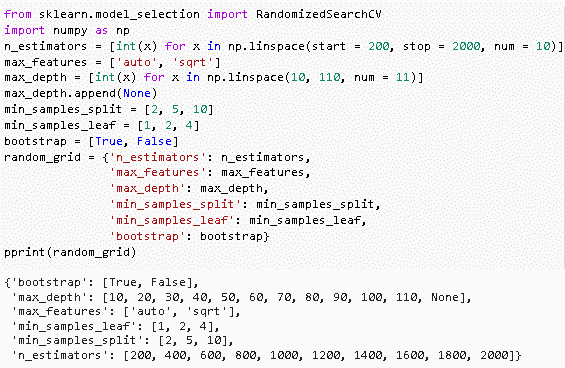
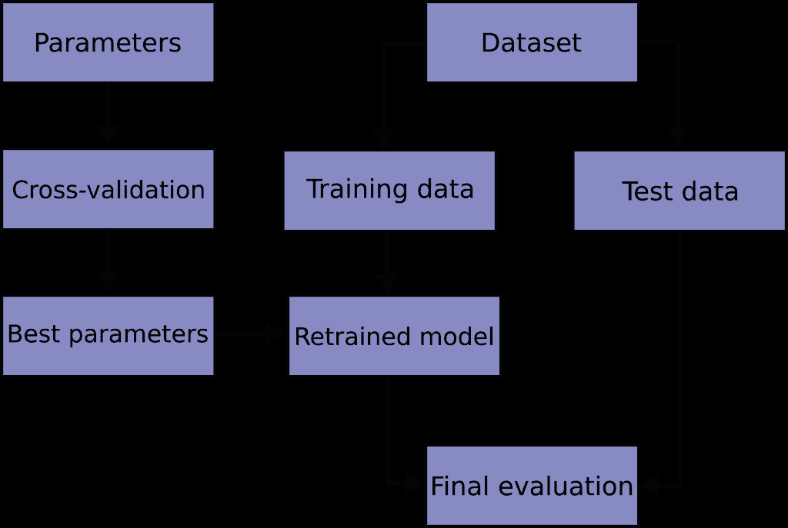

# Scikit 学习随机森林

> 原文：<https://pythonguides.com/scikit-learn-random-forest/>

[](https://sharepointsky.teachable.com/p/python-and-machine-learning-training-course)

在这个 [Python 教程](https://pythonguides.com/learn-python/)中，我们将学习**如何在 `Python` 中创建一个 scikit 学习随机森林**，我们还将涵盖与**随机森林**相关的不同示例。我们将讨论这些话题。

*   Scikit 学习随机森林
*   Scikit 学习随机森林示例
*   Scikit 学习随机森林回归
*   Scikit 学习随机森林超参数调整
*   Scikit 学习随机森林特征重要性
*   Scikit 学习随机森林分类变量
*   Scikit 学习随机森林交叉验证
*   Scikit 学习随机森林可视化

目录

[](#)

*   [Scikit 学习随机森林](#Scikit_learn_random_forest "Scikit learn random forest")
*   [Scikit 学习随机森林示例](#Scikit_learn_random_forest_example "Scikit learn random forest example")
*   [Scikit 学习随机森林回归](#Scikit_learn_random_forest_regression "Scikit learn random forest regression")
*   [Scikit 学习随机森林超参数调整](#Scikit_learn_random_forest_hyperparameter_tunning "Scikit learn random forest hyperparameter tunning")
*   [Scikit 学习随机森林特征重要性](#Scikit_learn_random_forest_feature_importance "Scikit learn random forest feature importance")
*   [Scikit 学习随机森林分类变量](#Scikit_learn_random_forest_categorical_variable "Scikit learn random forest categorical variable")
*   [Scikit 学习随机森林交叉验证](#Scikit_learn_random_forest_cross-validation "Scikit learn random forest cross-validation")
*   [Scikit 学习随机森林可视化](#Scikit_learn_random_forest_visualization "Scikit learn random forest visualization")

## Scikit 学习随机森林

在这一节中，我们将学习如何用 python 让 scikit 学习随机森林。

*   随机森林是一种受监督的机器学习模型，用于解决回归或分类问题。
*   它是一种结合许多分类器的技术，以简单的方式解决困难或复杂的问题。
*   它基于决策树的预测生成结果，该决策树通过取许多树的输出的平均值来进行预测。
*   它也有一个限制，即减少数据集的过拟合，提高精度。


scikit learn Random Forest

另外，检查: [Scikit-learn 逻辑回归](https://pythonguides.com/scikit-learn-logistic-regression/)

## Scikit 学习随机森林示例

在本节中，我们将学习**如何创建一个 [scikit 学习](https://pythonguides.com/what-is-scikit-learn-in-python/)python 中的随机森林示例**。

*   随机森林是一种受监督的机器学习模型，用于分类、回归和所有其他使用决策树的任务。
*   随机森林产生一组随机选择训练集子集的决策树。

**代码:**

在下面的代码中，我们将从 sklearn 导入数据集，并创建一个随机森林分类器。

*   `iris = datasets . load _ iris()`用于加载 iris 数据集。
*   **X，y = datasets . load _ iris(return _ X _ y = True)**用于将数据集分为训练数据集和测试数据集两部分。
*   `from sk learn . model _ selection import train _ test _ split`用于切割随机训练或测试子集中的数组。
*   **X_train，X_test，y_train，y_test = train_test_split(X，y，test_size = 0.30)** 这里有 70%的训练数据集和 30%的测试数据集。

```py
from sklearn import datasets 

iris = datasets.load_iris()  
print(iris.target_names)

print(iris.feature_names)

X, y = datasets.load_iris( return_X_y = True)

from sklearn.model_selection import train_test_split

X_train, X_test, y_train, y_test = train_test_split(X, y, test_size = 0.30)
```

运行上述代码后，我们得到以下输出，其中我们可以看到数据集的特征显示在屏幕上。


scikit learn a random forest dataset

`print(data.head())` 用于在屏幕上打印数据集的前五行。

```py
from sklearn.ensemble import RandomForestClassifier
import pandas as pd
data = pd.DataFrame({'sepallength' : iris.data[:,0],'sepalwidth' : iris.data[:,1], 'petallength' : iris.data[:,2], 'petalwidth' : iris.data[:,3],'species' : iris.target})
print(data.head())
```

运行上面的代码后，我们得到下面的输出，我们可以看到前五行打印在屏幕上。


scikit learn random forest import dataset

*   `classifier = RandomForestClassifier(n _ estimators = 100)`用于创建随机森林分类器。
*   **classifier.fit(X_train，y_train)** 用于拟合函数，使用训练集训练模型。
*   `y _ pred = classifier . predict(X _ test)`用于对测试数据集进行预测。
*   **从 sklearn 导入指标**用于从指标中找出准确度或误差。
*   **print("模型精度: "，metrics.accuracy_score(y_test，y_pred))** 用于打印计算后的模型精度。

```py
classifier = RandomForestClassifier(n_estimators = 100) 

classifier.fit(X_train, y_train)

y_pred = classifier.predict(X_test)

from sklearn import metrics 
print()

print("Accuracy of the model: ", metrics.accuracy_score(y_test, y_pred))
```

在这张图片中，我们可以看到随机森林模型的准确性。


scikit learn random forest accuracy

阅读:[Scikit-learn Vs tensor flow–详细对比](https://pythonguides.com/scikit-learn-vs-tensorflow/)

## Scikit 学习随机森林回归

在本节中，我们将学习 python 中的`scikit learn random forest regression`。

随机森林是一种受监督的机器学习算法，它是一种合并许多分类器以提供困难问题解决方案的技术，类似于回归方法。

**代码:**

在下面的代码中，我们将导入 sklearn 库，从中我们可以创建一个随机森林回归。

*   **x，y = make_regression(n_features=4，n _ informative = 2，random_state=0，shuffle=False)** 用于进行随机森林回归。
*   **print(regression . predict([[0，0，0，0]])**用于预测回归。

```py
from sklearn.ensemble import RandomForestRegressor
from sklearn.datasets import make_regression
x, y = make_regression(n_features=4, n_informative=2,
                        random_state=0, shuffle=False)
regression = RandomForestRegressor(max_depth=2, random_state=0)
regression.fit(x, y)
RandomForestRegressor(...)
print(regression.predict([[0, 0, 0, 0]]))
```

**输出:**

运行上述代码后，我们得到以下输出，其中我们可以看到随机森林回归预测。


scikit learn random forest regression

阅读: [Scikit 学习决策树](https://pythonguides.com/scikit-learn-decision-tree/)

## Scikit 学习随机森林超参数调整

在本节中，我们将了解**如何让 scikit 学习 python 中的随机森林超参数调整**。

随机森林超参数调整涉及森林中的若干决策树和每棵树在被分割成不同部分时所考虑的若干特征。

**代码:**

在下面的代码中，我们将从 `sklearn.esemble` 导入 `RandomForestRegressor` ，并且从 `print` 导入`print`。

**print(' Parameters currently in use:\ n ')**用于打印当前森林使用的当前参数。

```py
from sklearn.ensemble import RandomForestRegressor
rf = RandomForestRegressor(random_state = 42)
from pprint import pprint

print('Parameters currently in use:\n')
pprint(rf.get_params())
```

**输出:**

运行上面的代码后，我们得到下面的输出，我们可以看到当前的参数被打印在屏幕上。


Random forest hyperparameter tunning current parameter

*   **n _ estimators =[int(x)for x in NP . Lin space(start = 200，stop = 2000，num = 10)]** 它解释了随机森林中树的数量。
*   **max_features = ['auto '，' sqrt']** 这是每次分割时要考虑的特征数量。
*   **max _ depth =[int(x)for x in NP . Lin space(10，110，num = 11)]** 是树中的最大层数。
*   **min_samples_split = [2，5，10]** 是分裂一个节点所需的最小样本数。
*   **min_samples_leaf = [1，2，4]** 是每个叶节点所需的最小样本数。

```py
from sklearn.model_selection import RandomizedSearchCV
import numpy as np
n_estimators = [int(x) for x in np.linspace(start = 200, stop = 2000, num = 10)]

max_features = ['auto', 'sqrt']

max_depth = [int(x) for x in np.linspace(10, 110, num = 11)]
max_depth.append(None)

min_samples_split = [2, 5, 10]

min_samples_leaf = [1, 2, 4]

bootstrap = [True, False]

random_grid = {'n_estimators': n_estimators,
               'max_features': max_features,
               'max_depth': max_depth,
               'min_samples_split': min_samples_split,
               'min_samples_leaf': min_samples_leaf,
               'bootstrap': bootstrap}
pprint(random_grid)
```

运行上述代码后，我们得到以下输出，其中我们可以看到屏幕上创建了一个 scikit learn 超参数调整。



scikit learn random forest hyperparameter tunning

阅读: [Scikit 学习准确度 _ 分数](https://pythonguides.com/scikit-learn-accuracy-score/)

## Scikit 学习随机森林特征重要性

在本节中，我们将了解如何用 python 创建`sci kit learn random forest feature importance`。

*   特征重要性是描述整个过程的最佳方式。它描述了哪些特性是相关的，哪些是不相关的。
*   它还有助于以更好的方式理解所解决的问题，并且有时通过使用特征选择来进行模型改进。

**代码:**

在下面的代码中，我们将导入一些用于创建随机森林的库，并借助特性重要性来描述特性。

*   **classifier.predict([[3，3，2，2]])** 用于预测是哪种类型的花。
*   `classifier = RandomForestClassifier(n _ estimators = 100)`用于创建随机森林分类器。
*   **classifier.fit(X_train，y_train)** 用于训练集对模型进行训练。
*   feature_imp = **pd。series(classifier . feature _ importances _，index=iris.feature_names)。sort _ values(ascending = False)**使用特征重要性变量来描述模型的特征。

```py
from sklearn import datasets 

iris = datasets.load_iris()  
print(iris.target_names)

print(iris.feature_names)
X, y = datasets.load_iris( return_X_y = True)

from sklearn.model_selection import train_test_split
X_train, X_test, y_train, y_test = train_test_split(X, y, test_size = 0.30)

from sklearn.ensemble import RandomForestClassifier
import pandas as pd
data = pd.DataFrame({'sepallength' : iris.data[:,0],'sepalwidth' : iris.data[:,1], 'petallength' : iris.data[:,2], 'petalwidth' : iris.data[:,3],'species' : iris.target})
print(data.head())
classifier = RandomForestClassifier(n_estimators = 100) 

classifier.fit(X_train, y_train)

y_pred = classifier.predict(X_test)

from sklearn import metrics 
print()

print("Accuracy of the model: ", metrics.accuracy_score(y_test, y_pred))

classifier.predict([[3, 3, 2, 2]])

from sklearn.ensemble import RandomForestClassifier

classifier = RandomForestClassifier(n_estimators = 100)

classifier.fit(X_train, y_train)

import pandas as pd
feature_imp = pd.Series(classifier.feature_importances_, index = iris.feature_names).sort_values(ascending = False)
feature_imp
```

**输出:**

运行上面的代码后，我们得到了下面的输出，其中我们可以看到模型的特性是由特性重要性描述的。


scikit learn random forest feature importance

阅读: [Scikit 学习隐马尔可夫模型](https://pythonguides.com/scikit-learn-hidden-markov-model/)

## Scikit 学习随机森林分类变量

在本节中，我们将了解如何让 **scikit 学习随机森林分类变量。**

*   分类变量是指我们可以将变量分配到特定组的变量。
*   分类变量只能取两个值作为二进制值，而二进制值只首选 0 和 1。

**代码:**

在下面的代码中，我们**将导入熊猫作为 pd，**并从中读取数据。

```py
import pandas as pd
df = pd.read_csv('bank.csv')
df.head()
```

**输出:**

运行上面的代码后，我们得到下面的输出，我们可以看到数据集的前五行显示在屏幕上。


scikit learn random forest categorical variable data

在下面的代码中，我们打印我们将变量分配给特定组的类别中的变量。

```py
s = (df.dtypes == 'object')
object_cols = list(s[s].index)
print("Categorical variables:")
print(object_cols)
```

运行上面的代码后，我们得到下面的输出，其中我们可以看到分类变量的 object 列显示在屏幕上。


scikit learn random forest categorical variable object column

这里我们可以看到变量被分配给了一个特定的组。

```py
features = df[['Sex','Housing','Saving accounts']]
features.head()
```


scikit learn random forest categorical variable

阅读: [Scikit 学习功能选择](https://pythonguides.com/scikit-learn-feature-selection/)

## Scikit 学习随机森林交叉验证

在本节中，我们将学习 python 中的 **scikit learn random forest 交叉验证**。

*   交叉验证是用于评估模型的性能或准确性的过程。它还用于防止模型在预测模型中过度拟合。
*   交叉验证我们可以对数据进行固定次数的折叠，并对数据进行分析。



scikit-learn.org

阅读: [Scikit 学习线性回归](https://pythonguides.com/scikit-learn-linear-regression/)

## Scikit 学习随机森林可视化

在这一节中，我们将学习**如何让 scikit 学习 python 中的随机森林` `虚拟化**。

*   正如我们所知，随机森林在几个决策树上工作。绘制它们，看看模型如何预测目标变量的值。
*   可视化是一个随机挑选 2 或 3 棵树的过程，它给模型一个很好的直觉。

**代码:**

在下面的代码中，我们将导入库，从中我们可以进行随机的森林可视化。

*   `model = RandomForestClassifier(n _ estimators = 10)`用于制作模型，也可以使用单决策树。
*   **estimator = model . estimators _[5]**用于提取单棵树。
*   **调用(['dot '，'-Tpng '，' tree.dot '，'-o '，' tree.png '，'-Gdpi=600'])** 用于使用系统命令转换成 png。

```py
from sklearn.datasets import load_iris
iris = load_iris()

from sklearn.ensemble import RandomForestClassifier
model = RandomForestClassifier(n_estimators=10)

model.fit(iris.data, iris.target)

estimator = model.estimators_[5]

from sklearn.tree import export_graphviz

export_graphviz(estimator, out_file='tree.dot', 
                feature_names = iris.feature_names,
                class_names = iris.target_names,
                rounded = True, proportion = False, 
                precision = 2, filled = True)

from subprocess import call
call(['dot', '-Tpng', 'tree.dot', '-o', 'tree.png', '-Gdpi=600'])

from IPython.display import Image
Image(filename = 'tree.png')
```

**输出:**

运行上面的代码后，我们得到下面的输出，其中我们可以看到 scikit learn random forest 可视化是在屏幕上完成的。


scikit learn random forest visualization

您可能还想阅读以下 scikit 学习教程。

*   [Scikit 学习 hidden _ layer _ size](https://pythonguides.com/scikit-learn-hidden_layer_sizes/)
*   [Scikit 学习情绪分析](https://pythonguides.com/scikit-learn-sentiment-analysis/)

因此，在本教程中，我们讨论了 `python` 中的 `Scikit learn random forest` ，并且我们还涵盖了与其实现相关的不同示例。这是我们已经讨论过的例子列表。

*   Scikit 学习随机森林
*   Scikit 学习随机森林示例
*   Scikit 学习随机森林回归
*   scikit 学习随机森林超参数调整
*   Scikit 学习随机森林特征重要性
*   Scikit 学习随机森林分类变量
*   Scikit 学习随机森林交叉验证
*   Scikit 学习随机森林可视化

[Bijay Kumar](https://pythonguides.com/author/fewlines4biju/)

Python 是美国最流行的语言之一。我从事 Python 工作已经有很长时间了，我在与 Tkinter、Pandas、NumPy、Turtle、Django、Matplotlib、Tensorflow、Scipy、Scikit-Learn 等各种库合作方面拥有专业知识。我有与美国、加拿大、英国、澳大利亚、新西兰等国家的各种客户合作的经验。查看我的个人资料。

[enjoysharepoint.com/](https://enjoysharepoint.com/)[](https://www.facebook.com/fewlines4biju "Facebook")[](https://www.linkedin.com/in/fewlines4biju/ "Linkedin")[](https://twitter.com/fewlines4biju "Twitter")