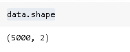
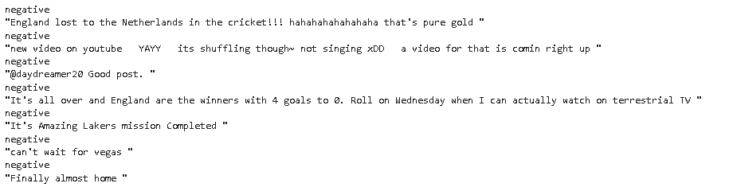

# Scikit 学习情绪分析

> 原文：<https://pythonguides.com/scikit-learn-sentiment-analysis/>

[](https://sharepointsky.teachable.com/p/python-and-machine-learning-training-course)

在这个 [Python 教程](https://pythonguides.com/learn-python/)中，我们将学习**Scikit learn 情绪分析如何在 Python 中工作**，我们将涵盖与情绪分析相关的不同示例。此外，我们将涵盖这些主题。

*   Scikit 学习情绪分析
*   Scikit 学习情绪分类
*   Scikit 学习情绪逻辑回归

目录

[](#)

*   [Scikit 学习情绪分析](#Scikit_learn_sentiment_analysis "Scikit learn sentiment analysis")
*   [Scikit 学习情绪分类](#Scikit_learn_sentiment_classification "Scikit learn sentiment classification")
*   [Scikit 学习情绪逻辑回归](#Scikit_learn_sentiment_logistic_regression "Scikit learn sentiment logistic regression")

## Scikit 学习情绪分析

本节我们将学习**如何 ****[Scikit 学习](https://pythonguides.com/what-is-scikit-learn-in-python/)****python 中的情感分析作品**。

*   **情感分析**被定义为自然语言处理的过程和最重要的部分。
*   因为文本数据不能被算法处理。
*   当文本数据被转换成数字数据时，它可以被算法直接处理。

**代码:**

在下面的代码中，我们将导入一些库，从中我们可以进行情感分析。

*   `data = PD . read _ CSV(" test . CSV ")`用于读取测试文件。
*   `data.head()` 用于打印数据集的前五行。

```py
import pandas as pds
import numpy as num
import matplotlib.pyplot as plot
import seaborn as sb 
from sklearn.feature_extraction.text import CountVectorizer
count=CountVectorizer()
data=pd.read_csv("Test.csv")
data.head()
```

运行上面的代码后，我们得到了下面的输出，其中我们可以看到数据集的前五行。


scikit learn sentiment analysis count vectorizer

`data.shape` 函数用于打印数据集的形状。

```py
data.shape
```



scikit learn sentiment dataset shape

*   **fig=plt.figure(figsize=(5，5))** 是在屏幕上绘制图形。
*   **clrs=["green "，' red']** 用来给图形颜色。
*   **positive = data[data[' label ']= = 1]**用于给图形加正标签。
*   **负数=data[data['label']==0]** 用于给图形加负数标签。
*   **piechart=plot.pie(cv，labels=["Positive "，" Negative"]，autopct ='%1.1f%% '，shadow = True，colors = clrs，startangle = 45，explode=(0，0.1))** 用于在绿色上绘制饼图。
*   dataframe=[“你好，主人，不要把世界扛在你的肩上，因为你知道，通过使他的世界变得更冷来装酷的人是傻瓜。
*   `bag view = count . fit _ transform(data frame)`用于将文本数据转换为数值数据。
*   `print(count . get _ feature _ names())`用于在屏幕上打印特征名称。

```py
fig=plt.figure(figsize=(5,5))
clrs=["green",'red']
positive=data[data['label']==1]
negative=data[data['label']==0]
cv=[positive['label'].count(),negative['label'].count()]
piechart=plot.pie(cv,labels=["Positive","Negative"],
                 autopct ='%1.1f%%', 
                 shadow = True,
                 colors = clrs,
                 startangle = 45,
                 explode=(0, 0.1))
dataframe=["Hello master, Dont carry the world upon your shoulders for well you know that its a fool who plays it cool by making his world a little colder Na-na-na,a, na"]
bagview=count.fit_transform(dataframe)
print(count.get_feature_names())
print(bagview.toarray())
```

运行上面的代码后，我们得到了下面的输出，可以看到文本数据被转换成了数字数据。此外，还可以看到屏幕上显示的带有正面数据和负面数据的饼图。


scikit learn sentiment analysis

阅读: [Scikit 学习决策树](https://pythonguides.com/scikit-learn-decision-tree/)

## Scikit 学习情绪分类

在本节中，我们将了解**scikit 如何在 python 中学习情感分类**。

*   Scikit learn 情感分类是一个自动捕捉文本丰硕状态的过程。
*   情感分类分析是自然语言处理中的一个重要领域。
*   它很容易分析，并广泛应用于客户评论。它还可以看到客户可以给出积极的评论或消极的评论。

**代码:**

在下面的代码中，我们将导入一些库，从中我们可以估计情感分类分析。

*   **positive _ folder = f ' { folder }/pos '**用于获取正面评论。
*   **negative _ folder = f { folder }/neg '**用于获取负面评论。
*   `return` :用于输入文件夹中所有文件的列表。
*   **fld:** 用作正面或负面评论文件夹。
*   **转正文件=获取转正文件(转正文件夹)**用于获取转正审核文件夹。
*   **负面 _ 文件=获取 _ 文件(负面 _ 文件夹)**用于获取负面评论文件夹。
*   **textfile = list(map(lambda txt:re sub((<br \ s */？> )+'，' '，txt)，text)** 用于制动行空格用 break。
*   **IMDB _ train = create _ data _ frame(' aclImdb/train ')**用于导入列车数据帧。
*   **IMDB _ test = create _ data _ frame(' aclImdb/test ')**用于创建测试数据帧。
*   **从 joblib 导入转储，load** 用于保存和加载 sklearn。
*   **从 scipy.sparse 导入 save_npz，load_npz** 用于保存和加载稀疏矩阵。
*   **unigram _ vector izers . fit(IMDB _ train[' text ']。【T1 值)】用于计数单字。**
*   **bigram _ vectorizers = count vectorizer(ngram _ range =(1，2))** 用于对 bigram 进行计数。
*   `x _ train _ bigram _ TF _ IDF = bigram _ TF _ IDF _ transformer . transform(x _ train _ bigram)`用于训练 biagran_tf_idf。
*   **classifier.fit(x_train，y_train)** 用于拟合分类器。
*   **print(f“{ title } \ n 训练分数:{round(train_score，2)}；验证分数:{round(valid_score，2)}\n')** 用于打印标题。
*   **train _ and _ show _ scores(x _ train _ unigrams，y_train，' Unigram Counts')** 用于显示训练 Unigram 的得分。
*   **train _ and _ show _ scores(x _ train _ bigram，y_train，' Bigram Counts')** 用于显示训练 Bigram 的得分

```py
import pandas as pds
import re
from os import system, listdir
from os.path import isfile, join
from random import shuffle

system('wget "http://ai.stanford.edu/~amaas/data/sentiment/aclImdb_v1.tar.gz"')
system('tar -xzf "aclImdb_v1.tar.gz"')

def create_data_frame(folder: str) -> pd.DataFrame:

    positive_folder = f'{folder}/pos' 
    negative_folder = f'{folder}/neg' 

    def get_files(fld: str) -> list:

        return [join(fld, f) for f in listdir(fld) if isfile(join(fld, f))]

    def append_files_data(data_list: list, files: list, label: int) -> None:
        for file_path in files:
            with open(file_path, 'r') as f:
                text = f.read()
                data_list.append((text, label))

    positive_files = get_files(positive_folder)
    negative_files = get_files(negative_folder)

    data_list = []
    append_files_data(data_list, positive_files, 1)
    append_files_data(data_list, negative_files, 0)
    shuffle(data_list)

    text, label = tuple(zip(*data_list))
    textfile = list(map(lambda txt: re.sub('(<br\s*/?>)+', ' ', txt), text))

    return pd.DataFrame({'text': text, 'label': label})

imdb_train = create_data_frame('aclImdb/train')
imdb_test = create_data_frame('aclImdb/test')

system("mkdir 'csv'")
imdb_train.to_csv('csv/imdb_train.csv', index=False)
imdb_test.to_csv('csv/imdb_test.csv', index=False)

from sklearn.feature_extraction.text import CountVectorizer, TfidfTransformer
from joblib import dump, load 
from scipy.sparse import save_npz, load_npz 

system("mkdir 'data_preprocessors'")
system("mkdir 'vectorized_data'")

unigram_v                     
unigram_vectorizers.fit(imdb_train['text'].values)

dump(unigram_vectorizers, 'data_preprocessors/unigram_vectorizer.joblib')

x_train_unigrams = unigram_vectorizers.transform(imdb_train['text'].values)

save_npz('vectorized_data/X_train_unigram.npz', x_train_unigrams)

**# Unigram Tf-Idf**

unigram_tf_idf_transformer = TfidfTransformer()
unigram_tf_idf_transformer.fit(x_train_unigrams)

dump(unigram_tf_idf_transformer, 'data_preprocessors/unigram_tf_idf_transformer.joblib') 
x_train_unigram_tf_idf = unigram_tf_idf_transformer.transform(x_train_unigrams)

save_npz('vectorized_data/x_train_unigram_tf_idf.npz', x_train_unigram_tf_idf) load_npz('vectorized_data/X_train_unigram_tf_idf.npz')

**# Bigram Counts**

bigram_vectorizers = CountVectorizer(ngram_range=(1, 2))
bigram_vectorizers.fit(imdb_train['text'].values)

dump(bigram_vectorizers, 'data_preprocessors/bigram_vectorizers.joblib')

x_train_bigram = bigram_vectorizers.transform(imdb_train['text'].values)

save_npz('vectorized_data/x_train_bigram.npz', x_train_bigram)

**# Bigram Tf-Idf**

bigram_tf_idf_transformer = TfidfTransformer()
bigram_tf_idf_transformer.fit(X_train_bigram)

dump(bigram_tf_idf_transformer, 'data_preprocessors/bigram_tf_idf_transformer.joblib')

x_train_bigram_tf_idf = bigram_tf_idf_transformer.transform(x_train_bigram)

save_npz('vectorized_data/x_train_bigram_tf_idf.npz', x_train_bigram_tf_idf)

from sklearn.linear_model import SGDClassifier
from sklearn.model_selection import train_test_split
from scipy.sparse import csr_matrix
import numpy as num

def train_and_show_scores(x: csr_matrix, y: np.array, title: str) -> None:
    x_train, x_valid, y_train, y_valid = train_test_split(
        x, y, train_size=0.75, stratify=y
    )

    classifier = SGDClassifier()
    classifier.fit(x_train, y_train)
    train_score = classifier.score(x_train, y_train)
    valid_score = classifier.score(x_valid, y_valid)
    print(f'{title}\nTrain score: {round(train_score, 2)} ; Validation score: {round(valid_score, 2)}\n')

y_train = imdb_train['label'].values

train_and_show_scores(x_train_unigrams, y_train, 'Unigram Counts')
train_and_show_scores(x_train_unigram_tf_idf, y_train, 'Unigram Tf-Idf')
train_and_show_scores(x_train_bigram, y_train, 'Bigram Counts')
train_and_show_scores(x_train_bigram_tf_idf, y_train, 'Bigram Tf-Idf') 
```

**输出:**

运行上述代码后，我们得到以下输出，其中我们可以看到屏幕上打印了 unigram counts、Unigram Tf-Idf、Bigram counts、Bigram Tf-Idf 的得分。


scikit learn sentiment classification analysis

阅读: [Scikit-learn 逻辑回归](https://pythonguides.com/scikit-learn-logistic-regression/)

## Scikit 学习情绪逻辑回归

在本节中，我们将了解**scikit 如何在 python 中学习情绪逻辑回归工作**。

*   情感分析回归提到使用文本等数据来分析对某事物的感觉。
*   如果公众对产品的评价不好，公司可以修改产品，这有助于公司做出决定。
*   他们也可以停止生产那种给差评的产品，以避免损失。
*   它很容易分析并广泛应用于人们的推文，它给出了积极或消极推文的评论。

**代码:**

在下面的代码中，我们将导入一个计数矢量器来将文本数据转换成数字数据。

*   `data.append(i)` 用于添加数据。
*   **data labels . append(' positive ')**用于添加正面推文标签。
*   **data labels . append(' negative ')**用于添加负面推文标签。
*   `features = vectorizers . fit _ transform(data)`用于拟合数据。
*   **x_train，x_test，y_train，y _ test = train _ test _ split(features _ nd，datalabels，train_size=0.80，random_state=1234)** 用于将数据集吐槽为训练数据和测试数据。
*   **log reg _ model = log reg _ model . fit(X = X _ train，y=y_train)** 用于将数据拟合到 logistic 回归模型中。
*   **j = rand.randint(0，len(x_test)-7)** 用于随机生成数据。
*   **print(y_pred[0])** 用于打印预测。
*   **打印(数据[索引])。【strip())用于打印屏幕上的数据。**

```py
from sklearn.feature_extraction.text import CountVectorizer
data = []
datalabels = []
with open("positive_tweets.txt") as f:
    for i in f: 
        data.append(i) 
        datalabels.append('positive')

with open("negative_tweets.txt") as f:
    for i in f: 
        data.append(i)
        datalabels.append('negative')
vectorizers = CountVectorizer(
    analyzer = 'word',
    lowercase = False,
)
features = vectorizers.fit_transform(
    data
)
features_nd = features.toarray()
from sklearn.model_selection import train_test_split

x_train, x_test, y_train, y_test  = train_test_split(
        features_nd, 
        datalabels,
        train_size=0.80, 
        random_state=1234)
from sklearn.linear_model import LogisticRegression
logreg_model = LogisticRegression()
logreg_model = logreg_model.fit(X=x_train, y=y_train)
y_pred = logreg_model.predict(x_test)
import random as rand
j = rand.randint(0,len(x_test)-7)
for i in range(j,j+7):
    print(y_pred[0])
    index = features_nd.tolist().index(x_test[i].tolist())
    print(data[index].strip())
```

运行上面的代码后，我们得到下面的输出，其中我们可以看到所有的负数据和正数据都打印在屏幕上。



Scikit learn sentiment logistic regression

在这段代码中，我们将**从 sklearn.metrics** 导入 accuracy_score，通过它我们可以预测模型的准确性。

**print(accuracy_score(y_test，y_pred))** 用于预测模型的精度。

```py
from sklearn.metrics import accuracy_score
print(accuracy_score(y_test, y_pred))
```

运行上面的代码后，我们得到了下面的输出，其中我们可以看到模型的准确性被打印在屏幕上。


scikit learn sentiment logistic regression accuracy score

您可能还想阅读以下 Scikit 学习教程。

*   [Scikit 学习层次聚类](https://pythonguides.com/scikit-learn-hierarchical-clustering/)
*   [Scikit 学习隐马尔可夫模型](https://pythonguides.com/scikit-learn-hidden-markov-model/)
*   [Scikit 学习图像处理](https://pythonguides.com/scikit-learn-image-processing/)
*   [Scikit 学习功能选择](https://pythonguides.com/scikit-learn-feature-selection/)
*   [Scikit 学习 KNN 教程](https://pythonguides.com/scikit-learn-knn-tutorial/)
*   [Scikit 学岭回归](https://pythonguides.com/scikit-learn-ridge-regression/)

因此，在本教程中，我们学习了 **Scikit learn 情绪分析**，我们还介绍了与其实现相关的不同示例。这是我们已经讨论过的例子列表。

*   Scikit 学习情绪分析
*   Scikit 学习情绪分类
*   Scikit 学习情绪逻辑回归

[Bijay Kumar](https://pythonguides.com/author/fewlines4biju/)

Python 是美国最流行的语言之一。我从事 Python 工作已经有很长时间了，我在与 Tkinter、Pandas、NumPy、Turtle、Django、Matplotlib、Tensorflow、Scipy、Scikit-Learn 等各种库合作方面拥有专业知识。我有与美国、加拿大、英国、澳大利亚、新西兰等国家的各种客户合作的经验。查看我的个人资料。

[enjoysharepoint.com/](https://enjoysharepoint.com/)[](https://www.facebook.com/fewlines4biju "Facebook")[](https://www.linkedin.com/in/fewlines4biju/ "Linkedin")[](https://twitter.com/fewlines4biju "Twitter")