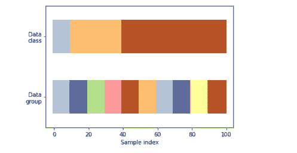

# Scikit 学习分割数据

> 原文：<https://pythonguides.com/scikit-learn-split-data/>

[](https://sharepointsky.teachable.com/p/python-and-machine-learning-training-course)

在这个 [Python 教程](https://pythonguides.com/learn-python/)中，我们将学习**Scikit learn Split data 如何在 Python 中工作**。我们还将介绍与 Scikit learn 分割数据相关的不同示例。此外，我们将涵盖这些主题。

*   Scikit 学习分割数据
*   Scikit 学习分离训练测试索引
*   Scikit 学习按组划分
*   Scikit 学习拆分 K 折叠
*   Scikit 学习分割数据策略
*   Scikit 学习分割时间序列
*   Scikit 学习分离训练测试值

如果您不熟悉 Scikit learn，我们建议您阅读[什么是 Python 中的 Scikit Learn](https://pythonguides.com/what-is-scikit-learn-in-python/)。

目录

[](#)

*   [Scikit 学习分割数据](#Scikit_learn_Split_data "Scikit learn Split data")
*   [Scikit 学习分割列车测试指数](#Scikit_learn_Split_train_test_index "Scikit learn Split train test index")
*   [Scikit 按组学习拆分](#Scikit_learn_Split_by_group "Scikit learn Split by group")
*   [Scikit 学习分割 k 线折叠](#Scikit_learn_Split_K_fold "Scikit learn Split K fold")
*   [Scikit 学习分割数据策略](#Scikit_learn_Split_data_strategy "Scikit learn Split data strategy")
*   [Scikit 学习分割时间序列](#Scikit_learn_Split_time_series "Scikit learn Split time series")
*   [Scikit 学习分割列车测试值](#Scikit_learn_Split_train_test_Val "Scikit learn Split train test Val")

## Scikit 学习分割数据

在本节中，我们将了解**Scikit learn 如何在 python 中分割数据**。

Scikit learn split data frame 用于将数据拆分为训练和测试数据集 `split()` 函数用于拆分数据，它调用输入数据进行数据拆分。

**代码:**

在下面的代码中，我们导入了一些库，从中我们可以将数据帧分成训练和测试数据集。

*   x，y = num.arange(10)。reshape((5，2))，range(5) 用于排列数据。
*   `array=()` 用于定义数组。
*   `list(y)` 用于打印屏幕上的数据列表。
*   **x_train，x_test，y_train，y_test = train_test_split(x，y，test_size=0.33，random_state=42)** 用于将数据帧拆分为训练和测试数据集。
*   **train_test_split(y，shuffle=False)** 用于拆分数据。

```py
import numpy as num
from sklearn.model_selection import train_test_split
x, y = num.arange(10).reshape((5, 2)), range(5)
x
array=([[1, 2],
       [3, 4],
       [5, 6],
       [7, 8],
       [9, 10]])
list(y)
x_train, x_test, y_train, y_test = train_test_split(
    x, y, test_size=0.33, random_state=42)

x_train
train_test_split(y, shuffle=False)
```

**输出:**

运行上面的代码后，我们得到下面的输出，其中我们可以看到数据帧被分成训练和测试数据集。


Scikit learn split data

阅读: [Scikit 学习图像处理](https://pythonguides.com/scikit-learn-image-processing/)

## Scikit 学习分割列车测试指数

在本节中，我们将了解**sci kit 如何学习分割训练测试 intext 在 python 中的工作方式**。

Scikit 学习分割列车测试索引用于将列车测试数据分割成列车测试索引，以找到列车测试分割。 `split()` 函数用于将数据分割成一个列车文本索引。

**代码:**

在下面的代码中，我们将导入一些库，从中我们可以拆分训练测试索引拆分。

*   **x = num.array([[2，3]，[4，5]，[6，7]，[8，9]，[4，5]，[6，7]])** 用于创建数组。
*   **random shuffle = shuffles split(n _ splits = 5，test_size=.25，random_state=0)** 用于拆分数据。
*   **对于 train_index，randomshuffle.split(x)中的 test _ index:**用于将数据集拆分成训练测试索引。
*   **打印(" TRAIN:"，train_index，" TEST:"，test_index)** 用于打印列车测试指标数据。

```py
import numpy as num
from sklearn.model_selection import ShuffleSplit
x = num.array([[2, 3], [4, 5], [6, 7], [8, 9], [4, 5], [6, 7]])
y = num.array([1, 2, 1, 2, 1, 2])
randomshuffle = ShuffleSplit(n_splits=5, test_size=.25, random_state=0)
randomshuffle.get_n_splits(x)
print(randomshuffle)
for train_index, test_index in randomshuffle.split(x):
       print("TRAIN:", train_index, "TEST:", test_index)
```

**输出:**

运行上面的代码后，我们得到下面的输出，其中我们可以看到数据分为训练和测试索引两部分。


scikit learn split train test index

阅读: [Scikit 学习非线性](https://pythonguides.com/scikit-learn-non-linear/)

## Scikit 按组学习拆分

在本节中，我们将了解**Scikit learn split by group 如何在 python 中工作**。

*   Scikit learn split group by 用于分割数据并将数据分组。
*   我们可以使用 `train_test_split()` 函数，从中我们可以将数据分成训练集和测试集。

**代码:**

在下面的代码中，我们导入了一些库，从中我们可以按组分割数据。

*   `iris = load_iris()` 用于加载虹膜数据。
*   `x = iris.data` 用于导入 x 的值。
*   **x_train，x_test，y_train，y_test = train_test_split(x，y，test_size = 0.6)** 用于将数据拆分为训练和测试数据集。
*   `print(Counter(y_train))` 用于打印 y 列车组的值。
*   **打印(Counter(y_test))** 用于打印 y 测试组的数据。

```py
from collections import Counter
import numpy as num

from sklearn.datasets import load_iris

from sklearn.model_selection import train_test_split

iris = load_iris()

x = iris.data
y = iris.target

x_train, x_test, y_train, y_test = train_test_split(x, y, test_size = 0.6)

print(Counter(y_train))

print(Counter(y_test))
```

**输出:**

在下面的输出中，我们可以看到 y 训练组数据和 y 测试组数据被打印在屏幕上。


Scikit learn split by group

阅读: [Scikit 学习 KNN 教程](https://pythonguides.com/scikit-learn-knn-tutorial/)

## Scikit 学习分割 k 线折叠

在这一节中，我们将了解**Scikit 如何在 python 中学习 split Kfold 的工作方式**。

*   Scikit learn split Kfold 用于将数据默认拆分为 K 个连续的折叠，而不会被数据打乱。
*   借助于 `train_test_split()` 方法，数据集被分成两部分训练数据和测试数据。

**代码:**

在下面的代码中，我们将导入一些库，从中我们可以将数据集分成 K 个连续的折叠。

*   `num.random.seed(1338)` 用于生成随机数。
*   `n_splits = 6` 用于将数据分割成六部分。
*   **percentiles_classes = [0.1，0.3，0.6]** 用于生成分组数据。
*   **group = num . h stack([[ii]* 10 for ii in range(10)])**用于平均分割组。
*   **图，axis = plot.subplots()** 用于绘制图。
*   `axis.set()` 用于设置屏幕上的轴。

```py
from sklearn.model_selection import (
    TimeSeriesSplit,
    KFold,
    ShuffleSplit,
    StratifiedKFold,
    GroupShuffleSplit,
    GroupKFold,
    StratifiedShuffleSplit,
    StratifiedGroupKFold,
)
import numpy as num
import matplotlib.pyplot as plot
from matplotlib.patches import Patch

num.random.seed(1338)
cmap_data = plot.cm.Paired
cmap_cv = plot.cm.coolwarm
n_splits = 6

n_points = 100
x = num.random.randn(100, 10)

percentiles_classes = [0.1, 0.3, 0.6]
y = num.hstack([[ii] * int(100 * perc) for ii, perc in enumerate(percentiles_classes)])

group = num.hstack([[ii] * 10 for ii in range(10)])

def visualizegroup(classes, group, name):

    figure, axis = plot.subplots()
    axis.scatter(
        range(len(group)),
        [0.5] * len(group),
        c=group,
        marker="_",
        lw=60,
        cmap=cmap_data,
    )
    axis.scatter(
        range(len(group)),
        [3.5] * len(group),
        c=classes,
        marker="_",
        lw=60,
        cmap=cmap_data,
    )
    axis.set(
        ylim=[-1, 5],
        yticks=[0.5, 3.5],
        yticklabels=["Data\ngroup", "Data\nclass"],
        xlabel="Sample index",
    )

visualizegroup(y, group, "no groups")
```

**输出:**

在下面的输出中，我们可以看到，默认情况下，数据集被分割成 K 个连续的文件夹，没有任何数据混排。



Scikit learn split K fold

阅读: [Scikit 学习情绪分析](https://pythonguides.com/scikit-learn-sentiment-analysis/)

## Scikit 学习分割数据策略

在本节中，我们将了解**Scikit 如何学习 python 中的分割数据策略**。

*   Scikit learn 拆分数据策略用于将数据集拆分为训练数据和测试数据。
*   训练数据用于将数据拟合到模型中，测试数据用于评估拟合数据。
*   我们可以借助 `train_test_split()` 方法拆分训练和测试数据。

**代码:**

在下面的代码中，我们将导入一些库，从中我们可以拆分数据策略。

*   `range = num . random . random state(0)`用于生成随机数。
*   **y = range . poisson(lam = NP . exp(x[:，5]) / 2)** 用于与多个零相关的正整数目标。
*   **x_train，x_test，y_train，y_test = train_test_split(x，y，random_state=range)** 用于将数据拆分为训练和测试数据。
*   **glm.fit(x_train，y_train)** 用于拟合数据。
*   **打印(glm.score(x_test，y_test))** 用于打印分数。
*   **num proc = make _ pipeline(simple imputr(strategy = " median ")，StandardScaler())** 用于从数据集制作管道。
*   **gbdt _ no _ CST = histgradientsboostingregressor()。fit(x，y)** 用于拟合 histgradient boosting 回归模型。
*   `display = plot _ partial _ dependency()`用于在图形上绘制数据。
*   **display.axes_[0，0]。plot()** 用于在屏幕上显示坐标轴。

```py
import numpy as num
from sklearn.model_selection import train_test_split
from sklearn.linear_model import PoissonRegressor
from sklearn.ensemble import HistGradientBoostingRegressor

nsamples, nfeatures = 1000, 20
range = num.random.RandomState(0)
x = range.randn(nsamples, nfeatures)

y = range.poisson(lam=np.exp(x[:, 5]) / 2)
x_train, x_test, y_train, y_test = train_test_split(x, y, random_state=range)
glm = PoissonRegressor()
gbdt = HistGradientBoostingRegressor(loss="poisson", learning_rate=0.01)
glm.fit(x_train, y_train)
gbdt.fit(x_train, y_train)
print(glm.score(x_test, y_test))
print(gbdt.score(x_test, y_test))
from sklearn import set_config
from sklearn.pipeline import make_pipeline
from sklearn.preprocessing import OneHotEncoder, StandardScaler
from sklearn.impute import SimpleImputer
from sklearn.compose import make_column_transformer
from sklearn.linear_model import LogisticRegression

set_config(display="diagram")

numproc = make_pipeline(SimpleImputer(strategy="median"), StandardScaler())

catproc = make_pipeline(
    SimpleImputer(strategy="constant", fill_value="missing"),
    OneHotEncoder(handle_unknown="ignore"),
)

preprocessor = make_column_transformer(
    (numproc, ("feat1", "feat3")), (catproc, ("feat0", "feat2"))
)

classifier = make_pipeline(preprocessor, LogisticRegression())
classifier
import scipy
import numpy as num
from sklearn.model_selection import train_test_split
from sklearn.cluster import KMeans
from sklearn.datasets import make_blobs
from sklearn.metrics import completeness_score

range = num.random.RandomState(0)
x, y = make_blobs(random_state=range)
x = scipy.sparse.csr_matrix(x)
x_train, x_test, _, y_test = train_test_split(x, y, random_state=range)
kmeans = KMeans(algorithm="elkan").fit(x_train)
print(completeness_score(kmeans.predict(x_test), y_test))
import numpy as num
from matplotlib import pyplot as plot
from sklearn.model_selection import train_test_split
from sklearn.inspection import plot_partial_dependence
from sklearn.ensemble import HistGradientBoostingRegressor

nsamples = 500
range = num.random.RandomState(0)
x = range.randn(nsamples, 2)
noise = range.normal(loc=0.0, scale=0.01, size=nsamples)
y = 5 * x[:, 0] + num.sin(10 * num.pi * x[:, 0]) - noise

gbdt_no_cst = HistGradientBoostingRegressor().fit(x, y)
gbdt_cst = HistGradientBoostingRegressor(monotonic_cst=[1, 0]).fit(x, y)

display = plot_partial_dependence(
    gbdt_no_cst,
    x,
    features=[0],
    feature_names=["feature 0"],
    line_kw={"linewidth": 4, "label": "unconstrained", "color": "tab:red"},
)
plot_partial_dependence(
    gbdt_cst,
    x,
    features=[0],
    line_kw={"linewidth": 4, "label": "constrained", "color": "tab:cyan"},
    ax=display.axes_,
)
display.axes_[0, 0].plot(
    x[:, 0], y, "o", alpha=0.5, zorder=-1, label="samples", color="tab:orange"
)
display.axes_[0, 0].set_ylim(-3, 3)
display.axes_[0, 0].set_xlim(-1, 1)
plot.legend()
plot.show()
```

**输出:**

运行上面的代码后，我们得到下面的输出，我们可以看到数据集是用他们的数据策略分割的。


Scikit learn split data strategy

阅读: [Scikit 学习梯度下降](https://pythonguides.com/scikit-learn-gradient-descent/)

## Scikit 学习分割时间序列

在这一节中，我们将了解**Scikit learn split time series 如何在 python 中工作**。

Scikit 学习分割时间序列用于训练和测试数据，以固定的时间间隔分割时间。

**代码:**

在下面的代码中，我们将导入一些库，从中我们可以拆分时间序列数据。

*   **图，axis = plot.subplots(figsize=(14，6))** 用于绘制图。
*   **average week _ demand = data frame . group by([" weekday "，" hour"])。mean()["count"]** 用于统计平均周需求。
*   `average week _ demand . plot(ax = axis)= axis . set()`用于在图形上绘制坐标轴。
*   `time series _ cv = timeseries split()`用于拆分时间序列数据。
*   **X.iloc[test_0]** 用于按位置选择数据。

```py
from sklearn.datasets import fetch_openml

bikesharing = fetch_openml("Bike_Sharing_Demand", version=2, as_frame=True)
dataframe = bikesharing.frame
import matplotlib.pyplot as plot

figure, axis = plot.subplots(figsize=(14, 6))
averageweek_demand = dataframe.groupby(["weekday", "hour"]).mean()["count"]
averageweek_demand.plot(ax=axis)
_ = axis.set(
    title="Average Bike Demand During the week",
    xticks=[i * 24 for i in range(7)],
    xticklabels=["Sun", "Mon", "Tue", "Wed", "Thu", "Fri", "Sat"],
    xlabel="Time of the week",
    ylabel="Number of bike rentals",
)
y = dataframe["count"] / dataframe["count"].max()
figure, axis = plot.subplots(figsize=(14, 6))
y.hist(bins=30, ax=axis)
_ = axis.set(
    xlabel="Fraction of rented fleet demand",
    ylabel="Number of hours",
)
x = dataframe.drop("count", axis="columns")
x
from sklearn.model_selection import TimeSeriesSplit

timeseries_cv = TimeSeriesSplit(
    n_splits=7,
    gap=48,
    max_train_size=10000,
    test_size=1000,
)
allsplits = list(timeseries_cv.split(x, y))
train_0, test_0 = allsplits[0]
X.iloc[test_0]
```

**输出:**

运行上面的代码后，我们得到了下面的输出，其中我们可以看到数据分割时间序列是在屏幕上完成的。


Scikit learn split time series

阅读: [Scikit 学习遗传算法](https://pythonguides.com/scikit-learn-genetic-algorithm/)

## Scikit 学习分割列车测试值

在本节中，我们将学习**Scikit 如何在 python 中学习 slit train test Val 的工作方式**。

*   Scikit learn 分割训练测试 val 用于将数据集分割为训练和测试数据，并获取训练测试分割数据的值。
*   训练数据用于将数据拟合到模型中，测试数据用于评估拟合数据。

**代码:**

在下面的代码中，我们将导入一些库，从中我们可以拆分 train test val。

*   **x_train，x_test，y_train，y _ test`= train _ test _ s`plit(x，y，random_state=0)** 用于将数据集拆分成训练测试数据。
*   **figure，axis = plot.subplots()** 用于在图形上绘制图形或坐标轴。
*   **axis.set_xlabel("有效 Alpha")** 用于在图形上绘制 x 标签。
*   **axis.set_title("总杂质与训练集的有效α")**用于在屏幕上绘制标题。

```py
import matplotlib.pyplot as plot
from sklearn.model_selection import train_test_split
from sklearn.datasets import load_breast_cancer
from sklearn.tree import DecisionTreeClassifier
x, y = load_breast_cancer(return_X_y=True)
x_train, x_test, y_train, y_test = train_test_split(x, y, random_state=0)

classifier = DecisionTreeClassifier(random_state=0)
path = classifier.cost_complexity_pruning_path(x_train, y_train)
ccpalphas, impurities = path.ccp_alphas, path.impurities
figure, axis = plot.subplots()
axis.plot(ccpalphas[:-2], impurities[:-2], marker="o", drawstyle="steps-post")
axis.set_xlabel("Effective Alpha")
axis.set_ylabel("Total Impurity Of Leaves")
axis.set_title("Total Impurity vs effective alpha for training set")
```

**输出:**

运行上面的代码后，我们得到下面的输出，其中我们可以看到屏幕上绘制的图形，还可以得到分割训练测试值。


Scikit learn split train test val

您可能还想阅读以下 Scikit 学习教程。

*   [Scikit 学习分类教程](https://pythonguides.com/scikit-learn-classification/)
*   [Scikit 学习功能选择](https://pythonguides.com/scikit-learn-feature-selection/)
*   [Scikit 学习线性回归](https://pythonguides.com/scikit-learn-linear-regression/)
*   [Scikit 学习混淆矩阵](https://pythonguides.com/scikit-learn-confusion-matrix/)
*   [Scikit 学习超参数调整](https://pythonguides.com/scikit-learn-hyperparameter-tuning/)

因此，在本教程中，我们讨论了 `Scikit learn Split data` ，我们还讨论了与其实现相关的不同示例。这是我们已经讨论过的例子列表。

*   Scikit 学习分割数据
*   Scikit 学习分离训练测试索引
*   Scikit 学习按组划分
*   Scikit 学习拆分 K 折叠
*   Scikit 学习分割数据策略
*   Scikit 学习分割时间序列
*   Scikit 学习分离训练测试值

[Bijay Kumar](https://pythonguides.com/author/fewlines4biju/)

Python 是美国最流行的语言之一。我从事 Python 工作已经有很长时间了，我在与 Tkinter、Pandas、NumPy、Turtle、Django、Matplotlib、Tensorflow、Scipy、Scikit-Learn 等各种库合作方面拥有专业知识。我有与美国、加拿大、英国、澳大利亚、新西兰等国家的各种客户合作的经验。查看我的个人资料。

[enjoysharepoint.com/](https://enjoysharepoint.com/)[](https://www.facebook.com/fewlines4biju "Facebook")[](https://www.linkedin.com/in/fewlines4biju/ "Linkedin")[](https://twitter.com/fewlines4biju "Twitter")